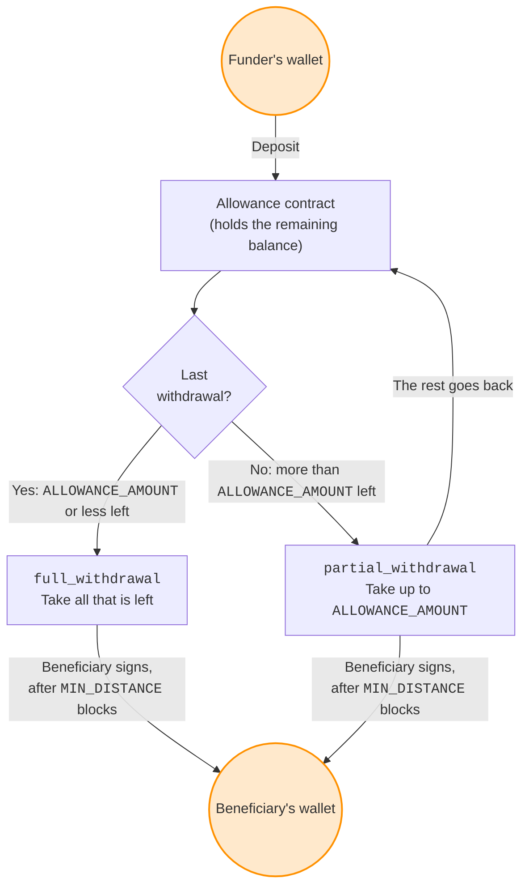

Simplicity is a low-level smart contract language for Bitcoin-like blockchains, built on a small set of functional [combinators](glossary.md#combinator) rather than a growing opcode set. Programs are statically analyzable: every contract has a resource cost that's known before you fund it, and the language's formal semantics support machine-checked proofs of contract behavior.

You write contracts in [SimplicityHL](glossary.md#simplicityhl), a higher-level language with Rust-like syntax that compiles down to Simplicity.

The tutorials on this site currently target Liquid testnet for learning purposes; production deployments run on Liquid mainnet.

<!-- ## Why Simplicity

<div class="grid cards" markdown>

- ### :material-microscope: Formally specified
  Simplicity's semantics are formally defined and suitable for machine-checked proofs, giving high assurance that the implementation matches the specification.

- ### :material-gauge: Predictable execution cost
  Every program has a statically bounded cost, known before you fund a transaction: no surprise fees, no out-of-gas failures.

- ### :material-source-branch: Introspection and covenants
  Programs can inspect the proposed transaction's inputs and outputs, enabling [covenants](glossary.md#covenant) that enforce multi-step spending policies directly on-chain. On Liquid, this extends to bound assets and amounts, alongside confidentiality at the transaction layer.

- ### :material-shield-check: A narrower attack surface
  No loops, no unbounded recursion, fully deterministic evaluation. Broad classes of runtime failure are eliminated by construction.

</div>

## Simplicity examples

<div class="grid cards" markdown>

- ### :material-lock-clock: Hash time-locked contracts (HTLCs)
  The building block for payment channels and atomic swaps. Lock funds until a secret is revealed or a timeout is reached, enabling trustless, cross-chain exchanges and Layer 2 protocols like the Lightning Network.

- ### :material-swap-horizontal-bold: Trustless atomic swaps
  Execute peer-to-peer trades of different assets across blockchains without settlement risk. Simplicity ensures that either both parties receive their assets or the trade is atomically reverted.

- ### :material-chart-line: Covered call options
  Write and settle derivatives contracts directly on-chain. A seller can lock collateral to issue a call option, which a buyer can exercise at a predetermined strike price before an expiry date, all enforced by the Simplicity program.

- ### :material-cash-lock: Collateralized loans
  Lock collateral in a Simplicity contract to borrow assets. The program guarantees that the lender can claim the collateral if the borrower defaults, or that the borrower can reclaim it upon repayment, all without a trusted intermediary.

</div> -->

## Write in a language you already know

You can use SimplicityHL, a high-level language with a clean, Rust-like syntax. This abstracts away low-level complexity, making it straightforward to write clear and reliable financial contracts with minimal code.

The contract below is an allowance: a beneficiary draws down a fixed amount at a fixed minimum interval, and every spend returns the remainder to the same address. Each withdrawal is an ordinary transaction whose first output re-creates the covenant as a fresh [UTXO](glossary.md#utxo) with a smaller balance.

```simplicityhl title="Allowance Covenant"
// An allowance covenant.
//
// A beneficiary may withdraw up to ALLOWANCE_AMOUNT, no more often
// than once every MIN_DISTANCE blocks, returning the remainder to a
// fresh copy of this same contract. Once the remaining balance is
// ALLOWANCE_AMOUNT or less, the beneficiary may take all of it and the
// covenant ends.
//
// Each UTXO at this address is an independent allowance.// (1)!
//
// Fund this address only with explicit (non-confidential) outputs.

fn checksig(pk: Pubkey, sig: Signature) {
    let msg: u256 = jet::sig_all_hash();
    jet::bip_0340_verify((pk, msg), sig);
}

fn not(bit: bool) -> bool {
    <u1>::into(jet::complement_1(<bool>::into(bit)))
}

fn same_asset(x: (Asset1, Amount1), y: (Asset1, Amount1)) -> (u64, u64) {
    // Confirm that two (asset, amount) pairs are denominated in the same
    // asset, and return their explicit amounts.// (2)!
    // Panics if either asset or either amount is confidential.
    let (x_asset, x_amount): (Asset1, Amount1) = x;
    let (y_asset, y_amount): (Asset1, Amount1) = y;
    let x_asset_id: u256 = unwrap_right::<(u1, u256)>(x_asset);// (3)!
    let y_asset_id: u256 = unwrap_right::<(u1, u256)>(y_asset);
    assert!(jet::eq_256(x_asset_id, y_asset_id));
    (unwrap_right::<(u1, u256)>(x_amount), unwrap_right::<(u1, u256)>(y_amount))
}

fn recursive_covenant() {
    // Enforce the covenant to repeat in the first output.
    //
    // Output 0: the covenant
    // Output 1: the beneficiary's withdrawal
    // Output 2: the fee (Liquid has explicit fee outputs)
    // Disallow further outputs.
    assert!(jet::eq_32(jet::num_outputs(), 3));
    let this_script_hash: u256 = jet::current_script_hash();// (4)!
    let output_script_hash: u256 = unwrap(jet::output_script_hash(0));
    assert!(jet::eq_256(this_script_hash, output_script_hash));
    assert!(unwrap(jet::output_is_fee(2)));// (5)!
}

fn full_withdrawal() -> bool {
    // Is the beneficiary currently allowed to take all of the
    // remaining funds? (return true or false)
    let (_, available_amount): (Asset1, Amount1) = jet::current_amount();
    let explicit_amount: u64 = unwrap_right::<(u1, u256)>(available_amount);
    jet::le_64(explicit_amount, param::ALLOWANCE_AMOUNT)// (6)!
}

fn partial_withdrawal() {
    // Is the beneficiary validly taking an appropriate amount of
    // the funds and returning the rest to a new instance of this
    // same contract? (panic if not)

    // Ensure some funds are being sent back to the same contract on
    // output 0.
    recursive_covenant();

    // The covenant's current balance, and the amount retained on output 0.
    // Both must be denominated in the same asset.
    let (remaining_amount, retained_amount): (u64, u64) =
        same_asset(jet::current_amount(), unwrap(jet::output_amount(0)));

    let (borrow, difference): (bool, u64) = jet::subtract_64(remaining_amount, param::ALLOWANCE_AMOUNT);// (7)!
    // Ensure calculated amount did not go negative.
    assert!(not(borrow));
    // Ensure retained amount is large enough.
    assert!(jet::le_64(difference, retained_amount));
}

fn enforce_signature(sig: Signature) {
    checksig(param::BENEFICIARY_KEY, sig);
}

fn enforce_single_input() {
    // Only one copy of this covenant may run per transaction, so
    // co-spent balances can't be taken by checking them all against
    // the same output.// (8)!
    assert!(jet::eq_32(jet::num_inputs(), 1));
}

fn enforce_relative_distance(min_distance: Distance) {
    // Assert that the current input is spent at least min_distance
    // blocks after the block containing its UTXO. Panic otherwise.// (9)!

    // Transaction version must be at least 2.
    assert!(jet::le_32(2, jet::version()));

    // Fetch and parse sequence
    let actual_data: Either<Distance, Duration> = unwrap(jet::parse_sequence(jet::current_sequence()));// (10)!
    let actual_distance: Distance = unwrap_left::<Duration>(actual_data);

    assert!(jet::le_16(min_distance, actual_distance));
}

fn enforce_time_delay() {
    enforce_relative_distance(param::MIN_DISTANCE);
}

fn main(){
    // Transactions must be signed by the beneficiary.
    enforce_signature(witness::SIGNATURE);

    // Transactions must not be too frequent.
    enforce_time_delay();

    // Only one instance of this covenant may be spent per transaction.
    enforce_single_input();

    // If the amount remaining is no more than the allowance amount,
    // the beneficiary is allowed to take all of it without sending
    // anything back to the covenant.
    match full_withdrawal() {
        true => (),
        false => partial_withdrawal(),
    }
}
```

1.  Every spend of this contract uses exactly one input (see `enforce_single_input`), so an existing instance's balance can only decrease, and a second payment to this address creates a separate allowance rather than adding to the first. Merging the two would need a separate deposit path, which this contract omits for simplicity.

2.  Comparing amounts without also checking assets is unsafe: anyone can issue a new Liquid asset carrying any amount at no cost, so an amount check on its own can be satisfied with a worthless asset. Returning the amounts from the same function that checks the assets means the amounts can't be read without the check happening.

3.  [Elements](glossary.md#elements) assets and amounts can be [confidential](glossary.md#confidential) (encrypted) or explicit; `unwrap_right` assumes explicit and panics on a confidential value, since this contract only knows how to check plaintext amounts. A confidential output sent to this contract can therefore never be spent, and its funds would be stuck permanently.

4.  A [covenant](glossary.md#covenant) restricts future spends by requiring the same script to reappear in an output; `current_script_hash` is how the contract refers to its own code to check for that.

5.  Elements (Liquid's underlying protocol) pays fees through an explicit fee output rather than Bitcoin's implicit input/output-value difference.

6.  `param::` values aren't defined in this file: they're compile-time [parameters](glossary.md#parameter) bound when the contract is instantiated, and they become part of the resulting address.

7.  Simplicity has no exceptions, so arithmetic jets like `subtract_64` return an explicit borrow flag instead of panicking or silently wrapping on underflow.

8.  If several inputs of this contract were spent together, each would check its own balance against the same output 0; only the largest check would actually bind, so the rest could be taken. Enforcing this here (rather than inside `partial_withdrawal`) makes the restriction hold on every spending path, including a full withdrawal. One consequence: since no other input is available, fees can only come out of the allowance's own balance.

9.  This replaces the deprecated `jet::check_lock_distance`.

10. Bitcoin's `nSequence` field is overloaded to encode either a block-count or a time-duration relative [timelock](glossary.md#timelock); `parse_sequence` decodes which one a transaction is using.

The beneficiary's wallet software proposes a full transaction; the Simplicity program enforces that it satisfies every condition.



