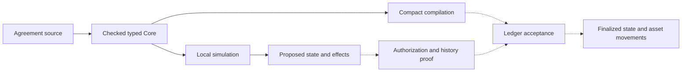

# Moriarty

Moriarty is an experimental language and toolchain for **bounded financial contracts on Midnight**. Developers describe financial state, permitted actions, payment obligations and authorization rules. The goal is to compile those descriptions into Compact and require each transaction to carry a proof that its execution and the contract history it extends satisfy the agreement.

You can currently author and simulate contracts, inspect their effects, and generate restricted Compact execution kernels. Proof-carrying financial settlement is still under development. This repository is not a production SDK or an audited deployment.

## Financial semantics above Compact

Compact supports Midnight contracts and zero-knowledge circuits. Moriarty adds rules for financial operations: which asset an amount denotes, how interest rounds, when a payment becomes due, what a participant has authorized, and which obligations survive a transaction.

Developers express these rules in Moriarty’s domain-specific language (DSL). Its compiler and evaluator share a typed representation of the agreement. The intended proof system then connects that representation to the state changes and asset movements accepted by the ledger.

For a loan, calculating interest is only part of the work. A payment must discharge the correct debt, reach the authorized creditor and preserve the remaining principal. It must also resist replay. These requirements connect the agreement’s rules to its history and the ledger.

## Financial behavior defines the language

The financial design draws on the following work:

- **ACTUS**, the Algorithmic Contract Types Unified Standards, describes financial contracts through rules for events, state transitions and cash flows. It supplies reference behavior for obligations such as interest, principal repayment and maturity. Moriarty must reproduce the relevant financial behavior, including dates and rounding; naming a contract type is not enough.
- **The DeFi kernel study** is the project’s catalogue of decentralized-finance behaviors: swaps, liquidity, lending and composition. The [study](deliverables/moriarty-design-sprint-2026-09-06/README.md) supplies implementation and conformance requirements; applications do not connect to it as a runtime service.
- **Marlowe** is a financial-contract DSL designed to make contract behavior amenable to analysis. Moriarty adopts the goal of reasoning about an agreement before execution and is developing its authoring, proof and settlement architecture for Midnight.

The common language must accommodate both scheduled financial obligations and transactions authorized by desired outcomes. The [financial target study](deliverables/moriarty-design-sprint-2026-09-06/README.md) explains the source behaviors and their relationship to the proposed semantics. Full conformance remains unfinished.

## What a developer writes

An agreement is a source program; a contract instance gives that program its own state and participant bindings. An agreement declares typed state, observations, actions and effects. Actions contain guards, local calculations, state updates and explicit financial effects. Policies associate financial calculations with their rounding rules and required correctness claims.

An **obligation** is a duty that survives a transaction, such as an unpaid amount due. An **effect** records an action’s financial result: a transfer, fee, newly created due or settlement of a due. Recording an effect in the simulator does not move ledger assets.

**Observations** are external inputs such as time or a price. An instance’s initial configuration binds each observation to a provider and authentication policy. The demo uses a simulated clock; real observation authentication remains unfinished.

Amounts have named units. An amount of one asset cannot be added to another asset accidentally. Intermediate arithmetic is checked, including multiplication before division; overflow rejects rather than wrapping. Settlement bindings specify how nominal amounts convert into ledger asset quantities.

For example, this excerpt from the [swap agreement](experiments/moriarty-language/spec/examples/swap.moriarty) calculates output from pool reserves, applies a fee factor and checks the trader's minimum output:

```text
let effective_input = arg.amount_in * const.fee_numerator;
let numerator = effective_input * state.reserve_b;
let denominator = state.reserve_a * const.fee_denominator + effective_input;
let output_calculated = floor_div(numerator, denominator);
```

```text
guard arg.min_out <= output_calculated, "minimum output not met";
```

`arg`, `state` and `const` refer to action arguments, instance state and declared constants; `let` introduces an action-local value. Multiplication and division combine units, while addition and comparison require compatible types and units.

The complete agreement supplies the declarations, policies, remaining guards, state updates and transfers. The supplied loan and swap examples are bounded reference scenarios with fixed expectations, rather than deployable lending products or general-purpose exchanges. A policy's named proof claim is a requirement to discharge, not a proof merely because it appears in the source.

### Finite execution

Moriarty is designed to be Turing-incomplete. The current language has no loop construct or source recursion. Its registered profile bounds values, intermediate arithmetic, expression depth, collection sizes, work per action, contract lifetime and time horizon. Successive actions consume the contract's remaining execution allowance. At exhaustion, further actions reject. The frontend admits the exact registered [bounds document](experiments/moriarty-language/spec/bounds.json) by content hash; editing its limits or even reformatting its JSON is not a supported configuration change.

Execution limits do not cancel financial obligations. The loan example separates creating amounts due from settling them. Its demonstrated episode closes after those dues are settled, with 4,500 USD of principal still outstanding. Continuing that agreement requires an explicit mechanism that preserves obligations and lifecycle constraints; that continuation is not implemented.

These limits make termination and resource obligations explicit. They do not automatically prove that a financial agreement is correct, that all states are practical to enumerate, or that its proof fits a particular circuit. Those are separate claims to establish.

### Exact plans and outcome intents

Authorization has two forms:

- An **exact plan** fixes the action, state writes and effects that a participant authorizes.
- An **outcome intent** permits a plan to be chosen within constraints: maximum gross spending, minimum net receipts, allowed actions, recipients and calls. A solver is the component that proposes such a plan.

The local evaluator checks these constraints. Refunds do not erase gross spending, and fees count when checking net receipts. Cryptographic authorization and durable replay protection still need to be connected to ledger acceptance; the demo supplies simulated authentication.

## From source to settlement

The intended workflow is:



Solid arrows show the implemented path. Dashed arrows show the proof and settlement integrations still to build.

The **Core** is the compiler's explicit representation of the agreement's operations. Source locations, semantic versions, canonical encodings and hashes connect it to the source and registered bounds. The evaluator derives a candidate state, obligation changes and ordered effects from that representation.

The current Compact mapper translates a restricted subset into pure execution kernels. The generated kernels are pure Compact circuits with no persistent ledger declarations or witness functions. They take state, arguments, observations, lifecycle allowances and arithmetic hints as inputs, then return the next numeric state and effect operands. The circuits constrain the hints; supplying a quotient or multiplication limb does not make it trusted. Their test wrappers store results for comparison; they do not move assets or implement the full acceptance protocol. Persistent text, text observations and lowering of the source `and`/`or` operators are among the current mapping restrictions. See the [mapping contract](experiments/moriarty-language/compact/MAPPING.md).

The remaining settlement adapter must bind those calculations to actual ledger inputs, outputs, custody and recipients. Comparing a final balance alone is insufficient: every relevant debit, credit, fee, change output and obligation must be accounted for.

## Proof-carrying transactions

**Proof-carrying data (PCD)** means a piece of data carries evidence that it was produced according to specified rules, including the validity of the predecessor data it depends on. For Moriarty, that data is a contract transition: the previous state, authorized action, observations, next state and effects.

The intended acceptance rule requires evidence of:

- **Contract properties:** the agreement's declared invariants hold over their stated domain.
- **Intent refinement:** the chosen execution stays within the participant's authorization.
- **Transition validity:** the next state and effects follow the contract semantics.
- **History compliance:** the predecessors originate from an allowed initial state and extend a compliant history.

In the intended protocol, deployment policy fixes the permitted claim specifications and verifier/key versions. The participant’s signed authorization commits to the mandatory claims. Acceptance must reject missing evidence, unsupported mandatory claims and unresolved dependencies. A prover cannot choose a permissive verifier or remove a signed requirement. Enforcement in the ledger acceptance path remains unimplemented.

Recursive proofs are the proposed mechanism for checking predecessor proofs inside a new proof. Recursion in the proof system does not add unbounded recursion to the source language. Each construction still needs explicit execution and composition bounds.

A valid history proof does not establish that an external price is true or that a previous state has not already been spent. Observation authentication, ledger consumption, transaction ordering and finality remain separate responsibilities. Likewise, zero-knowledge capability does not by itself provide private witness handoff between participants.

The project has not yet produced a native recursive Moriarty proof. The [native experiment](experiments/moriarty-native-ivc-r3/) uses Midnight’s Halo2-based incrementally verifiable computation (IVC) backend. Its prepared encoding constrains a fixed loan scenario to known states; it does not yet prove the general Moriarty transition relation. Connecting its complete verifier to Midnight's ledger verifier is an unresolved engineering boundary; a host-computed verification flag cannot substitute for that connection. The [PCD design](docs/research/2026-09-06-pcd-report-integration.md) and [verifier interface analysis](evidence/moriarty-completion-program-2026-09-07/MC04/wrapper-interface-source-02/README.md) describe these obligations.

## Try the local developer workflow

Use **Node.js 24**. The source simulator has no npm runtime dependencies and requires no wallet, faucet or network connection.

```sh
git clone https://github.com/CharlesHoskinson/Moriarty.git
cd Moriarty
npm --prefix experiments/moriarty-language run demo
```

The command needs no dependency installation or TypeScript compiler. The demo reads the actual [loan](experiments/moriarty-language/spec/examples/loan.moriarty) and [swap](experiments/moriarty-language/spec/examples/swap.moriarty) source files. It shows candidate transitions and rejected actions. To inspect complete structured inputs and results:

```sh
node experiments/moriarty-language/examples/simulate.mjs --json
```

The swap output includes:

```text
Transfer: 10000 AssetA_quantum
Transfer: 19743 AssetB_quantum
adverse input: GUARD_FAILED; acceptance without proof: PROOF_INVALID
```

Those rejection messages are expected. The demo deliberately tampers with an input and attempts acceptance without a proof backend.

In the JSON output, `genesis` is the initial instance configuration, `state` carries the revision and state hash, `action` holds its name and arguments, and `authority` contains the exact plan or outcome constraints. A candidate transition contains the derived writes, obligations and ordered effects.

Simulation does not sign, prove, submit or consume a ledger state. The acceptance entry point rejects without its required backend; that backend has not been supplied as a production implementation.

### Check an agreement of your own

The frontend exposes JavaScript APIs rather than a standalone language CLI. Save this as `check-agreement.mjs` in the repository root:

```js
import {readFileSync} from 'node:fs';
import {check} from './experiments/moriarty-language/src/frontend.ts';

const result = check(
  readFileSync(process.argv[2]),
  readFileSync('experiments/moriarty-language/spec/bounds.json')
);
console.log(JSON.stringify(result, null, 2));
if ('code' in result) process.exitCode = 1;
```

```sh
node check-agreement.mjs experiments/moriarty-language/spec/examples/loan.moriarty
```

Pass your own source file in place of the example. `check` returns a typed program or a diagnostic with a code and source span. `parse` returns the source tree, and `elaborate` returns the bound Core program. Simulating a new agreement also requires constructing its instance configuration, action inputs and authority; the demo script shows those API calls.

### Inspect the generated Compact

Read the committed [loan kernel](experiments/moriarty-language/compact/generated/loan/kernel.compact) or [swap kernel](experiments/moriarty-language/compact/generated/swap/kernel.compact), or regenerate them with Node.js:

```sh
node experiments/moriarty-language/compact/materialize-mapping.mjs
```

The generated files are under `experiments/moriarty-language/compact/generated/`. To compile and check them, use Python 3, an installed `tsc`, Compact compiler **0.31.1** with language **0.23.0**, and Compact runtime **0.16.0**:

```sh
python3 experiments/moriarty-language/compact/verify-mapping.py \
  --runtime-node-modules /path/to/node_modules \
  --output /tmp/moriarty-compact-check
```

Replace `/path/to/node_modules` with the directory containing `@midnight-ntwrk/compact-runtime` at that version. This check compiles with `--skip-zk` and generates no proving keys or proofs. Running the language package’s `build` or `typecheck` scripts also requires an installed `tsc`.

For the remaining frontend APIs and tests, continue with the [language package guide](experiments/moriarty-language/README.md). The [browser developer mock](experiments/moriarty-developer-mock/README.md) explores the proposed user flows with simulated authority and certificates; it is a separate prototype, not a browser frontend for the source compiler.

## What remains to build

The complete [roadmap](ROADMAP.md) lists the implementation sequence, acceptance criteria and remaining checks, with links to the maintained [research wiki](wiki/index.md).

| Area | Available now | Required next |
| --- | --- | --- |
| Language | Bounded grammar, types, canonical encoding, evaluator and executable reference examples | Complete implementation review and extend the semantics for all required financial cases |
| Compilation | Restricted source-derived Compact kernels and local result comparisons | Full effect mapping and compiler-to-ledger correspondence |
| Network integration | Local Docker environment and a finalized hello-world deployment/call on Preview | Real loan and swap transfers with complete finalized-effect comparison |
| Recursive proofs | Native backend investigation and a prepared checked encoding | Produce and independently verify retained recursive proofs |
| Acceptance | Local semantic checks and interfaces that reject without a backend | Enforce all mandatory claims, authorization and replay protection in the actual ledger path |
| Privacy and composition | Specified handoff and composition requirements | Private witness transfer, proved split/join and preservation of residual obligations |
| Financial coverage | ACTUS and DeFi source requirements and representative local cases | Full behavioral conformance, including the held-out cases |

Preview is the public integration target. Existing network transactions establish connectivity and basic contract operation, not Moriarty financial settlement or proof acceptance. The [completion plan](openspec/MORIARTY-COMPLETION-PROGRAM.md) defines the dependencies and evidence required to close these gaps.

## Research vault

The repository also serves as the agents’ research vault. The [vault overview](wiki/overview.md) and [research index](wiki/index.md) connect findings to their sources and decisions. The [vault guide](docs/OBSIDIAN.md) explains the WSL setup and agent workflow; Obsidian is an optional viewer.

## Repository guide

- [`experiments/moriarty-language/`](experiments/moriarty-language/): authoring language, evaluator, source examples and Compact mapping.
- [`experiments/moriarty-developer-mock/`](experiments/moriarty-developer-mock/): browser prototypes for developer interactions.
- [`experiments/moriarty-native-ivc-r3/`](experiments/moriarty-native-ivc-r3/): native recursive-proof experiments.
- [`experiments/moriarty-midnight-network/`](experiments/moriarty-midnight-network/): local and Preview network integration.
- [`wiki/`](wiki/index.md), [`docs/`](docs/) and [`deliverables/`](deliverables/): concepts, design rationale and financial source studies.
- [`openspec/`](openspec/MORIARTY-COMPLETION-PROGRAM.md): planned capabilities and acceptance requirements.
- [`evidence/`](evidence/) and [`raw/`](raw/): scoped experimental records and retained source material. Historical results keep their original limitations.

Superseded implementations and execution campaigns are available in the [historical archive](docs/ARCHIVE.md).
