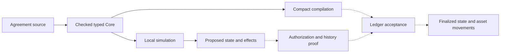

# Moriarty

Moriarty is an experimental language and toolchain for **bounded financial contracts on Midnight**. Developers describe financial state, permitted actions, payment obligations and authorization rules. The goal is to compile those descriptions into Compact and require each transaction to carry a proof that its execution and the contract history it extends satisfy the agreement.

You can currently author and simulate contracts, inspect their effects, and generate restricted Compact execution kernels. The bounded [loan](deliverables/sp05-financial-integration-2026-09-09/preview-loan-01/RESULT.md) and [swap](deliverables/sp05-financial-integration-2026-09-09/preview-swap-01/RESULT.md) examples have executed on Midnight Preview with independently checked native transfers and historical state. Mandatory proof-carrying financial settlement is still under development. This repository is not a production SDK or an audited deployment.

**Midnight Preview is a hard acceptance gate.** Each supported financial capability needs execution on Preview, retained transaction IDs, finalized native effects and state readback checked against the language semantics. Local tests and compiled artifacts support that evidence. They do not close the network gate; mandatory proof and history checks must also pass before release.

## Financial semantics above Compact

Compact supports Midnight contracts and zero-knowledge circuits. Moriarty adds rules for financial operations: which asset an amount denotes, how interest rounds, when a payment becomes due, what a participant has authorized, and which obligations survive a transaction.

Developers express these rules in Moriarty’s domain-specific language (DSL). Its compiler and evaluator share a typed representation of the agreement. The intended proof system then connects that representation to the state changes and asset movements accepted by the ledger.

For a loan, calculating interest is only part of the work. A payment must discharge the correct debt, reach the authorized creditor and preserve the remaining principal. It must also resist replay. These requirements connect the agreement’s rules to its history and the ledger.

## Financial behavior defines the language

The financial design draws on the following work:

- **ACTUS**, the Algorithmic Contract Types Unified Standards, describes financial contracts through rules for events, state transitions and cash flows. It supplies reference behavior for obligations such as interest, principal repayment and maturity. Moriarty must reproduce the relevant financial behavior, including dates and rounding; naming a contract type is not enough.
- **The DeFi kernel study** is the project’s catalogue of decentralized-finance behaviors: swaps, liquidity, lending and composition. The [study](deliverables/moriarty-design-sprint-2026-09-06/README.md) supplies implementation and conformance requirements; applications do not connect to it as a runtime service.
- **Marlowe** is a financial-contract DSL designed to make contract behavior amenable to analysis. Moriarty adopts the goal of reasoning about an agreement before execution and is developing its authoring, proof and settlement architecture for Midnight.

The common language must accommodate both scheduled financial obligations and transactions authorized by desired outcomes. The [financial target study](deliverables/moriarty-design-sprint-2026-09-06/README.md) explains the source behaviors and their relationship to the proposed semantics. Full conformance remains unfinished.

## Language specification and formal semantics

Moriarty source files use the **`.mori`** extension. The specification separates what a program looks like from what it means:

| Layer | Specification method | What it defines |
| --- | --- | --- |
| Lexical structure | Separate token rules and regular expressions | Identifiers, literals, whitespace, comments and source locations |
| Syntax | EBNF using the ISO/IEC 14977 notation for the provisional successor profile | Valid combinations of declarations, actions and expressions |
| Static semantics | Typing and scoping judgments, illustrated by `Γ ⊢ e : τ` | Name resolution, asset units, resource use and admissible bounds |
| Dynamic semantics | Executable operational semantics in the K Framework | State transitions, financial effects, obligations and rejection |
| Correctness claims | Explicit properties over those semantics | What must be established about an agreement, execution and history |

[EBNF](https://www.iso.org/standard/26153.html) extends BNF with notation for repetition and optionality. It describes the grammar; it does not decide whether the source resembles Lisp or a language with braces. [ABNF, RFC 5234](https://datatracker.ietf.org/doc/html/rfc5234), is another BNF-family notation used for protocol specifications. Moriarty selects EBNF for its source grammar.

[K](https://kframework.org/docs/user_manual/) describes execution through configurations and rewrite rules. It is the selected framework for Moriarty's formal operational semantics. Typing judgments define admissible programs; contract properties and Hoare-style assertions state claims to prove. Denotational models can support particular financial analyses, but do not replace the execution definition.

The existing [atomic grammar](experiments/moriarty-language/spec/grammar.ebnf) and TypeScript evaluator use `moriarty-bounded-atomic/1`. The separate [successor syntax profile](experiments/moriarty-language/spec/successor/README.md) provides lexical rules, a parser and a formatter for `moriarty-successor-syntax/0`. Its grammar is reproduced below. These profiles are not interchangeable: the loan, swap and Compact workflow later in this README use the atomic profile.

The [bounded repayment K definition](experiments/moriarty-language/formal/k/README.md) supports Transfer-only execution as well as Transfer followed by Repay. The Transfer-only extension is tracked in [its scoped evidence](deliverables/transfer-only-k-2026-09-09/README.md). All 16 frozen cases match the independent financial expectations and the real `.mori` source preparation result, including complete accepted state/effects and exact rejection code/index. [Execution evidence](deliverables/bounded-k-2026-09-09/README.md) records the limited projection, failed attempts and checks.

The [reviewed expression specification](deliverables/sp01-expression-contract-2026-09-10/RESULT.md) now defines all 40 proposed constructors, their typing and reduction rules, and exact representations for finite byte/node bounds. GPT-6 Astra and Grok 4.6 approved that source scope. The [reviewed Boolean revision](deliverables/sp01-surface-core-contract-2026-09-10/RESULT.md) adds short-circuit And/Or rules and valid rejection spans while preserving the original source evidence. The full financial-operation, signing and history contract still needs completion.

The separate [executable expression runtime](deliverables/sp02-expression-runtime-2026-09-10/RESULT.md) now implements all 40 Core constructors and has independent GPT-6 and Grok approval. It checks types before execution, uses exact integer arithmetic, evaluates Boolean branches selectively and publishes no tentative state after rejection. Run `node deliverables/sp02-expression-runtime-2026-09-10/demo-01.mjs` to observe an accepted update and a rejected Ensure. Callers currently supply Core directly; full `.mori` elaboration and K correspondence remain open.

The successor semantic freeze and full SP02/SP03 acceptance remain open. A K definition also needs correspondence arguments connecting it to the evaluator, Compact compiler, proof relation and Midnight ledger acceptance. Archived ZKIR K work does not establish Moriarty semantics.

### Successor source grammar (EBNF)

This is the complete syntax grammar for **`moriarty-successor-syntax/0`**, reproduced from the [canonical EBNF](experiments/moriarty-language/spec/successor/grammar.ebnf). The parser is implemented. This provisional profile still omits constructs required by the full roadmap; its successor semantic contract remains unfrozen.

The grammar uses **Extended Backus–Naur Form (EBNF)** with ISO/IEC 14977 notation. Production names use letters and digits; they are names in this specification, not Moriarty source keywords.

| Notation | Meaning |
| --- | --- |
| `=` and `;` | Define and end a production |
| `,` | Concatenation: match items in order |
| `\|` | Alternatives: match one choice |
| `[ ... ]` | Optional: zero or one occurrence |
| `{ ... }` | Repetition: zero or more occurrences |
| `( ... )` | Group an EBNF expression |
| `"..."` | Literal source text |
| `? ... ?` | A token or EOF condition defined by the lexical specification |
| `(* ... *)` | A comment in the grammar specification |

Quoted punctuation denotes Moriarty source text. Unquoted punctuation above belongs to EBNF; source comments instead use `//` or `/* ... */`.

```ebnf
(*
  ISO/IEC 14977 EBNF for moriarty-successor-syntax/0.
  Provisional syntax profile; parser implemented. Not a semantic freeze.
  Concatenation is comma. Alternation is vertical bar.
  Square brackets are optional. Braces are zero or more repetition.
  Quoted text is a terminal. A special sequence names a lexical token
  defined in lexical.md. Every nonterminal used below is defined here
  or is such a lexical token.
*)

program = profileDecl, agreementDecl, ? end of file ? ;

profileDecl = "profile", stringToken, ";" ;

agreementDecl = "agreement", identifier, "{", { declaration }, "}" ;

declaration = unitDecl
            | partyDecl
            | assetDecl
            | constDecl
            | stateDecl
            | actionDecl ;

unitDecl = "unit", identifier, ";" ;

partyDecl = "party", identifier, ";" ;

assetDecl = "asset", identifier, ":", type, ";" ;

constDecl = "const", identifier, ":", type, "=", expression, ";" ;

stateDecl = "state", identifier, ":", type, "=", expression, ";" ;

actionDecl = "action", identifier, "(", [ parameters ], ")",
              "{", { statement }, { postcondition }, "}" ;

parameters = parameter, { ",", parameter } ;

parameter = identifier, ":", type ;

statement = requirement | binding | update | emission ;

requirement = "requires", expression, ";" ;

binding = "let", identifier, "=", expression, ";" ;

update = "next", ".", identifier, "=", expression, ";" ;

emission = "emit", type, "{", [ effectFields ], "}", ";" ;

effectFields = effectField, { ",", effectField } ;

effectField = identifier, ":", expression ;

postcondition = "ensures", expression, ";" ;

type = identifier, [ typeArgs ] ;

typeArgs = "<", type, { ",", type }, ">" ;

expression = disjunction ;

disjunction = conjunction, { "or", conjunction } ;

conjunction = negation, { "and", negation } ;

negation = { "not" }, comparison ;

comparison = sum, [ comparisonOp, sum ] ;

comparisonOp = "==" | "!=" | "<" | "<=" | ">" | ">=" ;

sum = product, { ( "+" | "-" ), product } ;

product = postfix, { "*", postfix } ;

postfix = primary, { ".", identifier } ;

primary = integerToken
        | stringToken
        | "true"
        | "false"
        | identifier, [ "(", [ arguments ], ")" ]
        | "(", expression, ")" ;

arguments = expression, { ",", expression } ;

identifier = ? ASCII identifier token defined in lexical.md ? ;

integerToken = ? canonical unsigned decimal token defined in lexical.md ? ;

stringToken = ? JSON string token defined in lexical.md ? ;

(* Grammar interpretation and additional admission constraints:
   1. The source contains exactly one profileDecl and one agreementDecl.
   2. The profile string must be the characters moriarty-successor-syntax/0.
   3. Unparenthesized a < b < c is rejected. (a < b) < c and a < (b < c)
      are syntactically admitted; their typing is a separate check.
   4. typeArgs is nonempty. Foo<> is not a type.
   5. Parentheses do not create AST nodes. They only group.
   6. not binds looser than comparison: not a == b parses as not (a == b).
   7. or, and, +, -, and * associate to the left.
   8. Call arguments, parameters, and effect fields have no trailing comma.
   9. function, import, loop, obligation, request, composition, observation,
      settlement, policy, status, reserve, and effect-schema forms are not
      productions of this profile.
  10. Bounds in syntax-profile.json are simultaneous and not part of EBNF.
*)
```

The [lexical specification](experiments/moriarty-language/spec/successor/lexical.md) defines the referenced tokens and their source spans. Identifiers match `[A-Za-z][A-Za-z0-9_]*`, are case-sensitive, and cannot be keywords. Integers are canonical unsigned decimals (`0` or a nonzero digit followed by digits); strings use JSON escapes and must decode to Unicode scalar values. Only ASCII space, tab, CR and LF separate tokens as whitespace. Source comments use `//` or non-nesting `/* ... */`; a bare `/` is not an operator. Input must be valid UTF-8, with no BOM stripping or Unicode normalization.

The fixed [syntax bounds](experiments/moriarty-language/spec/successor/syntax-profile.json) apply together: 65,536 source UTF-8 bytes, 64 ASCII characters per identifier, 1,024 decoded UTF-8 bytes per string, 78 digits per integer, 8,192 tokens including EOF, 8,192 AST nodes, nesting depth 64, 256 declarations, 256 statements per action including `ensures`, and 64 entries per parameter, call-argument or effect-field list. These parser limits are separate from the atomic execution bounds and from financial runtime limits.

Syntax acceptance does not imply execution. The [bounded funded source profile](experiments/moriarty-language/spec/successor/funded-source.md), `moriarty-funded-source/0`, uses this same source header through a separate preparation API. It supports a typed subset of unit, party, asset and action declarations with explicit `Transfer` and `Repay` emissions, producing local `Prepared` candidates. It rejects state and const declarations, `requires`, `let`, `next`, `ensures`, projections and operators, although those forms appear in this grammar. Its numeric values are limited to UInt128. The [funded example](experiments/moriarty-language/spec/successor/examples/funded-partial-payment.mori) exercises that subset; the separate [syntax-only example](experiments/moriarty-language/spec/successor/examples/partial-payment.mori) does not implement a funded payment. Neither parsing nor local preparation establishes authorization, a proof, ledger acceptance or source/Core/K correspondence.

### Small-step semantics (implemented repayment subset)

This presentation uses **Felleisen–Hieb reduction semantics**: terms, evaluation contexts, primitive contractions, context closure and terminal answers. Felleisen and Hieb's [*Revised Report*](https://plv.mpi-sws.org/plerg/papers/felleisen-hieb-92-2up.pdf), §2 Definitions 2.1/2.3 and §3.1, supplies the presentation method; its metatheorems are not claims about Moriarty. The [downloaded open textbooks and Redex corpus](deliverables/reduction-semantics-textbooks-2026-09-09/CORPUS.md) and [source-linked practices](deliverables/reduction-semantics-textbooks-2026-09-09/BEST-PRACTICES.md) provide further references.

The [K definition](experiments/moriarty-language/formal/k/moriarty.k) implements the provisional **`moriarty-funded-repayment/0`** projection: one Transfer, optionally followed by one Repay; two initial balances, one allowance, one obligation and empty used-ID lists. It supports `AccrualFirst`, `PrincipalFirst` and `ProRata`, with explicit `none`, `floor` or `ceil` conversion rounding. The [numeric extension's evidence](deliverables/numeric-k-2026-09-09/README.md) records its execution and review status. Full successor expressions, arbitrary action sequences and correspondence proofs remain open.

The codec admits closed records and canonical UInt128 fields. K checks positive conversion mantissa and scale at most 18 before reaching the stage that computes powers or division. Invalid financial values such as zero mantissa or a huge scale reach K and reject; malformed records and unsupported collection/action shapes stop at the codec. Raw K terms outside this admitted domain are not covered.

**Terms and contexts.** `P` is a packet and `H` its codec-supplied digest. `s,r` are sender/receiver row indices (`−1` means absent). `x,q,u,c,v` are intermediate integers. `ε` is empty computation, `▷` sequencing, and `□` one context hole. This is explanatory notation, not raw K syntax.

```text
Instruction a ::= start(P) | inspect(P,s,r) | ensure(H,b,code,i)
                | convert(P,s,r) | divide(P,s,r,x) | round(P,s,r,q,u)
                | fund(P,s,r,c) | allocate(P,s,r,c) | split(P,s,r,c)
                | finishT(P,s,r) | finishR(P,s,r,c,v)
Computation k ::= ε | a | k ▷ k
Context     E ::= □ | E ▷ k
Program     t ::= run_H(k) | prepared(H,F) | rejected(H,code,i)
```

Sequences are identified up to associativity and the two unit equations `ε ▷ k = k = k ▷ ε`, so contexts select the first pending instruction and retain its suffix. There is no `k ▷ E` context that skips an unfinished instruction, and no context enters packet data or terminal answers. Only programs reachable from `run_H(start(P))` for admitted `P` are in the domain.

**Pure helpers and guards.** Within a repayment rule, `n` is nominal payment, `m` conversion mantissa, `ℓ` scale, `ρ` rounding mode, `p,a` principal/accrued debt, `T` transferred cash and `λ` allocation rule, all read from `P`. Let `U = 2^128 − 1` and write `g(b,code)` for `ensure(H,b,code,1)`. `R(ρ,q,u)` returns `q`, except that ceil with nonzero remainder returns `q+1`. `DP(λ,n,p,a)` is:

```text
AccrualFirst:   n − min(n,a)
PrincipalFirst: min(n,p)
ProRata:       floor(n*p / (p+a))
```

The ProRata helper is used only after a positive outstanding obligation and a fitting `n*p` product have passed their guards. Integer division therefore has a positive denominator. Helpers abstract internal K equational steps; they are not financial action-work charges.

**Primitive contractions.** `checks(P,s,r)` contains 15 ordered guards for Transfer-only or 21 initial guards for repayment. `tail(P,s,r)` is `finishT` or `convert`, respectively. Both are exact instruction-list abbreviations, not new program constructors.

```text
start(P) ↝ inspect(P,sender(P),receiver(P))                         (START)
inspect(P,s,r) ↝ checks(P,s,r) ▷ tail(P,s,r)                       (EXPAND)
ensure(H,true,code,i) ↝ ε                                        (CHECK)

convert(P,s,r)
  ↝ g(n*m ≤ U,OVERFLOW) ▷ divide(P,s,r,n*m)                       (CONVERT)
divide(P,s,r,x)
  ↝ round(P,s,r,x div 10^ℓ,x mod 10^ℓ)                           (DIVIDE)
round(P,s,r,q,u)
  ↝ g(ρ ≠ none or u = 0,INEXACT_CONVERSION)
    ▷ fund(P,s,r,R(ρ,q,u))                                      (ROUND)
fund(P,s,r,c)
  ↝ g(c ≤ U,OVERFLOW) ▷ g(c > 0,DUST)
    ▷ g(c ≤ T,INSUFFICIENT_UNALLOCATED) ▷ allocate(P,s,r,c)       (FUND)
allocate(P,s,r,c)
  ↝ g(λ ≠ ProRata or n*p ≤ U,OVERFLOW) ▷ split(P,s,r,c)          (ALLOCATE)
split(P,s,r,c)
  ↝ g(DP(λ,n,p,a) ≤ p and n−DP(λ,n,p,a) ≤ a,ALLOCATION_COMPONENT)
    ▷ finishR(P,s,r,c,DP(λ,n,p,a))                               (SPLIT)
```

The stage boundaries matter: a huge scale cannot trigger exponentiation before its state guard, and a product that exceeds UInt128 cannot be divided first to obtain an apparently fitting answer. The definition uses K instructions, rather than eager numeric helpers over the whole future continuation, for these boundaries.

**Contextual and terminal reductions.** `→` is generated by context closure and the following whole-program rules. ABORT discards the entire continuation, including finalization; rejected output has no tentative state or effects.

```text
                      a ↝ k'
  ---------------------------------------------                 (CONTEXT)
  run_H(E[a]) → run_H(E[k'])

  run_H(E[ensure(H,false,code,i)])
    → rejected(H,code,i)                                        (ABORT)

  run_H(finishT(P,s,r)) → prepared(H,FT(P,s,r))                   (PREPARE-T)
  run_H(finishR(P,s,r,c,v)) → prepared(H,FR(P,s,r,c,v))           (PREPARE-R)
```

`FT` and `FR` abbreviate the exact distinct scalar records returned by K's `preparedTransfer` and `prepared` constructors. Both include the input digest and receiver index. The codec reconstructs complete unchanged metadata and ordered effects. For Transfer-only, unchanged debt and allocation history are copied by the codec: they are not separately computed debt outputs or a proved K invariant. No context reduces inside `prepared` or `rejected`.

Checks run in this order; the [K rules](experiments/moriarty-language/formal/k/moriarty.k) specify every predicate.

| Stage | Ordered checks | Error index |
| --- | --- | --- |
| State | Distinct balance keys; allowance sum; positive conversion mantissa and scale ≤18; debt sum/status; total work including reserve | `−1` (decoded as null) |
| Work | Ordinary remaining work covers one or two actions; spent work can increase by that count | `−1` |
| Transfer | Positive amount; distinct parties; sender exists and covers cash; exact allowance exists and covers cash; allowance-spent and receiver additions fit | `0` |
| Repay, when present | Positive nominal amount; matching obligation; outstanding status; nominal ≤ outstanding; prior transfer ID; matching payer/creditor/asset | `1` |
| Conversion | Product fits; `none` has zero remainder; rounded amount fits and is positive; converted cash ≤ transferred cash | `1` |
| Allocation | ProRata product fits; discharged principal/accrual fit their existing components | `1` |

A successful Transfer-only moves cash and gross allowance, appends only its Transfer ID, emits one Transfer and charges **one action-work unit**. It preserves the complete obligation, including a settled ProRata obligation, because no allocation occurs. A non-creditor recipient is legal for this operation.

A successful repayment charges **two action-work units**, emits Transfer then Repayment, and appends both IDs. With computed settlement `c` and principal discharge `v`, the obligation becomes `p′=p−v`, `a′=a−(n−v)`, `o′=p+a−n`, Settled iff `o′=0`. Only nominal `n` discharges debt; cash `T` and settlement `c` have distinct roles. Closure reserve is unchanged.

For example, ProRata with principal 100, accrued 10 and nominal payment 7 gives `v=floor(700/110)=6`, leaving principal 94, accrued 9 and outstanding 103. At mantissa 3, scale 1 and floor rounding, settlement is `floor(21/10)=2`: transferring 2 can fund that nominal payment. `none` would reject the same fractional conversion; floor producing zero cash rejects DUST.

**Presentation bound.** Assuming pure helper termination on the admitted domain, successful Transfer-only takes **18 control steps** (START, EXPAND, 15 guards, PREPARE-T). Successful repayment takes **37** (eight stage contractions, 28 guards, PREPARE-R). Rejection ends at its first false guard and discards the remaining stages. Unlike the earlier single-expansion presentation, the failure step count depends on which numeric stages were reached. These are control-presentation counts, not internal K rewrites, execution fees or a mechanized termination proof.

The [initial execution](deliverables/bounded-k-2026-09-09/README.md), [additional repayment branches](deliverables/repayment-k-branches-2026-09-09/README.md), and [Transfer-only extension](deliverables/transfer-only-k-2026-09-09/README.md) retain their original source-bound evidence and earlier control counts. The numeric suite combines all 42 prior distinct inputs with 22 new independent cases. Finite comparisons do not establish full source/Core/K correspondence, SP03 completion, mandatory PCD or finalized financial settlement. `Prepared` remains a local proposal, not authorization or Midnight acceptance.

## What a developer writes

The following examples and local workflow use `moriarty-bounded-atomic/1`; consult the successor profiles above for their separate syntax and funded subset.

An agreement is a source program; a contract instance gives that program its own state and participant bindings. An agreement declares typed state, observations, actions and effects. Actions contain guards, local calculations, state updates and explicit financial effects. Policies associate financial calculations with their rounding rules and required correctness claims.

An **obligation** is a duty that survives a transaction, such as an unpaid amount due. An **effect** records an action’s financial result: a transfer, fee, newly created due or settlement of a due. Recording an effect in the simulator does not move ledger assets.

**Observations** are external inputs such as time or a price. An instance’s initial configuration binds each observation to a provider and authentication policy. The demo uses a simulated clock; real observation authentication remains unfinished.

Amounts have named units. An amount of one asset cannot be added to another asset accidentally. Intermediate arithmetic is checked, including multiplication before division; overflow rejects rather than wrapping. Settlement bindings specify how nominal amounts convert into ledger asset quantities.

For example, this excerpt from the [swap agreement](experiments/moriarty-language/spec/examples/swap.mori) calculates output from pool reserves, applies a fee factor and checks the trader's minimum output:

```text
let effective_input = arg.amount_in * const.fee_numerator;
let numerator = effective_input * state.reserve_b;
let denominator = state.reserve_a * const.fee_denominator + effective_input;
let output_calculated = floor_div(numerator, denominator);
```

```text
guard arg.min_out <= output_calculated, "minimum output not met";
```

`arg`, `state` and `const` refer to action arguments, instance state and declared constants; `let` introduces an action-local value. Multiplication and division combine units, while addition and comparison require compatible types and units.

The complete agreement supplies the declarations, policies, remaining guards, state updates and transfers. The supplied loan and swap examples are bounded reference scenarios with fixed expectations, rather than deployable lending products or general-purpose exchanges. A policy's named proof claim is a requirement to discharge, not a proof merely because it appears in the source.

### Finite execution

Moriarty is designed to be Turing-incomplete. The current language has no loop construct or source recursion. Its registered profile bounds values, intermediate arithmetic, expression depth, collection sizes, work per action, contract lifetime and time horizon. Successive actions consume the contract's remaining execution allowance. At exhaustion, further actions reject. The frontend admits the exact registered [bounds document](experiments/moriarty-language/spec/bounds.json) by content hash; editing its limits or even reformatting its JSON is not a supported configuration change.

Execution limits do not cancel financial obligations. The loan example separates creating amounts due from settling them. Its demonstrated episode closes after those dues are settled, with 4,500 USD of principal still outstanding. Continuing that agreement requires an explicit mechanism that preserves obligations and lifecycle constraints; that continuation is not implemented.

These limits make termination and resource obligations explicit. They do not automatically prove that a financial agreement is correct, that all states are practical to enumerate, or that its proof fits a particular circuit. Those are separate claims to establish.

### Exact plans and outcome intents

Authorization has two forms:

- An **exact plan** fixes the action, state writes and effects that a participant authorizes.
- An **outcome intent** permits a plan to be chosen within constraints: maximum gross spending, minimum net receipts, allowed actions, recipients and calls. A solver is the component that proposes such a plan.

The local evaluator checks these constraints. Refunds do not erase gross spending, and fees count when checking net receipts. Cryptographic authorization and durable replay protection still need to be connected to ledger acceptance; the demo supplies simulated authentication.

## From source to settlement

The intended workflow is:



Solid arrows show the implemented path. Dashed arrows show the proof and settlement integrations still to build.

The **Core** is the compiler's explicit representation of the agreement's operations. Source locations, semantic versions, canonical encodings and hashes connect it to the source and registered bounds. The evaluator derives a candidate state, obligation changes and ordered effects from that representation.

The current Compact mapper translates a restricted subset into pure execution kernels. The generated kernels are pure Compact circuits with no persistent ledger declarations or witness functions. They take state, arguments, observations, lifecycle allowances and arithmetic hints as inputs, then return the next numeric state and effect operands. The circuits constrain the hints; supplying a quotient or multiplication limb does not make it trusted. Their test wrappers store results for comparison; they do not move assets or implement the full acceptance protocol. Persistent text, text observations and lowering of the source `and`/`or` operators are among the current mapping restrictions. See the [mapping contract](experiments/moriarty-language/compact/MAPPING.md).

The remaining settlement adapter must bind those calculations to actual ledger inputs, outputs, custody and recipients. Comparing a final balance alone is insufficient: every relevant debit, credit, fee, change output and obligation must be accounted for.

## Proof-carrying transactions

**Proof-carrying data (PCD)** means a piece of data carries evidence that it was produced according to specified rules, including the validity of the predecessor data it depends on. For Moriarty, that data is a contract transition: the previous state, authorized action, observations, next state and effects.

The intended acceptance rule requires evidence of:

- **Contract properties:** the agreement's declared invariants hold over their stated domain.
- **Intent refinement:** the chosen execution stays within the participant's authorization.
- **Transition validity:** the next state and effects follow the contract semantics.
- **History compliance:** the predecessors originate from an allowed initial state and extend a compliant history.

In the intended protocol, deployment policy fixes the permitted claim specifications and verifier/key versions. The participant’s signed authorization commits to the mandatory claims. Acceptance must reject missing evidence, unsupported mandatory claims and unresolved dependencies. A prover cannot choose a permissive verifier or remove a signed requirement. Enforcement in the ledger acceptance path remains unimplemented.

Recursive proofs are the proposed mechanism for checking predecessor proofs inside a new proof. Recursion in the proof system does not add unbounded recursion to the source language. Each construction still needs explicit execution and composition bounds.

A valid history proof does not establish that an external price is true or that a previous state has not already been spent. Observation authentication, ledger consumption, transaction ordering and finality remain separate responsibilities. Likewise, zero-knowledge capability does not by itself provide private witness handoff between participants.

The project has not yet produced a native recursive Moriarty proof. The [native experiment](experiments/moriarty-native-ivc-r3/) uses Midnight’s Halo2-based incrementally verifiable computation (IVC) backend. Its prepared encoding constrains a fixed loan scenario to known states; it does not yet prove the general Moriarty transition relation. Connecting its complete verifier to Midnight's ledger verifier is an unresolved engineering boundary; a host-computed verification flag cannot substitute for that connection. The [PCD design](docs/research/2026-09-06-pcd-report-integration.md) and [verifier interface analysis](evidence/moriarty-completion-program-2026-09-07/MC04/wrapper-interface-source-02/README.md) describe these obligations.

## Try the local developer workflow

Use **Node.js 24**. The source simulator has no npm runtime dependencies and requires no wallet, faucet or network connection.

```sh
git clone https://github.com/CharlesHoskinson/Moriarty.git
cd Moriarty
npm --prefix experiments/moriarty-language run demo
```

The command needs no dependency installation or TypeScript compiler. The demo reads the actual [loan](experiments/moriarty-language/spec/examples/loan.mori) and [swap](experiments/moriarty-language/spec/examples/swap.mori) source files. It shows candidate transitions and rejected actions. To inspect complete structured inputs and results:

```sh
node experiments/moriarty-language/examples/simulate.mjs --json
```

The swap output includes:

```text
Transfer: 10000 AssetA_quantum
Transfer: 19743 AssetB_quantum
adverse input: GUARD_FAILED; acceptance without proof: PROOF_INVALID
```

Those rejection messages are expected. The demo deliberately tampers with an input and attempts acceptance without a proof backend.

In the JSON output, `genesis` is the initial instance configuration, `state` carries the revision and state hash, `action` holds its name and arguments, and `authority` contains the exact plan or outcome constraints. A candidate transition contains the derived writes, obligations and ordered effects.

Simulation does not sign, prove, submit or consume a ledger state. The acceptance entry point rejects without its required backend; that backend has not been supplied as a production implementation.

### Check an agreement of your own

The frontend exposes JavaScript APIs rather than a standalone language CLI. Save this as `check-agreement.mjs` in the repository root:

```js
import {readFileSync} from 'node:fs';
import {check} from './experiments/moriarty-language/src/frontend.ts';

const result = check(
  readFileSync(process.argv[2]),
  readFileSync('experiments/moriarty-language/spec/bounds.json')
);
console.log(JSON.stringify(result, null, 2));
if ('code' in result) process.exitCode = 1;
```

```sh
node check-agreement.mjs experiments/moriarty-language/spec/examples/loan.mori
```

Pass your own source file in place of the example. `check` returns a typed program or a diagnostic with a code and source span. `parse` returns the source tree, and `elaborate` returns the bound Core program. Simulating a new agreement also requires constructing its instance configuration, action inputs and authority; the demo script shows those API calls.

### Inspect the generated Compact

Read the committed [loan kernel](experiments/moriarty-language/compact/generated/loan/kernel.compact) or [swap kernel](experiments/moriarty-language/compact/generated/swap/kernel.compact), or regenerate them with Node.js:

```sh
node experiments/moriarty-language/compact/materialize-mapping.mjs
```

The generated files are under `experiments/moriarty-language/compact/generated/`. To compile and check them, use Python 3, an installed `tsc`, Compact compiler **0.31.1** with language **0.23.0**, and Compact runtime **0.16.0**:

```sh
python3 experiments/moriarty-language/compact/verify-mapping.py \
  --runtime-node-modules /path/to/node_modules \
  --output /tmp/moriarty-compact-check
```

Replace `/path/to/node_modules` with the directory containing `@midnight-ntwrk/compact-runtime` at that version. This check compiles with `--skip-zk` and generates no proving keys or proofs. Running the language package’s `build` or `typecheck` scripts also requires an installed `tsc`.

For the remaining frontend APIs and tests, continue with the [language package guide](experiments/moriarty-language/README.md). The [browser developer mock](experiments/moriarty-developer-mock/README.md) explores the proposed user flows with simulated authority and certificates; it is a separate prototype, not a browser frontend for the source compiler.

## What remains to build

The [DeFi action study and language proposal](deliverables/defi-language-design-2026-09-07/README.md) connect financial reference behaviors to the proposed syntax and K semantics.

The complete [roadmap](ROADMAP.md) lists the implementation sequence, acceptance criteria and remaining checks, with links to the maintained [research wiki](wiki/index.md).

| Area | Available now | Required next |
| --- | --- | --- |
| Language | Bounded grammar, types, canonical encoding, evaluator and executable reference examples | Complete implementation review and extend the semantics for all required financial cases |
| Compilation | Restricted source-derived Compact kernels and local result comparisons | Full effect mapping and compiler-to-ledger correspondence |
| Network integration | Reviewed Preview loan and swap effects; [corrected swap command](deliverables/sp05-financial-integration-2026-09-09/preview-swap-exit-01/RESULT.md) also has retained exit zero, bounded native fee comparison and separate containment | Loan raw-exit gap, remaining financial coverage and mandatory PCD acceptance |
| Recursive proofs | Native backend investigation and a prepared checked encoding | Produce and independently verify retained recursive proofs |
| Acceptance | Local semantic checks and interfaces that reject without a backend | Enforce all mandatory claims, authorization and replay protection in the actual ledger path |
| Privacy and composition | Specified handoff and composition requirements | Private witness transfer, proved split/join and preservation of residual obligations |
| Financial coverage | ACTUS and DeFi source requirements and representative local cases | Full behavioral conformance, including the held-out cases |

Midnight Preview execution is a hard release gate. The reviewed Preview loan establishes a bounded first-period test-asset payment with residual principal; the swap establishes a trade and reserve withdrawal at close. The original audits preserve each raw wrapper `FAILED`/driver `INCOMPLETE` record. A later [corrected swap run](deliverables/sp05-financial-integration-2026-09-09/preview-swap-exit-01/RESULT.md) has both audits accepting its financial effects, actual command exit zero and separately observed containment. The corrected Preview loan’s missing raw exit remains unresolved. A later [local loan command](deliverables/sp05-financial-integration-2026-09-09/local-command-execution-proposal-01/loan/RESULT.md) completed with independently reviewed exit-zero and cleanup evidence; its later [read-only historical-state capture](deliverables/sp05-financial-integration-2026-09-09/local-command-execution-proposal-01/loan/historical-readback-01/RESULT.md) resolved that local evidence gap with both scoped financial-result reviews. Complete SP05 reconciliation, full financial coverage and mandatory PCD acceptance remain open. The [completion plan](openspec/MORIARTY-COMPLETION-PROGRAM.md) defines the dependencies and evidence required to close these gaps.

## Research vault

The repository also serves as the agents’ research vault. The [vault overview](wiki/overview.md) and [research index](wiki/index.md) connect findings to their sources and decisions. The [vault guide](docs/OBSIDIAN.md) explains the WSL setup and agent workflow; Obsidian is an optional viewer.

## Agent startup

Agents working in this repository must load `moriarty-dev:develop` on every new
session and restore it after resume or compaction. Follow the
[startup procedure in AGENTS.md](AGENTS.md#required-startup-load-the-development-plugin),
including the guarded status command. Hosts without plugin discovery read the
[checked-in skill](plugins/moriarty-dev/skills/develop/SKILL.md) directly and use
the same CLI. This applies to research and reviews as well as implementation;
the user's current request determines the work.

## Repository guide

- [`experiments/moriarty-language/`](experiments/moriarty-language/): authoring language, evaluator, source examples and Compact mapping.
- [`experiments/moriarty-developer-mock/`](experiments/moriarty-developer-mock/): browser prototypes for developer interactions.
- [`experiments/moriarty-native-ivc-r3/`](experiments/moriarty-native-ivc-r3/): native recursive-proof experiments.
- [`experiments/moriarty-midnight-network/`](experiments/moriarty-midnight-network/): local and Preview network integration.
- [`wiki/`](wiki/index.md), [`docs/`](docs/) and [`deliverables/`](deliverables/): concepts, design rationale and financial source studies.
- [`openspec/`](openspec/MORIARTY-COMPLETION-PROGRAM.md): planned capabilities and acceptance requirements.
- [`evidence/`](evidence/) and [`raw/`](raw/): scoped experimental records and retained source material. Historical results keep their original limitations.

Superseded implementations and execution campaigns are available in the [historical archive](docs/ARCHIVE.md).
