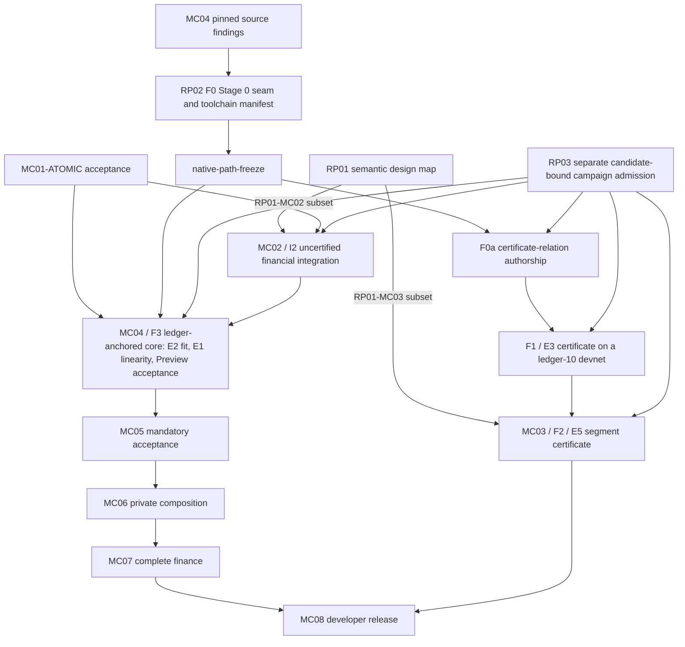

# Moriarty roadmap

Moriarty is a Midnight-centric language for bounded financial contracts and proof-carrying transactions. Developers should be able to express a financial agreement, inspect its possible effects, authorize an outcome, prove a valid transition and settle it on Midnight. Each accepted transition must preserve the contract's rules, signed intent and compliant predecessor history.

Compact, Midnight native proofs, private state and ledger acceptance constrain the language design. Preview is the public development network. ACTUS supplies standardized financial events and cash flows; the DeFi corpus supplies protocol behaviors and adversarial cases. Examples from other chains are financial references, not additional backend deliverables.

**Hard release gate: Moriarty must work end to end on Midnight Preview.** Programs compiled from Moriarty source must produce actual financial transactions whose finalized state and complete effects match independent expectations. Retain the source/profile/compiler bindings, submitted transaction bytes and IDs, canonical finality, exact readback and current independent audits. SP05 must demonstrate both loan and swap settlement; SP09 must demonstrate verification-enabled mandatory acceptance; SP11 and SP12 must satisfy their full behavior coverage and release obligations. Local tests, local settlement, hello-world receipts and source reviews cannot close this gate. It remains open until the required Preview evidence exists. The user's September 10 instruction makes this requirement non-negotiable; a blocked Midnight interface does not authorize changing the target or weakening acceptance.

This is the complete current roadmap. [OpenSpec](openspec/MORIARTY-COMPLETION-PROGRAM.md) contains detailed package contracts; the [machine register](openspec/moriarty-completion-program.json) records scoped status and dependencies. The [three-report reconciliation](openspec/REPORT-RECONCILIATION-2026-09-07.md) defines the early decisions and staged proof admission. Editing these plans neither completes a package nor arms an execution loop.

## Grok review reliability

- [ ] [Diagnose and fix Grok review timeouts](docs/GROK-TIMEOUTS.md). Three SP05 attempts consumed about 18 minutes without a final verdict; token usage is unknown. Preserve missing-review gates and continue independent eligible product work.

## Refined delivery roadmap

The [asset-study integration](openspec/ASSET-STUDY-INTEGRATION-2026-09-09.md) adds eleven required implementation obligations and eight acceptance cases across the existing sprints. The [task crosswalk](openspec/sprints/asset-study.json) covers asset/claim transformations, encumbrances, operation-specific policies, exceptional authority, servicing, identity/privacy and history. Supported profiles require Docker testing followed by separately admitted Midnight Preview evidence. These obligations are open; the research does not establish implemented language features.

The [Midnight-native PCD roadmap](openspec/PCD-ROADMAP-2026-09-11.md) turns the [September 11 PCD architecture report](deliverables/pcd-midnight-native-2026-09-11/REPORT.md) into nine staged gates and five ordered experiments. The [PCD integration amendment](openspec/PCD-INTEGRATION-2026-09-11.md) adopts it into this roadmap as specified-only planning: ledger-anchored certified state with bounded native certificates replaces per-transaction recursive history. Atomic F3 now rests on the Stage 0 seam, SP04 and SP06 deliver certificates, and the [PCD change package](openspec/changes/pcd-ledger-anchored-acceptance/README.md) adds eighteen requirements to MC03–MC06. Verification-enabled mandatory Preview acceptance stays the hard gate, and certificate campaigns need a reviewed resource amendment.

The [September 9 refinement](openspec/ROADMAP-REFINEMENT-2026-09-09.md) incorporates the PCD/intents reports, four-paper taxonomy, vault report, modern standards atlas and orchestration postmortems. It preserves all original OpenSpec requirements and gates. The [report crosswalk](openspec/sprints/report-lessons.json) assigns eighteen lesson groups, TX01–TX12, VX01–VX06, all 24 modern cases and three identified source gaps to existing tasks. Research classifications become explicit acceptance obligations, never proof or network evidence.

| Sprint | Deliverable | Decisive completion evidence |
| --- | --- | --- |
| [SP01](openspec/sprints/sp01-financial-contract-and-execution-admission.md) | Freeze behavior and reuse accepted foundations | Complete behavior/source/authority crosswalk; current atomic evidence retained; bounded native go/no-go. |
| [SP02](openspec/sprints/sp02-complete-mori-authoring-frontend.md) | Finish the language contract and authoring tools | Full lexical/EBNF/static specification plus working check/format and matched syntax study. |
| [SP03](openspec/sprints/sp03-executable-bounded-semantics-in-k.md) | Make K execute the financial distinctions | Runnable K/evaluator agreement and discharged base-domain semantic/correspondence claims. |
| [SP04](openspec/sprints/sp04-complete-native-verifier-component-feasibility.md) | Decide whether bounded native certificates work on the ledger | E3 certificate controls on a `ledger-10` devnet, including ledger-side accumulator pairing. |
| [SP05](openspec/sprints/sp05-financial-integration-on-preview.md) | Finalize actual financial loan and swap effects on Preview | Both loan and swap finalized on Preview with complete independently checked effects. |
| [SP06](openspec/sprints/sp06-real-recursive-financial-history.md) | Produce and independently verify an off-ledger segment certificate | E5 segment certificates at 1, 10 and 100 steps; retained bytes verified in a fresh process and mutations rejected. |
| [SP07](openspec/sprints/sp07-actus-obligations-and-lifecycle-semantics.md) | Implement ACTUS without losing debt or fields | All 277 ACTUS fixtures/all fields, 18 executable types and 32 source-backed dispositions. |
| [SP08](openspec/sprints/sp08-defi-actions-and-outcome-intents.md) | Implement behavior-driven DeFi and intent libraries | All 72 DeFi rows, DA24, intent/request lifecycles and report-derived modeled regressions. |
| [SP09](openspec/sprints/sp09-mandatory-pcd-and-ledger-correspondence.md) | Require complete proof and authority at ledger acceptance | All four mandatory claim families discharged by the fused step relation and ledger induction, proved correspondence and verification-enabled Preview acceptance. |
| [SP10](openspec/sprints/sp10-private-handoff-and-bounded-composition.md) | Prove private handoff and all five composition operators | Isolated recipient-keyed handoff, ledger-atomic split/join, cross-contract release and reclaim, and all five composition operators through acceptance. |
| [SP11](openspec/sprints/sp11-full-financial-and-formal-conformance.md) | Qualify the complete financial and formal scope | Every required behavior qualified across semantics, proof, local and required Preview evidence. |
| [SP12](openspec/sprints/sp12-developer-release-and-reproducible-evidence.md) | Release something developers can use and reproduce | Usable end-to-end flow, two clean builders, two non-toy pilots and every G01–G24 gate. |

Start four eligible tracks: **SP01→SP02→SP03** for language, **SP01 F0→SP09.1** for the ledger-anchored core, **SP01 F0→SP04→SP06** for bounded native certificates, and **accepted atomic + loan/swap subset→SP05** for financial Preview integration. SP09.1 atomic F3 joins SP05 and the Stage 0 seam early without waiting for certificates; the full successor joins after SP07/SP08. Then SP10→SP11→SP12. Use the exact stage prerequisites below, not whole-sprint barriers.

The next successor demonstration is a `.mori` partial payment that preserves its residual obligation in Core, K and the evaluator. The bounded Preview [loan](deliverables/sp05-financial-integration-2026-09-09/preview-loan-01/RESULT.md) and [swap](deliverables/sp05-financial-integration-2026-09-09/preview-swap-01/RESULT.md) now have both independent result audits. The [admission-bound cumulative native DUST comparison](deliverables/sp05-financial-integration-2026-09-09/preview-fee-comparison-01/RESULT.md) is implemented with both source reviews. The [Preview command-completion correction](deliverables/sp05-financial-integration-2026-09-09/preview-exit-completion-01/RESULT.md) also has both source reviews. The [corrected Preview loan run](deliverables/sp05-financial-integration-2026-09-09/preview-loan-exit-01/RESULT.md) has both independent financial result approvals and emitted `FINANCIAL_COMPLETE`, with separate outer containment observed. Its transient service unloaded before the raw main-process exit was captured; that missing evidence keeps the command exit-zero gate open. The [corrected Preview swap](deliverables/sp05-financial-integration-2026-09-09/preview-swap-exit-01/RESULT.md) now has both independent approvals for its financial effects, actual zero exit and separate containment. Both cases have consumed their two public attempts; a further attempt requires an explicit reviewed amendment. The original launchers exited one, and the later swap success does not repair the loan’s missing raw exit. Mandatory verification-enabled Preview acceptance remains a later hard gate. The missing current accounting/operational history blocks its dependent campaign dispatch, not this planning work or unrelated eligible development. No new runner, loop, dashboard or approval bureaucracy is part of this refinement.

## Sprint delivery plan

The [twelve OpenSpec sprints](openspec/sprints/README.md) schedule the complete roadmap: financial design and admission; source language; K semantics; certificate feasibility; Preview financial integration; segment certificates; ACTUS; DeFi and intents; mandatory PCD and ledger correspondence; private composition; full conformance; developer release. Language and native feasibility work can progress independently until their acceptance boundary. Each sprint has explicit deliverables, file ownership and rejection criteria. The [coverage crosswalk](openspec/sprints/coverage.json) retains every original requirement. These are delivery gates, not calendar or compute estimates.

## What exists

The repository contains an experimental bounded agreement syntax, parser, type checker, canonical encoding, local evaluator and restricted Compact lowering. Loan and swap examples run locally. A separate browser mock explores proposed developer flows with simulated authority and certificates. The initial atomic profile has accepted input-boundary correction and candidate-bound reviews: atomic-prepare, atomic-accept and RP01-MC02 are complete in the [retained reconciliation](evidence/moriarty-completion-program-2026-09-07/report-reconciliation/atomic-reconciliation.json). Full successor language and MC01 acceptance remain open.

[Retained Preview evidence](evidence/midnight-preview-2026-09-07/README.md) records a hello-world deployment and call finalized with exact state readback. That demonstrates basic network integration. The [reviewed first-period Preview loan](deliverables/sp05-financial-integration-2026-09-09/preview-loan-01/RESULT.md) now demonstrates four finalized native stages and a lender payment of 533,972,602 test-asset units with 4,500,000,000 notional still outstanding. The [reviewed Preview swap](deliverables/sp05-financial-integration-2026-09-09/preview-swap-01/RESULT.md) also demonstrates a 10,000-A trade for 19,743 B and reserve withdrawal at close. Full financial transfer coverage on Preview and mandatory Moriarty PCD acceptance remain open. The original native recursion experiment exhausted rows at k17. The [PCD integration](openspec/PCD-INTEGRATION-2026-09-11.md) retires that fixed-instance route: the ledger verifies contract-call proofs against the operation key in contract state, and recursion serves only bounded certificates on `ledger-10`. The ledger-anchored core and its Preview acceptance remain unbuilt. A [reviewed source and cost analysis](deliverables/sp04-native-finalizer-source-2026-09-10/RESULT.md) now pins the foreign-field and pairing schedule, but leaves subgroup/identity correspondence, exact SRS binding, the complete verifier cost and deployed Preview alignment open. Its partial bounds do not authorize a native retry.

A [provisional successor syntax profile](experiments/moriarty-language/spec/successor/README.md) now has separate lexical/EBNF files, a bounded parser, canonical formatter and read-only source CLI. Its [checks and independent review](deliverables/successor-syntax-2026-09-09/README.md) cover syntax only. It does not type or execute partial payments, freeze RP01, or close SP02.

The [reviewed verifier point-origin analysis](deliverables/sp04-point-origin-completion-2026-09-10/ACCEPTED.md) now gives separate symbolic proof-point counts for the inspected installed and pinned native versions, plus the pinned IVC wrapper's carried-point scope. Independent Astra medium and Grok 4.6 high reviews distinguish host byte checks, circuit constraints and missing ABI bindings. The exact production architecture/VK/features, immutable SRS/VK, complete outer-stack cost and F0 go remain open; the Python checker is a source/arithmetic model, not native execution.

The [40-constructor expression contract](deliverables/sp01-expression-contract-2026-09-10/RESULT.md) now has both independent source/design approvals, including exact value encoding and simultaneous bounds. This closes the missing expression-table and representation portion of C04-F1. The [source Boolean reconciliation](deliverables/sp01-surface-core-contract-2026-09-10/RESULT.md) now has both independent scoped approvals for short-circuit evaluation and valid diagnostic spans. The [bounded signing/context checker](deliverables/sp01-signing-context-contract-2026-09-10/RESULT.md) also has both scoped source approvals after correcting exact-permission reuse, lifecycle and currentness. The [executable expression runtime](deliverables/sp02-expression-runtime-2026-09-10/RESULT.md) now implements all 40 constructors and has both independent scoped approvals after correcting rejection of valid nested type metadata. Its retained full language regression run passes 441 tests. The [reviewed source frontend](deliverables/sp02-expression-source-2026-09-10/RESULT.md) now connects real `.mori` text to all 40 constructors through elaboration, static checking and local evaluation. It supports one action against a trusted schema. The [reviewed financial expression source and CLI](deliverables/sp02-financial-expression-source-2026-09-10/astra-grok-review-02/RESULT.md) now add all eight financial expressions and explicit check/format commands for both source profiles, with Terra completion and independent Astra medium/Grok 4.6 approvals. Source-defined schemas and multiple named actions are now implemented in the scoped local profiles described below. The README mirrors its exact EBNF. This closes the expression-source component, not full SP02. Full38 financial authority and operation equations, authenticated signatures, K correspondence and full RP01 freeze remain open; expression execution does not close those gates.

The [local execution proposal](deliverables/sp05-financial-integration-2026-09-09/local-command-execution-proposal-01/RESULT.md) led to the [completed local loan](deliverables/sp05-financial-integration-2026-09-09/local-command-execution-proposal-01/loan/RESULT.md) and its independently reviewed historical readback. The earlier failed memory preflight remains historical evidence. Local swap execution still requires its own current source, resource and admission conditions; loan success does not authorize it.

The separate [financial expression runtime](deliverables/sp02-financial-pure-expression-2026-09-10/RESULT.md) now implements 48 constructors with both fresh scoped implementation reviews. Its eight additions, UInt256 and dimensional arithmetic execute the reference vault conversion body under explicit domain guards. Original expression behavior remains unchanged. The reviewed financial source profile now authors these additions through real `.mori` text. Full financial38 transitions and authority, K correspondence and ledger acceptance remain open.

The [reviewed local simulation CLI](deliverables/sp03-expression-simulation-2026-09-10/review-01/RESULT.md) now evaluates both expression source profiles against explicit schema and snapshot files. It reports initial state, post-state, descriptors and remaining work, or the unchanged evaluator rejection with no tentative effects. Terra implemented this SP03.2 increment; fresh Astra medium and Grok 4.6 high approved its scope. All 682 language tests and independent CLI probes passed. This local adapter does not close full SP03 or establish expression K correspondence, metatheorems, financial transitions or ledger acceptance.

A separate [funded repayment projection](deliverables/funded-repayment-2026-09-09/README.md) now moves cash, consumes transfer funding once and retains residual principal and accrued debt. The [funded source preparation path](deliverables/source-core-repayment-2026-09-09/README.md) connects `.mori` elaboration to this projection. The [bounded K experiment](deliverables/bounded-k-2026-09-09/README.md) executes 16 cases with complete K/source/independent-result agreement. Authenticated state, formal correspondence, full SP03/RP01 and complete Midnight Preview financial coverage remain open.

The research corpus, source snapshots, target inventories and scoped experimental evidence remain useful inputs. None substitutes for the acceptance results below. Superseded A4/A5 work remains historical and is not an active execution queue.

## Design decisions before expanded execution

These checks belong to the existing work packages. They can progress from the accepted atomic subset while successor language work remains open.

- [ ] **RP01: Financial and intent semantics.** Define bounded, independent traces for the eight intent examples, the three retained held-outs, all eight DeFi regression classes and five composition operators. Map source intent, concrete plan, effects, liabilities, assumptions and successor artifacts. Specify signed nominal-debt authority separately from token spending. Co-design canonical signing and display before freezing new authority fields. Every unsupported required behavior retains an owner and closure task.
- [ ] **RP02: Complete native history route.** On-ledger history follows by induction from constrained genesis, immutable operation keys and head read-then-write discipline. The PCD integration settles this in design, pending RP02 review, E1 and E2 for the core, and E4 for migration and reclaim. Specify what a private successor receives, which secrets remain private, and how off-ledger segment certificates reach the ledger through `ledger-10` `verify_proof`. Pin source and deployment versions separately. Resolve source interfaces and run independently admitted component probes before a new native campaign.
- [ ] **RP03: Campaign admission.** Freeze existing commands, candidate hashes, current Grok 4.6 high/fresh GPT-6 review records, bounded resources and stop conditions for each campaign. Preserve historical charges. Migrate legacy reviewer admission fields honestly. A full MC07 campaign manifest is required for MC07, not for an earlier small probe.

RP01 preserves all 277 ACTUS fixtures, 32 ACTUS taxonomy dispositions and 72 historical DeFi rows. Normalizing product/version scope cannot reduce these requirements. Additional report holdouts need pinned primary sources before becoming source-defined behavior cases. The early review is design coverage; full implementation and evidence remain MC07.

## Source specification and DeFi reference actions

The [DeFi and language-design amendment](openspec/DEFI-LANGUAGE-DESIGN-2026-09-07.md) adds action-level reference targets while preserving the existing financial corpus. Source files use `.mori`. The successor specification uses EBNF, separate lexical rules, static judgments and executable operational semantics in K. The [surface and semantics proposal](deliverables/defi-language-design-2026-09-07/LANGUAGE-DESIGN.md) recommends financial blocks with explicit pre/post state; it does not change the current atomic profile.

- [ ] Bind the [action matrix](deliverables/defi-language-design-2026-09-07/action-targets.csv) to pinned lifecycle sources and independent fixtures under RP01/MC07, retaining every existing ACTUS and DeFi requirement.
- [ ] Complete and review the lexical/EBNF/static specification, formatter obligations and matched syntax study under MC01.
- [ ] Implement a bounded Moriarty Core definition in K and establish its evaluator/compiler/proof correspondence within MC01/MC03/MC04/MC05. Begin with a partial-payment trace that preserves its residual duty.

## Implementation and acceptance checklist

### MC01: Bounded language and developer-facing semantics

`MC01-ATOMIC` is the existing atomic profile after its input correction, applicable checks and current candidate-bound implementation audits. Only this milestone gates the initial financial/native experiments. The remaining source/IR expansions form `MC01-EXTENSIONS`; full RP01 gates those successor profiles, not acceptance of the existing subset.

Retained completed submilestone: the atomic input-boundary correction and its exact candidate audits. Requalify changed scope; do not repeat the historical repair.
- [ ] Finalize versioned grammar, types, canonical representations, source diagnostics and evaluator behavior for each supported profile.
- [ ] Define source intent, bounded authority, concrete plan and receipt as distinct objects. Introduce required outcome, liability, residual and temporal constructs through explicit profile extensions.
- [ ] Enforce registered limits on source, values, intermediate arithmetic, collections, effects, obligations, nesting, predecessor fan-in, verification work and lifetime. Define units, rounding, overflow and rejection precisely.
- [ ] Preserve obligations at episode closure and bound exhaustion. No continuation, split or migration may reset a promised global work limit.
- [ ] Map each supported Core operation into Compact with meaningful positive and rejection cases. Requalify changed domains as later packages extend the language.

Acceptance: the supported language profile has a tested frontend/evaluator/lowering and current scoped audits. This does not establish native proofs or financial corpus conformance. [Detailed plan](openspec/changes/mc01-bounded-language/README.md).

### MC02: Actual financial operations on Preview

The [reviewed local loan trace](deliverables/sp05-financial-integration-2026-09-09/local-continuation-02/REVIEWED-RESULT.md) retains four matching finalized stages, actual lender payment, borrower change and residual principal. The [reviewed local swap trace](deliverables/sp05-financial-integration-2026-09-09/local-swap-continuation-01/REVIEWED-RESULT.md) also covers swap and close with independently checked financial effects. Independent outer containment was observed separately from the raw inner `INCOMPLETE` results. The [reviewed local rejection](deliverables/sp05-financial-integration-2026-09-09/local-stale-loan-01/REVIEWED-RESULT.md) and [separate read-only comparison](deliverables/sp05-financial-integration-2026-09-09/after-rejection-readback-01/REVIEWED-RESULT.md) now satisfy one scoped local failed-transaction case: actual trusted-node pool rejection plus complete native state, decoded-field and balance equality at canonical endpoints 20422 and 20426, after post-terminal barrier 20425. This does not establish a stale-specific rejection reason, exclude intermediate changes, or recover the original missing report. The [reviewed Preview loan](deliverables/sp05-financial-integration-2026-09-09/preview-loan-01/RESULT.md) now adds actual deploy, initialize, accrue and first-period settle transactions at blocks 807289, 807293, 807297 and 807301. Independent native decoding and historical state reads match the reviewed build, complete fields, balances and financial effects. Its raw inner FAILED/INCOMPLETE and separate actual outer containment remain intact. The [reviewed Preview swap](deliverables/sp05-financial-integration-2026-09-09/preview-swap-01/RESULT.md) adds deploy, initialize, trade and close at blocks 807510, 807515, 807526 and 807530, with a 10,000-A trade for 19,743 B and provider withdrawal of 1,010,000 A and 1,980,257 B. Both native asset reserves finish at zero. The admission-bound cumulative fee comparator and command-completion correction now have both source reviews. The corrected loan adds four reviewed financial stages at blocks 808053, 808058, 808063 and 808067; its unavailable raw process exit remains a recorded gap. The corrected swap adds deploy, initialize, swap and close at blocks 808320, 808325, 808337 and 808341, with both result reviews accepting the actual zero exit and separate containment. The [local command-completion correction](deliverables/sp05-financial-integration-2026-09-09/local-command-completion-01/RESULT.md) now has both independent source approvals. The [actual corrected local loan command](deliverables/sp05-financial-integration-2026-09-09/local-command-execution-proposal-01/loan/RESULT.md) completed with captured exit zero and separately verified cleanup. The separately executed [historical readback](deliverables/sp05-financial-integration-2026-09-09/local-command-execution-proposal-01/loan/historical-readback-01/RESULT.md) now retains complete native states for all four stages; both actual-result reviewers accept the completed loan within trusted-local-RPC scope. It submitted no transaction and preserved the original loan evidence. Grok’s clarification accepts the local loan financial prerequisite while retaining separate swap source/resource/admission conditions. No new swap or loan retry is admitted by that result. Final SP05 reconciliation and the loan raw-exit gap remain open; the MC02 acceptance boxes stay open.

- [ ] Implement the loan and swap integration contract with real asset identity, custody and authenticated participant roles.
- [ ] Verify local Docker execution before admitted public submissions.
- [ ] Finalize actual loan and swap operations on Preview and compare full state and all effects against independently derived expectations.
- [ ] Account for recipients, gross debit, credit, fees, change, token denomination, obligations and remaining principal. Verify canonical finality rather than treating indexer inclusion as sufficient.

Acceptance: retained transaction and finalized-block evidence establishes exact financial integration. This contract remains an uncertified probe until the mandatory acceptance lineage is complete. [Detailed plan](openspec/changes/mc02-preview-financial-operation/README.md).

### MC03: Real native recursive proof

- [ ] Complete the early native source/interface and component gates below.
- [ ] Review the certificate relations, guard-constant lint, `Collapsed` decider constraints, canonical export and retained-proof verifier under a bounded campaign.
- [ ] Produce off-ledger segment certificates over the Moriarty step at 1, 10 and 100 steps and verify serialized artifacts in an independent process.
- [ ] Reject altered proof bytes, context, state, keys, accumulators, free guards, substituted `vk_repr` and unbound inner instances; the ledger discharges the accumulator pairing.

Acceptance: actual retained segment-certificate evidence, accepted through a `ledger-10` certificate entry point. A nonrecursive re-proof of the same table, hash chain or host verdict cannot substitute. General DSL execution and private branching remain later requirements. [Detailed plan](openspec/changes/mc03-native-recursive-proof/README.md).

### MC04: Compiler and ledger correspondence

- [ ] Declare and use the ledger verification seam, the operation key in contract state checked by ledger `well_formed`, under exact Midnight source and deployed-version provenance, with a deploy audit of immutable authority.
- [ ] Prove the supported compiler-to-ledger correspondence with explicit domains, assumptions and audited theorem dependencies.
- [ ] Bind the program digest, contract, instance, head, revision, observations, output state and complete effects across authorization, proof and ledger. Outcome signatures bind constraints; the concrete execution binds their digest and proves refinement. Exact-plan signatures may additionally bind the selected execution. Preserve cumulative partial-fill authority in durable acceptance state.
- [ ] Enforce durable authorization, currentness, replay protection and unique consumption through head read-then-write discipline, checked over generated ZKIR and by experiment E1. Test two individually valid conflicting transactions, restart and recovery.
- [ ] Demonstrate non-mock Preview acceptance with verification enabled and a meaningful financial state change through the versioned acceptance lineage.

Acceptance: the actual ledger consumes the checked history and applies exactly the authorized effects. A circuit preparation gadget or unconstrained host boolean is insufficient. [Detailed plan](openspec/changes/mc04-ledger-correspondence-and-consumption/README.md).

### MC05: Mandatory correctness and intent acceptance

- [ ] Enforce ContractInvariant, IntentRefinement, TransitionValidity and HistoryCompliance in every permitted acceptance path, including constrained genesis and administrative transitions in scope. The fused step relation discharges refinement and transition validity; on-ledger history compliance follows by ledger induction.
- [ ] Connect permitted route choices to signed gross authority, net outcomes, recipients, fees, new liabilities and complete effects.
- [ ] Use non-circular canonical commitments, the compiled claim set and an audited immutable deployment. Reject stripped claims, arbitrary verifiers, missing dependencies, stale observations and proof-valid but intent-invalid actions.
- [ ] Replace verifier revocation with forward-declared migration and a principal-threshold pause. Check program-digest bounds before expensive proving, and keep migration consumption-preserving.
- [ ] Produce the extended native evidence and requalify compiler/ledger correspondence for the actual mandatory relation.

Acceptance: a required claim cannot be removed, downgraded or replaced with a simulation. [Detailed plan](openspec/changes/mc05-mandatory-claim-acceptance/README.md).

### MC06: Private handoff and composition

- [ ] Prove a successor in an isolated participant environment without access to predecessor secrets. Inventory artifact recipients, confidentiality and recovery ownership.
- [ ] Realize ledger-atomic split and join, cross-contract release with reclaim, and certificates for off-ledger branches, with compatible policies, distinct heads and no duplicate consumption.
- [ ] Preserve live liabilities, residual authority and conserved global work. Reject authority amplification, debt erasure and lifecycle reset.
- [ ] Give separate semantics and compatibility rules to sequential, disjoint parallel, shared-state interleaving, atomic synchronization and asynchronous messaging. A required unsupported operator remains open.
- [ ] Exercise pending/claimable/settled states, cancellation/fill races, unavailable witnesses, conflict and bounded recovery through the same acceptance lineage.

Acceptance: actual private multi-party history composition and its financial/ledger predicates, not merely a linear proof or shared-process demonstration. [Detailed plan](openspec/changes/mc06-private-handoff-and-composition/README.md).

### MC07: Full ACTUS and DeFi conformance

- [ ] Compare every present result field in all 277 pinned ACTUS fixtures across the 18 executable types. Preserve all 32 taxonomy dispositions and resolve [DS-01 through DS-07](docs/research/2026-09-06-actus-defi-design-study.md#source-discrepancies-and-dispositions) with primary evidence.
- [ ] Implement each of the 72 historical DeFi rows with exact modeled product/version scope, independent expected observations, feasible positives and meaningful mutations.
- [ ] Complete NAM19 capitalization, accepted refinance and pending redemption, including zero-payoff capitalization, debt identity and carried unfilled obligations.
- [ ] Cover required arithmetic, ordering, bad debt, shared accounting, temporal settlement, margin, contingent claims and environment assumptions through the shared bounded semantics.
- [ ] Establish source/model fidelity and scoped certificate judgments. Keep proposed theorems, tests and mechanized proofs distinct.
- [ ] Derive the episode manifest and resources from actual behavior coverage. Track semantic, profile-proof, local-acceptance and Preview-acceptance evidence separately; a row count or small public sample cannot close all four.
- [ ] Extend and reprove affected language, proof, compiler and acceptance domains under the versioned lineage.

Acceptance: no missing required fixture, field or behavior and no substituted taxonomy, permissive tolerance or unrelated validator. [Detailed plan](openspec/changes/mc07-complete-financial-conformance/README.md).

### MC08: Developer workflow and release evidence

- [ ] Deliver authoring, checking, simulation, semantic signing, proving, submission and finalized-effect inspection for the supported Midnight language.
- [ ] Render from canonical signed bytes. Make fees, debt, limits, locks, recovery rights, assumptions and outstanding obligations visible. Reject unknown semantic extensions and display/signature mismatches.
- [ ] Demonstrate valid loan/swap flows, rejected intent, stale data, unavailable witness, pending settlement, restart, conflict, revocation and migration.
- [ ] Assemble exact source/proof/ledger/audit evidence for every release gate, including the charter's [G01-G24 obligations](openspec/MORIARTY-COMPLETION-PROGRAM.md#completion-and-broader-release-scope).
- [ ] Obtain final independent Fable 5.1 at medium effort and GPT-6 reviews of the actual accepted candidates. Recompute acceptance against the final deployed lineage.

Acceptance: a reproducible developer release whose advertised guarantees match retained evidence. [Detailed plan](openspec/changes/mc08-release-evidence-and-developer-flow/README.md).

## Execution order and stop conditions

The diagram shows the main path; the machine register carries every direct accepted-profile dependency and each campaign requires its own RP03 record, including MC05-MC08.

F0 records the Stage 0 seam without native execution: the operation key in contract state that ledger `well_formed` checks, a toolchain manifest per network generation, and the head-discipline checker and deploy-audit designs. It also records a certificate-route go/no-go, conditional on `ledger-10`. `native-path-freeze` then fixes path ownership for the step-relation compiler output, checker, deploy audit and certificate-relation roots. F3 builds the ledger-anchored core: E2 measures the fused step relation against k ≤ 17, E1 shows head read-then-write linearity on Preview, and verification-enabled Preview acceptance follows a deploy audit of immutable authority. F3 needs no MC03 proof. On the certificate track, F0a authors certificate relations against pinned pull request 738 sources, F1 runs E3 with its negative controls on a `ledger-10` devnet, and F2 runs E5. Nothing computes pairings in-circuit; the ledger checks each accumulator. Certificate campaigns need k 18–19 on the measured evidence, so they also need a reviewed resource amendment. No incomplete control is waived, and no certificate fixture may depend on a loan proof. The [PCD integration amendment](openspec/PCD-INTEGRATION-2026-09-11.md) maps the earlier P1–P3 recipes and route table.

The certificate precondition is the reviewed RP01-MC03 statement subset of the Moriarty step, F0/F0a, successful F1, MC01-ATOMIC acceptance, a reviewed resource amendment and campaign-specific RP03 admission. The full RP01 design map gates general successor profiles and later semantic extensions. MC01-ATOMIC remains the existing source/evaluator comparison prerequisite. The register now represents each preparation and execution stage separately; null campaign IDs reject admission, and full package dependencies never block their own preparation stages. Each later extension has its own resource and review gate. Stop on the first failed required control, undefined essential interface or resource ceiling. Preserve failed evidence and change a justified hypothesis before another admitted attempt. A blocked Midnight interface does not authorize dropping PCD or changing the product target.

## Guarantees and research notes

Turing incompleteness and finite bounds make evaluation bounded; they do not by themselves prove financial correctness, practical proving cost or future settlement. Each theorem or proof must name its predicate, domain, version and assumptions. Ledger uniqueness, oracle truth, solvency, custody, witness availability and solver optimality remain separate questions.

The maintained LLM wiki notes live in [wiki/](wiki/index.md), alongside this roadmap in the repository. Start with [architecture](wiki/moriarty-architecture.md), [financial taxonomy](wiki/defiformal-taxonomy.md), [formal assurance](wiki/formal-assurance.md), [contradictions](wiki/contradictions.md), and the [research journal](wiki/research-journal.md). The [wiki log](wiki/log.md) records source and synthesis updates under [WIKI_SCHEMA.md](WIKI_SCHEMA.md).

The [combined report review and interactive graph](deliverables/moriarty-report-plan-review-2026-09-07/README.md) links the three supplied reports to this plan. [Raw snapshots](raw/reports/unified-2026-09-07/receipt.json) preserve original bytes and hashes. Report claims and opaque citations remain secondary evidence until their primary sources and relevant predicates are checked. [Footguns](docs/FOOTGUNS.md) preserve the design lessons that constrain future work.

## September 12 language delivery reconciliation

The following capabilities are implemented, tested and merged into main through `81bed862c60b184e7f5fdb27577157c2bcf39530`. Their status is S4 local implementation. They do not close full SP02, SP03, authenticated authority, K correspondence, proofs or Preview acceptance.

| Capability | Merged change | Current scoped evidence |
| --- | --- | --- |
| Computed funded repayment through simulation CLI | PR1, `e6dc9f68bdb30adaed5adea6838549e7b457dc28` | [Result](deliverables/expression-funded-repayment-2026-09-11/RESULT.md), [final audit](deliverables/expression-funded-repayment-2026-09-11/audit-01/review.json) |
| Source-defined repayment schemas | PR2, `ea40ab488d1d056c7192cc4dfd7ae250d44e3d49` | [Result](deliverables/source-defined-repayment-2026-09-11/RESULT.md), [final audit](deliverables/source-defined-repayment-2026-09-11/audit-02/review.json) |
| Multiple named actions with explicit selection | PR3, `96860344978e176236a6f152cd694433263c8d5f` | [Result](deliverables/multiple-named-actions-2026-09-11/RESULT.md), [final audit](deliverables/multiple-named-actions-2026-09-11/audit-01/review.json) |
| Typed financial PRE reads and computed remaining repayment | PR4, `98f6d59f11e163325256766a08d2d3f119d102ed` | [Result](deliverables/financial-state-reads-2026-09-12/RESULT.md), [final audit](deliverables/financial-state-reads-2026-09-12/audit-01/review.json) |
| Financial postconditions over actual debt, balances and allowances, with atomic rejection | PR5, `1e8bf397546ae1a5f373cb50492f9d10b6e5f8f5` | [Exact candidate audit](deliverables/language-to-ledger-2026-09-12/postconditions/audit-postconditions-01.json), [merge receipt](deliverables/language-to-ledger-2026-09-12/postconditions/merge-result-01.json) |
| Source loan origination and explicit floor/ceil interest accrual, with duplicate-period protection | PR6, `a3ada9d9f4c7b6bf41b5503a2eb1d308ba55cbdd` | [Exact candidate audit](deliverables/language-to-ledger-2026-09-12/origination/audit-origination-01.json), [merge receipt](deliverables/language-to-ledger-2026-09-12/origination/merge-result-01.json) |
| Complete source lifecycle: originate, accrue, partially repay and settle, preserving liabilities and cumulative work | PR7, `81bed862c60b184e7f5fdb27577157c2bcf39530` | [Exact candidate audit](deliverables/language-to-ledger-2026-09-12/lifecycle/audit-lifecycle-01.json), [merge receipt](deliverables/language-to-ledger-2026-09-12/lifecycle/merge-result-01.json) |

The user-approved [language-to-ledger plan](docs/superpowers/plans/2026-09-12-language-to-ledger.md) and [OpenSpec package](openspec/changes/language-to-ledger-lifecycle/README.md) continue with scoped K agreement, authenticated source-to-Compact translation, actual compilation, Docker lifecycle validation and admitted Preview execution. Those execution stages remain open. The seven merged capabilities above establish local source/Core/evaluator behavior; existing wider MC/SP acceptance, formal proof, financial and resource gates remain unchanged.
