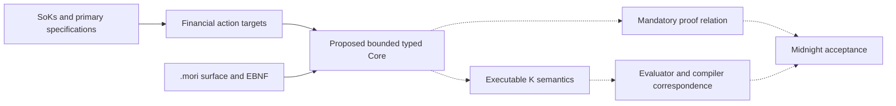

# DeFi actions and Moriarty language design

Research and design recommendation, 7 September 2026. Audience: Moriarty developers and engineers reviewing financial behavior. The reference backend is Midnight. The source extension is `.mori`; syntax will be specified in EBNF, static semantics through judgments, and operational semantics in K. The proposed successor language is specified-only.

Use the existing economic families and facets to organize DeFi, and an action/workflow matrix to determine what Moriarty must express. Prefer brace-delimited financial declarations, immutable local calculations, explicit state updates and ordered effects. Keep one bounded Core beneath that surface. The recommendation is an engineering judgment informed by the sources below, not a demonstrated usability result.

The [source-to-target graph](research-graph.json) retains explicit provenance and inference labels. The [language design](LANGUAGE-DESIGN.md) specifies the proposed surface, types, transition rules and K boundary. The [action target matrix](action-targets.csv) identifies reference actions, distinguishing tests and missing source/implementation work. These targets extend the existing ACTUS and DeFi requirements; they do not replace them.

The graph shows design dependencies. Dashed paths require implementation and evidence.

## What the taxonomies establish

A product family identifies its economic purpose. An action describes a transition. A workflow connects actions across one or more transactions. Custody, authorization, privacy, oracle trust and settlement are facets that can apply to many families. Conflating these layers makes coverage look broader than the language's behavior.

| Primary research | Relevant evidence | Use and limits |
| --- | --- | --- |
| [Werner et al., SoK: Decentralized Finance, v6 (2022)](https://arxiv.org/html/2101.08778v6) | Sections 2 and 3 distinguish supporting mechanisms and protocol types; sections 5 and 6 distinguish technical and economic security. | Broad context for exchange, credit, derivatives and management. Protocol categories are not grammar constructors; technical correctness does not imply economic safety. |
| [Gogol et al., Fundamentals, Taxonomy and Risks (2024)](https://arxiv.org/html/2404.11281v1) | Section III separates classification dimensions; IV examines pegged claims, pools and aggregators. | Adds staking and asset-provenance distinctions. Its abstract's coverage claim differs from the dated percentage in I-A; neither supports an exhaustive present-day taxonomy. |
| [Xu et al., SoK: DEX with AMM Protocols, v7 (2023)](https://arxiv.org/html/2103.12732v7) | Sections 2.3.2 and 3 distinguish swaps and liquidity changes; section 4 compares mechanisms. | Reference actions for exchange, pool shares and positions. Real-number formulas require an explicit finite arithmetic interpretation. |
| [Bartoletti, Chiang and Lluch-Lafuente, SoK: Lending Pools (2020 preprint)](https://arxiv.org/html/2012.13230v1) | Section 3.4 defines deposit, borrow, accrue, repay, redeem, liquidate, share transfer and price-update transitions. | Useful action-level model. Section 7 excludes several implementation details, including fees and liquidation close factors. A model theorem is not protocol conformance. |
| [Cousaert, Xu and Matsui, SoK: Yield Aggregators, v4 (2022)](https://arxiv.org/html/2105.13891v4) | Section III-A and Figure 2 describe strategy phases; V-B describes liquidity and composition risks. | Harvesting and rebalancing are bounded workflows. The paper does not specify a complete redemption queue. |
| [Kotzer et al., lending and yield aggregation SoK (2026)](https://eprint.iacr.org/2026/675) | Section III and Table II compare loan mechanisms; V-C discusses liquidation; VII discusses aggregation. | Adds fixed-term and liquidation-policy counterexamples. Protocol measurements are historical. Section III-B inconsistently uses block and transaction for flash repayment; an exact transaction boundary needs a normative fixture. |

The existing F1-F6/P taxonomy remains the organizing scheme:

| Family | Actions to cover | Distinguishing obligation |
| --- | --- | --- |
| F1 Exchange and price discovery | Swap, provide/remove liquidity, manage positions | Fees, reserve changes and share entitlement agree |
| F2 Credit and collateralized debt | Supply, borrow, accrue, repay, redeem, liquidate, mature, refinance | Token transfers and nominal debt are accounted for separately |
| F3 Derivatives | Open, margin, fund, exercise, settle, expire | Position rights, liabilities and exercise authority survive correctly |
| F4 Consensus-position claims | Stake, account rewards/slashing, request exit, claim | Rebase accounting differs from share-rate accounting |
| F5 Tokenized external claims | Issue, transfer, redeem | External custody and attestation assumptions remain explicit |
| F6 Delegated asset management | Share deposit/redemption, allocate, harvest, unwind, rebalance | Fees, losses, mandates and residual debt survive the workflow |
| P Event-contingent claims | Split, merge, resolve, redeem | Resolution authority and claim identities prevent duplicate payout |

This table is our synthesis. The CSV distinguishes source-defined actions from requirements still needing normative lifecycle sources. F5 remains relevant even where an academic definition excludes custodial issuance from DeFi. Other-chain examples supply behavior and trust-boundary requirements; they do not add execution backends.

## Normative follow-up: shares and delayed redemption

The SoKs left a material gap around delayed settlement. [ERC-4626](https://eips.ethereum.org/EIPS/eip-4626) distinguishes asset and share operations and specifies different rounding directions for different methods. Moriarty therefore needs a named rounding policy at each conversion; applying `floor` everywhere is insufficient.

[ERC-7540](https://eips.ethereum.org/EIPS/eip-7540) explicitly separates Pending, Claimable and Claimed requests. An exchange rate may change between request and claim. Moriarty must distinguish committed funds, outstanding claims and delivered tokens. Cancellation is not supplied as a universal operation by this standard and cannot be assumed.

These are reference behavior targets. Moriarty will model them on Midnight rather than implement an Ethereum ABI. Exact standard revision, fixtures, controller/operator authority and partial-claim behavior must be frozen before a conformance claim. The retained page digests identify the consulted snapshots.

## Evidence on language use

[Stefik and Siebert (2013)](https://www.vidarholen.net/~vidar/An_Empirical_Investigation_into_Programming_Language_Syntax.pdf), sections 4.2-4.5, studied short novice tasks across several languages. Results undermine the assumption that familiar production syntax is automatically intuitive. They do not isolate braces or compare Lisp with Moriarty. Extra words also introduced errors; semicolons were comparatively minor.

[Lappi, Tirronen and Itkonen (2023)](https://link.springer.com/article/10.1007/s11219-023-09631-7) studied keyword intuitiveness with Finnish speakers. Familiarity affected ratings. This replicated a keyword survey, not the six-language programming experiment. Ratings are not evidence that a user will correctly interpret a financial contract.

[Pane, Ratanamahatana and Myers (2001)](https://john.pane.net/pdf/PaneRatanamahatanaMyers2001.pdf), sections 4-7, found rule/event formulations in non-programmers' solutions and substantial Boolean misunderstandings. Natural-language-looking syntax can still conceal precise boundary and logic errors. Moriarty should expose grouping, inclusivity and consequences rather than assume English keywords remove ambiguity.

[Mernik, Heering and Sloane (2005)](https://ir.cwi.nl/pub/10893) separate DSL decision, domain analysis, design and implementation. Only the institutional abstract and metadata were used here; the detailed pattern catalogue was not inspected reliably.

| Candidate | Reason to consider it | Main risk |
| --- | --- | --- |
| Brace-delimited financial blocks | Continues the implemented surface; supports readable formulas and explicit clauses | Developers may incorrectly assume ordinary C mutation, numeric conversion or overflow |
| Lisp S-expressions | Uniform explicit trees; straightforward structural editing | Prefix formulas and nested forms may obscure financial operand roles |
| ML/Haskell-inspired layout | Compact formulas and bindings | Indentation changes grouping; familiar notation may imply unsupported application or evaluation rules |

Choose the first as the working proposal, with explicit semantics and diagnostics. Retain the alternatives as matched study specimens. This decision does not import C loops, pointers or unrestricted functions. Lisp-shaped syntax would not inherently require `eval` or recursion either. Termination depends on admitted constructs and bounds.

## Financial semantics that the surface must expose

[Peyton Jones, Eber and Seward (2000)](https://www.microsoft.com/en-us/research/wp-content/uploads/2016/07/contracts-icfp.pdf), sections 3-4, support compositional financial descriptions. Their horizon limits acquisition, while acquired obligations can extend beyond it. Their denotational valuation model does not establish ledger settlement equivalence. Choice ownership can invalidate an apparently natural algebraic rewrite.

[Seijas et al., Marlowe (2020)](https://fc20.ifca.ai/wtsc/WTSC2020/WTSC20_paper_18.pdf), sections 2-5, distinguish inputs, state, effects and continuation and qualify termination and preservation results. Moriarty needs its own measures and assumptions. The [retained Marlowe receipt](../../raw/sources/pcd-language-reset-2026-09-06/marlowe-semantics-2020.pdf.receipt.json), originally in SRC-0040, is explicitly indexed by SRC-0099. Empty custody or timeout closure cannot erase nominal debt, and a bound on accepted transitions does not bound repeated rejected submissions.

[Coblenz et al., Obsidian, 2019 draft](https://arxiv.org/pdf/1909.03523v1), section 6, provides a useful ownership and typestate design reference. [Blackshear et al., Resources (2020)](https://arxiv.org/pdf/2004.05106v2), sections 3.2 and 6.2, distinguish resource identity safety from correct monetary amounts. Moriarty must prove quantitative accounting and duty preservation as well as prevent duplicate ownership. Neither paper proves private witness availability or Moriarty PCD.

## Verification and remaining decisions

The `.mori` migration changes filenames and active references, preserving the exact example bytes and registered bounds. Existing golden frontend tests continue to check the same program representations. Original evidence retains its historical paths. The README now explains EBNF, lexical rules, typing judgments and K. No successor parser, K rules, usability study or new native proof is claimed implemented by this research.

Before the successor surface freezes, run a formative comparison with balanced developer and financial-reviewer tasks. Test wrong asset/recipient, fee treatment, debt versus payment, deadline inclusivity, Boolean grouping and state reads. Counterbalance the three styles with the same semantics and tooling. Judge consequential error detection and repair before speed or preference. A pilot can reject a poor choice; it cannot establish universal superiority.

The [OpenSpec amendment](../../openspec/DEFI-LANGUAGE-DESIGN-2026-09-07.md) assigns grammar/K work to MC01, target coverage to RP01/MC07, proof relation changes to MC03/MC05, ledger correspondence to MC04, and pending/private composition to MC06. It preserves the existing report reconciliation and admission gates.

Research stopped after the broad SoKs, direct action models, syntax evidence and semantic precedents supported the design choices or exposed a named gap. Detailed derivatives, prediction resolution, staking exits, refinancing and external claims still need pinned lifecycle specifications. This is a reference and design dossier, not exhaustive DeFi coverage or conformance evidence.
