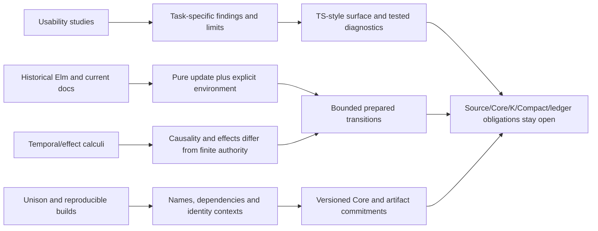

# Source, claim and feature graph

The JSON contains typed, directed edges with source locators. `supports` is scoped evidence; `informs` is a provisional recommendation, not a proved implication. No opaque extraction service or graph database is required.

The original-source column below is the transitive set reached through each listed claim’s source support. It differs intentionally from the curated direct `source_ids` field in features.json. D08 in F05 supports the derived effect-summary constraint, not an empirical claim about local inference. PANEL claims add expert design recommendations and do not turn review opinions into academic findings.

## Traceable feature edges

| Feature | Claim IDs | Original sources |
|---|---|---|
| F01 TypeScript-style external .mori | UCL02, UCL15, DOC05, REPO01 | D11, R1, R2, R3, R4, R5, U01, U06, U10 |
| F02 Inert TypeScript tagged template | UCL17, DOC05 | D11, U09 |
| F03 Unrestricted TS runtime in contracts | SEM-04-L, DOC05 | D11, S05 |
| F04 Explicit public financial types | UCL08, UCL15, DOC04 | D10, D14, U04, U06 |
| F05 Local inference with visible inferred types | UCL08 | U04 |
| F06 Pure pre-state and staged updates | SEM-01-R, UCL17, DOC01, REPO01 | D01, D02, D03, D04R, R1, R2, R3, R4, R5, S01, U09 |
| F07 Closed typed effects separate from authority | SEM-04-R, DOC03 | D08, S05 |
| F08 General resumable effect handlers | SEM-04-L, UCL06, DOC03 | D08, S05, U02 |
| F09 Finite event inputs and schedules | SEM-01-L, SEM-02-L, DOC01 | D01, D02, D03, D04R, S01, S03 |
| F10 Infinite streams or implicit lifetime reset | SEM-01-L, SEM-02-L | S01, S03 |
| F11 Checked domain duties and authorized recovery | UCL06, SEM-06-L, REPO01 | R1, R2, R3, R4, R5, S07, U02 |
| F12 Checked arithmetic and named rounding | UCL15, DOC05, REPO01 | D11, R1, R2, R3, R4, R5, U06 |
| F13 Structured source diagnostics | UCL11 | U02, U05 |
| F14 Content-addressed typed Core and dependencies | SEM-03-R, UCL20, DOC02, DOC04 | D06, D07, D10, D14, S04, U09 |
| F15 Separate source/build/artifact/claim identities | SEM-03-L, SEM-05-R, DOC07 | D09, S04, S06 |
| F16 Unison-style database as primary editor workflow | UCL17, UCL20, DOC06, DOC07 | D09, D12, D13, U09 |
| F17 Explicit version and migration review | SEM-03-L, DOC06, DOC04 | D10, D12, D13, D14, S04 |
| F18 Separate preparation from proof and settlement | SEM-01-R, REPO01 | R1, R2, R3, R4, R5, S01 |
| F19 Human task evaluation before usability claims | UCL19, UCL22 | U02, U04, U05, U10 |
| F20 Profile-specific grammar and correspondence checks | UCL17, REPO01 | R1, R2, R3, R4, R5, U09 |

## Claims

| ID | Kind | Source and locator | Statement |
|---|---|---|---|
| UCL01 | source_fact | U01; [{'source_id': 'U01', 'pdf_pages': [26, 28, 30, 31]}] | U01 Study 4 analyzes 72 novice participants across six language conditions; Ruby, Python and Quorum outperform Randomo on token accuracy, while Java and Perl do not show a significant advantage over Randomo. Most real-language pairwise differences are not significant. |
| UCL02 | recommendation | U01, U10; [{'source_id': 'U01', 'pdf_pages': [26, 31, 34, 35]}, {'source_id': 'U10', 'pdf_pages': [4, 5, 6, 7]}] | Adapt familiar declaration forms for a defined audience, while testing semantic interpretation independently of punctuation. |
| UCL03 | source_fact | U01; [{'source_id': 'U01', 'pdf_pages': [7, 8, 13]}] | U01 intuition surveys had 166 respondents each with some overlap; generic-syntax ratings were inconclusive. |
| UCL04 | source_fact | U02; [{'source_id': 'U02', 'pdf_pages': [36, 37]}] | U02 Auction correct completion was 7/10 Obsidian versus 2/10 Solidity. The p≈0.015 comparison conditions on claimed completion; the all-participant comparison was p≈0.070. |
| UCL05 | source_fact | U02; [{'source_id': 'U02', 'pdf_pages': [37, 38, 39]}] | In U02 Casino, all four Obsidian participants with compiling completed programs misused disown; none had a fully correct solution. One Solidity participant had a fully correct solution. |
| UCL06 | recommendation | U02; [{'source_id': 'U02', 'pdf_pages': [37, 38, 39]}] | Defer general unchecked escape hatches; evaluate whether repair attempts discard obligations or assets to silence diagnostics. |
| UCL07 | source_fact | U04; [{'source_id': 'U04', 'pdf_pages': [8, 9, 10, 11, 14]}] | U04 retained 27 of 33 recruited students. Static typing favored three API tasks and dynamic typing two; the task-specific analysis does not establish a universal type-system winner. |
| UCL08 | recommendation | U04; [{'source_id': 'U04', 'pdf_pages': [4, 8, 13, 14]}] | Adapt explicit type information at public financial boundaries and study inferred locals separately from erasing types. |
| UCL09 | source_fact | U05; [{'source_id': 'U05', 'pdf_pages': [6, 7, 8]}] | U05 message quizzes had 27 complete cases: incorrect interpretation was 17.28% for standard messages and 6.17% for enhanced messages, with reported paired-test p<0.035. |
| UCL10 | source_fact | U05; [{'source_id': 'U05', 'pdf_pages': [7, 8, 9, 10]}] | U05 think-aloud programming study did not show a substantial overall learning-outcome improvement, despite observations of useful reading and edits in response to enhanced messages. |
| UCL11 | recommendation | U05, U02; [{'source_id': 'U05', 'pdf_pages': [6, 7, 8, 9, 10]}, {'source_id': 'U02', 'pdf_pages': [37, 38]}] | Adopt separate measures of diagnostic comprehension, correct repair, recurrence and suppression attempts. |
| UCL12 | source_fact | U06; [{'source_id': 'U06', 'pdf_pages': [24]}] | U06 Table 4 reports DSL/GPL success means of 57.62/40.95 learning, 64.57/50.86 perceiving, 70.95/33.33 evolving, and 64.34/43.37 overall, in percent. |
| UCL13 | contradiction | U06; [{'source_id': 'U06', 'pdf_pages': [24, 28]}] | U06 conclusion summarizes roughly 15% improvement across categories; Table 4 instead gives 16.67, 13.71 and 37.62 percentage-point differences, and 20.97 overall. Use explicit table numbers. |
| UCL14 | inference | U06; [{'source_id': 'U06', 'pdf_pages': [22, 25, 26]}] | U06 inferential statistics require caution: its prose calls the test independent although participants answered both questionnaires; cognitive-dimension attribution assumes equal contribution among selected dimensions. |
| UCL15 | recommendation | U06; [{'source_id': 'U06', 'pdf_pages': [20, 21, 22, 24, 28]}] | Adapt domain-specific financial vocabulary, but defer importing the GUI study effect size into finance. |
| UCL16 | source_fact | U09; [{'source_id': 'U09', 'pdf_pages': [7, 8, 9, 10]}] | U09 pilot uses 18 respondents: ten unsupervised and eight interviewed. Respondents identify concrete usability issues, but group, questionnaire and interview differences prevent a clean causal comparison. |
| UCL17 | recommendation | U09; [{'source_id': 'U09', 'pdf_pages': [4, 5, 7, 9, 10]}] | Adopt cognitive-dimension prompts for visibility, dependencies, change effort and role clarity; defer a summed score ranking entire languages. |
| UCL18 | source_fact | U10; [{'source_id': 'U10', 'pdf_pages': [2, 3, 4, 5, 6, 7]}] | U10 reports eight student designers and six completed projects; spontaneous syntax choices and actual task failures reveal prior-experience effects and mistaken designer assumptions. |
| UCL19 | recommendation | U10, U02; [{'source_id': 'U10', 'pdf_pages': [4, 5, 6, 7]}, {'source_id': 'U02', 'pdf_pages': [39, 43, 44, 45, 46]}] | Adapt natural-programming tasks as formative evidence, followed by trained tasks on the actual constrained semantics. |
| UCL20 | open_question | U09; [{'source_id': 'U09', 'pdf_pages': [9, 10]}] | Do content-addressed definitions and explicit dependency identity improve financial-language maintenance compared with name/version-oriented modules? |
| UCL21 | contradiction | U02; [{'source_id': 'U02', 'pdf_pages': [19]}] | U02 describes both Glacier programming-task contrasts as significant, but one reported p≈0.077 exceeds the conventional 0.05 threshold; retain counts and precise p-values. |
| UCL22 | inference | U02, U04, U05; [{'source_id': 'U02', 'pdf_pages': [36, 37, 38, 39]}, {'source_id': 'U04', 'pdf_pages': [8, 9, 10, 11]}, {'source_id': 'U05', 'pdf_pages': [8, 9, 10]}] | Positive bounded-task results and negative open-ended outcomes can coexist; language evaluations should preserve correctness, completion and time as distinct outcomes. |
| SEM-01-F | source_fact | S01; §§3.1–3.3, pp.3–7; §4.3 and §5, pp.9–10 | FElm separates normalization of functional expressions from ongoing signal execution. Its stratified types exclude signals of signals. Theorem 1 establishes type soundness and normalization of the first stage. The pipelined signal semantics uses unbounded FIFO queues; async preserves order inside a subgraph while relaxing global order between subgraphs. The implementation section explicitly omits direct performance evaluations. |
| SEM-01-R | recommendation | S01; §§3.1–3.3, pp.3–7; §4.3 and §5, pp.9–10 | Use immutable state transitions and explicitly identified inputs for tooling. Keep async results as proposals until authority and ledger checks accept them. |
| SEM-01-L | inference | S01; §§3.1–3.3, pp.3–7; §4.3 and §5, pp.9–10 | Neither first-stage normalization nor responsiveness establishes finite lifetime execution, finite queues, observation truth, quantitative conservation, or ledger acceptance. |
| SEM-02-F | source_fact | S03; §§2.1–2.3, pp.6–9; §§3.2–3.4, pp.12–15; Theorems 3.1/3.2 and 6.3, Proposition 6.4, pp.13–14,23–25; §8 p.26 | Simply RaTT uses later and stable modalities with context restrictions, guarded recursion and a two-heap machine. For closed well-typed streams over value types built from unit, Nat, sums and products, Theorem 3.1 gives arbitrarily long finite productive prefixes. Theorem 3.2 gives typed stream-transducer progress; its proof establishes causality. The machine can discard the previous heap. The type system rejects a particular fixed-point-under-delay time leak. |
| SEM-02-R | recommendation | S03; §§2.1–2.3, pp.6–9; §§3.2–3.4, pp.12–15; Theorems 3.1/3.2 and 6.3, Proposition 6.4, pp.13–14,23–25; §8 p.26 | Treat temporal availability as an independent typing concern. Define a bounded observation record with identity, effective time, expiry and authority before considering reactive syntax. |
| SEM-02-L | inference | S03; §§2.1–2.3, pp.6–9; §§3.2–3.4, pp.12–15; Theorems 3.1/3.2 and 6.3, Proposition 6.4, pp.13–14,23–25; §8 p.26 | Productivity describes potentially infinite execution. Garbage collection does not establish a uniform byte/time bound; explicit state can grow. Fairness extensions are future work. These results say nothing about financial liveness or mandatory proofs. |
| SEM-03-F | source_fact | S04; Overview/Nix Store pp.81–83; Implementation/The Store and Building Components pp.84–85; User Environment Policies pp.87–88; Conclusion p.91 (PDF pages subtract 78) | Nix separates user-facing names from immutable installation objects, identifies variants through hashes of build inputs, lowers high-level expressions to simpler store expressions, and deploys dependency closures. Build inputs include scripts, platform and environment bindings. The paper describes atomic environment changes through POSIX rename and retains old generations. Mutable service state is explicitly outside Nix control. |
| SEM-03-R | recommendation | S04; Overview/Nix Store pp.81–83; Implementation/The Store and Building Components pp.84–85; User Environment Policies pp.87–88; Conclusion p.91 (PDF pages subtract 78) | Use separate source, Core, build and output identities. Include semantic profile, dependency closure and toolchain in artifact manifests. Authorize mutable financial migration separately from changing a code name. |
| SEM-03-L | inference | S04; Overview/Nix Store pp.81–83; Implementation/The Store and Building Components pp.84–85; User Environment Policies pp.87–88; Conclusion p.91 (PDF pages subtract 78) | An input-derived identifier assumes adequately captured inputs and appropriate determinism. It is not an independently checked output digest, semantic-equivalence proof, authorization, or migration theorem. The paper’s old hash examples are historical, not a recommended modern construction. |
| SEM-04-F | source_fact | S05; §§2.1–2.7 pp.102–107; §5.2 p.117; §6 Theorems 2–4 pp.118–119 (PDF pages subtract 99) | Koka uses strict evaluation and inferred row-polymorphic effects with duplicate labels. In its formal calculus, absence of exn excludes an unhandled exception result, not internally caught exceptions; absence of div entails termination. Heap encapsulation prevents local references escaping under its typing side conditions. The formal read primitive conservatively includes divergence; §2.7 distinguishes a finer implementation analysis and an incompletely implemented constraint case. |
| SEM-04-R | recommendation | S05; §§2.1–2.7 pp.102–107; §5.2 p.117; §6 Theorems 2–4 pp.118–119 (PDF pages subtract 99) | Give Moriarty primitive effects explicit typing and operational rules; close admitted effect sets before execution. Keep effect summaries separate from authority quantities and ordered ledger effects. |
| SEM-04-L | inference | S05; §§2.1–2.7 pp.102–107; §5.2 p.117; §6 Theorems 2–4 pp.118–119 (PDF pages subtract 99) | Termination alone does not give a registered work bound. Effect rows are not payment counts, rights, or affine continuation rules. This 2014 source does not establish the behavior of current Koka or arbitrary user-defined handlers. |
| SEM-05-F | source_fact | S06; Definition 2.1 p.3; Definition 3.1 p.11; §§4.2–4.4 pp.14–16; §§6.3–6.6 pp.23–26 | The framework separates scheduling from rebuilding. Correctness preserves reachable inputs and requires every reachable computed key to agree with recomputation against the final store, assuming acyclic tasks. Verifying traces store hashes; constructive traces also store results. Deep traces omit intermediate dependencies and require determinism. The §6.4 Frankenbuild example combines nondeterministic intermediates with deep caching to yield inconsistent artifacts. |
| SEM-05-R | recommendation | S06; Definition 2.1 p.3; Definition 3.1 p.11; §§4.2–4.4 pp.14–16; §§6.3–6.6 pp.23–26 | Cache each proof/compile stage by its actual immediate inputs and output identity; record semantic/compiler changes as dependencies. Specify an invalidation test for changed profile, kernel, observation policy and verifier lineage. |
| SEM-05-L | inference | S06; Definition 2.1 p.3; Definition 3.1 p.11; §§4.2–4.4 pp.14–16; §§6.3–6.6 pp.23–26 | These are simplified executable models, not a certification of contemporary build products. Correct build outputs need not implement correct financial semantics. Shallow storage and nondeterminism change the correctness predicate. |
| SEM-06-F | source_fact | S07; Ch.3 pp.13–21; Ch.4 pp.22–31; Ch.6 pp.39–40; Ch.7 p.41 (PDF pages add 3) | The thesis explains discrete signals, lift and foldp, a two-tier intermediate representation, and explicit async subgraphs. Let-bound signal representations prevent duplicate runtime nodes. Its examples separate presentation from reactive processing. Chapter 6 records concrete JavaScript backend limitations; Chapter 7 presents filtering and further reactive machinery as future work. |
| SEM-06-R | recommendation | S07; Ch.3 pp.13–21; Ch.4 pp.22–31; Ch.6 pp.39–40; Ch.7 p.41 (PDF pages add 3) | Prefer an approachable functional surface over a small explicit Core, with stable diagnostic/source mappings. Keep preview recomputation separate from accepted state and residual obligations. |
| SEM-06-L | inference | S07; Ch.3 pp.13–21; Ch.4 pp.22–31; Ch.6 pp.39–40; Ch.7 p.41 (PDF pages add 3) | Historical syntax and runtime claims do not specify current Elm. The thesis and PLDI paper belong to the same research line, so they are not independent replications. Embedding/dynamic-switching discussion does not authorize dynamic or unbounded financial execution. |
| DOC01 | source_fact | D01, D02, D03, D04R; D01 Basic Pattern; D02 element; D03 subscriptions; D04R Farewell to FRP | Current Elm architecture uses Model/View/Update with commands/subscriptions; the May2016 Elm0.17 post replaces signals. Historical FRP papers do not specify current Elm. |
| DOC02 | source_fact | D06, D07; D06 opening technical explanation; D07 Literal Hash References and Short Hashes | Unison references terms/types by structural hashes and dependency hashes, with names separately stored; short prefixes require unambiguous environment resolution. |
| DOC03 | source_fact | D08; Abilities in function types; Typechecking rule; Pattern matching on ability constructors | Unison ability requirements are typechecked; handlers may ignore or multiply resume continuations. |
| DOC04 | contradiction | D10, D14; D10 meaning of unique; D14 final paragraph | Tutorial shorthand unique by name is qualified by reference: unique type identity incorporates generated UUID into the type hash. Financial nominal identity must be explicit rather than inferred from a mutable spelling. |
| DOC05 | source_fact | D11; Overview | Compact documents TypeScript-like syntax together with bounded fixed-size data, bounded loops, prohibited recursion, explicit disclosure and separate runner witnesses. |
| DOC06 | source_fact | D12, D13; D12 update/upgrade workflows; D13 entire short guide | Unison documents guided dependent updates and separate author/license values associated with projects. Hash identity does not replace upgrade workflow or provenance metadata. |
| DOC07 | source_fact | D09; Tour watch expressions/testing | Unison tour describes a codebase workflow and caching pure watch results by expression hash. This is not evidence that a financial proof remains valid for changed state or verifier context. |
| REPO01 | repository_observation | R1, R2, R3, R4, R5; R2 introduction and unsupported; R1 semantics and mandatory proof acceptance; R3 roadmap | Successor syntax profile is provisional and does not supply typing, evaluation, K emission or financial admission; current design requires explicit authority, units, residual duties, bounds and all-layer correspondence. |

## Converged requirements

Expert-review sources REV-USABILITY, REV-SEMANTICS and REV-OPUS inform PANEL-F01 through PANEL-F20; they are design recommendations, not additional academic evidence. [CONVERGENCE.md](CONVERGENCE.md) records unanimous disposition labels, substantive amendments and parent-adjudicated dissent. The matrix below states the final requirement on each feature.

| Feature | Recommendation claim | Final constraint |
|---|---|---|
| F01 | PANEL-F01 | Familiar punctuation can imply wrong host semantics; state exact grammar/profile |
| F02 | PANEL-F02 | Future static extraction must not execute the enclosing TS module; prohibit interpolation independently of TS types, specify raw/cooked characters, escaping and source spans; replacing the tag binding cannot yield a trusted artifact. |
| F03 | PANEL-F03 | No closures, eval, ambient IO, host coercions or dynamic imports in trusted execution |
| F04 | PANEL-F04 | Nominal units/identities; arithmetic checks additional to type checking |
| F05 | PANEL-F05 | Public financial interfaces stay explicit; unique local inference is inspectable without an IDE. Effect summaries may be derived within declared limits; no any/unsafe cast. |
| F06 | PANEL-F06 | Immutable pre; at most one next write per field; no next reads; unwritten fields persist; post appears only in the final ensures suffix; rejection discards all tentative changes. |
| F07 | PANEL-F07 | Compiler-derived conservative effect summaries checked against declared interface limits; signed quantitative authority is separate and visible. No repeated effect row or authority token per emit is mandatory; outcome intent needs no compulsory second exact-plan signature. |
| F08 | PANEL-F08 | Multiple resume can duplicate effects/work; single-shot/accounting theorem needed |
| F09 | PANEL-F09 | Bound queue, horizon, observations, ordering and recovery reserve |
| F10 | PANEL-F10 | Productivity/causality not finite lifetime; no unbounded queue or allowance refresh |
| F11 | PANEL-F11 | Identified duties carry forward automatically unless a named funded allocation, domain transformation or explicitly authorized resolution changes them. Static structural checks plus state-dependent preparation/proof conservation; no generic linear calculus or universal static-detection claim. |
| F12 | PANEL-F12 | Intermediate bounds, scale, zero division and named inspectable rounding/allocation policy; direction is instrument-policy-dependent, not universally hostile to payer. |
| F13 | PANEL-F13 | Concise syntax/setup and financial diagnostics with safe next steps, exact spans and truthful preparation/proof/submission/finality stage; no witness disclosure or unsupported superiority claim. |
| F14 | PANEL-F14 | Full domain-separated references and bounded available dependency closure; initially normalize local binders only where encoding says so, retain public/nominal identifiers until specified; readable hash display remains an open empirical question. |
| F15 | PANEL-F15 | Source/Core/build/output/claim/execution identities bind their exact domains and immediate inputs. Compiler change alters build identity; Core changes only if elaboration changes. Technical details expand on demand. |
| F16 | PANEL-F16 | Retain ordinary text review initially; database workflow has migration/provenance cost and unmeasured benefit. Permanent exclusion is not established by this evidence. |
| F17 | PANEL-F17 | Authorized migration retains duties, authority, custody, consumed history and aggregate remaining work; alias edits cannot redirect live positions. |
| F18 | PANEL-F18 | Midnight Preview is fixed; financial acceptance remains open. Require all four claims plus native/ledger checks, unique consumption and exact effects; parsing/signing is not settlement. |
| F19 | PANEL-F19 | Formative sessions may start now; confirmatory comparison waits for a stable executable source/Core/K/evaluator prototype and pilot calibration. First pilot varies locals, not public annotations. PL votes are not participant evidence. |
| F20 | PANEL-F20 | Lexing/parsing/formatting separate from typing; stable spans and profile labels |
