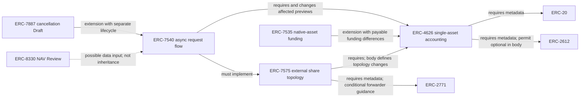
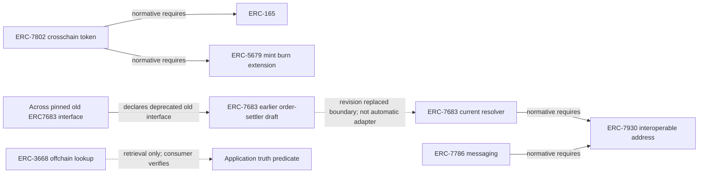

# D. Dependency and compatibility maps

[Open the interactive map](graph.html). The authoritative [relationship data](relationships.json) contains 226 nodes and 619 typed relationships, and two composition annotations. Graphify's directed visualization has 605 source-target pairs: where several relationship types share a pair, `relations` and `evidence_records` preserve them instead of silently replacing one. Twelve algorithmic communities aid navigation; they are not additional financial categories or expert validation.

Source-grounded extraction accounts for 241 relationships; 378 are analyst classifications/relevance inferences. The latter include the recommended category-standard crosswalk. Confidence scores distinguish extraction from inference; they are not calibrated probabilities of safety or conformance. Source files and locators resolve to durable repository evidence. No graph edge establishes a deployed integration beyond its stated source scope.

## Relationship dictionary

| Type | Meaning | Does not mean |
|---|---|---|
| normative_requires | Exact registry frontmatter dependency | Every referenced interface must be implemented in every deployment |
| extends | A specification deliberately modifies/adds behavior of another | Full substitutability under every caller assumption |
| alternative | Overlapping capability with different design requirements | Economic equivalence or safe automatic replacement |
| adapter | A scoped component translates or accesses another interface | Native implementation by all upstream components |
| co_use | Two interfaces/conventions can be used together in a described design | Normative inheritance or measured adoption |
| behavioral_hazard | A specified or evidenced behavior can violate consumer assumptions | Every use is vulnerable or an exploit occurred |
| historical_proposal_dependency | Dependency claimed by an archived issue/draft | Current canonical registry status |
| classified_as / has_function / has_subcategory | Recommended financial classification | A paper's original label or proven exhaustive partition |
| position_representation / accounting_interface / authorization / request_lifecycle / execution_interface / messaging / governance / supporting_infrastructure | Category-to-capability relevance | The entire category implements that standard |
| source_classification / crosswalk_* | Historical category and its retain/refine/split/reposition/reject disposition | Contemporary source agreement with the proposed ontology |

Additional case extraction labels retain their source meaning in the JSON, including dependencies, issuance/claims and participation in a scoped composition. The readable case diagrams label transfers, claims, collateral, authorization and data independently. A dependency label without an asset-transfer label is not a claim that money moved.

## Vault capabilities: dependencies versus changed behavior

The solid arrows are labeled with their exact role; even here, `requires` is not shorthand for universal inheritance. The dotted NAV edge is an illustrative possible use, not a documented deployed connection. See [asset profiles](STANDARDS-ASSETS.md) for source clauses and version dates.

## Execution and observation boundaries

These edges are specified or source-code relationships. They do not assert that ERC-7802 requires a particular messaging standard, or that retrieval proves external truth. Across's code association with the previous draft does not demonstrate current resolver conformance. [Execution profiles and pins](STANDARDS-EXECUTION.md).

## Behavioral compatibility checklist

For a concrete integration, identify the exact property expected by the consumer, then inspect/test the producer against it:

1. **Amount semantics:** exact received amount versus fee-on-transfer; decimals; rebasing/indexed balances; shares versus assets; debt versus cash.
2. **Control flow:** callbacks, reentrancy, forwarding, multicall, hook permissions and unexpected external calls.
3. **Authority:** signer type, domain, nonce, expiry, scope, allowances/operators, upgrade/admin changes and freeze/pause rights.
4. **Valuation:** conversion versus preview versus NAV versus market price; time, stale data, invalidations, fees and rounding.
5. **Lifecycle:** requested versus claimable versus received; partial processing, queue limits, cancellation and default paths.
6. **Settlement:** per-leg delivery, payment, challenge periods, chain finality and refunds; solver capital exposure between legs.

A whitelist can constrain the considered implementation set but is not itself a proof that its members satisfy these predicates. An upgrade may invalidate prior behavioral evidence even when selectors and token names remain unchanged. These rules apply Zhou's unsafe-dependency findings and the inspected normative interfaces; no automated full conformance suite was run here.
