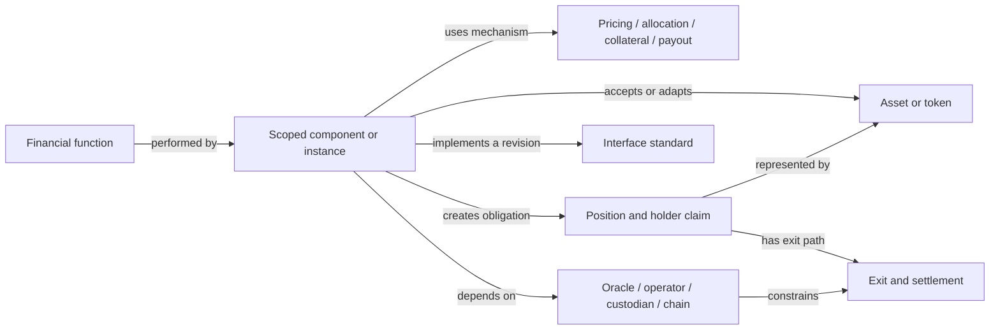

# Modern DeFi: financial taxonomy and linked standards atlas

**Recommended architecture:** classify the financial obligation first, then attach mechanism, claim, lifecycle, authority and deployment facets. Link those records to a separate, versioned standards atlas. A protocol name or ERC number is never the financial classification unit.

Research cutoff: **8 September 2026**. Research execution: 8 September in America/Denver; source verification continues on **9 September 2026 UTC**. Registry snapshots are pinned to commits before `2026-09-08T23:59:59Z`; later access dates do not move that cutoff. Undated protocol documentation is an accessed design statement, not proof of its historical deployment state. The recommended ontology is research synthesis, S2; it does not change Moriarty's accepted language semantics or establish network execution.

## A. Executive taxonomy map

Use these eight roots, with the 23 subcategories defined in [B. Category reference](CATEGORIES.md). More than one function may apply to one explicitly scoped component, but each label must name the obligation it explains.

| Root | Financial service | Principal subcategories | What must remain separate |
|---|---|---|---|
| FIN-MON | Money, payments and escrow | Monetary issuance/redemption; payments/streams; escrow/conditional settlement | Unit of account, reserve assets, peg target, issuer and payment application |
| FIN-EXC | Exchange and trade execution | Trading venues/liquidity; routing/coordinated execution | Pricing, matching, routing, inventory management and settlement |
| FIN-CRE | Credit and financing | Inventory-funded lending; credit issuance; transaction-scoped liquidity | Funding source, borrower obligation, collateral, maturity and loss resolution |
| FIN-CAP | Capital formation | Primary issuance/subscription; conditional collective funding | Capital raising versus secondary trading or reward distribution |
| FIN-DER | Derivatives and contingent exposure | Linear price exposure; optional/structured payoff; event claims; interest/yield transformation | Payoff, margin, funding, trading venue, resolution and settlement |
| FIN-MGT | Asset and portfolio management | Strategy/credit allocation; portfolio/index/treasury; liquidity-position management | Container, mandate, allocator, underlying exposure and source of return |
| FIN-SEC | Consensus and shared-security capital services | Consensus participation/delegation; liquid security-capital claims; shared-security allocation | Operator service, token receipt, security duties, penalties and withdrawal |
| FIN-RSK | Protection and loss allocation | Protection/cover; subordination/first loss; default/settlement backstops | Loss trigger, discretion, priority, capital sufficiency and legal obligation |

**One canonical hierarchy, not a menu.** These roots answer what service is supplied. They do not claim to be a mathematical partition of contracts. The hierarchy supplies navigation; independent facets and typed edges supply precision. A `primary_function` may support display, but must not discard additional functions or components.

This is an ontology diagram, not a deployed integration. Its edge names have different meanings: implementing an interface is not owning the underlying asset, and a dependency does not establish a financial claim.

### Why this improves the four foundations

Gogol supplies valuable token, mechanism and network distinctions, but its three algorithm buckets classify unlike objects: pooled liquidity is an organization of capital, aggregation is composition, and a synthetic token is an issued exposure. A lending allocator can instantiate all three descriptions. Its own order-book placement is unstable between prose and Figure 5. Retain the axes and split these objects; reject only the universal, mutually exclusive interpretation of the three buckets.[^1]

Werner supplies the clearest separation of primitives, financial operations and security. Preserve its atomic/non-atomic security distinction with explicit execution assumptions. Privacy is better represented here as a capability applied to payments or trading, rather than a peer financial obligation.[^4] Kotzer adds debt, time and allocation detail, while explicitly separating protocols from strategies; turn overlapping collateral and liquidation labels into facets.[^2] Zhou adds system, actor and unsafe-dependency structure; interface acceptance without behavioral compatibility becomes a first-class relationship to examine, rather than a green compatibility badge.[^3]

The research taxonomy adds capital formation, explicit loss allocation and security-capital services as navigable functions. It moves “external assets,” “cross-chain,” “agent-operated” and “privacy-preserving” into facets or capabilities. This is a recommendation based on classification utility, not a claim that the papers overlooked every underlying design.

### Classify an unfamiliar system in seven steps

A supporting component may have **no financial-function label**. Emitting governance-token rewards for locking tokens does not make it consensus staking without security duties. Incidental transfers or share minting do not automatically add MON or CAP; a separately offered payment or capital-raising service must be identified. Solver reimbursement for a trade is EXC settlement, not automatically CRE lending.

1. **Choose the object.** Record family → version → deployment → component → market/vault instance. Give assets, positions, user strategies and standards their own identities. If an address or version is unknown, say so; do not borrow certainty from the brand.
2. **Trace the obligation.** Identify who supplies capital, who receives it, what each party must deliver, and the holder's claim after the action. Is the action a transfer, advance, issuance, investment allocation, security commitment or contingent payout?
3. **Assign functions.** Apply each category's inclusion/exclusion tests. Classify a composite's components before assigning multiple labels to the whole. Primary issuance through an AMM may have CAP and EXC; a portfolio holding that token has MGT.
4. **Fill the facets.** Mechanism; asset/claim; return source; lifecycle/liquidity; interface; execution/deployment; authority/trust; dependencies/risk. Missing fields are questions, not defaults.
5. **Bind interfaces to evidence.** Record IMPLEMENTS, ACCEPTS, ADAPTER, ANALOGUE, GOVERNANCE_ONLY, PARTIAL or DEVIATES, with specification revision and implementation scope. Interface discovery alone cannot prove complete conformance.
6. **Trace exit and failure.** Follow ordinary redemption, queue, maturity, secondary sale, liquidation, default and recovery separately. Identify who can block or alter them and what they require from off-chain actors.
7. **Check composition.** Follow asset, collateral, authorization, price and settlement dependencies. Stop at unknown contracts or external obligations and preserve those boundaries in the record.

### Independent dimensions and controlled values

| Dimension | Minimum fields | Decision that it supports |
|---|---|---|
| Financial function | Function IDs; beneficiary; obligation; primary-label rationale | What service the scoped object supplies |
| Mechanism | Pricing/matching; capital allocation; rate rule; collateral/default/payout rule | How the service works, without defining the service by one mechanism |
| Asset and claim | Underlying; issuer/obligor; backing; redemption rights; transferable/account-bound; priority; contingent payoff | What the holder can claim and against whom |
| Funding/return | Capital supplier; ultimate payer; operating income; risk compensation; subsidy; fees/leverage | Whether the apparent yield has an explained economic source |
| Lifecycle/liquidity | Entry; valuation/accrual; request/pending/claimable; maturity; withdrawal; settlement; clock | When rights arise and when value can actually be recovered |
| Interface | Standard ID/revision; relation; deviations; evidence predicate | Which integrations are supported and on what basis |
| Execution/deployment | Matching/custody/execution/verification/settlement domains; atomicity; finality | Where shared execution assumptions end |
| Authority/trust | Admission, allocation, pricing, upgrades, freeze, pause, governance, recovery | Which actors can change the holder's position or exit |
| Dependency/risk | Asset/protocol/oracle/operator/bridge/legal edges; threat actor; failure mechanism | How failures propagate and what remains outside code guarantees |

App-chain specialization, deployment on several chains and an operation spanning chains are three independent fields. A non-EVM implementation can share a financial function or mechanism without implementing an ERC. Permissionless entry, permissionless exit, noncustodial operation, auditability, admin power and legal dependence are separately recorded; a single “decentralized” Boolean is inadequate for hybrid finance.

### Financial function × mechanism × asset/claim matrix

| Scoped action | Function | Mechanism | Asset/claim after the action | Return payer or source |
|---|---|---|---|---|
| Mint a monetary unit against borrower collateral | MON.1 + CRE.2 | Debt issuance, oracle-valued collateral, liquidation | Borrower debt position and transferable money-like unit are distinct | Borrower fees; holding the unit need not itself earn yield |
| Supply inventory to a lending market | CRE.1 | Pooled or isolated lending and utilization/negotiated rates | Claim against market inventory and loan assets | Borrower interest, less losses/reserves/fees; rewards separately |
| Deposit into a lending allocator | MGT.1 | Curated distribution among lending markets | Vault shares plus nested lending exposures | Underlying borrower interest; allocator is no new yield source |
| Provide concentrated exchange liquidity | EXC.1; MGT.3 only for a management service | Bounded price range, fee accounting | Liquidity position with changing inventory | Traders' fees; inventory losses remain possible |
| Buy a principal strip | DER.4 at the split mechanism; claim facet determines credit exposure | Split principal and future yield, maturity redemption | Principal-denominated maturity claim, not risk-free cash | Discount/accretion linked to underlying economic yield and risk |
| Delegate stake and receive a liquid receipt | SEC.1 + SEC.2 | Delegation, share accounting, withdrawal queue | Slashable security-capital exposure through a receipt | Consensus rewards net of operator fees/penalties |
| Subscribe to an external-asset fund | MGT.2; add CAP.1 for a distinct primary offering | Permissioned subscription and NAV allocation | Fund/issuer claim determined by governing documents | External fund assets' income and changes in value |
| Purchase cover | RSK.1 | Defined exclusions, assessment and payout | Conditional protection right | Loss-bearing capital, funded by premiums and investment results |
| Fill a cross-chain trade | EXC.2 plus MON.3 at escrow | Solver inventory and later reimbursement | User receives destination asset; solver holds settlement claim | Spread/fee paid for execution, capital and settlement risk |

These are analyst classifications. Concrete source-scoped instantiations and their limits are in [F](VALIDATION.md). The matrix does not assert that all combinations exist as live integrations.

## Reading order and complete data

- **A:** this executive map and classification rules.
- **B:** [Category reference](CATEGORIES.md), [categories JSON](categories.json), [CSV](categories.csv).
- **C:** [Standards atlas and two-way crosswalk](STANDARDS.md), [profiles JSON](standards.json), [CSV](standards.csv), [mapping JSON](category-standard-mappings.json), [CSV](category-standard-mappings.csv).
- **D:** [Dependency and compatibility maps](COMPATIBILITY.md), [interactive graph](graph.html), [typed graph data](relationships.json), [Graphify export](graph.json).
- **E:** [Paper crosswalk and version ledger](PAPER-CROSSWALK.md), [CSV](paper-crosswalk.csv).
- **F:** [Validation cases, detailed traces and composition diagrams](VALIDATION.md), [cases JSON](cases.json), [risk and integration analysis](SEMANTIC-BOUNDARIES.md).
- **G:** [Vocabulary and annotated reading atlas](VOCABULARY.md).
- **H:** [Schema, evidence method and maintenance](DATA-AND-METHOD.md), [source receipts](source-manifest.json), [review and checks](REVIEW.md).

## Unresolved questions that remain material

The taxonomy is usable for classification, but it is not a conformance certification or a complete market census. Exact deployed-bytecode identity, current parameter settings, market activity and economic adoption are not inferred from documentation. Several standards have little established deployment evidence. An old standard status or a protocol's old ERC reference must not be silently reconciled with a newer interface. Refer to the per-standard profiles and the final [gap ledger](DATA-AND-METHOD.md#gap-ledger).

The next language-design decision is whether Moriarty should adopt these category and lifecycle records as metadata and adapter obligations. The research supports that proposal; it does not demonstrate full BNF/K implementation, financial ledger settlement, or a Midnight transaction. No chain action is part of this research.

## Sources

[^1]: Gogol et al., supplied June 2023 manuscript, especially Figures 1, 4–6 and §§3–4, 6–7. [Immutable PDF](../../.raw/captured/1c7211969624807b9a9aaf2308c4a80374816fb9c119d785b0d13437093cc192.pdf). Page-by-page evidence and later-version distinction: [paper crosswalk](PAPER-CROSSWALK.md).
[^2]: Kotzer et al., supplied 2026/675 PDF, Table II and §§III–IX. [Immutable PDF](../../.raw/captured/7165f6cbe7b86280dd5ed94dd5585d3b55dda34d77776f2d9db87321683475c8.pdf). [IACR record](https://eprint.iacr.org/2026/675).
[^3]: Zhou et al., supplied IEEE SP 2023 paper, Figure 2, Tables I–III, §VI insight 4. [Immutable PDF](../../.raw/captured/863c0ee080bac271b9ff1e3a0f1e036759cf71baf9c4b1d3dd38b963cbde4979.pdf).
[^4]: Werner et al., supplied arXiv:2101.08778v6, §§2–7. [Immutable PDF](../../.raw/captured/9079375c121a8033457a952b58b5dc2fb6f2ad9d94ba9ba247b1994b127c5b2c.pdf). [Version history](https://arxiv.org/abs/2101.08778).
