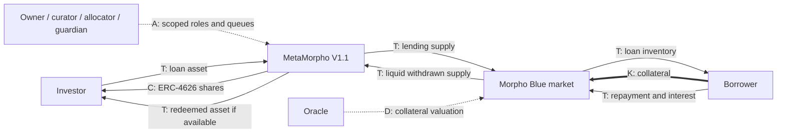
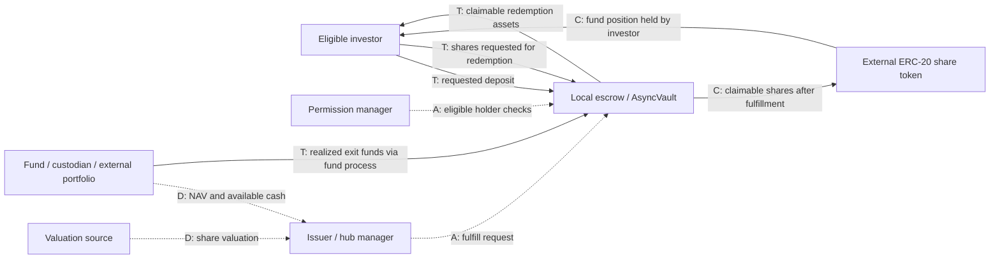
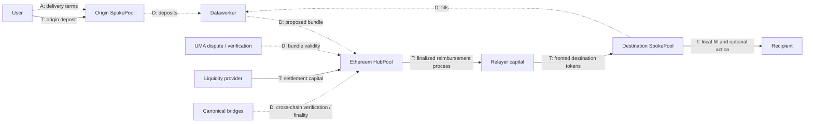

# Validation cases and financial composition boundaries

Research cutoff: **2026-09-08**. Execution and verification: **2026-09-09 UTC** (the local session remained September 8 in America/Denver). Repository sources are pinned to commits at or before the cutoff. Web documentation is an access-time snapshot; absent a revision history, its exact pre-cutoff wording is not established. Historical examples retain their original dates.

These **24 component cases** test structural coverage, not market ranking. They include source-code designs, historically observed markets and documented architectures. No transaction, reserve audit, deployed-bytecode identity check or ERC conformance suite was performed. `IMPLEMENTS` therefore means the cited implementation/design says so or its pinned source exposes the relevant interface; the evidence level remains explicit in `cases.json`. A protocol accepting an ERC-20 asset does not thereby implement every interface of that asset.

The function assignments below are the proposed research ontology: MON money/payment; EXC exchange/execution; CRE credit; CAP capital formation; DER derivatives/contingent claims; MGT asset management; SEC committed capital for consensus/shared security; RSK protection/loss transfer. Multiple functions identify a composition, not competing brand labels. External assets, EVM versus non-EVM, asynchronous exits and cross-chain operation are independent facets.

## The benchmark

| Case | Component/version scope | Financial functions | Mechanism and claim | Evidence / key boundary |
|---|---|---|---|---|
| CASE-01 | Maker MCD collateral Vault / Vat and adapters | MON, CRE | Collateralized issuance of new Dai; collateral health checks; liquidation auctions; Vault owner owes Dai plus stability fee; Dai holder owns a transferable monetary token, not the originating Vault | [^C01] [^C37] [^C38] |
| CASE-02 | Circle Mint USDC issuance/redemption and EVM FiatToken | MON | Fiat funding and issuer-controlled mint/burn; account-mediated bank payout; USDC balance; direct issuer redemption depends on account eligibility and issuer terms | [^C02] [^C35] |
| CASE-03 | Sablier Lockup stream and recipient NFT | MON | Prefunded time-based vesting/payment schedule; NFT represents right to vested withdrawals; cancellation/transfer settings qualify remaining rights | [^C03] [^C41] [^C51] |
| CASE-04 | Uniswap V3 NonfungiblePositionManager liquidity position | EXC | Concentrated liquidity within tick interval; periphery wraps position ownership; ERC-721 identifies range liquidity plus collectible fees | [^C05] |
| CASE-05 | Uniswap V4 PoolManager pool and flash accounting | EXC | Concentrated-liquidity accounting with optional hook callbacks; net currency deltas settled on unlock completion; Liquidity/accounting state and currency claims; a hook can change economics | [^C06] [^C07] [^C52] |
| CASE-06 | CoW GPv2Settlement and solver auction | EXC | Signed user constraints, solver-selected trades and batched on-chain settlement; Order authority to exchange balances; no persistent yield claim created by the order | [^C08] [^C48] |
| CASE-07 | Aave V3 Pool reserve supply/borrow position | CRE | Inventory lending with variable debt, collateral health and liquidations; Supplier aToken claim and borrower debt accounting; collateral may be enabled separately | [^C09] |
| CASE-08 | Aave V3 flashLoanSimple execution | CRE | Temporary liquidity with callback and same-transaction repayment plus premium; Transient repayment obligation; no overnight uncollateralized receivable | [^C10] |
| CASE-09 | Morpho Blue five-parameter variable-rate market | CRE | Isolated collateralized pool; immutable market parameters and variable interest; Supply/debt shares in market bookkeeping; collateral separately accounted | [^C11] |
| CASE-10 | MetaMorpho / Morpho Vault V1.1 lending allocator | MGT, CRE | One-asset vault allocates supply among Morpho markets; caps and ordered withdrawals; Fungible vault share claims pro-rata portfolio value subject to credit losses and liquidity; V1.1 bad-debt accounting is not automatic loss realization | [^C13] [^C47] |
| CASE-11 | Pendle PT-sUSDe-31JUL2025 used in Aave V3 Ethereum Core | DER, CRE | Principal/yield separation composed with collateralized borrowing; Maturity principal claim on SY-held yield asset, plus Aave debt; accounting-asset units differ from output tokens | [^C42] [^C43] [^C44] [^C15] |
| CASE-12 | Centrifuge AsyncVault external-asset subscription/redemption component | MGT | Request/issuer-fulfill/claim lifecycle; external share token; multiple investment-asset entry points; Permissioned tokenized fund share; exact rights depend on specific issuer/fund documents | [^C16] [^C17] [^C18] [^C28] [^C46] [^C53] |
| CASE-13 | Goldfinch V1 Borrower Pool junior/senior financing | CRE, RSK | Negotiated term credit with junior first-loss backing and senior allocation; NFT tracks contribution and redeemed repayments by tranche | [^C19] |
| CASE-14 | Balancer V2 LiquidityBootstrappingPool token-sale component | CAP, EXC | Weighted AMM whose weights change over owner-defined schedule; Buyer receives sale token; pool owner holds liquidity/proceeds entitlement | [^C20] |
| CASE-15 | Opyn Gamma cash-settled European oToken | DER | Collateralized options minting, spread margin and expiry-price cash settlement; Long oToken contingent payoff; seller collateral obligation | [^C30] [^C50] |
| CASE-16 | GMX V2 oracle-priced perpetual market position | DER, EXC | Oracle-referenced perpetual PnL with flexible collateral and market liquidity; Leveraged linear USD PnL exposure, not title to referenced underlying | [^C21] [^C54] |
| CASE-17 | Gnosis ConditionalTokens split/merge/redeem positions | DER | Collateral split into outcome collections, then oracle payout-vector resolution; ERC-1155 indexed contingent claims on collateral | [^C31] |
| CASE-18 | Yearn V3 TokenizedStrategy single-strategy vault | MGT | ERC-4626 vault bookkeeping delegated to shared implementation; custom strategy deploy/free/harvest logic; Fungible shares on selected strategy assets; mandate separate from interface | [^C29] |
| CASE-19 | Lido stETH core plus WithdrawalQueueERC721 | SEC | Delegated consensus stake with rebasing liquid token and queued ETH exit; stETH pooled staking balance; unstETH NFT is a finalized-or-pending withdrawal claim | [^C22] [^C23] |
| CASE-20 | EigenLayer AllocationManager operator-set stake allocation | SEC | Stake magnitude allocated to operator sets with slashability and deallocation rules; Slashable stake commitment, not an ordinary borrower repayment claim | [^C32] |
| CASE-21 | Nexus Mutual cover claim-assessment component | RSK | Loss evidence assessed by Claims Committee or named designated assessor; Conditional cover payout under product wording, subject to assessment | [^C24] |
| CASE-22 | Across V3 SpokePool fill / HubPool optimistic repayment | MON, EXC | Origin deposit intent; relayer fronts destination tokens; bundled verified reimbursement; User delivery claim until fill; relayer reimbursement exposure; LP capital exposed to settlement | [^C25] [^C26] [^C27] |
| CASE-23 | Drift V2 Solana perpetual order/margin component | DER, EXC | Keeper/DLOB order matching with AMM fallback and collateralized perpetual accounting; Solana account position and collateral balances; no ERC token required | [^C33] [^C39] [^C40] |
| CASE-24 | Osmosis concentrated-liquidity module position | EXC | Tick-range AMM liquidity represented in native module state; Native position ID plus token balances and fee/incentive claims | [^C34] |

The machine-readable table adds funding source, return payer, lifecycle, standards relationship, authority, dependencies, exit path and limitations for every row. Cases 23–24 use native Solana/Cosmos components: they perform familiar financial functions without implementing ERCs. CASE-14 separates an issuer raising funds from the weighted AMM used to sell its token. CASE-03 separates a prefunded payment obligation from interest income.

## Five boundary traces

### 1. Debt-issued money: Maker MCD collateral Vault (CASE-01)

**Action and obligation.** A user deposits approved collateral, generates Dai and incurs a debt plus stability fees. Repayment releases collateral subject to the position rules; unsafe positions enter liquidation. This is both credit and money issuance. It creates new monetary liabilities rather than lending pre-existing lender inventory. The 2020 whitepaper supplies the historical economic lifecycle; its auction design is not silently promoted to the current Sky system.[^C01]

**Representation and authority.** The Vat keeps internal collateral and debt records. Adapters connect those records to concrete token behavior; the vault is not an ERC-4626 pooled investment share. A Dai token holder and the owner of the originating debt position have different rights. Governance authorizes trusted modules and parameters; the collateral adapter and valuation feed remain substantive dependencies.[^C37][^C38]

**Taxonomy test.** Gogol's synthetic-token grouping recognizes issuance, while Werner's lending and stablecoin categories expose two functions. Neither is sufficient by itself to distinguish the debtor's redemption obligation from the circulating token holder's claim. The canonical mapping is MON + CRE, issuance mechanism, collateralized debt position and separate money-token asset. It does not imply a specific Dai token grants title to a specific borrower's collateral.

### 2. A lending allocator behind a vault interface: MetaMorpho V1.1 (CASE-10)

**Action and claim.** The user deposits one loan asset and receives vault shares. Allocators distribute lending supply across selected Morpho Blue markets. The economic return comes from borrowers; a wrapper or curator does not independently generate yield. Withdrawal follows configured market order and available liquidity. Share conversion is accounting, not a promise that all loan inventory can be recovered immediately.[^C13][^C47]

**Version boundary.** The pinned V1.1 README expressly distinguishes the fork from V1: it does not realize bad debt, permits a zero initial timelock, permits name/symbol changes and restricts reallocation to enabled markets. These are material differences behind the same ERC-4626 surface. Exposure caps constrain allocations but do not necessarily cap subsequent interest or donated balances. The owner, curator, allocator and guardian have separate powers.[^C47]

**Taxonomy test.** Kotzer's protocol-versus-strategy distinction survives: Blue is the credit mechanism; the vault is an investment container and delegated allocator; a user who borrows to buy its shares follows an additional strategy. Classify the component MGT + CRE, preserve the share and underlying market positions separately, and attach ERC-4626 as accounting/entry/exit capability. This also rejects an exhaustive mutually exclusive pool/aggregator/synthetic-token partition: the component is simultaneously an aggregator over pools with tokenized claims.

### 3. A maturity-bearing claim used as collateral: PT-sUSDe-31JUL2025 / Aave (CASE-11)

**Evidence and scope.** Aave's risk steward reported this specific PT in Ethereum Core and described supplied positions borrowing USDT in May 2025. This is evidence of a real reported integration, stronger than a generic future listing proposal. It is a historical market observation, not a statement that the matured token remains a current opportunity.[^C44]

**Action and units.** A user acquires the PT, supplies it as eligible collateral and borrows a debt asset. PT represents the principal side of a split yield-bearing exposure. Its accounting-asset denomination is not necessarily the quantity or identity of the yield-bearing token delivered on redemption. SY wraps the underlying exposure; both wrapper controls and its exchange-rate behavior matter.[^C42][^C15]

**Exit and return.** Debt repayment and PT maturity are separate obligations. The loan can keep accruing after the PT stops earning maturity discount. Net leveraged return subtracts borrow costs and execution costs. Pendle's negative-yield documentation explicitly permits redemption below the normal principal value when the exchange rate falls below its watermark. Thus neither the maturity label nor a deterministic collateral oracle establishes guaranteed realized par value.[^C43]

**Taxonomy test.** The PT is an asset/claim; collateral is its role in another component; looping is a user strategy. The collateralized borrowing composition is CRE + DER. Do not classify every yield-bearing asset as a lending protocol or every PT as ERC-5095. Current PT-looping documentation mixes single-flow language with multiple on-chain iterations; this report makes no global atomicity claim from that UI description.[^C14]

### 4. An asynchronous external-asset fund workflow: Centrifuge AsyncVault (CASE-12)

**Action and lifecycle.** The investor requests a deposit, the issuer fulfills it, and the controller claims shares. Redemption separately requests share exit, awaits fulfillment, then claims available assets. The fully asynchronous component uses ERC-7540; external share-token and multiple-entry accounting use ERC-7575. A synchronous-deposit variant is a different configuration, with asynchronous redemption retained.[^C16][^C17]

**Claim and authority.** The fund share's economic rights require a named fund's documents. The JTRSY deck describes a short-term Treasury portfolio with USDC subscription/redemption, restricted investor access and settlement conditions; that supplies concrete external-asset economics, not proof of an exact AsyncVault deployment binding.[^C46] Pool permission and issuer-controlled fulfillment constrain exits independently of account balance. The access guide distinguishes hub, request and balance-sheet powers; refusing approval can stall future redemption fulfillment. Accounting conversion may differ from the eventual settlement price.[^C18][^C53]

**Taxonomy test.** MGT describes pooled portfolio management; external Treasury exposure, legal/issuer dependence, permissioned access and asynchronous exit are facets. ERC-7540/7575 express technical capabilities, not reserve ownership, solvency or compliance. **The specific JTRSY fund-to-AsyncVault version binding remains unverified.** The diagram below is a documented component workflow with product economics supplied separately; it is not represented as an audited live fund composition.

### 5. An intent-based cross-chain transfer/trade: Across V3 (CASE-22)

**Action and obligations.** A user deposits on an origin SpokePool and specifies destination delivery. A relayer fronts destination assets. Subsequent bundle verification and reimbursement repay that relayer; LP capital and canonical bridges support settlement/rebalancing. User delivery, relayer payment and bridge finality are different events. Fees compensate those distinct actors and risks.[^C25]

**Interface and version.** Across's actor documentation describes `depositV3`, `fillV3Relay` and an ERC-7683 `open()` route.[^C26] That interface language identifies the former order/settler draft, not evidence of conformance to ERC-7683's current resolver design. The atlas must bind the old entry point to its draft revision and mark present resolver implementation unverified. No step here silently substitutes V4 ZK verification for the cited optimistic V3 architecture.

**Atomicity and exit.** A destination action can execute atomically with its local fill. That does not imply the origin deposit, destination delivery and relayer reimbursement form one cross-chain atomic transaction. The application may expose one intent while execution spans finality and dispute boundaries.[^C27]

**Taxonomy test.** The user's function is payment/asset delivery or exchange; relayer capital advances and LP settlement finance are separate component functions. Cross-chain is an execution/dependency facet. Gogol's network axis remains useful, while Zhou's unsafe-dependency lens makes the verification and token-control assumptions explicit.

## Composition diagrams

All arrows carry an explicit relationship label. `T` means actual token transfer or accounting movement; `C` claim; `K` collateral; `A` authorization/control; `D` data/verification. Solid transfer edges, dotted authorization/data edges and thick collateral edges distinguish them visually. These diagrams show documented designs and historical integration; none is a fresh transaction replay.

### Diagram 1 — documented MetaMorpho architecture

The arrow back from a market is conditional on available liquidity. Caps, isolation and vault conversion do not remove common dependencies or bad-debt accounting differences.[^C47][^C11]

### Diagram 2 — documented asynchronous fund-vault workflow; exact fund binding unverified

The external portfolio-to-escrow transfer is a financial workflow abstraction, not an assertion that a custodian directly calls AsyncVault. ERC-7540 separates request and claim; ERC-7575 separates the share token from particular entry points.[^C16][^C17][^C18][^C46]

### Diagram 3 — documented Across V3 optimistic settlement architecture

The reimbursement arrow abbreviates the destination refund and rebalancing process. It does not imply relayers are always repaid by an immediate L1 token transfer or that oracle challenges are instantaneous.[^C25][^C26]

## Decision rules and ambiguous cases

1. Start with the smallest component that creates or changes an obligation. Label the version and chain before naming its function.
2. Identify the holder's enforceable/protocol claim and the actor owing performance. Distinguish accounting balance from redeemable amount and route.
3. Ask where capital comes from and who pays the return. A wrapper is not a return source.
4. Classify money issuance, existing-inventory lending, exchange, investment allocation and contingent payoff separately. Allow multiple functions for a documented composition.
5. Add interfaces only with typed relationships and version-specific evidence. An ERC-721 stream, AMM position and withdrawal receipt share representation while holding different claims.
6. Identify the clock, valuation basis, withdrawal constraints and authorities separately. An asynchronous exit is a lifecycle property, not a new financial product class.
7. Add cross-chain, external-asset and permissioning facets only where evidenced. A multichain brand does not establish cross-chain operation for an individual component.

| Ambiguous description | Decision | Why |
|---|---|---|
| “A vault that mints a stablecoin” | Identify whether shares or new debt money are minted; CASE-01 is MON + CRE | The word vault does not establish investment ownership or ERC-4626 |
| “An ERC-4626 lending market” | Separate credit market from wrapping/allocator contract; CASE-10 is MGT + CRE | The financial role and interface live at different component layers |
| “A risk-free principal token used as collateral” | Remove risk-free assumption; tag maturity claim and collateral role separately | CASE-11 retains underlying losses, oracle and borrowing costs |
| “A tokenized Treasury stablecoin” | Inspect fund terms, peg/redemption and issuer obligations | CASE-02 money issuance differs from CASE-12 investment-fund shares |
| “An atomic cross-chain swap” | Identify local transaction, delivery and reimbursement guarantees | CASE-22 has multiple finality/verification boundaries |
| “An NFT lending protocol” | Identify whether NFT is pledged property or a receipt for cash lending | CASE-13 financing receipts are not themselves proof of NFT-backed loans |
| “A pool providing shared security” | Identify actual service obligations and slashability | CASE-20 differs from ordinary inventory lending and liquidity mining |

This was a documented rule application by one researcher. No measured inter-classifier agreement or independent classification statistics are claimed. A fresh reviewer can apply these rules to the table before ontology acceptance.

## Risk overlay

| Function / claim | Actor or dependency | Failure or loss channel | Cases |
|---|---|---|---|
| Issued money / collateral debt | Oracle, governance, collateral adapter | Debt undercollateralization, auction illiquidity, invalid backing accounting | 01 |
| Issuer money or external fund share | Issuer, custodian, bank, permission manager | Redemption restriction, external loss, control freeze; interface remains unchanged | 02, 12 |
| Lending and lending-vault shares | Borrower, liquidator, shared oracle, allocator | Default, illiquid exits, concentration, stale/loss-delayed accounting | 07, 09, 10, 13 |
| Exchange LP position | Token callbacks, hooks, execution order | Inventory loss, incompatible transfer behavior, adversarial ordering | 04, 05, 24 |
| Derivative / maturity claim | Oracle, underlying issuer, margin engine | Basis/depeg loss, maturity mismatch, liquidation, settlement error | 11, 15, 16, 17, 23 |
| Staking or security commitment | Validator/operator, slasher, queue | Slashing, delayed exit, incorrect accounting or unauthorized penalty | 19, 20 |
| Protection claim | Assessor, wording, available mutual capital | Denied/late claim, evidence dispute, insufficient capital | 21 |
| Cross-chain delivery or relayer claim | Two chains, token controls, verifier, relayer | Reorg, failed delivery, delayed/disputed reimbursement | 22 |
| Payment stream | Sender cancellation powers, NFT authority | Unvested amount recoverable by sender; transfer restriction | 03 |

These are proposed analytical overlays, not claims that the listed protocols suffered every failure. An ordinary price loss is not automatically an attack. Flash liquidity is a capability and its use does not establish a vulnerability; malicious strategy logic, broken invariants or unsafe dependencies must be identified separately.

## Unresolved evidence and maintenance priorities

- Bind a specific Centrifuge fund, legal share class, chain address and bytecode version to its actual vault and permission configuration before claiming a verified live fund composition.
- Match Across's former `open()` integration to the exact ERC-7683 historical draft and separately establish whether any current resolver is implemented.
- Verify documentation revision timestamps around the September 8 cutoff; access on September 9 alone cannot establish what text existed at cutoff.
- Use on-chain state and deployed-bytecode matching for claims about exact current market parameters, address identity or conformance. Source snapshots do not establish these.
- Preserve MetaMorpho V1, V1.1 and V2 separately. Similar ERC interfaces conceal materially different bad-debt, administration and liquidity handling.
- Preserve Nexus assessment versions. The current guide expressly distinguishes member-staking systems from the expert/designated assessor model; an older paper cannot establish current assessment authority.[^C24]
- No live APY, TVL, market share, “safe” rating or guaranteed parity appears in the benchmark. Appropriate future measures include transaction/trading volume, borrowing, issued supply and deployment/integration breadth, with date and double-counting rules.

## Sources

[^C01]: [Maker MCD whitepaper (historical 2020)](https://makerdao.com/whitepaper/White%20Paper%20-The%20Maker%20Protocol_%20MakerDAO%E2%80%99s%20Multi-Collateral%20Dai%20%28MCD%29%20System-FINAL-%20021720.pdf). Verified 2026-09-09. Raw SHA-256 `2d3c4286bb57bd5c0aa3bc909165c361f26f69cf8be80a4593c6540d30e36927`.

[^C02]: [Circle Mint operations](https://developers.circle.com/circle-mint/concepts/how-minting-works). Verified 2026-09-09. Raw SHA-256 `3386f9bddc6560bec8dd32241c8bccfafdec59eb6002bb1752357148f4760288`.

[^C03]: [Sablier Lockup overview](https://docs.sablier.com/concepts/lockup/overview). Verified 2026-09-09. Raw SHA-256 `9f49385747651aa99337fa33f73986f2c4eac8d8cede3de3c3ca604ca6c19040`.

[^C05]: [Uniswap V3 nonfungible position manager](https://developers.uniswap.org/docs/protocols/v3/guides/managing-liquidity/getting-started). Verified 2026-09-09. Raw SHA-256 `19012ebccdf2a2118f0c7a139098a6d55762bd10929c28be31173f4fcc46ad93`.

[^C06]: [Uniswap V4 architecture](https://developers.uniswap.org/docs/protocols/v4/concepts/architecture). Verified 2026-09-09. Raw SHA-256 `d2473f67e2977998c64550b2de115564af42a1ae963aa48137ed5201d9e706c5`.

[^C07]: [Uniswap V4 flash accounting](https://developers.uniswap.org/docs/protocols/v4/concepts/flash-accounting). Verified 2026-09-09. Raw SHA-256 `87bb75313dc8d13c4ac38cba15eb4dca6d643a61710cab8fd773cfb4aae2d62e`.

[^C08]: [CoW batch auctions](https://docs.cow.fi/cow-protocol/concepts/introduction/fair-combinatorial-auction). Verified 2026-09-09. Raw SHA-256 `f741fb239855da6ca14022396bee43a7cd71d5517ca4cd34c412a097e60e0e4c`.

[^C09]: [Aave V3 Pool](https://aave.com/docs/aave-v3/smart-contracts/pool). Verified 2026-09-09. Raw SHA-256 `2b64355078f5593a732ce011a6f1b091f822f9cdd2c5664ef27a6cdb79dd3c12`.

[^C10]: [Aave V3 flash loans](https://aave.com/docs/aave-v3/guides/flash-loans). Verified 2026-09-09. Raw SHA-256 `084d476e4d942ec0359a0a14f65fb681090a807f39b60d6698ac5fcfacec7e45`.

[^C11]: [Morpho Blue markets](https://docs.morpho.org/learn/concepts/blue/). Verified 2026-09-09. Raw SHA-256 `a023fa48a218a237d7c242f76cbe575e6831755db9e299caf5fe500384c081ab`.

[^C13]: [Morpho Vault V1.1 contract API](https://docs.morpho.org/developers/contracts/morpho-vaults/). Verified 2026-09-09. Raw SHA-256 `63bb7f8556e59bebd52b0c29c235d26f306719363e4ecd8161226255de01b6c1`.

[^C14]: [Pendle PT looping](https://docs.pendle.finance/pendle-v2/AppGuide/PTLooping). Verified 2026-09-09. Raw SHA-256 `06c12c5eb51b54bee8ba85b26f8f898d684fdc4107be4be47701ebcedc969341`.

[^C15]: [Pendle standardized yield](https://docs.pendle.finance/pendle-v2/ProtocolMechanics/YieldTokenization/SY). Verified 2026-09-09. Raw SHA-256 `351f38f64769a7d65d80b9baa2a744d77d6d84d279d4e463561d399417c20033`.

[^C16]: [Centrifuge vault standards](https://docs.centrifuge.io/developer/protocol/features/vaults/). Verified 2026-09-09. Raw SHA-256 `779b56d268aad8356e586773569a8a9059cd41b6e50d9a42ac18225b7f291087`.

[^C17]: [Centrifuge vault architecture](https://docs.centrifuge.io/developer/protocol/architecture/vaults/). Verified 2026-09-09. Raw SHA-256 `589bf1bf3afb887f88cff1f39d591f3f30f1caf574e6d10c0e1bab3226b11351`.

[^C18]: [Centrifuge invest and redeem guide](https://docs.centrifuge.io/developer/protocol/guides/invest-into-a-vault/). Verified 2026-09-09. Raw SHA-256 `ab4c8f310ed11019d6587a4f123f135c0513bec517b016c4db1f5bc597e5288b`.

[^C19]: [Goldfinch V1 borrower pools](https://docs.goldfinch.finance/goldfinch/goldfinch-v1/protocol-mechanics/borrowers). Verified 2026-09-09. Raw SHA-256 `a5f8e2411d21289eadd967fbc12302d71e45dcdb0f4ae784ab426bf69d1c7b2d`.

[^C20]: [Balancer V2 liquidity bootstrapping](https://docs-v2.balancer.fi/concepts/pools/liquidity-bootstrapping.html). Verified 2026-09-09. Raw SHA-256 `2689e72c0fb0a5927ccc5323325e09c9a1fcc768977ad83c7dc571dba3a05f58`.

[^C21]: [GMX V2 trading](https://docs.gmx.io/docs/trading/overview/). Verified 2026-09-09. Raw SHA-256 `3baddec895617ce694b187d57e262b32b372278b298629a768938d80dde388a5`.

[^C22]: [Lido stETH core](https://docs.lido.fi/contracts/lido/). Verified 2026-09-09. Raw SHA-256 `23a8be6f3cfe70c9ec66245068655ad843975b5e1cfa520a3e0e471c58642806`.

[^C23]: [Lido withdrawal queue](https://docs.lido.fi/contracts/withdrawal-queue-erc721/). Verified 2026-09-09. Raw SHA-256 `a7bc25375e9bf7557769e87df5f2d190c5671a3ba35af5002cd2da8adb3dd74c`.

[^C24]: [Nexus Mutual claim assessment](https://docs.nexusmutual.io/protocol/claims-assessment/). Verified 2026-09-09. Raw SHA-256 `a69fc458a7bd3853933870821fd42d7bb94c128b0127f7cde6fa6146215e6b3c`.

[^C25]: [Across intent architecture](https://docs.across.to/guides/concepts/intents-architecture). Verified 2026-09-09. Raw SHA-256 `1495f4dedbfc2b5426e58129a12449a0ea1bedf58354c72f2a20065160ca21a4`.

[^C26]: [Across actors](https://docs.across.to/introduction/actors). Verified 2026-09-09. Raw SHA-256 `1308acd4a80f4b66ca6661cc21d68954464fbd8feab380aa37a7598f0c24ef9d`.

[^C27]: [Across destination actions](https://docs.across.to/introduction/embedded-actions). Verified 2026-09-09. Raw SHA-256 `f1a1c3b6fbc1309ea69d5d575ae14823d0f4582475cd397bac6aff6736f55e61`.

[^C28]: [Centrifuge protocol overview](https://docs.centrifuge.io/developer/protocol/overview/). Verified 2026-09-09. Raw SHA-256 `34a1264403956d4bcf942bbcdd35b6961e6c4ee0c2dba3b2cd070590dcc9420f`.

[^C29]: [yearn/tokenized-strategy / SPECIFICATION.md](https://github.com/yearn/tokenized-strategy/blob/90514f120fc3f500a2c8796da45a267dff5b8dce/SPECIFICATION.md). Verified 2026-09-09; commit `90514f120fc3f500a2c8796da45a267dff5b8dce`, 2026-06-19T19:11:35Z. Raw SHA-256 `64b465fd432257dda2453ef32880f8119d3db4c704ca7a471801482d62b0a8d3`.

[^C30]: [opynfinance/GammaProtocol / README.md](https://github.com/opynfinance/GammaProtocol/blob/841f81d9d05da9d27277b5775edfbb48c4012d2a/README.md). Verified 2026-09-09; commit `841f81d9d05da9d27277b5775edfbb48c4012d2a`, 2022-08-23T05:32:29Z. Raw SHA-256 `5c4906040b28bed1767812a7af144f95e2d2fcfab25b83ce5ed13ec54eb0d382`.

[^C31]: [gnosis/conditional-tokens-contracts / contracts/ConditionalTokens.sol](https://github.com/gnosis/conditional-tokens-contracts/blob/eeefca66eb46c800a9aaab88db2064a99026fde5/contracts/ConditionalTokens.sol). Verified 2026-09-09; commit `eeefca66eb46c800a9aaab88db2064a99026fde5`, 2020-09-17T16:02:43Z. Raw SHA-256 `89f8ca9fd646044e22036c96fe04f7c5e78b7c4a628aa0bbf2abccacfcc84a08`.

[^C32]: [Layr-Labs/eigenlayer-contracts / docs/core/AllocationManager.md](https://github.com/Layr-Labs/eigenlayer-contracts/blob/ef8f97992241338cb88335b9d74295e33321b780/docs/core/AllocationManager.md). Verified 2026-09-09; commit `ef8f97992241338cb88335b9d74295e33321b780`, 2026-06-24T16:43:41Z. Raw SHA-256 `08ce5d00be67b29af381d27ab4a888d7e574da9b6a189f1cca87ffa120adea84`.

[^C33]: [drift-labs/protocol-v2 / README.md](https://github.com/drift-labs/protocol-v2/blob/13e8e9b8d614f3b62e3a65a8c372c819e6529aeb/README.md). Verified 2026-09-09; commit `13e8e9b8d614f3b62e3a65a8c372c819e6529aeb`, 2026-06-23T09:25:18Z. Raw SHA-256 `fa77fb892103aaed7dc70655c7be2e85d20533891041c2c84e774ad02da42c75`.

[^C34]: [osmosis-labs/osmosis / x/concentrated-liquidity/README.md](https://github.com/osmosis-labs/osmosis/blob/2df8d8e3165850a90fceb06afc09c9dd906a4297/x/concentrated-liquidity/README.md). Verified 2026-09-09; commit `2df8d8e3165850a90fceb06afc09c9dd906a4297`, 2026-05-14T10:50:44Z. Raw SHA-256 `3e1af3b269a9017e9f0b7fc404a90f318ba0d04aea8410f39c656f0b740b53da`.

[^C35]: [circlefin/stablecoin-evm / README.md](https://github.com/circlefin/stablecoin-evm/blob/fc85788bc7c23cefe3df1a757133048bfddadeaa/README.md). Verified 2026-09-09; commit `fc85788bc7c23cefe3df1a757133048bfddadeaa`, 2026-08-12T20:20:06Z. Raw SHA-256 `12aad0494130101cba2bee2fc602014b90abec840af93b1984a6fa54b10e3185`.

[^C37]: [makerdao/dss / README.md](https://github.com/makerdao/dss/blob/fa4f6630afb0624d04a003e920b0d71a00331d98/README.md). Verified 2026-09-09; commit `fa4f6630afb0624d04a003e920b0d71a00331d98`, 2022-05-18T14:07:24Z. Raw SHA-256 `9da7e3eac4d89f7b0268de5b3598b4bd0ef30d36dbca278dd8ffa3ea5d0bae1b`.

[^C38]: [makerdao/dss / src/vat.sol](https://github.com/makerdao/dss/blob/fa4f6630afb0624d04a003e920b0d71a00331d98/src/vat.sol). Verified 2026-09-09; commit `fa4f6630afb0624d04a003e920b0d71a00331d98`, 2022-05-18T14:07:24Z. Raw SHA-256 `9016fd94f0f1b014abf184edab86a3f5843042b17e3734407e0f0fabb920f49f`.

[^C39]: [drift-labs/protocol-v2 / sdk/src/dlob/DLOB.ts](https://github.com/drift-labs/protocol-v2/blob/13e8e9b8d614f3b62e3a65a8c372c819e6529aeb/sdk/src/dlob/DLOB.ts). Verified 2026-09-09; commit `13e8e9b8d614f3b62e3a65a8c372c819e6529aeb`, date in source manifest. Raw SHA-256 `697ea362787ab525b41af76d45f6f8bf8fc1c71b1bcd83c9276ceb26406ea32f`.

[^C40]: [drift-labs/protocol-v2 / programs/drift/src/state/perp_market.rs](https://github.com/drift-labs/protocol-v2/blob/13e8e9b8d614f3b62e3a65a8c372c819e6529aeb/programs/drift/src/state/perp_market.rs). Verified 2026-09-09; commit `13e8e9b8d614f3b62e3a65a8c372c819e6529aeb`, date in source manifest. Raw SHA-256 `0869fe7c4cd40ac0797af010e36d1f85289720a74d6b76949b2935c247a374ea`.

[^C41]: [sablier-labs/lockup / lockup/README.md](https://github.com/sablier-labs/lockup/blob/67774a167a8ff43083ddeea1e6b7e0b4fdfd4e45/lockup/README.md). Verified 2026-09-09; commit `67774a167a8ff43083ddeea1e6b7e0b4fdfd4e45`, date in source manifest. Raw SHA-256 `08bb0e8e8858c1fad48355b33b47e33cbea5c37b50a484bdfaacb9b6ad5fbd71`.

[^C42]: [Pendle PT mechanics](https://docs.pendle.finance/pendle-v2/ProtocolMechanics/YieldTokenization/PT). Verified 2026-09-09. Raw SHA-256 `122361f8b1a2ef6e40a1fe7878ee6971ac0c442e2b3ed61bb297349a410b54e6`.

[^C43]: [Pendle negative yield](https://docs.pendle.finance/pendle-v2/ProtocolMechanics/NegativeYield). Verified 2026-09-09. Raw SHA-256 `af903686a39ce3895d64cbaadff07b9b32d1d0ebc988a8690f34f4fcf970f883`.

[^C44]: [Aave risk steward PT market observation May15 2025](https://governance.aave.com/t/chaos-labs-risk-stewards-increase-supply-caps-on-aave-v3-05-15-25/22077). Verified 2026-09-09. Raw SHA-256 `4904b1594f860d502c332a7670d9e13e07da705bcaf028b37a6d942ba0b1232f`.

[^C46]: [Centrifuge JTRSY fund deck](https://ipfs.centrifuge.io/ipfs/QmXS7nrNDE131Ptr9wQ1gxLkL3fWwkCaNqKB1ZtR4hz3gV). Verified 2026-09-09. Raw SHA-256 `4fbd02ef201b18ab324a1c7fbc1c42e1d35404f3b7c75796dcedca9e69cdef1b`.

[^C47]: [morpho-org/metamorpho-v1.1 / README.md](https://github.com/morpho-org/metamorpho-v1.1/blob/3b17547ee464d00370d1e5e7cd997c3cdb8b0fb7/README.md). Verified 2026-09-09; commit `3b17547ee464d00370d1e5e7cd997c3cdb8b0fb7`, 2026-09-08T12:55:45Z. Raw SHA-256 `1a97972b40242796a7cc57c0d44836f20cf3b33cdc7b51b33371abc9552cac44`.

[^C48]: [cowprotocol/contracts / src/contracts/GPv2Settlement.sol](https://github.com/cowprotocol/contracts/blob/c07a93e3596194c5e3cf331c755a3f9f0e4a17d8/src/contracts/GPv2Settlement.sol). Verified 2026-09-09; commit `c07a93e3596194c5e3cf331c755a3f9f0e4a17d8`, 2026-09-01T10:59:53Z. Raw SHA-256 `6a84f5494a012a0196f61b92f61804bd6138c21e30dc0390dc8a11d51b067a66`.

[^C50]: [Opyn V2 documentation](https://github.com/opynfinance/v2-documentation/blob/1352d4db908670e1bd592f09b40e60c1bba7e6ac/README.md). Verified 2026-09-09; commit `1352d4db908670e1bd592f09b40e60c1bba7e6ac`, 2021-06-16T06:20:05Z. Raw SHA-256 `f9f1ff796e52dbb28c7a1cb9feb037bba28264c442b41b020864b9294f69e0b5`.

[^C51]: [Sablier NFT representation](https://docs.sablier.com/concepts/nft). Verified 2026-09-09. Raw SHA-256 `4a65dc565b0270a948ca11af1ebe4ab2ebdd1e45b05f18f414397f26f4e17075`.

[^C52]: [Uniswap V4 ERC-6909 currency claims](https://developers.uniswap.org/docs/protocols/v4/concepts/erc-6909). Verified 2026-09-09. Raw SHA-256 `bf9f7b02144bc70c547ddea7c1dfcbc23d224899685a37c1ebf7237952fb4ec4`.

[^C53]: [Centrifuge V3.2 pool access roles](https://docs.centrifuge.io/developer/security/pool-access-levels/). Verified 2026-09-09. Raw SHA-256 `a606d22ed4a119b86c49091e1c27df90df20a36638b9b42e16ddae4268a3fa90`.

[^C54]: [GMX V2 position and order types](https://docs.gmx.io/docs/trading/order-types/). Verified 2026-09-09. Raw SHA-256 `f8afcb64e46cc4450028fc3ad6786e907466201f563ef4b57591b6a769e0560b`.

## Leaf assignment coverage

These are analyst classifications at the component scope recorded in each case. They do not convert documentation into deployed conformance evidence. Root and leaf coverage are exported in [category-coverage.json](category-coverage.json).

| Case | Leaf IDs |
|---|---|
| CASE-01 | FIN-MON.1, FIN-CRE.2 |
| CASE-02 | FIN-MON.1 |
| CASE-03 | FIN-MON.2 |
| CASE-04 | FIN-EXC.1 |
| CASE-05 | FIN-EXC.1 |
| CASE-06 | FIN-EXC.2 |
| CASE-07 | FIN-CRE.1 |
| CASE-08 | FIN-CRE.3 |
| CASE-09 | FIN-CRE.1 |
| CASE-10 | FIN-MGT.1 |
| CASE-11 | FIN-DER.4, FIN-CRE.1 |
| CASE-12 | FIN-MGT.2 |
| CASE-13 | FIN-CRE.1, FIN-RSK.2 |
| CASE-14 | FIN-CAP.1, FIN-EXC.1 |
| CASE-15 | FIN-DER.2 |
| CASE-16 | FIN-DER.1, FIN-EXC.1 |
| CASE-17 | FIN-DER.3 |
| CASE-18 | FIN-MGT.1 |
| CASE-19 | FIN-SEC.1, FIN-SEC.2 |
| CASE-20 | FIN-SEC.3 |
| CASE-21 | FIN-RSK.1 |
| CASE-22 | FIN-EXC.2, FIN-MON.3 |
| CASE-23 | FIN-DER.1, FIN-EXC.1 |
| CASE-24 | FIN-EXC.1 |
