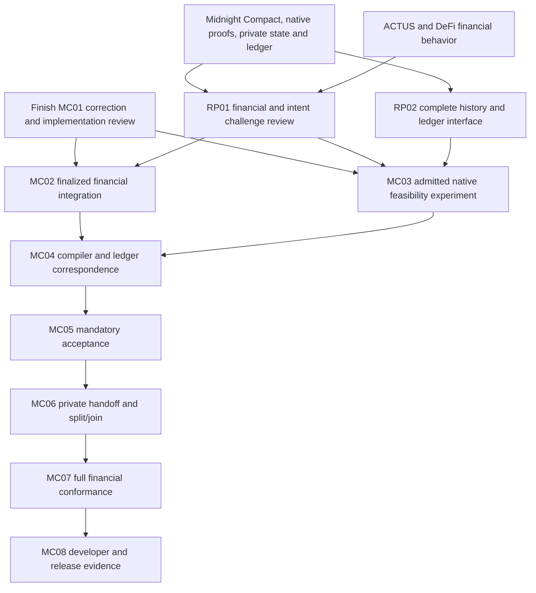

# Three-report review and remaining Moriarty plan

The remaining work covers the required language, financial, proof and ledger outcomes. Financial semantics and the complete native proof interface need early decisions. The [complete roadmap](../../ROADMAP.md) consolidates all remaining work alongside the [wiki notes](../../wiki/index.md). The [amended OpenSpec plan](../../openspec/REPORT-RECONCILIATION-2026-09-07.md) makes those decisions explicit. Fable 5.1 at medium effort and GPT-6 at high effort approved the conditional plan; [the audit disposition](audits/admission.json) records its exact scope and remaining engineering limits.

Moriarty is a Midnight-centric language. Compact, Midnight's native proof system, private state and ledger acceptance constrain the language and its developer interface. Preview is the public development network. ACTUS supplies financial lifecycle requirements; the DeFi corpus supplies economic behaviors and adversarial cases. NEAR, EVM, Cardano and other protocols in the reports are comparative sources, not additional deployment targets.

All changes are committed locally only while the GitHub repository is rebuilt. [Dated review-note clarifications](review-notes-errata.md) preserve the earlier reviewer context.

## Read the graph

Open [the interactive graph](graph.html), search a concept and inspect its source location and neighboring requirements. It contains all three report extractions, their semantic connections, the eight work packages, early planning gates and selected implementation gaps. The visualization loads its pinned vis-network library from a public CDN; the [JSON graph](graph.json) and [lossless extraction](extraction.json) can be read without that dependency.

[Graph report](GRAPH_REPORT.md) explains coverage, communities and evidence limits. [Requirement crosswalk](crosswalk.json) maps the main decisions to their owners. Separate full-report reviews preserve section coverage and source lines: [intents](intents.review.md), [PCD](pcd.review.md), and [DeFi](defi.review.md).

An extracted edge means that a report states a relationship. It does not establish external truth, implemented behavior or a theorem. Cross-report and package mappings are marked as review inferences. The reports contain opaque web citations and references to attachments that were not supplied. Those remain unresolved rather than receiving invented URLs or evidence claims.

## What changes in the plan

| Requirement | Remaining work and owner |
|---|---|
| Financial semantics before another general profile freeze | RP01 in MC01/05/06/07 reviews independent traces for all eight intent examples and financial edge cases, including capitalization, refinance, pending redemption, partial fills and shared-state effects. |
| Signed authority for liabilities | MC05 must distinguish permission to create debt from permission to spend tokens. The current atomic profile explicitly lacks a signed nominal-debt cap. |
| Native proofs that can reach actual Midnight acceptance | RP02 in MC03/04/06 specifies exact statements, artifact handoff, final accumulator verification and the pinned ledger route before a new native campaign. The existing source inspection has not established a complete wrapper. |
| Private branching history | MC06 must demonstrate isolated successor proving and real split/join with compatible policies, distinct predecessors, preserved obligations, residual authority and a conserved work budget. A fixed linear loan proof cannot establish this. |
| Faithful financial coverage | MC07 keeps every one of the 277 ACTUS fixtures, 32 taxonomy dispositions and 72 DeFi rows. Normalize product/version scope, preserve independent observations and derive campaign sizes from behavior coverage. |
| Actual acceptance and developer meaning | MC04/05/08 retain complete effects, durable consumption, mandatory claims, canonical signing, freshness and recovery. Add explicit revoked-key/activation and bounded-verification-input cases. |

The reports' optional-proof, unbounded-domain and other-chain-first recommendations are explicitly superseded for this product. Their useful semantic distinctions remain: resources differ from liabilities; a signed intent differs from a chosen plan; a proof of correct execution differs from a proof that execution met the intent; a correct model still needs correspondence to actual ledger behavior.

## Remaining sequence

RP03 applies candidate-specific command, resource and current Fable 5.1 (medium)/GPT-6 admission throughout. These are planning conditions; changing this register does not implement a dispatcher gate or arm an execution loop. Full package acceptance still requires its existing proofs, tests, ledger evidence and independent reviews.

## Current evidence boundary

The repository contains an experimental bounded atomic source language and local loan/swap evaluation. Preview has previously finalized a deployment and call. It has not demonstrated the required financial effect comparison or mandatory PCD acceptance. The native replacement is a fixed-instance source experiment; no real recursive proof has been produced. The complete native-to-Preview verifier, isolated private composition and full financial conformance remain open.

This review ran document extraction, graph integrity and plan consistency checks. It did not run a native proof, submit a transaction or repeat the product test suites. [Validation](validation.json) records the checks performed for this change. Report source hashes are in [the capture receipt](../../raw/reports/unified-2026-09-07/receipt.json). The intents and PCD bytes match the prior September 6 snapshots; the DeFi report is captured separately.
