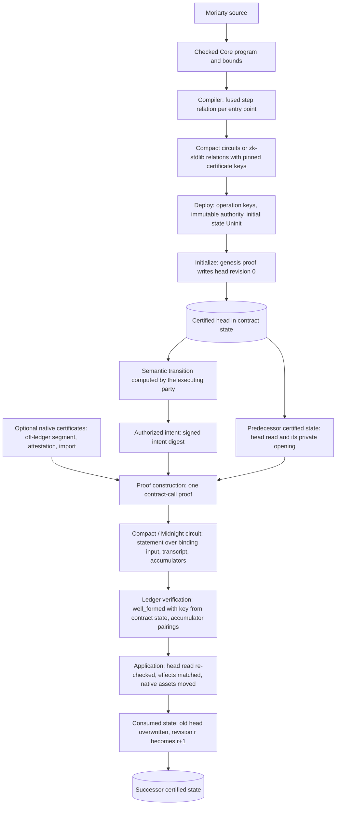

# How to read this report

**Evidence labels.** Every consequential statement carries one label.

| Label | Meaning |
|---|---|
| **[S]** | Source-inspected: read in implementation code at the cited file, line and commit. |
| **[D]** | Documented: stated in official documentation, a design record, a pull-request body, a paper, or a Moriarty design document. |
| **[O]** | Observed: seen in live network responses or in retained execution evidence. |
| **[R]** | Reproduced: measured locally for this report on stated hardware. |
| **[I]** | Inferred: a conclusion drawn from labelled facts, with no single artifact that settles it. |
| **[P]** | Proposed: a design recommendation of this report. |

Moriarty's own documents are treated as statements of design intent, never as independent evidence about Midnight.

**Commit keys used in citations.**

| Key | Repository and ref | Commit |
|---|---|---|
| L8 | midnight-ledger `ledger-8` head (live generation) | `3fa0d1d15a3c` |
| L9 | midnight-ledger `ledger-9` (next hard fork) | `0d364eb9f8c3` |
| L10 | midnight-ledger `ledger-10` | `08a9ee27bb3d` |
| X | midnight-ledger pull request 738, base `ledger-10` | `416da99309cf` |
| N | midnight-node `main` | `2ae5db6bfb54` |
| N102 | midnight-node `release/node-1.0.2` | `67cf566c1378` |
| Z | midnight-zk `main` | `695351f1cdb3` |
| V2 | midnight-zk `zk-stdlib-v2` (source of circuits 7.2.4, zk-stdlib 2.3.5) | `cfa6250` |
| C | LFDT-Minokawa/compact (compiler source, 0.34.100) | `11e7ec5a` |
| M | CharlesHoskinson/Moriarty `main` | `9762c06` |

The source appendix (section 21) lists every pin, release and retained capture.

**Planning assumption.** Midnight-native in-circuit proof verification is assumed to reach production within a few months. Its concrete implementation is pull request 738, which adds a ZKIR `verify_proof` instruction and a ledger-side deferred-accumulator check on the `ledger-10` branch [S: X]. On 8 September 2026 the ledger lead marked its review threads resolved for merge, on condition that the remaining concerns are fixed before `ledger-10` moves to release candidate [D: X review record]. At the time of writing, Preview, Preprod and Mainnet all run node `1.0.2-eb71e64e`, runtime spec 1000000, which is the ledger 8 generation [O: 2026-09-11T06:29Z]. The recommended architecture is built so that everything except its recursive certificates works on ledger 8 and ledger 9, and so that the recursive parts use exactly the interface pull request 738 defines.

# 1. Executive conclusion

**Decision.** Moriarty should adopt a *ledger-anchored certified state machine with bounded native certificates* [P]. It should not build general-purpose DAG proof-carrying data, and it should not make every transaction recursively verify its predecessor's proof.

The design has four parts.

1. **One fused step relation per entry point.** Each Moriarty action compiles to one Midnight contract-call circuit. That circuit proves, in a single statement, that the action was authorized, that the transition and its financial effects follow Moriarty semantics, that the effects refine the signed intent, and that the per-step invariants hold. The ledger verifies it against a verifying key read from contract state, so the prover cannot choose the verifier [S: L8 `ledger/src/verify.rs:1802-1864`] [P].
2. **History by ledger induction, not by recursion.** Every entry point reads the instance's current head commitment and revision and overwrites it, or reads a head's absence when it creates one. Midnight re-executes those reads against current state at application and rejects any mismatch [S: L8 `onchain-vm/src/result_mode.rs:42-59`]. With immutable verifying keys and a constrained genesis, every live head was produced by a chain of accepted steps back to genesis. That is Moriarty's history-compliance guarantee for all history that lives on the ledger, obtained without a history proof [I].
3. **Recursion only where the ledger cannot see the history.** Midnight's recursion verifies a Poseidon-transcript zk-stdlib proof inside a contract-call circuit against a verifying key fixed at compile time, and the ledger then checks the deferred accumulator [S: X `zkir-v3/src/ir_instructions/verify_proof.rs:74-126`, `transient-crypto/src/proofs.rs:764-801`]. Moriarty should use it for three bounded kinds of certificate: off-ledger execution segments, externally issued attestations, and imports from another instance or domain [P].
4. **The claim manifest becomes a compiled constant.** Mandatory claims are sub-relations of the verified circuit, so they cannot be stripped. The permitted certificate verifying keys are constants of that circuit, so they cannot be substituted. The deployed operation keys are immutable, so the policy cannot be downgraded. The participant signs an intent digest that names the contract, instance, revision, program digest and effect bounds [P].

**Why this, and not the current proposal.** Five facts decide it.

- **A contract-call proof cannot be the inner proof of another contract call.** Ledger-accepted contract proofs use a Blake2b transcript [S: X `transient-crypto/src/proofs.rs:72`], while `verify_proof` accepts only Poseidon-transcript inner proofs [S: X `verify_proof.rs:74`]. "Recursively verify the predecessor transaction's proof" is therefore not a native operation on Midnight, even after recursion ships [I].
- **The ledger already provides what history recursion would re-prove.** It provides canonical ordering and finality through consensus, stale-read rejection, unique consumption of coins, UTXOs, DUST and intents, verifier selection from contract state, and binding of the proof to the contract address, entry point, effects and the intent's binding commitment [S: L8 `verify.rs:1878-1937`; `onchain-vm/src/result_mode.rs:44-59`; `semantics.rs:1011-1017,1767-1814`; `zswap/src/ledger.rs:81-84`; `dust.rs:969-973`; `verify.rs:104-119`].
- **The only recursion family that fits Midnight's curve is atomic KZG accumulation.** Midnight verifies KZG proofs over BLS12-381 [S: X `zkir-v3/src/ir_instructions/verify_proof.rs:74-78`; `transient-crypto/src/proofs.rs:784`] and has no curve cycle [S: Z `curves/src`]. Folding schemes would need either a new curve or roughly a million non-native gates per fold [D: KS23 §1.2]. Midnight's own accumulation-based recursion costs a full in-circuit verifier per inner proof. In its end-to-end test, an outer circuit that does nothing but verify one trivial inner proof already needs k = 18, or k = 19 when the inner proof carries an accumulator [S: X `zkir-v3/tests/verify_proof_e2e.rs:22-27,64-66`] [R: 150,966 and 514,873 rows]. Paying that on every transaction buys nothing the ledger does not already give.
- **Private state must be handed over regardless.** No construction lets a successor prove a step that reads predecessor-private state without receiving an opening of that state or proving jointly by MPC [D: BCMS20 §5.1; OB22]. Recursion does not remove the handoff problem, so it cannot justify its cost on that ground.
- **Midnight's recursion is new and still moving.** Its accumulator pairings are not yet charged by the fee model [S: X `ledger/src/structure.rs:2045-2047`], a zero guard silently disables verification [S: X `verify_proof.rs:95-97`], and its formats may change before `ledger-10` reaches release candidate [D: X review]. Keeping recursion out of the core acceptance path contains that risk.

**What it costs.**

| Capability | Earliest ledger | Change class |
|---|---|---|
| Fused step relation, head read-then-write, immutable keys, constrained genesis | ledger 8 (live) | M0 and M1 |
| Branch and join inside one contract | ledger 8 | M1 |
| Branch, join and migration across contracts (cross-contract calls) | Compact 0.33 toolchain, which targets ledger 9. The ledger-8 verifier already enforces claimed calls, but no released Compact for ledger 8 emits them. | M1 |
| Recursive certificates (`verify_proof`) | ledger 10 | M1 for Moriarty once shipped; M2 SDK and M3 fee-model work on Midnight's side |

**First moves.** Run the five experiments in section 19, in this order:

1. read-then-write linearity on the live ledger;
2. fit of the fused step relation;
3. a native certificate on a `ledger-10` devnet with negative controls;
4. immutable keys with cross-contract migration;
5. an off-ledger IVC segment.

The first two decide the core architecture on today's network. The third decides whether certificates are affordable.

## The counterfactual

> **If Moriarty were being designed today from scratch knowing Midnight's exact architecture, would we choose the PCD architecture currently proposed? If not, what would we build instead, and why?**

**No.** The current proposal treats Midnight as a generic settlement layer. It asks each transaction to carry a recursive proof that its predecessors were valid, together with a transaction-level manifest of separately verified claims whose verifier identities must be policed. On Midnight those mechanisms either cannot be built as described, because contract proofs are not recursively verifiable, or duplicate what the ledger already enforces: verifier selection, ordering, stale-state rejection, effect binding and replay protection.

Starting from scratch, Moriarty would compile each agreement into a Midnight contract whose immutable operation keys *are* the policy. It would make every action a single fused proof that reads and replaces a committed head, derive history compliance by induction over ledger acceptance from a constrained genesis, and spend Midnight's new recursion only on what the ledger cannot see: off-ledger execution segments, third-party attestations and cross-domain imports. The mandatory-evidence goal is kept intact. What changes is where each piece of evidence is checked.

# 2. Moriarty's actual PCD requirements

## 2.1 What the repository intends

The README defines the intended acceptance rule as four families of evidence [D: M `README.md:580-585`]:

- **contract properties:** declared invariants hold over their domain;
- **intent refinement:** the execution stays within the participant's authorization;
- **transition validity:** the next state and effects follow the semantics;
- **history compliance:** the predecessors originate from an allowed initial state.

Deployment policy is meant to fix the permitted claim specifications and verifier versions. The participant's signature commits to the mandatory claims, and acceptance must reject missing evidence, unsupported mandatory claims and unresolved dependencies [D: M `README.md:587`]. The README also states that a valid history proof establishes neither external price truth nor unspent status, and that zero-knowledge capability does not provide private witness handoff [D: M `README.md:591`].

## 2.2 What exists

Nothing that enforces this model is implemented [O: M `openspec/moriarty-completion-program.json`]:

- **Package status.** The mandatory-claim and composition packages are specified only, and the verifier-interface package was blocked at the pinned commit.
- **Claim model.** It exists in inconsistent forms, with at least five claim vocabularies across the repository. Three matter here:
  - a report-derived `ClaimSpec → manifestRoot → intentDigest → BoundClaim` chain, implemented only in an unconnected local mock [O: M `experiments/moriarty-developer-mock/src/language/claims.ts`];
  - a registered atomic profile whose claim requirements carry no verifier-key, validity, dependency or budget fields [D: M `experiments/moriarty-language/spec/typed-schemas.md:343-345`];
  - claim names that differ across layers.
- **History.** It is linear with predecessor fan-in 1 [D: M `experiments/moriarty-language/spec/bounds.json:94`]. Split and join are specified only in prose, and the one executed split/join checker uses no proofs or signatures [O: M `deliverables/sp01-signing-context-contract-2026-09-10/RESULT.md:7-21`].
- **Native recursion attempt.** The native IVC experiment on midnight-zk `695351f` produced no proof. Its third attempt failed key generation with `NotEnoughRowsAvailable { current_k: 17 }` on a fixed two-step loan table with 54 public limbs [O: M `evidence/moriarty-native-ivc-r3-2026-09-07/attempt-03/native.stdout.txt:12`].
- **Preview runs.** The four Preview financial runs of 10 September 2026 executed scenario-pinned custody contracts with ordinary Compact proofs. No Moriarty claim was verified, and every proof-acceptance flag is false [O: M `deliverables/sp05-financial-integration-2026-09-09/preview-loan-01/actual-run/integration-result.json`].
- **Verifier keys.** They are replaceable in practice. The deployed Preview contracts carry a one-key maintenance committee with threshold 1 [O: M `experiments/moriarty-midnight-financial/ledger/continue-initialized-swap.mjs:38`], so the promise that deployment policy fixes verifier versions does not hold for them [I].

## 2.3 Is the decomposition right for Midnight?

The four families name the right concerns, but three of them conflate distinct obligations. On Midnight those obligations are discharged in different places.

| Moriarty family | What it actually bundles | Where it belongs on Midnight |
|---|---|---|
| Contract properties | (a) a universal property of the program, true of all reachable states; (b) a per-step guard that the next state satisfies | (a) is a deploy-time certificate bound by program digest, not a per-transaction SNARK claim. (b) is a constraint in the step circuit. [P] |
| Intent refinement | authorization of the principal; bounds on debits, recipients and assets; bounds on new liabilities | All in the step circuit. The atomic profile's outcome caps do not bound new debt [D: M `spec/semantics.md:575-578`], which is a requirement gap, not a proof-system issue. [P] |
| Transition validity | semantics of the step; exact correspondence of Moriarty effects to ledger-native effects | Step circuit for semantics. Ledger `effects_check` and balancing for native effects, which the circuit must constrain through its transcript. [S: L8 `verify.rs:1384-1672`] [P] |
| History compliance | (a) applicability: the predecessor is the current, unconsumed head; (b) provenance: the head descends from a constrained genesis through compliant steps | (a) is ledger-enforced by read-then-write. (b) comes by ledger induction for on-ledger history, and needs a certificate only for off-ledger or imported history. [I] [P] |

**Revised decomposition** [P]:

| Id | Requirement | Where it is discharged |
|---|---|---|
| R1 | Program admissibility | Deploy time: program digest, reproducible build, universal-property certificate |
| R2 | Applicability | Ledger read-then-write on the instance head |
| R3 | Authorization and refinement | Step circuit |
| R4 | Transition and effect correspondence | Step circuit plus ledger effect checks |
| R5 | Per-step invariants and conservation | Step circuit |
| R6 | Provenance | Ledger induction on-ledger; native certificate off-ledger |
| R7 | Observation authenticity | Step circuit, or a certificate |

R7 is authenticity only: oracle truth remains external. Section 11 shows how these map onto a compiled claim set.

## 2.4 The external boundary is correct and must stay

Moriarty is right that proof validity does not provide double-spend prevention, canonical state, ordering, finality, oracle truth, data availability, witness availability, replay protection or private witness transfer [D: M `README.md:591`].

On Midnight, several of these are provided by the ledger and consensus, and the design should *use* them rather than re-prove them:

- **coin and UTXO consumption** [S: L8 `zswap/src/ledger.rs:68-90`, `semantics.rs:1767-1814`];
- **intent replay protection** within the time-to-live [S: L8 `semantics.rs:1817-1862`];
- **stale-read rejection** [S: L8 `onchain-vm/src/result_mode.rs:42-59`].

The others stay outside every proof: finality, oracle truth, data and witness availability, and private witness transfer.

# 3. Midnight architecture relevant to PCD

## 3.1 Versions in force

**Networks** [O: `raw/sources/pcd-midnight-native-2026-09-11/midnight-network-runtime-versions-2026-09-11.json`].

| Network | Node `system_version` | Runtime spec | Transaction version |
|---|---|---|---|
| Preview | 1.0.2-eb71e64e | 1000000 | 3 |
| Preprod | 1.0.2-eb71e64e | 1000000 | 3 |
| Mainnet | 1.0.2-eb71e64e | 1000000 | 3 |

**Ledger generations.**

| Generation | Status | zk crates linked | Evidence |
|---|---|---|---|
| Ledger 8 | Live everywhere; release 8.1.2 of 2026-09-03 | proofs 0.7.1, circuits 6.2.0, zk-stdlib 1.2.0, curves 0.2.0 | [S: L8 `Cargo.lock`] |
| Ledger 9 | Next hard fork, in node 2.1.0-beta.1 (spec 2_001_000, transaction version 4) | proofs 0.8.2, circuits 7.2.4, zk-stdlib 2.3.5, plus the v1 stack | [D: node-2.1.0-beta.1 release notes] [S: L9 `Cargo.lock`] |
| Ledger 10 | Branch, unreleased; carries pull request 738 | as ledger 9 | [S: L10, X] |

- The public `release/node-1.0.2` branch pins midnight-ledger 8.1.1. Commit `eb71e64e` is not in the public repository, and an open pull request bumps the pin to 8.1.2 [S: N102 `Cargo.toml:79`] [O]. The exact ledger patch on the networks therefore cannot be decided from public sources. It is 8.1.1 or 8.1.2, both ledger 8 [I].
- The Compact compiler's latest release is 0.34.0, which targets ledger 9. The release notes tell developers targeting Mainnet to stay on 0.31.x [D: `compactc-v0.34.0` release notes]. Cross-contract calls arrived in 0.33.0 together with ledger 9 support [D: same].
- The proof server used for Moriarty's Preview runs is image `midnightntwrk/proof-server:8.1.0` [O: M `moriarty-midnight-network/compose.digests.yml:7`].

**Version mismatch to carry forward.** Midnight's 2023 proof-system decision record chose "Halo 2 over Pluto/Eris with KZG", explicitly for its curve cycle [D: midnight-architecture `adrs/0013-proof-system.md` @eabbedf]. The implementation uses BLS12-381, and no Pluto or Eris code exists [S: Z]. Any Moriarty design that assumes cycle-based recursion follows the record, not the implementation.

## 3.2 Proof system

**Construction** [S: Z unless noted].

- **Prover.** A heavily diverged Halo2-derived PLONKish prover, midnight-proofs. Features: custom gates, a permutation argument, additive "trash" selectors, committed instances, and (from 0.8.0) logup lookups [D: Z `proofs/README.md`, `proofs/CHANGELOG.md`].
- **Polynomial commitment.** KZG over BLS12-381, with the Halo 2 book's multipoint opening producing one opening proof [S: Z `proofs/src/poly/kzg/mod.rs:64-80,225-342`]. The repository labels the scheme "GWC" and "SHPLONK" in different places; the code is neither [I].
- **Native verification.** One multi-Miller loop over two pairs and one final exponentiation [S: Z `proofs/src/poly/kzg/msm.rs:294-309`].
- **Transcripts.** Blake2b, Blake2b-256 or Poseidon. Ledger-accepted contract, Zswap and DUST proofs use Blake2b [S: L8 `transient-crypto/src/proofs.rs:64`; X `:72`]. Recursion uses Poseidon [S: Z `circuits/src/hash/poseidon/poseidon_cpu.rs:190-202`].
- **Setup.** A universal powers-of-tau SRS of length 2^25 over BLS12-381, re-randomized from the Filecoin phase-1 SRS. The ceremony closed on 2025-12-16 [D: midnight-trusted-setup `README.md` @3ea6102]. Ledger 8 verifies against embedded 2^14 verifier parameters, which hold only G2 elements [S: L8 `proofs.rs:121-127`; midnight-proofs 0.7.3 `poly/kzg/params.rs:235-239`].
- **Verifying-key identity.** A Blake2b-512 hash over the domain, fixed and permutation commitments, and a `Debug` rendering of the constraint system [S: Z `proofs/src/plonk/mod.rs:246-278`]. A code comment flags the `Debug` rendering for replacement, so key identity can drift with formatting changes [I].

## 3.3 Fields, curves and hashes

- **Main curve.** BLS12-381 only. The midnight-curves crate names the 255-bit scalar field `Fq` and the 381-bit base field `Fp`, the reverse of the common convention [S: Z `curves/src/bls12_381/fq.rs:1-3`].
- **Embedded and other curves.** JubJub is embedded over the scalar field. secp256k1, P-256 and Curve25519 appear as emulated curves [D: Z `curves/README.md`]. BN256 is also present as a development curve [S: Z `curves/src/bn256`].
- **No curve cycle.** No curve in the crate, BN256 included, forms a cycle with BLS12-381, and there is no Pasta, Grumpkin, Pluto or Eris code [S: Z `curves/src`]. JubJub cannot substitute for a cycle, because its group order is not the scalar field's modulus [D: AEG22 §2] [I].
- **Poseidon.** Width 3, rate 2, 8 full and 60 partial rounds, S-box x⁵ [S: Z `circuits/src/hash/poseidon/constants/mod.rs:17-26`].
- **Emulated G1 coordinates.** Seven 56-bit limbs [S: Z `circuits/src/field/foreign/params.rs:278-288`].

## 3.4 Recursion, accumulation and aggregation facilities

| Facility | What it is | Status |
|---|---|---|
| In-circuit PLONK verifier (`circuits/src/verifier`) | Re-runs the verifier algebra with a Poseidon transcript. Computes no pairing; exposes a two-G1-point KZG accumulator, e(lhs,[τ]₂) = e(rhs,[1]₂), as public inputs [S: Z `verifier_gadget.rs:316-882`, `accumulator.rs:13-27`] | Published in circuits 7.2.4. "This library has not been audited" [D: Z `circuits/README.md:9`]. Points are read without subgroup checks, with a TODO for analysis [S: Z `types.rs:122-131`]. |
| IVC (`aggregation::ivc`) | Linear chain, one predecessor per step, off-circuit decider, final object a Poseidon-transcript proof plus accumulator [S: Z `aggregation/src/ivc/circuit.rs:57-222`, `verifier.rs:49-85`] | In the repository only, not on crates.io (HTTP 404), no tests, examples excluded from CI [S] |
| Multi-circuit aggregator | IVC transition verifying one inner proof per step against a witnessed verifying key of one shared shape; Poseidon hash of `transcript_repr` plus fixed and permutation commitments [S: Z `aggregation/src/multi_circuit_aggregator/utils.rs:40-121`] | Unpublished [S] |
| Decider trait (pull request 486) | Standard, IVC and final-IVC deciders | Closed unmerged 2026-08-03 [D] |
| Native batch verification | n proofs, one pairing [S: Z `zk_stdlib/src/interface.rs:599-667`] | Exists; the ledger never calls it [S: L8 grep] |
| Ledger `verify_proof` (pull request 738) | ZKIR `InnerProof` and `VerifyProof` instructions; inner verifying key pinned by SHA-256 and compiled into the outer circuit; `DeciderKind::{None, Collapsed}`; one 96-byte deferred accumulator per instruction; ledger pairing check per accumulator after the outer verify [S: X] | Open against `ledger-10`; merge conditionally agreed [D] |

**Recursion is same-curve accumulation.** Scalar arithmetic stays native in the circuit field. G1 arithmetic is emulated. Pairings are never computed in-circuit: they accumulate and are discharged natively [S: Z §5 synthesis]. This is atomic accumulation of KZG openings in the sense of BCMS20 §2.4.2 [D] [I].

**Midnight's own plan.** The draft improvement proposal "Proof Verification in Compact" [D: MIP pull request 198 @f49199163] specifies:

- a midnight-zk IVC interface, with DAG constructions available to advanced users;
- a Compact standard-library `verifyProof(proof, vk, public_inputs)` with the verifying key fixed at compile time. The variant taking the key as a witness was removed [D: review of 2026-07-30];
- a transaction extension carrying the accumulator, finalized at validation time.

The problem statement behind it confirms that Compact cannot verify a proof in-circuit today [D: MPS-0014].

## 3.5 Transaction and state model

- **Transaction structure.** A `StandardTransaction` holds a network id, intents keyed by segment, guaranteed and fallible Zswap offers, and binding randomness [S: L8 `structure.rs:1572-1579`]. Each `Intent` holds guaranteed and fallible unshielded offers, contract actions, DUST actions, a time-to-live and a binding commitment [S: L8 `structure.rs:844-852`]. Intents occupy segments 1 and above; segment 0 names the guaranteed phase [S: L8 `verify.rs:631-634`]. Each contract call carries a guaranteed transcript, run in that phase, and a fallible transcript, run in its intent's segment. A fallible failure yields `PartialSuccess`: guaranteed parts and fees are kept, fallible parts are dropped [S: L8 `semantics.rs:147-190`]. The transaction builder, not the circuit, decides how a transcript is split, using a gas budget and `checkpoint()` markers. With no checkpoint, a transcript lands wholly in one section [S: L8 `construct.rs:1111-1162`].
- **Contract state.** Public data, a map from entry point to operation (verifying key slots), a maintenance authority and a balance [S: L8 `onchain-state/src/state.rs:730-736`]. Private state never reaches the ledger. It lives in the caller's process and is stored per account and contract, AES-GCM encrypted under a password-derived key [S: midnight-js `level-private-state-provider/src/storage-encryption.ts:33,135-153`].
- **Asset models.** Shielded coins (Zswap: nullifiers and commitment tree), unshielded UTXOs (removed on spend), and DUST as the fee resource with its own nullifiers and a time window [S: L8 `zswap/src/ledger.rs:68-90`, `semantics.rs:1767-1814`, `dust.rs:960-973`].
- **Proving.** Proofs are generated client-side, locally or by a proof server that sees the witnesses. The proof server proves any ZKIR with client-supplied keys, and its self-check uses those same keys [S: L8 `proof-server/src/endpoints.rs:245-326`; `transient-crypto/src/proofs.rs:769-782`].
- **Concurrency.** Two transactions proven against the same state are both well-formed. The second to apply fails only if one of its declared reads no longer matches [S: L8 `semantics.rs:1383-1406`] [I].

# 4. The exact ledger/verifier seam

## 4.1 Where Midnight decides a proof is valid

Proof validity is decided in `Transaction::well_formed`, never in application. The node follows this path [S: N102 `pallets/midnight/src/lib.rs:436,561,567`; `ledger/src/versions/common/mod.rs:872-905`]:

1. transaction pool: `validate_unsigned`;
2. the ledger bridge: `validate_transaction`;
3. `get_verified_transaction`;
4. `tx.well_formed(ref_state, WellFormedStrictness::default(), tblock)`;
5. a dry-run `apply`.

The same verified transaction is reused at block inclusion only against the same state hash [S: N `ledger/src/ledger_8/mod.rs:1199-1201`]. The pool and block-inclusion dry runs accept `PartialSuccess` [S: N102 `ledger/src/versions/common/mod.rs:959-974`], so a call whose fallible section fails is still admitted and pays fees. Application sees the proof-erased transaction [S: L8 `verify.rs:643-646`].

For a contract call on ledger 8 [S: L8]:

1. `ContractCall::well_formed` (`verify.rs:1802`) looks up the operation by entry point in `ContractState.operations` (`verify.rs:104-120`).
2. `ProofMarker::proof_verify` requires the `v2` key slot and a `ProofVersioned::V2` proof (`structure.rs:435-472`).
3. `VerifierKey::verify` calls `midnight_zk_stdlib::verify::<DummyRelation, blake2b>` against the embedded verifier parameters (`transient-crypto/src/proofs.rs:566-583`).

Zswap and DUST proofs verify against compiled-in keys [S: L8 `zswap/src/verify.rs:57-74`; `ledger/src/dust.rs:81-86,565-652`]. Unshielded offers carry signatures, not proofs [S: L8 `verify.rs:436-483`].

## 4.2 What a contract-call proof binds

The ledger builds the statement itself; the prover does not supply it [S: L8 `verify.rs:1878-1937`].

```rust
pub fn public_inputs(&self, binding_com: Pedersen) -> Vec<Fr> {
    let mut res = vec![self.binding_input(binding_com)];      // PI[0]
    res.push(self.communication_commitment);                  // PI[1]
    for op in guaranteed.program { op.field_repr(&mut res); } // PI[2..]
    for op in fallible.program   { op.field_repr(&mut res); }
    res
}
// binding_input = SHA-256("midnight:binding-input[v1]" || address || entry_point
//   || guaranteed gas, effects || fallible gas, effects
//   || guaranteed program length || parent intent binding commitment)[..31]
```

| Bound into the statement | Not bound into the statement |
|---|---|
| Contract address and entry point | Network id: checked separately at transaction level [S: L8 `verify.rs:588`] |
| Declared gas and the full `Effects` of both transcripts: claimed nullifiers, receives, spends, contract calls, shielded and unshielded mints, unshielded inputs and outputs | Fees and DUST |
| The guaranteed program length | Intent time-to-live |
| The parent intent's binding commitment | Segment id: bound only indirectly through the binding commitment's Schnorr challenge [S: L8 `structure.rs:855-860`] |
| Every Impact operation, including public-state reads with their expected values (`Popeq`) and written values (`Push`) | Any state root, version or nonce: a call carries none [S: L8 `structure.rs:2406-2416`] |

**At application** [S: L8 `semantics.rs:1383-1406`]:

- the transcript runs against **current** contract state;
- every `Popeq` compares its declared value with the real one and fails with `ReadMismatch` [S: L8 `onchain-vm/src/result_mode.rs:42-59`];
- the recomputed effects must equal the declared effects;
- the contract's balance changes with checked arithmetic.

## 4.3 How the verifying key is chosen, installed and changed

- **Where keys live.** `ContractState.operations[entry_point]`. At ledger 8 this is a single `v2` slot [S: L8 `state.rs:871-887`]. Ledger 9 and 10 add a `v3` slot for zk-stdlib 2 keys, plus an `ir` field that no verification path reads [S: L9 `state.rs:894-900`; L10 `verify.rs`, no reference].
- **Deploy.** The address is the SHA-256 of the tagged deploy serialization, so the initial keys and initial state are committed into the address [S: L8 `structure.rs:2523-2542`]. Deploy checks only that every operation has a key and that the authority counter is zero. It does not parse keys, and **it runs no proof over the initial state** [S: L8 `verify.rs:354-393,1708-1731`].
- **Maintenance updates.**
  - A committee threshold-signs `ReplaceAuthority`, `VerifierKeyRemove` and `VerifierKeyInsert`, with a counter [S: L8 `structure.rs:2687-2752`; `verify.rs:1749-1799`; `semantics.rs:1480-1528`].
  - The default authority is an empty committee with threshold 1 [S: L8 `state.rs:710-716`], which can never sign, so its keys are immutable [I].
  - The threshold is what matters. Neither deploy nor `ReplaceAuthority` validates it, and an empty committee with threshold 0 accepts unsigned maintenance updates [S: L8 `verify.rs:354-363,1789-1795`].
  - midnight-js deploys with a single-signature authority by default [D: midnight-docs `guides/deploy-and-operate.mdx:616-628`].
  - Ledgers 9 and 10 add `IrInsert` and `IrRemove` updates, so the authority also controls the stored IR [S: L10 `structure.rs:2962-2965`].
- **Key format.** Keys are parsed lazily at first verification as a `MidnightVK`, which rebuilds the constraint system from `ZkStdLib::configure` [S: L8 `proofs.rs:532-554`; zk-stdlib 2.3.3 `lib.rs:1581-1598` on the ledger-9 line; ledger 8 links 1.2.0, and the same path was read in 1.3.0]. The ledger therefore accepts any zk-stdlib-shaped circuit's key up to 50,000 bytes whose public-input count matches the ledger statement, including a hand-written zk-stdlib relation not produced by Compact [I].

## 4.4 Can application-defined recursive proofs reach the verifier?

**Today, on ledgers 8, 9 and 10: no, not soundly** [S] [I]:

- The on-chain VM has no curve, pairing or verify opcode [S: L8 `onchain-vm/src/ops.rs:95-200`].
- ZKIR v2 and v3 have no verify instruction [S: L8 `zkir/src/ir.rs`; `zkir-v3/src/ir.rs`].
- A deployed circuit may contain midnight-circuits' in-circuit verifier, but its deferred accumulator would never be pairing-checked. The inner proof would be unverified.
- A host Boolean asserting "the inner proof verified" is not constrained by anything the ledger checks.

**With pull request 738: yes, for Poseidon-transcript zk-stdlib v2 proofs over Midnight's SRS** [S: X]:

```rust
#[tag = "proof[v6]"]
pub struct Proof { pub bytes: Vec<u8>, pub accumulators: Vec<DeferredAccumulator> }

// VerifierKey::verify (transient-crypto/src/proofs.rs:764-802)
let mut pi = proof.accumulators.iter().flat_map(|a| a.as_public_input()).collect::<Vec<_>>();
pi.extend(statement);                      // unchanged ledger statement follows
midnight_zk_stdlib::verify::<DummyRelation, TranscriptHash>(&params, &vk, &pi, None, &proof.bytes)?;
for acc in proof.accumulators.iter() {     // each deferred pairing, separately
    if !acc.to_accumulator().check(&params, &BTreeMap::new()) { return Err(..) }
}
```

- **Verification happens at validation.** The pairing is discharged in `well_formed`, not during contract execution, which matches the ledger lead's review position [D: MIP 198 review, 2026-06-26].
- **The inner verifying key is pinned.** `VerifyProof { guard, vk_hash, instance, proof }` names the inner key by SHA-256. Its domain, constraint system, `transcript_repr` and fixed commitments are compiled into the outer circuit as constants [S: X `zkir-v3/src/ir.rs:1059-1107`; `verify_proof.rs:106-126`]. The outer key in `ContractOperation.v3` therefore pins every inner key, and whoever controls the outer key controls the inner keys [I].
- **Inner public inputs are witnesses.** They are outer-circuit wires, not ledger-visible fields. They mean something only if the outer circuit ties them to its transcript or to the binding input [S: X `verify_proof_e2e.rs:251-297`] [I].
- **Accumulators.** Each is 96 bytes and 12 public-input fields, placed first in the statement. Deserialization rejects off-curve and out-of-subgroup points [S: X `proofs.rs:397-404,436-560`].
- **Hazards at this head.**

| Hazard | Evidence |
|---|---|
| Guard 0 reduces the accumulator to the trivial one, which always pairs | [S: X `verify_proof.rs:95-97`; `decider.rs:220`] |
| `DeciderKind::None` on a proof that carries an accumulator is "a silent soundness bug" | [S: X `decider.rs:48-52`] |
| `Collapsed` checks neither an IVC proof's own `vk_repr` nor its state decider | [S: X `decider.rs:142-188`] [I] |
| Fees ignore accumulator public inputs and pairings | [S: X `ledger/src/structure.rs:2045-2047`] |
| An outer circuit that only verifies one trivial inner proof needs k = 18 (plain) or k = 19 (collapsed). A real step circuit adds its own rows. | [S: X `verify_proof_e2e.rs:22-27,64-66`] [R: 150,966 and 514,873 rows] |
| An inner proof that decodes but is invalid is not refused at proving time. The outer proof is produced, and only the ledger's accumulator pairing rejects it. | [R: section 14.2] |
| The test file notes published parameters stop at degree 17, while the ledger's data provider lists parameter files to 2^25. The ceremony's 2^18 and 2^19 files are downloadable and match the trusted-setup catalog hashes. | [S: X `verify_proof_e2e.rs:70-73`; L8 `base-crypto/src/data_provider.rs:82-207`] [R: `midnight-srs-2p18` SHA-256 `e8436dc5…`, `midnight-srs-2p19` SHA-256 `8e8dc15c…`]. Section 20 lists what remains open. |

## 4.5 The seam, stated precisely

**The Moriarty-to-Midnight seam is the verifying key stored in `ContractState.operations[entry_point]` of a Moriarty instance contract.** Everything Moriarty wants the ledger to enforce must be a constraint of the circuit behind that key, over the ledger-built statement:

- binding input;
- communication commitment;
- transcript operations;
- the accumulator prefix, from `ledger-10`.

Nothing else reaches consensus.

| Concern | Must stay in consensus-checked artifacts | May run on the host |
|---|---|---|
| Key pinning | Maintenance authority configuration | — |
| Head linearity | `Popeq` of the head, or of its absence when creating it, in every entry point | — |
| Effect correspondence | Transcript `Effects` constraints | — |
| Authorization and refinement | In-circuit checks | — |
| Certificate validity | `VerifyProof` with a constrained guard | — |
| Proof generation and key resolution | — | Yes: a wrong key yields a rejected proof, never an accepted bad one, because the ledger verifies against the key in contract state [S: L8 `verify.rs:1828-1860`; `structure.rs:444-469`] |
| Witness computation, transcript partitioning, handoff encryption | — | Yes |
| Local status checks | — | Advisory only [S: midnight-js `find-deployed-contract.ts:109-155`]; `submitTxAsync` returns only a transaction id [S: midnight-js `submit-tx.ts:151-156`] |

# 5. PCD and IVC techniques relevant to Midnight

## 5.1 Terms kept distinct

| Term | Definition used in this report |
|---|---|
| IVC over a linear history | Proof that a state is the result of iterating one step function from a base state. Arity 1 [D: Valiant 2008; KST22 Def. 5]. |
| PCD over a DAG | Proof that every vertex of a distributed computation, possibly with several input messages, satisfied a local compliance predicate back to its sources [D: CT10 Def. 3–4; BCMS20 Def. 3.2]. |
| Aggregation | One proof or check that several independent statements each verify. It establishes no link between them [D: GMN22 §6]. |
| Recursive verification of a predecessor | A circuit that runs a verifier for one earlier proof, whose statement it constrains. |
| Folding | Reducing two instances of a relation to one, with the check deferred to a decider [D: KST22 §3]. |
| Accumulation | Deferring an expensive predicate, such as a KZG pairing, into a running accumulator checked once at the end [D: BGH19 §4; BCMS20 Def. 2.1]. |

## 5.2 Evaluated against Midnight

Fit codes for the comparison below:

| Code | Meaning |
|---|---|
| **N** | Native to Midnight's stack |
| **NN** | Needs non-native field arithmetic but no new curve |
| **C** | Needs a curve cycle, 2-chain or second curve |
| **PCS** | Needs a new commitment scheme or prover |
| **X** | Not PCD |

| Family | Arity | Fit on BLS12-381 KZG Halo2 | Recursion overhead | Carried to successor | Setup | Maturity on Midnight | Verdict [I] |
|---|---|---|---|---|---|---|---|
| Full-verifier SNARK recursion (BCCT13, BCTV14) | DAG | C (pairing cycle; only MNT known) [D: BCTV14 §3.2; CCW19] | 3 pairings per proof | message plus proof | trusted | none | Reject |
| One-layer 2-chain (Zexe) | depth 1–2 | C; an outer curve for BLS12-381 has 2-adicity 1 [D: Zexe §2.5; EG22 §5.5] | native pairing on outer curve | inner proofs | trusted | none | Reject |
| **Atomic KZG accumulation (BCMS20; Midnight's deferred pairing)** | DAG of arity m | **NN**, no new curve [D: BCMS20 §2.4.2] [S: Z verifier gadget] | full non-PCS verifier plus Θ(n) emulated G1 scalar multiplications per inner proof; about 100k rows per IVC step [I from D: midnight-zk pull request 461] | message, proof, two G1 points | existing universal SRS | shipping with pull request 738 | **Use, for bounded certificates** |
| IPA accumulation (Halo, Pickles) | DAG | C (plain-curve cycle) | O(log C) group operations | O(log d) group elements | transparent | none | Reject |
| Split accumulation (BCLMS21) | DAG | NN plus PCS | ~8 group operations | accumulator with a linear witness part | transparent | none | Reject |
| Nova, SuperNova, HyperNova, ProtoStar, ProtoGalaxy, Mova | linear, or small-arity PCD | NN (≳10^6 gates per non-native scalar multiplication [D: KS23 §1]) plus a new relaxed-relation decider | 1–3 group scalar multiplications per fold | full witnesses (Nova is not zero-knowledge at the IVC layer) [D: KST22 §5] | transparent | none | Reject |
| CycleFold | linear or tree | C (curve with scalar field equal to the BLS12-381 base field) | ~10k extra gates per fold | two running instances | transparent | none | Reject |
| Folding PCD (Zhou et al., KiloNova, Mangrove) | r-ary | NN plus PCS, or C | 1 MSM(2r−1) plus O(r log C) field operations [D: ZZZD Table I] | running instances | transparent | none | Reject |
| Hash-based accumulation (Fractal, Arc) | DAG | curve-free, but replaces the commitment and prover stack | ~200k gates at 2^20 (Arc) | Reed–Solomon claims | transparent | none | Reject as a migration, not an extension |
| Aggregation (SnarkPack, aPlonK, batch KZG) | none | N | none | nothing; the verifier needs all statements | existing | native batch verification exists but is unused by the ledger | **X**; useful only for throughput |
| Collaborative or delegated proving (OB22, Eos, zkSaaS) | orthogonal | N | MPC cost | secret-shared witness | unchanged | none | Keep in reserve for handoffs that cannot reveal state |

## 5.3 Consequences for Moriarty

1. **Accumulation is the only viable family.** It works on Midnight without importing a curve or a commitment scheme [I].
2. **It supports multiple predecessors directly** [D: BCMS20 §5.1], but pull request 738 exposes one accumulator per `VerifyProof`. A node with m predecessors therefore costs m in-circuit verifiers, m accumulators and m + 1 native pairings [S: X `proofs.rs:793-800`] [I]. A hand-written zk-stdlib relation can fold m accumulators into one before exposure, which cuts the ledger's pairing count but not the prover's work [S: Z `accumulator.rs:355`] [I].
3. **Depth has no depth-independent security proof.** Unbounded-depth recursion under KZG accumulation rests on the algebraic group model plus heuristically instantiated random oracles [D: BCMS20 §1.1, Rem. 5.3; HN23]. Bounded depth avoids that question, and Moriarty's ledger-induction design needs no recursion depth at all for on-ledger history [I].
4. **Key binding is mandatory.** Every carried instance must bind a verifying-key digest, the Fiat–Shamir transcript must absorb accumulators and public inputs, and no carried object may be under-constrained [D: NBS23 App. B; DMWG23].

# 6. What Midnight's ledger makes unnecessary

The following are ledger or consensus guarantees that Moriarty should rely on rather than re-prove [I], each under the stated condition.

| Guarantee | Mechanism | Condition Moriarty must meet |
|---|---|---|
| The verifier is not prover-chosen | Key read from `ContractState.operations` [S: L8 `verify.rs:104-120`] | Immutable maintenance authority, or a constrained upgrade rule (section 12.5) |
| Proof is bound to this contract, entry point and effects | `binding_input` [S: L8 `verify.rs:1878-1937`] | Circuit constrains its effects through the transcript |
| Applicability: predecessor is current and unconsumed | `Popeq` re-execution [S: L8 `result_mode.rs:44-59`] | Every entry point reads the head it overwrites, or its absence when creating it, in the same transcript section with no checkpoint in between |
| Canonical ordering and finality | Consensus | Users wait for finality before treating settlement as final |
| Replay of the same Midnight intent | Intent-hash replay protection within the time-to-live [S: L8 `semantics.rs:1817-1862`] | Moriarty's own replay protection comes from the revision in the head, which outlives the time-to-live |
| Double spend of coins, UTXOs and DUST | Nullifiers and UTXO removal [S: L8 `zswap/src/ledger.rs:68-90`; `semantics.rs:1767-1814`; `dust.rs:960-973`] | Financial custody uses native assets, not bookkeeping in contract state |
| Value conservation and effect matching | `balancing_check`, `effects_check` [S: L8 `verify.rs:1307-1323,1384-1672`] | Moriarty effects map one-to-one onto transcript effects |
| History of on-ledger steps | Induction over accepted transactions | Constrained genesis, immutable keys, compiler correctness of the step relation |
| Cross-contract atomicity, in one direction | A claimed call must exist in the same intent and section, and no call may be claimed twice. Nothing requires a call to be claimed. [S: L8 `verify.rs:1001-1053,1563-1607`] [D: Compact `doc/ledger-adt.mdx:71`] | The head-creating side claims the head-retiring side, and the retiring side has a recovery path (section 12.4); Compact 0.33 toolchain |
| Private witness confidentiality from verifiers | Zero-knowledge proofs | Private data kept out of public state, reads and pushes |

**The central simplification.** With these conditions met, a successor transaction needs **no evidence of its predecessor at all** beyond the head commitment it reads. The ledger has already verified the predecessor, and the read proves it is current [I].

# 7. What still requires cryptographic provenance

Recursion, or at least an in-circuit check, remains necessary in these cases [I]:

1. **Off-ledger execution segments.** Steps executed between ledger checkpoints: private accrual schedules, bilateral netting rounds, delegated agent execution. The ledger never saw them, so a checkpoint must carry a proof that the segment is compliant from the last on-chain head.
2. **Third-party attestations.** Oracle observations, credential proofs (for example eligibility or sanctions status) and issuer statements produced by other circuits. Oracle signatures can be verified in-circuit when the scheme is supported (JubJub Schnorr natively, secp256k1 ECDSA with ZKIR v3 [S: C `standard-library.compact:367`; `zkir-v3-library.compact:93`]). Proofs from other circuits need `verify_proof`.
3. **Imports across instances or domains that cannot share a transaction.** Positions whose predecessor lives in another agreement instance that cannot be called in the same transaction, or state carried through an off-chain custody chain.
4. **Joins of branches that evolved off-ledger.** On-ledger branches join through ledger reads; off-ledger branches need one certificate per branch.
5. **Exported history for off-ledger verifiers.** A counterparty or auditor who will not run a node needs a proof that a head is compliant. Midnight offers no authenticated state-proof interface for this, so it is outside the acceptance path (section 17).
6. **Upgrades that cannot be expressed as a ledger-atomic migration**, such as migrating from a retired proof system when the old contract can no longer be called.

Financial composition inside a single instance — splits, joins, refinancing, partial repayment, netting across positions of one agreement — does **not** need recursion when all positions are heads of the same contract or of contracts that can be called in one transaction [I].

# 8. Candidate architectures

## 8.1 Architecture 1: recursive transaction history (the current proposal, made Midnight-native)

**Data flow.** Every Moriarty transaction carries its contract-call proof. It also carries, as a private witness, a Poseidon-transcript *history proof*: an IVC proof whose step verifies the previous history proof and the relation "this transition was valid". The contract-call circuit runs `VerifyProof` on the history proof with a `Collapsed` decider and binds its final state to the head it writes [P].

**Proving flow.**

1. The party executing step i receives the history proof πᵢ₋₁, its accumulator and the state preimage from the previous party.
2. They prove the IVC step at around k = 17 or 18, and the outer contract call at k ≥ 19 [S: X `verify_proof_e2e.rs:64-66`].

**Verification flow.** The ledger verifies the outer proof and one extra pairing per transaction.

**Trust assumptions.**

- The ledger and consensus.
- The IVC soundness at unbounded depth, on heuristic grounds.
- Correct handling of the `Collapsed` decider's missing key and state checks.

**Changes required.**

| Party | Change |
|---|---|
| Moriarty | A hand-written IVC relation in Rust over Moriarty's step; a Poseidon-transcript prover outside the proof server; handoff of IVC state between parties; all of Architecture 2's head discipline anyway, because history proofs do not prevent double consumption. |
| Midnight | Pull request 738; SDK plumbing for inner proofs (M2); fee accounting (M3). |

**Performance** [I]. Every transaction pays two proofs, one at k = 19. That is roughly a full in-circuit verifier's rows on every step, for no guarantee beyond Architecture 2 for on-ledger history.

**Multi-party behaviour.** Each successor must receive the IVC proof, accumulator, state preimage and prover artifacts. Joins need two `VerifyProof` instructions.

**Upgrade behaviour.** A proof-system change breaks the whole chain unless it is re-rooted.

**Principal risks.**

- It duplicates ledger guarantees at high cost.
- It is exposed to every hazard at pull request 738's head.
- It makes every step depend on unpublished IVC code.
- It fails if recursion slips.

## 8.2 Architecture 2: ledger-anchored certified state with bounded native certificates (recommended)

**Data flow.** One contract per agreement instance, or one contract holding several instance heads.

- *Public state* holds, per head: `instanceId`, `revision`, a hiding commitment to the Moriarty state, a lifecycle marker, the program digest and a network tag.
- *Private state* holds the preimages, delivered to entitled parties as encrypted openings.
- *Certificates* are optional, per entry point, fixed at compile time.

**Proving flow.**

1. The executing party computes the Moriarty step locally, obtains any required certificates, and signs the intent digest.
2. They prove one contract call: a Compact circuit, or a hand-written zk-stdlib relation where Compact is insufficient.
3. The call reads the head, checks the transition and writes the new head.

**Verification flow.**

1. The ledger verifies the call proof against the immutable operation key.
2. From `ledger-10`, it checks one accumulator per certificate.
3. At application, it re-checks the head read and the effects.

**Trust assumptions.**

- The ledger and consensus.
- Soundness of the compiled step relation against Moriarty semantics, which is the implementation layer.
- The constrained genesis rule.
- Immutable or constrained keys.
- Certificate issuers, only for the facts they attest.

**Changes required.**

| Party | Change |
|---|---|
| Moriarty | Fused step relation; head discipline; intent digest v2; genesis and migration entry points; compiled claim set; branch and join entry points; certificate relations for off-ledger segments. |
| Midnight | None for the core on ledger 8 and 9. Pull request 738 plus SDK plumbing for certificates. |

**Performance.**

- One proof per call at the Compact circuit's natural k.
- Certificates add a verifier gadget and an accumulator only where used.

Section 14 gives the benchmarks that set the bounds.

**Multi-party behaviour.** A successor needs only the public head, its own authority and the openings of the private fields its step reads. It never needs predecessor proofs.

**Upgrade behaviour.** Upgrades are explicit migration transitions, with successor programs forward-declared in the predecessor program (section 12.5).

**Principal risks.**

- A compiler or step-relation bug is inherited by every descendant, which is the same risk every design has.
- A contract whose keys are replaceable breaks the induction.
- A write-without-read entry point breaks linearity.
- Certificate hazards under pull request 738.

## 8.3 Architecture 3: agreement rollup (off-chain Midnight IVC with periodic checkpoints)

**Data flow.** All Moriarty transitions of an agreement run off-chain as a midnight-zk IVC chain. Only checkpoints go on-chain: one contract call that verifies the latest IVC proof and applies the net native effects [P].

**Proving flow.**

1. Each step extends the IVC proof. Midnight's example needs k = 18 at `695351f` (163,172 rows), proves in about 19 s per step, uses 4.4 GiB, and has a 411 MB proving key [R: section 14.2].
2. A checkpoint proves the outer call at k ≥ 19.

**Verification flow.**

- The ledger verifies each checkpoint's outer proof plus one accumulator.
- Intermediate steps are never verified by the ledger.

**Trust assumptions.**

- Everything in Architecture 2.
- Data availability of the off-chain chain.
- Liveness of the holders of the IVC state.
- No counterparty censoring checkpoint submission.
- Settlement of intermediate effects deferred to checkpoints.

**Changes required.**

| Party | Change |
|---|---|
| Moriarty | Everything in Architecture 1, plus netting of effects into checkpoints. |
| Midnight | As Architecture 1. |

**Performance.** Fewer on-chain transactions, but every step pays IVC prover cost, and intermediate financial effects do not settle.

**Multi-party behaviour.** Handoff of IVC state and state preimages at every step, with no ledger arbitration between checkpoints.

**Upgrade behaviour.** A chain must checkpoint before any program or proof-system change.

**Principal risks.**

- It converts ledger guarantees into off-chain liveness and availability assumptions.
- Native asset effects cannot happen between checkpoints, which is a poor fit for settlement-bearing financial agreements.

## 8.4 Architecture 4: external folding PCD wrapped by a Midnight verifier

**Data flow.** Moriarty histories are folded with a Nova-family scheme on a curve cycle, or with CycleFold. The final folding proof is compressed and then wrapped by a BLS12-381 Halo2 circuit deployed as a contract operation.

**Proving flow.**

1. Fold every step off-chain.
2. Compress the result with a SNARK.
3. Prove a BLS12-381 wrapper over the compressed verifier: a foreign-curve verifier emulated in BLS12-381's scalar field, or a new pairing-based compression.

**Verification flow.** As Architecture 2, with one very large wrapper proof.

**Trust assumptions.** New curves, a new commitment scheme and a new decider, plus folding-specific soundness history [D: NBS23].

**Changes required.**

| Party | Change |
|---|---|
| Moriarty | A new proof stack. |
| Midnight | None in principle (M1 through a custom key), but it depends on the wrapper fitting ledger limits. Research grade (M4). |

**Performance** [I]. The wrapper must emulate a foreign curve's verifier, at millions of constraints [D: KS23 §1; KS24 item 4]. Folding proofs carry witnesses and are not zero-knowledge at the IVC layer [D: KST22 §5].

**Multi-party behaviour.** Worst of all four: running instances include witnesses.

**Upgrade behaviour.** Two proof stacks to migrate.

**Principal risks.** New cryptographic dependencies outside Midnight, audit surface, prover memory, and wrapper fit.

# 9. Comparative decision matrix

Scores are relative (● strong, ◐ adequate, ○ weak) and rest on the evidence cited in sections 3 to 8 [I].

| Criterion | Arch 1: recursive tx history | **Arch 2: ledger-anchored + certificates** | Arch 3: agreement rollup | Arch 4: external folding |
|---|---|---|---|---|
| Native field and curve fit | ◐ same-curve accumulation | ● no recursion in core; accumulation for certificates | ◐ | ○ new curve or emulated foreign verifier |
| Uses Midnight's current verifier | ○ needs ledger 10 on every step | ● ledger 8 for the core | ○ ledger 10 | ◐ custom key; fit unknown |
| Prover cost per transaction | ○ two proofs, outer k ≥ 19 | ● one proof; certificates only where needed | ◐ per step IVC; checkpoint k ≥ 19 | ○ fold, compress, wrap |
| Verifier cost | ◐ plus one pairing per tx | ● one proof plus one pairing per certificate | ● per checkpoint | ◐ |
| Proof and transaction size | ◐ plus 96 B per tx | ● plus 96 B per certificate | ● | ◐ |
| Setup assumptions | existing SRS | existing SRS | existing SRS | new SRS or transparent stack |
| Browser, client and proof-server feasibility | ○ outer k ≥ 19: 82 s and 7.8 GiB for a trivial two-level test [R] | ● Compact-sized circuits in the core: k = 14 loan circuit in ~1.5 s, 249 MiB [R] | ○ | ○ |
| Branch and join | ◐ one verifier per branch | ● ledger reads within one contract; cross-contract from the Compact 0.33 toolchain | ○ off-chain only | ◐ |
| Multi-party successor | ○ hand over proof, accumulator, state | ● hand over state openings only | ○ | ○ witnesses in running instance |
| Private witness handoff | unavoidable for read state | unavoidable for read state, minimized | unavoidable | worse |
| State growth | constant proof; unbounded depth | constant head per instance | constant | constant |
| Upgrade and key versioning | chain must be re-rooted | explicit migration; immutable keys | checkpoint before upgrade | two stacks |
| Denial-of-service surface | accumulator pairings unpriced at X | limited to certificate entry points | same as Arch 1 | large wrapper |
| Implementation maturity | unpublished IVC, open pull request | Compact and ledger 8 today | unpublished IVC | research |
| Audit surface beyond Midnight | IVC relation, handoff | step relation, certificate relations | IVC relation, data availability | folding library, curves, wrapper |
| Extra cryptographic dependencies | none | none | none | new curves or commitment schemes |
| Survives a recursion slip | no | **yes, the core is unaffected** | no | yes, but M4 |
| **Rank** | 3 | **1** | 2 | 4 |

Architecture 3 ranks above Architecture 1 because its extra cost buys something real: fewer on-chain transactions and hidden intermediate steps. It is recommended only as the *segment mode* of Architecture 2, for agreement phases without native settlement, not as the default [P].

# 10. Recommended architecture

## 10.1 End to end



## 10.2 What Midnight should verify

For a call to entry point `e` of Moriarty instance contract `A`, with program `P` whose compiled operation key is `vk[P,e]`, the ledger checks one proof `π` whose statement `x` is built by the ledger [S: L8 `verify.rs:1878-1937`; X `proofs.rs:764-802`]:

```text
x = ( acc_1, …, acc_m,                                   -- 12 fields each; ledger-10 only
      bind = SHA256("midnight:binding-input[v1]" ‖ A ‖ e ‖ gas ‖ Effects ‖ len ‖ bindingCom),
      comm,
      T )                                                -- transcript operations

T contains, in one transcript section with no checkpoint between these operations:
  Popeq  head(headId) = (instanceId, headId, r, S_r, live, Π_P, netTag)
  Push   head(headId) := (instanceId, headId, r+1, S_{r+1}, live', Π_P, netTag)
  Popeq  block-time comparisons for I.notBefore, I.notAfter and observation age
  native effects E_native (unshielded outputs, mints, receives, claimed calls)

Ledger accepts iff
  PLONK.Verify_{blake2b}(vk[P,e], x, π)
  ∧ ∀ j ≤ m : e(acc_j.lhs, [τ]₂) = e(acc_j.rhs, [1]₂)
  and, at application, T re-executes on current state with no ReadMismatch
  and the recomputed Effects equal the declared Effects.
```

The circuit behind `vk[P,e]` must enforce this relation [P]:

```text
R_{P,e}(x ; w) holds iff there exist
  w = ( σ_r, ρ_r,          -- state preimage and commitment randomness
        a, args,           -- action and arguments
        obs, att,          -- observations and their authentication
        auth,              -- signature(s) or capability openings
        I,                 -- intent: caps, recipients, assets, liability limits, nonce, window
        {π'_j, inst_j} )   -- certificate proofs and instances (witnesses)
such that
 1. Applicability      S_r = Commit(σ_r; ρ_r) ∧ σ_r.instanceId = instanceId ∧ σ_r.headId = headId ∧ σ_r.revision = r
 2. Program            Π_P is the compiled constant of P ∧ σ_r.programDigest = Π_P
 3. Authorization      VerifySig(auth, pk, D) = 1 for every principal required by σ_r.policy(a),
                       where D = H("MORIARTY-INTENT-v2" ‖ netTag ‖ A ‖ e ‖ instanceId ‖ headId ‖ r ‖ S_r
                                   ‖ Π_P ‖ H(a,args) ‖ H(I) ‖ H(obsPolicy_I) ‖ H(certReq_e)
                                   ‖ I.nonce ‖ I.notBefore ‖ I.notAfter)
 4. Time               [I.notBefore, I.notAfter) ⊆ σ_r.validity ∧ block-time reads in T enforce it
 5. Observations       obs authenticated against σ_r.oracleKeys (in-circuit signature)
                       or by certificate j with vk fixed in P
                       ∧ obs.feed ∈ obsPolicy_I.permittedFeeds
                       ∧ obs.timestamp ∈ [I.notBefore, I.notAfter)
                       ∧ blockTime − obs.timestamp ≤ σ_r.maxObservationAge     -- block-time reads in T
 6. Transition         (σ_{r+1}, E) = Step_P(σ_r, a, args, obs) within bounds B_P, no rejection
 7. Effect binding     E_native = Project(E), the exact asset, amount and recipient of each Transfer/Fee
                       and each mint or receive appear in T; nothing else does
 8. Refinement         E ⊑ I: debits ≤ caps, recipients ∈ permitted, assets ∈ permitted,
                       new liabilities ≤ I.liabilityCap, net-credit goal met
 9. Invariants         Inv_P(σ_{r+1}) ∧ Conserve_P(σ_r, E, σ_{r+1})   -- residual obligations, budgets
10. Successor head     S_{r+1} = Commit(σ_{r+1}; ρ_{r+1}) ∧ live' = Lifecycle_P(σ_{r+1})
11. Certificates       ∀ j: VerifyProof(guard = constant 1, vk_j fixed in P, inst_j, π'_j),
                       with the producing InnerProof guard also the constant 1
                       ∧ inst_j binds (kind_j, netTag, A, instanceId, headId, r, S_r or segment endpoints,
                                       I.notBefore, I.notAfter)
                       ∧ for IVC certificates: inst_j[0] = vk_repr_j constant ∧ Decide_j(inst_j.state)
```

## 10.3 What Midnight should not verify

| Property | Why it stays outside the proof | Where it belongs |
|---|---|---|
| Ordering and finality | Consensus property; a proof cannot establish it | Consensus; clients wait for finality |
| DUST fee sufficiency | Already enforced by `balancing_check` and not visible to contract circuits [S: L8 `verify.rs:616-629`] | Ledger |
| Oracle truth | A proof can authenticate an attestation, never its economic truth | External attestation layer; agreement terms name the oracle |
| That the operation key implements Moriarty source | Keys are not checked against any IR [S: L9 `verify.rs`, no `ir` read] | Reproducible build, deployment review, program digest (M0) |
| Universal contract properties (all reachable states) | Not a per-transaction SNARK statement | Deploy-time certificate bound by program digest |
| Data and witness availability, handoff delivery | Liveness, not validity | Application: encrypted openings, recovery owners |
| Light-client history for off-ledger parties | No authenticated state-proof interface | Future Midnight feature (section 17) |
| Identity of the transaction submitter | `ownPublicKey()` names the submitter, not an authorizing principal [D: compactc 0.34.0 notes] | Principals authenticated in-circuit |

## 10.4 PCD state carried between transactions

The minimal successor-visible state per live head [P]:

| Field | Size | Visibility | Purpose |
|---|---|---|---|
| `instanceId` | 32 bytes | public | Identity of the agreement lineage; `H(genesisBody)` |
| `headId` | 32 bytes | public | Identity of this head within the instance; `H(instanceId ‖ parentHeadIds ‖ splitIndex)` |
| `revision` | 64-bit | public | Replay protection and ordering within the head |
| `stateCommit` | 1 field (32 bytes) | public | Hiding commitment to σ: state, obligations, budgets, principals, oracle keys, validity |
| `lifecycle` | enum | public | Live, Releasing, Split, Joined, Migrated, Terminated |
| `programDigest` | 32 bytes | public, constant per contract | Binds the head to P and its compiled claim set |
| `netTag` | 32 bytes | public, constant per contract | Network domain separation, which the contract statement does not provide |

Everything else, including balances owed, principal identities and residual obligations, stays inside σ and reaches a successor only as an encrypted opening. Section 13 covers the handoff.

# 11. Claim and envelope design

## 11.1 Fuse or separate?

| Claim | Recommendation | Reason |
|---|---|---|
| TransitionValidity | Fuse into the step relation | Same witness, same statement; separation only adds binding surface. |
| IntentEffects / IntentRefinement | Fuse | Refinement is a predicate over the same effects; a separate proof invites mismatched effect sets. |
| ContractInvariant (per step) | Fuse | It is a constraint on σ_{r+1}. |
| ContractProperty (universal) | Separate, static, at deploy | Verified once per program; bound by `programDigest`; not a transaction claim. |
| HistoryCompliance (on-ledger) | Remove as a claim | Discharged by ledger induction (section 6). |
| HistoryCompliance (off-ledger segment) | Separate certificate | Different prover, different time; needs `VerifyProof`. |
| Authorization / private authority | Fuse | Signatures over the intent digest verified in-circuit; capability openings as witnesses. |
| Observation authenticity | Fuse when a supported signature suffices; otherwise a certificate | JubJub Schnorr or secp256k1 ECDSA in-circuit; foreign proofs need `VerifyProof`. |
| State membership / applicability | Fuse, with ledger enforcement | `Popeq` of the head. |

Separating claims pays for itself only when they come from different provers, at different times, or with independent upgrade cycles. On Midnight the upgrade cycle of any sub-relation is tied to the outer operation key regardless, because inner keys are compiled into it [S: X `verify_proof.rs:106-126`]. "Independently upgradeable predicates" is therefore not achievable by splitting claims into separate proofs [I].

## 11.2 Canonical structure

The proposed replacement for `TxCore → ClaimSpec → claim IDs → manifest → signed intent → evidence → final transaction` [P]:

```text
Program time (compiler, once per program version)
  ClaimSet_e    = ordered list of (claimKind, subrelationId, certKind?, certVkHash?) for entry point e
  Π_P           = H("MORIARTY-PROGRAM-v2" ‖ coreHash ‖ boundsHash ‖ propertyCertHash
                    ‖ H(ClaimSet_e for all e) ‖ compilerVersion ‖ zkirVersion ‖ zkStdlibVersion
                    ‖ successorAllowList)                        -- successor program digests only
  vk[P,e]       = keygen(circuit(P, e))            -- contains ClaimSet_e and every certVk as constants

Deploy time (once per instance contract)
  ContractDeploy{ initial_state = Uninit(Π_P, netTag), operations = {e ↦ vk[P,e]},
                  maintenance_authority = (committee [], threshold ≥ 1, counter 0) }  -- address commits to all of it
  -- a migration successor records its predecessor instead: initial_state = Uninit(Π_P, netTag, A_pred)

Transaction time
  TxCore        = (A, e, instanceId, headId, r, S_r, a, args)
  CertReq_e     = the certificate requirements of e              -- read from ClaimSet_e, not chosen by prover
  IntentDigest  = H("MORIARTY-INTENT-v2" ‖ netTag ‖ A ‖ e ‖ instanceId ‖ headId ‖ r ‖ S_r ‖ Π_P
                    ‖ H(a,args) ‖ H(caps, recipients, assets, liabilityCap, netGoal)
                    ‖ H(obsPolicy) ‖ H(CertReq_e) ‖ nonce ‖ notBefore ‖ notAfter)
  Signature     = Sign_sk(IntentDigest)                           -- verified inside R_{P,e}
  Evidence      = { π'_j certificates (private witnesses), σ_r opening, signatures }
  Midnight tx   = Intent{ ContractCall{A, e, transcripts, comm, Proof{bytes, accumulators}}, offers, ttl, bindingCom }
```

**What must be inside cryptographic commitments.**

| Commitment | Contents | Enforced by |
|---|---|---|
| Contract address | Operation keys and initial state (so `Π_P` and `netTag`) | Ledger address derivation [S: L8 `structure.rs:2523-2542`] |
| `vk[P,e]` | The step relation, `ClaimSet_e`, every certificate verifying key | Key identity [S: Z `plonk/mod.rs:246-278`] |
| `stateCommit` | The complete σ, including obligations, budgets, principals, oracle keys and validity | Step relation constraint 1 |
| `IntentDigest` | Everything a signer relies on: contract, instance, head, revision, state, program, action, effect bounds, observation policy, certificate requirements, nonce and window | Step relation constraint 3 |
| Certificate instance | Kind, network, contract, instance, revision or segment endpoints, window | Step relation constraint 11 |
| Binding input | Address, entry point, effects, program length, intent binding commitment | Ledger |

**How the envelope defeats the listed attacks** [I]:

| Attack | Why it fails |
|---|---|
| Downgrade | Impossible without a key change, which the empty authority forbids. |
| Verifier substitution | The ledger selects the key. |
| Proof stripping | Nothing to strip: mandatory claims are constraints of the single proof. |
| Unknown mandatory claims | Cannot arise: the claim set is compiled. |
| Claim-manifest privacy leakage | Limited to the public `programDigest`, which reveals the program version, not the transaction's private data. |
| Signed-intent replay | Bound to `netTag`, `A`, `instanceId`, `headId`, `r` and `S_r`, and killed by the revision increment. |

**The cost of binding the exact head.** Because the digest binds `(headId, r)`, any accepted step on the same head invalidates every outstanding signature over it. A principal able to step the head, or a scheduled accrual, can therefore void a pending multi-party intent, and children's signatures cannot be prepared before a split lands. Multi-party actions must be signed against a quiescent head, or placed on per-party sub-heads so that unrelated steps do not advance the shared revision [I] [P]. `S_r` is redundant once `headId` and `r` are bound. It is kept as a defense against a revision-counter bug.

# 12. Genesis, extension, branch and join rules

## 12.1 Genesis rule

```text
Deploy(A):  A.state = Uninit(Π_P, netTag); A.operations = exactly {e ↦ vk[P,e]};
            A.authority = (committee [], threshold ≥ 1, counter 0)
            → Anyone recomputes A from the deploy transaction and checks the exact operation set,
              each vk[P,e] against a reproducible build of P, the Uninit initial state and the authority.

Initialize(A, G):
  requires  A.state = Uninit(Π_P, netTag)                       -- Popeq, so it can succeed once
  proves    GenesisBody G = (Π_P, bounds, principals, oracleKeys, lifetime, horizon,
                             initialObligations, initialBudgets, validity)
            ∧ Genesis_P(G)                                       -- program's base-case predicate
            ∧ every principal in G signed H("MORIARTY-GENESIS-v2" ‖ netTag ‖ A ‖ H(G))
            ∧ σ_0 = InitialState_P(G) ∧ S_0 = Commit(σ_0)
  writes    head(instanceId = H(A ‖ H(G)), headId = instanceId, r = 0, S_0, Live)
```

Genesis is an explicit base case, never the absence of a predecessor. Because deploy runs no proof [S: L8 `verify.rs:1708-1731`], the deploy state must be a fixed uninitialized constant, and all substantive genesis checks belong in `Initialize` [I] [P]. Deploy validation also accepts extra operations and any initial state [S: L8 `verify.rs:376-391`]. A deployment that differs from `P` in either, or whose authority threshold is 0, is not a Moriarty instance, whatever its keys.

## 12.2 Linear extension rule

```text
Step(A, e, headId):
  Popeq head(headId) = (instanceId, headId, r, S_r, Live, Π_P, netTag)    -- same section as write and effects
  prove R_{P,e}(x; w)                                                     -- section 10.2
  Push  head(headId) := (instanceId, headId, r+1, S_{r+1}, live', Π_P, netTag)
  effects E_native in the same section, with no checkpoint between read, write and effects
```

**Required invariants of the compiler** [P]:

1. Every entry point that writes a head either reads that head's current value or, when creating it, reads its absence (`member(headId) = false`). Compact ledger writes emit no read [S: C `compiler/midnight-ledger.ss:552-556`], so the read must be explicit, and a revision is never a blind `Counter.increment`.
2. The head read, the head write and every native effect sit in the same transcript section with no `checkpoint()` between them. A fallible failure then drops all of them together [S: L8 `semantics.rs:147-190`; `construct.rs:1111-1162`].
3. No entry point writes a head field other than through this rule.

## 12.3 Branch rule

A branch creates distinct certified descendants inside the same contract (ledger 8), or in contracts called in the same transaction (ledger 9) [P].

```text
Split(A, headId, k):                     -- k ≤ B.fanOut
  Popeq head(headId) = (…, r, S_r, Live, …)
  prove σ_r ⟶ (σ^1, …, σ^k) with
        Σ_i budget(σ^i) ≤ budget(σ_r)                    -- no allowance is created
        obligations(σ_r) = ⊎_i obligations(σ^i)          -- each obligation owned by exactly one child
        authority(σ^i) ⊑ authority(σ_r)                  -- attenuation only
        principals approving the split signed IntentDigest(Split)
  Push head(headId) := (…, r+1, S'_r, Split, …)            -- parent retired
  for i = 1..k: Popeq member(child_i) = false where child_i = H(headId ‖ r ‖ i)
                Push head(child_i) := (instanceId, child_i, 0, Commit(σ^i), Live, …)
```

Provenance is structural. A child's `headId` names its parent and the parent revision, and the parent's `Split` write proves the parent was consumed exactly once. Branch provenance confusion is impossible because child identities are computed in-circuit, never supplied [I].

## 12.4 Join rule

```text
Join(A, headId_a, headId_b):             -- fan-in ≤ B.fanIn
  require headId_a ≠ headId_b                                          -- duplicate prevention
  Popeq head(headId_a) = (inst_a, …, r_a, S_a, Live, Π_a, netTag)
  Popeq head(headId_b) = (inst_b, …, r_b, S_b, Live, Π_b, netTag)
  prove  Compatible_P(Π_a, Π_b)                                        -- equal, or listed as join-compatible
         ∧ LineageCompatible(inst_a, inst_b)                           -- same instance, or a certified composition
         ∧ σ_join = Merge_P(σ_a, σ_b) with
             obligations(σ_join) = obligations(σ_a) ⊎ obligations(σ_b) -- residuals preserved, none dropped
             budget(σ_join) ≤ budget(σ_a) + budget(σ_b)                -- no restoration of spent allowance
             effects reconciled: duplicate claims to the same due identity rejected
  Push head(headId_a) := (…, Joined), head(headId_b) := (…, Joined)
  Popeq member(j) = false where j = H(headId_a ‖ r_a ‖ headId_b ‖ r_b)
  Push head(j) := (…, 0, Commit(σ_join), Live, …)
```

**Across contracts** (Compact 0.33 toolchain and later) [P]:

1. The source contract's `Release` entry point reads its head and writes `Releasing(target, comm)`.
2. `comm` is its communication commitment to `(headId, r, S, Π, netTag, target)`.
3. The target contract's `JoinFrom` claims that call in the same intent and section, reads that `comm` is absent from its imported set, records it, and writes the joined head [D: Compact `doc/ledger-adt.mdx:71`] [S: L8 `verify.rs:1001-1053,1563-1607`].

The ledger guarantees that `JoinFrom` cannot apply without the `Release` it claims, and that the two apply or fail together. It does not require `Release` to be claimed, so a `Release` submitted alone applies and leaves the head in `Releasing` with no successor [S: L8 `verify.rs:1563-1607`; `construct.rs:1066-1077`].

**Recovery.** `Reclaim` returns a `Releasing` head to `Live` only when it claims, in the same intent, a target-side call that reads `comm` as absent from the target's imported set and marks it dead there. A claim can occur only in the same intent as its `Release`, so a `Release` that landed unclaimed can never be imported later, and the absence read is stable [I] [P]. Experiment E4 must confirm this.

**Off-ledger branches** join only through certificates: one `VerifyProof` per branch, each certificate's final state bound to the head it joins.

## 12.5 Upgrade rule

**Default rule: operation keys are immutable** [P]. Deploy with an empty maintenance committee and a threshold of at least 1 [S: L8 `state.rs:710-716`; `verify.rs:1789-1795`]. Every upgrade is a migration transition:

```text
Migrate(A_old → A_new):                                   -- Compact 0.33+: one intent, two calls
  A_old.Migrate:   Popeq head = (…, r, S, Live, Π_old, netTag)
                   prove  ( ( Π_new ∈ successorAllowList(Π_old)          -- program digests only, forward-declared in Π_old
                              ∧ migration threshold of Π_old signed H("MORIARTY-MIGRATE-v2" ‖ netTag ‖ A_old ‖ A_new ‖ Π_new ‖ r ‖ S) )
                          ∨ all principals signed H("MORIARTY-MIGRATE-v2" ‖ netTag ‖ A_old ‖ A_new ‖ Π_new ‖ r ‖ S) )
                          ∧ version(Π_new) > version(Π_old)               -- no downgrade
                   Push head := (…, r+1, S, Releasing(A_new, comm), …)
                   comm = communication commitment to (headId, r, S, Π_old, netTag, A_new)
  A_new.ImportFrom: claim that call; require caller = A_old recorded in its deploy state Uninit(Π_new, netTag, A_old) ∧ comm ∉ imported; record comm
                   prove translation σ ↦ σ' preserves obligations and budgets
                   Popeq member(headId') = false
                   Push head := (instanceId, headId', 0, Commit(σ'), Live, Π_new, netTag)
```

- **No address cycle.** `successorAllowList` holds program digests only, and `A_new` records `A_old` in its deploy-time state. `A_old` commits to `Π_old`, which may contain `Π_new`; `A_new` commits to `Π_new` and `A_old`. Principals run the deploy audit on `A_new` before signing.
- **Consumed state stays consumed.** A new head exists only if the old head entered `Releasing` in the same intent. An unclaimed `Migrate` is recoverable only through `Reclaim` (section 12.4).
- **Downgrade is rejected.** The successor must be forward-declared or unanimously signed, and must carry a higher version.
- **Old contracts are not orphaned.** Midnight keeps verifying old key slots across ledger generations: ledger 9 and 10 retain `v2` verification for zk-stdlib 1 keys [S: L9 `structure.rs:446-508`], and pull request 738's reviewers require all old key versions to stay verifiable [D: X review, 2026-09-03].

**If Midnight ever retires a proof system that an immutable contract depends on**, the immutable design loses liveness for that contract. There are two mitigations [P]:

- **(a)** Deploy with a constrained committee: all principals, threshold equal to committee size, plus Midnight's recommended update delay [D: midnight-architecture `proposals/0014-snark-upgrade.md`]. Record that any `VerifierKeyInsert` must be a reproducible build of the same program for the new proof system. History compliance then includes an audit of on-chain maintenance updates.
- **(b)** Rely on Midnight's proposed on-chain IR and ZKVM fallback, which is not a target for release [D: same].

Moriarty should choose (a) only for long-lived agreements, and make the choice part of `Π_P`.

## 12.6 Privacy rule

| Public | Private | Leaked by structure |
|---|---|---|
| Contract address, entry point, `programDigest`, `netTag` | σ: balances owed, obligations, principal identities, oracle keys, budgets | Action type, through the entry point; mitigate with a single `step` entry point at the cost of circuit size |
| Head identities, revisions, `stateCommit`, lifecycle markers | Commitment randomness | Activity count per head (revision) and branch structure (number of child heads) |
| Transcript reads and writes, which are public values [S: L8 `verify.rs:1878-1937`] | Signatures and capability openings (witnesses) | Timing of calls |
| Unshielded effects: token type, amount, recipient | Certificate proofs and their instances | Number of certificates per entry point, fixed by the key |
| Accumulator points, which look random | Off-ledger segment contents | Whether a certificate-bearing entry point was used |

**Rules** [P]:

1. No private value is read or written as a plain ledger value. Only commitments and identifiers are.
2. Commitments to σ use `persistentHash` (SHA-256) with fresh randomness, following Midnight's guidance to use the proof-system-independent hash for persistent state [D: midnight-architecture `proposals/0014-snark-upgrade.md`].
3. Settlement that must hide amounts or recipients uses contract-owned shielded coins (claimed receives and spends) instead of unshielded outputs.
4. Handoff openings are encrypted to the recipient's key, never exported under a shared password.
5. The proof server sees witnesses [D: midnight-docs `guides/local-proving.mdx:80-99`], so each party proves on infrastructure it trusts.

# 13. Multi-party and private-witness analysis

## 13.1 Alice extends, then Bob extends without learning Alice's witness

**On-ledger (Architecture 2).**

1. Alice's transaction is accepted and head `h` now holds `(r+1, S_{r+1})`.
2. Bob's step reads `h`.

What Bob needs [I]:

| Item | Needed? |
|---|---|
| Alice's proof | No: the ledger verified it. |
| An accumulator | No. |
| Public state | Yes: head fields from any node or indexer. |
| Commitments | Yes: `S_{r+1}`. |
| Authentication paths | Only if σ is Merkle-structured and Bob opens a sub-record; the path is part of Alice's handoff. |
| Prover state | No. |
| Encrypted handoff data | Yes: the opening of every field of σ_{r+1} that Bob's step reads, encrypted to Bob. |
| Auxiliary witnesses | Only Bob's own: signature, capability, observation attestations. |
| Keys | Bob's prover key for `vk[P,e]`, derived from the public build. |
| Circuit and version metadata | `Π_P` and the entry point, both public. |

Alice's witnesses that Bob's step does not read are never revealed: her signing key, her private observations and fields outside Bob's projection.

**The unavoidable part.** If Bob's step computes on a value Alice holds privately, Bob must learn that value or prove jointly with Alice by MPC [D: BCMS20 §5.1; OB22]. Moriarty should minimize it structurally [P]:

- Partition σ into per-party sub-states, each with its own commitment inside `stateCommit`.
- Compute shared quantities, such as residual principal owed to Bob, into fields both parties are entitled to see.
- Keep each party's secrets in its own sub-state, which successors never read.

**Does Midnight support this naturally?**

- Partially. The ledger side is complete [S].
- The handoff side is absent. Private state moves only as password-encrypted export blobs [S: midnight-js `types/src/private-state-provider.ts:27-117`], and the only recipient-keyed encryption is for shielded coin ciphertexts [S: midnight-js `contracts/src/utils/zswap-utils.ts:69-81`].
- Moriarty must implement recipient-keyed handoff itself (M0), or Midnight must add it to the private-state provider (M2).

**Off-ledger segment (Architecture 2 segment mode, or Architecture 3).** Bob additionally needs [I]:

- the IVC proof πᵢ and its accumulator;
- the IVC public state;
- the IVC verifying key, SRS parameters and proving key, which is 411 MB for Midnight's example circuit [R: section 14.2];
- the same state openings.

Accumulation-based handoff is simulatable, so πᵢ and the two accumulator points reveal nothing beyond the public state [D: BCMS20 §3.2, §5.5]. At midnight-zk `695351f` there is no public serialization for the IVC verifier's instance and accumulator [D: M `evidence/moriarty-native-ivc-r3-2026-09-07/native-source-report.md:82-94`], so off-ledger handoff also needs SDK work (M2).

## 13.2 A → B, C → D: branch and rejoin

**On-ledger, one contract** [I] [P]:

1. **A → B, C.** A `Split` call by A's authorized principals retires head `a` and writes heads `b` and `c`. Each child's opening goes to the parties entitled to it, encrypted to them.
2. **B and C evolve.** Linear extensions on `b` and `c`, possibly by different parties, each needing only its own branch's openings.
3. **B, C → D.** A `Join` call reads `b` and `c`. The prover of D must open both `S_b` and `S_c`, so D's prover must receive openings from both branches.

Moriarty should design a **join summary** [P]:

- Each branch keeps, inside σ, a separately committed residual vector: obligations outstanding by due identity, remaining budgets, net asset positions.
- The join relation reads only the two summaries and the branch-local fields the merge rule needs.
- The branch parties hand the joiner the summary openings, not their full branch states.

| Item | What D needs |
|---|---|
| Proof | none |
| Accumulator | none |
| Public state | heads `b` and `c` |
| Commitments | `S_b`, `S_c` |
| Authentication paths | into the summary sub-commitments |
| Prover state | none |
| Encrypted handoff | summary openings from B's and C's parties |
| Auxiliary witnesses | the joiners' signatures |
| Keys | the prover key for `Join` |
| Metadata | `Π_P`, compatibility table |

**Across contracts (Compact 0.33 toolchain).** The same, with a `Release` call on each source and `JoinFrom` on the target, in one intent, plus the recovery rule of section 12.4 for any unclaimed `Release`.

**Off-ledger branches.** D needs a certificate per branch, each IVC proof and accumulator, the branch final states, and the same summary openings. The join call contains two `VerifyProof` instructions, two accumulators and three pairings on the ledger [S: X `proofs.rs:793-800`].

**Does current Midnight support this?**

| Mode | Ledger | Status |
|---|---|---|
| Within one contract | 8 | Yes |
| Across contracts | 9 (Compact 0.33 toolchain) | Yes, atomic in one direction, with a recovery path |
| Off-ledger | 10 | Only with pull request 738, plus IVC serialization and SDK plumbing that do not exist yet [S: midnight-js 8545d7a, no inner-proof path] |

# 14. Performance and resource profile

## 14.1 Documented figures (not comparable across rows)

| Quantity | Value | Source |
|---|---|---|
| Ledger proof verification charge | 5,825,105,409 ps constant (≈5.83 ms) plus 3,309,321 ps (≈3.31 µs) per public input | [S: L8 `onchain-vm/gen/const_declaration.rs:34-35`; `structure.rs:1044-1048`] |
| Transaction size limit | 1 MiB | [S: L8 `structure.rs:1180-1181`] |
| Block limits | 1 s compute, 1 s read, 200,000 block usage, 50,000 bytes written | [S: L8 `structure.rs:1180-1190`] |
| Verifying key limit | 50,000 bytes | [S: L8 `transient-crypto/src/proofs.rs:434`] |
| Deferred accumulator | 96 bytes on the wire, 12 public-input fields | [S: X `proofs.rs:397-404,443-449`] |
| Outer circuit verifying one trivial inner proof, no contract logic | k = 18 (plain inner), k = 19 (collapsed inner) | [S: X `zkir-v3/tests/verify_proof_e2e.rs:22-27,64-66`] |
| midnight-zk IVC circuit (1,000 Poseidon permutations per step) | k = 17, 121,580 rows, 122,899 table rows, 15 advice and 49 fixed columns, proof 5,264 bytes. The example at `695351f` no longer fits k = 17 (section 14.2). | [D: midnight-zk pull request 461 body] [R] |
| In-circuit costs (BLS12-381 over BLS12-381) | 3-base MSM 39,935 rows; subgroup-checked point 15,410 rows; Poseidon permutation 20 rows | [S: Z `circuits/goldenfiles/cost-model.json`] |
| DUST spend proof | 2,915 serialized bytes at X (2,912 at L8), 138 public inputs | [S: X `ledger/src/dust.rs:2135`; L8 `dust.rs:2106-2107`] |
| Moriarty native IVC attempt | Key generation failed at k = 17 (`NotEnoughRowsAvailable`) for 54 public limbs; no proof size, prover time or verifier time measured | [O: M `evidence/moriarty-native-ivc-r3-2026-09-07/`] |
| Proof server defaults | 2 workers, unbounded job capacity, 600 s job timeout; SRS fetched for k = 10..15 at start | [S: L8 `proof-server/src/main.rs:36-92`] |

**Verifier cost is not charged by circuit size** [I]. The per-call charge depends only on the public-input count, so a k = 19 outer proof pays the same base charge as a k = 12 proof. At pull request 738's head, accumulator public inputs and pairings are not charged at all [S: X `structure.rs:2045-2047`].

## 14.2 Locally reproduced measurements

All figures in this subsection were measured for this report on one machine [R]:

- **Machine.** Intel Core Ultra 7 365, 6 cores, 31 GiB RAM, under WSL2 (Linux 6.18); AVX2, no AVX-512.
- **Rust.** 1.90.0 for midnight-zk and 1.96.0 for the ledger tests.
- **Proof server.** Docker image `midnightntwrk/proof-server:8.1.0` (`sha256:801bbc03…`).

Treat them as one data point on one machine, not as general costs. The benchmark patches only add timing prints and negative controls; no relation was changed.

**Midnight's IVC example** (midnight-zk `695351f`, `aggregation/examples/ivc.rs`, 1,000 Poseidon rounds per step, `truncated-challenges`):

| Quantity | Value |
|---|---|
| Upstream example as shipped (K = 17) | Fails key generation: `Synthesis("Relation::circuit error")` after 1.41 s |
| Smallest working K | 18: 163,172 rows, 245,779 table rows, 15 advice and 49 fixed columns |
| SRS file read (`midnight-srs-2p18`, hash matches the published catalog) | 468 ms |
| Key generation (verifying key + proving key) | 9.6 s + 5.6 s; setup total 15.3 s |
| Verifying key / proving key size | 4,734 B / 411,046,711 B |
| Proving time per step, steps 4–10 | mean 19.0 s (min 18.6 s, max 19.9 s) |
| Proving time, all 10 steps | 196.9 s total |
| Proving time, 100 steps | 1,950 s total; mean 19.50 s per step, standard deviation 276 ms, no drift |
| Verification and memory across 100 steps | Median verification 12.3–12.6 ms at every step; 4.4 GiB peak throughout |
| Proof size | 5,264 B at every step |
| Carried instance | 65 field elements (1 key representation, 2 state, 62 accumulator) |
| Native verification of the final proof, including the pairing | median 12.3 ms (min 11.6, max 12.9) |
| Peak memory, one prover | 4.4 GiB |

Negative controls on the IVC chain, after step 10:

| Tamper | Outcome |
|---|---|
| Altered state, stale accumulator, swapped proof and instance, flipped, appended or removed proof byte | Rejected, 7–13 ms |
| Instance claiming a different circuit's key representation, or verified by a different IVC verifier | Rejected (`VkMismatch` or `InvalidProof`) |
| Prover asked to extend an invalid predecessor | Refused: no proof produced |
| Prover guard patched off, then extending an invalid predecessor | A successor proof **is produced**. Verification rejects it, and one step later too. |

**Pull request 738, ZKIR `verify_proof`** (midnight-ledger `416da99`, end-to-end tests run with `--ignored`; the tests generate a throwaway SRS in-process, which production replaces with published files):

| Quantity | One level: plain inner proof (`DeciderKind::None`) | Two levels: carried accumulator (`Collapsed`) |
|---|---|---|
| Inner circuit | Echo, k = 4, 1 row; proof 2,528 B; proved in 33 ms | Echo, then a zk-stdlib `Recursive` relation at k = 18 (150,885 rows); proved in 36.3 s |
| Outer ZKIR circuit | k = 18, 150,966 rows | k = 19, 514,873 rows |
| Outer key generation | 79.9 s (84.7 s on rerun) | 95.2 s |
| Outer proving, guard on / guard off | 34.8 s / 34.7 s | 81.9 s / 84.8 s |
| Outer proof on the wire (proof + one 96 B accumulator) | 6,550 B | 6,550 B |
| Native verification including the deferred pairing | median 5.88 ms | median 6.15 ms |
| Peak memory | 4.1 GiB | 7.8 GiB |

**Findings from these runs:**

- **The guard does not save work.** Proving with the guard off costs the same as with it on, because the circuit shape is fixed at key generation.
- **Recursion adds rows, not proof bytes.** Proof size and verification time stay flat from one level to two. Proving time roughly doubles, and memory nearly doubles.

**Negative controls on `verify_proof`:**

| Tamper | Proving or IR check | Ledger `VerifierKey::verify` |
|---|---|---|
| Accumulator replaced by the trivial one; outer proof byte flipped; extra statement element; carried accumulator dropped | — | Rejected, "Invalid outer proof" |
| Inner proof with its last byte flipped | Refused at proving ("Multi-opening proof was invalid") | — |
| Inner proof with a middle byte flipped | **Outer proof produced** (35.3 s); IR check passes | Rejected: "inner-proof accumulator failed pairing check" |
| Valid inner proof bound to the wrong inner instance | **Outer proof produced** (35.3 s) | Rejected: "inner-proof accumulator failed pairing check" |
| Inner key hash absent from side table; padded key blob; wrong decider tag; missing inner-proof witness | Refused at IR check | — |
| Mismatched `InnerProof` / `VerifyProof` guards; double or unused inner proof | Refused by suite tests | — |

**Reading.**

- The ledger boundary is sound for these cases: every invalid inner claim was rejected by `VerifierKey::verify`.
- The prover does not refuse a well-formed but invalid inner proof. It spends a full outer proof's work and produces a transaction that fails only at the deferred pairing.
- Anything that stores, forwards or batches outer proofs without running that pairing carries unverified inner claims.

**Moriarty's compiled loan contract on the proof server** (scenario-pinned custody wrapper `initialize` circuit, compiler 0.31.1; proved offline against a local proof server with `--no-fetch-params`; no wallet, node or network):

| Quantity | Value |
|---|---|
| Circuit execution in compact-runtime | 27 ms; 84 public transcript operations |
| Circuit size | k = 14 |
| Proving key / verifying key / IR | 5,207,639 B / 2,119 B / 20,896 B |
| `/prove` request body | 5,212,303 B |
| Proving time, six calls in two containers | 1.16–1.74 s (first call in each container slowest) |
| Proof response | 4,508 B |
| Proof server peak memory | 249 MiB |

These proofs were not verified in this run, because the ledger-8 JavaScript packages expose no standalone proof verifier. A Rust harness on `VerifierKey::verify` is needed (Stage 1).

**What the numbers change** [I]:

1. **An ordinary Compact financial circuit is cheap.** One proves in about 1.5 s at k = 14 in 249 MiB, so the fused step relation has room below the k ≤ 17 bound.
2. **Certificate entry points are expensive.** With no contract logic at all, one plain inner proof costs about 35 s and 4.1 GiB, and a carried accumulator about 82 s and 7.8 GiB. That is proof-server work, not browser work, and it confirms keeping recursion out of the per-transaction path.
3. **IVC segments are expensive per step and heavy to hand over.** About 19.5 s and 4.4 GiB per step, steady over 100 steps, plus a 411 MB proving key the successor must hold.
4. **Recursion per transaction would multiply cost more than twentyfold.** Adding one authenticated predecessor to a Compact-sized transition adds roughly 20–35 s of proving on this machine, against about 1.5 s for the transition itself.

Scenario coverage against section 14.4:

| # | Scenario | Status |
|---|---|---|
| 1 | One ordinary transition | Partially measured: the Moriarty loan `initialize` circuit proved on the proof server; not verified, not ledger-accepted |
| 2–4, 9, 10 | Authenticated predecessor, 10 and 100 sequential ledger transitions, altered public state, stale state | Not measured: needs a local ledger-8 node harness (Stage 2) |
| — | Sequential recursive history (Midnight IVC) | Measured for 1, 10 and 100 steps: proof size and verification time constant, proving time linear |
| 5, 6 | Branch and join | Not measured |
| 7 | Invalid predecessor proof | Measured: IVC controls and `verify_proof` controls above |
| 8 | Wrong verifier or key version | Measured for IVC (key representation) and `verify_proof` (key hash, decider tag); not measured at the contract-operation slot |
| 11 | Altered recipient, asset or fee | Not measured |
| 12 | Multi-party successor proving | Not measured |


## 14.3 Proposed bounds

Each bound is a profile parameter fixed in `Π_P`. The initial value is chosen from Moriarty's existing bounded-language philosophy and Midnight limits. The benchmark named in the last column must set the final value; none of these numbers is final until that benchmark runs [P].

| Bound | Initial value | Rationale | Benchmark that sets it |
|---|---|---|---|
| Predecessor fan-in, on-ledger join | 2 | Each head read adds transcript fields and rows; Moriarty history is fan-in 1 today [D: M `bounds.json:94`] | B-JOIN: rows, prover time and public-input count for fan-in 2, 3, 4 |
| Branch fan-out | 2 | Each child adds a head write and a conservation check | B-SPLIT for k = 2, 3, 4 |
| Certificates per call | 1 | One `VerifyProof` already moves the outer circuit to at least k = 18 or 19 [S: X] [R] | B-CERT: outer k and prover time for m = 1, 2 |
| Certificate dependency depth | 1 | Certificates verify directly in the step; only IVC segments chain internally | none (structural) |
| Recursion depth, on-ledger history | 0 | Ledger induction | none |
| Off-ledger IVC segment length | bounded by agreement lifetime and the segment certificate profile; initial 16 steps | Keeps handoff and extraction depth bounded [D: BCMS20 Rem. 5.3] | B-SEG: 1, 10, 100 steps; per-step time and memory |
| Claims per entry point | fixed at compile time; ≤ 8 sub-relations | Traceability; bounded circuit composition | B-STEP rows per sub-relation |
| Effects per step | 16 | Existing Moriarty bound [D: M `bounds.json:88-91`] | B-STEP with 1, 4, 16 effects |
| Assets per step | 4 | Each distinct asset adds effect and balance constraints | B-STEP with 1, 2, 4 assets |
| Obligations touched per step | 8 | Existing record bound is 128 per state [D: M `bounds.json:91`] | B-STEP with 1, 4, 8 |
| Public inputs per call | ≤ 1,024 | Verification charge per input and block compute limit | B-PI: verification time against public-input count |
| Proof bytes on chain | proof ≤ 16 KiB; accumulators 96 B each | 1 MiB transaction limit, shared with offers | B-STEP, B-CERT serialized sizes |
| Sidecar bytes | 0 on chain; handoff package ≤ 1 MiB | Certificates are witnesses, not transaction data | B-HANDOFF size of openings |
| Verifier work per transaction | ≤ 100 ms at the cost model | Keeps many Moriarty calls per block within 1 s compute | B-PI plus pairing cost from B-CERT |
| Circuit size k (core step) | ≤ 17 | Proof server fetches k ≤ 15 by default; published SRS status above 17 is unclear [S] | B-STEP on the proof server and in browser WASM |
| Circuit size k (certificate entry point) | Set by a reviewed resource amendment | Measured 18 for one level and 19 for two levels, above the k ≤ 17 campaign ceiling; a step circuit adds rows | B-CERT |
| Prover memory | ≤ 8 GiB on the proof server; browser target set by B-WASM | Existing Moriarty campaign ceiling [D: M `openspec/MORIARTY-COMPLETION-PROGRAM.md:282-284`] | B-STEP, B-CERT, B-WASM with peak RSS |
| Proving time | ≤ 600 s on the proof server | Proof server default job timeout | same |

## 14.4 Required microbenchmarks

Measure witness generation, proving, recursive work, final proof generation, verification, transaction bytes, peak memory, proof-server CPU and RAM, and ledger-visible overhead separately for each. Run every benchmark on one pinned machine profile, with the commit set in section 21. Never compare numbers across circuits or hardware.

| # | Scenario | Harness | Expected outcome |
|---|---|---|---|
| 1 | One ordinary Moriarty financial transition | Compact circuit for the funded repayment step on the proof server; ledger-8 local node acceptance | Accepted |
| 2 | One authenticated predecessor | Same as 1 against a head written by a previous accepted call | Accepted; no extra proof |
| 3 | 10 sequential transitions | 10 calls on one head; record per-call cost | Constant per call |
| 4 | 100 sequential transitions | As 3 | Constant per call |
| 5 | 2-way branch | `Split` with k = 2 | Parent retired, two children live |
| 6 | 2-predecessor join | `Join` of two live heads | Both retired, one child |
| 7 | Invalid predecessor proof | `ledger-10` devnet: certificate entry point with a tampered inner proof and guard 1 | Rejected in `well_formed` |
| 8 | Wrong verifier or key version | Inner proof for a different verifying key; outer proof with a `v2` key under a `V4` proof | Rejected |
| 9 | Altered public state | Mutate the head `Popeq` value | Rejected with `ReadMismatch` at application |
| 10 | Stale ledger state | Two conflicting calls from the same head | Second rejected with `ReadMismatch` |
| 11 | Altered recipient, asset or fee | Change a transcript effect after proving; change an intent cap | Proof or effects check fails |
| 12 | Multi-party successor proving | Bob proves from Alice's head using only an encrypted opening | Accepted; Bob's process never holds Alice's secret fields |

# 15. Security and threat analysis

Layer abbreviations used in the "Defense belongs in" column:

| Abbreviation | Layer |
|---|---|
| **Sem** | Moriarty semantics |
| **Circ** | Step circuit or certificate relation |
| **Cmp** | Compact circuit and compiler invariant |
| **Int** | Signed intent |
| **Enc** | Transaction encoding |
| **Led** | Midnight ledger |
| **Cons** | Consensus and finality |
| **App** | Application or oracle layer |

| Attack | Defense | Defense belongs in | Status |
|---|---|---|---|
| Forged genesis | Deploy state fixed to `Uninit`; `Initialize` proves `Genesis_P` with all principals' signatures and can succeed once (`Popeq Uninit`) | Circ, Cmp, Led | [P]; ledger read check [S] |
| Skipped predecessor | Head read of the exact revision; revision increments by 1 | Cmp, Led | [S] mechanism, [P] rule |
| Duplicated predecessor (join) | `headId_a ≠ headId_b` in-circuit; both heads retired in the same call | Circ, Led | [P] |
| Wrong predecessor output | Child and join head identities computed in-circuit from parent identities and revisions | Circ | [P] |
| Mixed-policy join | `Compatible_P(Π_a, Π_b)` table compiled into `Π_P` | Sem, Circ | [P] |
| Mixed verifier versions | Operation keys immutable; certificate keys compiled into the outer key | Led, Cmp | [S: X `verify_proof.rs:106-126`], [P] |
| Verifier downgrade | Empty maintenance committee with threshold ≥ 1, checked by the deploy audit; migration only to forward-declared higher versions | Led, Circ, App | [S: L8 `state.rs:710-716`; `verify.rs:1789-1795`], [P] |
| Claim stripping | Claims are constraints of one proof, not separate objects | Cmp | [P] |
| Unsigned claim injection | Certificate requirements are compile-time constants and bound in the intent digest | Cmp, Int | [P] |
| Circular claim dependencies | Certificate depth 1; no certificate verifies another certificate except inside a linear IVC segment | Sem, Cmp | [P] |
| Replay | Revision in head and intent digest; Midnight intent-hash replay protection within the time-to-live | Circ, Int, Led | [S: L8 `semantics.rs:1817-1862`], [P] |
| Cross-network replay of a Moriarty signature | `netTag` in state and in the intent digest; principals verify network and address before signing. Residual: a byte-identical deploy on another network shares the address, and contract statements do not bind network id | Int, App; optional Led change | [S: L8 `verify.rs:588`], [I] residual |
| Stale state | `Popeq` mismatch at application | Led | [S: L8 `result_mode.rs:42-59`] |
| Wrong recipient | Recipient in transcript effects, constrained against Moriarty effect and intent `permittedRecipients` | Circ, Led | [S] effects binding, [P] refinement |
| Wrong asset | Token type in effects, constrained against effect and intent `assets` | Circ, Led | same |
| Wrong amount | Amount in effects; caps and net goal in refinement | Circ, Led | same |
| Undeclared effects | Circuit constrains the complete effect set; ledger `effects_check` and effects equality | Circ, Led | [S: L8 `verify.rs:1384-1672`] |
| Fee manipulation | Moriarty application fees are ordinary constrained effects; DUST fees are balanced by the ledger and affect only the payer; under-funding is a liveness failure, not a validity failure | Circ, Led | [S: L8 `verify.rs:616-629`] |
| Oracle substitution or stale observation | Oracle keys fixed in genesis σ and verified in-circuit; feed, timestamp window and maximum age checked against block time and bound in the intent digest; certificate keys compiled; oracle truth remains external | Circ, Int, App | [P] |
| Accumulator forgery | Ledger rejects off-curve and out-of-subgroup points and pairing-checks each accumulator; accumulators are the first public inputs of the outer proof | Led | [S: X `proofs.rs:530-555,764-801`] |
| Guard disabling verification | `VerifyProof.guard` and the producing `InnerProof.guard` are both the constant 1; the compiler lint rejects any other guard source [S: X `zkir-v3/src/ir.rs:1068-1069,1093-1098`] | Cmp | [S], [P] |
| Wrong decider kind | Moriarty relations declare `Collapsed` only for IVC certificates, and constrain `inst[0] = vk_repr` and the state decider in the outer circuit | Circ, Cmp | [S: X `decider.rs:48-52,142-188`], [P] |
| Malformed recursive proof | Inner transcript parse inside the gadget; ledger checks outer proof and pairing. The gadget does not detect trailing bytes [S: Z `transcript_gadget.rs:81-86`] | Led, Circ | residual risk tracked in section 20 |
| Resource exhaustion | Profile bounds checked before proving; ledger size limits; pull request 738 fee accounting required before production | Sem, Led | [S: X fee gap], M3 |
| Branch provenance confusion | Child identities derived in-circuit; parent lifecycle marker | Circ | [P] |
| Proof for a different contract or program | `binding_input` includes address and entry point; key from contract state | Led | [S: L8 `verify.rs:1878-1937`] |
| Proof for a different network or domain | Not bound by the ledger statement: the ledger's network check covers only the transaction envelope [S: L8 `verify.rs:589,1898-1940`]. `netTag` in state and intent digest; residual as in the cross-network replay row. | Circ, Int | [S], [P] |
| Privacy leakage through public inputs | Only commitments and identifiers in transcript reads and writes; shielded settlement where required | Cmp, App | [P] |
| Write without read, or blind head creation (linearity break) | Compiler invariant: every head write reads the head, or its absence when creating it, in the same section. Compact writes emit no read [S: C `midnight-ledger.ss:552-556`]. | Cmp | [P]; experiment E1 step 5 and the Stage 0 checker |
| Partial application split | Head read, head write and native effects in one transcript section with no checkpoint between them | Cmp, Enc | [S: L8 `semantics.rs:147-190`; `construct.rs:1111-1162`], [P] |
| Unclaimed cross-contract release | `Release` and `Migrate` write `Releasing`, never a terminal state; `Reclaim` restores the head only after the target proves it never imported it | Circ, Cmp | [S: L8 `verify.rs:1563-1607`], [P] |
| Invalid inner proof as validation load | Rejected only at the ledger's accumulator pairing, after the outer proof verifies; neither refused at proving time nor charged by the fee model at X | Led (fee fix, M3) | [R: section 14.2], [S: X `structure.rs:2045-2047`] |
| Interleaved step voids pending signatures | Per-party sub-heads; multi-party signing against a quiescent head | Sem, Int | [I], [P] |
| Maintenance authority capture | Committee [] with threshold ≥ 1, or all-principal committee with delay; the deploy audit rejects threshold 0 | Led, App | [S: L8 `verify.rs:354-363,1789-1795`], [P] |
| Proof server witness exposure | Party-controlled proving infrastructure | App | [D: midnight-docs `local-proving.mdx:80-99`] |
| Host-side verification Boolean trusted | Never trusted: only ledger `well_formed` and application results count; clients check transaction status after finality | App | [S: midnight-js `submit-tx.ts:151-156`] |

# 16. Changes required in Moriarty

| # | Change | Class |
|---|---|---|
| 1 | Unify the claim-model generations, at least five vocabularies, into one compiled `ClaimSet` per entry point, with the revised decomposition of section 2.3 | M0 |
| 2 | Define `Π_P`, the intent digest v2 and the genesis body v2 exactly; publish canonical encodings and test vectors | M0 |
| 3 | Add a liability cap to intent refinement | M0 |
| 4 | Write the fused step relation for the funded repayment kernel, then the loan and swap profiles, as Compact circuits; fall back to hand-written zk-stdlib relations where Compact cannot express a constraint within bounds | M1 |
| 5 | Implement the head discipline as a compiler invariant with a checker over generated ZKIR: a read, or an absence read on creation, before every head write; read, write and effects in one section with no checkpoint between them | M0 |
| 6 | Replace scenario-pinned custody wrappers with general entry points: `Initialize`, `Step`, `Split`, `Join`, `Migrate`, `ImportFrom`, `Release`, `JoinFrom`, `Reclaim` and `Terminate`, plus an optional principal-threshold `Pause` | M1 |
| 7 | Deploy instance contracts with an empty maintenance committee and threshold ≥ 1 through a custom deploy path, since midnight-js installs a single-signature authority by default | M1 |
| 8 | Adopt recipient-keyed encrypted openings for handoff, with per-party sub-state commitments and join summaries | M0 |
| 9 | Build a reproducible-build and deploy-audit tool: recompute the contract address; check the exact operation set and every key against `Π_P`, the Uninit initial state, and an authority of (committee [], threshold ≥ 1, counter 0) | M0 |
| 10 | Pin one toolchain generation per network: Compact 0.31.x for ledger 8; 0.33+ for ledger 9 cross-contract rules; a pull request 738 build for certificate work on a devnet | M1 |
| 11 | Certificate relations: an attestation relation per external issuer; an IVC segment relation over the Moriarty step with `Collapsed` decider shape, outer-constrained `vk_repr` and state decider; `VerifyProof` and `InnerProof` guards both the constant 1; observation policies with feed, window and maximum age | M1 once `ledger-10` ships; M0 to prototype |
| 12 | A Rust prover path for Poseidon-transcript zk-stdlib relations outside the proof server | M0 |
| 13 | Retire unverifiable claims from the presentation layer: the site states that every accepted transaction carries all four claims, which no transaction does [O: M `site/src/data/assurance.ts:121`] | M0 |
| 14 | Replace the MC03 fixed-table IVC path with segment certificates, and close MC04 by declaring the seam of section 4.5 | M0 |

# 17. Changes, if any, required in Midnight

Nothing in the core architecture requires a Midnight change. The following would make certificates safe and practical, or remove residual risk.

| # | Change | Why | Class |
|---|---|---|---|
| 1 | Merge and stabilize pull request 738 in ledger 10 | Recursive certificates | M3 (in progress) |
| 2 | Charge accumulator public inputs and pairings in the fee and validation-cost model | Otherwise certificate-bearing calls under-pay validation compute [S: X `structure.rs:2045-2047`]; an invalid inner proof is rejected only at that pairing [R: section 14.2] | M3 |
| 3 | Reject or lint `VerifyProof` and `InnerProof` guards that are free witnesses or that differ between the pair | Silent disabling of verification [S: X `verify_proof.rs:95-97`; `ir.rs:1093-1098`] | M2 |
| 4 | A collapsed-IVC decider that checks the inner proof's own `vk_repr` and supports a state decider | Removes an application-level soundness trap [S: X `decider.rs:142-188`] | M2 (ZKIR) or M3 |
| 5 | Serve the ceremony's k ≥ 18 prover files through the proof server and ledger data provider, and state that they share the embedded verifier parameters' setup. The files themselves are published [R: section 4.4]. | Certificate entry points need at least k = 18 or 19; verification itself uses only G2 elements [S: X `verify_proof_e2e.rs:70-73`; Z `proofs/src/poly/kzg/params.rs:355-359`] | M1 or M2 |
| 6 | Compact `verifyProof` frontend, as specified in the draft MIP | Removes hand-emitted ZKIR [D: MIP 198] | M2 |
| 7 | midnight-js and proof-server plumbing for inner proofs, and a Poseidon-transcript proving endpoint for zk-stdlib relations | No inner-proof path exists today [S: midnight-js 8545d7a] | M2 |
| 8 | Public serialization for IVC verifier instances and accumulators; publish the IVC module | Off-ledger handoff [D: M native-source-report] | M2 |
| 9 | Recipient-keyed private-state handoff in the private-state provider | Password export is not a handoff protocol [S: midnight-js `private-state-provider.ts:27-117`] | M2 |
| 10 | Bind network id into the contract-call statement | Removes the residual cross-network replay case | M3 (optional) |
| 11 | Batch the outer and accumulator pairings, as the draft MIP describes | Cheaper validation [D: MIP 198] [S: X, not batched] | M3 (optional) |
| 12 | Authenticated state proofs for contract heads | Off-ledger verifiers of history without a trusted node | M3 (optional) |
| 13 | Validate the maintenance-authority threshold at deploy and `ReplaceAuthority` | An empty committee with threshold 0 accepts unsigned updates [S: L8 `verify.rs:354-363,1789-1795`] | M3 (optional) |

# 18. Implementation roadmap

A successful local Rust proof is not ledger acceptance. Every stage below keeps those gates separate.

## Stage 0: Pin the Midnight verifier boundary (M0)

- **Artifacts.**
  - A pinned toolchain manifest per network generation (ledger 8, 9, 10).
  - A seam specification (section 4.5).
  - A generated-ZKIR checker for head discipline.
  - Read-only RPC receipts of network versions.
- **Positive test.** Recompute a deployed Preview contract's address and keys from its build.
- **Negative controls.**
  - A contract is flagged if its operation key does not match the build, if it has an extra operation or a non-Uninit initial state, or if its authority is anything other than (committee [], threshold ≥ 1, counter 0).
  - The checker rejects an entry point that writes a head without reading it, or that creates one without an absence read.
- **Retained evidence.** Toolchain digests, RPC receipts, checker output.
- **Exit criterion.** The seam is written, reviewed and reproducible.
- **Next stage may proceed because** every later proof targets a pinned key slot and statement layout.

## Stage 1: One native transition proof (M1)

- **Artifacts.**
  - The funded repayment step as one Compact circuit with the fused relation.
  - Intent digest v2.
  - In-circuit JubJub Schnorr authorization.
- **Positive test.** Proof generated by the proof server and verified locally with the ledger's `VerifierKey::verify` against the compiled key.
- **Negative controls.**
  - Altered amount, recipient or asset.
  - Missing signature.
  - Exceeded cap.
  - Wrong revision.

  Each must fail proving or verification.
- **Retained evidence.** Rows, k, proving time, peak memory, proof bytes (benchmark 1).
- **Exit criterion.** All controls fail as expected, and the circuit fits the k bound.
- **Next stage may proceed because** the relation is expressible within Midnight's circuit limits.

## Stage 2: One authenticated predecessor extension (M1)

- **Artifacts.** `Initialize` and `Step` entry points with head discipline, on a local ledger-8 node.
- **Positive test.** Initialize, then Step, both accepted with the head at revision 1.
- **Negative controls.**
  - Second `Initialize` rejected.
  - Stale Step rejected with `ReadMismatch`.
  - Step against a forged head rejected.
- **Retained evidence.** Transaction results and ledger error codes (benchmarks 2, 9, 10).
- **Exit criterion.** Linearity is observed at application.
- **Next stage may proceed because** ledger induction works on the live generation.

## Stage 3: Ledger-enforced proof acceptance on Preview (M1)

- **Artifacts.** The same contract deployed on Preview through a custom deploy path with an empty maintenance committee and threshold 1, plus a passing deploy audit.
- **Positive test.** A Preview transaction accepted with verification enabled, and the head updated after finality.
- **Negative controls.**
  - A maintenance update attempt rejected.
  - A conflicting transaction from the same head rejected.
  - A transaction with a mismatched effect rejected.
- **Retained evidence.** Block hashes, finalized head, public receipts.
- **Exit criterion.** Requirements R2–R5 are ledger-enforced for one step on a public network. The R1 property certificate, off-ledger R6 certificates and R7 observations come in later stages.
- **Next stage may proceed because** acceptance no longer depends on any host result.

## Stage 4: Sequential history (M1)

- **Artifacts.** 10 and 100 steps on one head; a `Terminate` transition.
- **Positive test.** Constant per-call cost; terminal state rejects further steps.
- **Negative controls.**
  - Replay of an earlier signed intent.
  - A skipped revision.
  - A step after termination.
- **Retained evidence.** Per-call timing and size series (benchmarks 3, 4).
- **Exit criterion.** No growth in cost with history length.
- **Next stage may proceed because** history compliance by induction is demonstrated at length.

## Stage 5: Cross-party successor (M0 plus M1)

- **Artifacts.** Recipient-keyed opening package; per-party sub-state commitments.
- **Positive test.** Bob proves the next step from Alice's head with only his opening.
- **Negative controls.**
  - A tampered opening fails proving.
  - A process-level audit shows Bob never held Alice's secret fields.
- **Retained evidence.** Package sizes and the audit log (benchmark 12).
- **Exit criterion.** Successor proving works without predecessor proofs or witnesses.
- **Next stage may proceed because** multi-party agreements are operable.

## Stage 6: Branch and join (M1; cross-contract on ledger 9)

- **Artifacts.** `Split` and `Join` within one contract on ledger 8; `Release`, `JoinFrom`, `Migrate` and `ImportFrom` across contracts on a ledger-9 network.
- **Positive test.** A → B, C → D with residual obligations conserved.
- **Negative controls.**
  - Duplicate predecessor.
  - Mixed-policy join.
  - Budget restoration.
  - Dropped obligation.
  - Downgrade migration.
  - `Release` without `JoinFrom`: it applies, leaves the head in `Releasing`, and is recovered only by `Reclaim`.
- **Retained evidence.** Benchmarks 5 and 6; migration receipts.
- **Exit criterion.** All controls rejected.
- **Next stage may proceed because** composition matches Moriarty semantics.

## Stage 7: Financial property certificates (M1 on ledger 10, with Midnight M2 and M3 prerequisites)

- **Artifacts.**
  - One attestation certificate relation.
  - One off-ledger segment certificate over the Moriarty step.
  - A certificate entry point with a constant guard, on a `ledger-10` devnet.
- **Positive test.** Certificate-bearing call accepted; accumulator pairing checked.
- **Negative controls.**
  - Tampered inner proof.
  - Inner proof for another verifying key.
  - Free or mismatched guard on `VerifyProof` or `InnerProof`, rejected by the Moriarty lint.
  - IVC proof with a substituted `vk_repr`.
  - Unbound inner instance.
- **Retained evidence.** Benchmarks 7 and 8; outer k and proving time.
- **Exit criterion.** Certificates are sound and fit the k and time bounds set by a reviewed resource amendment, and fee accounting for accumulators has landed upstream.
- **Next stage may proceed because** recursion is used only where it is safe and priced.

## Stage 8: Performance and profile freeze (M0)

- **Artifacts.**
  - All microbenchmarks of section 14.4 on one pinned machine.
  - The final profile bounds of section 14.3.
  - Browser WASM measurements.
- **Positive test.** Every scenario within bounds.
- **Negative controls.** Over-bound inputs rejected before proving.
- **Retained evidence.** A benchmark report with hardware and commits.
- **Exit criterion.** Profile frozen into `Π_P` v1.
- **Next stage may proceed because** later programs inherit measured bounds.

# 19. Five highest-information experiments

## E1. Read-then-write linearity on the live ledger

- **Hypothesis.** A Compact entry point that reads and overwrites a head gives exactly-once consumption on ledger 8.
- **Question answered.** Is history compliance by ledger induction real on the network Moriarty can use today?
- **Component and version.** Preview (node 1.0.2, ledger 8.1.x), Compact 0.31.x, proof server 8.1.0.
- **Implementation sketch.**
  1. Deploy a minimal head contract with an empty committee and threshold 1.
  2. Prove two calls against revision 0.
  3. Submit both.
  4. Submit a third call built on an older state.
  5. Submit a variant entry point that writes without reading.
- **Measurement.** Which transactions apply, the transcript section each call landed in, the ledger error for each rejection, finality, and fees. The pool admits a call whose fallible section fails [S: N102 `versions/common/mod.rs:959-974`], so pool admission alone is not a result.
- **Success condition.**
  - Exactly one of the two conflicting calls applies.
  - The other fails with `ReadMismatch` or pool rejection attributable to it.
  - The write-without-read variant applies against any state, which demonstrates why the compiler invariant is needed.
- **Failure interpretation.** If both apply, or rejections are not attributable, ledger induction is unsafe, and Architecture 2 needs an explicit consumption object such as a nullifier set in contract state.
- **Decision unlocked.** Adopt head discipline as the history mechanism.

## E2. Fit of the fused step relation

- **Hypothesis.** The funded repayment step with authorization, refinement, invariants and effect binding fits k ≤ 17 as a Compact circuit.
- **Question answered.** Can one proof carry every mandatory claim within Midnight's practical proving limits?
- **Component and version.** Compact 0.31.1 and 0.34.0; proof server 8.1.0; ledger-8 `VerifierKey::verify`.
- **Implementation sketch.**
  1. Compile three variants: transition only; plus JubJub Schnorr and refinement; plus SHA-256 state commitment and 16 effects.
  2. Prove each on the proof server and in browser WASM.
- **Measurement.** Rows, k, proving time, peak memory, proof bytes, public-input count, verification time.
- **Success condition.** Full variant within k ≤ 17, 600 s and 8 GiB on the proof server.
- **Failure interpretation.** Split heavy hashing into a hand-written zk-stdlib relation, or lower the effect bounds. State commitments stay SHA-256 `persistentHash`; moving them to Poseidon needs a reviewed decision.
- **Decision unlocked.** Profile bounds and whether Compact alone suffices.

## E3. Native certificate on a `ledger-10` devnet

- **Hypothesis.** A contract call containing one `VerifyProof` with a constant guard is accepted only when the inner proof is valid for the pinned key.
- **Question answered.** Is Midnight's recursion sound and affordable enough for Moriarty certificates?
- **Component and version.** midnight-ledger pull request 738 at `416da993` or its merged successor; zkir-v3 IR 3.1; a local node linking that ledger.
- **Implementation sketch.**
  1. Hand-emit ZKIR with `InnerProof` and `VerifyProof` for an attestation relation proved with a Poseidon transcript.
  2. Deploy it and submit a valid call.
  3. Submit negative controls: tampered inner proof, other key, free or mismatched `VerifyProof`/`InnerProof` guard, unbound instance, `Collapsed` IVC proof with substituted `vk_repr`.
- **Measurement.** Outer k, inner and outer proving time, peak memory, proof and accumulator bytes, validation time, charged fee versus measured validation time.
- **Success condition.**
  - All controls rejected, except the free-guard and unbound-instance cases, which must be caught by the Moriarty lint.
  - Validation time within the verifier-work bound.
- **Failure interpretation.** Certificates wait for Midnight M2 and M3 fixes, and the core architecture proceeds without them.
- **Decision unlocked.** Stage 7 go or no-go; certificate bounds.

## E4. Immutable keys with cross-contract migration

- **Hypothesis.** An empty maintenance committee with threshold 1 makes operation keys immutable, and an `ImportFrom` that claims `Migrate` in one intent cannot create a head without retiring the old one.
- **Question answered.** Can Moriarty upgrade programs without replaceable keys and without orphaning or double-spending state?
- **Component and version.** A ledger-9 network or local node; Compact 0.34.x.
- **Implementation sketch.**
  1. Deploy old and new programs.
  2. Attempt a maintenance update on the old contract.
  3. Run migration in one transaction.
  4. Run negative controls:
     - import without migrate;
     - migrate to a non-allow-listed program;
     - replay the migration;
     - migrate without import, then `Reclaim`;
     - an unsigned maintenance update to a contract with an empty committee and threshold 0.
- **Measurement.** Acceptance results, error codes, atomicity of partial failure.
- **Success condition.**
  - The maintenance update is rejected at threshold 1. At threshold 0 it is accepted, and the deploy audit must catch that contract.
  - No head is ever created without a retired predecessor.
  - An unclaimed migration is recoverable exactly once.
  - Every other control is rejected.
- **Failure interpretation.** Use the constrained-committee upgrade rule and add a key-audit requirement to history compliance.
- **Decision unlocked.** Upgrade rule.

## E5. Off-ledger IVC segment certificate

- **Hypothesis.** A Moriarty step expressed as an IVC transition in the `Collapsed` shape can run for 1, 10 and 100 steps within bounded per-step cost, and its final proof verifies inside a certificate entry point.
- **Question answered.** Is off-ledger segment mode worth its cost compared with one on-chain call per step?
- **Component and version.** midnight-zk crates 7.2.4 and 2.3.5 with an IVC relation written against them; pull request 738 for the outer call.
- **Implementation sketch.**
  1. Write the IVC relation with a Poseidon state commitment, exposing one resolved collapsed accumulator.
  2. Prove segments.
  3. Wrap the final proof in E3's contract.
- **Measurement.** Per-step proving time and memory, handoff package size, outer proving time.
- **Success condition.** Per-step cost stable across lengths, and the segment certificate accepted with controls rejected.
- **Failure interpretation.** Keep all execution on-ledger; drop segment mode from the profile.
- **Decision unlocked.** Whether the segment mode and Architecture 3 phases are offered at all.

# 20. Open questions and falsifiers

| # | Question | Falsifier and consequence |
|---|---|---|
| 1 | Does read-then-write give exactly-once head consumption on ledger 8, including under fallible segments and pool reordering? | E1 shows two conflicting calls applying. Architecture 2 needs an explicit consumption set. |
| 2 | Do the published 2^18 and 2^19 prover SRS files share τ with the embedded 2^14 verifier parameters? | Verification uses only G2 elements, so k itself should not matter [S: Z `proofs/src/poly/kzg/params.rs:355-359`]. If a k = 18 proof built from the published files fails against the embedded parameters, the files come from a different setup, and certificate entry points need a ledger change. |
| 3 | Are k ≥ 18 parameters served to provers in the ledger's own format? | The ceremony's `midnight-srs-2p18` and `2p19` files are published and match the catalog [R]. Pull request 738's test still generates its own setup, and the proof server prefetches only k = 10–15 [S: L8 `proof-server/src/main.rs:62-92`]. A `bls_midnight_2p18` fetch failing against the data provider's compiled-in hash would block certificate proving on standard infrastructure. |
| 4 | Will pull request 738's formats survive to release candidate? | The review record expects changes to deciders, key tags and compatibility. Certificate code must pin a release, not the pull request head. |
| 5 | Is a Compact circuit enough for the fused relation? | E2 fails the k bound. Use hand-written zk-stdlib relations. Deployability is supported by source inspection [S: L8 `proofs.rs:532-554`] but has not been exercised end to end. |
| 6 | Is the in-circuit verifier gadget sound without subgroup checks and trailing-byte detection? | Midnight's own TODO [S: Z `types.rs:122-131`; `transcript_gadget.rs:81-86`]. A published analysis or audit finding would change certificate trust. |
| 7 | Does network identity need to be in the contract statement? | A demonstration of Moriarty signature replay on a replicated deploy with consequences beyond test assets. Request Midnight change 10. |
| 8 | Is the midnight-js default single-signature authority a trap for Moriarty deployments? | Any production instance with a non-empty committee not chosen by principals. The key audit (Moriarty change 9) must flag it. |
| 9 | Which ledger patch do the networks run, 8.1.1 or 8.1.2? | Build `1.0.2-eb71e64e` is not public. Communication-commitment encoding differs in 8.2.0-rc.1. Pin client tooling to the node's runtime API version report. |
| 10 | Does unbounded-depth recursion matter? | Only for segment mode. Bounded segment length keeps extraction depth bounded [D: BCMS20 Rem. 5.3]. |
| 11 | Does the absence of fee accounting for accumulators make certificate calls a denial-of-service vector? | Measured validation time far above the charged fee in E3. Block certificates until Midnight change 2 lands. |
| 12 | Can join summaries express every Moriarty merge rule? | A financial merge rule, such as pro-rata netting across branches, that needs full branch history. Extend summaries, or require joint proving. |
| 13 | Does the cross-contract `Reclaim` rule hold? | E4 shows an unclaimed `Release` later imported, or a claimed `Release` reclaimed. The cross-contract join and migration rules must then be redesigned. |

# 21. Source appendix

## 21.1 Networks (observed 2026-09-11T06:29:22Z)

| Endpoint | `system_chain` | `system_version` | specVersion | transactionVersion |
|---|---|---|---|---|
| `https://rpc.preview.midnight.network/` | Midnight Preview | 1.0.2-eb71e64e | 1000000 | 3 |
| `https://rpc.preprod.midnight.network/` | Midnight Preprod | 1.0.2-eb71e64e | 1000000 | 3 |
| `https://rpc.mainnet.midnight.network/` | Midnight Mainnet | 1.0.2-eb71e64e | 1000000 | 3 |

Retained as `raw/sources/pcd-midnight-native-2026-09-11/midnight-network-runtime-versions-2026-09-11.json`.

## 21.2 Implementation pins

| Component | Ref | Commit or version | Date |
|---|---|---|---|
| midnight-ledger | `ledger-8` head | `3fa0d1d15a3cfabd41c806546a006b1ce406b7b2` | 2026-09-10 |
| midnight-ledger | release | `ledger-8.1.2` | 2026-09-03 |
| midnight-ledger | `ledger-9` | `0d364eb9f8c388a0399d05f59f2468c96d765015` | 2026-09-03 |
| midnight-ledger | release | `ledger-9.1.0.0-rc.4` | 2026-08-11 |
| midnight-ledger | `ledger-10` | `08a9ee27bb3d17ba5213645e1ef19ce07d939f53` | 2026-09-02 |
| midnight-ledger | pull request 738 head | `416da99309cff5f953f029ff6c89211c00cf423c` | 2026-09-08 |
| midnight-ledger | pull request 661 (closed) | `9772308a5` | 2026-09-03 |
| midnight-node | `main` | `2ae5db6bfb540e449c5ded720ac7c3311d5d7974` | 2026-09-11 |
| midnight-node | `release/node-1.0.2` | `67cf566c13782391733d847917fcb65f189a80a5` | 2026-08-06 |
| midnight-node | `node-2.1.0-beta.1` | `e01e41f83e391b5d36d30b6d62eccc19dcf0fd16` | 2026-08-21 |
| midnight-zk | `main` | `695351f1cdb3909affd1c89fef0a5eb3e9fa3ab7` | 2026-08-21 |
| midnight-proofs | crates.io 0.8.2 | from `f5e6e16` | 2026-07-24 |
| midnight-circuits / midnight-zk-stdlib | crates.io 7.2.4 / 2.3.5 | from `cfa6250` | 2026-08-05 |
| midnight-curves | crates.io 0.3.1 | from `64f5d8b` | 2026-06-22 |
| midnight-proofs / circuits / zk-stdlib (ledger 8) | crates.io 0.7.1 / 6.2.0 / 1.2.0 | `0e3ebfa` / `667cfcf` | 2026-04-01 / 2026-06-05 |
| Compact compiler source | LFDT-Minokawa/compact | `11e7ec5a` (0.34.100) | 2026-09-01 |
| Compact compiler releases | `compactc-v0.34.0`, `compactc-v0.31.1` | release artifacts | 2026-08-25, 2026-06-25 |
| midnight-zkir | `zkir-v3` | `7dff84a685cd8baed2e69a2b66ae63573fe5a575` (tag `zkir-3.0.0-rc.1`) | 2026-09-07 |
| midnight-js | `main` | `8545d7a5853e0594e8987726d30a9f44f29d6a0e` (latest release `v5.0.0-beta.7`) | 2026-09-10 |
| Proof server image | `midnightntwrk/proof-server:8.1.0` | `sha256:801bbc03…` | — |
| midnight-architecture | `main` | `eabbedf33080b7ed033264e52c26c0dbb75bc57c` | 2026-08-18 |
| midnight-improvement-proposals | pull request 198 (draft MIP) | `f49199163` | 2026-07-30 |
| midnight-improvement-proposals | MPS-0014 | `main` | 2026-06-10 |
| midnight-trusted-setup | `main` | `3ea610263b228af24840f7b00661ee22360db6d8` | 2026-03-17 |
| midnight-docs | local | `f1422dafa4241e55fa33541e17bf14d1e9b3a5f8` | 2026-09-02 |
| Moriarty | `main` | `9762c06` | 2026-09-11 |

**Version mismatches flagged in this report.**

1. The proof-system decision record chose Pluto/Eris; the implementation uses BLS12-381.
2. midnight-zk `main` is not the code any ledger links; the published crates come from release branches.
3. The public node 1.0.2 branch pins ledger 8.1.1; the network build commit is not public.
4. The ledger-8 branch head carries 8.2.0-rc.1 changes not in any network build.
5. The latest Compact release targets ledger 9, while the networks run ledger 8.
6. Pull request 738 emits IR 3.1; released compilers emit 3.0.
7. Pull request 738's test notes published SRS to k = 17; the data provider lists 2^25.

## 21.3 Midnight design documents and pull requests (retained captures)

All retained under `raw/sources/pcd-midnight-native-2026-09-11/`, with SHA-256 receipts in `receipts.jsonl`:

- `midnight-architecture-adr-0013-proof-system@eabbedf.md`: proof-system decision record, 2023-12-14.
- `midnight-architecture-proposal-0014-snark-upgrade@eabbedf.md`: verifier-key upgrades, maintenance authorities, ZKVM fallback.
- `midnight-architecture-adr-0021-cma@eabbedf.md`: maintenance authorities, 2024-06-10.
- `midnight-mps-0014-proof-verification-recursion.md`: problem statement, Compact cannot verify proofs in-circuit.
- `midnight-mip-draft-proof-verification-pr198@f49199163.md` and `midnight-mip-pr198-review-comments.json`: draft proposal and review threads.
- `midnight-pr-ledger-738*.json`, `midnight-pr-ledger-661*.json`, `midnight-pr-zk-486.json`, `midnight-pr-zk-461.json`: recursion implementation pull requests.
- `midnight-docs-relnotes-{overview,ledger,proof-server,compact,node}.md`: official release notes.

## 21.4 Cryptographic literature

Retained under the same directory where openly available.

- **[CT10]** A. Chiesa, E. Tromer. Proof-Carrying Data and Hearsay Arguments from Signature Cards. ICS 2010. §4.1–4.2, Defs. 3–6.
- **[BCCT13]** N. Bitansky, R. Canetti, A. Chiesa, E. Tromer. Recursive Composition and Bootstrapping for SNARKs and Proof-Carrying Data. STOC 2013; ePrint 2012/095. Def. 5.8, Thm. 6.1, Rem. 6.3, §8.
- **[BCTV14]** E. Ben-Sasson, A. Chiesa, E. Tromer, M. Virza. Scalable Zero Knowledge via Cycles of Elliptic Curves. CRYPTO 2014; ePrint 2014/595. §2.2–3.2.
- **[Val08]** P. Valiant. Incrementally Verifiable Computation or Proofs of Knowledge Imply Time/Space Efficiency. TCC 2008. §2.3.
- **[BGH19]** S. Bowe, J. Grigg, D. Hopwood. Recursive Proof Composition without a Trusted Setup (Halo). ePrint 2019/1021. §4, §6.1, §7.1.
- **[BCMS20]** B. Bünz, A. Chiesa, P. Mishra, N. Spooner. Proof-Carrying Data from Accumulation Schemes. TCC 2020; ePrint 2020/499. §1.1, Def. 2.1–2.2, §2.4.2, §3.2, Thm. 5.2, Rem. 5.3, §5.1–5.5.
- **[BCLMS21]** B. Bünz, A. Chiesa, W. Lin, P. Mishra, N. Spooner. Proof-Carrying Data without Succinct Arguments. CRYPTO 2021; ePrint 2020/1618. §1.1–2.2, §5.4.
- **[BDFG21]** D. Boneh, J. Drake, B. Fisch, A. Gabizon. Halo Infinite. CRYPTO 2021; ePrint 2020/1536. §1.1, App. C.
- **[KST22]** A. Kothapalli, S. Setty, I. Tzialla. Nova. CRYPTO 2022; ePrint 2021/370. Fig. 2, Def. 5, §3, §5.1.
- **[KS22]** A. Kothapalli, S. Setty. SuperNova. ePrint 2022/1758.
- **[KS24]** A. Kothapalli, S. Setty. HyperNova. CRYPTO 2024; ePrint 2023/573. §1, Rem. 1.
- **[BC23]** B. Bünz, B. Chen. ProtoStar. ePrint 2023/620. §1.1, §2.
- **[EG23]** L. Eagen, A. Gabizon. ProtoGalaxy. ePrint 2023/1106. §1–1.1.
- **[KS23]** A. Kothapalli, S. Setty. CycleFold. ePrint 2023/1192. §1.2, Rems. 2–3.
- **[DGMV24]** N. Dimitriou, A. Garreta, I. Manzur, I. Vlasov. Mova. ePrint 2024/1220.
- **[NDCTB24]** W. Nguyen, T. Datta, B. Chen, N. Tyagi, D. Boneh. Mangrove. ePrint 2024/416. §1.
- **[NBS23]** W. Nguyen, D. Boneh, S. Setty. Revisiting the Nova Proof System on a Cycle of Curves. ePrint 2023/969. §4–5, App. B.
- **[ZZZD]** Z. Zhou, Z. Zhang, Z. Zhang, J. Dong. Proof-Carrying Data from Multi-folding Schemes. ePrint 2023/1282. Table I.
- **[ZGGX]** T. Zheng, S. Gao, Y. Guo, B. Xiao. KiloNova. ePrint 2023/1579. §2.3.
- **[GMN22]** N. Gailly, M. Maller, A. Nitulescu. SnarkPack. FC 2022; ePrint 2021/529. §6.
- **[BMMTV21]** B. Bünz, M. Maller, P. Mishra, N. Tyagi, P. Vesely. Proofs for Inner Pairing Products and Applications. ASIACRYPT 2021; ePrint 2019/1177.
- **[ABST22]** M. Ambrona, M. Beunardeau, A.-L. Schmitt, R. R. Toledo. aPlonK. ePrint 2022/1352. §1.3.
- **[BCGMMW20]** S. Bowe, A. Chiesa, M. Green, I. Miers, P. Mishra, H. Wu. Zexe. IEEE S&P 2020; ePrint 2018/962. §1.2, §2.3–2.5, §5.1.
- **[BMRS20]** J. Bonneau, I. Meckler, V. Rao, E. Shapiro. Coda. ePrint 2020/352. §4.1.1, §6.1.
- **[OB22]** A. Ozdemir, D. Boneh. Experimenting with Collaborative zk-SNARKs. USENIX Security 2022; ePrint 2021/1530.
- **[GGJPS]** S. Garg, A. Goel, A. Jain, G.-V. Policharla, S. Sekar. zkSaaS. ePrint 2023/905.
- **[CLMZ23]** A. Chiesa, R. Lehmkuhl, P. Mishra, Y. Zhang. Eos. USENIX Security 2023.
- **[GGW24]** S. Garg, A. Goel, M. Wang. How to Prove Statements Obliviously? CRYPTO 2024; ePrint 2023/1609.
- **[DMWG23]** Q. Dao, J. Miller, O. Wright, P. Grubbs. Weak Fiat–Shamir Attacks on Modern Proof Systems. IEEE S&P 2023; ePrint 2023/691.
- **[HN23]** M. Hall-Andersen, J. B. Nielsen. On Valiant's Conjecture. EUROCRYPT 2023; ePrint 2022/542.
- **[CCGOS23]** M. Chen, A. Chiesa, T. Gur, J. O'Connor, N. Spooner. Proof-Carrying Data from Arithmetized Random Oracles. EUROCRYPT 2023; ePrint 2023/587.
- **[CGSY24]** A. Chiesa, Z. Guan, S. Samocha, E. Yogev. Security Bounds for Proof-Carrying Data from Straightline Extractors. TCC 2024; ePrint 2023/1646.
- **[EG22]** Y. El Housni, A. Guillevic. Families of SNARK-friendly 2-chains of elliptic curves. EUROCRYPT 2022; ePrint 2021/1359. §5.5.
- **[AEG22]** D. F. Aranha, Y. El Housni, A. Guillevic. A survey of elliptic curves for proof systems. ePrint 2022/586. §2, Table 7.
- **[CCW19]** A. Chiesa, L. Chua, M. Weidner. On cycles of pairing-friendly elliptic curves. SIAM J. Appl. Algebra Geom. 3(2), 2019.
- **[Arc]** B. Bünz, P. Mishra, W. Nguyen, W. Wang. Arc: Accumulation for Reed–Solomon Codes. ePrint 2024/1731.
- **[COS20]** A. Chiesa, D. Ojha, N. Spooner. Fractal. EUROCRYPT 2020; ePrint 2019/1076.

## 21.5 Moriarty sources

All at `CharlesHoskinson/Moriarty` `main` `9762c06`:

- `README.md`: proof-carrying transactions, lines 576–593.
- `docs/research/2026-09-06-pcd-report-integration.md`, `2026-09-06-pcd-bounded-dsl.md`, `2026-09-06-midnight-native-recursion.md`.
- `openspec/changes/mc03-native-recursive-proof/`, `mc05-mandatory-claim-acceptance/`, `mc02-preview-financial-operation/`.
- `evidence/moriarty-completion-program-2026-09-07/MC04/wrapper-interface-source-02/README.md`.
- `experiments/moriarty-native-ivc-r3/` and `evidence/moriarty-native-ivc-r3-2026-09-07/`.
- `experiments/moriarty-language/spec/` (`semantics.md`, `typed-schemas.md`, `bounds.json`, `successor/`).
- `experiments/moriarty-midnight-financial/` and `deliverables/sp05-financial-integration-2026-09-09/`.
