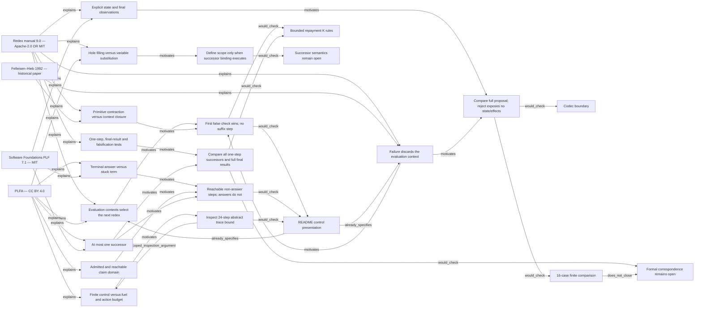

# Textbook concept map

This is a scoped reading map, not a proof graph. Every proposed check remains specified-only. Complete downloads are described in [CORPUS.md](CORPUS.md). The interactive [graph](graph.html) and typed [JSON](graph.json) preserve source locators and evidence kinds.

26 nodes; 42 directed edges. Node types separate textbooks/manual/paper, concepts, proposed checks and repository files. Edge kinds separate source facts, observations, inferences, recommendations and open questions.

No whole-corpus semantic extraction, source compilation, theorem transfer or live runtime validation is claimed.
