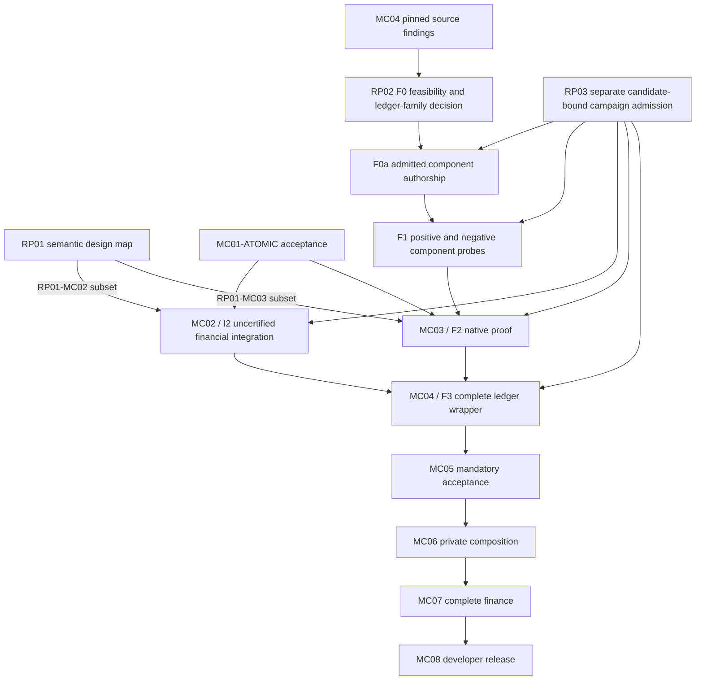
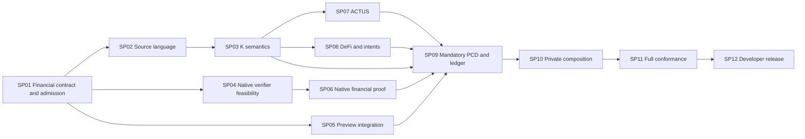
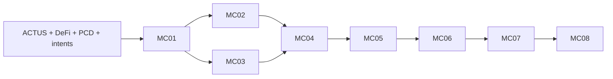
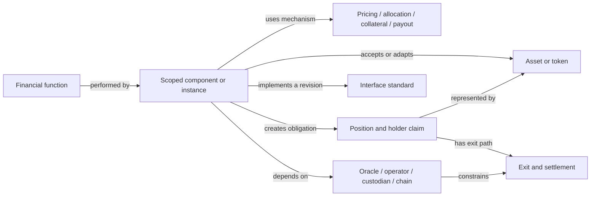

Act as the independent advocate for the lessons in the research reports in a Moriarty OpenSpec planning sprint. The user explicitly requested exact Fable 5.1 advocacy and GPT-6 independent audit. Read only this evidence packet. No tools, implementation, provider calls or resource changes. Argue concretely for changes to all SP01–SP12 plans; preserve all original financial coverage and early native gates. Produce JSON with fields model, priority_changes (each: lesson, source, sprint_tasks, acceptance_positive, acceptance_negative), required_retention, scope_limits, dissent. Challenge unsupported taxonomy-to-language inferences and admin work displacing product progress. Distinguish normative sources from hypothetical fixtures and current implementation evidence. Do not claim execution/audit of filesystem. Initial GPT6 inventory found atomic-prepare/atomic-accept/rp01-mc02 already complete in exact retained scope; stale roadmap prose needs correction. Full successor/PCD/network finance unfinished. This advocacy is not campaign admission.
FILE: ROADMAP.md
# Moriarty roadmap

Moriarty is a Midnight-centric language for bounded financial contracts and proof-carrying transactions. Developers should be able to express a financial agreement, inspect its possible effects, authorize an outcome, prove a valid transition and settle it on Midnight. Each accepted transition must preserve the contract's rules, signed intent and compliant predecessor history.

Compact, Midnight native proofs, private state and ledger acceptance constrain the language design. Preview is the public development network. ACTUS supplies standardized financial events and cash flows; the DeFi corpus supplies protocol behaviors and adversarial cases. Examples from other chains are financial references, not additional backend deliverables.

This is the complete current roadmap. [OpenSpec](openspec/MORIARTY-COMPLETION-PROGRAM.md) contains detailed package contracts; the [machine register](openspec/moriarty-completion-program.json) records scoped status and dependencies. The [three-report reconciliation](openspec/REPORT-RECONCILIATION-2026-09-07.md) defines the early decisions and staged proof admission. Editing these plans neither completes a package nor arms an execution loop.

## Sprint delivery plan

The [twelve OpenSpec sprints](openspec/sprints/README.md) schedule the complete roadmap: financial design and admission; source language; K semantics; native verifier feasibility; Preview financial integration; real recursion; ACTUS; DeFi and intents; mandatory PCD and ledger correspondence; private composition; full conformance; developer release. Language and native feasibility work can progress independently until their acceptance boundary. Each sprint has explicit deliverables, file ownership and rejection criteria. The [coverage crosswalk](openspec/sprints/coverage.json) retains every original requirement. These are delivery gates, not calendar or compute estimates.

## What exists

The repository contains an experimental bounded agreement syntax, parser, type checker, canonical encoding, local evaluator and restricted Compact lowering. Loan and swap examples run locally. A separate browser mock explores proposed developer flows with simulated authority and certificates. The initial atomic profile has scoped prior reviews; its current implementation still needs an input-boundary correction and current result audits.

[Retained Preview evidence](evidence/midnight-preview-2026-09-07/README.md) records a hello-world deployment and call finalized with exact state readback. That demonstrates basic network integration. Financial transfer comparison and mandatory Moriarty PCD acceptance remain unperformed. The original native recursion experiment exhausted rows at k17. Its fixed-instance replacement is source work that has not produced a recursive proof. The complete native-to-Preview verifier remains unresolved.

The research corpus, source snapshots, target inventories and scoped experimental evidence remain useful inputs. None substitutes for the acceptance results below. Superseded A4/A5 work remains historical and is not an active execution queue.

## Design decisions before expanded execution

These checks belong to the existing work packages. They can progress alongside the current MC01 correction and review.

- [ ] **RP01: Financial and intent semantics.** Define bounded, independent traces for the eight intent examples, the three retained held-outs, all eight DeFi regression classes and five composition operators. Map source intent, concrete plan, effects, liabilities, assumptions and successor artifacts. Specify signed nominal-debt authority separately from token spending. Co-design canonical signing and display before freezing new authority fields. Every unsupported required behavior retains an owner and closure task.
- [ ] **RP02: Complete native history route.** Specify what a private successor receives, which secrets remain private, how predecessor proofs compose, and how the final native accumulator decision reaches the actual Midnight verifier. Pin source and deployment versions separately. Resolve source interfaces and run independently admitted component probes before a new native campaign.
- [ ] **RP03: Campaign admission.** Freeze existing commands, candidate hashes, exact current Fable 5.1 (medium)/GPT-6 review records, bounded resources and stop conditions for each campaign. Preserve historical charges. Migrate legacy reviewer admission fields honestly. A full MC07 campaign manifest is required for MC07, not for an earlier small probe.

RP01 preserves all 277 ACTUS fixtures, 32 ACTUS taxonomy dispositions and 72 historical DeFi rows. Normalizing product/version scope cannot reduce these requirements. Additional report holdouts need pinned primary sources before becoming source-defined behavior cases. The early review is design coverage; full implementation and evidence remain MC07.

## Source specification and DeFi reference actions

The [DeFi and language-design amendment](openspec/DEFI-LANGUAGE-DESIGN-2026-09-07.md) adds action-level reference targets while preserving the existing financial corpus. Source files use `.mori`. The successor specification uses EBNF, separate lexical rules, static judgments and executable operational semantics in K. The [surface and semantics proposal](deliverables/defi-language-design-2026-09-07/LANGUAGE-DESIGN.md) recommends financial blocks with explicit pre/post state; it does not change the current atomic profile.

- [ ] Bind the [action matrix](deliverables/defi-language-design-2026-09-07/action-targets.csv) to pinned lifecycle sources and independent fixtures under RP01/MC07, retaining every existing ACTUS and DeFi requirement.
- [ ] Complete and review the lexical/EBNF/static specification, formatter obligations and matched syntax study under MC01.
- [ ] Implement a bounded Moriarty Core definition in K and establish its evaluator/compiler/proof correspondence within MC01/MC03/MC04/MC05. Begin with a partial-payment trace that preserves its residual duty.

## Implementation and acceptance checklist

### MC01: Bounded language and developer-facing semantics

`MC01-ATOMIC` is the existing atomic profile after its input correction, applicable checks and current candidate-bound implementation audits. Only this milestone gates the initial financial/native experiments. The remaining source/IR expansions form `MC01-EXTENSIONS`; full RP01 gates those successor profiles, not acceptance of the existing subset.

- [ ] Finish the current input-boundary correction and obtain current implementation audits.
- [ ] Finalize versioned grammar, types, canonical representations, source diagnostics and evaluator behavior for each supported profile.
- [ ] Define source intent, bounded authority, concrete plan and receipt as distinct objects. Introduce required outcome, liability, residual and temporal constructs through explicit profile extensions.
- [ ] Enforce registered limits on source, values, intermediate arithmetic, collections, effects, obligations, nesting, predecessor fan-in, verification work and lifetime. Define units, rounding, overflow and rejection precisely.
- [ ] Preserve obligations at episode closure and bound exhaustion. No continuation, split or migration may reset a promised global work limit.
- [ ] Map each supported Core operation into Compact with meaningful positive and rejection cases. Requalify changed domains as later packages extend the language.

Acceptance: the supported language profile has a tested frontend/evaluator/lowering and current scoped audits. This does not establish native proofs or financial corpus conformance. [Detailed plan](openspec/changes/mc01-bounded-language/README.md).

### MC02: Actual financial operations on Preview

- [ ] Implement the loan and swap integration contract with real asset identity, custody and authenticated participant roles.
- [ ] Verify local Docker execution before admitted public submissions.
- [ ] Finalize actual loan and swap operations on Preview and compare full state and all effects against independently derived expectations.
- [ ] Account for recipients, gross debit, credit, fees, change, token denomination, obligations and remaining principal. Verify canonical finality rather than treating indexer inclusion as sufficient.

Acceptance: retained transaction and finalized-block evidence establishes exact financial integration. This contract remains an uncertified probe until the mandatory acceptance lineage is complete. [Detailed plan](openspec/changes/mc02-preview-financial-operation/README.md).

### MC03: Real native recursive proof

- [ ] Complete the early native source/interface and component gates below.
- [ ] Correct and review the fixed financial relation, successor commands, canonical export and retained-proof verifier under a bounded campaign.
- [ ] Produce genuine recursive proofs for the admitted two-step loan episode and verify serialized artifacts in an independent process.
- [ ] Reject altered proof bytes, context, state, keys and accumulators; discharge the complete native final decision.

Acceptance: actual retained native IVC evidence for the exact fixed episode. A nonrecursive re-proof of the same table, hash chain or host verdict cannot substitute. General DSL execution and private branching remain later requirements. [Detailed plan](openspec/changes/mc03-native-recursive-proof/README.md).

### MC04: Compiler and ledger correspondence

- [ ] Implement the complete native verification boundary under exact Midnight source and deployed-version provenance, including canonical decoding and final accumulator/pairing verification.
- [ ] Prove the supported compiler-to-ledger correspondence with explicit domains, assumptions and audited theorem dependencies.
- [ ] Bind program, semantic profile, policy, verifier, predecessors, observations, output state and complete effects across authorization, proof and ledger. Outcome signatures bind constraints; the concrete execution binds their digest and proves refinement. Exact-plan signatures may additionally bind the selected execution. Preserve cumulative partial-fill authority in durable acceptance state.
- [ ] Enforce durable authorization, currentness, replay protection and unique predecessor consumption. Test two individually valid conflicting transactions, restart and recovery.
- [ ] Demonstrate non-mock Preview acceptance with verification enabled and a meaningful financial state change through the versioned acceptance lineage.

Acceptance: the actual ledger consumes the checked history and applies exactly the authorized effects. A circuit preparation gadget or unconstrained host boolean is insufficient. [Detailed plan](openspec/changes/mc04-ledger-correspondence-and-consumption/README.md).

### MC05: Mandatory correctness and intent acceptance

- [ ] Enforce ContractInvariant, IntentRefinement, TransitionValidity and HistoryCompliance in every permitted acceptance path, including constrained genesis and administrative transitions in scope.
- [ ] Connect permitted route choices to signed gross authority, net outcomes, recipients, fees, new liabilities and complete effects.
- [ ] Use non-circular canonical commitments and trusted deployment policy. Reject stripped claims, arbitrary verifiers, missing dependencies, stale observations and proof-valid but intent-invalid actions.
- [ ] Enforce verifier/spec activation and revocation, cheap bounded admission before expensive verification, and safe consumption-preserving migration.
- [ ] Produce the extended native evidence and requalify compiler/ledger correspondence for the actual mandatory relation.

Acceptance: a required claim cannot be removed, downgraded or replaced with a simulation. [Detailed plan](openspec/changes/mc05-mandatory-claim-acceptance/README.md).

### MC06: Private handoff and composition

- [ ] Prove a successor in an isolated participant environment without access to predecessor secrets. Inventory artifact recipients, confidentiality and recovery ownership.
- [ ] Produce genuine split, independent branch and join proofs with compatible policies, distinct identities and no duplicate predecessor use.
- [ ] Preserve live liabilities, residual authority and conserved global work. Reject authority amplification, debt erasure and lifecycle reset.
- [ ] Give separate semantics and compatibility rules to sequential, disjoint parallel, shared-state interleaving, atomic synchronization and asynchronous messaging. A required unsupported operator remains open.
- [ ] Exercise pending/claimable/settled states, cancellation/fill races, unavailable witnesses, conflict and bounded recovery through the same acceptance lineage.

Acceptance: actual private multi-party history composition and its financial/ledger predicates, not merely a linear proof or shared-process demonstration. [Detailed plan](openspec/changes/mc06-private-handoff-and-composition/README.md).

### MC07: Full ACTUS and DeFi conformance

- [ ] Compare every present result field in all 277 pinned ACTUS fixtures across the 18 executable types. Preserve all 32 taxonomy dispositions and resolve [DS-01 through DS-07](docs/research/2026-09-06-actus-defi-design-study.md#source-discrepancies-and-dispositions) with primary evidence.
- [ ] Implement each of the 72 historical DeFi rows with exact modeled product/version scope, independent expected observations, feasible positives and meaningful mutations.
- [ ] Complete NAM19 capitalization, accepted refinance and pending redemption, including zero-payoff capitalization, debt identity and carried unfilled obligations.
- [ ] Cover required arithmetic, ordering, bad debt, shared accounting, temporal settlement, margin, contingent claims and environment assumptions through the shared bounded semantics.
- [ ] Establish source/model fidelity and scoped certificate judgments. Keep proposed theorems, tests and mechanized proofs distinct.
- [ ] Derive the episode manifest and resources from actual behavior coverage. Track semantic, profile-proof, local-acceptance and Preview-acceptance evidence separately; a row count or small public sample cannot close all four.
- [ ] Extend and reprove affected language, proof, compiler and acceptance domains under the versioned lineage.

Acceptance: no missing required fixture, field or behavior and no substituted taxonomy, permissive tolerance or unrelated validator. [Detailed plan](openspec/changes/mc07-complete-financial-conformance/README.md).

### MC08: Developer workflow and release evidence

- [ ] Deliver authoring, checking, simulation, semantic signing, proving, submission and finalized-effect inspection for the supported Midnight language.
- [ ] Render from canonical signed bytes. Make fees, debt, limits, locks, recovery rights, assumptions and outstanding obligations visible. Reject unknown semantic extensions and display/signature mismatches.
- [ ] Demonstrate valid loan/swap flows, rejected intent, stale data, unavailable witness, pending settlement, restart, conflict, revocation and migration.
- [ ] Assemble exact source/proof/ledger/audit evidence for every release gate, including the charter's [G01-G24 obligations](openspec/MORIARTY-COMPLETION-PROGRAM.md#completion-and-broader-release-scope).
- [ ] Obtain final independent Fable 5.1 at medium effort and GPT-6 reviews of the actual accepted candidates. Recompute acceptance against the final deployed lineage.

Acceptance: a reproducible developer release whose advertised guarantees match retained evidence. [Detailed plan](openspec/changes/mc08-release-evidence-and-developer-flow/README.md).

## Execution order and stop conditions



The diagram shows the main path; the machine register carries every direct accepted-profile dependency and each campaign requires its own RP03 record, including MC05-MC08.

F0 establishes a reviewed proposed route without native execution, including finalizer arithmetic/constraint-fit estimates, go/no-go criteria and a ledger-family decision with explicit deployment-provenance limits. F0a cannot start until these decisions and a conservative reservation amendment are reviewed. F0a assigns MC04 component authorship and MC03 export work, with a recorded preparation allocation, conservative reservation amendment and current source reviews. F1 requires its own frozen implemented candidate, resource decision and current reviews before compilation or synthesis. P1 and P3 execute in the exact outer ledger circuit stack selected at F0, with native tests as reference fixtures only. Missing outer sources block F2/F3. P1 includes full ported IVC challenge/preparation/carried-accumulator agreement; its finite transcript vector alone is insufficient. All three F1 probe families must pass: transcript agreement, canonical export/import and constrained final pairing acceptance of an independently checked nontrivial valid fixture plus rejection of invalid direct-assignment mutations. No incomplete probe is waived. [Pinned independent fixture recipes](openspec/REPORT-RECONCILIATION-2026-09-07.md#independent-f1-fixture-sources) use native transcript tests, a separately admitted small non-loan Poseidon IVC derivative and a non-loan verifier-test accumulator. They are source recipes, not generated evidence. Missing codecs/finalizer and fixture generation require bounded admission; no F1 fixture may depend on the MC03 loan proof. MC03 supplies the terminal proof needed for F3, so full MC04 acceptance is not a prerequisite for MC03.

The native precondition is the reviewed RP01-MC03 fixed-statement subset and F0/F0a, successful F1, MC01-ATOMIC acceptance and campaign-specific RP03 admission. The full RP01 design map gates general successor profiles and later semantic extensions; it is not a prerequisite for the unchanged fixed-instance experiment. MC01-ATOMIC remains the existing source/evaluator comparison prerequisite. The register now represents each preparation and execution stage separately; null campaign IDs reject admission, and full package dependencies never block their own preparation stages. Each later extension has its own resource and review gate. Stop on the first failed required control, undefined essential interface or resource ceiling. Preserve failed evidence and change a justified hypothesis before another admitted attempt. A blocked Midnight interface does not authorize dropping PCD or changing the product target.

## Guarantees and research notes

Turing incompleteness and finite bounds make evaluation bounded; they do not by themselves prove financial correctness, practical proving cost or future settlement. Each theorem or proof must name its predicate, domain, version and assumptions. Ledger uniqueness, oracle truth, solvency, custody, witness availability and solver optimality remain separate questions.

The maintained LLM wiki notes live in [wiki/](wiki/index.md), alongside this roadmap in the repository. Start with [architecture](wiki/moriarty-architecture.md), [financial taxonomy](wiki/defiformal-taxonomy.md), [formal assurance](wiki/formal-assurance.md), [contradictions](wiki/contradictions.md), and the [research journal](wiki/research-journal.md). The [wiki log](wiki/log.md) records source and synthesis updates under [WIKI_SCHEMA.md](WIKI_SCHEMA.md).

The [combined report review and interactive graph](deliverables/moriarty-report-plan-review-2026-09-07/README.md) links the three supplied reports to this plan. [Raw snapshots](raw/reports/unified-2026-09-07/receipt.json) preserve original bytes and hashes. Report claims and opaque citations remain secondary evidence until their primary sources and relevant predicates are checked. [Footguns](docs/FOOTGUNS.md) preserve the design lessons that constrain future work.


FILE: docs/FOOTGUNS.md
# Moriarty footguns

Standing instructions adopted by the [2026-09-06 user reset](../raw/assignments/moriarty-target-first-reset-2026-09-06.md).
Read with [the postmortem](postmortems/2026-09-06-moriarty-verification-detour.md).
These rules apply to research, planning, implementation and recovery.

The [September 8 recurrence post-mortem](postmortems/2026-09-08-orchestration-recurrence.md)
records a second failure to apply these instructions.
Apply the following stop rules before following a recovered work queue or dispatching more work.

## Orchestration stop rules

These rules implement the user's September 8 request to prevent repeated orchestration displacement.
The lead agent owns their application. Record decisions in the existing task record.
Do not create a new approval system, dashboard or harness for these rules.

1. **Name the capability before the next action.** State what the developer will be able to do.
   Name the command or observable result that demonstrates it.
   A packet, hash manifest, allocation, review dispatch or checkpoint is supporting work.
   None independently counts as a delivered capability.
   When the user explicitly requests documentation, the requested document is the deliverable.

2. **Stop repeated failure of the same approach.** Two failed implementation/result-review cycles with the same defect class trigger this rule.
   Do not dispatch a third broad correction of that approach.
   First reproduce one defect through the public API or smallest executable mechanism.
   Change the implementation strategy or task size, and demonstrate why the change addresses the defect.
   Give Grok that reproducer and a bounded repair under existing authority.
   Retain independent GPT-6 result review and the original acceptance requirements.
   Rewording a packet, changing an identifier or increasing a timeout does not reset this trigger.

3. **Interrupt process-only work.** Two consecutive orchestration cycles without implementation, a decisive experiment or a resolved concrete blocker trigger this rule.
   Thirty minutes spent only on orchestration administration also triggers it.
   An orchestration cycle means preparing, dispatching, receiving and dispositioning one task or review.
   A resolved blocker must identify the previously failing operation now enabled or a decisive technical finding.
   A new packet approval or resource allocation alone does not reset this trigger.
   A genuinely running required build, proof or test is not administration time.
   Stop adding packets and bookkeeping work.
   Inspect or test the production path, repair the current defect, or continue an independent eligible implementation task.
   If none is possible, state the concrete blocker and evidence without inventing another preparatory dependency.

4. **Inspect the production path before reporting candidate success.** Trace one input from the public entry point to its observable result.
   Reject an unconditional throw, constant admission response or unused adapter where execution is required.
   Source-only admission restricts invocation, not implementation of the approved production behavior.
   Test operation order and input-dependent output through that path using controlled transport when necessary.
   Report missing live tests or real transaction fixtures separately.
   Never relabel synthetic transport results as network evidence.

5. **Make tests challenge behavior.** Derive at least one relevant adversarial input independently from the acceptance requirement.
   Check complete material state when the claim requires complete state.
   Reject decisions derived from mutation names, expected errors or copied expected outputs.
   A regression must exercise the defect through the callable mechanism.
   Test counts, stable generation and hashes cannot replace that check.

6. **Separate repairs from consequential decisions.** Repair approved behavior without another design vote when scope and authorized limits remain unchanged.
   Record only the changed requirement, evidence and resource delta in the existing task record.
   Use the user-required majority process for consequential design or resource changes.
   Justify renewed resources with a changed hypothesis or decisive remaining test, not sunk cost or unfinished status.
   Do not exceed an existing limit or waive a failed gate to avoid review.
   A genuine limit stops that run, but does not automatically stop independent eligible work.

7. **Own integration and limit unfinished work.** Keep one primary capability in focus.
   Delegate independent work only when it has a clear boundary and available review capacity.
   Do not create another dependent candidate while its recurring prerequisite defect lacks a reproducer and changed approach.
   Preserve all sprint requirements and dependency gates.
   Work on permitted provisional components without claiming a semantic freeze or broader acceptance.

8. **Recover intent before obligations.** Read the latest user instruction and these rules before resuming checkpoint tasks.
   Keep the current capability, last demonstrated result and next executable action visible in the existing checkpoint.
   Preserve detailed evidence by reference instead of making its queue the objective.
   Verify process liveness before claiming that work continues.
   An active completion loop authorizes persistence, not repetition of a failed approach.

9. **Report the outcome and its limits.** Lead with new usable behavior, the remaining gap and the next demonstration.
   Distinguish author-reported results from independently verified results.
   Report local simulation, proven compilation and finalized financial settlement as separate stages.
   Post every actual blockchain transaction ID and observed status in the conversation.
   If no transaction was submitted, say so when reporting the network milestone.

10. **Respond to a recurrence immediately.** When the user identifies process displacement, stop starting administrative work.
    Fulfill the requested diagnosis or correction before resuming the previous queue.
    Do not replace the product objective with another broad planning campaign.
    Do not claim these rules solved the problem until subsequent execution demonstrates compliance.

These are behavioral controls. They do not automatically enforce themselves.
At each trigger, the lead agent must apply the required action without requesting routine permission again.
Keep required tests, independent audits, bounded resources, mandatory PCD and financial acceptance intact.

## Development plugin integration

Every agent must load `moriarty-dev:develop` through
[the repository startup procedure](../AGENTS.md#required-startup-load-the-development-plugin)
when starting or recovering Moriarty work. If the host cannot expose the skill,
read [its tracked instructions](../plugins/moriarty-dev/skills/develop/SKILL.md)
and use the CLI. Installation alone is not skill loading. Pass this rule to
delegated agents and preserve the user's current task scope.

The repository development plugin (`plugins/moriarty-dev`) guards registered dispatches with these stop rules:

```bash
python3 plugins/moriarty-dev/scripts/moriarty_dev/cli.py --repo . status
python3 plugins/moriarty-dev/scripts/moriarty_dev/cli.py --repo . next
python3 plugins/moriarty-dev/scripts/moriarty_dev/cli.py --repo . run --action <ACTION_ID>
```
Use guarded CLI execution when host coverage is unverified. Do not infer interception from hook files or installation. Do not create a new runner or campaign merely to inspect files or make an authorized source edit.

## Existing product and evidence rules

1. **Recover the purpose before the work queue.** Read the latest user directive
   and current roadmap notice before checkpoint obligations. A stale loop is
   not authority to continue. A4/A5 are unfinished historical experiments; the
   current task is the ACTUS/DeFi/PCD design cycle. Never report them complete to
   clear an obsolete goal.

2. **Start semantics with implementation targets.** Every proposed semantic
   operation must trace to an ACTUS fixture, a named DeFi behavior or an explicit
   developer requirement. Give the smallest example that requires it. Do not
   defer both target families until after selecting and verifying a Core.
   Product types and taxonomy categories do not automatically become Core
   constructors. Keep the complete target coverage matrix visible.

3. **Show what a developer can do.** Before a large formalization campaign,
   show representative authoring, simulation, failure diagnosis, signing and
   proof-consumption flows. Name what works, what is mocked and what is missing.
   A test-count checklist cannot replace this demonstration.

4. **Name the correctness claim.** Separate language metatheorems,
   contract-specific properties, a transaction's valid execution, PCD history
   compliance, and compiler/ledger correspondence. State assumptions, input
   domains and bounds. A passing model check, cryptographic proof or compiler
   invocation establishes only its actual predicate.

5. **Turing-incomplete does not mean automatically correct.** Require explicit
   sizes for values, intermediate arithmetic, collections, schedules, horizons,
   nesting, transaction work and predecessor fan-in. Specify rounding, overflow,
   rejection and termination. Finite state may still be too large to enumerate.
   Prefix checking needs a completeness argument before becoming a lifetime
   claim. Continuations must not silently reset a promised lifecycle bound.
   Admit the exact registered bounds bytes and hash. Matching schema or profile
   labels do not authorize changed limits or hash domains. Reject malformed
   bounds with the defined diagnostic before authentication or consumption.

6. **PCD is part of transaction acceptance.** The design must bind a transaction
   to its semantic/program versions, predecessors, authorization, observations,
   resulting state and effects. Specify constrained genesis, multi-input
   composition and the final verification decision. Hash-linked receipts and
   simulated certificates are not PCD. Missing or invalid required proofs must
   fail closed in the real acceptance path. A signed mandatory-claim root cannot
   be stripped or downgraded by a relay. An optional acceleration fallback must
   preserve the same required claim/history predicate.

7. **History compliance is not global uniqueness or oracle truth.** Define
   ledger consumption/nullifiers, ordering, finality and external-input trust
   separately. Test duplicate consumption and competing valid branches, as well
   as altered proof bytes and public inputs. State what a signature attests.

8. **Check backend compatibility early and narrowly.** Recursive verification,
   folding, accumulation, compression and zero knowledge are different
   properties. Compact's ban on recursive source functions does not rule out
   Midnight-native recursive proofs. Inspect the actual native implementation
   and its application/ledger interface separately. Name the construction and
   final verifier. Do not infer Nova–Compact compatibility from either project's existence. After specifying the
   required relation, use one small positive proof and meaningful rejection
   controls to test the actual pinned deployment interface.

9. **Bound investigations by a decision.** Before an expensive run, record the
   question, smallest decisive input, expected distinguishing outcomes, command,
   resource ceiling and stop condition in the task's existing record. Track
   cumulative effort against that ceiling. After a failure, change a justified
   hypothesis before repeating work. Do not automatically increase heaps,
   widen matrices, rerun consumed stages or arm an open-ended completion loop.
   Use an existing authorized resource budget; if none exists, propose a bounded
   experiment as part of planning rather than inventing unlimited authority.

10. **Keep process proportional.** Preserve authentic inputs, outputs and failed
    runs. Reuse those receipts. Add review or infrastructure only when it closes
    a named correctness or reproducibility gap; do not turn tooling repair,
    provenance, checkpointing or Foreman development into the product. A
    source-only review does not approve product suitability or a native result.

11. **Reuse evidence with its original scope.** E00 generated a narrow Compact
    atomic-swap specialization; its proof compilation was mock. Candidate A
    contains useful interpreter, authorization and lifecycle experiments, with
    incomplete A4/A5 acceptance. Neither is a finished general DSL. Do not erase
    useful code, promote it automatically, or force the new semantics to fit it.

12. **Report progress in user terms.** Lead checkpoints with the current goal,
    usable capability, material gaps and next reviewable deliverable. Include
    ACTUS, DeFi, proofs and developer interface status. Cite test counts only as
    supporting evidence. Report runner counters as counters, not a billing
    invoice or a measured total of wasted compute.

The current [design-cycle plan](superpowers/plans/2026-09-06-actus-defi-pcd-replanning.md)
applies these rules. Changing the plan requires preserving the reason and its
effect on target coverage, not adding another layer of approval machinery.

13. **Separate authority from outcomes and concrete plans.** Exact-plan signing
    is a restricted profile, not solver-independent intent. A refund cannot
    conceal gross over-spending, and a gross receipt before fees is not the net
    promised delivery. Check permitted intermediate recipients and calls.
    Pending progress carries residual authority and obligations; it does not
    establish a terminal goal. A valid signature, keyword certificate or
    taxonomy classification proves none of these semantics. See the
    [intents amendment](research/2026-09-06-intents-report-integration.md).

14. **Apply skills only within their stated scope.** The bridge formal workflow
    applies to the bridge repository. Missing bridge files in Moriarty are not
    an installation failure to repair. Check applicability before obeying a
    foreign repository's stop rule. Worker 04 stopped before edits after this
    exact mistake; preserve its receipt in MC01/profile-02.

15. **Use delegated authority and preserve useful output.** The latest user
    instruction delegates execution decisions and forbids repeated permission
    loops. Record a justified bounded successor when needed, then continue.
    Keep independent correctness reviews and actual completion requirements.
    Do not reuse an inadequate short timeout for a large schema correction.
    Replace documents atomically so interruption cannot delete a required file.
    A worker timeout does not erase completed artifacts, but its report is not
    evidence until the host checks the actual output.

16. **Bind the actual review input before dispatch.** A filename or review tag is
    not candidate identity. Verify the manifest digest, candidate commit, worktree
    HEAD and every source hash before launching the reviewer. Verify the returned
    identity and unchanged bytes before admitting its verdict. The implementation07
    GPT-6 launcher accidentally supplied the implementation06 manifest; that review
    cannot approve implementation07. Preserve the report and recheck useful findings.


## Three-report planning guard

The [report reconciliation](../openspec/REPORT-RECONCILIATION-2026-09-07.md) applies to successor profiles and campaigns. Keep Moriarty Midnight-centric: other-chain examples supply financial requirements, not new backend deliverables. Review nominal liabilities, pending workflows and private successor artifacts before committing an expanded proof relation. A fixed linear proof, an atlas row count or an optional-proof report roadmap cannot close mandatory general-history or financial-coverage obligations.

## Headless implementation and review permissions

Process exit zero does not establish a completed model run. Require AGY JSON
`status: SUCCESS` or Grok `stopReason: end_turn`, then inspect the substantive
result and verify the candidate. A cancellation, timeout or progress narration
cannot approve source.

For the authorized plugin work, AGY `accept-edits` did not approve shell test
commands. The successful invocation also used its per-process
`--dangerously-skip-permissions` option. Grok `plan` mode still cancelled a local
fixture command with `--allow Bash` and again with `--always-approve`.
A harmless write/read check succeeded with `--no-plan --always-approve`.
See the [retained invocation and review evidence](../evidence/moriarty-completion-program-2026-09-07/MC08/development-plugin-agy-result-02/README.md).

Before repeating a failed launch, inspect its terminal permission metadata and
verify the intended invocation with one harmless command under the same flags.
Preserve the failed receipt and charge. Do not change global settings, treat a
resource vote as source approval, or use this procedure to override a safety
denial. Resume the same review only when its candidate remains unchanged.


FILE: openspec/sprints/README.md
# Moriarty completion sprints

Status: S2, specified-only. These delivery plans implement the [user's sprint request](../../raw/assignments/moriarty-sprint-planning-2026-09-07.md). They schedule the existing [MC01-MC08 contracts](../MORIARTY-COMPLETION-PROGRAM.md), [RP01-RP03 gates](../REPORT-RECONCILIATION-2026-09-07.md) and [language design amendment](../DEFI-LANGUAGE-DESIGN-2026-09-07.md). Package acceptance remains in the [program register](../moriarty-completion-program.json). [sprints.json](sprints.json) is navigation, not a second acceptance authority.

Moriarty is a bounded financial language for Midnight. Completion means a developer can author an agreement, inspect its effects, sign an intent, prove compliant execution and settle it with mandatory proof verification. The program must cover the required ACTUS and DeFi behavior, including private continuation and composition.

## Delivery sequence

Sprints are deliverable boundaries, not promised calendar durations. Capacity and proving cost are not established. Each sprint closes on evidence; an unfinished required task carries forward with the same identity. The resource envelope is allocated separately before execution.

| Sprint | Developer or engineering deliverable | Full-completion dependencies | Package owners |
| --- | --- | --- | --- |
| [SP01: Financial contract and execution admission](sp01-financial-contract-and-execution-admission.md) | Reviewed financial contract and current admission records | retained repository evidence | MC01, MC03, MC04, MC05, MC06, MC07, MC08 |
| [SP02: Complete .mori authoring frontend](sp02-complete-mori-authoring-frontend.md) | Complete .mori specification, frontend, formatter and checking CLI | SP01 | MC01, MC08 |
| [SP03: Executable bounded semantics in K](sp03-executable-bounded-semantics-in-k.md) | Runnable K semantics, simulation and scoped language proofs | SP02 | MC01, MC04, MC05 |
| [SP04: Complete native verifier component feasibility](sp04-complete-native-verifier-component-feasibility.md) | Complete native verifier feasibility result | SP01 | MC03, MC04 |
| [SP05: Financial integration on Preview](sp05-financial-integration-on-preview.md) | Actual loan and swap settlement comparison | SP01 | MC02, MC04 |
| [SP06: Real recursive financial history](sp06-real-recursive-financial-history.md) | Real retained recursive financial proof | SP01, SP04 | MC03 |
| [SP07: ACTUS obligations and lifecycle semantics](sp07-actus-obligations-and-lifecycle-semantics.md) | ACTUS event and obligation implementation | SP03 | MC01, MC07 |
| [SP08: DeFi actions and outcome intents](sp08-defi-actions-and-outcome-intents.md) | DeFi action libraries and intent/request lifecycles | SP03 | MC01, MC05, MC07, MC08 |
| [SP09: Mandatory PCD and ledger correspondence](sp09-mandatory-pcd-and-ledger-correspondence.md) | General mandatory PCD, authorization and ledger correspondence | SP03, SP05, SP06, SP07, SP08 | MC01, MC04, MC05 |
| [SP10: Private handoff and bounded composition](sp10-private-handoff-and-bounded-composition.md) | Independent private continuation and split/join | SP09 | MC06 |
| [SP11: Full financial and formal conformance](sp11-full-financial-and-formal-conformance.md) | Complete financial and formal qualification | SP07, SP08, SP10 | MC01, MC04, MC05, MC06, MC07 |
| [SP12: Developer release and reproducible evidence](sp12-developer-release-and-reproducible-evidence.md) | Reproducible developer release | SP11 | MC08 |



The diagram summarizes completion relationships and omits transitive dependencies. It does not decide task entry. Accepted stage/profile and campaign records remain authoritative. SP01.1/1.8 atomic work, SP01.6/1.7 subset gates, SP01.2/1.3 full design and SP01.4 F0 close independently. SP02 needs full RP01 design; SP04 needs F0 go; SP05 needs atomic acceptance and RP01-MC02; SP06 needs atomic acceptance, RP01-MC03 and all F1 controls. A blocked F0 task does not block independent source work. SP07/SP08 semantic preparation can precede ledger proof qualification. SP09 may prepare and close atomic F3 after SP05/SP06 while extended language work continues; mandatory promotion requires the complete successor inputs. Parallel preparation never waives a stage prerequisite.

In `sprints.json`, `completionRequires` governs full sprint completion only. Each `entryGates` row lists explicit task IDs, its RP stage, exact prerequisite stages and campaign owners. The validator checks every declared task ID and compares those rows with the authoritative stage graph. A scheduler must use task entry gates, not whole-sprint completion, to select work. Thus SP04/SP05/SP06 do not wait for full RP01, and SP09.1 atomic F3 does not wait for SP07/SP08 financial completion. Successor mandatory promotion still requires their accepted semantic inputs.

This sequence checks the backend early while financial examples shape the language. Completing every library before checking the native interface would postpone a product-critical decision. Building a minimal prover first without financial traces would repeat the target-selection mistake. The selected sequence gives both tracks concrete early outputs and joins them at actual acceptance.

## Successor preparation admission

The program register adds four specified-only stages with null campaign IDs. `successor-frontend` requires reviewed `rp01-full`; `successor-semantics` requires the frontend; `actus-semantics` and `defi-semantics` each require the base successor semantics. Their owners are the corresponding sprint packages. Each stage needs its own reviewed preparation allocation, existing commands, source/profile hashes and RP03 campaign record before local implementation or verification dispatch.

These stages permit only their recorded source work, local checks and bounded K claims. They grant no financial native proving or public submission. Required native work still follows F0-F3 and its own campaign admission. Mandatory successor promotion additionally requires `successor-semantics`, `actus-semantics` and `defi-semantics`. This provides an acyclic implementation route while keeping later proof/ledger qualification separate. No original completed status, campaign ID or historical charge changes through the planning amendment.

Before native writers start, SP01.5 closes `native-path-freeze` after F0 go. This records one MC03 successor namespace and MC03-export/MC04-outer-port ownership. It is a hard prerequisite of F0a and F2. F0a implements and reviews actual command bytes before F1; the earlier ownership record cannot claim uncreated commands are executable. F0 no-go is recorded as blocked, never complete.

## Shared artifact contract

Every sprint consumes exact versioned artifacts rather than unqualified package status:

- `ProfileRef`: schema version, semantic version, exact registered bounds bytes/hash and source/Core hashes.
- `ChallengeCase`: stable source/fixture/action IDs, initial state, action, authority, observations, read/write footprint, independent complete expected result, invalid mutation, assumptions and closure owner.
- `PreparedTransition`: profile/program/instance/predecessor references, authorization digest, authenticated observations, candidate next state, ordered effects, residual duties/authority and remaining work. Preparation alone grants no acceptance.
- `AcceptanceReceipt`: exact statement/proof/verifier/key/SRS identities, mandatory claim results, durable consumption and complete ledger projection. Public evidence adds transaction bytes, canonical finalized block and readback.
- `ClaimRecord`: judgment, domain, assumptions, semantic/profile hash, mechanized proof artifact or explicit open status. Tests and reviewers cannot be substituted for a theorem.

SP01 defines the machine schemas and canonical encoding for these semantic records. SP02 implements the frontend bindings; SP03 defines their K observation projection. SP04 resolves concrete native byte interfaces from pinned sources. SP09 freezes the acceptance encoding. An existing API's TypeScript type names are not silently changed to these planning record names.

Use immutable `pre`, a single staged `next` write per field, no `next` reads and post-state only in the permitted `ensures` suffix for the proposed successor. Final syntax requires SP01/SP02 review. Preserve the existing sequential atomic profile separately. Every new type or effect must cite a required financial behavior or developer operation.

## Executable task admission

These are sprint delivery contracts. They do not pretend to contain the implementation of an unresolved language or cryptographic interface. Each task first produces `openspec/sprints/execution/SPxx.md` using Superpowers writing-plans. The executable packet must contain:

1. Exact accepted input hashes, owned files and consumed/produced signatures.
2. Concrete independent test inputs and expected results, including a distinguishing rejection case.
3. A failing test run before behavioral code changes, followed by complete implementation steps and rerun commands.
4. Existing tool versions, real entry points, environment requirements and a reviewed resource ceiling.
5. A candidate-specific review scope and the exact MC requirement/stage it can close.

Split large economic families into independently reviewable task packets within the sprint. Keep the original target identities and all acceptance obligations. Do not dispatch an outline as if it were a frozen implementation plan. The SP01 recovery task starts with existing build/test commands and produces the first evidence-bound packet; it must inspect before prescribing an input-boundary fix.

## Syntax specification standard

The [user clarification](../../raw/assignments/moriarty-sprint-syntax-2026-09-07.md) makes this an explicit sprint requirement.

BNF (Backus-Naur Form) describes a context-free grammar through production rules. Moriarty uses its EBNF variant, with repetition and optionality notation specified by ISO/IEC 14977. ABNF, defined by RFC 5234, is the protocol-oriented BNF variant; document its relationship to BNF/EBNF without treating it as Moriarty's selected source grammar notation.

SP02 publishes a complete `spec/successor/grammar.ebnf` and a separate `spec/successor/lexical.md` under `experiments/moriarty-language/`. Lexical structure uses explicit regular expressions or a small lexical grammar for identifiers, literals, comments, whitespace and escapes. Lexical rules also specify encoding, token boundaries and source locations. Typing/scoping judgments and K execution rules remain separate specification layers.

Acceptance requires a grammar production for every source construct, defined lexical tokens, checked precedence and representative valid/invalid parser agreement. EBNF notation must be checked against ISO/IEC 14977; calling a grammar EBNF is insufficient. BNF-family notation does not decide whether the surface syntax uses braces, Lisp forms or indentation.

References already selected in the language dossier: [ISO/IEC 14977](https://www.iso.org/standard/26153.html) and [RFC 5234](https://datatracker.ietf.org/doc/html/rfc5234).

## Formal verification contract

K is the primary executable semantics of Moriarty Core. SP03 normally creates `experiments/moriarty-language/formal/k/run.py` with `compile`, `traces --all` and `prove --claims PATH` commands. These are planned entry points, not currently installed commands. SP09.1 owns early atomic K/correspondence and bootstraps the same pinned runner if SP03 has not yet created it. It does not wait for the successor frontend or full financial corpus. Serialize shared toolchain writers. Its claim manifest separates language metatheorems, contract properties and correspondence judgments. A successful compile or finite test set cannot discharge all three.

For MC04-MC06, the planned `formal/claims.json` in each package identifies that package's required theorem domains and proof dependencies. The K wrapper must reject unknown, missing or unproved required claims. SP09 owns MC04/MC05 manifests; SP10 owns MC06. SP11 requalifies all changed domains. Existing planned `lake ... build` entries are replaced by this explicit claim verification contract. Historical Lean/K results remain untouched. If a correspondence proof needs a supporting proof assistant, record the justified bridge and its trusted dependencies in the executable packet; this does not replace K operational semantics or count an unproved bridge as complete.

No theorem promises oracle truth, future liquidity, witness availability or solver optimality. Turing incompleteness requires a decreasing finite lifecycle measure and bounded per-step work, values, collections, schedules and predecessor fan-in. It does not prove economic correctness or feasible circuit cost by itself.

## Resource, review and stop rules

These plans allocate no new runtime budget and arm no loop. Existing worker, audit, proof, submission and gross-spend charges persist. The charter's original eight-hour table is historical; subsequent allocations reside in the live register and amendment ledger. Neither is an estimate for completing twelve sprints. No sprint counter resets it. An exhausted envelope needs a recorded reviewed bounded amendment under delegated authority before dispatch.

RP03 must bind each actionful campaign to actual candidate/profile hashes, frozen existing commands, live counters, protected closure costs and current source/resource reviews. Keep one heavy process active at a time. Preserve the charter's default worker limits unless a reviewed amendment changes them. F0's proposed 30-minute decision ceiling needs an actual allocation. P1/P2/P3 precede F2, and a complete finalizer is mandatory. No automatic k increase follows k17 exhaustion. Required failure, undefined essential interface or a resource ceiling stops the affected campaign.

Use exact `claude-fable-5-1` at medium effort and a fresh `gpt-6-astra` at high effort for independent substantive reviews. Preserve actual model identity, original findings and exact reviewed candidate hashes. A planning approval approves this schedule only. Before completion, review implemented results and their evidence again. Unavailable reviewers leave the affected result pending audit; no silent substitution applies.

If all admissible native routes fail, record the exact interface blocker and stop dependent proving. Continue independent language/source work. Removing mandatory PCD or changing Midnight requires a new product decision from the user; routine implementation/resource choices remain delegated.

## Coverage and completion

[coverage.json](coverage.json) maps every original OpenSpec requirement, each requested outcome and each target family to sprint ownership. MC01-MC08 acceptance, RP stage admission and the final G01-G24 crosswalk remain required. A sprint can produce useful code while its parent package remains incomplete.

All 277 ACTUS fixtures, 18 executable types, 32 taxonomy dispositions, 72 original DeFi rows and DA01-DA24 retain separate identities. The three held-outs, eight intent cases, eight DeFi regression classes and five composition operators have named owners. The twelve additional report products need source acquisition or explicit comparative dispositions before receiving behavior identities. Required source gaps cannot be discarded.

Language completion requires the full lexer/grammar/static contract, implementation, K semantics and required semantic/compiler/acceptance correspondence. Product completion also requires actual native recursion, mandatory ledger PCD, full financial qualification, private composition and the developer workflow. A small supported profile must be described as such. Production deployment, licensing, baselines and other G01-G24 obligations remain explicit where unperformed.

## Plan checks

Run `python3 openspec/sprints/verify.py` and `openspec validate --all --strict`. These check navigation, dependency structure and requirement coverage. They do not execute a sprint or certify language behavior.


FILE: openspec/MORIARTY-COMPLETION-PROGRAM.md
# Moriarty target-first completion program

Current review authority: [latest Fable instruction](../raw/assignments/moriarty-fable-return-2026-09-07.md). Future audits use exact Fable 5.1 at medium effort and fresh GPT-6; historical Fable receipts retain their original scope.

Status: S2, specified-only. The plan files do not establish an active execution loop.
Authority: [user request](../raw/assignments/moriarty-completion-loop-2026-09-07.md).
Machine register: [moriarty-completion-program.json](moriarty-completion-program.json).
Execution and review receipts: [program evidence](../evidence/moriarty-completion-program-2026-09-07/).

## Sprint delivery schedule

The [OpenSpec sprint plans](sprints/README.md) sequence this program without replacing its acceptance or resource gates. [sprints.json](sprints/sprints.json) records preparation dependencies; [coverage.json](sprints/coverage.json) maps requirements to owners. Each behavioral task requires a concrete reviewed executable packet before dispatch. K is the selected language semantics; the sprint formal verification contract supersedes planned `lake` command shortcuts without changing historical evidence.

## Report reconciliation

The [three-report reconciliation](REPORT-RECONCILIATION-2026-09-07.md) defines RP01 financial/intent challenges, RP02 complete native/ledger feasibility, and RP03 current campaign admission. Its review status is recorded in the machine register. These are early conditions inside MC01-MC08, not new completion packages or evidence of runtime enforcement. Preserve all original acceptance obligations.

## Intended result and current foundation

Developers will author bounded financial contracts, inspect outcomes, sign authority, prove transitions, and submit them on Preview.
Acceptance must enforce contract properties, intent refinement, transition validity, and compliant predecessor history.
Every guarantee names its assumptions, supported profile, complete effects, and finite bounds.
Turing incompleteness establishes neither financial correctness nor practical proof feasibility by itself.

The retained local evaluator supports loan and swap examples with local outcome authorization.
Its nonce history is not durable, and its mandatory native proofs remain unavailable.
[Preview evidence](../evidence/midnight-preview-2026-09-07/README.md) records a finalized deployment, call, and exact message readback.
It does not record a financial transfer comparison or Moriarty PCD acceptance.
[Native R3 evidence](../evidence/moriarty-native-ivc-r3-2026-09-07/README.md) records row exhaustion at k17.
No recursive proof exists at that boundary.
The target study inventories ACTUS and DeFi; inventory is not full conformance.

## Work packages and checklist mapping

Each link contains a proposal, design, unchecked tasks, and normative acceptance scenarios.
Implementation paths and verification commands are planned entry points unless retained evidence says otherwise.

| Package | Reviewable outcome | Dependencies | Requested gap |
|---|---|---|---|
| [MC01](changes/mc01-bounded-language/README.md) | Grammar, typing, bounded semantics, canonical encoding, initial Compact lowering | Existing target study | DSL definition |
| [MC02](changes/mc02-preview-financial-operation/README.md) | Real loan and swap transfers; complete finalized effects match independent expectations | MC01 | Preview financial operation |
| [MC03](changes/mc03-native-recursive-proof/README.md) | Reviewed encoding; two recursive financial steps; independent retained-proof verification | MC01 | Native recursion |
| [MC04](changes/mc04-ledger-correspondence-and-consumption/README.md) | Proof/ledger compatibility, compiler correspondence, durable authority and consumption | MC01–MC03 | Correspondence and replay protection |
| [MC05](changes/mc05-mandatory-claim-acceptance/README.md) | All four mandatory claims enforced in actual acceptance | MC03, MC04 | Mandatory proof acceptance |
| [MC06](changes/mc06-private-handoff-and-composition/README.md) | Separate-party witness handoff; valid private split/join and residual obligations | MC05 | Handoff and composition |
| [MC07](changes/mc07-complete-financial-conformance/README.md) | Full ACTUS/DeFi and held-out behavioral coverage | MC01, MC04–MC06 | Financial conformance |
| [MC08](changes/mc08-release-evidence-and-developer-flow/README.md) | Reproducible developer workflow and independently audited completion dossier | MC01–MC07 | Combined acceptance |



The machine register contains every direct dependency; the diagram shows the main path.
Read-only compatibility inspection and conformance source-gap resolution can begin alongside MC01.
Package dependencies gate accepted implementation, not independent source inspection.
Inspect the native-to-ledger verifier interface before spending on a production adapter.
If no compatible interface exists, record the exact missing boundary and stop that adapter.
Do not replace it with a host-computed verification bit.

## Design decisions and checkpoints

Use the existing unified semantic proposal as the starting point.
Trace Core operations to financial behaviors before freezing the language profile.
Do not turn financial product names into primitive correctness claims.
Freeze the smallest common profile through MC01, then extend it through explicit reviewed versions.
Resolve foundational numeric and lifecycle ambiguities before dependent execution.
Keep unresolved target-specific source questions visible until MC07 resolves them.
Do not let an MC01 freeze exclude a required later target.

This sequence supplies early developer and financial feedback while preserving explicit proof gates.
A backend-first rewrite would postpone the target and authoring decisions that caused the prior detour.
A single full-corpus implementation would delay evidence about proof and ledger feasibility.
The selected sequence uses bounded slices, then requires full coverage before completion.

MC02 transactions are integration experiments until MC05 completes mandatory acceptance.
MC03 proves the retained financial episode under its fixed authority assumptions.
MC04 and MC05 must extend that evidence to actual authorization and ledger acceptance.
MC06 must prove its additional split/join relations; the MC03 proof cannot substitute for them.
Each extension requires a reviewed relation, valid feasible examples, and meaningful rejection controls.

K is the primary executable semantics of Moriarty Core. The [sprint formal contract](sprints/README.md#formal-verification-contract) defines required claim verification.
A supporting Lean or other proof-assistant bridge is optional only when the reviewed theorem design justifies it.
Existing planned `.lean` paths are conditional extension ownership, not a mandate to implement a second semantics.
Pin every selected toolchain and dependency. Name each theorem, input domain, assumption and executable-code connection.
Reject proof holes, unchecked axioms and assumed compiler/verifier correctness as correspondence evidence.
Record the trusted computing base. A successful compiler or proof-assistant build alone does not establish correspondence.

## Cross-package ownership and acceptance lineage

MC05, MC06, and MC07 own the following explicit upstream extension paths when their new predicates require changes:

- `experiments/moriarty-language/spec/grammar.ebnf`.
- `experiments/moriarty-language/spec/numeric-profile.json`.
- `experiments/moriarty-language/spec/semantics.md`.
- `experiments/moriarty-language/spec/bounds.json`.
- `experiments/moriarty-language/src/ast.ts`.
- `experiments/moriarty-language/src/parser.ts`.
- `experiments/moriarty-language/src/typecheck.ts`.
- `experiments/moriarty-language/src/elaborate.ts`.
- `experiments/moriarty-language/src/evaluate.ts`.
- `experiments/moriarty-language/src/codec.ts`.
- `experiments/moriarty-language/src/lower-compact.ts`.
- `experiments/moriarty-language/tests/frontend.test.mjs`.
- `experiments/moriarty-language/tests/semantics.test.mjs`.
- `experiments/moriarty-ledger-adapter/correspondence-spec.md`.
- `experiments/moriarty-ledger-adapter/formal/Correspondence.lean`.
- `experiments/moriarty-ledger-adapter/contracts/acceptance.compact`.
- `experiments/moriarty-ledger-adapter/src/adapter.ts`.
- `experiments/moriarty-ledger-adapter/src/consumption.ts`.
- `experiments/moriarty-ledger-adapter/src/effect-projection.ts`.
- `experiments/moriarty-ledger-adapter/tests/adapter.test.mjs`.
- `experiments/moriarty-ledger-adapter/tests/recovery.test.mjs`.
- `experiments/moriarty-acceptance/claim-policy.json`.
- `experiments/moriarty-acceptance/src/accept.ts`.
- `experiments/moriarty-acceptance/src/verify-intent.ts`.
- `experiments/moriarty-acceptance/src/certificates.ts`.
- `experiments/moriarty-acceptance/contracts/mandatory-claims.compact`.
- `experiments/moriarty-acceptance/formal/ContractProperties.lean`.
- `experiments/moriarty-acceptance/formal/IntentRefinement.lean`.
- `experiments/moriarty-acceptance/tests/acceptance.test.mjs`.

Successor shared paths also include:

- `experiments/moriarty-language/spec/successor/**`.
- `experiments/moriarty-language/src/successor/**`.
- `experiments/moriarty-language/formal/k/**`.
- `experiments/moriarty-language/library/**`.
- `experiments/moriarty-ledger-adapter/formal/claims.json`.
- `experiments/moriarty-ledger-adapter/formal/correspondence.md`.
- `experiments/moriarty-acceptance/formal/claims.json`.
- `experiments/moriarty-composition/formal/claims.json`.

Freeze the exact changed subset in each worker brief; serialize writers of shared paths. In particular, serialize SP07/SP08 changes to shared K and successor files.
Keep retained native campaign sources immutable; new relation sources belong to the current package's `proof/` directory.
Requalification means extending implementation and theorem domains when semantics change, then reproving affected theorems and rerunning affected tests.
Rerunning unchanged checks suffices only when a reviewed impact analysis proves that their supported domain and bindings are unchanged.
Require both audits for changed source-to-Core, proof, complete-effect, consumption, and mandatory-acceptance predicates.
Record changed predicates as pending requalification until those gates pass; historical acceptance retains its original candidate scope.
MC07 explicitly owns compiler and acceptance extensions required by every target row; it cannot close by editing only its runner.

The deployed acceptance entry point is `experiments/moriarty-ledger-adapter/contracts/acceptance.compact` throughout MC04–MC07.
MC02 `financial.compact` is a separate uncertified integration probe and grants no mandatory-acceptance evidence.
MC05 `mandatory-claims.compact` is a library integrated into that acceptance entry point, not an alternative bypass contract.
Use lineage versions `adapter-profile-01`, `mandatory-claims-01`, `composition-01`, and `financial-coverage-01`.
Each manifest binds the deployed contract address, code hash, verifier/VK, policy, semantic version, and active entry points.
Re-run durable consumption, replay, complete-effect, and mandatory-claim predicates against every changed deployed version.
A replacement deployment must either authenticate consumption-state migration or reject every prior-version authorization under a fresh domain.
No upgrade may reset a live instance's lifecycle or make previously consumed predecessors spendable.
Bind MC06/MC07 acceptance evidence to this exact lineage; independently deployed demonstration contracts cannot substitute.

## Execution algorithm

Use a new Codex runtime goal bound to this charter and the machine register.
Never resume or falsely complete the superseded A4/A5 runtime goal.
A manifest, checkpoint, shell background process, or task list cannot establish that the runtime loop is armed.
Record the actual goal creation result and runtime state before reporting arming.

1. Recover the latest user authority and checkpoint.
2. Verify the register, candidate digests, remaining limits, and prerequisite evidence.
3. Select the first eligible unchecked task in dependency order.
4. Create an isolated implementation worktree from the accepted candidate.
5. Freeze its five-part brief, exact commands, owned paths, and terminal predicates.
6. Verify the existing Foreman runtime and required worker readiness.
7. Create the immutable external Endstop contract before the first actionful worker dispatch.
8. Dispatch through the contract-bound queue with durable process ownership.
9. Add failing behavioral tests before implementation changes.
10. Run the package checks and retain failures with actual resource receipts.
11. Request independent Fable 5.1 at medium effort and GPT-6 result audits of the frozen candidate.
12. Correct blocking findings within the existing contract limits.
13. Recheck affected predicates and obtain updated candidate-bound verdicts.
14. Admit only the owned, tested, audited candidate through the repository gate.
15. Update task status, evidence, source links, and the typed checkpoint.

The latest user request authorizes this sequence without another generic design-confirmation round.
It does not override a failed acceptance gate or authorize unlimited retries.
Prefer the configured cross-vendor worker after readiness succeeds.
The user-required Fable 5.1 at medium effort and GPT-6 audits replace the default auditor pairing for these packages.
No author may approve their own result.
If the worker route fails, retain that failure and disclose any proposed route substitution.
Do not repair Foreman as a side task.

Allowed package states are `specified-only`, `ready`, `working`, `pending-audit`, `resource-stopped`, `interface-blocked`, and `complete`.
Only recomputed acceptance and both substantive audits permit `complete`.
Independent source inspection can continue when an implementation dependency is blocked.
Stop dependent dispatch when a required audit or runtime interface is unavailable.

## Resource and terminal contract

These are ceilings, not spending targets or automatic evidence of feasibility.
Freeze concrete commands and smaller task limits before dispatch.
The external Endstop contract must enforce cumulative counters across restarts and worktrees.
Use one heavy build, proof, or conformance process group at a time.
Keep memory usage within available host capacity, even below these ceilings.

### Reservations and dispatch accounting

The following protected reservations sum to the 480-minute master ceiling and 24 worker dispatches.
Minutes include worker, verification, correction, pre-launch review, result review, native, and public-submission subprocess time.
The planning-audit bank covers the current independent plan reviews and their corrections before implementation.
Charge measured elapsed time when available; otherwise charge the review's full ten-minute bound conservatively.
Persist those debits before the first worker dispatch; unavailable historical timing never counts as zero.

| Reservation | Cumulative minutes | Worker dispatches | Preview submissions | Gross tNIGHT debit |
|---|---:|---:|---:|---:|
| Program planning audits | 60 | 0 | 0 | 0 |
| MC01 | 50 | 4 | 0 | 0 |
| MC02 | 35 | 2 | 6 | 200 |
| MC03 | 50 | 3 | 0 | 0 |
| MC04 | 50 | 3 | 6 | 200 |
| MC05 | 50 | 3 | 6 | 200 |
| MC06 | 50 | 3 | 4 | 200 |
| MC07 | 110 | 4 | 2 | 200 |
| MC08 | 25 | 2 | 0 | 0 |
| Total | 480 | 24 | 24 | 1000 |

Individual command and native-campaign ceilings below are maxima, not guaranteed reservations of their entire maximum runtime.
Effective permission is the minimum of command, campaign, package, and master remaining limits.
Reserve two ten-minute result-review slots before authorizing a package's first implementation round.
Pre-launch review and correction costs also consume that package's reservation; they cannot borrow another package's protected funds.
Freeze a command's smaller runtime bound only after a reviewed estimate supports it.
Refuse dispatch when its bound and remaining mandatory gate reserves cannot fit; do not launch hoping it finishes early.
Use one worker dispatch for a frozen bundle of adjacent tasks sharing ownership, prerequisites, and a terminal gate.
Numbered task groups are not one-dispatch requirements; each bundled task still needs its own required tests and evidence.
Do not combine dependent pre-launch review and native execution in one ungated bundle.
Interrupted or corrected worker dispatches still consume the package's dispatch allowance.
A new profile cannot reset counters or borrow another package's allocation.
The original envelope is historical. The later delegated execution instruction authorizes revised bounded allocations without repeated permission; retain a reviewed resource decision and every prior charge before reallocation.

The initial expected planning frontier is the MC01 profile decision and early verifier/encoding feasibility evidence.
No measured estimate yet establishes full MC01 implementation, MC04 compatibility, or MC07 completion within these reservations.
Keep all eight packages in scope; report the actual reached frontier when a protected reservation stops progress.
The ledger, proof, and complete-conformance requirements remain open beyond that frontier, never silently reduced.

| Scope | Initial ceiling | Terminal condition |
|---|---|---|
| Program actionful subprocess work | 8 cumulative hours; 24 worker dispatches | Either ceiling stops new actionful dispatch |
| One worker round | 30 minutes; 8 GiB process group; 2 CPU jobs | Timeout, memory breach, or failed terminal predicate |
| One task | Initial candidate plus at most 2 justified corrections | Third failed candidate stops the task |
| One substantive audit | 10 minutes; 1 initial review plus at most 2 correction reviews per reviewer and task | Unavailable identity, timeout, exhausted credit, or exhausted rounds |
| Native revision-01 preflight | 10 cumulative minutes; 8 GiB; 2 CPU jobs; no proving | First failed encoding or fit predicate |
| Native revision-01 proving | 20 cumulative minutes; 8 GiB; 2 CPU jobs; k at most 17; 256 MiB retained outputs | First synthesis, proof, control, time, memory, or output failure |
| MC03 revision-01 positive campaign | One campaign containing exactly two original R2 loan transitions | No restart after a failed campaign |
| Public financial cases | At most 2 submissions per case; 20 minutes per attempt | Failed finality/effect gate stops that attempt |
| Program Preview submissions | At most 24 submissions, including deploys and failed submissions | No attempt-counter reset across packages |
| Test assets | At most 1,000 tNIGHT total gross external debit; 100 per case | Balance, fee, closure reserve, or denomination check fails |
| Program retained generated evidence | 2 GiB, excluding already retained dependencies/SRS | Stop before the limit; preserve failures |

Count all program worker, verification, correction, and substantive-audit process time in the eight-hour ceiling.
Maintain public-submission and gross-debit counters outside disposable worktrees.
Do not net refunds against gross debit.
Measure DUST separately in its actual units.
Freeze the maximum DUST spend and closure reserve from fresh read-only estimates before each public campaign.
Reject submission if those estimates or required token identities are unavailable.
Use the existing dedicated Preview wallet and externally stored secrets.
Never print seeds, secret snapshots, or private witnesses in tracked evidence.
Use local Docker before public attempts; make no mainnet submission.

Revision-01 is new work explicitly requested after the failed original R3 experiment.
Retain the original resource record and link it as the predecessor.
Both auditors must approve the changed encoding, complete relation, SRS, exact command, and revised contract before native launch.
Plan review alone cannot approve an encoding that has not been implemented and checked.
The k17 ceiling allows a smaller checked encoding; it does not establish that one will fit.
If k17 remains infeasible, record the decision evidence and stop.
A changed k or campaign envelope requires a new bounded proposal, current reviews and a recorded decision under the delegated execution instruction. Preserve prior charges and stop predicates; do not treat the old envelope as proof of feasibility.
Do not hide state in unchecked commitments or spend the original unused budget.

### Allocated native extension campaigns

The two-transition restriction applies only to MC03 revision-01.
This program permits the following extension campaigns within their protected package reservations; MC03 proofs cannot establish their predicates.
Each campaign uses owned `proof/` artifacts listed in its package design and tasks.
Each contract links its predecessor and has separate persistent counters under the common program ceiling.
All campaigns retain k at most 17, 8 GiB process-group memory, and two CPU jobs.
Each allows ten cumulative preflight minutes and 256 MiB retained outputs.
All preflight, proving, and verification time consumes the eight-hour program ceiling.
Each campaign has one frozen positive-case manifest, one bounded execution permission, and no automatic failed-campaign retry.
Both auditors must approve its implemented relation, checked encoding, exact commands, SRS, and contract before launch.
A failure stops that campaign and dependent acceptance without converting earlier proofs into extension evidence.

| Package campaign | New relation and positive evidence | Proving and retained-verification ceiling |
|---|---|---|
| MC04 adapter-profile-01 | Compiled loan and swap transition relations; at most 6 positive transitions; exact ledger verifier and complete effects | 20 cumulative minutes |
| MC05 mandatory-claims-01 | Actual contract, intent, transition, and history claims; dynamic signed authority; at most 8 positive transitions | 20 cumulative minutes |
| MC06 composition-01 | Private successor, split, two branch histories, and join; at most 8 positive transitions | 20 cumulative minutes |
| MC07 financial-coverage-01 | Required extended profiles and row-specific certificates; at most 349 positive episodes across pinned cases | 120 cumulative minutes |

MC04 first probes the retained MC03 proof interface without claiming swap or dynamic-authority correspondence.
MC04 then implements its own loan/swap relation before asserting correspondence for either supported compiled family.
MC05 proves its additional signed-authority and mandatory-claim predicates and requalifies affected MC04 correspondence.
MC06 proves composition predicates and requalifies affected acceptance and correspondence.
MC07 freezes every episode, transition count, and profile bound before dispatch.
Its episode ceiling permits coverage; it does not allow an unbounded number of transitions within one episode.
Freeze independent expected fields and invalid proof/context controls for every extended profile.
Use bounded batches when a campaign exceeds one worker round.
Each batch stays within the 30-minute worker ceiling and consumes the same persistent campaign counters.
Do not restart successful batches or replace required cases to fit the remaining budget.
The 349-episode cap is not the conformance denominator; all 277 ACTUS fixtures and 72 DeFi rows remain mandatory.
If required cases cannot fit, retain resource-stopped status and propose the next bounded decision.
No allocation guarantees circuit fit, ledger compatibility, or completion within its ceiling.

After an external failure, retry only after evidence of an external state change.
Do not poll a credit-limited model or restart an exhausted proof campaign.
Record blockers immediately; apply the runtime's three-consecutive-turn rule before marking a goal `blocked`.
Preserve completed work when a ceiling prevents full completion.

## Independent audit protocol

Required reviewers are exact `claude-fable-5-1` at medium effort and a fresh `gpt-6-astra` agent at high effort under the latest reviewer instruction.
The current request controls these eight packages; it does not close older three-provider Council obligations.
Keep prior Grok, Opus, and GPT review requirements visible in the MC08 crosswalk.

Before each audit, freeze the candidate commit, file manifest, source pins, acceptance predicates, and evidence digests.
Use a cold packet containing the relevant diff and reproducible commands.
Each reviewer works independently and receives no other review verdict before their first assessment.
Retain a structured verdict, severity, exact locators, missing evidence, and residual limitations.
The author cannot act as the independent GPT-6 reviewer.
Record tool-selected GPT-6 identity and the agent identifier; model self-identification is insufficient.

For exact Fable 5.1, use medium effort and the installed bounded tool-free readiness canary from a temporary directory.
Require `modelUsage["claude-fable-5-1"].canonicalModel` to equal `claude-fable-5-1`.
Require the same verified identity in the substantive result receipt.
A canary, alias, authentication status, or empty model usage cannot substitute for a substantive audit.
No alternate model or effort may silently replace the current Fable 5.1 medium route.

Audit grammar, numeric semantics, target traceability, complete effects, proof binding, ledger enforcement, and durable consumption.
Audit private witness boundaries, composition, held-outs, provenance, and resource claims where relevant.
Reviewers must distinguish specified-only predicates from independently recomputed results.
Any unresolved blocking finding prevents acceptance.
Source changes invalidate affected reviews and checks until reviewers bind updated verdicts to the corrected candidate.
Preserve disagreements and rejected approaches with their reasons.

## Cross-package empirical decisions

Complete read-only verifier-interface inspection before any MC03 native proving or MC04 actionful dispatch.
Record source pins and formats in `evidence/moriarty-completion-program-2026-09-07/verifier-interface-intake.json`.
Distinguish a source-compatible interface from an executed positive verifier probe.
If the interface is absent, propose a checked Compact/ZKIR decider wrapper or pinned-version alignment for review.
A local-node alternative cannot discharge the Preview gate; any target change requires explicit user authorization.
Keep native feasibility and target acceptance as separate results; do not replace either with a host verification bit.

Before MC05 relation freeze, specify where signed-intent verification executes and exactly what the native circuit binds.
Compare a target-native signature check with in-circuit verification under the actual pinned verifier interface.
A transaction fee-payer signature does not authorize a different application's financial intent by itself.
The selected path must authenticate the signed intent, domain, principal, nonce, and mandatory claims before effects apply.
Unmeasured signature-circuit cost remains a preflight decision, not an assumption that Ed25519 fits k17.

Before MC06 proving, probe successor continuation from retained artifacts and a two-predecessor join at the pinned interface.
Record `interface-blocked` if either operation lacks a checked realization.
Use separate OS users or containers with separate mounts for Alice and Bob.
Record denied attempts to read predecessor secrets; two directories under one unrestricted user do not establish access isolation.
Inventory every public/private artifact crossing the handoff boundary and its recovery owner.

MC01 must define numeric representation, unit orientation, signed-value extension, intermediate widths, and per-field rounding/comparison policy shape.
Classify calendar/year-fraction and bounded convergence needs before freezing the first profile.
MC07 may fill target-specific rules, but cannot silently reinterpret signed bytes or previously proved arithmetic.
A semantic/profile change invalidates affected signatures, proofs, certificates, theorem instantiations, and audits for the new version.
Unchanged historical artifacts remain valid only for their original pinned statement and domain.
A new profile requires new evidence within the existing campaign allowances; exhaustion stops promotion.

Record semantic conformance, native-proof coverage, local target acceptance, and Preview acceptance as separate columns and denominators.
Semantic coverage still requires all 277 ACTUS fixtures/all present fields and all 72 source-defined DeFi rows.
Proof coverage may use reviewed profile theorems with explicit row-to-domain instantiations and representative real native episodes.
Every required row must map to proved supported predicates, checked certificates, compiler mapping, and local target acceptance before MC07 closes.
A representative episode alone cannot establish a universal profile theorem or leave a required row unsupported.
The 349-episode ceiling is not a requirement to generate one monolithic circuit or one native proof per reference fixture.
Use pinned local-node acceptance for full mutation matrices; freeze a minimal distinct Preview subset within package submission reservations.
Verify matching relevant ledger/proof versions and disclose every local/Preview difference; local evidence cannot close a required Preview check.
Use distinct principals for loan/swap counterparties and wrong-recipient controls, with external private key storage and explicit fixture funding.

DeFi expected traces must be independently derived from each pinned source behavior and reviewed before implementation comparison.
Record the oracle derivation, source pointer, omissions, and full expected fields for every row.
For DS-03, retain the incomplete primary formula and derive ANN initialization from the annuity definition, comparative code, and fixtures.
Require independent mathematical and fixture checks; do not describe the missing primary formula as sourced or complete.

## Completion and broader release scope

Close this program only after MC01–MC08 satisfy their actual predicates and both required result audits.
Require finalized financial effects, real recursion, mandatory acceptance, composition, complete conformance, and correspondence evidence.
Require fresh-checkout deterministic re-execution of parser, semantics, theorem, and conformance checks.
Separately re-verify retained native proof bytes and canonical chain receipts without rerunning consumed campaigns or public submissions.
Pin SRS acquisition and verify its digest before retained-proof verification; never assume an untracked SRS is present.
Require a developer demonstration using the accepted implementation and explicitly distinguish retained evidence from fresh transactions.
Do not substitute checkboxes, model approval, mock proofs, or expended resources for those results.

MC08 maps all seven requested gaps and legacy G01–G24 requirements.
Unperformed pilots, licensing work, baselines, or additional release assurances remain explicit release blockers.
Completing these seven gaps does not automatically establish production release readiness.
The final report must state the proved scope and every broader remaining blocker.


FILE: docs/research/2026-09-06-pcd-report-integration.md
# PCD report integration and revised implementation order

Date: 2026-09-06. Status: S2 design revision. Authority: user instruction to
read, graph and apply the supplied report, followed by the clarification that
Midnight supplies Halo2 and recursion. This changes the approved mock sprint;
it does not restart A4/A5 or establish a working proof backend.

## Source and evidence boundary

SRC-0043 is the complete [user report](../../raw/reports/pcd-2026-09-06/PCD.md),
preserved byte-for-byte with its [receipt](../../raw/reports/pcd-2026-09-06/receipt.json).
SHA-256: `f7e837fbafb68a21d34fd0ea7a46b7db0d82624bd6d2ac95d2d89353eab4d6ff`.
It is a secondary research synthesis with opaque citation markers and no
resolvable source URLs. Its benchmarks, security-advisory details and maturity
judgments are reported claims, not reproduced findings. The
[Graphify graph](../../deliverables/pcd-report-integration-2026-09-06/graphify-out/graph.html)
maps the report; EXTRACTED means explicit in that source, not independently true.

Two consequential research directions were checked against primary abstracts:
[holography accumulation](https://eprint.iacr.org/2026/538) explicitly addresses
private prover-state transfer in recursive proving; [TCT v2](https://arxiv.org/abs/2408.06478v2)
describes reusable semantic theorems checked for transactions. These motivate
handoff and certificate-reuse investigations; neither establishes performance
or compatibility for Moriarty. Acquisition limitations are retained in
[SRC-0044's receipt](../../raw/pcd-supplement-2026-09-06/receipt.json).

SRC-0045 is the [pinned Midnight review](2026-09-06-midnight-native-recursion.md):
`midnight-zk` at `695351f1cdb3909affd1c89fef0a5eb3e9fa3ab7` implements
in-circuit verification and IVC. The inspected ledger uses proofs/circuits
0.7/6.2 while aggregation uses 0.8/7.0; IVC changes are marked Unreleased.
No native proof or ledger compatibility run was performed.

## Decisions from the report

| Report proposal | Disposition for Moriarty | Concrete consequence |
| --- | --- | --- |
| Typed Proof-Carrying Transaction Claim Envelope, report lines 151–343 | Adopt as the proposed interface structure | Name each predicate, evidence class, mandatory status, trusted verifier, dependencies and applicability. A proof badge alone is insufficient. |
| Execution validity differs from intended effects, lines 764–818 | Adopt as a first acceptance falsifier | A correctly executed swap paying the wrong recipient must fail the independently signed intent/effect relation. Cover fee, asset, approval and undeclared-write mutations too. |
| Reusable contract/path certificates | Adapt | Retain all-domain contract properties. Reuse a path certificate only after checking its exact program/specification, guard, path and assumptions; it cannot stand in for a lifetime theorem. |
| Recursion only where history matters | Adapt to the user's stronger requirement | Moriarty's accepted state changes require certified transition and predecessor-history compliance, including constrained genesis. Simple subclaims may use ordinary checks inside that required relation. PCD stays a core acceptance function. |
| Optional execution proofs and ordinary-execution fallback | Restrict to acceleration | Fallback must implement the identical acceptance predicate and still check mandatory intent, contract and PCD evidence. Missing required history proof never becomes ordinary acceptance. |
| Stateless cross-party proving, witness availability | Adopt as an early feasibility gate | Test Alice → Bob and a branch/join with independent private witnesses. Record every artifact the successor needs, its confidentiality and recovery owner. Succinct public proofs alone do not establish safe handoff. |
| Compact forbids recursive calls, lines 370 and 857 | Correct the inference boundary | Language-level recursion and recursive proof verification are separate. Prioritize Midnight-native Halo2/recursion; determine the actual application/ledger adapter instead of inferring absence from Compact syntax. |
| Generic transfer first, other ledgers and long calendar roadmap | Do not substitute for target scope | ACTUS LAM dues/settlement and DeFi swap remain the first shared semantic examples. Keep all 18 ACTUS types, 277 fixtures and 72 DeFi rows visible. Other ledgers are later adapters. |
| Broad zkVM, post-quantum and consensus-envelope investigations | Defer | No generic VM, new consensus rule or new cryptosystem in this sprint. Avoid a benchmark campaign without a concrete target decision. |

## Acceptance semantics added to the design

The deployment policy fixes a finite permitted set of claim types,
specifications and verifier/key versions. A transaction cannot choose an
arbitrary verifier that declares itself authoritative. Unknown mandatory claims,
missing evidence and unresolved dependencies reject. Optional evidence can be
ignored only under the signed policy; it grants no safety guarantee when ignored.

Use two commitments to prevent a proof/signature cycle:

1. Define `TxCore` without enclosing intent/claim/envelope roots, signatures or
   evidence. Define `ClaimSpec` without its own ID, enclosing intent/manifest
   roots, signatures or evidence hashes/bytes. It may bind `H(TxCore)` and
   earlier dependency IDs in the bounded acyclic graph. Claim specs include
   claim modes, dependencies, predicate/program identities, intended effects,
   state references, budgets, validity intervals and permitted verifier profiles.
   Compute claim IDs, then the ordered manifest root. Define
   `intentDigest = H(domain, IntentCore, H(TxCore), manifestRoot)`; IntentCore
   contains no enclosing commitment or signature. The user signs that digest.
2. `BoundClaim` attaches the now-defined intent digest and claim ID to the public
   evidence statement. It is not rehashed into ClaimSpec or manifestRoot.
   Proofs bind that signed statement and check its authorization. The final
   envelope additionally commits to ordered evidence descriptors and sidecars.
   Sidecar stripping cannot remove a mandatory obligation from the signed root.
   Final ledger signatures follow the target's encoding rules without being
   included in their own signed preimage.

Dependency descriptors form a bounded acyclic graph. Claim IDs derive from
proof-independent descriptors, avoiding mutual evidence-hash commitments.
Genesis is an explicit base case, never an absent-proof exemption. Every join
checks predecessor identity/output position, program/policy compatibility,
joint effects and consumed budgets. Proof aggregation does not establish these
properties unless the outer relation checks them. All recursive assumptions or
accumulator obligations must be discharged at final verification.

Keep five separate conclusions: execution correctness; this execution's
property; all executions within a certified domain; applicability to current
canonical state; and external truth. Each claim declares its assumptions.
Oracle attestations, finality, uniqueness and data availability stay explicit
boundaries. Proving declared state membership does not prove that the declared
read/write footprint is complete.

Recursive verification does not make the DSL Turing-complete. Agreement
evaluation still has finite types, acyclic calls, bounded folds, finite epochs
and a decreasing lifecycle measure. Add explicit claim count, dependency depth,
proof bytes, sidecar bytes, verifier work and predecessor fan-in to the profile.
Cryptographic recursion checks prior evidence under that finite profile; it is
not an unbounded user-program loop. Termination and invariant correctness remain
different obligations, and finite does not mean cheap to verify exhaustively.

## Revised sprint sequence and exit evidence

The later [intents report amendment](2026-09-06-intents-report-integration.md)
adds R2b between the exact-plan prototype and general authority acceptance.
R2b separates outcome IntentIR from PlanIR and receipts, binds aggregate gross
authority, net goals, validity/replay and residual obligations, and requires
compiler/adapter refinement. Read-only R3 interface work can proceed alongside
it; a narrower native financial proof cannot stand in for these predicates.
The [R3 specification](../../experiments/moriarty-native-ivc-r3/README.md) fixes
the first financial episode and proposed stopping/resource contract; it has not run.

These are dependency gates, with no automatic retry loop or arbitrary calendar
deadlines. The mock is executable illustration; the remaining proof work is
specified-only until its command, pins and resource ceiling are recorded.

| Gate | Work | Required evidence |
| --- | --- | --- |
| R0: report intake | Preserve report, graph concepts, reconcile decisions and Midnight recursion boundary | Source receipt, queryable graph, revised controlling plans and contradiction disposition. |
| R1: developer mock | Finish the already approved local loan/swap workspace and show proposed typed claims | Imported versus calculated results, demo evidence, real verification unavailable; browser/model checks and explicit unimplemented predicates. |
| R2: shared semantic slice and claim codec | One loan due/settlement pair and one AMM swap use the same bounded transition/effect types; define canonical signed claim manifest | Exact encoding vectors and an independent effect checker reject ledger-valid/intent-invalid recipient, asset, fee and undeclared-effect cases. All-field ACTUS comparison remains a separate gate. |
| R3: native proof boundary | Pin Midnight Halo2/recursion components, setup/curve/transcript, public-input order and target verifier entry point; prove one local step and one authenticated predecessor extension | First distinguish native Rust IVC success from ledger acceptance: both require separate receipts. Real positive proof at the actual target boundary; missing/altered proof, wrong key/domain/spec/state/effect and unsatisfied recursive dependency reject. No mock compiler or unchecked accumulator counts. |
| R4: private multi-party PCD | Extend to bounded Alice → Bob, then A → B,C → D split/join with separate private witnesses | Successful successor proving without predecessor secrets; correct branch provenance and policy composition; forged genesis, duplicate input and mixed-policy join reject; missing handoff data reports unavailable. Ledger conflict tested separately. |
| R5: properties and target expansion | Connect checked contract certificates to acceptance, then expand ACTUS/DeFi packages | Named assumptions/guards, independent semantics, all required result fields; no source-gap exclusions or unsupported lifetime claims. |
| R6: optional acceleration | Measure a genuine repeated-execution workload only if needed | Same validity predicate under fallback; witness, proving, aggregation, verification, bytes and stale-state retries measured separately. No claimed savings from proof size alone. |

R2's claim definitions and the read-only R3 interface study can proceed together.
R3/R4 are isolated cryptographic and ledger-format compatibility experiments,
not full Moriarty acceptance. Until R5 connects and checks every mandatory
contract certificate, real Moriarty verification stays unavailable; a successful
test ledger call cannot be exported as a certified Moriarty transaction.
Do not select an external recursive stack merely because its examples are easy
to run. A native adapter failure identifies the missing interface; it does not
justify removing mandatory history evidence. Holography/folding comparisons are
contingencies for an observed native limitation, not new parallel projects.

## Developer-facing consequences

The mock and subsequent SDK distinguish `IntentEffects`, `ContractInvariant`,
`TransitionValidity` and `HistoryCompliance`. A required private-authorization
or dependency claim is included when the package demands it. Each shows its
predicate scope, evidence kind, verifier profile, freshness and status.
`SimulatedEvidence` never becomes cryptographic or formal evidence.

The next functional API adds `describeClaims`, `checkIntentEffects` and
`verifyRequiredClaims` around the existing prepare/sign/prove/verify/submit
workflow. These are proposed interfaces, not implemented exports today. Policy
and verifier selection precede signing; remote witness disclosure stays explicit.

Open decisions: concrete numeric profiles; canonical codec vectors; the checked
contract-certificate kernel; exact Midnight recursive verifier integration;
private handoff artifacts; and complete effect projection. The report sharpens
these obligations rather than closing them.


FILE: docs/research/2026-09-06-intents-report-integration.md
# Intents report integration

Date: 2026-09-06. Status: S2 design amendment, with restricted R2 and R2b S3 local prototypes.
The user supplied `intents.md` during the authorized shared-language sprint and
asked to graph it and integrate its ideas. This amendment extends the
[PCD sequence](2026-09-06-pcd-report-integration.md); it does not restart A4/A5.

## Evidence and interpretation

SRC-0047 is the byte-preserved [report](../../raw/reports/intents-2026-09-06/intents.md),
82,836 bytes, SHA-256
`680f646e244fdd59e72de3718a3a16566f643f599ae30c899f7b82fed6deef87`.
It is secondary design/research evidence with opaque citations. Its embedded
prototype download is not an attached artifact: the claimed checker, Lean file,
tests and ZIP digest at lines 1383–1461 have not been reproduced here.
The [graph package](../../deliverables/intents-report-integration-2026-09-06/README.md)
maps what the report says; extraction does not certify its claims.

The consequential DeFi Kernel claim was checked at the existing SRC-0042 pin,
`8ae0bbfaa3193078d1cabf6999db1382985b7f95`, despite the live checkout advancing.
SRC-0048 preserves [the inspected sources](../../raw/intents-source-check-2026-09-06/receipt.json).
`QSIGMA-VERDICT.md:1–8` explicitly withdraws the four-primitive invariant;
`gate33_cert_check.py` classifies declaration names by keywords and labels its
result a seed. This is a source observation, not a new proof or corpus rerun.
Keep the financial corpus and counterexamples. Neither taxonomy membership nor
keyword tags establish behavioral completeness or a contract certificate.

## Decisions that change the plan

| Report idea and locator | Moriarty disposition | Concrete work |
| --- | --- | --- |
| Intent, permission, plan, execution and receipt are separate, 241–264 and 995–1190 | Adopt | Define separate bounded artifacts and their binding relation. R2 signs a concrete plan; R2b introduces outcome authorization independent of route choice. |
| Quote/plan then sign is a legitimate restricted profile, 1256–1276 | Adopt as R2 scope | Keep the working exact-plan path and call it that. It does not yet support solver choice after signing. |
| Authority and prefix safety precede terminal goals, 595–691 | Adopt | R2 checks gross transfer/fee caps and every named recipient, including refunded movements. R2b adds aggregate account/asset budgets and ordered safety phases. |
| Hard requirements differ from preferences, 435–474 and 1092–1118 | Adopt | Solvers search outside the finite checker. Ranking cannot excuse invalid authority or a failed goal. No global best-price claim. |
| Affine capabilities and residual obligations, 475–553 and 1507–1569 | Adopt for R2b/R4 | Partial completion consumes authority; residual authority cannot grow or reset an epoch. Pending progress has its own judgment and never asserts the terminal goal is already achieved. |
| Compiler refinement plus anti-vacuity, 692–731 | Adopt | Require trace inclusion and a feasible positive witness. Always rejecting does not constitute a working compiler. |
| Domain-qualified assets, assumptions, typed claims, 265–328 and 732–808 | Adopt incrementally | R2 uses explicit local asset IDs and numeric units. R2b defines structured domain/issuer/reference/claim kind and distinguishes receipt tokens from delivered assets. |
| Wallet rendering from canonical signed meaning, 1190–1237 and 1876–1921 | Adopt | R2 exposes the exact local plan and editable policy. R2b adds a deterministic semantic signing summary, expiry, nonce, liability and residual-authority display. |
| Distinct proof classes, 1956–2017 | Adopt with mandatory PCD | Local checks support the relation; contract, transition and predecessor-history obligations remain required for real acceptance. Plan proofs alone are not recursive history compliance. |
| DeFi taxonomy as library coverage, 2095–2153 | Adopt, source-checked | ACTUS and DeFi remain implementation targets. Choose held-out financial cases before extending Core; do not promote the withdrawn four-primitive basis. |
| IKL naming, optional-only ZK, NEAR/EVM-first milestones, unbounded Nat/Int, foreign-call escape | Do not replace user requirements | Keep Moriarty, finite types and bounded lifecycles, ACTUS/DeFi coverage, mandatory PCD, and Midnight Compact/ZKIR with native recursion as the first backend. Uncertified callbacks are outside the certified language. |

Current standards and third-party backend capabilities are not newly verified by
this ingestion. Existing pinned standards research remains the source base.
Any later ERC/NEAR adapter must re-check its exact version and interface rather
than importing the report's moving claims as established compatibility.

## Unified judgments

The following is a proposed semantic contract, not a mechanized theorem:

```text
Agreement + action + observations -> bounded execution trace + effects
IntentIR = principal + scope + authority + requirements + assumptions
         + lifecycle + validity/replay + semantic versions
PlanIR = intent identity + bounded steps + adapter identities + dependencies
Receipt = intent/plan identities + checked effects + status + residual resources

Complete(I, P, trace, evidence) requires:
  authenticated and live I
  typed plan and agreement transition
  gross authority limits and each permitted recipient/call
  safety at every declared observable phase
  lifecycle progress and terminal goal
  complete effect/accounting projection
  required contract, refinement, transition and history evidence

Progress(I, P, trace, evidence) requires:
  the same authority/safety/evidence duties for the performed prefix
  an allowed pending state, residual authority and outstanding obligations
  no assertion of terminal completion
```

PCD's local compliance relation must connect the plan to the signed intent and
carry authority consumption and obligations through predecessor transitions.
An otherwise valid financial transition cannot amplify authority. Ledger
consumption, cancellation/fill races, finality, external observation truth and
private witness availability remain separate obligations. Hidden host calls
cannot be excluded from the footprint merely by omitting them from a receipt.

R2's gross caps apply cumulatively to each signed asset/from/to edge. Incoming
refunds do not restore that edge's cap. Minimum credits are the recipient's net
asset change after all declared transfers and fees. An aggregate budget across
multiple recipients is not implemented by those edge caps; R2b must make that
separate restriction explicit. R2 has no durable nonce registry, expiry check,
solver network, compositional authority theorem or wallet authorization.

## Revised gates and next developer deliverable

| Gate | Exit evidence |
| --- | --- |
| R2: exact-plan executable slice | Loan accrual/settlement and pool swap/closure share one bounded evaluator. Independent effect checks, genuine local signing and fail-closed required-proof status run in the browser. This remains S3. |
| R2b: outcome intent and authority profile | Reviewable bounded IntentIR/PlanIR/Receipt schemas plus the concrete checker and signing summary described below. Preserve positive feasibility and adversarial rejection. |
| R3: native proof boundary | The fixed financial harness compiled and passed application checks, but recursive VK setup exhausted rows at k17; no native proof exists. Local Compact deployment/call settled separately. Public Preview deployment/call are now demonstrated; native proof-to-ledger compatibility and R2b authority/refinement binding remain open. Review state encoding or resource limits before further native execution. |
| R4: private composition | Independent witness handoff, residual-authority chains and split/join obligations; conflicts and finality checked separately from PCD. |
| R5: certificates and target coverage | Connect named bounded contract certificates, compiler/adapter refinement and held-out workloads; retain all 18 ACTUS types, 277 fixtures and 72 DeFi rows. |
| R6: acceleration | Only measure a concrete repeated workload after the acceptance relation exists. Fallback preserves all mandatory claims. |

The next developer deliverable is an **outcome-intent editor beside the existing
exact-plan mode**. Start with a finite atomic profile: explicit principal and
domain-qualified assets; gross aggregate debit budgets; recipient allowlists;
net minimum credits; fee caps; validity interval and single-use nonce; and a
bounded concrete plan with no arbitrary callbacks. The signing panel renders
these fields from the decoded canonical object. A proposal may change its route
only within that signed envelope. Unsupported semantic extensions refuse signing.

Required controls: a positive swap; an over-debit that still meets the goal; a
refund that hides excess gross spend; an unauthorized intermediate recipient;
net output reduced below minimum by a fee; wrong-domain same-ticker assets;
expiry and nonce replay; and two competing plans attempting one authority token.
The local consumption model must label its durability boundary. Do not call it
ledger safety or turn the always-unavailable proof stub into accepted evidence.

Before broadening Core, freeze these held-out cases from the existing targets:
an ACTUS NAM negative-amortization event, a DeFi lending refinance with a
liability change, and a request/claim redemption with a pending obligation.
The first two target families stay represented; asynchronous redemption is a
later explicit lifecycle profile. Record representable/rejected/needs-extension
with source locators and independent result fields. Their selection is a design
decision, not an implementation or conformance result.

## R2b implementation checkpoint

The [atomic profile](../superpowers/specs/2026-09-06-r2b-outcome-intents-design.md)
is implemented at `/intents`; [evidence](../../evidence/moriarty-r2b-outcomes-2026-09-06/README.md)
records its actual checks. A signed outcome permits either of two registered pool
plans. The same independent authority checker also checks transfer-backed loan
settlement. Gross asset debit across recipients, net goals including fees, exact
asset identities, expiry and principal/domain/nonce consumption are executable.
The signer renders all canonical safety fields before signing. This is a local
key trust record, not wallet or on-chain authority.

The first implementation deliberately permits one registered financial action
and at most four explicit fees. It has no partial fill, pending success or reusable
residual capability. Remaining one-shot allowance is extinguished on commit.
Example changes and reload reset synthetic balances and nonce history; the clock
is an explicit monotone demo input. Concurrency checks protect this local world,
not distributed uniqueness. Mandatory real claims remain unavailable.

[Held-out source records](../../evidence/moriarty-r2b-heldouts-2026-09-06/README.md)
freeze ACTUS NAM19 capitalization, Maple refinance and Huma pending redemption.
All three need extensions; no new Core semantics or conformance result is claimed.
The [R3 experiment](../../evidence/moriarty-native-ivc-r3-2026-09-07/README.md)
now records a concrete k17 recursive-row failure after passing fixed application
checks. No cryptographic proof was produced. Choose a reviewed smaller checked
state encoding or a separately justified resource ceiling before another run.
The [network experiment](../../evidence/moriarty-midnight-network-2026-09-07/README.md)
settled a local Compact deployment/call; the later Preview follow-up also
finalized deployment/call and exact readback on the public target. These transactions do not consume a
Moriarty history proof. R4 owns private/residual composition, and R5 retains
certificates and full target coverage. No gate is waived by local SDK success.


## Public test-network selection amendment — 2026-09-07

The [official-docs review](../../evidence/midnight-network-review-2026-09-07/README.md)
places local Docker first for routine development, Preview first for new early
public integration experiments, and Preprod at final validation. Preprod remains
a supported direct promotion target if its existing wallet is funded. A faucet
error and a bounded wallet-sync timeout do not establish network failure. Before
another public attempt, observe funding independently of full sync, retain wallet
state, and use the matching documented faucet with its exact server response.
The user subsequently selected Preview exclusively for this sprint. The
[Preview experiment](../../evidence/midnight-preview-2026-09-07/README.md) received
test NIGHT, completed sync/DUST setup and finalized a public contract deployment.
The first call failed with proof170 and then DUST balancing. The user approved
a follow-up: a read-only copy exposed a hidden DUST reservation, DUST-only replay
recovered the coin, and a fresh call passed indexed execution, node finality and
exact readback. The original state/failures remain preserved. The first proof
rejection's cause is unconfirmed; no general SDK fix is claimed. The same wallet
and deployed contract remain the public runtime. Next, specify a single bounded
Moriarty financial operation for this proven network path; do not treat this
hello-world test as financial semantics or PCD acceptance.
The supplied Preprod snapshot is reference material; no restore is needed for
this target. This amendment does not change the native R3 k17 stop or remove
mandatory proofs and target-coverage obligations.


FILE: deliverables/defi-taxonomy-papers-2026-09-08/DESIGN-IMPLICATIONS.md
# DeFi taxonomies and the Moriarty language

Status: S2 research recommendations, 2026-09-08. Source observations are scoped to the four supplied PDF versions; the proposed rules and tests below are not implemented or proved by this study. [The source register](sources.json) pins the PDFs and related earlier captures. [Individual paper analyses](README.md#paper-library) provide exact page references and disagreements.

## Decision supported by the papers

Keep Moriarty's existing economic families plus mandatory facets. Add precision to the behavior and threat descriptions used to select language features. Do not turn the survey headings into a mutually exclusive product enum or into one Core constructor per product. The papers answer different questions: Gogol organizes mechanisms, assets and stakeholder risk; Kotzer resolves credit and aggregation variations; Werner distinguishes application categories and security by atomicity and economic exposure; Zhou classifies vulnerabilities, adversary capabilities and incidents.

This supports the current [M2+M3 and M5 direction](../../wiki/defiformal-taxonomy.md), rather than establishing a new primitive basis. None of the surveys proves that a small set of language constructors is complete. Their categories cannot certify coverage of Moriarty's 72 historical DeFi rows, 277 ACTUS fixtures or 32 ACTUS taxonomy dispositions.

## A useful taxonomy record

Use one record per modeled product/version and lifecycle action, with independently populated dimensions:

| Dimension | What the record must distinguish | Design consequence |
| --- | --- | --- |
| Economic purpose | Exchange, credit, derivatives, consensus claims, external claims, delegated management, event claims | Retain F1–F6/P as library/navigation labels. A product may participate in multiple families. |
| Mechanism | Liquidity pool, order book, collateralized issuance, strategy composition | Record operational behavior; do not force order books into pools to follow an inconsistent figure. |
| Asset and claim | Base asset, redeemable claim, pool share, debt claim, wrapped asset, rebasing or appreciation-based entitlement | Nominal asset identity, denomination, redemption rights and quantitative accounting must remain distinct. |
| Funding and timing | Pool or matched funding; fixed or open maturity; atomic borrowing or persistent debt | Select different state machines and proof boundaries. “Same block” does not imply atomic rollback. |
| Collateral and loss | Over/under/uncollateralized; liquidation policy; default; shortfall and recovery | Preserve residual liabilities and authorized loss allocation. Liquidation-free does not mean risk-free. |
| Rate and valuation | Utilization input, piecewise rate policy, accrual interval, price source, rounding and scale | Treat these as pinned financial definitions with explicit units and observation timing. |
| Composition and settlement | Local atomic composition, shared-state interleaving, asynchronous requests/messages, foreign settlement | Specify read/write conflicts, intermediate observations, finality, obligations and work budgets. |
| Authority and assumptions | Borrower, lender, liquidator, manager, oracle, governor, custodian, bridge or sequencer | Separate what Core checks, what ledger acceptance enforces, and what remains external. |
| Threat description | Adversary capability/knowledge, vulnerable layer, precondition, action sequence and loss outcome | Generate discriminating negative traces; a flash loan is a capability, not a vulnerability label. |

This is a proposed metadata contract, not accepted `.mori` syntax. [The crosswalk](taxonomy-design-crosswalk.csv) maps each requirement to existing DA targets and sprint owners. Unmapped survey details remain explicit rather than being dropped to improve a coverage count.

## Consequences for syntax, types and K

The surveys supply semantic requirements, not BNF. Finish the complete lexical/EBNF contract in SP02 using the existing [surface design](../defi-language-design-2026-09-07/LANGUAGE-DESIGN.md). Do not expand syntax before an independent financial fixture distinguishes the new behavior. The existing atomic grammar is a different profile; its ordered `set` semantics cannot silently become the successor's immutable `pre` and tentative `next` semantics.

The strongest type requirements are identified claims and obligations; distinct `Amount<Asset>`, `Shares<Vault>` and debt orientation; rates/prices with scales; separate observation time, accrual time and contractual maturity; and named authority for minting, burning, liability creation and seizure. A linear resource discipline alone cannot prove numeric conservation or solvency. A wrapped token's on-chain existence does not prove its backing or redemption availability.

K should expose the financial state needed to distinguish these cases: immutable pre-state, tentative writes, ordered effects, debt principal/interest/fees, claim shares, pending requests, encumbrances, authority, observations, residual duties and remaining work. Those are requirements for the successor design, not a claim that the cells or rules already exist. An accepted transition must bind the complete observation record through source/Core, K, evaluator, Compact and ledger correspondence. Equal final balances can conceal different debt, shares, fees or third-party effects.

Atomic failure must discard tentative financial changes across every leg admitted to the atomic operation. Persistent lending and asynchronous redemption instead preserve intermediate states and residual duties. Source transaction atomicity must not be generalized to a whole block, another chain, or an external custodian. Network fees and future availability remain outside local rollback guarantees.

## Proposed distinguishing fixtures

These are new test specifications, not test results or reproductions of paper incidents. The arithmetic examples use deliberately small illustrative parameters; no example asserts a deployed protocol's current formula.

| ID | Positive case and independent expectation | Distinguishing invalid case | Where it belongs |
| --- | --- | --- | --- |
| TX01 | A vault with 100 assets and 80 shares issues 20 shares for a 25-asset deposit under an explicitly selected floor policy. | Asset/share unit substitution; wrong rounding direction; zero-supply case that divides by zero; donation changes entitlement unexpectedly. | SP02 types; SP08 DA02/DA04/DA17; SP11 conformance |
| TX02 | Debt is principal 100, accrued interest 10. Payment 7 under interest-first allocation leaves principal 100 and interest 3. | Marking the position closed, erasing residual interest, or silently capitalizing it without liability authority. | SP03 residual-duty rules; SP07; SP08 DA06/DA09 |
| TX03 | Simple interest 100 × 10/100 × 30/360 equals 5 before the selected final rounding; accrue once over that declared interval. | Substituting block count for elapsed contractual time, applying the same interval twice, or moving across a rate kink using the wrong pre/post utilization. | SP07 time policy; SP08 DA06 |
| TX04 | Flash principal 100 plus fee 1 is repaid within one admitted atomic operation; all effects bind to that operation. | Repay only 100; repay 101 in a later transaction in the same block; fail the final leg after earlier tentative transfers. | SP03 rollback; SP08 DA08; SP09 acceptance |
| TX05 | With outstanding debt 100 and an illustrative 50% close limit, authorized partial liquidation repays 40 and preserves debt 60, with separately calculated collateral/bonus. | Repay 60 despite the limit; seize using a stale/wrong-unit price; erase shortfall or remaining collateral rights. | SP08 DA05–DA07; SP11 |
| TX06 | A redemption request moves Pending → Claimable → Claimed with exact remaining shares, controller and entitlement. | Illiquidity erases the request; double claim; unauthorized cancellation; exhausted work deletes a surviving right. | SP08 DA18; SP10 handoff |
| TX07 | Two calls on shared reserves compose under declared observation order and conflict rules. | Independent local checks reuse the same pre-state, accept incompatible effects, or inspect an intermediate state through a callback. | SP03 composition model; SP08 DA24; SP09/SP10 |
| TX08 | A signed observation has the selected feed, units, domain, freshness and sequence. | A validly signed but manipulable spot price is treated as a guarantee of economic truth. The model must expose the assumption and the attack can remain economically possible. | SP08 DA20; SP11 scenario analysis |
| TX09 | One outcome authorization accumulates gross spending, fees and net delivery across partial fills. | Refund resets gross allowance; reordered fills spend the same residual record; same endpoint balance hides an extra intermediate call or liability. | SP08 DA21; SP09/SP11 |
| TX10 | A parameter update or loss allocation uses the bound authorized version and preserves existing duties. | New governance settings retroactively reinterpret a signed obligation; temporary borrowed voting power is treated as durable consent; compromised custody is assumed impossible. | SP08 DA22; SP09 lineage; external-assumption review |
| TX11 | A bounded strategy withdraws a specified upstream claim, accounts for fees/slippage and deposits the authorized amount downstream. | Partial leg success is reported as atomic success; recursive strategy expansion exceeds bounds; zero-liquidation lending is misclassified as guaranteed principal preservation. | SP08 DA19; SP10 |
| TX12 | A foreign redemption/message creates a bounded pending state and requires the selected authenticated settlement observation before discharge. | A local proof or bridge message is treated as proof of foreign finality, reserve custody or actual payment; unavailable witness is equated to invalid commitment. | SP08 DA16/DA23; SP09/SP10 |

## Security claims must state their boundary

Zhou's layers and Werner's atomicity distinction should annotate each fixture; they do not justify a universal “safe DeFi” compiler flag. The compiler can reject unit errors, unknown effects and unbound authority. Core/K can define accounting, valid transition order, residual-duty preservation and finite work. The proof relation can bind those predicates to the concrete statement. Ledger acceptance must consume the correct predecessor and residual authority exactly once and enforce the actual effects. None of those steps establishes market liquidity, oracle truth, profitable strategy selection, honest governance, external custody, inclusion fairness or future settlement.

In particular, a price bound or time-weighted observation can reduce a specified attacker's feasible strategies, but cannot automatically remove economic risk. Solvency is a predicate over selected prices, assets and liabilities under assumptions. The four mandatory claims—ContractInvariant, IntentRefinement, TransitionValidity and HistoryCompliance—remain mandatory and must name those assumptions. No taxonomy field disables them.

## What this adds to the roadmap

1. **SP01:** add the source-version and threat crosswalk to financial requirement selection; keep all existing denominators. The reports expose ambiguities to resolve with pinned lifecycle sources.
2. **SP02–SP03:** make shares, debt, time, rounding, authority and composition distinctions testable in the successor syntax/static contract and bounded K observations. First implement TX02 alongside the existing loan slice, so a surviving obligation is visible in source, Core, K and evaluator output.
3. **SP07–SP08:** pin protocol-specific lifecycle rules before implementing the proposed rate, liquidation, vault, strategy and administrative cases. These four surveys narrow the questions but do not replace normative/protocol fixtures.
4. **SP09–SP11:** use the same cases for proof/effect correspondence, concurrent residual-authority consumption, private continuation and full financial conformance. Record actual Preview transaction IDs only when an admitted network run occurs.

No sprint, grammar, K theorem, network milestone or existing financial coverage gate is closed by this intake. The concrete next development result remains a bounded financial trace with independent expected observations, not another orchestration system.


FILE: deliverables/erc4626-vault-report-2026-09-08/DESIGN-IMPLICATIONS.md
# Vault accounting, collateral value and Moriarty

Status: S2 research comparison, 2026-09-08. This supplements the [four-paper study](../defi-taxonomy-papers-2026-09-08/README.md). The supplied report is secondary synthesis; its citations and linked atlas were not provided as resolvable primary evidence. [The analysis](ANALYSIS.md) preserves its architectures, facets, result labels, questions and limitations. Recommendations below are proposed requirements/tests, not implemented features or reproduced incidents.

## The useful addition

The report separates four quantities: **accounting value, redemption value, market value and stressed liquidation value** (source lines 311–325). This sharpens the four papers' claim/observation distinction. A vault share can be accounted for correctly while being illiquid, temporarily unredeemable or unsuitable for a lender's collateral policy. Moriarty should require an explicit policy and assumption at each conversion from an asset/share quantity to debt capacity or recoverable proceeds.

The report's chain from custody through accounting, claims, valuation, borrowing power, liquidation and loss allocation (lines 246–265) is a useful dependency model. Each arrow names an additional obligation. None of the existing mandatory claims should be interpreted as proving an unmodeled arrow merely because a previous step passed.

## How its taxonomy fits

| Report architecture | Moriarty family/facet interpretation | Required distinction |
| --- | --- | --- |
| A: asset-management/yield vault | F6, with the underlying action families retained | Shareholder owns a claim; owning a share does not itself create borrower debt. |
| B: collateralized debt position | F2; position/collateral facets | Individual borrower liability differs from a fungible pooled receipt. |
| C: lending/credit vault | F2, possibly F6 allocation | Depositor claim and borrower liabilities coexist with loss allocation. |
| D: vault share used as collateral | F2 composed with the upstream family | Separate upstream claim accounting from downstream borrowing and seizure. |
| E: shared collateral/margin | F2/F3; authority and encumbrance facets | One account's collateral may support several duties; avoid duplicate release. |
| F: staking/restaking collateral | F4; settlement/loss facets | Rewards, slashing and delayed exit change entitlement and availability. |
| G: async/permissioned/RWA vault | F5 or F6 plus timing/custody/legal facets | A processing state or commitment does not establish external fulfillment. |
| H: multi-asset/nested/structured vault | F6 composition, with F1/F2/F3 as applicable | Common shares, different assets, allocation, tranches and dependencies need distinct policies. |

These are overlapping architecture patterns, not eight new Core constructors or proof of product coverage. T01–T11 are research facets spanning standards, accounting, valuation, leverage, liquidation, settlement, nesting, governance, attacks, verification and empirical structure (report lines 51–65). Preserve these identifiers in [the crosswalk](crosswalk.csv) alongside F1–F6/P and DA01–DA24; do not replace the existing 72-row denominator.

## Concrete semantic refinements

1. **Name quantity and valuation roles.** Keep shares and asset amounts nominally distinct. Model a valuation observation's purpose (accounting, redemption, market or stress), scale, time, source, validity policy and assumptions. Do not add an implicit cast from a vault conversion into `Price` or debt capacity.
2. **Separate queries from promises and authorization.** Conversion, preview, current limit and execution are different operations. A preview is not a user's slippage authorization. Signed outcome intent must bind the actual minimum net shares/assets, maximum gross spend, fees, recipients and liability limits, then prove refinement against concrete effects.
3. **Record effects across all accounting paths.** Direct token transfers, fees, rebases, rounding residuals and strategy reports can change balances or value without an ordinary deposit action. A cap must name the state it constrains. An authenticated but incomplete effect summary cannot establish exposure limits.
4. **Carry pending obligations and cancellation state.** Model request identity/controller, locked assets or shares, partial fulfillment, entitlement and residual work. The report's cancellation sketch is a proposal to investigate against a pinned extension, not authority to silently add a cancellation route or delete duties.
5. **Treat composition as a finite dependency graph with assumptions.** Nested shares can conceal repeated exposure to the same underlying collateral. Dependency depth, fan-in, valuations and work remain bounded; cycle handling and correlated loss need an explicit policy. Computing an accounting net exposure does not prove independent redemption liquidity.
6. **Make liquidation and loss allocation distinct transitions.** Auction, reserve absorption, redistribution and immediate sale have different effects and timing. The report's descriptions are discovery targets; source/version fixtures are still required before implementing each mechanism.

## Proposed supplement to the twelve paper-driven tests

These examples are intentionally small hypothetical models. They demonstrate desired distinctions and do not reproduce the named incidents or assert a deployed implementation's behavior.

| Test | Positive expectation | Distinguishing failure | Existing owner |
| --- | --- | --- | --- |
| VX01: donation and minimum shares | In a naive model, 1 share backed by 1 asset plus a donation of 100 gives 101 assets/share. A later 100-asset deposit would mint floor(100/101)=0; an intent requiring at least 1 share rejects before accepted effects. | Accept assets while satisfying a forged minimum-share claim, or assert a mitigation is safe for every future deposit sequence after one test. | SP08 DA17; SP09 intent refinement; SP11 |
| VX02: accounting versus collateral value | A donation changes accounting assets/share from 100/100 to 200/100. An explicitly selected external valuation/cap policy independently determines allowable debt. | Convert the doubled ratio directly into twice the debt allowance without the signed/pinned collateral policy. Donation cost remains part of any profitability analysis. | SP08 DA05/DA06/DA20; SP11 |
| VX03: preview, limit and execution | A hypothetical preview is 10 shares while the current deposit limit is zero: query results can coexist, but the deposit rejects under the selected limit policy. Same-state preview inequalities follow the method's contract. | Treat a nonzero preview as permission or liquidity guarantee; use an earlier preview as a future exact quote. | SP08 DA17/DA18/DA21 |
| VX04: asynchronous claim and race | A request preserves owner/controller and remaining amount through partial fulfillment and claim. Unsupported preview paths reject; any cancellation policy must specify when the claim wins or cancels. | Duplicate claim/cancel payout, loss of unfilled entitlement, or unapproved transfer of a pending right. | SP08 DA18/DA21; SP10 |
| VX05: repeated rounding and loss | A finite sequence records every rounding remainder, fee and injected strategy loss and preserves the selected quantitative invariant. | A local round-trip passes while repeated operations inflate a downstream ratio or a “monotone share price” invariant ignores allowed losses. | SP03 accounting; SP08 DA17/DA19; SP11 |
| VX06: nested exposure and privileges | Two allocation paths referencing one underlying position remain traceable to that shared exposure; material oracle/adapter/cap changes bind a versioned authority rule. | Count two wrappers as independently backed reserves, restore gross spending by netting, or reinterpret signed debt after an unbound upgrade. | SP08 DA19/DA22/DA24; SP09/SP10 |

## What was locally checked

The retained [ERC-4626 text](../../raw/sources/moriarty-intent-semantics-2026-09-03/erc-4626.md), sections `convertToShares`, `convertToAssets`, `previewDeposit`, `previewMint`, `previewWithdraw` and `previewRedeem`, distinguishes ideal conversions, fee-aware previews, limits and method-specific inequalities. The retained [ERC-7540 text](../../raw/sources/moriarty-intent-semantics-2026-09-03/erc-7540.md), Request Lifecycle and asynchronous deposit/redemption flows, distinguishes Pending/Claimable/Claimed and requires the corresponding async previews to revert. These existing local snapshots support a bounded comparison; this intake does not certify current standard status, every implementation or full conformance.

The report's normative matrix omits `previewRedeem`, an important complementary case: for the same-transaction conditions defined in ERC-4626, it must not overestimate assets delivered by redeem. The final fixture matrix must cover all four preview directions plus limits and failure conditions, rather than reproduce that omission.

The report also exposed an older library metadata error: the stored SRC-0084 capsule says creation date 2023-08-30, while both the retained ERC-7540 text and the HTML underlying that capsule say 2023-10-18. The source inventory correction preserves the immutable capsule and records why its metadata differs. No network lookup was needed for this correction.

## Evidence that remains missing

The report says it has an 80-source atlas, 14 results, 15 projects, three incidents and typed edges (lines 335–353). Only the Markdown report was supplied. Its sandbox links do not provide those files in this workspace; no CSV/JSON, BibTeX or ZIP was silently reconstructed. The visible project table has 14 rows, so the claimed 15-project artifact count remains unverified. Standard statuses, current product/version claims, preprint theorems and historical incident loss figures remain report claims until pinned primary evidence is inspected.

The source's short description of Werner as contract correctness versus economic security should be read with the inspected [Werner paper analysis](../defi-taxonomy-papers-2026-09-08/paper-4-analysis.md): its precise division concerns atomicity and economic exposure. Similarly, the report's suggested reproduction program is research input, not an instruction to launch a new infrastructure or exploit campaign. The next useful implementation remains a bounded source/Core/K/evaluator fixture within the existing sprints.


FILE: deliverables/modern-defi-taxonomy-2026-09-08/README.md
# Modern DeFi: financial taxonomy and linked standards atlas

**Recommended architecture:** classify the financial obligation first, then attach mechanism, claim, lifecycle, authority and deployment facets. Link those records to a separate, versioned standards atlas. A protocol name or ERC number is never the financial classification unit.

Research cutoff: **8 September 2026**. Research execution: 8 September in America/Denver; source verification continues on **9 September 2026 UTC**. Registry snapshots are pinned to commits before `2026-09-08T23:59:59Z`; later access dates do not move that cutoff. Undated protocol documentation is an accessed design statement, not proof of its historical deployment state. The recommended ontology is research synthesis, S2; it does not change Moriarty's accepted language semantics or establish network execution.

## A. Executive taxonomy map

Use these eight roots, with the 23 subcategories defined in [B. Category reference](CATEGORIES.md). More than one function may apply to one explicitly scoped component, but each label must name the obligation it explains.

| Root | Financial service | Principal subcategories | What must remain separate |
|---|---|---|---|
| FIN-MON | Money, payments and escrow | Monetary issuance/redemption; payments/streams; escrow/conditional settlement | Unit of account, reserve assets, peg target, issuer and payment application |
| FIN-EXC | Exchange and trade execution | Trading venues/liquidity; routing/coordinated execution | Pricing, matching, routing, inventory management and settlement |
| FIN-CRE | Credit and financing | Inventory-funded lending; credit issuance; transaction-scoped liquidity | Funding source, borrower obligation, collateral, maturity and loss resolution |
| FIN-CAP | Capital formation | Primary issuance/subscription; conditional collective funding | Capital raising versus secondary trading or reward distribution |
| FIN-DER | Derivatives and contingent exposure | Linear price exposure; optional/structured payoff; event claims; interest/yield transformation | Payoff, margin, funding, trading venue, resolution and settlement |
| FIN-MGT | Asset and portfolio management | Strategy/credit allocation; portfolio/index/treasury; liquidity-position management | Container, mandate, allocator, underlying exposure and source of return |
| FIN-SEC | Consensus and shared-security capital services | Consensus participation/delegation; liquid security-capital claims; shared-security allocation | Operator service, token receipt, security duties, penalties and withdrawal |
| FIN-RSK | Protection and loss allocation | Protection/cover; subordination/first loss; default/settlement backstops | Loss trigger, discretion, priority, capital sufficiency and legal obligation |

**One canonical hierarchy, not a menu.** These roots answer what service is supplied. They do not claim to be a mathematical partition of contracts. The hierarchy supplies navigation; independent facets and typed edges supply precision. A `primary_function` may support display, but must not discard additional functions or components.



This is an ontology diagram, not a deployed integration. Its edge names have different meanings: implementing an interface is not owning the underlying asset, and a dependency does not establish a financial claim.

### Why this improves the four foundations

Gogol supplies valuable token, mechanism and network distinctions, but its three algorithm buckets classify unlike objects: pooled liquidity is an organization of capital, aggregation is composition, and a synthetic token is an issued exposure. A lending allocator can instantiate all three descriptions. Its own order-book placement is unstable between prose and Figure 5. Retain the axes and split these objects; reject only the universal, mutually exclusive interpretation of the three buckets.[^1]

Werner supplies the clearest separation of primitives, financial operations and security. Preserve its atomic/non-atomic security distinction with explicit execution assumptions. Privacy is better represented here as a capability applied to payments or trading, rather than a peer financial obligation.[^4] Kotzer adds debt, time and allocation detail, while explicitly separating protocols from strategies; turn overlapping collateral and liquidation labels into facets.[^2] Zhou adds system, actor and unsafe-dependency structure; interface acceptance without behavioral compatibility becomes a first-class relationship to examine, rather than a green compatibility badge.[^3]

The research taxonomy adds capital formation, explicit loss allocation and security-capital services as navigable functions. It moves “external assets,” “cross-chain,” “agent-operated” and “privacy-preserving” into facets or capabilities. This is a recommendation based on classification utility, not a claim that the papers overlooked every underlying design.

### Classify an unfamiliar system in seven steps

A supporting component may have **no financial-function label**. Emitting governance-token rewards for locking tokens does not make it consensus staking without security duties. Incidental transfers or share minting do not automatically add MON or CAP; a separately offered payment or capital-raising service must be identified. Solver reimbursement for a trade is EXC settlement, not automatically CRE lending.

1. **Choose the object.** Record family → version → deployment → component → market/vault instance. Give assets, positions, user strategies and standards their own identities. If an address or version is unknown, say so; do not borrow certainty from the brand.
2. **Trace the obligation.** Identify who supplies capital, who receives it, what each party must deliver, and the holder's claim after the action. Is the action a transfer, advance, issuance, investment allocation, security commitment or contingent payout?
3. **Assign functions.** Apply each category's inclusion/exclusion tests. Classify a composite's components before assigning multiple labels to the whole. Primary issuance through an AMM may have CAP and EXC; a portfolio holding that token has MGT.
4. **Fill the facets.** Mechanism; asset/claim; return source; lifecycle/liquidity; interface; execution/deployment; authority/trust; dependencies/risk. Missing fields are questions, not defaults.
5. **Bind interfaces to evidence.** Record IMPLEMENTS, ACCEPTS, ADAPTER, ANALOGUE, GOVERNANCE_ONLY, PARTIAL or DEVIATES, with specification revision and implementation scope. Interface discovery alone cannot prove complete conformance.
6. **Trace exit and failure.** Follow ordinary redemption, queue, maturity, secondary sale, liquidation, default and recovery separately. Identify who can block or alter them and what they require from off-chain actors.
7. **Check composition.** Follow asset, collateral, authorization, price and settlement dependencies. Stop at unknown contracts or external obligations and preserve those boundaries in the record.

### Independent dimensions and controlled values

| Dimension | Minimum fields | Decision that it supports |
|---|---|---|
| Financial function | Function IDs; beneficiary; obligation; primary-label rationale | What service the scoped object supplies |
| Mechanism | Pricing/matching; capital allocation; rate rule; collateral/default/payout rule | How the service works, without defining the service by one mechanism |
| Asset and claim | Underlying; issuer/obligor; backing; redemption rights; transferable/account-bound; priority; contingent payoff | What the holder can claim and against whom |
| Funding/return | Capital supplier; ultimate payer; operating income; risk compensation; subsidy; fees/leverage | Whether the apparent yield has an explained economic source |
| Lifecycle/liquidity | Entry; valuation/accrual; request/pending/claimable; maturity; withdrawal; settlement; clock | When rights arise and when value can actually be recovered |
| Interface | Standard ID/revision; relation; deviations; evidence predicate | Which integrations are supported and on what basis |
| Execution/deployment | Matching/custody/execution/verification/settlement domains; atomicity; finality | Where shared execution assumptions end |
| Authority/trust | Admission, allocation, pricing, upgrades, freeze, pause, governance, recovery | Which actors can change the holder's position or exit |
| Dependency/risk | Asset/protocol/oracle/operator/bridge/legal edges; threat actor; failure mechanism | How failures propagate and what remains outside code guarantees |

App-chain specialization, deployment on several chains and an operation spanning chains are three independent fields. A non-EVM implementation can share a financial function or mechanism without implementing an ERC. Permissionless entry, permissionless exit, noncustodial operation, auditability, admin power and legal dependence are separately recorded; a single “decentralized” Boolean is inadequate for hybrid finance.

### Financial function × mechanism × asset/claim matrix

| Scoped action | Function | Mechanism | Asset/claim after the action | Return payer or source |
|---|---|---|---|---|
| Mint a monetary unit against borrower collateral | MON.1 + CRE.2 | Debt issuance, oracle-valued collateral, liquidation | Borrower debt position and transferable money-like unit are distinct | Borrower fees; holding the unit need not itself earn yield |
| Supply inventory to a lending market | CRE.1 | Pooled or isolated lending and utilization/negotiated rates | Claim against market inventory and loan assets | Borrower interest, less losses/reserves/fees; rewards separately |
| Deposit into a lending allocator | MGT.1 | Curated distribution among lending markets | Vault shares plus nested lending exposures | Underlying borrower interest; allocator is no new yield source |
| Provide concentrated exchange liquidity | EXC.1; MGT.3 only for a management service | Bounded price range, fee accounting | Liquidity position with changing inventory | Traders' fees; inventory losses remain possible |
| Buy a principal strip | DER.4 at the split mechanism; claim facet determines credit exposure | Split principal and future yield, maturity redemption | Principal-denominated maturity claim, not risk-free cash | Discount/accretion linked to underlying economic yield and risk |
| Delegate stake and receive a liquid receipt | SEC.1 + SEC.2 | Delegation, share accounting, withdrawal queue | Slashable security-capital exposure through a receipt | Consensus rewards net of operator fees/penalties |
| Subscribe to an external-asset fund | MGT.2; add CAP.1 for a distinct primary offering | Permissioned subscription and NAV allocation | Fund/issuer claim determined by governing documents | External fund assets' income and changes in value |
| Purchase cover | RSK.1 | Defined exclusions, assessment and payout | Conditional protection right | Loss-bearing capital, funded by premiums and investment results |
| Fill a cross-chain trade | EXC.2 plus MON.3 at escrow | Solver inventory and later reimbursement | User receives destination asset; solver holds settlement claim | Spread/fee paid for execution, capital and settlement risk |

These are analyst classifications. Concrete source-scoped instantiations and their limits are in [F](VALIDATION.md). The matrix does not assert that all combinations exist as live integrations.

## Reading order and complete data

- **A:** this executive map and classification rules.
- **B:** [Category reference](CATEGORIES.md), [categories JSON](categories.json), [CSV](categories.csv).
- **C:** [Standards atlas and two-way crosswalk](STANDARDS.md), [profiles JSON](standards.json), [CSV](standards.csv), [mapping JSON](category-standard-mappings.json), [CSV](category-standard-mappings.csv).
- **D:** [Dependency and compatibility maps](COMPATIBILITY.md), [interactive graph](graph.html), [typed graph data](relationships.json), [Graphify export](graph.json).
- **E:** [Paper crosswalk and version ledger](PAPER-CROSSWALK.md), [CSV](paper-crosswalk.csv).
- **F:** [Validation cases, detailed traces and composition diagrams](VALIDATION.md), [cases JSON](cases.json), [risk and integration analysis](SEMANTIC-BOUNDARIES.md).
- **G:** [Vocabulary and annotated reading atlas](VOCABULARY.md).
- **H:** [Schema, evidence method and maintenance](DATA-AND-METHOD.md), [source receipts](source-manifest.json), [review and checks](REVIEW.md).

## Unresolved questions that remain material

The taxonomy is usable for classification, but it is not a conformance certification or a complete market census. Exact deployed-bytecode identity, current parameter settings, market activity and economic adoption are not inferred from documentation. Several standards have little established deployment evidence. An old standard status or a protocol's old ERC reference must not be silently reconciled with a newer interface. Refer to the per-standard profiles and the final [gap ledger](DATA-AND-METHOD.md#gap-ledger).

The next language-design decision is whether Moriarty should adopt these category and lifecycle records as metadata and adapter obligations. The research supports that proposal; it does not demonstrate full BNF/K implementation, financial ledger settlement, or a Midnight transaction. No chain action is part of this research.

## Sources

[^1]: Gogol et al., supplied June 2023 manuscript, especially Figures 1, 4–6 and §§3–4, 6–7. [Immutable PDF](../../.raw/captured/1c7211969624807b9a9aaf2308c4a80374816fb9c119d785b0d13437093cc192.pdf). Page-by-page evidence and later-version distinction: [paper crosswalk](PAPER-CROSSWALK.md).
[^2]: Kotzer et al., supplied 2026/675 PDF, Table II and §§III–IX. [Immutable PDF](../../.raw/captured/7165f6cbe7b86280dd5ed94dd5585d3b55dda34d77776f2d9db87321683475c8.pdf). [IACR record](https://eprint.iacr.org/2026/675).
[^3]: Zhou et al., supplied IEEE SP 2023 paper, Figure 2, Tables I–III, §VI insight 4. [Immutable PDF](../../.raw/captured/863c0ee080bac271b9ff1e3a0f1e036759cf71baf9c4b1d3dd38b963cbde4979.pdf).
[^4]: Werner et al., supplied arXiv:2101.08778v6, §§2–7. [Immutable PDF](../../.raw/captured/9079375c121a8033457a952b58b5dc2fb6f2ad9d94ba9ba247b1994b127c5b2c.pdf). [Version history](https://arxiv.org/abs/2101.08778).


FILE: deliverables/modern-defi-taxonomy-2026-09-08/SEMANTIC-BOUNDARIES.md
# F. Semantic boundaries and risk overlays

This analysis proposes integration rules from the inspected specifications and papers. It is not a conformance test, audit opinion, reserve attestation or legal determination. Normative references point to the exact snapshots in the [atlas](STANDARDS.md); implementation examples carry separate evidence in [validation](VALIDATION.md).

## What the holder owns

| Position | Backing and obligation | Ordinary exit | Why a common token interface is insufficient |
|---|---|---|---|
| Wrapped custody claim | Custodian/bridge locks or controls a referenced asset; holder rights depend on custody and redemption policy | Burn/redeem through custodian or bridge; alternatively market sale | Supply equality is not custody proof, legal title or redemption enforceability |
| Liquid staking receipt | Participation in security capital, rewards and penalties, with operator/queue dependencies | Request withdrawal and claim, or sell receipt | Exchange-rate appreciation and a fixed token balance differ from rebasing; market discount is not necessarily accounting insolvency |
| Collateral-backed money-like debt unit | Issuance associated with borrower liabilities and collateral resolution | Monetary system's specific redemption/swap/settlement route | Token holder and CDP owner are different positions; the holder need not have a direct pro-rata claim on every collateral unit |
| Synthetic price exposure | Payout references a price or index under margin and settlement rules | Close, exercise or settle according to instrument | Price tracking need not give possession or redemption of the referenced asset |
| Investment vault share | Residual/priority-defined participation in assets and receivables under a mandate | Synchronous operation, queued claim or secondary sale | Accounting conversion says nothing by itself about liquid assets available now |
| External fund token | Claim, if any, against a fund/issuer/entity under governing documents | Eligible-holder redemption through fund processes; market sale may be restricted | Technical transfer eligibility is not legal compliance, ownership of portfolio securities or guaranteed enforcement |

Gogol's broad synthetic/pegged grouping helps identify dependence on a reference asset, but these positions differ in backing, redemption, cash flows, payoff replication and counterparty obligation. Those differences justify separate claim facets rather than one universal synthetic asset class.[^1]

## Vault semantics and operation bounds

ERC-4626 standardizes a tokenized accounting interface for one ERC-20 asset. It does not mandate a strategy, lending model, reserve quality or profit. Treat `Assets<asset-id>` and `Shares<share-id>` as different units. ERC-4626 permits implementations to restrict share transfers; an ERC-20 representation does not promise a liquid market.[^2]

| Question | ERC-4626 answer | Integration implication |
|---|---|---|
| Ideal conversion | `convertToShares` and `convertToAssets` estimate an ideal, caller-independent, fee-excluding conversion and round down | An estimate is neither an executable quote nor an external market oracle |
| Deposit exact assets | `previewDeposit` estimates no more shares than deposit should produce under the stated same-transaction conditions; includes deposit fees | Protect minimum shares in an adapter if the entry point has no user-specified bound |
| Mint exact shares | `previewMint` estimates no fewer assets than required; includes deposit fees | Protect maximum input assets; rounding direction differs from deposit output |
| Withdraw exact assets | `previewWithdraw` estimates no fewer shares than burned; includes withdrawal fees | Protect maximum shares; check ownership/allowance and withdrawal limit |
| Redeem exact shares | `previewRedeem` estimates no more assets than returned; includes withdrawal fees | Protect minimum output assets |
| Operation capacity | `maxDeposit/maxMint/maxWithdraw/maxRedeem` reflect limits, with specified conservative behavior | A preview generally ignores user/global limits; a favorable preview does not establish availability |
| Managed value | `totalAssets` reports managed assets under the standard's accounting requirements | Illiquid receivables can affect value without producing immediate cash |

Read the exact MUST/SHOULD/MAY clauses in the pinned profile; these summaries do not replace error/revert conditions. ERC-5143 proposes slippage-bound overloads but is Stagnant at the cutoff. Protocol-specific routers can add bounds without establishing ERC-5143 conformance.[^2]

**Rebasing versus exchange-rate accounting.** A rebasing token changes balances; a share wrapper may keep balances fixed while conversion changes. Both can represent similar underlying exposure, but a consumer caching balances or assuming transfer deltas may behave differently. Share decimals need not equal asset decimals. Donation-based changes, rounding, fee deductions and accrued liabilities require implementation-specific accounting; a naive `balanceOf(vault)/totalSupply` model is not universally correct.[^1][^2]

**ERC-7540 requests.** An asynchronous side moves assets/shares into the vault's control at request time, enters Pending, then Claimable, then a user/operator pull claim through the appropriate inherited entry function. Deposit request quantities use asset units; redemption requests use share units. One or both sides may be asynchronous; affected previews must revert. Request scheduling, the exchange rate applicable to fulfillment and pending-period yield policy need the implementation's rules. An async vault is not a synchronous ERC-4626 drop-in just because some selectors match. A router grouping calls into one transaction does not erase the request lifecycle.[^3]

**ERC-7575 topology.** A shared token can be external to individual asset entry points. Model the entry-point contract, share token and portfolio separately. An entry point does not thereby implement all ERC-20 share operations itself. Multi-asset entry is a capability, not proof that every asset is interchangeable at a fixed rate. ERC-7540 explicitly requires ERC-7575; it is not three mutually exclusive financial products. Registry `requires` metadata and body-level obligations must be read together: listing ERC-2771 does not mean every ERC-7575 integration has the same trusted forwarder.[^4]

**Cancellation and NAV.** ERC-7887 is a Draft request-cancellation extension with internal wording/event inconsistencies noted in its profile; cancellation is another lifecycle, not universal immediate undo. ERC-8330 is a Review proposal for subject-linked NAV snapshots, with correction/invalidation and freshness distinctions. An assertion of NAV is not reserve verification or proof of exit liquidity.[^5]

## Debt positions are not investment vaults

A collateral vault can be an account-bound debt record: collateral belongs to a position owner subject to debt and liquidation rules. An investment vault pools an asset portfolio and represents investor claims. A custody container can hold assets without investing them. A strategy adapter can expose a common entry point without being the ultimate asset owner. “Vault” names all of these in ordinary usage. Classify the obligation and representation before applying an interface label; neither a CDP nor an interest-bearing receipt must implement ERC-4626.[^1][^6]

For credit, separate collateral eligibility, initial margin, maintenance thresholds, accrued debt, liquidation trigger, liquidator incentive, sale proceeds, default, reserve loss and withdrawal liquidity. Fixed rate does not imply fixed maturity; open-term callable credit has a notice lifecycle. A non-liquidating term loan can be overcollateralized while exposing a lender to collateral loss at expiry. Flash liquidity instead relies on repayment or revert within a declared atomic scope and generally has a principal-based fee rather than time-accruing interest.[^6][^7]

## Atomicity and settlement guarantees

| Boundary | What can be guaranteed under the stated model | What it does not imply |
|---|---|---|
| One transaction on one execution state | Its defined state transitions commit or revert together, subject to chain execution rules | Free gas, inclusion, truthful inputs or permanent finality |
| Conditional ordered bundle | Atomicity only if the accepted relay/builder/chain mechanism actually provides the specified all-or-nothing behavior | Every private bundle or same-block sequence has that guarantee |
| Same-block inclusion | Shared block context/order can be observed | Joint rollback of independent transactions |
| Cross-chain intent | A scoped resolver/order/settlement protocol describes a fulfillment and reimbursement process | Synchronous shared state, automatic fair exchange or chain-wide atomicity |
| Final settlement | Depends on chain consensus and any challenge/bridge/escrow release conditions | A destination transfer alone proves the solver's origin reimbursement is final and spendable |

Werner calls atomic exploitation technical and strictly non-atomic exploitation with intervening exposure economic. Keep that definition when citing the paper; oracle manipulation and governance abuse can occur in either timing regime. Zhou adds actor information and ordering powers. Neither same timestamps nor the word “intent” supplies an atomicity theorem.[^8][^9]

ERC-7683 changed on13May 2026 from order/settler interfaces to an off-chain-called resolver that describes solver steps, variables and payments. It deliberately does not prescribe a universal escrow or settlement protocol. Its guarantees are conditional on explicit aborts and documented implicit assumptions. The previous draft's `open/openFor/fill` interfaces and deployed or documented consumers of them must be labeled by their older revision. See the [revision comparison](STANDARDS-EXECUTION.md) and the Across case.[^10]

## Trace the source of return

| Gross cash-flow source | Ultimate payer or economic activity | Deductions and exposure to retain |
|---|---|---|
| Lending interest | Borrowers using advanced purchasing power | Default, utilization, reserve share, servicing and manager fees |
| Exchange fees | Traders paying for execution/liquidity | Adverse selection, inventory changes, hedging/rebalance cost |
| Consensus rewards | Protocol issuance and transaction-related compensation under chain rules | Operator fees, penalties, slashing, withdrawal delay |
| Shared-security payments | Service users or incentive budgets paying for security commitments | Service failure/slashing conditions; subsidies versus recurring service revenue |
| Derivative funding or basis | Opposite position holders and financing/convergence economics | Changing funding sign, liquidation, margin and settlement risk |
| External-asset income | Borrowers, governments, businesses or portfolio assets outside the chain | Issuer/custodian/fund fees, taxes/restrictions as applicable, default, legal enforcement |
| Token emissions | Dilutive incentive allocation or treasury subsidies | Reward-token price and schedule; not automatically sustainable operating income |
| Cover premiums | Protection buyers | Claims, exclusions, loss timing, expenses and capital investment results |

Net investor return also includes changes in asset value and transaction costs. A wrapper changes representation; an aggregator changes allocation and expenses. Neither supplies an unexplained additional source of yield. Leverage changes exposure and financing costs rather than creating a new payer. Do not equate APY, gross revenue, a time-window return and an annualized forecast.[^1][^6]

## Compact risk matrix

These are analyst-proposed investigation predicates, not universal vulnerabilities or probabilities. A bad outcome may be ordinary investment loss, an accident or an attack; identify the violated duty and actor before assigning an incident label.[^9]

| Function/claim | Dependency and actor | Failure predicate | Needed evidence or control |
|---|---|---|---|
| MON reserve-backed unit | Issuer, bank/custodian, redeemer gate | Backing unavailable or holder cannot enforce/qualify for redemption | Dated governing documents, asset/liability evidence, eligible exit path |
| MON+CRE debt-issued unit | Oracle, governance, liquidator, monetary liquidity | Debt and recoverable collateral diverge; liquidation cannot recover debt | Valuation policy, timing, market-depth and default-waterfall analysis |
| EXC spot/LP | Token implementation, hooks, orderer, liquidity | Transfer or callback violates adapter assumptions; adverse ordering defeats bounds | Version-bound behavioral adapter, actual balance deltas, authorization and slippage predicates |
| CRE lending claim | Borrower, collateral feed, liquidator, allocator | Interest/default losses or withdrawal demand exceed usable liquidity | Account health and loss allocation plus stress/liveness assumptions |
| CAP subscription | Issuer, sale operator, escrow/arbiter | Allocation/proceeds/refund rule differs from contributor rights | Primary issuance terms, cap/table accounting, release/refund authority |
| DER margin/outcome | Price/event resolver, counterparty, insurance fund | Incorrect resolution or insufficient settlement capital | Observation provenance, dispute/maturity rules, margin/backstop scope |
| MGT share/nested share | Strategy, NAV provider, underlying vault, manager | Reported assets exceed recoverable exit value; losses/fees hidden by nesting | Dependency expansion, valuation/fee units, limits, queue and exit simulations |
| SEC stake/receipt | Validator/operator, chain, service slasher | Penalty, correlated service exposure or delayed exit defeats assumptions | Duties, slashability, delegation permissions, withdrawal lifecycle |
| RSK cover/tranche | Assessor, waterfall, loss-bearing capital | Trigger denied/misapplied or capital insufficient for accepted claims | Contractual/discretionary distinction, exclusions, priority and payout procedure |
| Any cross-chain claim | Solver, verifier, relayer, destination/origin chains | Destination action completes while reimbursement or refund remains blocked | Per-leg finality, message verification, timeout and capital-at-risk model |
| Any authorized position | Signer, account module, proxy admin | Replay, excess authority, module change or upgrade invalidates intent | Domain/nonce/expiry limits, signer validity, implementation and admin binding |

A flash loan belongs in actor capabilities and funding edges. The root defect is the violated invariant or unsafe dependency, such as a manipulable spot valuation or unchecked callback. Removing the flash-loan label does not establish economic safety. Similarly, transfer restrictions can implement an issuer's technical policy without proving the policy meets law.[^7][^9]

## Language-design implications: proposed obligations

The taxonomy recommends distinct typed records for asset/share/debt/request units; observations versus external truth; gross debits, net outputs and residual duties; callback effects; request/claim/default state transitions; operator/admin authority; and cross-domain finality. The first tests should attempt counterexamples: fee-on-transfer collateral, rebasing balances, donation/rounding, stale NAV, queued redemption counted as cash, nested leverage, a changed proxy implementation and a destination fill with unpaid origin claim. These are **specified-only test targets**, not new executed Moriarty tests. Existing four-paper and vault-report proposed tests remain separately recorded in their original dossiers.

## Sources

[^1]: Gogol, supplied2023 PDF, §§3.4–3.7,4.1,6–7, pp12–17,23–25; [full extraction and PDF](../defi-taxonomy-papers-2026-09-08/paper-1-analysis.md).
[^2]: [Pinned ERC-4626](https://github.com/ethereum/ERCs/blob/f4c23717b6a6fc48436bb6778dcecce29cc5345c/ERCS/erc-4626.md), Specification and Security Considerations; [ERC-5143](https://github.com/ethereum/ERCs/blob/f4c23717b6a6fc48436bb6778dcecce29cc5345c/ERCS/erc-5143.md).
[^3]: [Pinned ERC-7540](https://github.com/ethereum/ERCs/blob/f4c23717b6a6fc48436bb6778dcecce29cc5345c/ERCS/erc-7540.md), request lifecycle, modified ERC-4626 behavior and security considerations.
[^4]: [Pinned ERC-7575](https://github.com/ethereum/ERCs/blob/f4c23717b6a6fc48436bb6778dcecce29cc5345c/ERCS/erc-7575.md), external share token and security considerations.
[^5]: [Pinned ERC-7887](https://github.com/ethereum/ERCs/blob/f4c23717b6a6fc48436bb6778dcecce29cc5345c/ERCS/erc-7887.md); [ERC-8330](https://github.com/ethereum/ERCs/blob/f4c23717b6a6fc48436bb6778dcecce29cc5345c/ERCS/erc-8330.md). Status is as-of pinned cutoff, verified9SepUTC.
[^6]: Kotzer, suppliedPDF, §§III–VII pp3–13; [full extraction and PDF](../defi-taxonomy-papers-2026-09-08/paper-2-analysis.md).
[^7]: [Pinned ERC-3156](https://github.com/ethereum/ERCs/blob/f4c23717b6a6fc48436bb6778dcecce29cc5345c/ERCS/erc-3156.md), lender/borrower callback and repayment requirements.
[^8]: Werner v6, §§4–6 pp5–11; [full extraction and PDF](../defi-taxonomy-papers-2026-09-08/paper-4-analysis.md).
[^9]: Zhou, §§II–VI pp2–12, especially TableIII and §VI insight4; [full extraction and PDF](../defi-taxonomy-papers-2026-09-08/paper-3-analysis.md).
[^10]: [ERC-7683 May 2026 redesign](https://github.com/ethereum/ERCs/commit/96d110fbbe7042b061064833edaf8fa2cf5db195); [pinned current specification](https://github.com/ethereum/ERCs/blob/f4c23717b6a6fc48436bb6778dcecce29cc5345c/ERCS/erc-7683.md).


FILE: deliverables/modern-defi-taxonomy-2026-09-08/DATA-AND-METHOD.md
# H. Reusable data, evidence method and maintenance

## Package and schema

This package contains complete populated tables, not a sample standing in for absent attachments:

| File | Record unit | Count/scope |
|---|---|---|
| categories.json / .csv | Recommended root or leaf category |31: 8 roots, 23 subcategories |
| standards.json / .csv | Full normative/historical profile |47; historical 1400 explicitly distinguished |
| standard-dependency-stubs.json | Referenced supporting standard metadata |14; metadata inspection, not full recursive semantic audit |
| category-standard-mappings.json / .csv | Category→capability relevance |253; implementation_claim=false |
| cases.json / .csv | Scoped component or documented composition |24; source and financial scope retained |
| paper-crosswalk.json / .csv | Original category→recommended disposition |27 |
| relationships.json | Typed source, taxonomy and integration graph |226 nodes, 619 relationships; parallel types retained |
| graph.json / graph.html | Graphify navigation projection |605 directed pairs, 12 communities |
| source-manifest.json | Preserved evidence file and digest |Includes normative source, history and case captures; not an independent-source count |

[Schema](schema.json) defines required record fields and controlled values. Arrays/objects inside CSV cells use JSON encoding, preserving source lists, multiple functions, histories and structured evidence. CSV is UTF-8 with one header row. Unknown values remain null or explicit “not established”; they are never zero, false or assumed compliance.

Stable identifiers: `FIN-*` functions, `ERC-*`/`EIP-*` standards based on verified category, `CASE-*` examples, `MAP-*` crosswalk rows, `REL-*` typed evidence edges, and P1–P4 historical papers. Node IDs derive from the dossier path and entity identity. Revisions retain the same conceptual standard ID but bind claims to a `source_commit`; incompatible revisions need distinct relationship scopes. New relationships should receive new IDs without renumbering existing records.

A representative populated mapping is MAP-001: FIN-MON → ERC-20, `position_representation`, source commit `f4c23717b6a6fc48436bb6778dcecce29cc5345c`, confidence medium, analyst recommendation, **implementation_claim=false**. It means ERC-20 can represent a money-like unit; it says nothing about an issuer's backing or any named deployed contract. CASE-01 instead identifies historical Maker components and their actual source-scoped interface relation. Both records are necessary.

## Evidence method and dates

The mandatory four PDFs were read in full during the preceding library intake, including all 80 pages and the relevant figures/tables. Their immutable hashes, full analyses and visual inspection coverage remain linked from the paper crosswalk. This study first reconstructed those distinct units and classification rules, then tested a replacement architecture using current normative specifications and structurally diverse examples. The supplied secondary vault report served as a discovery lead, not evidence for its inaccessible references or absent data archive.

Research proceeded in three bounded passes: source/version reconstruction; targeted standards and implementation acquisition; counterexample classification and independent review. Semantic extraction used three bounded research workers covering asset/vault standards, execution/authorization standards, and24components. The root researcher produced the ontology and integrated the evidence. Token telemetry was unavailable; no fabricated cost or token count is reported. No new orchestrator, campaign or chain deployment was needed.

The official ERCs repository is pinned to `f4c23717b6a6fc48436bb6778dcecce29cc5345c` (6September 2026), and EIPs to `991d932f52a56477753cd9f62114b842cd77275c` (8September 2026), the latest inspected commits at or before the declared UTC cutoff. GitHub structured APIs acquired source and revision metadata. Public-document acquisition used Scrapling with available access controls respected. Access failures are preserved as limitations; no bypass or authenticated acquisition was used.

Primary bibliographic searches checked the papers' own arXiv/IACR records, author institutions and publisher leads. Backward/forward discovery used their cited protocol/security work, later arXiv records and the authors' evolving incident repository. This is targeted citation following, not a complete citation-index census. IACR's version endpoint was unavailable under the inspected access policy, and ACM's publisher page returned403. The report does not invent publication dates, absence of revisions or publisher-byte equivalence to fill those gaps.

**Date discipline:** original submission, manuscript revision, empirical window, standard creation, formal status change, material interface revision, code commit, claimed deployment/incident, and access/verification are different fields. Verification took place9September 2026UTC during the local8 September session. Normative and source-code claims use pre-cutoff commits. Undated web documentation is an access-time design statement: its precise pre-cutoff wording is not established unless a dated history/source corroborates it. Current market share, TVL, APY and active deployment states were not extrapolated from these pages.

Each standard has five separate evidence axes: specification status; implementation maturity/code availability; deployment evidence; economic adoption; security evidence. A reference implementation listed in a specification was not automatically compiled or bytecode-matched. An implementation README naming a deployment is documented deployment evidence, not an independent chain observation. Current parameter, legal-right and operational claims require appropriately dated primary records.

No protocol interactions, RPC state snapshots, reserve attestations, economic measurements, exploit reproductions or conformance suites were performed. The executed checks validate the research artifact: JSON/CSV integrity, required fields, references, source digests, graph endpoints, link resolution and independent source/semantic review. These are distinct from financial-system validation.

## Coverage and decision-rule testing

The 24 cases span all 8 roots; leaf assignments and coverage counts are exported in `category-coverage.json`. Some subcategories are represented only by the original papers, normative interfaces or a design definition, and are not independently exercised by a dedicated benchmark case. In particular, conditional crowdfunding, managed liquidity and default-backstop subcategories need additional dedicated cases before claiming leaf-wide implementation validation. The benchmark is a classification reference, not measured agreement across an exhaustive product population.

An independent six-description rule check was actually performed, with reviewed input hashes in `sources/assets/classifier-review.json`. It was not blinded: the reviewer could see similar examples in the category reference. It found ambiguities about ordinary vault-share issuance versus capital raising, solver reimbursement versus lending, pure CDP issuance versus inventory lending, and no-function capability outcomes. Those rules were tightened. No inter-rater agreement percentage is claimed. A fresh GPT-6 Astra review separately checks the substantive dossier and evidence; its exact scope and remaining limits are in [REVIEW](REVIEW.md).

## Required design-space coverage

| Area | Canonical destination and covered distinctions | Evidence/validation boundary |
|---|---|---|
| Money, payments, settlement | MON.1–3: reserve/peg/redemption/yield are separate; fiat cash dependencies; streams and escrow | Maker, Circle, Sablier, Across escrow; no current reserve attestation |
| Exchange | EXC.1–2: AMM/concentrated, CLOB, RFQ, auctions/batches, routing/solvers, hooks; MGT.3 for managed LP | UniswapV3/V4, CoW, Drift, Osmosis; hooks not new financial roots |
| Credit | CRE.1–3: pooled/isolated/peer-matched, underwriting/credit delegation or controlled accounts, fungible/NFT collateral, term/open/callable, fixed/variable, early-liquidating/non-liquidating, default and flash | Aave/Morpho/Goldfinch plus Kotzer for broader mechanisms; NFT/controlled-account and non-liquidating loans lack dedicated current benchmark deployments |
| Capital formation/treasury | CAP.1–2: primary subscriptions/auctions, bonding curves, crowdfunding; treasury allocation MGT.2; governance-right auctions EXC if they trade rights | Balancer primary-offering use; crowdfunding and vote-incentive markets defined but no separate benchmark; emissions alone not a category |
| Derivatives/event claims | DER.1–4: linear/perpetual/future, optional/structured, event resolution, rate/yield transformation; payoff and funding distinct from AMM/orderbook | Opyn, GMX, Drift, ConditionalTokens, Pendle; not a census of rate swaps |
| Management | MGT.1–3: single/multiple strategies, indexes, treasury, LP management, curated lending, leverage and nesting | MetaMorpho, Yearn, Centrifuge; index/managed-LP leaves need dedicated cases |
| Yield/rate markets | DER.4 when transforming future yield; CRE for debt; MGT for allocation; wrapper is representation | Pendle maturity collateral boundary; current5095/5115 adoption not assumed |
| Staking/shared security | SEC.1–3: validator/delegation, liquid receipt, restaking, liquid-restaking receipt, service allocation and penalties | Lido and EigenLayer; liquid restaking composes SEC.2+SEC.3, not ordinary leveraged farming |
| Risk transfer | RSK.1–3: contractual/discretionary cover, tranches, first loss, guarantees/backstops | Nexus and Goldfinch; dedicated backstop operation remains coverage work |
| External assets/hybrid finance | Underlying/trust facets across MON/CRE/CAP/MGT; cash/government debt/private credit/equity/commodity claims described by rights | Circle, Goldfinch, Centrifuge and token standards; no separate equity/commodity deployed case or legal-opinion claim |
| Cross-chain finance | Execution/dependency facets plus relevant EXC/MON/CRE/MGT functions; message, verification, token movement, liquidity, coordination, finality separate | Across and Centrifuge architecture; no generic cross-chain collateral or distributed-vault conformance proof |
| Supporting capabilities | Oracles, keepers, automation, governance, accounts, permissions, MEV services, privacy and agent operation | Standards atlas and paper layers; agent-controlled signatures/strategy are authority facets, no new function without an economic duty |

## Maintenance procedure

1. Add the new object at its correct granularity. Reuse a function ID if its inclusion test still fits; add a facet or mechanism before creating a new financial root.
2. Preserve original source bytes, retrieval metadata, source URL/version and content digest. Keep duplicate formats and work versions linked without counting them as independent corroboration.
3. For a standard update, compare actual changed clauses, status and dependencies. Record material revision dates separately from editorial commits. Re-evaluate affected adapters and cases instead of replacing history.
4. Bind implementation claims to code/deployment versions and exact evidence predicates. Add deployed-bytecode or execution evidence when available; do not overwrite “not tested” merely because code exists.
5. Add typed relationships and a counterexample to nearby categories. If classifiers disagree, refine an inclusion/exclusion rule and preserve the disagreement before proposing a new root.
6. Regenerate/validate tables and graph, verify local links and hashes, and obtain independent review of consequential semantic changes. Canonical Moriarty language adoption is a separately scoped decision.

Immutable paper history need not expire. Recheck evolving Draft/Review/LastCall standards before any integration decision and at each quarterly atlas refresh. Recheck deployment/admin/parameter and external-asset eligibility claims at the actual decision date. No fixed refresh interval makes a stale operational claim current.

## Gap ledger

| Gap or disputed boundary | Current disposition | Concrete next evidence |
|---|---|---|
| Complete financial classification | Eight roots recommended; multi-label components and zero-label capabilities allowed | Additional independent unfamiliar-case tests, especially uncovered leaves |
| Standardized universal lending/AMM/derivatives interface | Protocol-specific conventions dominate inspected examples; no universal proposal established by this search | Scoped registry/source search plus competing proposals and deployment comparison |
| Debt, principal and yield standards | Proposals exist; broad adoption not established here | Version-bound implementation/deployment inventory and conformance suites |
| Permissioned asset standards | Competing scopes:3643identity architecture,7943control interface,1400historical family | Actual instrument governing docs plus implementation-policy mapping |
| Current7683 resolver adoption | Old settler use is not current adoption; precise pinned redesign established | Resolver implementation, declared assumptions, version-matched integrations and execution evidence |
| Async fund composition | Architecture verified at source level; exact external fund→vault deployment binding missing | Fund terms, chain/address/code pin, actual request/claim trace |
| ERC7887 cancellation | Draft with internal inconsistencies; no interpretation silently selected | Corrected revision or implementation-specific documented deviation |
| ERC8330 valuation | Review proposal; intended behavior inspected, production adoption unknown | Provider/consumer implementation and stale/corrected-NAV tests |
| Historical paper revisions | Exact attachments retained; later records distinguished; inaccessible endpoints remain limited | Publisher/version bytes and exact equality/diff if accessible |
| External equity/commodity and controlled-credit cases | Covered as claim/mechanism facets; not dedicated empirical cases | Dated issuer terms, contract code and independent scope classification |
| Solvency, legal enforceability and safe composition | Not implied by tokens/interfaces or this taxonomy | Appropriate reserve/legal/execution evidence and model-relative tests |
| Moriarty implementation | Research recommendation only | Scoped adoption, actual syntax/semantics/adapter tests and separate Midnight settlement evidence |

Library collection: SRC-0105, [immutable source bundle](../../.raw/captured/5b1e5408d69f6ef6a282a7b9962829070e31f4502183cb1500b554bf6ce8eb17.json). Individual member hashes and metadata preserve independence/version scope; the bundle is an archival container, not a new corroborating author.

Viewer note: graph.html uses the Graphify interactive viewer and a pinned external vis-network script; it is not advertised as an offline self-contained viewer. The JSON and Markdown remain independently readable.
