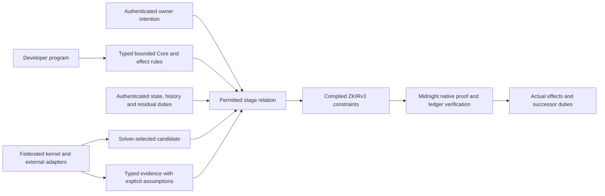

# Moriarty whole-language design review

19 September 2026. Scope: the current working-tree product contract, active plans, selected language/compiler/runtime sources, research requirements and selected historical decisions. This is an architecture review with bounded local experiments, not a complete code/security audit or proof of implementation readiness. Source hashes and independent reports are retained beside this file. No proof backend, deployment policy, language semantics or implementation was changed by the review.

## Assessment

Moriarty has a coherent purpose and strong financial invariants. Its intended structure is a bounded programming language whose accepted transitions preserve authenticated intention, authority, complete financial effects and residual obligations, using Midnight's native proof stack and ZKIRv3. The main deficit is integration: several useful semantic and implementation fragments do not yet form one public language-to-ledger contract. More application-specific profiles or more literature alone will not close that gap.

The strongest existing choices should remain: exact arithmetic and explicit rounding; separate assets, debt and authority; immutable pre-state and controlled writes; postconditions over actual candidate outcomes; fees inside signed bounds; explicit partial/unknown/recovered states; permissionless authors and solvers; native Midnight proving; and a kernel with declared external trust assumptions. These are design strengths, not completed end-to-end guarantees.

## Architecture the design must make precise

| Layer | Responsibility | Current evidence and remaining boundary |
|---|---|---|
| Authoring language | Define financial state, invariants, actions, admissible effects and conditions | Source/5 supports local multi-action lifecycle preparation; broader source/library expressiveness remains incomplete |
| Typed Core and effect rules | Define values, resource transitions, rejection, costs and obligations compositionally | Several different Core representations exist; a common supported relation and explicit subset mappings are needed |
| Authenticated intention | Specify solver-controlled choices, exact assets/recipients, budgets, disclosure and recovery | Atomic outcome authority and richer lifecycle state remain separate; MPLR-035 defines the required completion relation |
| Stage/history semantics | Preserve causality, authority, duties, external knowledge and mutually exclusive terminal branches | Requirements are detailed; executable staged semantics and their native correspondence remain open |
| Compiler and native proofs | Lower exactly to ZKIRv3 and bind the intended acceptance statement | The inspected Compact mapper is a restricted legacy path; general successor-to-ledger proof correspondence is not established |
| Financial libraries | Express ACTUS and DeFi behavior through supported primitives | Financial vocabularies/reference studies exceed the current four protected lifecycle operations |
| Federated DeFi kernel | Find/coordinate execution, request evidence, manage adapters and constrained signing | Optional service integration with explicit ZK/MPC/TEE/finality assumptions; not a deployment authority |
| Developer tools | Show signed meaning, simulate, report missing evidence and explain rejection | Tooling must report exact supported profile and assurance scope; advisory analysis cannot imply ledger enforcement |

This is a recommended responsibility map, not an extracted call graph or implemented theorem. The kernel coordinates external work; only the declared enforcement mechanism on each domain establishes its accepted effects.

## Prioritized findings

### D1 — One source-to-acceptance contract is still missing

**Observed.** The graph traces source/5 through `financial-agreement-source-compiler.ts` to local `financial-lifecycle.ts`. The inspected Compact mapper imports the legacy frontend. Its restrictions explicitly exclude obligation-ledger, authority, proof and settlement acceptance (`experiments/moriarty-language/src/lower-compact.ts:12–30`). Source/5 explicitly says its state is a local projection and it constructs neither proof nor public transaction (`spec/successor/financial-agreement-source-v5.md:37–39,64–65`). `successor/core.ts:1–2` is a separate funded-source/0 representation. See the graph's architecture observations for exact paths and limits.

**Implication.** “Source → Core → native proof” is the product architecture, but it is not one demonstrated pipeline for the richest current source language. This is a declared capability gap, not a claim that the restricted lowerer accepts invalid money movements.

**Recommendation.** Publish one normative supported-Core contract, with explicit profile embeddings and an operation-by-operation mapping through target constraints and effects. Preserve existing scoped implementations and receipts; do not silently identify their distinct representations. Trace a novel two-asset program end to end before expanding another product-specific profile.

### D2 — Signed intention must be part of the same stage relation

**Observed.** Atomic outcome authority binds one program/predecessor/nonce and debit/credit limits (`src/runtime-types.ts:18–25`; all short `src/` references here are under `experiments/moriarty-language/`). Its evaluator performs useful gross/net fee checks (`src/evaluate.ts:285–305`). The richer lifecycle engine explicitly excludes signatures, proofs, ledger state and authenticated time (`src/successor/financial-lifecycle.ts:1–6`). Product requirements demand broader liability, revocation, partial-fill, per-phase and recovery policies (`docs/MORIARTY-PRODUCT-CONTRACT.md:33–45`).

**Implication.** Valid local lifecycle preparation and valid atomic intent checks are not yet a single multi-stage authorization guarantee. Type correctness alone also does not identify which holes a solver may fill.

**Recommendation.** Give the authenticated policy a canonical, versioned interpretation in the same acceptance relation as effects. Bind allowed substitutions, aggregate spend/fees, liability introduction, stage authority, evidence/disclosure and recovery. A candidate may choose any permitted route; amendments outside that set need authority. Preserve both useful alternative completions and hostile single-property mutations.

### D3 — Resource and recovery semantics are the next critical language decision

**Observed.** The product correctly separates consumable receipts, affine authority and persistent liabilities. The staged design specifies conditions, joins, cancellation and late results, while leaving the executable staged profile open (`openspec/changes/partial-and-conditional-transactions/design.md:13–31`). The local lifecycle action union is Transfer, Repay, Originate, Accrue (`src/successor/financial-lifecycle.ts:127`).

**Experiment.** Origination with ordinary remaining work 2 and closure reserve 16 prepares a debt of 100 and leaves ordinary work 0. A subsequently funded local Transfer+Repay rejects `INSUFFICIENT_WORK`. Exact input/output: `reserve-repro.mjs` and `reserve-repro-output.json`.

**Counterevidence.** This behavior is explicitly required by the local repayment specification (`spec/successor/repayment-kernel.md:147–149`): reserved closure work is not ordinary work. It is not a bug relative to that scoped contract, not a deployed loss demonstration, and debt remains recorded. The product gap is a usable separately authorized recovery operation or admission rule preserving a feasible recovery path.

**Recommendation.** Define separate transition rules for authority, custody, consumed receipts and persistent duties. Decide how reserved work is spent, who may invoke recovery, which duties can survive recovery, and how new funding or amendments are authorized. Do not fix the example by letting every ordinary action consume the reserve. Recovery capacity is conditional on evidence, network availability and bounded cost assumptions; it cannot promise unconditional liveness.

### D4 — Bounded stages must not silently become short-lived public contracts

**Observed.** The local lifecycle state caps arrays at 128 (`financial-lifecycle.ts:14,503–511`). Used transfer/allocation/origination/accrual IDs and obligations append, with no rollover/compaction action in the four-operation union (checks/appends at 1499/1523,1606/1621,1690/1717–1718,1821/1829). See the Astra review for scope.

**Inference.** This implementation's state lineage permits at most 128 occurrences per corresponding ID category, possibly fewer due to other bounds. This is a deliberate local bound; it is not established as the intended lifetime limit of Moriarty services. Turing incompleteness/bounded per-stage execution does not by itself provide an authenticated way to compact lifetime state.

**Recommendation.** Specify whether instances are explicitly bounded episodes or support authenticated successor episodes/sets. Any rollover must preserve replay protection, cumulative signed budgets, residual authority and liabilities. PCD compression does not automatically compress mutable state arrays. Test a final repayment after the ID limit, with an outstanding duty.

### D5 — Resolve the history guarantee at the semantic level

**Observed.** The September11 PCD decision is still marked active and selects ledger-head induction with bounded imported certificates while rejecting general DAG PCD and per-transaction recursive history (`wiki/decisions/pcd-midnight-native-architecture.md:5,41–48`). Current product and kernel requirements require history/predecessor binding and, when recursive history is used, legitimate origins and well-founded predecessor composition (`docs/MORIARTY-PRODUCT-CONTRACT.md:35`; `kernel-security-and-ai-solvers/requirements.md`, MPLR-027). Existing MC03/MC06 plans retain recursive and split/join proof obligations.

**Disposition.** These mechanisms can coexist in a hybrid design, but their claims differ. Ledger acceptance induction relies on authenticated accepted state lineage; a portable recursive certificate has its own predecessor and verifier statement. The older page's categorical rejection cannot silently decide the newer product's scope. The product contract controls conflicts. This review does not select a new cryptographic scheme or infer current deployed recursion support from old observations.

**Recommendation.** Define required history properties for on-ledger steps, off-ledger segments, foreign evidence and private split/join. Assign each to native ledger induction or native certificate composition, with exact assumptions and data availability. Name which artifacts a third party can verify independently. Bind the precise supported Midnight interface. Native backend reuse is settled; the application statement and accepted-history contract still require specification.

### D6 — Expiry and late recovery need distinct authority rules

**Observed.** The optional managed-kernel design says authority ends no later than its intent (`docs/superpowers/specs/2026-09-11-defi-kernel-sdk-interface-design.md:34,125`). The same design retains pending duties/reserves when progress is unavailable (131), and the staged requirements retain unresolved external duties after expiry. The canonical language already demands stage-specific authority and signed recovery policies.

**Inference.** This is an unresolved interface interpretation, not demonstrated unauthorized execution. A system must explain who may reconcile a late success, refund still-controlled custody or complete an already-incurred duty after ordinary initiation authority expires. It may require previously authorized recovery or a fresh amendment, but must not imply both automatic expiry and unrestricted late action.

**Recommendation.** Distinguish authority to initiate work, to complete already-authorized work, to reconcile evidence, and to recover/amend. Give each a signed scope and lifetime. Test expiry immediately before authenticated late success; neither double delivery nor silent abandonment is acceptable. Optional service identity/expiry policy must not become a universal language restriction.

### D7 — Financial breadth requires composable libraries over a small trusted basis

**Observed.** Source/5 protects four operation schemas and a narrow settlement/repayment denomination binding (`funded-expression-source-v1.ts:207–220`; `financial-agreement-source-compiler.ts:526,542–547`). Richer expression types and reference vocabularies do not imply a general source/library extension interface.

**Recommendation.** Keep quantities, asset identities, shares, debt and authority distinct. Define compositional primitives and objective certification rules from which developers author new products without maintainers approving each program. ACTUS and DeFi cases must drive conformance and uncover missing primitives, rather than each becoming a closed application mode. Address modules, interfaces, dependency/version identity and cost-preserving substitution explicitly. A closed supported primitive set is compatible with permissionless programming; an unchecked user-defined effect is not a substitute for extensibility.

### D8 — Consolidate the execution plan without weakening acceptance

**Observed.** P0/P1/P2, C0–C4 and K0–K5 overlap target correspondence, stage semantics, authority, budgets and history. P2 already requires partial/failure outcomes, while C1 adds staged source/proof behavior after P2; these can mean different forms of partiality and need a precise interface. The Pel files contain symbolic roles/artifacts and `candidate-full`; their plans explicitly identify them as templates.

**Recommendation.** Produce one traceability view from each behavior to its canonical rule, source/Core construct, target statement, positive/hostile witness and implementation package. Distinguish partial Midnight phase outcomes from multi-transaction workflow stages. Bind concrete commands and artifacts for the next package. The apparent overlap is not proof of a literal dependency cycle; it is a package-boundary risk. Do not count validated OpenSpec/Pel syntax as an executable integration plan.

## Privacy, evidence and the kernel boundary

The current requirements correctly distinguish proof validity, MPC authorization, TEE attestation, chain finality and service delivery. Their next language-level representation should be a typed evidence contract naming the statement, subject, domain/stage/epoch, issuer/verifier, freshness and allowed disclosure. A document digest identifies bytes; the authorized predicate or attestation gives them application meaning. Public nondisclosure, solver/prover access and later witness availability are separate properties.

Private-state completeness is necessary for global budget and uniqueness claims: a hidden reservation cannot disappear merely because the next solver cannot see it. A design may use authenticated commitments, proofs or explicitly scoped federated state, but must name the completeness domain. The language should let developers state these assumptions and prevent a weaker adapter/evidence policy from silently satisfying a stronger signed requirement.

## Recommended next design deliverable

Freeze a versioned **language semantic contract for one vertical slice**, preserving the wider product obligations. Include: values/asset identity; effect/resource judgments; authenticated intention and allowed solver holes; workflow state/continuation/evidence types; history statement; phase-specific target mapping; privacy/availability assumptions; work/recovery bounds; and deterministic failure semantics. Do not add another theorem-prover dependency.

Use a new two-asset conditional settlement authored through the public language: one owner signs bounded spend and fees, recipient acceptance plus an authenticated document condition is required, either of two independent solvers may complete an allowed route, one accepted stage leaves a residual duty, and a late outcome races expiry/recovery. Include low remaining work and ID-cap cases. Every stage must expose actual custody, consumed authority, fees and remaining duties.

The discriminator succeeds only when a single versioned program/relation is followed across source, local semantics, emitted ZKIRv3 and native enforcement. First run the smallest local relation and target feasibility checks; actual native/network acceptance remains a separate measured milestone. Useful partial evidence is retained without claiming the entire language is finished.

## Verification and review limits

Root ran 70 focused existing tests across source/5, financial lifecycle and repayment: all passed, zero skipped. These tests establish only their local predicates. The reserve experiment was reproduced separately and intentionally demonstrates specification scope, not a regression. The graph covers 106 selected files and preserves extraction limits; it is not a full repository semantic graph. No complete application proof, ZKIRv3 compilation for this proposed new slice, native recursive proving campaign, deployed-contract audit or public transaction was performed.

Independent review status is recorded in REVIEW-STATUS.json. Findings and recommendations are review evidence, not votes establishing correctness or authorizing implementation/publication.
