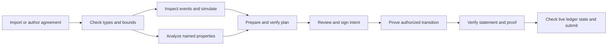

# Moriarty developer interface — reviewable proposal

Date: 2026-09-06. Status: S2 design; no SDK, parser, browser application or prover
is implemented by this document. Companion to the
[unified semantics](2026-09-06-moriarty-unified-semantics-design.md).
The original [W10 interface contract](../../../deliverables/moriarty-semantics-intent-compiler-sdk-deep-research-prompt-2026-09-03.xml)
remains the full SDK scope. This is its proposed first usable workflow, not a
replacement claiming that every SDK operation has been specified.

## What the developer does

The [intents amendment](../../research/2026-09-06-intents-report-integration.md)
separates exact-plan signing from outcome-intent signing. The working R2
workspace implements the former. R2b adds separate IntentIR, solver query,
PlanIR and receipt views, and a signing summary rendered from decoded canonical
authority: asset domains, gross budgets, allowed recipients, net goals, fees,
validity/nonces, assumptions and liabilities. A pending receipt retains
obligations; it cannot show a terminal goal as settled. Real contract and PCD
checks remain required regardless of which signing profile is chosen.

Open a real fixture or write an agreement using a typed financial package.
Inspect its terms, events, effects and assumptions. Run a scenario or request
analysis of a named property. Prepare an intent, check its effects, collect
signatures, request a proof, verify it and submit only when live state checks
also permit the transaction.



Simulation and static analysis are distinct. A successful example does not turn
the property list green. A valid proof does not make a stale predecessor live.

## Concrete screen proposal

```text
Moriarty workspace                         Loan: lam01

AGREEMENT             BEHAVIOR             TRANSACTION
Terms and parties     Event timeline       Predecessor states
Package version       Calculation date     Authorized action
Numeric profile       Payment date         Asset movements and fees
Bounds and horizon    Due / paid amounts   Signers and expiry
Observations          State changes        Proof and ledger status

Properties
  Principal/dues accounting   [Unavailable: checker not connected]
  Ordered accrual             [Unavailable: checker not connected]
  Example trace               [Imported fixture — not generated]

Selected event: 2013-02-01 PR
  Contractual principal due: 500 USD
  Remaining scheduled notional: 4,500 USD
  Settlement asset/conversion: not configured
  Settlement: no payment evidence

Diagnostics
  Numeric profile must resolve the reference interest representation.
```

The first mock must show this truthful initial state. It must not start with
invented verified badges. Developers can inspect the original fixture and the
proposed transition explanation even when no interpreter or checker exists.
Once connected, generated traces retain a different provenance label.

The DeFi example uses the same layout. With reserves 1,000,000 A and 2,000,000 B,
an illustrative 10,000 A swap returns 19,743 B under the proposed integer
formula. Display the minimum accepted output, fee rule, recipient, new reserves
and predecessor revision. Changing the minimum to 19,744 produces a named
slippage failure. The loan view emphasizes dues and accrual; the pool view
emphasizes reserves and settlement. Both expose the same proof/authority flow.

## Illustrative authoring surface

This sketches developer intent; it is not final grammar or executable code.
Every package call must elaborate into the shared bounded relation.

```text
agreement repayment = Actus.LAM {
  terms: importFixture("actus-tests-lam.json", "lam01"),
  parties: { assetHolder: lender, counterparty: borrower },
  numeric: reviewedActusProfile,
  bounds: declaredLoanBounds
}

intent payPrincipal = settleDue {
  agreement: repayment,
  event: principalEventId,
  amount: 500 USD,
  payer: borrower,
  recipient: lender,
  expires: paymentDeadline
}

intent swap = execute {
  agreement: pool,
  action: SwapExactIn(10_000 A),
  receiveAtLeast: 19_700 B,
  recipient: trader,
  feeCap: declaredFeeCap,
  predecessors: selectedStateCommitments,
  expires: swapDeadline
}
```

The surface should accept either imported or developer-authored terms. Import
is an authoring convenience, not a special compiler path. The package, numeric
profile, party map and declared bounds are included in program identity.

## Proposed minimal wire objects

All capacities come from the selected finite profile. IDs and commitments are
fixed-length bytes encoded as lowercase hex. Integer and decimal values use
canonical strings, never JSON floating-point conversion. Decimal import retains
the original lexeme separately from its checked numeric value. Structural
records have fixed schema versions; unknown critical fields reject.

| Object | Required contents |
| --- | --- |
| `ProgramBundle` | Schema/semantics version; typed source and normalized Core digests; package lock; numeric/bound profiles; property manifest; compiler/translation evidence status. |
| `ObservationBundle` | Subject/source, units, event and observation times, payload commitment, attestation, policy and freshness context for each ordered observation. |
| `ScenarioResult` | Input/program digest; imported or generated provenance; ordered events and every observed ACTUS result field; proposed dues/effects; structured diagnostics. |
| `PropertyResult` | Exact predicate, assumptions, bounds, method and evidence; `proved`, `counterexample`, `unknown` or `unavailable`; optional counterexample trace. |
| `Intent` | Domain/program, action, writable predecessors, observation policy, recipient/asset constraints, fee cap, signer policy, nonce, expiry, cancellation/partial-fill rules and display digest. |
| `PlanCertificate` | Verified program/contract-certificate reference, exact unsigned intent bytes, state/observation context, effect constraints, bounds and deterministic display. It certifies a proposed plan before signatures exist. |
| `SignedIntent` | Canonical intent bytes and ordered, scheme-tagged authorization evidence. Signature bytes are not part of the intent digest they sign. |
| `ProofRequest` | Signed intent, predecessor messages/proofs, program identity, witness references, required verifier profile and privacy policy. Never transmit private witnesses by default. |
| `TransactionBundle` | Public statement, per-instance program/certificate/policy map and any composition certificate, outputs/effect commitment, consumption identifiers, signed intent reference and final proof encoding with verifier identity. |
| `VerificationCertificate<T>` | Object kind/digest, accepted predicate/profile, checked evidence/context and result. Its validity is scoped; it does not cache future ledger freshness. |
| `SubmissionRecord` | Bundle digest, idempotency key, durable submission/observation status, target transaction reference and finality evidence. Transport status is not proof status. |

Proposed canonical wire encoding: UTF-8 JSON with fixed ASCII schema keys sorted
lexicographically, no insignificant whitespace, no numeric JSON tokens, canonical
string escaping, and arrays retaining their semantic order. Reject duplicate
keys and noncanonical encodings before digest/signature comparison. Byte fields
use the hex rule above; critical text identifiers have a restricted bounded
alphabet. Human labels are bounded display data with controls escaped and their
exact rendered representation bound by a versioned display digest. Exact codec
conformance vectors are required before signing implementation; this proposal
does not claim interoperability with an existing intent standard.

## PCTE claim interface — report revision

The [report reconciliation](../../research/2026-09-06-pcd-report-integration.md)
adds proposed `ClaimSpec`, `BoundClaim` and `ClaimEnvelope` objects. A spec contains
claim type/version, mandatory mode, predicate/specification, authorized verifier
and key version, domain/transaction-core/program commitments, exact state references,
effect/public-input commitments, validity interval, dependency IDs and resource
budget. The evidence descriptor separately binds format, digest and sidecar
reference. Compute proof-independent claim IDs and the manifest root before
computing `intentDigest = H(domain, IntentCore, H(TxCore), manifestRoot)`.
`BoundClaim` then attaches that intent digest to a claim ID and its evidence
statement; it is never fed back into ClaimSpec or the manifest root. TxCore and
IntentCore exclude enclosing roots/signatures/evidence; ClaimSpec excludes its
own ID, intent/manifest roots, signatures and evidence. The envelope binds the
signed intent and ordered evidence. This is an acyclic commitment construction.

Do not include evidence hashes or signatures in their own signed preimages.
Semantic claim IDs are proof-independent; dependencies must be acyclic and bounded.
`TransactionBundle` carries this envelope in addition to its composition map.
The verifier's deployment policy determines trusted predicates/keys; the sender
cannot select an arbitrary permissive checker. Missing or unknown mandatory
claims reject, and stripped evidence cannot downgrade a signed required claim.

Proposed operations `describeClaims`, `checkIntentEffects` and
`verifyRequiredClaims` expose predicates and evidence status around the existing
workflow. These are interface requirements, not implemented SDK functions.
Show IntentEffects, ContractInvariant, TransitionValidity and HistoryCompliance
separately, plus any package-required authorization/dependency claims. Each has
scope, assumptions, method, verifier profile, freshness and status. The mock
uses static descriptions with unavailable real checks and SimulatedEvidence.

Midnight-native Halo2/recursion is the first planned backend. A native Rust proof,
a target-ledger accepted proof, and a multi-party PCD history need separate
results. The developer sees which boundary passed. Missing witness/sidecar data
reports unavailable and blocks acceptance; it never requests predecessor secrets
silently. Optional acceleration cannot disable a mandatory history or intent check.

## Operation contract for the first workflow

The interface is TypeScript-first with the same wire objects usable from CLI,
browser and Node. The table proposes the minimum safety path; ownership remains
subject to the assignment's frozen component/data-contract inventory review.

| Operation | Input → output | Preconditions, rejection and boundary |
| --- | --- | --- |
| Import/check/elaborate | Source or fixture + lock/profiles → checked `ProgramBundle` | Lossless import, type/unit checks, all critical fields handled, finite bounds. Unknown package/profile or unsupported source rule returns a diagnostic. Local, repeatable, no signing. |
| Simulate/compare | Program + state + scenario → `ScenarioResult` | Generated evaluation must be identified. Compare every ordered field; mismatch is not downgraded to success. Local or privacy-approved remote execution. |
| Analyze | Program + required property set → `PropertyResult[]` | Timeout/unsupported method is unknown/unavailable, not proved. Required unresolved properties block certified deployment. Local checker or explicitly selected service. |
| Prepare/verify plan | Program + state/observations + intent → `VerificationCertificate<Plan>` | Check the contract certificate, identity, assumptions, bounds, effect constraints and intended signer policy. Pure verifier over supplied evidence. No claim signatures already exist. |
| Create signing request/sign | Verified plan + displayed bytes → `SignedIntent` | Display/program/intent hashes match; wallet checks intended account/domain and plan freshness. Cancellation before signing leaves no authorization. The signing effect belongs to the wallet. |
| Prove | Signed intent + witness/predecessor proofs → `TransactionBundle` | Check actual signatures and transition. Missing prover, bad witness or failed relation produces a structured failure. Remote witness disclosure requires the selected privacy policy. |
| Verify proof/bundle | Bundle + program/verifier profile → `VerificationCertificate<Transaction>` | Pure, fail closed. Check statement binding and final proof/decider, not a bare accumulator. Reject substituted statement, profile, proof, effect or predecessor. |
| Submit/observe | Verified bundle + current ledger evidence → `SubmissionRecord` | Recheck mutable ledger consumption/finality conditions. A stale snapshot rejects or requests replanning; never silently rebind an existing signature/proof. Submission is an external effect. |

Verification outcomes are a tagged union of `verified(certificate)`,
`rejected(error)` and `unavailable(reason)`. Analysis has the separate four-way
result above. Neither API uses a bare Boolean to conflate unsupported verification
with a false claim. Suggested stable errors include `InvalidEncoding`,
`UnknownCriticalField`, `UnitMismatch`, `NumericProfileUnresolved`,
`BoundsExceeded`, `MissingObservation`, `Unauthorized`, `EffectMismatch`,
`InvalidProof`, `WrongDomain`, `StalePredecessor`, `AlreadyConsumed` and
`RequiredPropertyUnproved`. Diagnostics carry bounded source/event locators;
private witness values are not inserted into error strings by default.

## Signing, retries and partial execution

Signing follows plan verification; final transition proving follows signing.
This avoids a circular requirement that a proof already contain signatures for
bytes including that same proof. Plan and transaction certificates have distinct
types and cannot be substituted for one another.

A submission idempotency key binds domain, intent ID, fill ID and bundle digest.
Persist the submission record before sending, then persist the observed result
before acknowledging delivery. After a crash, query the target by that key or
transaction reference and reconcile; do not issue a different payment merely
because the acknowledgement was lost. Actual deduplication retention and finality
rules require the target adapter's reviewed implementation contract.

For the first interface profile, each partial fill requires a fresh signed
intent binding the exact current predecessors, including the residual state.
The agreement retains the order identity, cumulative amount, fee budget and
residual rule; the new authorization cannot bypass these state constraints.
Each accepted fill advances the residual state/revision and consumes an
allowance. A signature for an earlier predecessor does not authorize its
successor. Automatic multi-fill authorization would require a separately
specified signed lineage policy and is outside this initial profile.
Cancellation competes with fills under ledger ordering;
an old authorization does not override a committed cancellation. Transport
cancellation stops local work, not a previously submitted transaction.

## Mock scenarios and acceptance

| Scenario | What the developer must see |
| --- | --- |
| LAM repayment | PR/IP ordering, exact imported decimals, due versus paid status and numeric-profile gap. |
| Business-day contrast | Calculation/payment dates differ; CSF and SCF need not accrue the same amount. |
| Option with delayed settlement | Exercise creates an amount; settlement later discharges it. |
| AMM swap and rounding mutation | Correct integer output, min-output rejection and one-unit ceiling defect. |
| Lending/mandate composition | Health/loss bearer and allocator authority are separately checked. |
| Missing/stale observation or wrong authority | Specific rule failure with no proposed committed effect. |
| Altered/missing proof or wrong domain | Rejected/unavailable; no real verification badge or submit enablement. |
| Conflicting predecessor use | Individually valid proof shown separately from ledger double-consumption rejection. |
| Multi-parent join | Each input's identity/proof, resulting output vector and consumption accounting. |
| Cancellation, partial fill and crash recovery | Residual allowance, competing state revision and durable submission identity. |

The user approved starting the small local mock with “begin”.
It uses a distinct `SimulatedEvidence` type and a simulated transport; it never
produces a real `VerificationCertificate` or connects to wallet signing, a chain
or a paid prover. A displayed mock result must retain that label when exported.
Imported expected results and hand-worked examples remain distinguishable from
generated execution. This document supplies the screen and interaction design;
the runnable mock is tracked in the [implementation plan](../plans/2026-09-06-developer-mock-implementation.md).
