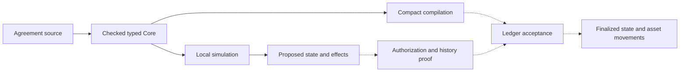
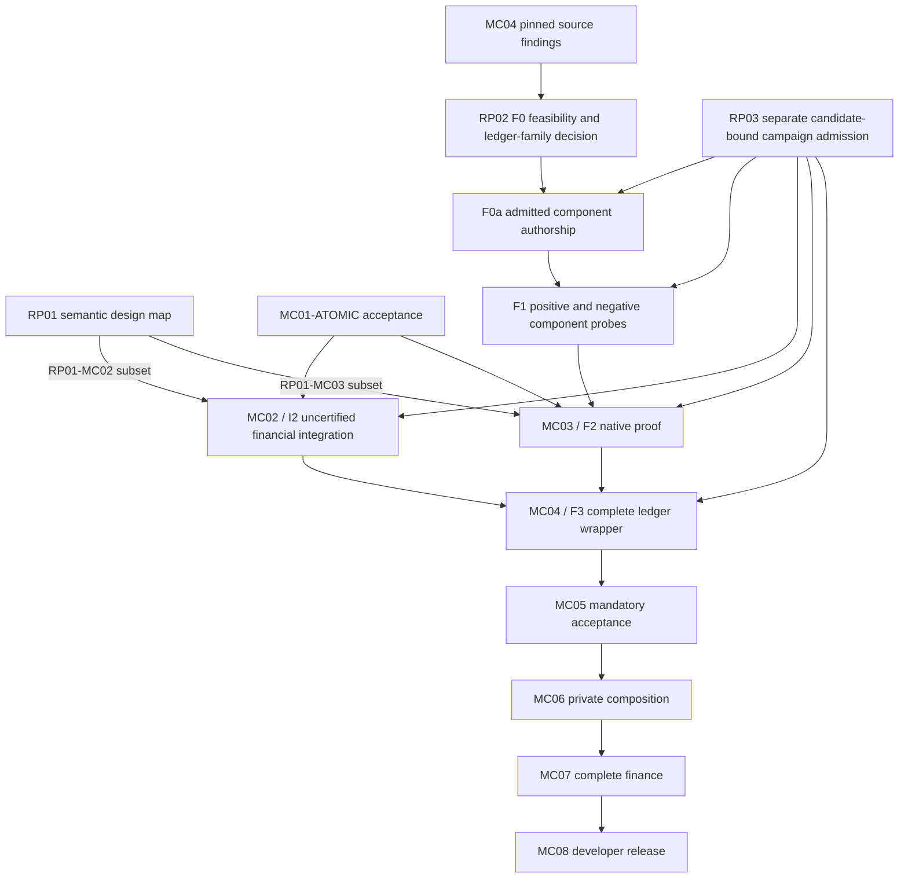

Review the final corrections to a previously fully reviewed Moriarty design dossier. This is an offline scoped delta review; do not claim primary-source reading or tests. User selected .mori, EBNF-family syntax and K semantics. Prior full GPT-6 review approved with two wording suggestions. Prior full Fable review withheld approval only because evidence README referred to a progress file excluded from its manifest; that sentence is removed and the exclusion is explicit. Assess the corrections themselves and whether prior findings are resolved. Retain limits and do not silently promote earlier research paraphrases, unchanged proof gaps or unimplemented features. No new implementation is claimed.
Corrections: conditional source-versus-Core K grammar equivalence; outcome signature/statement distinction also in roadmap; durable per-authorization cumulative partial-fill accounting; asset identities distinct from nominal units in example; README syntax marked planned; later PDF extraction status recorded separately from immutable fetch receipts; capsule-file check name clarified; active extension-reference grep added; exact claim index preserves prior ordering. The existing .mori code/source changes are unchanged from the full reviews. State approved or changes_requested only for this bounded final design/maintenance scope.
Candidate SHA256: ea77e57d6539bba4fefefb79540ad623086b42cc97ed5baaa85f80ef0fd43c1f

{
  "base_commit": "9f003b430988a86a2dea7758ce6392c125f0fbbf",
  "files": {
    ".foreman/session.ndjson": "c33c6578b8d713d8d920840c5243f19d440b2e2a2c69a017d5522ea352c3d24f",
    ".raw/.manifest.json": "7e3b47ec24bdb4d70e26eac199038a6b882369396654eec6cd690179d90763dc",
    ".raw/captured/defi-language-design-2026-09-07/abnf.json": "60e12a1770e14ec5ad6439ebc02d0966b2e39770b381d78c95f2a6f7ed181a5f",
    ".raw/captured/defi-language-design-2026-09-07/amm.json": "722b1c02e93690e4cfb51745974897233b4d8c6cd5cc835ad91c032921b2c8ab",
    ".raw/captured/defi-language-design-2026-09-07/contracts.json": "e2b5c88c1f12c7cff0101f3808ec47fb0ba7a460bb50f3ce61f8211cebd94e32",
    ".raw/captured/defi-language-design-2026-09-07/ebnf.json": "711f27423c916f486b3956a1c67f90219b98a4d830a6f223d6bb1a42c918ea1c",
    ".raw/captured/defi-language-design-2026-09-07/erc4626.json": "eac57d57095fbb2ff32b468a7bd19b04ad1353a54a66c38a0f2f8d1ba902f25f",
    ".raw/captured/defi-language-design-2026-09-07/erc7540.json": "0d7c06c9fdbf64574ad3b4bac11b40757e1bbc13c71dd01b8f49df7b099adb53",
    ".raw/captured/defi-language-design-2026-09-07/gogol.json": "710b797de8fc9185a803432600ae5eefaa280f7e2190eab9cb8f3e76202579de",
    ".raw/captured/defi-language-design-2026-09-07/iso14977.json": "1187f1dc85b40a9dd89035966a94598772aa45f1ed0167eee4ae9685333f92da",
    ".raw/captured/defi-language-design-2026-09-07/k-manual.json": "58081d8b5dac0dcd6fa0e6c5167991d237e6791aec815211267230a8f4323ef1",
    ".raw/captured/defi-language-design-2026-09-07/kotzer.json": "5afecf1f16bd82b11a42263d52256026350665a8c98b91f4c2378d5756443431",
    ".raw/captured/defi-language-design-2026-09-07/lappi.json": "d6504a6e31fabb9bace630eeb3b7f5a778587b4b0222c9123cdf7991c74ebea4",
    ".raw/captured/defi-language-design-2026-09-07/lending.json": "934067b62abdc6ec03bf39cfca71ddb41a608265990a4b4dc739b5c68bb0ebbb",
    ".raw/captured/defi-language-design-2026-09-07/marlowe2020.json": "2a76be8941ba8c15abf57a22c681f530d1445e231e214fe68c84a2633c35f55c",
    ".raw/captured/defi-language-design-2026-09-07/mernik.json": "28d8a2a1ba51e4172338ae95792aabc50e52003c2bca76da18089aacdbfc77ad",
    ".raw/captured/defi-language-design-2026-09-07/move.json": "f28f604f560cb6f3c459da92ea127dbc110c2c0380a868596169dd9019abf7ef",
    ".raw/captured/defi-language-design-2026-09-07/obsidian-language.json": "7317d211a9b1a2720bcc3c02650e25a893661266b263b9e6f375c090416c44c2",
    ".raw/captured/defi-language-design-2026-09-07/pane.json": "633a1fbceae25cce1dbf4ad0e9102dcfa1334dd2a1edf36f819995515e040ae3",
    ".raw/captured/defi-language-design-2026-09-07/stefik.json": "f33a71ee4cea6ec33fe0def936c96461da02859530d20e81a9ae83d8aed0fecd",
    ".raw/captured/defi-language-design-2026-09-07/user-assignment.md": "c5506f2e7077d38a18eaece4203e112d7dd77d2699268eac263604f6f4f44be7",
    ".raw/captured/defi-language-design-2026-09-07/werner.json": "c5914d0f863fafe3d1da1f75a0f5e2399c0824ce7fde56050361c82956531076",
    ".raw/captured/defi-language-design-2026-09-07/yield.json": "1c608c034cd6c232efdcbb12769028a38814f6462efb717a988f50f9a5da0aac",
    "README.md": "bbad23878942aae5baf21950b52aff9dc4e6f30d8e58e4d93b9008e01ed79f7c",
    "ROADMAP.md": "d922f29a67aa6979578ef280258779fb3499a343ade5a374d2cd8b17e8085779",
    "deliverables/defi-language-design-2026-09-07/LANGUAGE-DESIGN.md": "bd9a7af78e400da7d8ba4d57abc9693665579ea78e7fdb98004f231ecbfd0aa8",
    "deliverables/defi-language-design-2026-09-07/README.md": "66e0ba601cece6488b8f10b8cafaee51d352150488c095fbad9d913e40665a64",
    "deliverables/defi-language-design-2026-09-07/SYNTAX-COMPARISON.md": "49e305e43fc39c839f8c84cba5183feb5152fd71f0c16a0c2ad2f7bc00401635",
    "deliverables/defi-language-design-2026-09-07/action-targets.csv": "7b9b245b97a4d63f6cc946c9dd7e7f6c3773df4cf47b2540d82b5ffc6cfe3d2f",
    "deliverables/defi-language-design-2026-09-07/research-graph.json": "6a7d66d89c1e610193ea5f7a8cd5182790ccee3754f7d25876e13fb7d2d3d048",
    "evidence/defi-language-design-2026-09-07/README.md": "4e6eb6bc16d0a24db805586e13a7d488c32f412233a6c3c200642b405725414e",
    "evidence/defi-language-design-2026-09-07/acquire.py": "75d1f1479d9296618afe89dbeb6abcf13e9ef5ccda2b3aee81301e0eb22324f2",
    "evidence/defi-language-design-2026-09-07/demo.txt": "fa206fb8924949193f2df2a0efba43233e7b1945e56fbb693b72e15d1199b27d",
    "evidence/defi-language-design-2026-09-07/extension-migration.json": "d9bd48a4b5abdb3870963027cc3781fc3ad83f97ff82ce8ec7230cd6cedca21f",
    "evidence/defi-language-design-2026-09-07/fresh-checkout.json": "5ce6bb416d533b797160094ce0060e0ac4cd1956af8fd9de11c99a2b9137c182",
    "evidence/defi-language-design-2026-09-07/inspection-record.json": "b695ec94072f98487d02bbe97056da28695697b9a9a509f63b9ad5d8b18d56d4",
    "evidence/defi-language-design-2026-09-07/intake-apply.json": "b77eb922386f4ca5c4ec7d6e0ef598f386b4ef0995ec868706bcc3ae2d662151",
    "evidence/defi-language-design-2026-09-07/intake-inspect.json": "d62cee3472265d99074bf7c318af7ec896b16d5a6a2aa265cec8ad11cd42bd0e",
    "evidence/defi-language-design-2026-09-07/language-build.txt": "34fc8f532e8455212c5eeba2f44af8dd0d5a13e2138025e81ecd8272dd2f48fa",
    "evidence/defi-language-design-2026-09-07/language-tests.txt": "5dfbbc65196d97a7baa386dd38dce8eac55f5c859b6438127bfe0e2b0d4f5414",
    "evidence/defi-language-design-2026-09-07/navigation-apply.json": "6485f43e494e4f7d8887228091828aa980bf21ef34917200deb3fa82e1c1524c",
    "evidence/defi-language-design-2026-09-07/navigation-inspect.json": "e0153a76f76ad81b57a99f3485fedeaf61b78d479832eaac679b2ef49fbe94ef",
    "evidence/defi-language-design-2026-09-07/openspec-validation.txt": "8058ea82ffbbe8b7d55b84ef6ebadf5c05ccd451db3f1a75d08743748f260259",
    "evidence/defi-language-design-2026-09-07/polish-apply.json": "f63105f8bb05bf34d7cc2ee3ed6c25910e1ce95e2f3ce99c5eb4908d33c08f70",
    "evidence/defi-language-design-2026-09-07/polish-inspect.json": "21391ff8cf382cc48f552bbc4ab42280ac852c1d0528c689ff166521644716a2",
    "evidence/defi-language-design-2026-09-07/source-cards.json": "ad716fc25fda67592baa13ff4712529adb5b3d60fdb59e4305c99cbf9bcd3f4e",
    "evidence/defi-language-design-2026-09-07/source-inventory-precondition.json": "9872989791ea81765e11550c22fffac760eb9bc6aaee7953d2064984f1d554c4",
    "evidence/defi-language-design-2026-09-07/source-map.json": "43d685491e219afc693688cca8858a9248315e4ac6395b23fb0d29abb2c2edba",
    "evidence/defi-language-design-2026-09-07/vault-lint-final.json": "6e53ce766bd1c9f155c1b1077c299ef3ecaf697a2003cad773fd86daf44795c5",
    "evidence/defi-language-design-2026-09-07/vault-lint.json": "6e53ce766bd1c9f155c1b1077c299ef3ecaf697a2003cad773fd86daf44795c5",
    "evidence/defi-language-design-2026-09-07/verification-final.json": "a77d24cf8835c30ac9cc0804c36226dcb5c30dfd1deedc4f25ea3dcec0e73f8c",
    "evidence/defi-language-design-2026-09-07/verification.json": "02fb28d4d23023455fe21df1b8c02f94854152c9726c9f39b9bc0c12e2d69342",
    "evidence/defi-language-design-2026-09-07/verify.py": "a8410222624cca33843cee303eb1a3022c491af37e480d14d8be975f145798aa",
    "evidence/source-inventory.csv": "76991de3838c2070b6140a498e7fca321a9873c8ce998da8088b126151ad0c11",
    "experiments/moriarty-language/README.md": "be66fcba68577ff97ac631e63dfe4165ee00266ea0523ee7e4036353495969ce",
    "experiments/moriarty-language/compact/materialize-mapping.mjs": "5dac9c40152378490b35c62c1815978eb4d89d4d261f02bb45761a9fe138b856",
    "experiments/moriarty-language/compact/verify-mapping.py": "7145639c3b19f45e8e280fabe72b06cb87c8038e3b219baf76ebba1c92e78960",
    "experiments/moriarty-language/examples/simulate.mjs": "930a6f15e2282e6e9150e649adcd7a3aae6c29831a8ef9031d950d1951a4a424",
    "experiments/moriarty-language/spec/examples/loan.mori": "1e1e61158ef80d44aa326399731440971fe50de7147ae5fb04e3fb36c48fef49",
    "experiments/moriarty-language/spec/examples/swap.mori": "0c2217365f2e518ec70835cf05a09150253d2df334e7dcf0504fd8c8d887051e",
    "experiments/moriarty-language/spec/typed-schemas.md": "6ef3383ad42b7ea2a22822f8116c7e182cbe8b476ef01e9cd3ef899679da4f04",
    "experiments/moriarty-language/src/materialize.ts": "c07ab7ee988ca38a9713cf63a0506d13df67135964cc53078173e5bb4a684fd7",
    "experiments/moriarty-language/tests/admission.test.mjs": "818bb535e946e980f39c3d886bdbc7b90ba74a92ab0d7a904f03ab6b0d16677e",
    "experiments/moriarty-language/tests/frontend.test.mjs": "bf80aaefe49998b7124a7e6005ac9b2f6ace3ddb2959b1df54dff70176d3810f",
    "experiments/moriarty-language/tests/lowering.test.mjs": "0057938310ca2630cbf7475d9d03479cd8b96816f7dbedb013ea9ff66789ecdd",
    "experiments/moriarty-language/tests/semantics.test.mjs": "5e214ddbadeda7b8abc03ac42a6f8b61de5b779d8764c6338b44efcf65466158",
    "openspec/DEFI-LANGUAGE-DESIGN-2026-09-07.md": "9bb1ee4491a2ce6dc768ae887722f302eadc41dbec6bfd2934bade8962a7fcd1",
    "openspec/changes/mc01-bounded-language/design.md": "5416775659a3cbfaa91bd1d8e4d7c798fd83fc6a956537ff934c68e32a5b8b1e",
    "openspec/changes/mc01-bounded-language/proposal.md": "94b8fb63fd7ce8a619b118cecb2c18279ea31bc3cb9db2978ac75eb9e70444f4",
    "wiki/contradictions.md": "3627e828b44615c3c0dae2a0a4f4f0745352ef6755fef5eecc76a80d097d7290",
    "wiki/defiformal-taxonomy.md": "9280e5cd7d84199a281e37c741144b2159fbdfc829eb608dcd51d16c7257f69d",
    "wiki/hot.md": "444b15c56574e7044922fb5c0654aac2eb70929a8e916de6ce79779780a15cd0",
    "wiki/index.md": "be72eca1e6dda175a07a700a2d016a57977dd94aeb1d68c0e0989189a149abf8",
    "wiki/log.md": "7ffb7e62aa76290be33f412b281437153a26053082eb26dd71cd3bfcfcffb2f0",
    "wiki/meta/ledgers/claim-ledger.json": "65db300b9fe72c96715bf72a3b7826e48e12a878d154d3763c7eede23a25b51e",
    "wiki/meta/ledgers/source-ledger.json": "304e9704b41c3aa3c34495b6747ff8c6cf2179fc80b353a6e8bbe8b728dfc09a",
    "wiki/meta/legacy-claim-index.json": "797d169d0e895152f82f78164e22bde2e59978a6a478fa9bd84eb4794defdf12",
    "wiki/moriarty-architecture.md": "2885a0a41557ce1da79522f8e53ee5efa82d7ffc4153cfbf234885368acafb6e"
  },
  "scope": "Final scoped design/maintenance review, incorporating previous full dossier review and explicit corrections. Excludes experiments not performed and mutable progress record.",
  "excluded_progress_record": "evidence/defi-language-design-2026-09-07/research-plan.json exists but is not a reviewed design artifact.",
  "candidate_sha256": "ea77e57d6539bba4fefefb79540ad623086b42cc97ed5baaa85f80ef0fd43c1f"
}
PRIOR FULL REVIEW fable-final-result.json
{
  "candidate_sha256": "218e43f18c390f1d2b42bb9a531b59a61c58a152ada3754f1bfd2dbb25fda08b",
  "verdict": "changes_requested",
  "blockingFindings": [
    "evidence/defi-language-design-2026-09-07/README.md states that `research-plan.json` \"records the bounded scope and stop reason\" of the research, but no such file appears anywhere in the candidate file manifest (the evidence directory lists README.md, acquire.py, demo.txt, extension-migration.json, intake-*.json, language-build.txt, language-tests.txt, polish-*.json, source-cards.json, source-inventory-precondition.json, source-map.json, vault-lint*.json, verification*.json, verify.py only). This is an evidence-record claim that the candidate cannot substantiate; verification-final.json's link checks do not cover the evidence README, so the dangling reference was not caught. Either add the file to the bound candidate or remove/correct the sentence. (The parallel `audits/` reference is plausibly populated post-review and is treated as non-blocking, but the same clarification applies.)"
  ],
  "nonblockingFindings": [
    "EBNF conformance wording: README's specification table presents \"EBNF using the ISO/IEC 14977 notation\" as the current syntax layer and links experiments/moriarty-language/spec/grammar.ebnf, whose meta-identifiers use underscores (unit_decl, const_decl, uint_token, ...) which strict ISO 14977 meta-identifiers do not permit, and whose header still reads \"Proposal only ... No parser\". LANGUAGE-DESIGN.md honestly acknowledges both (stale header; not silently relabeled ISO-conformant) and the successor excerpt uses conformant names (effectrecord, fieldname). Recommend the README table row say \"intended: ISO/IEC 14977 EBNF\" or similar so the current artifact is not read as conformant.",
    "Mandatory proof acceptance (outcome mode): the non-circular ordering (unsigned payload \u2192 digest/signature \u2192 execution statement referencing digest \u2192 proof; exact-plan body hash excludes digest/signature/proof) is coherent and resolves the prior conflation. However, the partial-fill/residual rule implies one signed outcome authorization may be refined by several executions; the design names 'remaining authority/work' in the statement but does not state that cumulative consumed gross spending per authorization (nonce) must be persisted in the acceptance state, without which 'refund cannot restore gross capacity' and 'fees count against net' are unenforceable across transactions. Suggest adding this as an explicit MC04/MC05 obligation.",
    "LANGUAGE-DESIGN swap fragment uses `A`/`B` both as unit type parameters (Amount<A>) and as the `asset:` value in `emit Transfer`, while the proposed type list distinguishes AssetId from units and the existing profile binds units to settlement assets via `settlement` declarations. Clarify whether unit identifiers double as asset identities in the successor or whether a settlement binding is still required.",
    "Source-card field inconsistency: PDF capsules (contracts, kotzer, move, obsidian-language, pane, stefik) carry `extraction: \"full PDF pending pdftotext\"` while also listing inspected section locators and (for contracts) noting 'damaged text extraction characters; decisive passages readable'. The extraction status field appears stale; update it to reflect what was actually extracted.",
    "ISO 14977 capsule has `sha256: null` and no retained HTML; verification-final reports 'iso14977 capsule digest passed', which can only be a digest of the capsule file itself, not of a payload. Recommend the check name distinguish capsule-file digests from payload digests to avoid overstating provenance.",
    "Migration completeness: extension-migration.json lists 13 updated references and the diff matches them, but I cannot confirm from this packet that no active (non-historical) `.moriarty` references remain in files outside the manifest (e.g., experiments/moriarty-language/compact/MAPPING.md, docs/, wiki/). A repository-wide grep excluding evidence/ and raw/ should be added to verify.py.",
    "README 'Financial behavior defines the language' links both 'The DeFi kernel study' and 'financial target study' to the same deliverables/moriarty-design-sprint-2026-09-06/README.md; harmless but suggests one link label is wrong.",
    "tests/lowering.test.mjs retains a hard-coded default runtime path under /home/charl/... (pre-existing, not introduced by this change); note for portability of the reported 78/78 result.",
    "Kotzer et al. is cited as eprint 2026/675 with a fetched hash; existence and content are asserted only via the capsule and cannot be checked here. The deliverable README's paraphrases (e.g., Stefik 'semicolons were comparatively minor', Gogol abstract-vs-I-A percentage discrepancy) are researcher summaries and are labelled as such, which is appropriate; they should not be promoted to certified claims elsewhere in the wiki without section-level quotation."
  ],
  "acceptedScope": "Research/design correctness of the DeFi action dossier, LANGUAGE-DESIGN proposal, SYNTAX-COMPARISON specimens, action-targets.csv, OpenSpec amendment, README/ROADMAP updates, source capsules, and the .mori path-only migration. Within that scope the following are judged sound: the F1-F6/P family + action + facet layering with explicit 'our synthesis' labelling; the CSV's honest dispositions (local-only, needs-extension, needs-pinned-fixture, specified-only); the explicit statement in LANGUAGE-DESIGN, openspec and ROADMAP that moriarty-bounded-atomic/1 is unchanged and new semantics require a new profile; coherent successor precedence (not looser than comparison, `not a == b` = `not (a == b)`) explicitly contrasted with the current grammar's `(not a) == b`; pre/next/post staging with single-write and no next-reads, contrasted with current set/state read-after-write; K boundary limited to Eval \u2192 Reject|Prepared with 'Prepared is a candidate, not acceptance' and no host flag substituting for native verification; separation of signed constraints, execution body, statement and proof in mandatory acceptance without circular hashes; targets-before-formalization ordering in the next-slice plan; and the migration record (loan/swap hashes match manifest, 13 reference updates match the diff, generated vector renamed and documented, historical paths preserved). Approval is withheld only for the evidence-record inaccuracy in the blocking finding.",
  "limits": "Offline review with no tools, filesystem or network. I did not run the language tests, build, demo, verify.py, or vault lint; the 78/78, exit-0 and lint-clean results are taken from the packet's receipts and are not independently confirmed. I did not read any of the cited papers, standards or EIPs; source capsules are researcher paraphrases with fetched payload hashes (ISO record has no hash), so section-level claims (Stefik, Pane, Lappi, Kotzer, Gogol, Bartoletti, Xu, Cousaert, Werner, Peyton Jones, Marlowe, Obsidian, Move, ERC-4626/7540) are unverified. Files not in the packet (MAPPING.md, bounds.json, wiki pages, openspec MC change docs, source-map.json, intake/polish JSON, research-graph.json, .raw capsules) were not inspected; grammar.ebnf is shown in the packet but is not in the manifest, so its exact committed state is inferred. SHA-256 values in the manifest and migration record were compared textually, not recomputed. No judgment is made on successor implementation, K execution, native proving, usability outcomes, or MC01-MC08 acceptance, which are outside scope and explicitly claimed as future work by the candidate."
}

PRIOR FULL REVIEW gpt6-final.json
{
  "candidate_sha256": "218e43f18c390f1d2b42bb9a531b59a61c58a152ada3754f1bfd2dbb25fda08b",
  "verdict": "approved",
  "blockingFindings": [],
  "nonblockingFindings": [
    "ROADMAP.md, MC04: clarify 'identically across signature, proof and ledger' by referencing Mandatory proof acceptance. Outcome signatures bind constraints; the proof and ledger bind the chosen execution through the authorization digest and refinement. The detailed design correctly distinguishes these.",
    "LANGUAGE-DESIGN.md, Specification layers: qualify grammar equivalence as applying when K parses the source surface. A K definition accepting typed Core instead requires elaboration correspondence, rather than identical accepted syntax between Core and source EBNF."
  ],
  "acceptedScope": "Independent approval of the supplied research/design text and shown maintenance diff. The authorization construction separates signed outcome constraints, execution body, statement and proof without an apparent commitment cycle. The proposal distinguishes EBNF from surface style, explicitly preserves the current atomic profile, puts financial targets before expanded formalization, and maintains K/proof/ledger boundaries. Research conclusions are appropriately qualified; the documented .mori migration preserves semantic identity and distinguishes historical artifacts from future output names.",
  "limits": "Packet-only review without tools or network. The supplied candidate hash binds this verdict but was not independently recomputed. Source capsules are researcher paraphrases and provenance metadata, not independently inspected primary papers. Test, build, migration and lint results are reported evidence; I did not run them or verify hashes, omitted files, complete vault changes or repository-wide references. Approval establishes no implemented successor grammar, K semantics, usability result, financial conformance, native proof, ledger acceptance or MC completion."
}

CURRENT FILE README.md
# Moriarty

Moriarty is an experimental language and toolchain for **bounded financial contracts on Midnight**. Developers describe financial state, permitted actions, payment obligations and authorization rules. The goal is to compile those descriptions into Compact and require each transaction to carry a proof that its execution and the contract history it extends satisfy the agreement.

You can currently author and simulate contracts, inspect their effects, and generate restricted Compact execution kernels. Proof-carrying financial settlement is still under development. This repository is not a production SDK or an audited deployment.

## Financial semantics above Compact

Compact supports Midnight contracts and zero-knowledge circuits. Moriarty adds rules for financial operations: which asset an amount denotes, how interest rounds, when a payment becomes due, what a participant has authorized, and which obligations survive a transaction.

Developers express these rules in Moriarty’s domain-specific language (DSL). Its compiler and evaluator share a typed representation of the agreement. The intended proof system then connects that representation to the state changes and asset movements accepted by the ledger.

For a loan, calculating interest is only part of the work. A payment must discharge the correct debt, reach the authorized creditor and preserve the remaining principal. It must also resist replay. These requirements connect the agreement’s rules to its history and the ledger.

## Financial behavior defines the language

The financial design draws on the following work:

- **ACTUS**, the Algorithmic Contract Types Unified Standards, describes financial contracts through rules for events, state transitions and cash flows. It supplies reference behavior for obligations such as interest, principal repayment and maturity. Moriarty must reproduce the relevant financial behavior, including dates and rounding; naming a contract type is not enough.
- **The DeFi kernel study** is the project’s catalogue of decentralized-finance behaviors: swaps, liquidity, lending and composition. The [study](deliverables/moriarty-design-sprint-2026-09-06/README.md) supplies implementation and conformance requirements; applications do not connect to it as a runtime service.
- **Marlowe** is a financial-contract DSL designed to make contract behavior amenable to analysis. Moriarty adopts the goal of reasoning about an agreement before execution and is developing its authoring, proof and settlement architecture for Midnight.

The common language must accommodate both scheduled financial obligations and transactions authorized by desired outcomes. The [financial target study](deliverables/moriarty-design-sprint-2026-09-06/README.md) explains the source behaviors and their relationship to the proposed semantics. Full conformance remains unfinished.

## Language specification and formal semantics

Moriarty source files use the **`.mori`** extension. The specification separates what a program looks like from what it means:

| Layer | Specification method | What it defines |
| --- | --- | --- |
| Lexical structure | Separate token rules and regular expressions | Identifiers, literals, whitespace, comments and source locations |
| Syntax | Planned: EBNF using the ISO/IEC 14977 notation | Valid combinations of declarations, actions and expressions |
| Static semantics | Typing and scoping judgments, illustrated by `Γ ⊢ e : τ` | Name resolution, asset units, resource use and admissible bounds |
| Dynamic semantics | Executable operational semantics in the K Framework | State transitions, financial effects, obligations and rejection |
| Correctness claims | Explicit properties over those semantics | What must be established about an agreement, execution and history |

[EBNF](https://www.iso.org/standard/26153.html) extends BNF with notation for repetition and optionality. It describes the grammar; it does not decide whether the source resembles Lisp or a language with braces. [ABNF, RFC 5234](https://datatracker.ietf.org/doc/html/rfc5234), is another BNF-family notation used for protocol specifications. Moriarty selects EBNF for its source grammar.

[K](https://kframework.org/docs/user_manual/) describes execution through configurations and rewrite rules. It is the selected framework for Moriarty's formal operational semantics. Typing judgments define admissible programs; contract properties and Hoare-style assertions state claims to prove. Denotational models can support particular financial analyses, but do not replace the execution definition.

The current [experimental grammar](experiments/moriarty-language/spec/grammar.ebnf) and TypeScript evaluator are available. Separating the lexical specification, checking exact EBNF conformance and implementing the Moriarty K definition remain planned work. Archived K work describes ZKIR and is not a formal semantics of Moriarty. A K model also needs correspondence arguments connecting it to the evaluator, Compact compiler, proof relation and Midnight ledger acceptance.

## What a developer writes

An agreement is a source program; a contract instance gives that program its own state and participant bindings. An agreement declares typed state, observations, actions and effects. Actions contain guards, local calculations, state updates and explicit financial effects. Policies associate financial calculations with their rounding rules and required correctness claims.

An **obligation** is a duty that survives a transaction, such as an unpaid amount due. An **effect** records an action’s financial result: a transfer, fee, newly created due or settlement of a due. Recording an effect in the simulator does not move ledger assets.

**Observations** are external inputs such as time or a price. An instance’s initial configuration binds each observation to a provider and authentication policy. The demo uses a simulated clock; real observation authentication remains unfinished.

Amounts have named units. An amount of one asset cannot be added to another asset accidentally. Intermediate arithmetic is checked, including multiplication before division; overflow rejects rather than wrapping. Settlement bindings specify how nominal amounts convert into ledger asset quantities.

For example, this excerpt from the [swap agreement](experiments/moriarty-language/spec/examples/swap.mori) calculates output from pool reserves, applies a fee factor and checks the trader's minimum output:

```text
let effective_input = arg.amount_in * const.fee_numerator;
let numerator = effective_input * state.reserve_b;
let denominator = state.reserve_a * const.fee_denominator + effective_input;
let output_calculated = floor_div(numerator, denominator);
```

```text
guard arg.min_out <= output_calculated, "minimum output not met";
```

`arg`, `state` and `const` refer to action arguments, instance state and declared constants; `let` introduces an action-local value. Multiplication and division combine units, while addition and comparison require compatible types and units.

The complete agreement supplies the declarations, policies, remaining guards, state updates and transfers. The supplied loan and swap examples are bounded reference scenarios with fixed expectations, rather than deployable lending products or general-purpose exchanges. A policy's named proof claim is a requirement to discharge, not a proof merely because it appears in the source.

### Finite execution

Moriarty is designed to be Turing-incomplete. The current language has no loop construct or source recursion. Its registered profile bounds values, intermediate arithmetic, expression depth, collection sizes, work per action, contract lifetime and time horizon. Successive actions consume the contract's remaining execution allowance. At exhaustion, further actions reject. The frontend admits the exact registered [bounds document](experiments/moriarty-language/spec/bounds.json) by content hash; editing its limits or even reformatting its JSON is not a supported configuration change.

Execution limits do not cancel financial obligations. The loan example separates creating amounts due from settling them. Its demonstrated episode closes after those dues are settled, with 4,500 USD of principal still outstanding. Continuing that agreement requires an explicit mechanism that preserves obligations and lifecycle constraints; that continuation is not implemented.

These limits make termination and resource obligations explicit. They do not automatically prove that a financial agreement is correct, that all states are practical to enumerate, or that its proof fits a particular circuit. Those are separate claims to establish.

### Exact plans and outcome intents

Authorization has two forms:

- An **exact plan** fixes the action, state writes and effects that a participant authorizes.
- An **outcome intent** permits a plan to be chosen within constraints: maximum gross spending, minimum net receipts, allowed actions, recipients and calls. A solver is the component that proposes such a plan.

The local evaluator checks these constraints. Refunds do not erase gross spending, and fees count when checking net receipts. Cryptographic authorization and durable replay protection still need to be connected to ledger acceptance; the demo supplies simulated authentication.

## From source to settlement

The intended workflow is:



Solid arrows show the implemented path. Dashed arrows show the proof and settlement integrations still to build.

The **Core** is the compiler's explicit representation of the agreement's operations. Source locations, semantic versions, canonical encodings and hashes connect it to the source and registered bounds. The evaluator derives a candidate state, obligation changes and ordered effects from that representation.

The current Compact mapper translates a restricted subset into pure execution kernels. The generated kernels are pure Compact circuits with no persistent ledger declarations or witness functions. They take state, arguments, observations, lifecycle allowances and arithmetic hints as inputs, then return the next numeric state and effect operands. The circuits constrain the hints; supplying a quotient or multiplication limb does not make it trusted. Their test wrappers store results for comparison; they do not move assets or implement the full acceptance protocol. Persistent text, text observations and lowering of the source `and`/`or` operators are among the current mapping restrictions. See the [mapping contract](experiments/moriarty-language/compact/MAPPING.md).

The remaining settlement adapter must bind those calculations to actual ledger inputs, outputs, custody and recipients. Comparing a final balance alone is insufficient: every relevant debit, credit, fee, change output and obligation must be accounted for.

## Proof-carrying transactions

**Proof-carrying data (PCD)** means a piece of data carries evidence that it was produced according to specified rules, including the validity of the predecessor data it depends on. For Moriarty, that data is a contract transition: the previous state, authorized action, observations, next state and effects.

The intended acceptance rule requires evidence of:

- **Contract properties:** the agreement's declared invariants hold over their stated domain.
- **Intent refinement:** the chosen execution stays within the participant's authorization.
- **Transition validity:** the next state and effects follow the contract semantics.
- **History compliance:** the predecessors originate from an allowed initial state and extend a compliant history.

In the intended protocol, deployment policy fixes the permitted claim specifications and verifier/key versions. The participant’s signed authorization commits to the mandatory claims. Acceptance must reject missing evidence, unsupported mandatory claims and unresolved dependencies. A prover cannot choose a permissive verifier or remove a signed requirement. Enforcement in the ledger acceptance path remains unimplemented.

Recursive proofs are the proposed mechanism for checking predecessor proofs inside a new proof. Recursion in the proof system does not add unbounded recursion to the source language. Each construction still needs explicit execution and composition bounds.

A valid history proof does not establish that an external price is true or that a previous state has not already been spent. Observation authentication, ledger consumption, transaction ordering and finality remain separate responsibilities. Likewise, zero-knowledge capability does not by itself provide private witness handoff between participants.

The project has not yet produced a native recursive Moriarty proof. The [native experiment](experiments/moriarty-native-ivc-r3/) uses Midnight’s Halo2-based incrementally verifiable computation (IVC) backend. Its prepared encoding constrains a fixed loan scenario to known states; it does not yet prove the general Moriarty transition relation. Connecting its complete verifier to Midnight's ledger verifier is an unresolved engineering boundary; a host-computed verification flag cannot substitute for that connection. The [PCD design](docs/research/2026-09-06-pcd-report-integration.md) and [verifier interface analysis](evidence/moriarty-completion-program-2026-09-07/MC04/wrapper-interface-source-02/README.md) describe these obligations.

## Try the local developer workflow

Use **Node.js 24**. The source simulator has no npm runtime dependencies and requires no wallet, faucet or network connection.

```sh
git clone https://github.com/CharlesHoskinson/Moriarty.git
cd Moriarty
npm --prefix experiments/moriarty-language run demo
```

The command needs no dependency installation or TypeScript compiler. The demo reads the actual [loan](experiments/moriarty-language/spec/examples/loan.mori) and [swap](experiments/moriarty-language/spec/examples/swap.mori) source files. It shows candidate transitions and rejected actions. To inspect complete structured inputs and results:

```sh
node experiments/moriarty-language/examples/simulate.mjs --json
```

The swap output includes:

```text
Transfer: 10000 AssetA_quantum
Transfer: 19743 AssetB_quantum
adverse input: GUARD_FAILED; acceptance without proof: PROOF_INVALID
```

Those rejection messages are expected. The demo deliberately tampers with an input and attempts acceptance without a proof backend.

In the JSON output, `genesis` is the initial instance configuration, `state` carries the revision and state hash, `action` holds its name and arguments, and `authority` contains the exact plan or outcome constraints. A candidate transition contains the derived writes, obligations and ordered effects.

Simulation does not sign, prove, submit or consume a ledger state. The acceptance entry point rejects without its required backend; that backend has not been supplied as a production implementation.

### Check an agreement of your own

The frontend exposes JavaScript APIs rather than a standalone language CLI. Save this as `check-agreement.mjs` in the repository root:

```js
import {readFileSync} from 'node:fs';
import {check} from './experiments/moriarty-language/src/frontend.ts';

const result = check(
  readFileSync(process.argv[2]),
  readFileSync('experiments/moriarty-language/spec/bounds.json')
);
console.log(JSON.stringify(result, null, 2));
if ('code' in result) process.exitCode = 1;
```

```sh
node check-agreement.mjs experiments/moriarty-language/spec/examples/loan.mori
```

Pass your own source file in place of the example. `check` returns a typed program or a diagnostic with a code and source span. `parse` returns the source tree, and `elaborate` returns the bound Core program. Simulating a new agreement also requires constructing its instance configuration, action inputs and authority; the demo script shows those API calls.

### Inspect the generated Compact

Read the committed [loan kernel](experiments/moriarty-language/compact/generated/loan/kernel.compact) or [swap kernel](experiments/moriarty-language/compact/generated/swap/kernel.compact), or regenerate them with Node.js:

```sh
node experiments/moriarty-language/compact/materialize-mapping.mjs
```

The generated files are under `experiments/moriarty-language/compact/generated/`. To compile and check them, use Python 3, an installed `tsc`, Compact compiler **0.31.1** with language **0.23.0**, and Compact runtime **0.16.0**:

```sh
python3 experiments/moriarty-language/compact/verify-mapping.py \
  --runtime-node-modules /path/to/node_modules \
  --output /tmp/moriarty-compact-check
```

Replace `/path/to/node_modules` with the directory containing `@midnight-ntwrk/compact-runtime` at that version. This check compiles with `--skip-zk` and generates no proving keys or proofs. Running the language package’s `build` or `typecheck` scripts also requires an installed `tsc`.

For the remaining frontend APIs and tests, continue with the [language package guide](experiments/moriarty-language/README.md). The [browser developer mock](experiments/moriarty-developer-mock/README.md) explores the proposed user flows with simulated authority and certificates; it is a separate prototype, not a browser frontend for the source compiler.

## What remains to build

The [DeFi action study and language proposal](deliverables/defi-language-design-2026-09-07/README.md) connect financial reference behaviors to the proposed syntax and K semantics.

The complete [roadmap](ROADMAP.md) lists the implementation sequence, acceptance criteria and remaining checks, with links to the maintained [research wiki](wiki/index.md).

| Area | Available now | Required next |
| --- | --- | --- |
| Language | Bounded grammar, types, canonical encoding, evaluator and executable reference examples | Complete implementation review and extend the semantics for all required financial cases |
| Compilation | Restricted source-derived Compact kernels and local result comparisons | Full effect mapping and compiler-to-ledger correspondence |
| Network integration | Local Docker environment and a finalized hello-world deployment/call on Preview | Real loan and swap transfers with complete finalized-effect comparison |
| Recursive proofs | Native backend investigation and a prepared checked encoding | Produce and independently verify retained recursive proofs |
| Acceptance | Local semantic checks and interfaces that reject without a backend | Enforce all mandatory claims, authorization and replay protection in the actual ledger path |
| Privacy and composition | Specified handoff and composition requirements | Private witness transfer, proved split/join and preservation of residual obligations |
| Financial coverage | ACTUS and DeFi source requirements and representative local cases | Full behavioral conformance, including the held-out cases |

Preview is the public integration target. Existing network transactions establish connectivity and basic contract operation, not Moriarty financial settlement or proof acceptance. The [completion plan](openspec/MORIARTY-COMPLETION-PROGRAM.md) defines the dependencies and evidence required to close these gaps.

## Research vault

The repository also serves as the agents’ research vault. The [vault overview](wiki/overview.md) and [research index](wiki/index.md) connect findings to their sources and decisions. The [vault guide](docs/OBSIDIAN.md) explains the WSL setup and agent workflow; Obsidian is an optional viewer.

## Repository guide

- [`experiments/moriarty-language/`](experiments/moriarty-language/): authoring language, evaluator, source examples and Compact mapping.
- [`experiments/moriarty-developer-mock/`](experiments/moriarty-developer-mock/): browser prototypes for developer interactions.
- [`experiments/moriarty-native-ivc-r3/`](experiments/moriarty-native-ivc-r3/): native recursive-proof experiments.
- [`experiments/moriarty-midnight-network/`](experiments/moriarty-midnight-network/): local and Preview network integration.
- [`wiki/`](wiki/index.md), [`docs/`](docs/) and [`deliverables/`](deliverables/): concepts, design rationale and financial source studies.
- [`openspec/`](openspec/MORIARTY-COMPLETION-PROGRAM.md): planned capabilities and acceptance requirements.
- [`evidence/`](evidence/) and [`raw/`](raw/): scoped experimental records and retained source material. Historical results keep their original limitations.

Superseded implementations and execution campaigns are available in the [historical archive](docs/ARCHIVE.md).


CURRENT FILE ROADMAP.md
# Moriarty roadmap

Moriarty is a Midnight-centric language for bounded financial contracts and proof-carrying transactions. Developers should be able to express a financial agreement, inspect its possible effects, authorize an outcome, prove a valid transition and settle it on Midnight. Each accepted transition must preserve the contract's rules, signed intent and compliant predecessor history.

Compact, Midnight native proofs, private state and ledger acceptance constrain the language design. Preview is the public development network. ACTUS supplies standardized financial events and cash flows; the DeFi corpus supplies protocol behaviors and adversarial cases. Examples from other chains are financial references, not additional backend deliverables.

This is the complete current roadmap. [OpenSpec](openspec/MORIARTY-COMPLETION-PROGRAM.md) contains detailed package contracts; the [machine register](openspec/moriarty-completion-program.json) records scoped status and dependencies. The [three-report reconciliation](openspec/REPORT-RECONCILIATION-2026-09-07.md) defines the early decisions and staged proof admission. Editing these plans neither completes a package nor arms an execution loop.

## What exists

The repository contains an experimental bounded agreement syntax, parser, type checker, canonical encoding, local evaluator and restricted Compact lowering. Loan and swap examples run locally. A separate browser mock explores proposed developer flows with simulated authority and certificates. The initial atomic profile has scoped prior reviews; its current implementation still needs an input-boundary correction and current result audits.

[Retained Preview evidence](evidence/midnight-preview-2026-09-07/README.md) records a hello-world deployment and call finalized with exact state readback. That demonstrates basic network integration. Financial transfer comparison and mandatory Moriarty PCD acceptance remain unperformed. The original native recursion experiment exhausted rows at k17. Its fixed-instance replacement is source work that has not produced a recursive proof. The complete native-to-Preview verifier remains unresolved.

The research corpus, source snapshots, target inventories and scoped experimental evidence remain useful inputs. None substitutes for the acceptance results below. Superseded A4/A5 work remains historical and is not an active execution queue.

## Design decisions before expanded execution

These checks belong to the existing work packages. They can progress alongside the current MC01 correction and review.

- [ ] **RP01: Financial and intent semantics.** Define bounded, independent traces for the eight intent examples, the three retained held-outs, all eight DeFi regression classes and five composition operators. Map source intent, concrete plan, effects, liabilities, assumptions and successor artifacts. Specify signed nominal-debt authority separately from token spending. Co-design canonical signing and display before freezing new authority fields. Every unsupported required behavior retains an owner and closure task.
- [ ] **RP02: Complete native history route.** Specify what a private successor receives, which secrets remain private, how predecessor proofs compose, and how the final native accumulator decision reaches the actual Midnight verifier. Pin source and deployment versions separately. Resolve source interfaces and run independently admitted component probes before a new native campaign.
- [ ] **RP03: Campaign admission.** Freeze existing commands, candidate hashes, exact current Fable 5.1 (medium)/GPT-6 review records, bounded resources and stop conditions for each campaign. Preserve historical charges. Migrate legacy reviewer admission fields honestly. A full MC07 campaign manifest is required for MC07, not for an earlier small probe.

RP01 preserves all 277 ACTUS fixtures, 32 ACTUS taxonomy dispositions and 72 historical DeFi rows. Normalizing product/version scope cannot reduce these requirements. Additional report holdouts need pinned primary sources before becoming source-defined behavior cases. The early review is design coverage; full implementation and evidence remain MC07.

## Source specification and DeFi reference actions

The [DeFi and language-design amendment](openspec/DEFI-LANGUAGE-DESIGN-2026-09-07.md) adds action-level reference targets while preserving the existing financial corpus. Source files use `.mori`. The successor specification uses EBNF, separate lexical rules, static judgments and executable operational semantics in K. The [surface and semantics proposal](deliverables/defi-language-design-2026-09-07/LANGUAGE-DESIGN.md) recommends financial blocks with explicit pre/post state; it does not change the current atomic profile.

- [ ] Bind the [action matrix](deliverables/defi-language-design-2026-09-07/action-targets.csv) to pinned lifecycle sources and independent fixtures under RP01/MC07, retaining every existing ACTUS and DeFi requirement.
- [ ] Complete and review the lexical/EBNF/static specification, formatter obligations and matched syntax study under MC01.
- [ ] Implement a bounded Moriarty Core definition in K and establish its evaluator/compiler/proof correspondence within MC01/MC03/MC04/MC05. Begin with a partial-payment trace that preserves its residual duty.

## Implementation and acceptance checklist

### MC01: Bounded language and developer-facing semantics

`MC01-ATOMIC` is the existing atomic profile after its input correction, applicable checks and current candidate-bound implementation audits. Only this milestone gates the initial financial/native experiments. The remaining source/IR expansions form `MC01-EXTENSIONS`; full RP01 gates those successor profiles, not acceptance of the existing subset.

- [ ] Finish the current input-boundary correction and obtain current implementation audits.
- [ ] Finalize versioned grammar, types, canonical representations, source diagnostics and evaluator behavior for each supported profile.
- [ ] Define source intent, bounded authority, concrete plan and receipt as distinct objects. Introduce required outcome, liability, residual and temporal constructs through explicit profile extensions.
- [ ] Enforce registered limits on source, values, intermediate arithmetic, collections, effects, obligations, nesting, predecessor fan-in, verification work and lifetime. Define units, rounding, overflow and rejection precisely.
- [ ] Preserve obligations at episode closure and bound exhaustion. No continuation, split or migration may reset a promised global work limit.
- [ ] Map each supported Core operation into Compact with meaningful positive and rejection cases. Requalify changed domains as later packages extend the language.

Acceptance: the supported language profile has a tested frontend/evaluator/lowering and current scoped audits. This does not establish native proofs or financial corpus conformance. [Detailed plan](openspec/changes/mc01-bounded-language/README.md).

### MC02: Actual financial operations on Preview

- [ ] Implement the loan and swap integration contract with real asset identity, custody and authenticated participant roles.
- [ ] Verify local Docker execution before admitted public submissions.
- [ ] Finalize actual loan and swap operations on Preview and compare full state and all effects against independently derived expectations.
- [ ] Account for recipients, gross debit, credit, fees, change, token denomination, obligations and remaining principal. Verify canonical finality rather than treating indexer inclusion as sufficient.

Acceptance: retained transaction and finalized-block evidence establishes exact financial integration. This contract remains an uncertified probe until the mandatory acceptance lineage is complete. [Detailed plan](openspec/changes/mc02-preview-financial-operation/README.md).

### MC03: Real native recursive proof

- [ ] Complete the early native source/interface and component gates below.
- [ ] Correct and review the fixed financial relation, successor commands, canonical export and retained-proof verifier under a bounded campaign.
- [ ] Produce genuine recursive proofs for the admitted two-step loan episode and verify serialized artifacts in an independent process.
- [ ] Reject altered proof bytes, context, state, keys and accumulators; discharge the complete native final decision.

Acceptance: actual retained native IVC evidence for the exact fixed episode. A nonrecursive re-proof of the same table, hash chain or host verdict cannot substitute. General DSL execution and private branching remain later requirements. [Detailed plan](openspec/changes/mc03-native-recursive-proof/README.md).

### MC04: Compiler and ledger correspondence

- [ ] Implement the complete native verification boundary under exact Midnight source and deployed-version provenance, including canonical decoding and final accumulator/pairing verification.
- [ ] Prove the supported compiler-to-ledger correspondence with explicit domains, assumptions and audited theorem dependencies.
- [ ] Bind program, semantic profile, policy, verifier, predecessors, observations, output state and complete effects across authorization, proof and ledger. Outcome signatures bind constraints; the concrete execution binds their digest and proves refinement. Exact-plan signatures may additionally bind the selected execution. Preserve cumulative partial-fill authority in durable acceptance state.
- [ ] Enforce durable authorization, currentness, replay protection and unique predecessor consumption. Test two individually valid conflicting transactions, restart and recovery.
- [ ] Demonstrate non-mock Preview acceptance with verification enabled and a meaningful financial state change through the versioned acceptance lineage.

Acceptance: the actual ledger consumes the checked history and applies exactly the authorized effects. A circuit preparation gadget or unconstrained host boolean is insufficient. [Detailed plan](openspec/changes/mc04-ledger-correspondence-and-consumption/README.md).

### MC05: Mandatory correctness and intent acceptance

- [ ] Enforce ContractInvariant, IntentRefinement, TransitionValidity and HistoryCompliance in every permitted acceptance path, including constrained genesis and administrative transitions in scope.
- [ ] Connect permitted route choices to signed gross authority, net outcomes, recipients, fees, new liabilities and complete effects.
- [ ] Use non-circular canonical commitments and trusted deployment policy. Reject stripped claims, arbitrary verifiers, missing dependencies, stale observations and proof-valid but intent-invalid actions.
- [ ] Enforce verifier/spec activation and revocation, cheap bounded admission before expensive verification, and safe consumption-preserving migration.
- [ ] Produce the extended native evidence and requalify compiler/ledger correspondence for the actual mandatory relation.

Acceptance: a required claim cannot be removed, downgraded or replaced with a simulation. [Detailed plan](openspec/changes/mc05-mandatory-claim-acceptance/README.md).

### MC06: Private handoff and composition

- [ ] Prove a successor in an isolated participant environment without access to predecessor secrets. Inventory artifact recipients, confidentiality and recovery ownership.
- [ ] Produce genuine split, independent branch and join proofs with compatible policies, distinct identities and no duplicate predecessor use.
- [ ] Preserve live liabilities, residual authority and conserved global work. Reject authority amplification, debt erasure and lifecycle reset.
- [ ] Give separate semantics and compatibility rules to sequential, disjoint parallel, shared-state interleaving, atomic synchronization and asynchronous messaging. A required unsupported operator remains open.
- [ ] Exercise pending/claimable/settled states, cancellation/fill races, unavailable witnesses, conflict and bounded recovery through the same acceptance lineage.

Acceptance: actual private multi-party history composition and its financial/ledger predicates, not merely a linear proof or shared-process demonstration. [Detailed plan](openspec/changes/mc06-private-handoff-and-composition/README.md).

### MC07: Full ACTUS and DeFi conformance

- [ ] Compare every present result field in all 277 pinned ACTUS fixtures across the 18 executable types. Preserve all 32 taxonomy dispositions and resolve [DS-01 through DS-07](docs/research/2026-09-06-actus-defi-design-study.md#source-discrepancies-and-dispositions) with primary evidence.
- [ ] Implement each of the 72 historical DeFi rows with exact modeled product/version scope, independent expected observations, feasible positives and meaningful mutations.
- [ ] Complete NAM19 capitalization, accepted refinance and pending redemption, including zero-payoff capitalization, debt identity and carried unfilled obligations.
- [ ] Cover required arithmetic, ordering, bad debt, shared accounting, temporal settlement, margin, contingent claims and environment assumptions through the shared bounded semantics.
- [ ] Establish source/model fidelity and scoped certificate judgments. Keep proposed theorems, tests and mechanized proofs distinct.
- [ ] Derive the episode manifest and resources from actual behavior coverage. Track semantic, profile-proof, local-acceptance and Preview-acceptance evidence separately; a row count or small public sample cannot close all four.
- [ ] Extend and reprove affected language, proof, compiler and acceptance domains under the versioned lineage.

Acceptance: no missing required fixture, field or behavior and no substituted taxonomy, permissive tolerance or unrelated validator. [Detailed plan](openspec/changes/mc07-complete-financial-conformance/README.md).

### MC08: Developer workflow and release evidence

- [ ] Deliver authoring, checking, simulation, semantic signing, proving, submission and finalized-effect inspection for the supported Midnight language.
- [ ] Render from canonical signed bytes. Make fees, debt, limits, locks, recovery rights, assumptions and outstanding obligations visible. Reject unknown semantic extensions and display/signature mismatches.
- [ ] Demonstrate valid loan/swap flows, rejected intent, stale data, unavailable witness, pending settlement, restart, conflict, revocation and migration.
- [ ] Assemble exact source/proof/ledger/audit evidence for every release gate, including the charter's [G01-G24 obligations](openspec/MORIARTY-COMPLETION-PROGRAM.md#completion-and-broader-release-scope).
- [ ] Obtain final independent Fable 5.1 at medium effort and GPT-6 reviews of the actual accepted candidates. Recompute acceptance against the final deployed lineage.

Acceptance: a reproducible developer release whose advertised guarantees match retained evidence. [Detailed plan](openspec/changes/mc08-release-evidence-and-developer-flow/README.md).

## Execution order and stop conditions



The diagram shows the main path; the machine register carries every direct accepted-profile dependency and each campaign requires its own RP03 record, including MC05-MC08.

F0 establishes a reviewed proposed route without native execution, including finalizer arithmetic/constraint-fit estimates, go/no-go criteria and a ledger-family decision with explicit deployment-provenance limits. F0a cannot start until these decisions and a conservative reservation amendment are reviewed. F0a assigns MC04 component authorship and MC03 export work, with a recorded preparation allocation, conservative reservation amendment and current source reviews. F1 requires its own frozen implemented candidate, resource decision and current reviews before compilation or synthesis. P1 and P3 execute in the exact outer ledger circuit stack selected at F0, with native tests as reference fixtures only. Missing outer sources block F2/F3. P1 includes full ported IVC challenge/preparation/carried-accumulator agreement; its finite transcript vector alone is insufficient. All three F1 probe families must pass: transcript agreement, canonical export/import and constrained final pairing acceptance of an independently checked nontrivial valid fixture plus rejection of invalid direct-assignment mutations. No incomplete probe is waived. [Pinned independent fixture recipes](openspec/REPORT-RECONCILIATION-2026-09-07.md#independent-f1-fixture-sources) use native transcript tests, a separately admitted small non-loan Poseidon IVC derivative and a non-loan verifier-test accumulator. They are source recipes, not generated evidence. Missing codecs/finalizer and fixture generation require bounded admission; no F1 fixture may depend on the MC03 loan proof. MC03 supplies the terminal proof needed for F3, so full MC04 acceptance is not a prerequisite for MC03.

The native precondition is the reviewed RP01-MC03 fixed-statement subset and F0/F0a, successful F1, MC01-ATOMIC acceptance and campaign-specific RP03 admission. The full RP01 design map gates general successor profiles and later semantic extensions; it is not a prerequisite for the unchanged fixed-instance experiment. MC01-ATOMIC remains the existing source/evaluator comparison prerequisite. The register now represents each preparation and execution stage separately; null campaign IDs reject admission, and full package dependencies never block their own preparation stages. Each later extension has its own resource and review gate. Stop on the first failed required control, undefined essential interface or resource ceiling. Preserve failed evidence and change a justified hypothesis before another admitted attempt. A blocked Midnight interface does not authorize dropping PCD or changing the product target.

## Guarantees and research notes

Turing incompleteness and finite bounds make evaluation bounded; they do not by themselves prove financial correctness, practical proving cost or future settlement. Each theorem or proof must name its predicate, domain, version and assumptions. Ledger uniqueness, oracle truth, solvency, custody, witness availability and solver optimality remain separate questions.

The maintained LLM wiki notes live in [wiki/](wiki/index.md), alongside this roadmap in the repository. Start with [architecture](wiki/moriarty-architecture.md), [financial taxonomy](wiki/defiformal-taxonomy.md), [formal assurance](wiki/formal-assurance.md), [contradictions](wiki/contradictions.md), and the [research journal](wiki/research-journal.md). The [wiki log](wiki/log.md) records source and synthesis updates under [WIKI_SCHEMA.md](WIKI_SCHEMA.md).

The [combined report review and interactive graph](deliverables/moriarty-report-plan-review-2026-09-07/README.md) links the three supplied reports to this plan. [Raw snapshots](raw/reports/unified-2026-09-07/receipt.json) preserve original bytes and hashes. Report claims and opaque citations remain secondary evidence until their primary sources and relevant predicates are checked. [Footguns](docs/FOOTGUNS.md) preserve the design lessons that constrain future work.


CURRENT FILE deliverables/defi-language-design-2026-09-07/LANGUAGE-DESIGN.md
# Proposed Moriarty surface and semantics

Status: S2, specified-only successor design. The user selected `.mori`, BNF-family syntax specification and K formal semantics. This document recommends EBNF with brace-delimited financial declarations. It does not change the accepted `moriarty-bounded-atomic/1` semantics. New constructs require a new versioned profile, grammar, canonical encoding and reviewed implementation.

## Specification layers

Use ISO/IEC 14977 EBNF notation for the syntactic grammar: `=` introduces a production, `,` concatenates, `|` selects alternatives, `[...]` is optional and `{...}` repeats. Quoted punctuation belongs to the source. [ISO's record](https://www.iso.org/standard/26153.html) identifies the standard; [RFC 5234](https://datatracker.ietf.org/doc/html/rfc5234) specifies ABNF, a different metalanguage. A regular-expression lexer must state its own dialect rather than embed unexplained regex operators in EBNF.

Separate five artifacts: lexical rules; complete EBNF; typing/scoping judgments; executable K Core semantics; named correctness and correspondence claims. Explanatory prose accompanies them. If K also parses the source surface, its grammar must agree with the published EBNF on accepted syntax and disambiguation. A K definition that accepts typed Core instead requires source-to-Core elaboration correspondence; its input grammar need not resemble the source grammar.

The current grammar file retains its original proposal-era header even though a parser now exists. It remains the experimental profile artifact, not evidence of a finalized normative grammar. A successor must correct the status and establish grammar/parser agreement explicitly; the historical file is not silently relabeled ISO-conformant.

## Surface choice

Use braced declarations, explicit financial keywords and infix arithmetic. Pure locals use `let`. Persistent changes use `next.field = expression;`. Guards use `requires`; postconditions use `ensures`. Effects use typed constructors within `emit`. This introduces no ambient mutation, implicit transfer, overloading by arbitrary user functions, pointers, unbounded loops, source recursion, runtime evaluation or executable macros.

S-expressions remain useful as an optional diagnostic rendering of Core, not a second supported source language. JSON remains an interchange/debug format and must still pass canonical schema checks. Neither diagnostic format is an alternate trusted compiler input.

The following is a proposed action fragment, not runnable code. Its enclosing agreement must declare the asset units, bound participants, custody, fee policy, supported claims and execution bounds.

```text
action swap(amount_in: Amount<A>, min_out: Amount<B>) {
  requires amount_in > amount(0, A);

  let adjusted = amount_in * fee_numerator;
  let numerator = adjusted * pre.reserve_b;
  let denominator = pre.reserve_a * fee_denominator + adjusted;
  let output = floor_div(numerator, denominator);

  requires output >= min_out;
  requires output < pre.reserve_b;

  next.reserve_a = pre.reserve_a + amount_in;
  next.reserve_b = pre.reserve_b - output;

  emit Transfer { asset: asset_a, from: trader, to: pool, amount: amount_in };
  emit Transfer { asset: asset_b, from: pool, to: trader, amount: output };

  ensures post.reserve_a == pre.reserve_a + amount_in;
  ensures post.reserve_b == pre.reserve_b - output;
}
```

`A` and `B` are nominal units. `asset_a` and `asset_b` are distinct typed asset identities supplied by settlement bindings that map each unit to its ledger asset and quantum. A unit name is not itself an asset identifier.

`pre` is immutable. `next` writes a tentative field exactly once; unwritten fields retain their pre-state value. All right-hand sides use pre-state, parameters, constants, observations or earlier immutable locals. Reads of `next` are forbidden. `post` is available only in final `ensures` clauses after the tentative state is assembled. Clauses execute in lexical order, and `ensures` clauses form a suffix; the first failed clause gives the deterministic diagnostic. There is no externally visible intermediate state.

This differs from the existing `set`/`state` profile, where later reads can see earlier writes. Migration must explicitly translate those reads to named locals or reconstructed post-state values. A file extension rename alone never opts into the proposed behavior.

## Lexical and grammar contract

Proposed lexical decisions: UTF-8 input; ASCII identifiers matching `[A-Za-z][A-Za-z0-9_]*` with registered length bounds; case-sensitive keywords; decimal nonnegative integer tokens without ambiguous leading zeros; JSON-compatible strings with Unicode scalar validation; ASCII token whitespace. Choose `//` line comments and non-nesting `/* ... */` comments for the successor, counted in source-byte limits and excluded from executable claims. Preserve exact source hashes separately from normalized semantic hashes. Comments do not prove a property or modify authorization.

No floating-point literals, implicit unit coercions or plain division. Named `floor_div` and `ceil_div` require positive denominators and a registered rounding policy; division-by-zero and out-of-range intermediates reject. The existing profile only implements its current division forms; `ceil_div` is a proposed extension motivated by share conversion targets.

This EBNF excerpt defines the action statement shapes. It is deliberately not a complete grammar: `identifier`, `type`, `expression`, `fieldname` and effectrecord productions are supplied by the successor's full lexical/expression/type grammar before admission.

```ebnf
action = "action", identifier, "(", [ parameters ], ")",
         "{", { statement }, { postcondition }, "}" ;
parameters = parameter, { ",", parameter } ;
parameter = identifier, ":", type ;
statement = requirement | binding | update | emission ;
requirement = "requires", expression, ";" ;
binding = "let", identifier, "=", expression, ";" ;
update = "next", ".", fieldname, "=", expression, ";" ;
emission = "emit", effectrecord, ";" ;
postcondition = "ensures", expression, ";" ;
```

Specify precedence from tightest to loosest: parentheses/calls/projections; multiplication; addition/subtraction; one non-chained comparison; `not`; `and`; `or`. Thus `not a == b` means `not (a == b)` in this proposal. This is another explicit change from the atomic profile. Expressions evaluate left to right, and arithmetic is not reassociated without an intermediate-bound preservation argument. `and`/`or` short-circuit left to right; the compiler still rejects programs whose conservative static bound exceeds the registered maximum. Parenthesized Boolean groups are encouraged by formatter hints.

Before freeze: write all productions, keyword/reserved-name rules, token priority, string decoding, expression precedence and diagnostic ordering. Generate positive and negative cases, including Unicode spans and nesting limits. Require formatter idempotence and preservation of normalized AST/Core, not equality of source hashes after whitespace edits.

## Static semantics

Use `Γ; Δ ⊢ e : τ ! ε` for expressions and `Γ; Δ ⊢ action ⇒ Δ' ! E` for actions. `Γ` contains ordinary bindings and scope; `Δ` contains owned resources/capabilities; `ε` and `E` describe effects. Pure expressions have empty effects. Typing is paired with a resource bound judgment and explicit visibility constraints.

Proposed type families:

- `Amount<Asset>` for nonnegative token quantities; `Quantity<Unit>` and bounded signed quantities for prices, cash-flow calculations and nominal obligations where required. Debt uses debtor/creditor orientation rather than an unexplained sign convention.
- `Rate`, `Price<A,B>`, `Shares<Vault>`, `Party`, `AssetId` and identified `Position`/`Obligation`/`Request` resources. Shares are distinct from underlying assets.
- Separate observation timestamps, payment dates, exercise windows and authorization expiry. Calendars, day-count and business-day policies are named financial definitions; ACTUS supplies their reference cases.
- Finite records, enums, options and collections with registered maximum sizes. Public/private annotations constrain disclosure, with explicit authorized declassification; commitments do not make private data publicly available.

For example, addition requires identical asset units:

```text
Γ ⊢ x : Amount<A>     Γ ⊢ y : Amount<A>
-------------------------------------
Γ ⊢ x + y : Amount<A>
```

Arithmetic range and overflow obligations remain additional judgments or runtime rejection conditions. Ownership prevents duplication/loss of identities but does not establish quantitative conservation. Mint/burn requires a defining authority and accounting rule. Unsupported types, observations, effects or claims reject before proof work.

## Operational semantics in K

Define the meaning of the typed Core, with source elaboration checked separately. [K's configuration/rewrite model](https://kframework.org/docs/user_manual/) is the selected executable framework. Begin with cells for control, immutable pre-state, tentative writes, locals, obligations, ordered effects, observations, authority, predecessor descriptors, remaining work and result status.

The semantic boundary is:

```text
Eval(profile, program, pre, action, observations, authority, predecessors)
  = Reject(code, span)
  | Prepared(post, effects, duties, residualAuthority, successors, workRemaining)
```

Rules evaluate finite expressions, validate requirements, stage each write/effect, assemble post-state and check postconditions. A reject result discards all tentative financial changes. The language's rejection rule cannot promise that an attempted network submission incurred no external fee.

`Prepared` records a candidate, not acceptance. No K test or host-computed success flag can replace native verification. The K model needs separate acceptance rules and an explicit ledger/environment interface for observations, consumption, ordering and finality.

Every admitted profile registers bounds on source size, value/intermediate arithmetic, expression depth, collections, schedule events, observations, writes, effects, duties, predecessor fan-in and accepted lifetime work. A finite well-founded measure must decrease under each evaluation rule or bounded expansion. Recursive proofs do not enable source recursion. Splits partition remaining work and authority; joins cannot replenish spent allowance. Rejected external submissions are outside the accepted-lifecycle count.

## Obligations and workflows

An obligation has an identity, parties, denomination, outstanding amount or bounded calculation, trigger/payment dates, allocation rule and status. A payment discharges only the amount specified by that rule. Changes to nominal principal, capitalized interest, fees and token transfers are separate effects. No cash movement does not mean no financial transition.

Pending requests retain identity, controller, committed assets/shares, claimable entitlement and residual amount. Their statuses are explicit; queue capacity and continuation work are bounded. Cancellation, default, write-off and loss allocation need named authority and effects.

Closure requires duties to be discharged, explicitly resolved under authority, or assigned exactly once to an identified successor that preserves them. Expiry and exhausted work cannot implement deletion. Reserve recovery work when admitting an agreement; if required future steps cannot fit, reject the profile or instance rather than promise unlimited continuation.

Composition has five distinct operators in the semantic design: sequencing, disjoint parallel composition, shared-state interleaving, atomic synchronization and asynchronous messaging. Exact spellings remain to be specified with examples. Each requires different conflict, custody, authority and residual rules. A generic `and` is only Boolean conjunction and cannot stand for financial composition.

Private succession must provide the next participant with usable witness material, accepted predecessor evidence, residual duties/authority/work and recovery information. A commitment is insufficient if the recipient cannot construct the next witness. MC06 must demonstrate this in an isolated participant environment.

## Mandatory proof acceptance

A deployment fixes allowed semantic versions, claim specifications and verifier/key lineage. Authorization has two modes. An exact plan commits to the selected execution payload. An outcome intent commits to constraints before the solver selects execution: network/deployment domain, permitted programs/profiles, mandatory claim root, principal, nonce, expiry, observation policy, gross spending, net delivery, recipients/calls/fees, liability authority and partial-fill/residual rules. It need not fix a concrete next state, route or complete effect list. Predecessor constraints may pin a state or describe an admitted context; their interpretation is explicit in the profile.

The concrete execution statement binds the signed authorization digest to the selected program/profile, predecessor identities, actual observations, next state, complete effects, duties, successors and remaining authority/work. IntentRefinement proves that this concrete execution satisfies the signed constraints. It must not require a second exact-plan signature in outcome mode. Exact-plan mode additionally checks equality with its signed execution commitment.

Use a versioned non-circular construction: canonical unsigned authorization payload, authorization digest/signature, then concrete execution statement referencing that digest, then proof. For exact-plan mode, the authorization payload carries the hash of an execution body that excludes the authorization digest, signature and proof; the later statement binds both. No proof bytes or self-referential statement hash enter the payload they authenticate.

Acceptance requires canonical/bounded inputs, authenticated current authorization, admissible observations, unique current predecessor consumption, native verification of the exact statement and exact binding to ledger effects. Four claims remain mandatory: ContractInvariant, IntentRefinement, TransitionValidity and HistoryCompliance. Genesis and administrative transitions need explicit cases. No source option disables them; unsupported mandatory claims fail closed.

History compliance does not prove oracle truth, prevent global double-spending by itself or establish timely settlement. The ledger and observation interface have those separate responsibilities. Proof-system soundness, key trust and private witness availability remain stated assumptions or independently tested obligations.

For partial fills, acceptance persists consumption by authorization identity (network/deployment/principal/nonce): cumulative gross debits, fees, net delivered amounts, outstanding liabilities, residual rights and remaining work. Every successor proves an update of that record; refunds cannot restore consumed gross allowance. Atomic ledger consumption prevents concurrent fills from spending the same residual authority. Reloading or changing a solver does not reset the record. MC04/MC05 must implement and test these cumulative rules before accepting multi-transaction outcome intents.

K work must establish named claims for bounded evaluation, type/state preservation, failure atomicity, quantitative accounting, residual-duty preservation, authority non-amplification and work conservation. Correspondence compares all observable obligations, fees, resource identities, locks, messages and outputs across source/Core, K, the TypeScript evaluator, Compact and Midnight acceptance. Matching only final balances is insufficient.

## Decision and next implementation slice

Proceed with this surface as the working design, subject to matched developer tasks and independent review. Implement the complete grammar/lexical/static contract and a narrow K Core slice for checked arithmetic, a guard, a staged update and a transfer candidate. Then add a partial-payment case with a surviving obligation before extending the proof relation. Use ACTUS and the action matrix to choose each extension.

This prevents a formalization campaign from outrunning the financial target study. The next deliverable must show source, typed Core, K trace, evaluator result and an independent expected financial result for the same case. Native proving and ledger settlement remain separate admission milestones.


CURRENT FILE evidence/defi-language-design-2026-09-07/README.md
# DeFi and language-design research evidence

This directory records the research dossier and `.mori` extension migration. It does not establish a successor parser, K definition, usability result, native proof or financial settlement.

The source map and cards retain consulted URLs, section locators, dates, source IDs, payload hashes where available, and access/coverage limits. New raw capsules are under `.raw/captured/defi-language-design-2026-09-07/`. They contain researcher paraphrases and provenance, not the complete downloaded papers. Original payloads and extracts remain in the ignored local inbox. The ISO record is a metadata-only web inspection with no original HTML hash; Marlowe reuses the existing PDF and receipt. Source cards must not be described as independently certified paper claims. PDF acquisition receipts retain their original pre-extraction status; `inspection-record.json` records the later text extraction and observed text digests. Capsule-file digest checks verify the portable capsule, not an unavailable original payload.

Scrapling 0.4.15 fetched the new public source payloads. The first extraction attempt used an unavailable `css_first` method; a bounded retry used `css(...)[0]`. Both attempt receipts remain in the local inbox. Existing static arXiv/PDF site patterns applied; no new credential or cookie storage was needed. `acquire.py` accepts a JSON list of source objects with `id` and `url`, and stores local receipts. All acquisition was public and unauthenticated.

Three parallel research agents covered DeFi taxonomies, empirical syntax use and financial/resource semantics. The coordinator reconciled findings, acquired durable provenance and inspected critical distinctions. No existing ACTUS fixture or DeFi target row was removed.

`extension-migration.json` records the old/new example paths and source digests. The source bytes and exact registered bounds are unchanged. Future materialization output names use `.mori`; historical output names remain recoverable from their recorded commits. Run materialization into a fresh directory when comparing with retained evidence.

Verification:

- `language-tests.txt`: existing language suite, including frontend, evaluator and lowering tests.
- `language-build.txt` and `demo.txt`: TypeScript build and executable source demo.
- `verification-final.json`: source-byte preservation, source mapping, graph endpoints and maintained document links. `verify.py` reproduces these checks without writing artifacts.
- `vault-lint-final.json`: final deterministic strict wiki/provenance lint.
- `intake-*` and `polish-*`: inspected portable vault transactions. The legacy source inventory is outside the core's permitted write paths; the repository update appends matching rows while preserving the original bytes.
- `audits/`: candidate manifests, packets, independent model identity receipts and verdicts. Initial feedback is retained; final admission applies only to its bound candidate.

The initial GPT-6 review rejected a draft that conflated outcome authorization with a concrete execution commitment. The corrected design signs constraints in outcome mode and proves refinement of the chosen execution. Exact-plan mode can additionally commit to the execution body. Initial receipts and counts describe the earlier candidate; use the final verification and admission records for this change.


CURRENT FILE evidence/defi-language-design-2026-09-07/inspection-record.json
{
  "pane": {
    "pdf_sha256": "c7156e682b8d88bd7f3dbf13227f43992f7d40de1e1eaa5fa745e1aac900ef3b",
    "text_sha256": "19bf3ebafbfb4dccdcc3d909225fbfb18fc3943297ba0beb66042f7e4d749475",
    "text_bytes": 79585,
    "extraction": "pdftotext -layout completed; relevant cited sections inspected",
    "coverage": "Relevant cited sections; source fact, not experiment reproduction."
  },
  "contracts": {
    "pdf_sha256": "dc92534929a60841d58858b44a73ad6b53d788935142353300f46b4e6cf0829b",
    "text_sha256": "5aac42ff92a90c5dd093f788bc28e5b903b11e3f6a0cfab8e4aac39b9b1a2154",
    "text_bytes": 103700,
    "extraction": "pdftotext -layout completed; relevant cited sections inspected",
    "coverage": "Selected sections, not a claim of complete paper comprehension; contracts text has damaged characters."
  },
  "obsidian-language": {
    "pdf_sha256": "cf8b21fd62a4263fe861de6b35889c000d499cefe0e628ded03aa46d95cd0730",
    "text_sha256": "b3d8d81e20c76473672404a6160f9d898e765e1f4be61e970e64ba6724e6dc7a",
    "text_bytes": 291090,
    "extraction": "pdftotext -layout completed; relevant cited sections inspected",
    "coverage": "Relevant cited sections; source fact, not experiment reproduction."
  },
  "move": {
    "pdf_sha256": "41b5a6eecd38f56a21b4624b58d5a550421fe5778f044c0ed23e4a231bf80d01",
    "text_sha256": "5fac5b169565f6e8672317e51d361852e4ae59c286118f694fc3757ed10058dc",
    "text_bytes": 101418,
    "extraction": "pdftotext -layout completed; relevant cited sections inspected",
    "coverage": "Relevant cited sections; source fact, not experiment reproduction."
  },
  "stefik": {
    "pdf_sha256": "04a3a0d9c1ec8c4f994580531754d924d6789e750927dc854a2c43759d2d54f2",
    "text_sha256": "77e2eae0faa2b9c1947a66e78b8f1807e7b6865d488bb28bbd36952de66fa77d",
    "text_bytes": 221586,
    "extraction": "pdftotext -layout completed; relevant cited sections inspected",
    "coverage": "Relevant cited sections; source fact, not experiment reproduction."
  },
  "kotzer": {
    "pdf_sha256": "7165f6cbe7b86280dd5ed94dd5585d3b55dda34d77776f2d9db87321683475c8",
    "text_sha256": "c3c9c377f3f976c406b1bb380e31f1bb4fd7521cb5ba774a9cd02c3c1a161a88",
    "text_bytes": 142827,
    "extraction": "pdftotext -layout completed; relevant cited sections inspected",
    "coverage": "Relevant cited sections; source fact, not experiment reproduction."
  }
}


CURRENT FILE evidence/defi-language-design-2026-09-07/verification-final.json
{
  "scope": "Source-path migration and research artifact structure; no new semantic correctness, usability, K or proof result",
  "checks": [
    {
      "check": "experiments/moriarty-language/spec/examples/loan.mori exact source bytes retained",
      "passed": true
    },
    {
      "check": "experiments/moriarty-language/spec/examples/swap.mori exact source bytes retained",
      "passed": true
    },
    {
      "check": "registered bounds bytes unchanged",
      "passed": true
    },
    {
      "check": "original source inventory bytes retained as prefix",
      "passed": true
    },
    {
      "check": "source IDs unique",
      "passed": true
    },
    {
      "check": "abnf capsule-file digest (not original payload)",
      "passed": true
    },
    {
      "check": "abnf portable mapping",
      "passed": true
    },
    {
      "check": "amm capsule-file digest (not original payload)",
      "passed": true
    },
    {
      "check": "amm portable mapping",
      "passed": true
    },
    {
      "check": "contracts capsule-file digest (not original payload)",
      "passed": true
    },
    {
      "check": "contracts portable mapping",
      "passed": true
    },
    {
      "check": "ebnf capsule-file digest (not original payload)",
      "passed": true
    },
    {
      "check": "ebnf portable mapping",
      "passed": true
    },
    {
      "check": "erc4626 capsule-file digest (not original payload)",
      "passed": true
    },
    {
      "check": "erc4626 portable mapping",
      "passed": true
    },
    {
      "check": "erc7540 capsule-file digest (not original payload)",
      "passed": true
    },
    {
      "check": "erc7540 portable mapping",
      "passed": true
    },
    {
      "check": "gogol capsule-file digest (not original payload)",
      "passed": true
    },
    {
      "check": "gogol portable mapping",
      "passed": true
    },
    {
      "check": "k-manual capsule-file digest (not original payload)",
      "passed": true
    },
    {
      "check": "k-manual portable mapping",
      "passed": true
    },
    {
      "check": "kotzer capsule-file digest (not original payload)",
      "passed": true
    },
    {
      "check": "kotzer portable mapping",
      "passed": true
    },
    {
      "check": "lappi capsule-file digest (not original payload)",
      "passed": true
    },
    {
      "check": "lappi portable mapping",
      "passed": true
    },
    {
      "check": "lending capsule-file digest (not original payload)",
      "passed": true
    },
    {
      "check": "lending portable mapping",
      "passed": true
    },
    {
      "check": "mernik capsule-file digest (not original payload)",
      "passed": true
    },
    {
      "check": "mernik portable mapping",
      "passed": true
    },
    {
      "check": "move capsule-file digest (not original payload)",
      "passed": true
    },
    {
      "check": "move portable mapping",
      "passed": true
    },
    {
      "check": "obsidian-language capsule-file digest (not original payload)",
      "passed": true
    },
    {
      "check": "obsidian-language portable mapping",
      "passed": true
    },
    {
      "check": "pane capsule-file digest (not original payload)",
      "passed": true
    },
    {
      "check": "pane portable mapping",
      "passed": true
    },
    {
      "check": "stefik capsule-file digest (not original payload)",
      "passed": true
    },
    {
      "check": "stefik portable mapping",
      "passed": true
    },
    {
      "check": "werner capsule-file digest (not original payload)",
      "passed": true
    },
    {
      "check": "werner portable mapping",
      "passed": true
    },
    {
      "check": "yield capsule-file digest (not original payload)",
      "passed": true
    },
    {
      "check": "yield portable mapping",
      "passed": true
    },
    {
      "check": "assignment capsule-file digest (not original payload)",
      "passed": true
    },
    {
      "check": "assignment portable mapping",
      "passed": true
    },
    {
      "check": "iso14977 capsule-file digest (not original payload)",
      "passed": true
    },
    {
      "check": "iso14977 portable mapping",
      "passed": true
    },
    {
      "check": "marlowe2020 capsule-file digest (not original payload)",
      "passed": true
    },
    {
      "check": "marlowe2020 portable mapping",
      "passed": true
    },
    {
      "check": "target IDs unique",
      "passed": true
    },
    {
      "check": "target references resolve",
      "passed": true
    },
    {
      "check": "every target has a distinguishing test and disposition",
      "passed": true
    },
    {
      "check": "graph node IDs unique",
      "passed": true
    },
    {
      "check": "graph endpoints resolve",
      "passed": true
    },
    {
      "check": "no old extension in active language readers and guide references",
      "passed": true
    },
    {
      "check": "README.md link ROADMAP.md",
      "passed": true
    },
    {
      "check": "README.md link deliverables/",
      "passed": true
    },
    {
      "check": "README.md link deliverables/defi-language-design-2026-09-07/README.md",
      "passed": true
    },
    {
      "check": "README.md link deliverables/moriarty-design-sprint-2026-09-06/README.md",
      "passed": true
    },
    {
      "check": "README.md link docs/",
      "passed": true
    },
    {
      "check": "README.md link docs/ARCHIVE.md",
      "passed": true
    },
    {
      "check": "README.md link docs/OBSIDIAN.md",
      "passed": true
    },
    {
      "check": "README.md link docs/research/2026-09-06-pcd-report-integration.md",
      "passed": true
    },
    {
      "check": "README.md link evidence/",
      "passed": true
    },
    {
      "check": "README.md link evidence/moriarty-completion-program-2026-09-07/MC04/wrapper-interface-source-02/README.md",
      "passed": true
    },
    {
      "check": "README.md link experiments/moriarty-developer-mock/",
      "passed": true
    },
    {
      "check": "README.md link experiments/moriarty-developer-mock/README.md",
      "passed": true
    },
    {
      "check": "README.md link experiments/moriarty-language/",
      "passed": true
    },
    {
      "check": "README.md link experiments/moriarty-language/README.md",
      "passed": true
    },
    {
      "check": "README.md link experiments/moriarty-language/compact/MAPPING.md",
      "passed": true
    },
    {
      "check": "README.md link experiments/moriarty-language/compact/generated/loan/kernel.compact",
      "passed": true
    },
    {
      "check": "README.md link experiments/moriarty-language/compact/generated/swap/kernel.compact",
      "passed": true
    },
    {
      "check": "README.md link experiments/moriarty-language/spec/bounds.json",
      "passed": true
    },
    {
      "check": "README.md link experiments/moriarty-language/spec/examples/loan.mori",
      "passed": true
    },
    {
      "check": "README.md link experiments/moriarty-language/spec/examples/swap.mori",
      "passed": true
    },
    {
      "check": "README.md link experiments/moriarty-language/spec/grammar.ebnf",
      "passed": true
    },
    {
      "check": "README.md link experiments/moriarty-midnight-network/",
      "passed": true
    },
    {
      "check": "README.md link experiments/moriarty-native-ivc-r3/",
      "passed": true
    },
    {
      "check": "README.md link openspec/MORIARTY-COMPLETION-PROGRAM.md",
      "passed": true
    },
    {
      "check": "README.md link raw/",
      "passed": true
    },
    {
      "check": "README.md link wiki/index.md",
      "passed": true
    },
    {
      "check": "README.md link wiki/overview.md",
      "passed": true
    },
    {
      "check": "ROADMAP.md link WIKI_SCHEMA.md",
      "passed": true
    },
    {
      "check": "ROADMAP.md link deliverables/defi-language-design-2026-09-07/LANGUAGE-DESIGN.md",
      "passed": true
    },
    {
      "check": "ROADMAP.md link deliverables/defi-language-design-2026-09-07/action-targets.csv",
      "passed": true
    },
    {
      "check": "ROADMAP.md link deliverables/moriarty-report-plan-review-2026-09-07/README.md",
      "passed": true
    },
    {
      "check": "ROADMAP.md link docs/FOOTGUNS.md",
      "passed": true
    },
    {
      "check": "ROADMAP.md link docs/research/2026-09-06-actus-defi-design-study.md",
      "passed": true
    },
    {
      "check": "ROADMAP.md link evidence/midnight-preview-2026-09-07/README.md",
      "passed": true
    },
    {
      "check": "ROADMAP.md link openspec/DEFI-LANGUAGE-DESIGN-2026-09-07.md",
      "passed": true
    },
    {
      "check": "ROADMAP.md link openspec/MORIARTY-COMPLETION-PROGRAM.md",
      "passed": true
    },
    {
      "check": "ROADMAP.md link openspec/MORIARTY-COMPLETION-PROGRAM.md",
      "passed": true
    },
    {
      "check": "ROADMAP.md link openspec/REPORT-RECONCILIATION-2026-09-07.md",
      "passed": true
    },
    {
      "check": "ROADMAP.md link openspec/REPORT-RECONCILIATION-2026-09-07.md",
      "passed": true
    },
    {
      "check": "ROADMAP.md link openspec/changes/mc01-bounded-language/README.md",
      "passed": true
    },
    {
      "check": "ROADMAP.md link openspec/changes/mc02-preview-financial-operation/README.md",
      "passed": true
    },
    {
      "check": "ROADMAP.md link openspec/changes/mc03-native-recursive-proof/README.md",
      "passed": true
    },
    {
      "check": "ROADMAP.md link openspec/changes/mc04-ledger-correspondence-and-consumption/README.md",
      "passed": true
    },
    {
      "check": "ROADMAP.md link openspec/changes/mc05-mandatory-claim-acceptance/README.md",
      "passed": true
    },
    {
      "check": "ROADMAP.md link openspec/changes/mc06-private-handoff-and-composition/README.md",
      "passed": true
    },
    {
      "check": "ROADMAP.md link openspec/changes/mc07-complete-financial-conformance/README.md",
      "passed": true
    },
    {
      "check": "ROADMAP.md link openspec/changes/mc08-release-evidence-and-developer-flow/README.md",
      "passed": true
    },
    {
      "check": "ROADMAP.md link openspec/moriarty-completion-program.json",
      "passed": true
    },
    {
      "check": "ROADMAP.md link raw/reports/unified-2026-09-07/receipt.json",
      "passed": true
    },
    {
      "check": "ROADMAP.md link wiki/contradictions.md",
      "passed": true
    },
    {
      "check": "ROADMAP.md link wiki/defiformal-taxonomy.md",
      "passed": true
    },
    {
      "check": "ROADMAP.md link wiki/formal-assurance.md",
      "passed": true
    },
    {
      "check": "ROADMAP.md link wiki/index.md",
      "passed": true
    },
    {
      "check": "ROADMAP.md link wiki/log.md",
      "passed": true
    },
    {
      "check": "ROADMAP.md link wiki/moriarty-architecture.md",
      "passed": true
    },
    {
      "check": "ROADMAP.md link wiki/research-journal.md",
      "passed": true
    },
    {
      "check": "openspec/DEFI-LANGUAGE-DESIGN-2026-09-07.md link ../deliverables/defi-language-design-2026-09-07/README.md",
      "passed": true
    },
    {
      "check": "openspec/DEFI-LANGUAGE-DESIGN-2026-09-07.md link ../deliverables/defi-language-design-2026-09-07/action-targets.csv",
      "passed": true
    },
    {
      "check": "openspec/DEFI-LANGUAGE-DESIGN-2026-09-07.md link REPORT-RECONCILIATION-2026-09-07.md",
      "passed": true
    },
    {
      "check": "deliverables/defi-language-design-2026-09-07/README.md link ../../openspec/DEFI-LANGUAGE-DESIGN-2026-09-07.md",
      "passed": true
    },
    {
      "check": "deliverables/defi-language-design-2026-09-07/README.md link ../../raw/sources/pcd-language-reset-2026-09-06/marlowe-semantics-2020.pdf.receipt.json",
      "passed": true
    },
    {
      "check": "deliverables/defi-language-design-2026-09-07/README.md link LANGUAGE-DESIGN.md",
      "passed": true
    },
    {
      "check": "deliverables/defi-language-design-2026-09-07/README.md link action-targets.csv",
      "passed": true
    },
    {
      "check": "deliverables/defi-language-design-2026-09-07/README.md link research-graph.json",
      "passed": true
    },
    {
      "check": "language suite passed",
      "passed": true
    }
  ],
  "passed": 118,
  "source_records": 99,
  "action_targets": 24
}


CURRENT FILE evidence/defi-language-design-2026-09-07/fresh-checkout.json
{
  "tree": "6c9776808fa3b8b46b33f66d5ce9bb9ea554652b",
  "path": "/tmp/moriarty-research-checkout-53fd50s1",
  "strict_lint_exit_code": 0,
  "lint": {
    "allowlisted_dangling_links": [],
    "ambiguous_targets": [],
    "as_of": "2026-09-07",
    "configuration_errors": [],
    "dead_links": [],
    "duplicate_basenames": [],
    "empty_sections": [],
    "engine_version": "1.1.1",
    "missing_frontmatter": [],
    "orphans": [],
    "provenance_errors": [],
    "read_errors": [],
    "stale_index_entries": [],
    "summary": {
      "allowlisted_dangling_links": 0,
      "category_counts": {
        "ambiguous_targets": 0,
        "configuration_errors": 0,
        "dead_links": 0,
        "duplicate_basenames": 0,
        "empty_sections": 0,
        "missing_frontmatter": 0,
        "orphans": 0,
        "provenance_errors": 0,
        "read_errors": 0,
        "stale_index_entries": 0
      },
      "issues_found": 0,
      "links_scanned": 271,
      "pages_scanned": 37
    },
    "version": 1
  }
}
