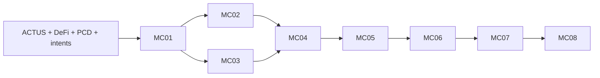

# Fable correction review 1 of at most 2
Review the corrected S2 completion program. Your initial independent review of candidate-03 was BLOCKED. Only your own findings and root dispositions are supplied; no other model verdict is supplied. This is a substantive PLAN review, not implementation approval.
Assess whether initial blockers F-01/F-02 and relevant corrections are resolved, and whether corrections introduce contradictions or weaken the seven requested outcomes. Preserve reasoned disagreement. Resource maxima do not require their full consumption; evaluate the new protected reservation/admission semantics explicitly.
Return JSON only: kind=independent-planning-audit, verdict=APPROVED or BLOCKED, candidate_sha256, findings with severity/blocking/locators/reason/correction, resolved_findings, residual_limits. Identity is verified from actual CLI metadata, not self-identification. No tools/proofs/network/model calls.

# Response to Fable planning review

Candidate-05 supersedes candidate-03; candidate-04 preserves the intermediate correction. No implementation changed.

- F-01: Partly accepted. Summing upper bounds does not prove impossibility: they are maxima, not required durations. The ambiguous allocation semantics are corrected with protected package reservations summing480min/24worker dispatches/24Preview submissions/1000tNIGHT. Planning audits reserve60min, including conservative charges for unknown earlier review timing. Dispatch must fit exact smaller command bound plus mandatory review reserves. Bundling rules and the initially expected MC01 decision frontier are explicit. No reservation promises full completion.
- F-02: Accepted. Exact29 upstream extension paths are granted to MC05/06/07 in both charter and register, with extend-and-reprove obligations. One versioned acceptance.compact entrypoint imports the mandatory-claims library. All changed versions repeat consumption/claim/effect gates; migration cannot reset live state or authorization.
- F-03: Clarified without reducing required coverage. Separate semantic277/72, native profile proof, local acceptance and Preview columns. Each required row still needs a proved supported predicate/certificate/compiler/local-acceptance link before closure. Profile theorems plus justified instantiations can cover multiple rows; representative native episodes alone are insufficient. No requirement for one monolithic circuit or one proof per fixture;349 is a cap.
- F-04: Accepted. Required source-only interface intake before native proving/MC04 dispatch; wrapper and version alignment become reviewable alternatives. Local substitution cannot close Preview without a separately authorized target change.
- F-05: Accepted. Signature-verification location and exact native bindings are required pre-freeze decisions; fee-payer signature is insufficient.
- F-06: Accepted. Required retained-successor/two-parent-join probes; separate OS users or containers with denied-read evidence.
- F-07: Accepted. Foundational numeric requirements and explicit changed-version invalidation/reproof rule added.
- F-08: Accepted. Per-row independently derived DeFi traces and explicit ANN derivation from incomplete primary/annuity definition/comparative code/fixtures required.
- F-09: Not adopted as a dependency change. Retain MC01 dependency to stabilize bounded semantic bindings; independent encoding/interface inspection already runs alongside MC01. This is an execution-order tradeoff, not a missing proof predicate.
- F-10: Accepted. Distinct principals and funding, local full mutation matrices, matching-version qualification, and protected public-submission reservations.
- F-11: Accepted. Deterministic fresh re-execution separated from retained native/chain re-verification, with explicit SRS acquisition and digest.

No earlier proof/certificate or native campaign is reused outside its exact statement scope. No budget increases or automatic contract resets.

Frozen manifest:
{
  "kind": "specified-only-plan-candidate",
  "created_at": "2026-09-07T05:07:20.362683+00:00",
  "base_commit": "b55eca82b5218b4760abd4edf6127b7c3c485514",
  "files": [
    {
      "path": "openspec/MORIARTY-COMPLETION-PROGRAM.md",
      "sha256": "d0b724dda63e13aa917147194bb94f305bb433b9056a7e93f9c14e5193fba1f4"
    },
    {
      "path": "openspec/moriarty-completion-program.json",
      "sha256": "5218a9ea77c8c552eaf645ddd0810b1c6b2839837ad3a2c0809f2f20257f6eaa"
    },
    {
      "path": "raw/assignments/moriarty-completion-loop-2026-09-07.md",
      "sha256": "3a3ea8f6e45d2c453fba3745d0fdf3bc35002b17a3548eb198bb61277ea5be0c"
    },
    {
      "path": "openspec/changes/mc01-bounded-language/README.md",
      "sha256": "6cb214b135bb06927af84ee85ee7fceaeaae7174f0d49647122669dedf630705"
    },
    {
      "path": "openspec/changes/mc01-bounded-language/design.md",
      "sha256": "557f8441a11fa1fcc19fe3e8100c76251933b64abff8ce88ff4e56ea08fb83bd"
    },
    {
      "path": "openspec/changes/mc01-bounded-language/proposal.md",
      "sha256": "2d8c087044b20abb8a4aef9a4f4f32543c02ce15856080ce9c482e11f4e3e6b0"
    },
    {
      "path": "openspec/changes/mc01-bounded-language/specs/mc01-bounded-language/spec.md",
      "sha256": "390653695228ca7e03fa4cd2fe573b02eb0d74f70384ee2fc7330db12da947ed"
    },
    {
      "path": "openspec/changes/mc01-bounded-language/tasks.md",
      "sha256": "0aa61fba145ed4b9a7642db42aa503c9f456c402fbd70cbe8dab20a9ee8e7426"
    },
    {
      "path": "openspec/changes/mc02-preview-financial-operation/README.md",
      "sha256": "17bf896435de1237b63458e1e1bf6c07215968f34c7f79fcf324f9f11d63d4f0"
    },
    {
      "path": "openspec/changes/mc02-preview-financial-operation/design.md",
      "sha256": "43a155a4fabfd9cbbdfc8303efb3400b498195dcfbf17280ff2beda04dd512f2"
    },
    {
      "path": "openspec/changes/mc02-preview-financial-operation/proposal.md",
      "sha256": "b74c2badb0023d2b10b625ba3aac6ae97e63f24a16e4a8c5f34e8cdc9940dae9"
    },
    {
      "path": "openspec/changes/mc02-preview-financial-operation/specs/mc02-preview-financial-operation/spec.md",
      "sha256": "cfd0008bee46f4746a0193248f590d0993076c98da94c024d3849320cb06da35"
    },
    {
      "path": "openspec/changes/mc02-preview-financial-operation/tasks.md",
      "sha256": "9b639a6cee3331b6dad17d441bb1bf0a7f433135276095741323406357349cba"
    },
    {
      "path": "openspec/changes/mc03-native-recursive-proof/README.md",
      "sha256": "b1428f0c440d4d1c0c4489d592c0a13e3266966cfcd85e847c3605b8c5582c9c"
    },
    {
      "path": "openspec/changes/mc03-native-recursive-proof/design.md",
      "sha256": "99852894f7345863c691a935e8a9aa4564497491c65ac46961e841c9a32c48b4"
    },
    {
      "path": "openspec/changes/mc03-native-recursive-proof/proposal.md",
      "sha256": "72edeb26a64142e0efd5492931ae2d492827d00ce09ea8ee1ca181fc5654b43c"
    },
    {
      "path": "openspec/changes/mc03-native-recursive-proof/specs/mc03-native-recursive-proof/spec.md",
      "sha256": "8646e60d369ca6086b3cef3f247a8d06d4362237f2587ca7d3cd2bfd5f0f4b4e"
    },
    {
      "path": "openspec/changes/mc03-native-recursive-proof/tasks.md",
      "sha256": "aead7a9fb6de91f35bd2e2ae07b18923452d8423022ee191154991da6df0fb67"
    },
    {
      "path": "openspec/changes/mc04-ledger-correspondence-and-consumption/README.md",
      "sha256": "8225bac494bc4a78bafef22488bd572eb4cbdc04658b5cdd1add86fa1df78692"
    },
    {
      "path": "openspec/changes/mc04-ledger-correspondence-and-consumption/design.md",
      "sha256": "4b7e8f18c47389f50735257de42a8dfdeaa73063eb21f1e732227171818d657c"
    },
    {
      "path": "openspec/changes/mc04-ledger-correspondence-and-consumption/proposal.md",
      "sha256": "4ec8f7688ebdafaf8dbdce6163a20eab0a2e0023f424efcfe99c57e834fd1c24"
    },
    {
      "path": "openspec/changes/mc04-ledger-correspondence-and-consumption/specs/mc04-ledger-correspondence-and-consumption/spec.md",
      "sha256": "bb13858f4f61c44710e17676fab930713696fafb2bd953e277687875b107ede4"
    },
    {
      "path": "openspec/changes/mc04-ledger-correspondence-and-consumption/tasks.md",
      "sha256": "5667fcd5f65d0918acead2e61e2ea74e8f4ff0776dd8139aab52fb064fea855c"
    },
    {
      "path": "openspec/changes/mc05-mandatory-claim-acceptance/README.md",
      "sha256": "d15d7f439f525b17a9d2faaf433601070eb90d169e55d3af427aa2bf61eb4858"
    },
    {
      "path": "openspec/changes/mc05-mandatory-claim-acceptance/design.md",
      "sha256": "d8035f7e17fad4d5208278b6883de95bde2b8fb68c134f776b0772aed788d57f"
    },
    {
      "path": "openspec/changes/mc05-mandatory-claim-acceptance/proposal.md",
      "sha256": "f010a84a6c2cc242491e8207006b05ccff5f3a2f03ee993b5143f3fb12a23579"
    },
    {
      "path": "openspec/changes/mc05-mandatory-claim-acceptance/specs/mc05-mandatory-claim-acceptance/spec.md",
      "sha256": "369fe04064c69d1cb0b92ec58a3ca9b00f5d7c23b6704beee95e218d6548127c"
    },
    {
      "path": "openspec/changes/mc05-mandatory-claim-acceptance/tasks.md",
      "sha256": "26e366c2f83061d7a6eb09aff377b9fdd94e6a8ee3b20b9427dcbb79310c6608"
    },
    {
      "path": "openspec/changes/mc06-private-handoff-and-composition/README.md",
      "sha256": "b360378420fb4b1387a13f71dfa808b166e5bbfd094aae97249c34916815367c"
    },
    {
      "path": "openspec/changes/mc06-private-handoff-and-composition/design.md",
      "sha256": "5572011a0696e6325aa121346ac5b056bf3a9278fb23f236e638bd2b3fc6a445"
    },
    {
      "path": "openspec/changes/mc06-private-handoff-and-composition/proposal.md",
      "sha256": "990bbf1f74d07a410d765fecbe2980a39daded033af36cc4f2cb6de9771cf99c"
    },
    {
      "path": "openspec/changes/mc06-private-handoff-and-composition/specs/mc06-private-handoff-and-composition/spec.md",
      "sha256": "0a792de65824f0edabdab251d822d0079a33d4407edfd55a857ed2f6293692a8"
    },
    {
      "path": "openspec/changes/mc06-private-handoff-and-composition/tasks.md",
      "sha256": "d1f06acdfe805bbecd43e135effa076bb7f8a15cd5b5c94357b4cf038994317a"
    },
    {
      "path": "openspec/changes/mc07-complete-financial-conformance/README.md",
      "sha256": "f2bd1bc608948dcd531eccaaaae53933f775316ec33eef7b8e5050c56925c981"
    },
    {
      "path": "openspec/changes/mc07-complete-financial-conformance/design.md",
      "sha256": "d1bb69708c9b6031f06a0d76bb0b705fa6e681ac28e291e7584f8b5a1deba15f"
    },
    {
      "path": "openspec/changes/mc07-complete-financial-conformance/proposal.md",
      "sha256": "e6238cc0da458d6e9176021d02dbf8ff84298b61c59f49cf4ff4b17bc204c78b"
    },
    {
      "path": "openspec/changes/mc07-complete-financial-conformance/specs/mc07-complete-financial-conformance/spec.md",
      "sha256": "a08630654f15c8fec9f7e9e5c072de3cf72f70851fd5098a2c1b153ef7578eb0"
    },
    {
      "path": "openspec/changes/mc07-complete-financial-conformance/tasks.md",
      "sha256": "5fac3869029ad035d752b57a5f9b2e49e06a0702a94cc4c040decf9dc50b0d19"
    },
    {
      "path": "openspec/changes/mc08-release-evidence-and-developer-flow/README.md",
      "sha256": "b9ee7882e389dddd98e6f05c3f562f88ba03e9b69c66df7752798d33b8923aa9"
    },
    {
      "path": "openspec/changes/mc08-release-evidence-and-developer-flow/design.md",
      "sha256": "3219873585b0e816069cd821418e2a8a901ef0551ab5fa800af9ca186808d5b7"
    },
    {
      "path": "openspec/changes/mc08-release-evidence-and-developer-flow/proposal.md",
      "sha256": "d413794eea9064a34b1dd7a1abff81411d47257a81334b88fea7a2b0682acb98"
    },
    {
      "path": "openspec/changes/mc08-release-evidence-and-developer-flow/specs/mc08-release-evidence-and-developer-flow/spec.md",
      "sha256": "378f8cf3be215a8b0b8b36a7b739b0a1f77923cf6271f11cd61c5d67628407fb"
    },
    {
      "path": "openspec/changes/mc08-release-evidence-and-developer-flow/tasks.md",
      "sha256": "dc65dfb405b3670d5e285ebc8ba1d7f8781596895a4e944bb293e8445884c8d6"
    }
  ],
  "candidate_sha256": "3e44de6f8d8eec542d3cca6cf549e0d4f34b8b4c0bcb38a144ed62cc242a031f",
  "predecessor": "plan-candidate-04.json"
}

--- FILE openspec/MORIARTY-COMPLETION-PROGRAM.md ---
# Moriarty target-first completion program

Status: S2, specified-only. The plan files do not establish an active execution loop.
Authority: [user request](../raw/assignments/moriarty-completion-loop-2026-09-07.md).
Machine register: [moriarty-completion-program.json](moriarty-completion-program.json).
Execution and review receipts: [program evidence](../evidence/moriarty-completion-program-2026-09-07/).

## Intended result and current foundation

Developers will author bounded financial contracts, inspect outcomes, sign authority, prove transitions, and submit them on Preview.
Acceptance must enforce contract properties, intent refinement, transition validity, and compliant predecessor history.
Every guarantee names its assumptions, supported profile, complete effects, and finite bounds.
Turing incompleteness establishes neither financial correctness nor practical proof feasibility by itself.

The retained local evaluator supports loan and swap examples with local outcome authorization.
Its nonce history is not durable, and its mandatory native proofs remain unavailable.
[Preview evidence](../evidence/midnight-preview-2026-09-07/README.md) records a finalized deployment, call, and exact message readback.
It does not record a financial transfer comparison or Moriarty PCD acceptance.
[Native R3 evidence](../evidence/moriarty-native-ivc-r3-2026-09-07/README.md) records row exhaustion at k17.
No recursive proof exists at that boundary.
The target study inventories ACTUS and DeFi; inventory is not full conformance.

## Work packages and checklist mapping

Each link contains a proposal, design, unchecked tasks, and normative acceptance scenarios.
Implementation paths and verification commands are planned entry points unless retained evidence says otherwise.

| Package | Reviewable outcome | Dependencies | Requested gap |
|---|---|---|---|
| [MC01](changes/mc01-bounded-language/README.md) | Grammar, typing, bounded semantics, canonical encoding, initial Compact lowering | Existing target study | DSL definition |
| [MC02](changes/mc02-preview-financial-operation/README.md) | Real loan and swap transfers; complete finalized effects match independent expectations | MC01 | Preview financial operation |
| [MC03](changes/mc03-native-recursive-proof/README.md) | Reviewed encoding; two recursive financial steps; independent retained-proof verification | MC01 | Native recursion |
| [MC04](changes/mc04-ledger-correspondence-and-consumption/README.md) | Proof/ledger compatibility, compiler correspondence, durable authority and consumption | MC01–MC03 | Correspondence and replay protection |
| [MC05](changes/mc05-mandatory-claim-acceptance/README.md) | All four mandatory claims enforced in actual acceptance | MC03, MC04 | Mandatory proof acceptance |
| [MC06](changes/mc06-private-handoff-and-composition/README.md) | Separate-party witness handoff; valid private split/join and residual obligations | MC05 | Handoff and composition |
| [MC07](changes/mc07-complete-financial-conformance/README.md) | Full ACTUS/DeFi and held-out behavioral coverage | MC01, MC04–MC06 | Financial conformance |
| [MC08](changes/mc08-release-evidence-and-developer-flow/README.md) | Reproducible developer workflow and independently audited completion dossier | MC01–MC07 | Combined acceptance |



The machine register contains every direct dependency; the diagram shows the main path.
Read-only compatibility inspection and conformance source-gap resolution can begin alongside MC01.
Package dependencies gate accepted implementation, not independent source inspection.
Inspect the native-to-ledger verifier interface before spending on a production adapter.
If no compatible interface exists, record the exact missing boundary and stop that adapter.
Do not replace it with a host-computed verification bit.

## Design decisions and checkpoints

Use the existing unified semantic proposal as the starting point.
Trace Core operations to financial behaviors before freezing the language profile.
Do not turn financial product names into primitive correctness claims.
Freeze the smallest common profile through MC01, then extend it through explicit reviewed versions.
Resolve foundational numeric and lifecycle ambiguities before dependent execution.
Keep unresolved target-specific source questions visible until MC07 resolves them.
Do not let an MC01 freeze exclude a required later target.

This sequence supplies early developer and financial feedback while preserving explicit proof gates.
A backend-first rewrite would postpone the target and authoring decisions that caused the prior detour.
A single full-corpus implementation would delay evidence about proof and ledger feasibility.
The selected sequence uses bounded slices, then requires full coverage before completion.

MC02 transactions are integration experiments until MC05 completes mandatory acceptance.
MC03 proves the retained financial episode under its fixed authority assumptions.
MC04 and MC05 must extend that evidence to actual authorization and ledger acceptance.
MC06 must prove its additional split/join relations; the MC03 proof cannot substitute for them.
Each extension requires a reviewed relation, valid feasible examples, and meaningful rejection controls.

Formal outputs use pinned Lean toolchains and dependencies where the package specifies Lean.
Name every theorem, input domain, assumption, and connection to executable code.
Reject `sorry`, `admit`, unchecked axioms, and assumed compiler or verifier correctness as correspondence evidence.
Record the theorem axiom audit and the remaining trusted computing base.
A successful Lean build alone does not establish the requested correspondence.

## Cross-package ownership and acceptance lineage

MC05, MC06, and MC07 own the following explicit upstream extension paths when their new predicates require changes:

- `experiments/moriarty-language/spec/grammar.ebnf`.
- `experiments/moriarty-language/spec/numeric-profile.json`.
- `experiments/moriarty-language/spec/semantics.md`.
- `experiments/moriarty-language/spec/bounds.json`.
- `experiments/moriarty-language/src/ast.ts`.
- `experiments/moriarty-language/src/parser.ts`.
- `experiments/moriarty-language/src/typecheck.ts`.
- `experiments/moriarty-language/src/elaborate.ts`.
- `experiments/moriarty-language/src/evaluate.ts`.
- `experiments/moriarty-language/src/codec.ts`.
- `experiments/moriarty-language/src/lower-compact.ts`.
- `experiments/moriarty-language/tests/frontend.test.mjs`.
- `experiments/moriarty-language/tests/semantics.test.mjs`.
- `experiments/moriarty-ledger-adapter/correspondence-spec.md`.
- `experiments/moriarty-ledger-adapter/formal/Correspondence.lean`.
- `experiments/moriarty-ledger-adapter/contracts/acceptance.compact`.
- `experiments/moriarty-ledger-adapter/src/adapter.ts`.
- `experiments/moriarty-ledger-adapter/src/consumption.ts`.
- `experiments/moriarty-ledger-adapter/src/effect-projection.ts`.
- `experiments/moriarty-ledger-adapter/tests/adapter.test.mjs`.
- `experiments/moriarty-ledger-adapter/tests/recovery.test.mjs`.
- `experiments/moriarty-acceptance/claim-policy.json`.
- `experiments/moriarty-acceptance/src/accept.ts`.
- `experiments/moriarty-acceptance/src/verify-intent.ts`.
- `experiments/moriarty-acceptance/src/certificates.ts`.
- `experiments/moriarty-acceptance/contracts/mandatory-claims.compact`.
- `experiments/moriarty-acceptance/formal/ContractProperties.lean`.
- `experiments/moriarty-acceptance/formal/IntentRefinement.lean`.
- `experiments/moriarty-acceptance/tests/acceptance.test.mjs`.

Freeze the exact changed subset in each worker brief; serialize writers of shared paths.
Keep retained native campaign sources immutable; new relation sources belong to the current package's `proof/` directory.
Requalification means extending implementation and theorem domains when semantics change, then reproving affected theorems and rerunning affected tests.
Rerunning unchanged checks suffices only when a reviewed impact analysis proves that their supported domain and bindings are unchanged.
Require both audits for changed source-to-Core, proof, complete-effect, consumption, and mandatory-acceptance predicates.
Record changed predicates as pending requalification until those gates pass; historical acceptance retains its original candidate scope.
MC07 explicitly owns compiler and acceptance extensions required by every target row; it cannot close by editing only its runner.

The deployed acceptance entry point is `experiments/moriarty-ledger-adapter/contracts/acceptance.compact` throughout MC04–MC07.
MC02 `financial.compact` is a separate uncertified integration probe and grants no mandatory-acceptance evidence.
MC05 `mandatory-claims.compact` is a library integrated into that acceptance entry point, not an alternative bypass contract.
Use lineage versions `adapter-profile-01`, `mandatory-claims-01`, `composition-01`, and `financial-coverage-01`.
Each manifest binds the deployed contract address, code hash, verifier/VK, policy, semantic version, and active entry points.
Re-run durable consumption, replay, complete-effect, and mandatory-claim predicates against every changed deployed version.
A replacement deployment must either authenticate consumption-state migration or reject every prior-version authorization under a fresh domain.
No upgrade may reset a live instance's lifecycle or make previously consumed predecessors spendable.
Bind MC06/MC07 acceptance evidence to this exact lineage; independently deployed demonstration contracts cannot substitute.

## Execution algorithm

Use a new Codex runtime goal bound to this charter and the machine register.
Never resume or falsely complete the superseded A4/A5 runtime goal.
A manifest, checkpoint, shell background process, or task list cannot establish that the runtime loop is armed.
Record the actual goal creation result and runtime state before reporting arming.

1. Recover the latest user authority and checkpoint.
2. Verify the register, candidate digests, remaining limits, and prerequisite evidence.
3. Select the first eligible unchecked task in dependency order.
4. Create an isolated implementation worktree from the accepted candidate.
5. Freeze its five-part brief, exact commands, owned paths, and terminal predicates.
6. Verify the existing Foreman runtime and required worker readiness.
7. Create the immutable external Endstop contract before the first actionful worker dispatch.
8. Dispatch through the contract-bound queue with durable process ownership.
9. Add failing behavioral tests before implementation changes.
10. Run the package checks and retain failures with actual resource receipts.
11. Request independent Fable and GPT-6 result audits of the frozen candidate.
12. Correct blocking findings within the existing contract limits.
13. Recheck affected predicates and obtain updated candidate-bound verdicts.
14. Admit only the owned, tested, audited candidate through the repository gate.
15. Update task status, evidence, source links, and the typed checkpoint.

The latest user request authorizes this sequence without another generic design-confirmation round.
It does not override a failed acceptance gate or authorize unlimited retries.
Prefer the configured cross-vendor worker after readiness succeeds.
The user-required Fable and GPT-6 audits replace the default auditor pairing for these packages.
No author may approve their own result.
If the worker route fails, retain that failure and disclose any proposed route substitution.
Do not repair Foreman as a side task.

Allowed package states are `specified-only`, `ready`, `working`, `pending-audit`, `resource-stopped`, `interface-blocked`, and `complete`.
Only recomputed acceptance and both substantive audits permit `complete`.
Independent source inspection can continue when an implementation dependency is blocked.
Stop dependent dispatch when a required audit or runtime interface is unavailable.

## Resource and terminal contract

These are ceilings, not spending targets or automatic evidence of feasibility.
Freeze concrete commands and smaller task limits before dispatch.
The external Endstop contract must enforce cumulative counters across restarts and worktrees.
Use one heavy build, proof, or conformance process group at a time.
Keep memory usage within available host capacity, even below these ceilings.

### Reservations and dispatch accounting

The following protected reservations sum to the 480-minute master ceiling and 24 worker dispatches.
Minutes include worker, verification, correction, pre-launch review, result review, native, and public-submission subprocess time.
The planning-audit bank covers the current independent plan reviews and their corrections before implementation.
Charge measured elapsed time when available; otherwise charge the review's full ten-minute bound conservatively.
Persist those debits before the first worker dispatch; unavailable historical timing never counts as zero.

| Reservation | Cumulative minutes | Worker dispatches | Preview submissions | Gross tNIGHT debit |
|---|---:|---:|---:|---:|
| Program planning audits | 60 | 0 | 0 | 0 |
| MC01 | 50 | 4 | 0 | 0 |
| MC02 | 35 | 2 | 6 | 200 |
| MC03 | 50 | 3 | 0 | 0 |
| MC04 | 50 | 3 | 6 | 200 |
| MC05 | 50 | 3 | 6 | 200 |
| MC06 | 50 | 3 | 4 | 200 |
| MC07 | 110 | 4 | 2 | 200 |
| MC08 | 25 | 2 | 0 | 0 |
| Total | 480 | 24 | 24 | 1000 |

Individual command and native-campaign ceilings below are maxima, not guaranteed reservations of their entire maximum runtime.
Effective permission is the minimum of command, campaign, package, and master remaining limits.
Reserve two ten-minute result-review slots before authorizing a package's first implementation round.
Pre-launch review and correction costs also consume that package's reservation; they cannot borrow another package's protected funds.
Freeze a command's smaller runtime bound only after a reviewed estimate supports it.
Refuse dispatch when its bound and remaining mandatory gate reserves cannot fit; do not launch hoping it finishes early.
Use one worker dispatch for a frozen bundle of adjacent tasks sharing ownership, prerequisites, and a terminal gate.
Numbered task groups are not one-dispatch requirements; each bundled task still needs its own required tests and evidence.
Do not combine dependent pre-launch review and native execution in one ungated bundle.
Interrupted or corrected worker dispatches still consume the package's dispatch allowance.
A new profile cannot reset counters or borrow another package's allocation.
Reallocation or a larger exhausted envelope requires a reviewed decision and explicit user authorization.

The initial expected planning frontier is the MC01 profile decision and early verifier/encoding feasibility evidence.
No measured estimate yet establishes full MC01 implementation, MC04 compatibility, or MC07 completion within these reservations.
Keep all eight packages in scope; report the actual reached frontier when a protected reservation stops progress.
The ledger, proof, and complete-conformance requirements remain open beyond that frontier, never silently reduced.

| Scope | Initial ceiling | Terminal condition |
|---|---|---|
| Program actionful subprocess work | 8 cumulative hours; 24 worker dispatches | Either ceiling stops new actionful dispatch |
| One worker round | 30 minutes; 8 GiB process group; 2 CPU jobs | Timeout, memory breach, or failed terminal predicate |
| One task | Initial candidate plus at most 2 justified corrections | Third failed candidate stops the task |
| One substantive audit | 10 minutes; 1 initial review plus at most 2 correction reviews per reviewer and task | Unavailable identity, timeout, exhausted credit, or exhausted rounds |
| Native revision-01 preflight | 10 cumulative minutes; 8 GiB; 2 CPU jobs; no proving | First failed encoding or fit predicate |
| Native revision-01 proving | 20 cumulative minutes; 8 GiB; 2 CPU jobs; k at most 17; 256 MiB retained outputs | First synthesis, proof, control, time, memory, or output failure |
| MC03 revision-01 positive campaign | One campaign containing exactly two original R2 loan transitions | No restart after a failed campaign |
| Public financial cases | At most 2 submissions per case; 20 minutes per attempt | Failed finality/effect gate stops that attempt |
| Program Preview submissions | At most 24 submissions, including deploys and failed submissions | No attempt-counter reset across packages |
| Test assets | At most 1,000 tNIGHT total gross external debit; 100 per case | Balance, fee, closure reserve, or denomination check fails |
| Program retained generated evidence | 2 GiB, excluding already retained dependencies/SRS | Stop before the limit; preserve failures |

Count all program worker, verification, correction, and substantive-audit process time in the eight-hour ceiling.
Maintain public-submission and gross-debit counters outside disposable worktrees.
Do not net refunds against gross debit.
Measure DUST separately in its actual units.
Freeze the maximum DUST spend and closure reserve from fresh read-only estimates before each public campaign.
Reject submission if those estimates or required token identities are unavailable.
Use the existing dedicated Preview wallet and externally stored secrets.
Never print seeds, secret snapshots, or private witnesses in tracked evidence.
Use local Docker before public attempts; make no mainnet submission.

Revision-01 is new work explicitly requested after the failed original R3 experiment.
Retain the original resource record and link it as the predecessor.
Both auditors must approve the changed encoding, complete relation, SRS, exact command, and revised contract before native launch.
Plan review alone cannot approve an encoding that has not been implemented and checked.
The k17 ceiling allows a smaller checked encoding; it does not establish that one will fit.
If k17 remains infeasible, record the decision evidence and stop.
A larger k, unallocated campaign, or exhausted terminal contract requires a new reviewed proposal and explicit user authorization.
Do not hide state in unchecked commitments or spend the original unused budget.

### Allocated native extension campaigns

The two-transition restriction applies only to MC03 revision-01.
This program permits the following extension campaigns within their protected package reservations; MC03 proofs cannot establish their predicates.
Each campaign uses owned `proof/` artifacts listed in its package design and tasks.
Each contract links its predecessor and has separate persistent counters under the common program ceiling.
All campaigns retain k at most 17, 8 GiB process-group memory, and two CPU jobs.
Each allows ten cumulative preflight minutes and 256 MiB retained outputs.
All preflight, proving, and verification time consumes the eight-hour program ceiling.
Each campaign has one frozen positive-case manifest, one bounded execution permission, and no automatic failed-campaign retry.
Both auditors must approve its implemented relation, checked encoding, exact commands, SRS, and contract before launch.
A failure stops that campaign and dependent acceptance without converting earlier proofs into extension evidence.

| Package campaign | New relation and positive evidence | Proving and retained-verification ceiling |
|---|---|---|
| MC04 adapter-profile-01 | Compiled loan and swap transition relations; at most 6 positive transitions; exact ledger verifier and complete effects | 20 cumulative minutes |
| MC05 mandatory-claims-01 | Actual contract, intent, transition, and history claims; dynamic signed authority; at most 8 positive transitions | 20 cumulative minutes |
| MC06 composition-01 | Private successor, split, two branch histories, and join; at most 8 positive transitions | 20 cumulative minutes |
| MC07 financial-coverage-01 | Required extended profiles and row-specific certificates; at most 349 positive episodes across pinned cases | 120 cumulative minutes |

MC04 first probes the retained MC03 proof interface without claiming swap or dynamic-authority correspondence.
MC04 then implements its own loan/swap relation before asserting correspondence for either supported compiled family.
MC05 proves its additional signed-authority and mandatory-claim predicates and requalifies affected MC04 correspondence.
MC06 proves composition predicates and requalifies affected acceptance and correspondence.
MC07 freezes every episode, transition count, and profile bound before dispatch.
Its episode ceiling permits coverage; it does not allow an unbounded number of transitions within one episode.
Freeze independent expected fields and invalid proof/context controls for every extended profile.
Use bounded batches when a campaign exceeds one worker round.
Each batch stays within the 30-minute worker ceiling and consumes the same persistent campaign counters.
Do not restart successful batches or replace required cases to fit the remaining budget.
The 349-episode cap is not the conformance denominator; all 277 ACTUS fixtures and 72 DeFi rows remain mandatory.
If required cases cannot fit, retain resource-stopped status and propose the next bounded decision.
No allocation guarantees circuit fit, ledger compatibility, or completion within its ceiling.

After an external failure, retry only after evidence of an external state change.
Do not poll a credit-limited model or restart an exhausted proof campaign.
Record blockers immediately; apply the runtime's three-consecutive-turn rule before marking a goal `blocked`.
Preserve completed work when a ceiling prevents full completion.

## Independent audit protocol

Required reviewers are exact `claude-fable-5-1` and a fresh `gpt-6-astra` agent.
The current request controls these eight packages; it does not close older three-provider Council obligations.
Keep prior Grok, Fable, and GPT review requirements visible in the MC08 crosswalk.

Before each audit, freeze the candidate commit, file manifest, source pins, acceptance predicates, and evidence digests.
Use a cold packet containing the relevant diff and reproducible commands.
Each reviewer works independently and receives no other review verdict before their first assessment.
Retain a structured verdict, severity, exact locators, missing evidence, and residual limitations.
The author cannot act as the independent GPT-6 reviewer.
Record tool-selected GPT-6 identity and the agent identifier; model self-identification is insufficient.

For Fable, use the installed bounded tool-free readiness canary from a temporary directory.
Require `modelUsage["claude-fable-5-1"].canonicalModel` to equal `claude-fable-5-1`.
Require the same verified identity in the substantive result receipt.
A canary, alias, authentication status, or empty model usage cannot substitute for a substantive audit.
No alternate Claude model may silently replace Fable.

Audit grammar, numeric semantics, target traceability, complete effects, proof binding, ledger enforcement, and durable consumption.
Audit private witness boundaries, composition, held-outs, provenance, and resource claims where relevant.
Reviewers must distinguish specified-only predicates from independently recomputed results.
Any unresolved blocking finding prevents acceptance.
Source changes invalidate affected reviews and checks until reviewers bind updated verdicts to the corrected candidate.
Preserve disagreements and rejected approaches with their reasons.

## Cross-package empirical decisions

Complete read-only verifier-interface inspection before any MC03 native proving or MC04 actionful dispatch.
Record source pins and formats in `evidence/moriarty-completion-program-2026-09-07/verifier-interface-intake.json`.
Distinguish a source-compatible interface from an executed positive verifier probe.
If the interface is absent, propose a checked Compact/ZKIR decider wrapper or pinned-version alignment for review.
A local-node alternative cannot discharge the Preview gate; any target change requires explicit user authorization.
Keep native feasibility and target acceptance as separate results; do not replace either with a host verification bit.

Before MC05 relation freeze, specify where signed-intent verification executes and exactly what the native circuit binds.
Compare a target-native signature check with in-circuit verification under the actual pinned verifier interface.
A transaction fee-payer signature does not authorize a different application's financial intent by itself.
The selected path must authenticate the signed intent, domain, principal, nonce, and mandatory claims before effects apply.
Unmeasured signature-circuit cost remains a preflight decision, not an assumption that Ed25519 fits k17.

Before MC06 proving, probe successor continuation from retained artifacts and a two-predecessor join at the pinned interface.
Record `interface-blocked` if either operation lacks a checked realization.
Use separate OS users or containers with separate mounts for Alice and Bob.
Record denied attempts to read predecessor secrets; two directories under one unrestricted user do not establish access isolation.
Inventory every public/private artifact crossing the handoff boundary and its recovery owner.

MC01 must define numeric representation, unit orientation, signed-value extension, intermediate widths, and per-field rounding/comparison policy shape.
Classify calendar/year-fraction and bounded convergence needs before freezing the first profile.
MC07 may fill target-specific rules, but cannot silently reinterpret signed bytes or previously proved arithmetic.
A semantic/profile change invalidates affected signatures, proofs, certificates, theorem instantiations, and audits for the new version.
Unchanged historical artifacts remain valid only for their original pinned statement and domain.
A new profile requires new evidence within the existing campaign allowances; exhaustion stops promotion.

Record semantic conformance, native-proof coverage, local target acceptance, and Preview acceptance as separate columns and denominators.
Semantic coverage still requires all 277 ACTUS fixtures/all present fields and all 72 source-defined DeFi rows.
Proof coverage may use reviewed profile theorems with explicit row-to-domain instantiations and representative real native episodes.
Every required row must map to proved supported predicates, checked certificates, compiler mapping, and local target acceptance before MC07 closes.
A representative episode alone cannot establish a universal profile theorem or leave a required row unsupported.
The 349-episode ceiling is not a requirement to generate one monolithic circuit or one native proof per reference fixture.
Use pinned local-node acceptance for full mutation matrices; freeze a minimal distinct Preview subset within package submission reservations.
Verify matching relevant ledger/proof versions and disclose every local/Preview difference; local evidence cannot close a required Preview check.
Use distinct principals for loan/swap counterparties and wrong-recipient controls, with external private key storage and explicit fixture funding.

DeFi expected traces must be independently derived from each pinned source behavior and reviewed before implementation comparison.
Record the oracle derivation, source pointer, omissions, and full expected fields for every row.
For DS-03, retain the incomplete primary formula and derive ANN initialization from the annuity definition, comparative code, and fixtures.
Require independent mathematical and fixture checks; do not describe the missing primary formula as sourced or complete.

## Completion and broader release scope

Close this program only after MC01–MC08 satisfy their actual predicates and both required result audits.
Require finalized financial effects, real recursion, mandatory acceptance, composition, complete conformance, and correspondence evidence.
Require fresh-checkout deterministic re-execution of parser, semantics, theorem, and conformance checks.
Separately re-verify retained native proof bytes and canonical chain receipts without rerunning consumed campaigns or public submissions.
Pin SRS acquisition and verify its digest before retained-proof verification; never assume an untracked SRS is present.
Require a developer demonstration using the accepted implementation and explicitly distinguish retained evidence from fresh transactions.
Do not substitute checkboxes, model approval, mock proofs, or expended resources for those results.

MC08 maps all seven requested gaps and legacy G01–G24 requirements.
Unperformed pilots, licensing work, baselines, or additional release assurances remain explicit release blockers.
Completing these seven gaps does not automatically establish production release readiness.
The final report must state the proved scope and every broader remaining blocker.


--- FILE openspec/moriarty-completion-program.json ---
{
  "schemaVersion": 1,
  "program": "moriarty-target-first-completion-2026-09-07",
  "status": "planned-not-armed",
  "authority": "raw/assignments/moriarty-completion-loop-2026-09-07.md",
  "charter": "openspec/MORIARTY-COMPLETION-PROGRAM.md",
  "runtimeGoalId": null,
  "auditModels": [
    "claude-fable-5-1",
    "gpt-6-astra"
  ],
  "packages": [
    {
      "id": "MC01",
      "change": "mc01-bounded-language",
      "dependencies": [],
      "status": "specified-only",
      "acceptance": "openspec/changes/mc01-bounded-language/specs/mc01-bounded-language/spec.md",
      "tasks": "openspec/changes/mc01-bounded-language/tasks.md",
      "evidenceRoot": "evidence/moriarty-completion-program-2026-09-07/MC01",
      "commands": [
        "npm --prefix experiments/moriarty-language ci",
        "npm --prefix experiments/moriarty-language run build",
        "npm --prefix experiments/moriarty-language test",
        "npm --prefix experiments/moriarty-developer-mock run build",
        "npm --prefix experiments/moriarty-developer-mock test"
      ]
    },
    {
      "id": "MC02",
      "change": "mc02-preview-financial-operation",
      "dependencies": [
        "MC01"
      ],
      "status": "specified-only",
      "acceptance": "openspec/changes/mc02-preview-financial-operation/specs/mc02-preview-financial-operation/spec.md",
      "tasks": "openspec/changes/mc02-preview-financial-operation/tasks.md",
      "evidenceRoot": "evidence/moriarty-completion-program-2026-09-07/MC02",
      "commands": [
        "npm --prefix experiments/moriarty-midnight-financial ci",
        "npm --prefix experiments/moriarty-midnight-financial run build",
        "npm --prefix experiments/moriarty-midnight-financial test",
        "npm --prefix experiments/moriarty-midnight-financial run preview -- --case loan --max-attempts 2",
        "npm --prefix experiments/moriarty-midnight-financial run preview -- --case swap --max-attempts 2"
      ]
    },
    {
      "id": "MC03",
      "change": "mc03-native-recursive-proof",
      "dependencies": [
        "MC01"
      ],
      "status": "specified-only",
      "acceptance": "openspec/changes/mc03-native-recursive-proof/specs/mc03-native-recursive-proof/spec.md",
      "tasks": "openspec/changes/mc03-native-recursive-proof/tasks.md",
      "evidenceRoot": "evidence/moriarty-completion-program-2026-09-07/MC03",
      "commands": [
        "python3 experiments/moriarty-native-ivc-r3/revision-01/run-reviewed.py --contract experiments/moriarty-native-ivc-r3/revision-01/resource-contract.json --preflight-only",
        "python3 experiments/moriarty-native-ivc-r3/revision-01/run-reviewed.py --contract experiments/moriarty-native-ivc-r3/revision-01/resource-contract.json --execute",
        "python3 experiments/moriarty-native-ivc-r3/revision-01/run-reviewed.py --contract experiments/moriarty-native-ivc-r3/revision-01/resource-contract.json --verify-retained"
      ]
    },
    {
      "id": "MC04",
      "change": "mc04-ledger-correspondence-and-consumption",
      "dependencies": [
        "MC01",
        "MC02",
        "MC03"
      ],
      "status": "specified-only",
      "acceptance": "openspec/changes/mc04-ledger-correspondence-and-consumption/specs/mc04-ledger-correspondence-and-consumption/spec.md",
      "tasks": "openspec/changes/mc04-ledger-correspondence-and-consumption/tasks.md",
      "evidenceRoot": "evidence/moriarty-completion-program-2026-09-07/MC04",
      "commands": [
        "npm --prefix experiments/moriarty-ledger-adapter ci",
        "npm --prefix experiments/moriarty-ledger-adapter run build",
        "npm --prefix experiments/moriarty-ledger-adapter test",
        "lake -d experiments/moriarty-ledger-adapter/formal build",
        "npm --prefix experiments/moriarty-ledger-adapter run verify-preview",
        "python3 experiments/moriarty-ledger-adapter/proof/run-reviewed.py --contract experiments/moriarty-ledger-adapter/proof/resource-contract.json --preflight-only",
        "python3 experiments/moriarty-ledger-adapter/proof/run-reviewed.py --contract experiments/moriarty-ledger-adapter/proof/resource-contract.json --execute",
        "python3 experiments/moriarty-ledger-adapter/proof/run-reviewed.py --contract experiments/moriarty-ledger-adapter/proof/resource-contract.json --verify-retained"
      ]
    },
    {
      "id": "MC05",
      "change": "mc05-mandatory-claim-acceptance",
      "dependencies": [
        "MC03",
        "MC04"
      ],
      "status": "specified-only",
      "acceptance": "openspec/changes/mc05-mandatory-claim-acceptance/specs/mc05-mandatory-claim-acceptance/spec.md",
      "tasks": "openspec/changes/mc05-mandatory-claim-acceptance/tasks.md",
      "evidenceRoot": "evidence/moriarty-completion-program-2026-09-07/MC05",
      "commands": [
        "npm --prefix experiments/moriarty-acceptance ci",
        "npm --prefix experiments/moriarty-acceptance run build",
        "npm --prefix experiments/moriarty-acceptance test",
        "lake -d experiments/moriarty-acceptance/formal build",
        "npm --prefix experiments/moriarty-acceptance run verify-preview",
        "python3 experiments/moriarty-acceptance/proof/run-reviewed.py --contract experiments/moriarty-acceptance/proof/resource-contract.json --preflight-only",
        "python3 experiments/moriarty-acceptance/proof/run-reviewed.py --contract experiments/moriarty-acceptance/proof/resource-contract.json --execute",
        "python3 experiments/moriarty-acceptance/proof/run-reviewed.py --contract experiments/moriarty-acceptance/proof/resource-contract.json --verify-retained"
      ]
    },
    {
      "id": "MC06",
      "change": "mc06-private-handoff-and-composition",
      "dependencies": [
        "MC05"
      ],
      "status": "specified-only",
      "acceptance": "openspec/changes/mc06-private-handoff-and-composition/specs/mc06-private-handoff-and-composition/spec.md",
      "tasks": "openspec/changes/mc06-private-handoff-and-composition/tasks.md",
      "evidenceRoot": "evidence/moriarty-completion-program-2026-09-07/MC06",
      "commands": [
        "npm --prefix experiments/moriarty-composition ci",
        "npm --prefix experiments/moriarty-composition run build",
        "npm --prefix experiments/moriarty-composition test",
        "lake -d experiments/moriarty-composition/formal build",
        "npm --prefix experiments/moriarty-composition run verify-isolated",
        "npm --prefix experiments/moriarty-composition run verify-preview",
        "python3 experiments/moriarty-composition/proof/run-reviewed.py --contract experiments/moriarty-composition/proof/resource-contract.json --preflight-only",
        "python3 experiments/moriarty-composition/proof/run-reviewed.py --contract experiments/moriarty-composition/proof/resource-contract.json --execute",
        "python3 experiments/moriarty-composition/proof/run-reviewed.py --contract experiments/moriarty-composition/proof/resource-contract.json --verify-retained"
      ]
    },
    {
      "id": "MC07",
      "change": "mc07-complete-financial-conformance",
      "dependencies": [
        "MC01",
        "MC04",
        "MC05",
        "MC06"
      ],
      "status": "specified-only",
      "acceptance": "openspec/changes/mc07-complete-financial-conformance/specs/mc07-complete-financial-conformance/spec.md",
      "tasks": "openspec/changes/mc07-complete-financial-conformance/tasks.md",
      "evidenceRoot": "evidence/moriarty-completion-program-2026-09-07/MC07",
      "commands": [
        "npm --prefix experiments/moriarty-conformance ci",
        "npm --prefix experiments/moriarty-conformance run build",
        "npm --prefix experiments/moriarty-conformance test",
        "npm --prefix experiments/moriarty-conformance run actus -- --all --all-fields",
        "npm --prefix experiments/moriarty-conformance run defi -- --all-rows",
        "npm --prefix experiments/moriarty-conformance run verify-coverage",
        "python3 experiments/moriarty-conformance/proof/run-reviewed.py --contract experiments/moriarty-conformance/proof/resource-contract.json --preflight-only",
        "python3 experiments/moriarty-conformance/proof/run-reviewed.py --contract experiments/moriarty-conformance/proof/resource-contract.json --execute",
        "python3 experiments/moriarty-conformance/proof/run-reviewed.py --contract experiments/moriarty-conformance/proof/resource-contract.json --verify-retained"
      ]
    },
    {
      "id": "MC08",
      "change": "mc08-release-evidence-and-developer-flow",
      "dependencies": [
        "MC01",
        "MC02",
        "MC03",
        "MC04",
        "MC05",
        "MC06",
        "MC07"
      ],
      "status": "specified-only",
      "acceptance": "openspec/changes/mc08-release-evidence-and-developer-flow/specs/mc08-release-evidence-and-developer-flow/spec.md",
      "tasks": "openspec/changes/mc08-release-evidence-and-developer-flow/tasks.md",
      "evidenceRoot": "evidence/moriarty-completion-program-2026-09-07/MC08",
      "commands": [
        "npm --prefix experiments/moriarty-release-check ci",
        "npm --prefix experiments/moriarty-release-check run build",
        "npm --prefix experiments/moriarty-release-check test",
        "npm --prefix experiments/moriarty-release-check run verify -- --program openspec/moriarty-completion-program.json"
      ]
    }
  ],
  "resourceReservations": {
    "planningAudits": {
      "minutes": 60,
      "workerDispatches": 0,
      "previewSubmissions": 0,
      "grossTNight": 0
    },
    "MC01": {
      "minutes": 50,
      "workerDispatches": 4,
      "previewSubmissions": 0,
      "grossTNight": 0
    },
    "MC02": {
      "minutes": 35,
      "workerDispatches": 2,
      "previewSubmissions": 6,
      "grossTNight": 200
    },
    "MC03": {
      "minutes": 50,
      "workerDispatches": 3,
      "previewSubmissions": 0,
      "grossTNight": 0
    },
    "MC04": {
      "minutes": 50,
      "workerDispatches": 3,
      "previewSubmissions": 6,
      "grossTNight": 200
    },
    "MC05": {
      "minutes": 50,
      "workerDispatches": 3,
      "previewSubmissions": 6,
      "grossTNight": 200
    },
    "MC06": {
      "minutes": 50,
      "workerDispatches": 3,
      "previewSubmissions": 4,
      "grossTNight": 200
    },
    "MC07": {
      "minutes": 110,
      "workerDispatches": 4,
      "previewSubmissions": 2,
      "grossTNight": 200
    },
    "MC08": {
      "minutes": 25,
      "workerDispatches": 2,
      "previewSubmissions": 0,
      "grossTNight": 0
    }
  },
  "resourceAdmission": "Command/campaign caps are bounded permissions, not full reserved runtimes. Package reservations are protected; reserve both result audits and fit command/pre-launch gates before dispatch.",
  "extensionOwnership": {
    "packages": [
      "MC05",
      "MC06",
      "MC07"
    ],
    "pathsAuthority": "openspec/MORIARTY-COMPLETION-PROGRAM.md#cross-package-ownership-and-acceptance-lineage",
    "rule": "Freeze exact upstream path subset, serialize writers, extend-and-reprove changed domains, re-audit affected predicates.",
    "paths": [
      "experiments/moriarty-language/spec/grammar.ebnf",
      "experiments/moriarty-language/spec/numeric-profile.json",
      "experiments/moriarty-language/spec/semantics.md",
      "experiments/moriarty-language/spec/bounds.json",
      "experiments/moriarty-language/src/ast.ts",
      "experiments/moriarty-language/src/parser.ts",
      "experiments/moriarty-language/src/typecheck.ts",
      "experiments/moriarty-language/src/elaborate.ts",
      "experiments/moriarty-language/src/evaluate.ts",
      "experiments/moriarty-language/src/codec.ts",
      "experiments/moriarty-language/src/lower-compact.ts",
      "experiments/moriarty-language/tests/frontend.test.mjs",
      "experiments/moriarty-language/tests/semantics.test.mjs",
      "experiments/moriarty-ledger-adapter/correspondence-spec.md",
      "experiments/moriarty-ledger-adapter/formal/Correspondence.lean",
      "experiments/moriarty-ledger-adapter/contracts/acceptance.compact",
      "experiments/moriarty-ledger-adapter/src/adapter.ts",
      "experiments/moriarty-ledger-adapter/src/consumption.ts",
      "experiments/moriarty-ledger-adapter/src/effect-projection.ts",
      "experiments/moriarty-ledger-adapter/tests/adapter.test.mjs",
      "experiments/moriarty-ledger-adapter/tests/recovery.test.mjs",
      "experiments/moriarty-acceptance/claim-policy.json",
      "experiments/moriarty-acceptance/src/accept.ts",
      "experiments/moriarty-acceptance/src/verify-intent.ts",
      "experiments/moriarty-acceptance/src/certificates.ts",
      "experiments/moriarty-acceptance/contracts/mandatory-claims.compact",
      "experiments/moriarty-acceptance/formal/ContractProperties.lean",
      "experiments/moriarty-acceptance/formal/IntentRefinement.lean",
      "experiments/moriarty-acceptance/tests/acceptance.test.mjs"
    ]
  },
  "acceptanceLineage": {
    "entrypoint": "experiments/moriarty-ledger-adapter/contracts/acceptance.compact",
    "versions": [
      "adapter-profile-01",
      "mandatory-claims-01",
      "composition-01",
      "financial-coverage-01"
    ],
    "mandatoryClaimsLibrary": "experiments/moriarty-acceptance/contracts/mandatory-claims.compact",
    "uncertifiedIntegrationContract": "experiments/moriarty-midnight-financial/contracts/financial.compact"
  }
}


--- FILE raw/assignments/moriarty-completion-loop-2026-09-07.md ---
# Moriarty completion plans and execution authority

Source: user message in the active Codex conversation.
Recorded: 2026-09-07 UTC (2026-09-06 America/Denver).
Authority: normative user instruction. Lifecycle: S2 planning and execution authorization.
This record preserves the request; it does not establish implementation or audit completion.

## Exact request

> draft an series of openspec plans to resolve all of these and then arm a loop to execute, use fable and gpt 6 to audit the results   - [ ] Next: run a bounded financial operation on Preview and compare its finalized effects with the local evaluator.
>   - [ ] Finalize the DSL’s authoring syntax, typing rules, semantics, and compiler mapping.
>   - [ ] Produce a real native recursive proof. Blocked: the current R3 experiment exhausted rows at k17; review the encoding/resource
>     decision before restarting.
>
>   - [ ] Enforce contract properties, intent refinement, transition validity, and predecessor-history compliance in the actual acceptance
>     path.
>
>   - [ ] Demonstrate private witness handoff and split/join composition.
>   - [ ] Complete ACTUS/DeFi conformance coverage, including the held-out financial cases.
>   - [ ] Establish compiler-to-ledger correspondence and durable authorization/replay protection.

## Scope reconciliation

This request authorizes plans followed by execution within their recorded limits.
It retains the ACTUS/DeFi target-first reset and Preview steering.
It does not resume historical A4/A5 work or authorize Foreman development.
Fable and GPT-6 are the required auditors for this new program.
Older Council evidence and unresolved release requirements remain preserved.


--- FILE openspec/changes/mc01-bounded-language/README.md ---
# MC01: Bounded language and semantic contract

Status: specified-only.

- [Proposal](proposal.md)
- [Design](design.md)
- [Requirements](specs/mc01-bounded-language/spec.md)
- [Tasks](tasks.md)
- [Program charter](../../MORIARTY-COMPLETION-PROGRAM.md)


--- FILE openspec/changes/mc01-bounded-language/design.md ---
# Design: Bounded language and semantic contract

## Inputs and dependencies

Dependencies: Existing approved target-first design and retained evidence.

- `docs/superpowers/specs/2026-09-06-moriarty-unified-semantics-design.md`
- `docs/research/2026-09-06-intents-report-integration.md`
- `experiments/moriarty-developer-mock/src/language/core.ts`
- `experiments/moriarty-developer-mock/src/language/outcome.ts`

## Interfaces

parse(source) -> Result<AgreementAST, Diagnostic[]>; check(ast, profile) -> Result<TypedAgreement, Diagnostic[]>; elaborate(typed) -> CoreProgram; evaluate(program, state, action, authority, observations) -> Rejected | Complete | Pending. All wire encodings carry schema and semantic versions.

## Outputs and ownership

- `experiments/moriarty-language/spec/grammar.ebnf`
- `experiments/moriarty-language/spec/numeric-profile.json`
- `experiments/moriarty-language/spec/semantics.md`
- `experiments/moriarty-language/spec/bounds.json`
- `experiments/moriarty-language/src/ast.ts`
- `experiments/moriarty-language/src/parser.ts`
- `experiments/moriarty-language/src/typecheck.ts`
- `experiments/moriarty-language/src/elaborate.ts`
- `experiments/moriarty-language/src/evaluate.ts`
- `experiments/moriarty-language/src/codec.ts`
- `experiments/moriarty-language/src/lower-compact.ts`
- `experiments/moriarty-language/src/errors.ts`
- `experiments/moriarty-language/examples/loan.moriarty`
- `experiments/moriarty-language/examples/swap.moriarty`
- `experiments/moriarty-language/tests/frontend.test.mjs`
- `experiments/moriarty-language/tests/semantics.test.mjs`
- `experiments/moriarty-language/package.json`

## Trust boundaries

Treat source text, solvers, indexers, remote provers, generated code, and supplied receipts as untrusted inputs.
Keep oracle truth, ledger uniqueness, semantic validity, and confidentiality claims separate.
Bind all outputs to the semantic profile and the exact implementation candidate.

## Decisions and failures

Use the shared bounded Core rather than financial family names as primitive proof claims.
Preserve complete effects and positive feasibility when refining an adapter.
Record a concrete changed hypothesis before any correction.
Stop a dependent package when its prerequisite fails.
Do not reset exhausted contracts or replace a missing proof with a mock.

## Execution contract

Status: S2, specified-only. No implementation task is complete by this plan's existence.
The program charter in `openspec/MORIARTY-COMPLETION-PROGRAM.md` controls execution and audit gates.
Every behavioral implementation task requires a failing test before code changes.
Each acceptance predicate requires an independently recomputable result.
Each result audit requires exact Fable and fresh GPT-6 identities.
Source-only review does not prove the implemented predicate.
Missing evidence, incompatible interfaces, resource stops, and unavailable audits remain explicit blockers.
Keep unrelated changes, old failed runs, and private wallet material intact.


--- FILE openspec/changes/mc01-bounded-language/proposal.md ---
# Change: Bounded language and semantic contract

## Why

Define and implement the Moriarty authoring language over a finite typed Core.
The current local prototypes and network receipts do not satisfy this package's terminal predicate.

## What Changes

- Freeze the language profile.
- Implement the frontend.
- Implement semantic elaboration.
- Implement the initial Compact mapping.

## Impact

- `experiments/moriarty-language/spec/grammar.ebnf`
- `experiments/moriarty-language/spec/numeric-profile.json`
- `experiments/moriarty-language/spec/semantics.md`
- `experiments/moriarty-language/spec/bounds.json`
- `experiments/moriarty-language/src/ast.ts`
- `experiments/moriarty-language/src/parser.ts`
- `experiments/moriarty-language/src/typecheck.ts`
- `experiments/moriarty-language/src/elaborate.ts`
- `experiments/moriarty-language/src/evaluate.ts`
- `experiments/moriarty-language/src/codec.ts`
- `experiments/moriarty-language/src/lower-compact.ts`
- `experiments/moriarty-language/src/errors.ts`
- `experiments/moriarty-language/examples/loan.moriarty`
- `experiments/moriarty-language/examples/swap.moriarty`
- `experiments/moriarty-language/tests/frontend.test.mjs`
- `experiments/moriarty-language/tests/semantics.test.mjs`
- `experiments/moriarty-language/package.json`
- `evidence/moriarty-completion-program-2026-09-07/MC01/`

## Non-goals

No A4/A5 continuation, mainnet funds, new consensus, or Foreman repair belongs to this package.
No downstream requirement becomes complete from this package's narrower result.

## Execution contract

Status: S2, specified-only. No implementation task is complete by this plan's existence.
The program charter in `openspec/MORIARTY-COMPLETION-PROGRAM.md` controls execution and audit gates.
Every behavioral implementation task requires a failing test before code changes.
Each acceptance predicate requires an independently recomputable result.
Each result audit requires exact Fable and fresh GPT-6 identities.
Source-only review does not prove the implemented predicate.
Missing evidence, incompatible interfaces, resource stops, and unavailable audits remain explicit blockers.
Keep unrelated changes, old failed runs, and private wallet material intact.


--- FILE openspec/changes/mc01-bounded-language/specs/mc01-bounded-language/spec.md ---
## ADDED Requirements

### Requirement: Defined authoring and canonical representation
The frontend SHALL define grammar, units, asset domains, typing, diagnostics, canonical bytes, and versioned elaboration.

#### Scenario: Valid loan and swap programs
- **WHEN** the frontend receives valid loan and swap source programs
- **THEN** both parse, typecheck, elaborate, roundtrip canonically, and match independent expected evaluator traces.

#### Scenario: Invalid authoring
- **WHEN** source contains recursion, ambiguous assets, unbounded collections, malformed encodings, or unsupported operations
- **THEN** the frontend rejects it before signing and reports the source location.

### Requirement: Finite semantic work
Every execution SHALL have explicit arithmetic, allocation, schedule, horizon, nesting, fold, transaction, proof-size, and predecessor bounds.

#### Scenario: Finite closure
- **WHEN** an execution follows ordinary work, pending progress, closure, or bounded epoch migration
- **THEN** each transition decreases the declared lifecycle measure and respects every declared local bound.

#### Scenario: Bound evasion
- **WHEN** a transition overflows, exhausts work, leaves intermediate arithmetic unchecked, or resets a continuation budget
- **THEN** the evaluator and proof relation reject that transition.

### Requirement: Target-driven semantic freeze
Every Core operation SHALL trace to an ACTUS behavior, DeFi behavior, or explicit developer requirement.

#### Scenario: Supported profile
- **WHEN** loan and swap source programs elaborate into Core
- **THEN** dues and settlement remain distinct, and gross debit and net delivery checks match independent expected effects.

#### Scenario: Taxonomy shortcut
- **WHEN** a proposed Core operation cites only a financial family label or convenient numeric tolerance
- **THEN** the semantic-freeze gate rejects that unsupported operation.

### Requirement: Independent audit and provenance
The package SHALL bind acceptance evidence to exact sources, commands, environment, outputs, and both required audit identities.

#### Scenario: Audited result
- **WHEN** deterministic checks pass and both independent reviewers have no unresolved blocking finding
- **THEN** the package records accepted scope with the exact reviewed candidate digest.

#### Scenario: Missing or stale audit
- **WHEN** Fable or GPT-6 is unavailable, substituted, stale, or lacks a substantive identity-bound verdict
- **THEN** the package remains pending audit and cannot promote dependent acceptance.

### Requirement: Failed predicate stops promotion
The package SHALL remain incomplete if any required positive or rejection predicate fails.

#### Scenario: Negative control incorrectly accepts
- **WHEN** a required invalid input is accepted or its rejection lacks evidence
- **THEN** verification fails and dependent acceptance remains blocked.


--- FILE openspec/changes/mc01-bounded-language/tasks.md ---
# Tasks: Bounded language and semantic contract

Status: specified-only. All implementation tasks remain unchecked.

**Goal:** Define and implement the Moriarty authoring language over a finite typed Core.

**Dependencies:** Program charter.

**Implementation root:** `experiments/moriarty-language/`.

**Interfaces:** parse(source) -> Result<AgreementAST, Diagnostic[]>; check(ast, profile) -> Result<TypedAgreement, Diagnostic[]>; elaborate(typed) -> CoreProgram; evaluate(program, state, action, authority, observations) -> Rejected | Complete | Pending. All wire encodings carry schema and semantic versions.

## 1. Freeze the language profile

- [ ] 1.1 Write the grammar, numeric profile, transition judgments, and bounds. Classify DS-01 through DS-07 dependencies. Resolve foundational ambiguities before freezing; retain target-specific gaps for MC07.
- [ ] 1.2 Review traceability against the complete target matrices. Require both named auditors before freezing this profile.
- [ ] 1.3 Preserve the failing result and the corrected result with source hashes.
- [ ] 1.4 Commit only owned changes in an isolated implementation worktree.

## 2. Implement the frontend

- [ ] 2.1 Add positive roundtrip fixtures and negative syntax/type/bounds tests before parser and checker changes. Implement canonical AST and diagnostics.
- [ ] 2.2 Run the frontend suite, including source-location and canonical-encoding mutations.
- [ ] 2.3 Preserve the failing result and the corrected result with source hashes.
- [ ] 2.4 Commit only owned changes in an isolated implementation worktree.

## 3. Implement semantic elaboration

- [ ] 3.1 Add independent loan/swap expected traces before implementing elaboration and evaluation. Preserve exact-plan and outcome modes.
- [ ] 3.2 Compare every state field, obligation, authority delta, and effect against the existing evaluator.
- [ ] 3.3 Preserve the failing result and the corrected result with source hashes.
- [ ] 3.4 Commit only owned changes in an isolated implementation worktree.

## 4. Implement the initial Compact mapping

- [ ] 4.1 Specify representable Core operations and rejection diagnostics. Add local lowering tests and source maps.
- [ ] 4.2 Compile generated supported examples. Record unsupported mappings as failures; do not claim general correspondence.
- [ ] 4.3 Preserve the failing result and the corrected result with source hashes.
- [ ] 4.4 Commit only owned changes in an isolated implementation worktree.

## D. Required decision intake

- [ ] D.1 Define foundational numeric and extension requirements before freezing the first profile.
- [ ] D.2 Classify profile-version changes and their signature, proof, theorem, and audit invalidation rules.

## Verification commands

The implementation tasks create these entry points. They are not currently passing commands.
Each command requires exit 0 and the package-specific positive and negative predicates.
Commands alone cannot certify properties outside their declared scope.

```sh
npm --prefix experiments/moriarty-language ci
npm --prefix experiments/moriarty-language run build
npm --prefix experiments/moriarty-language test
npm --prefix experiments/moriarty-developer-mock run build
npm --prefix experiments/moriarty-developer-mock test
```

## Package closure

- [ ] 5.1 Write `evidence/moriarty-completion-program-2026-09-07/MC01/manifest.json`.
- [ ] 5.2 Bind inputs, outputs, commands, resource receipts, and the exact candidate digest.
- [ ] 5.3 Obtain independent Fable and GPT-6 result audits under the program protocol.
- [ ] 5.4 Resolve every blocking finding without widening the accepted predicate.
- [ ] 5.5 Recompute acceptance and update the program register.

## Execution contract

Status: S2, specified-only. No implementation task is complete by this plan's existence.
The program charter in `openspec/MORIARTY-COMPLETION-PROGRAM.md` controls execution and audit gates.
Every behavioral implementation task requires a failing test before code changes.
Each acceptance predicate requires an independently recomputable result.
Each result audit requires exact Fable and fresh GPT-6 identities.
Source-only review does not prove the implemented predicate.
Missing evidence, incompatible interfaces, resource stops, and unavailable audits remain explicit blockers.
Keep unrelated changes, old failed runs, and private wallet material intact.


--- FILE openspec/changes/mc02-preview-financial-operation/README.md ---
# MC02: Preview financial operation and differential settlement

Status: specified-only.

- [Proposal](proposal.md)
- [Design](design.md)
- [Requirements](specs/mc02-preview-financial-operation/spec.md)
- [Tasks](tasks.md)
- [Program charter](../../MORIARTY-COMPLETION-PROGRAM.md)


--- FILE openspec/changes/mc02-preview-financial-operation/design.md ---
# Design: Preview financial operation and differential settlement

## Inputs and dependencies

Dependencies: MC01.

- `experiments/moriarty-developer-mock/src/language/core.ts`
- `experiments/moriarty-midnight-network/preview-call.mjs`
- `experiments/moriarty-midnight-network/preview-verify.mjs`
- `evidence/midnight-preview-2026-09-07/README.md`

## Interfaces

FinancialRunInput binds program, initial state, bounded action, authority, observations, and explicit test-asset mapping. DifferentialReceipt binds local expected trace, complete observed ledger effects, transaction identifier, block hash, finality, and readback.

## Outputs and ownership

- `experiments/moriarty-midnight-financial/fixtures/loan-preview.json`
- `experiments/moriarty-midnight-financial/fixtures/swap-preview.json`
- `experiments/moriarty-midnight-financial/asset-mapping.json`
- `experiments/moriarty-midnight-financial/contracts/financial.compact`
- `experiments/moriarty-midnight-financial/src/run-preview.ts`
- `experiments/moriarty-midnight-financial/src/compare-effects.ts`
- `experiments/moriarty-midnight-financial/tests/differential.test.mjs`
- `experiments/moriarty-midnight-financial/package.json`

## Trust boundaries

Treat source text, solvers, indexers, remote provers, generated code, and supplied receipts as untrusted inputs.
Keep oracle truth, ledger uniqueness, semantic validity, and confidentiality claims separate.
Bind all outputs to the semantic profile and the exact implementation candidate.

## Decisions and failures

Use the shared bounded Core rather than financial family names as primitive proof claims.
Preserve complete effects and positive feasibility when refining an adapter.
Record a concrete changed hypothesis before any correction.
Stop a dependent package when its prerequisite fails.
Do not reset exhausted contracts or replace a missing proof with a mock.

## Execution contract

Status: S2, specified-only. No implementation task is complete by this plan's existence.
The program charter in `openspec/MORIARTY-COMPLETION-PROGRAM.md` controls execution and audit gates.
Every behavioral implementation task requires a failing test before code changes.
Each acceptance predicate requires an independently recomputable result.
Each result audit requires exact Fable and fresh GPT-6 identities.
Source-only review does not prove the implemented predicate.
Missing evidence, incompatible interfaces, resource stops, and unavailable audits remain explicit blockers.
Keep unrelated changes, old failed runs, and private wallet material intact.


--- FILE openspec/changes/mc02-preview-financial-operation/proposal.md ---
# Change: Preview financial operation and differential settlement

## Why

Settle bounded loan and swap examples on Preview and compare all effects with independent local expectations.
The current local prototypes and network receipts do not satisfy this package's terminal predicate.

## What Changes

- Freeze feasible test fixtures.
- Implement differential local tests.
- Run the bounded Preview campaign.
- Reconcile integration evidence.

## Impact

- `experiments/moriarty-midnight-financial/fixtures/loan-preview.json`
- `experiments/moriarty-midnight-financial/fixtures/swap-preview.json`
- `experiments/moriarty-midnight-financial/asset-mapping.json`
- `experiments/moriarty-midnight-financial/contracts/financial.compact`
- `experiments/moriarty-midnight-financial/src/run-preview.ts`
- `experiments/moriarty-midnight-financial/src/compare-effects.ts`
- `experiments/moriarty-midnight-financial/tests/differential.test.mjs`
- `experiments/moriarty-midnight-financial/package.json`
- `evidence/moriarty-completion-program-2026-09-07/MC02/`

## Non-goals

No A4/A5 continuation, mainnet funds, new consensus, or Foreman repair belongs to this package.
No downstream requirement becomes complete from this package's narrower result.

## Execution contract

Status: S2, specified-only. No implementation task is complete by this plan's existence.
The program charter in `openspec/MORIARTY-COMPLETION-PROGRAM.md` controls execution and audit gates.
Every behavioral implementation task requires a failing test before code changes.
Each acceptance predicate requires an independently recomputable result.
Each result audit requires exact Fable and fresh GPT-6 identities.
Source-only review does not prove the implemented predicate.
Missing evidence, incompatible interfaces, resource stops, and unavailable audits remain explicit blockers.
Keep unrelated changes, old failed runs, and private wallet material intact.


--- FILE openspec/changes/mc02-preview-financial-operation/specs/mc02-preview-financial-operation/spec.md ---
## ADDED Requirements

### Requirement: Explicit financial meaning
The experiment SHALL distinguish contractual denomination, test-token identity, dues, and actual transferred value.

#### Scenario: Feasible funded episode
- **WHEN** the dedicated wallet executes the frozen small loan fixture with its explicit asset mapping
- **THEN** real supported ledger assets move, contractual dues update correctly, and independent expected values match.

#### Scenario: Fictitious settlement
- **WHEN** a result supplies only a message update, synthetic balance field, or undisclosed currency conversion
- **THEN** the financial-settlement gate rejects it as transfer evidence.

### Requirement: Independent complete comparison
The checker SHALL compare complete local financial effects with finalized Preview effects and contract state.

#### Scenario: Two target families
- **WHEN** the generated loan and pool-swap programs settle on Preview
- **THEN** complete effects and state match local expectations, with indexed success, canonical finality, and exact readback.

#### Scenario: Partial comparison
- **WHEN** observed effects contain a wrong recipient, wrong domain, excess fee, missing debit, extra approval, or undeclared write
- **THEN** the complete-effect comparator rejects the result.

### Requirement: Integration scope
This package SHALL label its transactions uncertified until MC05 enforces all mandatory claims.

#### Scenario: Honest integration result
- **WHEN** MC02 produces a valid financial integration receipt before MC05 acceptance
- **THEN** the receipt names the financial predicate and marks mandatory proof claims unavailable.

#### Scenario: Promotion shortcut
- **WHEN** network success is offered as evidence of history compliance or compiler correspondence
- **THEN** the package gate rejects the unsupported proof claim.

### Requirement: Independent audit and provenance
The package SHALL bind acceptance evidence to exact sources, commands, environment, outputs, and both required audit identities.

#### Scenario: Audited result
- **WHEN** deterministic checks pass and both independent reviewers have no unresolved blocking finding
- **THEN** the package records accepted scope with the exact reviewed candidate digest.

#### Scenario: Missing or stale audit
- **WHEN** Fable or GPT-6 is unavailable, substituted, stale, or lacks a substantive identity-bound verdict
- **THEN** the package remains pending audit and cannot promote dependent acceptance.

### Requirement: Failed predicate stops promotion
The package SHALL remain incomplete if any required positive or rejection predicate fails.

#### Scenario: Negative control incorrectly accepts
- **WHEN** a required invalid input is accepted or its rejection lacks evidence
- **THEN** verification fails and dependent acceptance remains blocked.


--- FILE openspec/changes/mc02-preview-financial-operation/tasks.md ---
# Tasks: Preview financial operation and differential settlement

Status: specified-only. All implementation tasks remain unchecked.

**Goal:** Settle bounded loan and swap examples on Preview and compare all effects with independent local expectations.

**Dependencies:** MC01.

**Implementation root:** `experiments/moriarty-midnight-financial/`.

**Interfaces:** FinancialRunInput binds program, initial state, bounded action, authority, observations, and explicit test-asset mapping. DifferentialReceipt binds local expected trace, complete observed ledger effects, transaction identifier, block hash, finality, and readback.

## 1. Freeze feasible test fixtures

- [ ] 1.1 Derive small loan and swap cases from existing packages. Pin denomination and token mappings. Reserve closure costs.
- [ ] 1.2 Check independent expected values and the available dedicated test balance before public work.
- [ ] 1.3 Preserve the failing result and the corrected result with source hashes.
- [ ] 1.4 Commit only owned changes in an isolated implementation worktree.

## 2. Implement differential local tests

- [ ] 2.1 Write local expected-effect and adverse-effect tests first. Implement generated Compact financial entry points and complete effect decoding.
- [ ] 2.2 Run positive and negative comparisons against local Docker before public submission.
- [ ] 2.3 Preserve the failing result and the corrected result with source hashes.
- [ ] 2.4 Commit only owned changes in an isolated implementation worktree.

## 3. Run the bounded Preview campaign

- [ ] 3.1 Use the existing Preview wallet. Preserve keys externally. Retain before-state, transaction bytes, all effects, and failed attempts.
- [ ] 3.2 Submit at most two public attempts per case. Require indexed SUCCESS, canonical node finality, and exact readback.
- [ ] 3.3 Preserve the failing result and the corrected result with source hashes.
- [ ] 3.4 Commit only owned changes in an isolated implementation worktree.

## 4. Reconcile integration evidence

- [ ] 4.1 Record actual commands, pins, source hashes, resource use, and the funded asset domain.
- [ ] 4.2 Require independent expected results and both audit verdicts before closing this integration package.
- [ ] 4.3 Preserve the failing result and the corrected result with source hashes.
- [ ] 4.4 Commit only owned changes in an isolated implementation worktree.

## D. Required decision intake

- [ ] D.1 Freeze distinct counterparty identities, funding, complete effects, and the package submission reservation.

## Verification commands

The implementation tasks create these entry points. They are not currently passing commands.
Each command requires exit 0 and the package-specific positive and negative predicates.
Commands alone cannot certify properties outside their declared scope.

```sh
npm --prefix experiments/moriarty-midnight-financial ci
npm --prefix experiments/moriarty-midnight-financial run build
npm --prefix experiments/moriarty-midnight-financial test
npm --prefix experiments/moriarty-midnight-financial run preview -- --case loan --max-attempts 2
npm --prefix experiments/moriarty-midnight-financial run preview -- --case swap --max-attempts 2
```

## Package closure

- [ ] 5.1 Write `evidence/moriarty-completion-program-2026-09-07/MC02/manifest.json`.
- [ ] 5.2 Bind inputs, outputs, commands, resource receipts, and the exact candidate digest.
- [ ] 5.3 Obtain independent Fable and GPT-6 result audits under the program protocol.
- [ ] 5.4 Resolve every blocking finding without widening the accepted predicate.
- [ ] 5.5 Recompute acceptance and update the program register.

## Execution contract

Status: S2, specified-only. No implementation task is complete by this plan's existence.
The program charter in `openspec/MORIARTY-COMPLETION-PROGRAM.md` controls execution and audit gates.
Every behavioral implementation task requires a failing test before code changes.
Each acceptance predicate requires an independently recomputable result.
Each result audit requires exact Fable and fresh GPT-6 identities.
Source-only review does not prove the implemented predicate.
Missing evidence, incompatible interfaces, resource stops, and unavailable audits remain explicit blockers.
Keep unrelated changes, old failed runs, and private wallet material intact.


--- FILE openspec/changes/mc03-native-recursive-proof/README.md ---
# MC03: Reviewed native encoding and recursive proof

Status: specified-only.

- [Proposal](proposal.md)
- [Design](design.md)
- [Requirements](specs/mc03-native-recursive-proof/spec.md)
- [Tasks](tasks.md)
- [Program charter](../../MORIARTY-COMPLETION-PROGRAM.md)


--- FILE openspec/changes/mc03-native-recursive-proof/design.md ---
# Design: Reviewed native encoding and recursive proof

## Inputs and dependencies

Dependencies: MC01.

- `experiments/moriarty-native-ivc-r3/README.md`
- `experiments/moriarty-native-ivc-r3/harness/moriarty_loan_r3.rs`
- `experiments/moriarty-native-ivc-r3/run-native.py`
- `evidence/moriarty-native-ivc-r3-2026-09-07/README.md`

## Interfaces

NativeEpisode binds the original R2 financial episode, all public contexts, fixed authority scope, and the remaining lifecycle bound. ProofArtifact binds proof bytes, VK, SRS, backend pin, statement encoding, and final accumulator verification.

## Outputs and ownership

- `experiments/moriarty-native-ivc-r3/revision-01/encoding-decision.md`
- `experiments/moriarty-native-ivc-r3/revision-01/relation-spec.md`
- `experiments/moriarty-native-ivc-r3/revision-01/encoding-fixtures.json`
- `experiments/moriarty-native-ivc-r3/revision-01/resource-contract.json`
- `experiments/moriarty-native-ivc-r3/revision-01/harness.rs`
- `experiments/moriarty-native-ivc-r3/revision-01/verify-retained.rs`
- `experiments/moriarty-native-ivc-r3/revision-01/tests/encoding-controls.rs`
- `experiments/moriarty-native-ivc-r3/revision-01/run-reviewed.py`

## Trust boundaries

Treat source text, solvers, indexers, remote provers, generated code, and supplied receipts as untrusted inputs.
Keep oracle truth, ledger uniqueness, semantic validity, and confidentiality claims separate.
Bind all outputs to the semantic profile and the exact implementation candidate.

## Decisions and failures

Use the shared bounded Core rather than financial family names as primitive proof claims.
Preserve complete effects and positive feasibility when refining an adapter.
Record a concrete changed hypothesis before any correction.
Stop a dependent package when its prerequisite fails.
Do not reset exhausted contracts or replace a missing proof with a mock.

## Execution contract

Status: S2, specified-only. No implementation task is complete by this plan's existence.
The program charter in `openspec/MORIARTY-COMPLETION-PROGRAM.md` controls execution and audit gates.
Every behavioral implementation task requires a failing test before code changes.
Each acceptance predicate requires an independently recomputable result.
Each result audit requires exact Fable and fresh GPT-6 identities.
Source-only review does not prove the implemented predicate.
Missing evidence, incompatible interfaces, resource stops, and unavailable audits remain explicit blockers.
Keep unrelated changes, old failed runs, and private wallet material intact.


--- FILE openspec/changes/mc03-native-recursive-proof/proposal.md ---
# Change: Reviewed native encoding and recursive proof

## Why

Produce and independently verify a real two-step financial recursive proof under a reviewed resource contract.
The current local prototypes and network receipts do not satisfy this package's terminal predicate.

## What Changes

- Review the encoding and resource decision.
- Implement encoding and arithmetic controls.
- Implement retained proof verification.
- Run one reviewed proof campaign.

## Impact

- `experiments/moriarty-native-ivc-r3/revision-01/encoding-decision.md`
- `experiments/moriarty-native-ivc-r3/revision-01/relation-spec.md`
- `experiments/moriarty-native-ivc-r3/revision-01/encoding-fixtures.json`
- `experiments/moriarty-native-ivc-r3/revision-01/resource-contract.json`
- `experiments/moriarty-native-ivc-r3/revision-01/harness.rs`
- `experiments/moriarty-native-ivc-r3/revision-01/verify-retained.rs`
- `experiments/moriarty-native-ivc-r3/revision-01/tests/encoding-controls.rs`
- `experiments/moriarty-native-ivc-r3/revision-01/run-reviewed.py`
- `evidence/moriarty-completion-program-2026-09-07/MC03/`

## Non-goals

No A4/A5 continuation, mainnet funds, new consensus, or Foreman repair belongs to this package.
No downstream requirement becomes complete from this package's narrower result.

## Execution contract

Status: S2, specified-only. No implementation task is complete by this plan's existence.
The program charter in `openspec/MORIARTY-COMPLETION-PROGRAM.md` controls execution and audit gates.
Every behavioral implementation task requires a failing test before code changes.
Each acceptance predicate requires an independently recomputable result.
Each result audit requires exact Fable and fresh GPT-6 identities.
Source-only review does not prove the implemented predicate.
Missing evidence, incompatible interfaces, resource stops, and unavailable audits remain explicit blockers.
Keep unrelated changes, old failed runs, and private wallet material intact.


--- FILE openspec/changes/mc03-native-recursive-proof/specs/mc03-native-recursive-proof/spec.md ---
## ADDED Requirements

### Requirement: Reviewed restart
Native execution SHALL require a changed encoding hypothesis and both named audits before consuming a new bounded resource contract.

#### Scenario: Checked smaller encoding
- **WHEN** both auditors review the implemented smaller encoding and its resource contract
- **THEN** they require checked ranges and commitment preimages preserving every original financial and authority binding before launch.

#### Scenario: Unjustified retry
- **WHEN** dispatch reuses the failed 54-limb setup, unchecked state hashes, or an unreviewed larger k
- **THEN** the execution gate refuses dispatch and preserves the original failed campaign.

### Requirement: Real recursion and independent verification
The harness SHALL prove both financial steps and verify retained bytes in a separate process.

#### Scenario: Valid episode
- **WHEN** the native harness proves the original accrual and due-settlement transitions
- **THEN** a separate process verifies retained proofs, constrained genesis, expected fields, and the discharged final accumulator.

#### Scenario: Invalid proof context
- **WHEN** retained input is missing, truncated, altered, wrong-key, wrong-state, wrong-domain, wrong-intent, forged-genesis, or invalid-predecessor
- **THEN** the separate verifier rejects each mutant for its declared reason.

### Requirement: Hard resource stop
The runner SHALL enforce cumulative time, process-group memory, CPU, output, SRS, k, and attempt limits.

#### Scenario: Recorded bounded run
- **WHEN** a reviewed native campaign terminates
- **THEN** its receipt records actual peak usage, command, input digests, terminal status, and the exact proved predicate, if any.

#### Scenario: Resource failure
- **WHEN** synthesis, proving, a control, timeout, memory, or output enforcement fails
- **THEN** the native contract stops immediately without automatic escalation or a fresh attempt-counter reset.

### Requirement: Independent audit and provenance
The package SHALL bind acceptance evidence to exact sources, commands, environment, outputs, and both required audit identities.

#### Scenario: Audited result
- **WHEN** deterministic checks pass and both independent reviewers have no unresolved blocking finding
- **THEN** the package records accepted scope with the exact reviewed candidate digest.

#### Scenario: Missing or stale audit
- **WHEN** Fable or GPT-6 is unavailable, substituted, stale, or lacks a substantive identity-bound verdict
- **THEN** the package remains pending audit and cannot promote dependent acceptance.

### Requirement: Failed predicate stops promotion
The package SHALL remain incomplete if any required positive or rejection predicate fails.

#### Scenario: Negative control incorrectly accepts
- **WHEN** a required invalid input is accepted or its rejection lacks evidence
- **THEN** verification fails and dependent acceptance remains blocked.


--- FILE openspec/changes/mc03-native-recursive-proof/tasks.md ---
# Tasks: Reviewed native encoding and recursive proof

Status: specified-only. All implementation tasks remain unchecked.

**Goal:** Produce and independently verify a real two-step financial recursive proof under a reviewed resource contract.

**Dependencies:** MC01.

**Implementation root:** `experiments/moriarty-native-ivc-r3/revision-01/`.

**Interfaces:** NativeEpisode binds the original R2 financial episode, all public contexts, fixed authority scope, and the remaining lifecycle bound. ProofArtifact binds proof bytes, VK, SRS, backend pin, statement encoding, and final accumulator verification.

## 1. Review the encoding and resource decision

- [ ] 1.1 Compare direct limbs with checked commitment encoding. Inspect constraint costs without proving. Select a justified representation.
- [ ] 1.2 Obtain Fable and independent GPT-6 approval of relation equivalence, exact command, k, SRS, and limits.
- [ ] 1.3 Preserve the failing result and the corrected result with source hashes.
- [ ] 1.4 Commit only owned changes in an isolated implementation worktree.

## 2. Implement encoding and arithmetic controls

- [ ] 2.1 Write independent preimage, limb-boundary, arithmetic, context, and malformed-genesis tests before changing the relation.
- [ ] 2.2 Compare every original episode field with R2. Require native and in-circuit relations to agree.
- [ ] 2.3 Preserve the failing result and the corrected result with source hashes.
- [ ] 2.4 Commit only owned changes in an isolated implementation worktree.

## 3. Implement retained proof verification

- [ ] 3.1 Add a separate verifier process and proof/context mutations before launching the positive proof campaign.
- [ ] 3.2 Require fresh deserialization, expected VK/SRS identity, transcript exhaustion, and discharged accumulator obligations.
- [ ] 3.3 Preserve the failing result and the corrected result with source hashes.
- [ ] 3.4 Commit only owned changes in an isolated implementation worktree.

## 4. Run one reviewed proof campaign

- [ ] 4.1 Adapt the existing cgroup wrapper to the new immutable contract. Preserve old counters and failures.
- [ ] 4.2 Run exactly two positive steps and retained negative controls. Stop immediately on the first failed predicate.
- [ ] 4.3 Preserve the failing result and the corrected result with source hashes.
- [ ] 4.4 Commit only owned changes in an isolated implementation worktree.

## D. Required decision intake

- [ ] D.1 Complete the source-only verifier-interface intake before any native proving; retain its exact version/format limits.

## Verification commands

The implementation tasks create these entry points. They are not currently passing commands.
Each command requires exit 0 and the package-specific positive and negative predicates.
Commands alone cannot certify properties outside their declared scope.

```sh
python3 experiments/moriarty-native-ivc-r3/revision-01/run-reviewed.py --contract experiments/moriarty-native-ivc-r3/revision-01/resource-contract.json --preflight-only
python3 experiments/moriarty-native-ivc-r3/revision-01/run-reviewed.py --contract experiments/moriarty-native-ivc-r3/revision-01/resource-contract.json --execute
python3 experiments/moriarty-native-ivc-r3/revision-01/run-reviewed.py --contract experiments/moriarty-native-ivc-r3/revision-01/resource-contract.json --verify-retained
```

## Package closure

- [ ] 5.1 Write `evidence/moriarty-completion-program-2026-09-07/MC03/manifest.json`.
- [ ] 5.2 Bind inputs, outputs, commands, resource receipts, and the exact candidate digest.
- [ ] 5.3 Obtain independent Fable and GPT-6 result audits under the program protocol.
- [ ] 5.4 Resolve every blocking finding without widening the accepted predicate.
- [ ] 5.5 Recompute acceptance and update the program register.

## Execution contract

Status: S2, specified-only. No implementation task is complete by this plan's existence.
The program charter in `openspec/MORIARTY-COMPLETION-PROGRAM.md` controls execution and audit gates.
Every behavioral implementation task requires a failing test before code changes.
Each acceptance predicate requires an independently recomputable result.
Each result audit requires exact Fable and fresh GPT-6 identities.
Source-only review does not prove the implemented predicate.
Missing evidence, incompatible interfaces, resource stops, and unavailable audits remain explicit blockers.
Keep unrelated changes, old failed runs, and private wallet material intact.


--- FILE openspec/changes/mc04-ledger-correspondence-and-consumption/README.md ---
# MC04: Compiler correspondence and durable ledger consumption

Status: specified-only.

- [Proposal](proposal.md)
- [Design](design.md)
- [Requirements](specs/mc04-ledger-correspondence-and-consumption/spec.md)
- [Tasks](tasks.md)
- [Program charter](../../MORIARTY-COMPLETION-PROGRAM.md)


--- FILE openspec/changes/mc04-ledger-correspondence-and-consumption/design.md ---
# Design: Compiler correspondence and durable ledger consumption

## Inputs and dependencies

Dependencies: MC01, MC02, MC03.

- `docs/research/2026-09-06-midnight-native-recursion.md`
- `experiments/moriarty-language/src/lower-compact.ts`
- `experiments/moriarty-native-ivc-r3/revision-01/relation-spec.md`
- `experiments/moriarty-midnight-financial/src/compare-effects.ts`

## Interfaces

LedgerAdapter consumes a versioned compiled program, typed proof artifact, full authority envelope, and predecessor identifiers. It returns Rejected, Unavailable, or FinalizedReceipt. Consumption identity is domain/principal/nonce plus ledger-consumed predecessor/output identities.

## Outputs and ownership

- `experiments/moriarty-ledger-adapter/verifier-compatibility.json`
- `experiments/moriarty-ledger-adapter/correspondence-spec.md`
- `experiments/moriarty-ledger-adapter/formal/Correspondence.lean`
- `experiments/moriarty-ledger-adapter/contracts/acceptance.compact`
- `experiments/moriarty-ledger-adapter/src/adapter.ts`
- `experiments/moriarty-ledger-adapter/src/consumption.ts`
- `experiments/moriarty-ledger-adapter/src/effect-projection.ts`
- `experiments/moriarty-ledger-adapter/tests/adapter.test.mjs`
- `experiments/moriarty-ledger-adapter/tests/recovery.test.mjs`
- `experiments/moriarty-ledger-adapter/package.json`
- `experiments/moriarty-ledger-adapter/formal/lakefile.toml`

## Native relation extension: adapter-profile-01

Implement compiled loan and swap transition relations, complete effects, and durable authorization bindings.
Establish the retained MC03 verifier interface before extending the relation. Requalify correspondence using the new loan/swap proofs.
Freeze at most 6 positive transitions and meaningful invalid proof/context controls.
The charter allocates one campaign with 20 cumulative proving/verification minutes.
Require both audits before launch and independent retained-byte verification after proving.
The original fixed-loan MC03 proof cannot discharge this extended predicate.

Owned outputs:

- `experiments/moriarty-ledger-adapter/proof/relation-spec.md`
- `experiments/moriarty-ledger-adapter/proof/harness.rs`
- `experiments/moriarty-ledger-adapter/proof/verify-retained.rs`
- `experiments/moriarty-ledger-adapter/proof/encoding-controls.rs`
- `experiments/moriarty-ledger-adapter/proof/campaign-cases.json`
- `experiments/moriarty-ledger-adapter/proof/resource-contract.json`
- `experiments/moriarty-ledger-adapter/proof/run-reviewed.py`

## Trust boundaries

Treat source text, solvers, indexers, remote provers, generated code, and supplied receipts as untrusted inputs.
Keep oracle truth, ledger uniqueness, semantic validity, and confidentiality claims separate.
Bind all outputs to the semantic profile and the exact implementation candidate.

## Decisions and failures

Use the shared bounded Core rather than financial family names as primitive proof claims.
Preserve complete effects and positive feasibility when refining an adapter.
Record a concrete changed hypothesis before any correction.
Stop a dependent package when its prerequisite fails.
Do not reset exhausted contracts or replace a missing proof with a mock.

## Execution contract

Status: S2, specified-only. No implementation task is complete by this plan's existence.
The program charter in `openspec/MORIARTY-COMPLETION-PROGRAM.md` controls execution and audit gates.
Every behavioral implementation task requires a failing test before code changes.
Each acceptance predicate requires an independently recomputable result.
Each result audit requires exact Fable and fresh GPT-6 identities.
Source-only review does not prove the implemented predicate.
Missing evidence, incompatible interfaces, resource stops, and unavailable audits remain explicit blockers.
Keep unrelated changes, old failed runs, and private wallet material intact.


--- FILE openspec/changes/mc04-ledger-correspondence-and-consumption/proposal.md ---
# Change: Compiler correspondence and durable ledger consumption

## Why

Connect compiled semantics and native proof verification to durable Midnight effects and consumption.
The current local prototypes and network receipts do not satisfy this package's terminal predicate.

## What Changes

- Establish the verifier adapter boundary.
- Implement a complete effect projection.
- Mechanize correspondence.
- Implement durable consumption and recovery.

- Implement the separately allocated native relation and retained-proof campaign.

## Impact

- `experiments/moriarty-ledger-adapter/verifier-compatibility.json`
- `experiments/moriarty-ledger-adapter/correspondence-spec.md`
- `experiments/moriarty-ledger-adapter/formal/Correspondence.lean`
- `experiments/moriarty-ledger-adapter/contracts/acceptance.compact`
- `experiments/moriarty-ledger-adapter/src/adapter.ts`
- `experiments/moriarty-ledger-adapter/src/consumption.ts`
- `experiments/moriarty-ledger-adapter/src/effect-projection.ts`
- `experiments/moriarty-ledger-adapter/tests/adapter.test.mjs`
- `experiments/moriarty-ledger-adapter/tests/recovery.test.mjs`
- `experiments/moriarty-ledger-adapter/package.json`
- `experiments/moriarty-ledger-adapter/formal/lakefile.toml`
- `evidence/moriarty-completion-program-2026-09-07/MC04/`

## Non-goals

No A4/A5 continuation, mainnet funds, new consensus, or Foreman repair belongs to this package.
No downstream requirement becomes complete from this package's narrower result.

## Execution contract

Status: S2, specified-only. No implementation task is complete by this plan's existence.
The program charter in `openspec/MORIARTY-COMPLETION-PROGRAM.md` controls execution and audit gates.
Every behavioral implementation task requires a failing test before code changes.
Each acceptance predicate requires an independently recomputable result.
Each result audit requires exact Fable and fresh GPT-6 identities.
Source-only review does not prove the implemented predicate.
Missing evidence, incompatible interfaces, resource stops, and unavailable audits remain explicit blockers.
Keep unrelated changes, old failed runs, and private wallet material intact.


--- FILE openspec/changes/mc04-ledger-correspondence-and-consumption/specs/mc04-ledger-correspondence-and-consumption/spec.md ---
## ADDED Requirements

### Requirement: Actual verifier compatibility
The adapter SHALL demonstrate that the selected Midnight acceptance path verifies the exact native proof, VK, and public-input relation.

#### Scenario: Compatible verifier
- **WHEN** a real native positive proof and its mutants reach the selected target acceptance path
- **THEN** the exact native proof, VK, and public-input relation verify there, and each invalid mutant rejects there.

#### Scenario: Missing interface
- **WHEN** the target lacks an interface that checks the required native relation
- **THEN** the adapter remains interface-blocked; host assertions and mocked verification cannot substitute.

### Requirement: Named compiler correspondence
The package SHALL state and mechanically check source-to-Core-to-proof-to-ledger correspondence for its supported finite domain.

#### Scenario: Positive realization
- **WHEN** loan and swap programs compile within the supported finite domain
- **THEN** mechanically checked correspondence and positive realized traces cover the complete effect projection.

#### Scenario: Unsound projection
- **WHEN** an execution adds transfers, approvals, hidden calls, changed rounding, reordered events, or omitted writes
- **THEN** the correspondence checker rejects it and the package cannot close.

### Requirement: Durable one-time consumption
The acceptance path SHALL enforce authorization and predecessor consumption across restart, concurrency, and competing branches.

#### Scenario: Crash recovery
- **WHEN** a client restarts after finalized acceptance or crashes at each consumption boundary
- **THEN** durable ledger identities prevent repeated effects and recovery reconciles finality without issuing duplicate authority.

#### Scenario: Duplicate authority
- **WHEN** proposals share a consumed nonce or predecessor, including changed-intent-hash and concurrent valid-branch cases
- **THEN** at most one conflicting proposal settles; restart does not restore consumed authority.

### Requirement: Independent audit and provenance
The package SHALL bind acceptance evidence to exact sources, commands, environment, outputs, and both required audit identities.

#### Scenario: Audited result
- **WHEN** deterministic checks pass and both independent reviewers have no unresolved blocking finding
- **THEN** the package records accepted scope with the exact reviewed candidate digest.

#### Scenario: Missing or stale audit
- **WHEN** Fable or GPT-6 is unavailable, substituted, stale, or lacks a substantive identity-bound verdict
- **THEN** the package remains pending audit and cannot promote dependent acceptance.

### Requirement: Failed predicate stops promotion
The package SHALL remain incomplete if any required positive or rejection predicate fails.

#### Scenario: Negative control incorrectly accepts
- **WHEN** a required invalid input is accepted or its rejection lacks evidence
- **THEN** verification fails and dependent acceptance remains blocked.

### Requirement: Extended native predicate evidence
The package SHALL implement, review, prove, and independently verify its allocated native relation before proof-dependent acceptance.

#### Scenario: Reviewed extension executes
- **WHEN** both auditors approve the implemented relation and contract, and the allocated campaign passes
- **THEN** retained proofs and separate-process verification establish only the extended predicate and requalified dependent correspondence.

#### Scenario: Fixed proof substituted for extension
- **WHEN** the package supplies only an earlier fixed-loan proof, exceeds its campaign allocation, or lacks a required extension proof
- **THEN** package acceptance remains blocked and no earlier proof or counter can substitute.


--- FILE openspec/changes/mc04-ledger-correspondence-and-consumption/tasks.md ---
# Tasks: Compiler correspondence and durable ledger consumption

Status: specified-only. All implementation tasks remain unchecked.

**Goal:** Connect compiled semantics and native proof verification to durable Midnight effects and consumption.

**Dependencies:** MC01, MC02, MC03.

**Implementation root:** `experiments/moriarty-ledger-adapter/`.

**Interfaces:** LedgerAdapter consumes a versioned compiled program, typed proof artifact, full authority envelope, and predecessor identifiers. It returns Rejected, Unavailable, or FinalizedReceipt. Consumption identity is domain/principal/nonce plus ledger-consumed predecessor/output identities.

## 1. Establish the verifier adapter boundary

- [ ] 1.1 Pin application, aggregation, Compact, ZKIR, ledger, and key formats. Identify the supported verification entry point.
- [ ] 1.2 Run one positive compatibility probe and mutated proof/public-input controls before broad adapter work.
- [ ] 1.3 Preserve the failing result and the corrected result with source hashes.
- [ ] 1.4 Commit only owned changes in an isolated implementation worktree.

## 2. Implement a complete effect projection

- [ ] 2.1 Write effect omission and target mutation tests first. Map every supported source effect to actual ledger behavior.
- [ ] 2.2 Compare independent traces and reject any unrepresented effect or unverifiable external call.
- [ ] 2.3 Preserve the failing result and the corrected result with source hashes.
- [ ] 2.4 Commit only owned changes in an isolated implementation worktree.

## 3. Mechanize correspondence

- [ ] 3.1 State assumptions and the finite supported domain. Implement the source/Core/target relations and proof.
- [ ] 3.2 Run Lean without sorry or undeclared axioms. Keep trace tests separate from the theorem claim.
- [ ] 3.3 Preserve the failing result and the corrected result with source hashes.
- [ ] 3.4 Commit only owned changes in an isolated implementation worktree.

## 4. Implement durable consumption and recovery

- [ ] 4.1 Write crash-point, duplicate nonce, competing branch, and concurrent proposal tests first. Implement atomic ledger-backed consumption.
- [ ] 4.2 Require at most one finalized success for conflicting proposals and consistent restart recovery.
- [ ] 4.3 Preserve the failing result and the corrected result with source hashes.
- [ ] 4.4 Commit only owned changes in an isolated implementation worktree.

## P. Implement and review the native extension

These tasks precede any proof-dependent acceptance or correspondence claim in this package.
Establish the retained MC03 verifier interface before extending the relation. Requalify correspondence using the new loan/swap proofs.

- [ ] P.1 Write `experiments/moriarty-ledger-adapter/proof/relation-spec.md` and `experiments/moriarty-ledger-adapter/proof/campaign-cases.json` for adapter-profile-01.
- [ ] P.2 Add independent expected-field and rejection controls in `experiments/moriarty-ledger-adapter/proof/encoding-controls.rs` before changing the relation.
- [ ] P.3 Implement `experiments/moriarty-ledger-adapter/proof/harness.rs` and the separate verifier `experiments/moriarty-ledger-adapter/proof/verify-retained.rs`.
- [ ] P.4 Implement `experiments/moriarty-ledger-adapter/proof/run-reviewed.py` and freeze `experiments/moriarty-ledger-adapter/proof/resource-contract.json` under the charter allocation.
- [ ] P.5 Obtain both implemented-relation and resource-contract audits before executing the frozen campaign.
- [ ] P.6 Retain actual proofs and verifier controls. Stop on first failure without automatic retry.
- [ ] P.7 Recheck affected earlier package predicates and obtain updated candidate-bound audits.

## D. Required decision intake

- [ ] D.1 Record the required interface-intake outcome and reviewable wrapper/version-alignment alternatives before actionful dispatch.
- [ ] D.2 Pin the canonical acceptance lineage and migration/replay policy before its first deployment.

## Verification commands

The implementation tasks create these entry points. They are not currently passing commands.
Each command requires exit 0 and the package-specific positive and negative predicates.
Commands alone cannot certify properties outside their declared scope.

```sh
npm --prefix experiments/moriarty-ledger-adapter ci
npm --prefix experiments/moriarty-ledger-adapter run build
npm --prefix experiments/moriarty-ledger-adapter test
lake -d experiments/moriarty-ledger-adapter/formal build
npm --prefix experiments/moriarty-ledger-adapter run verify-preview
python3 experiments/moriarty-ledger-adapter/proof/run-reviewed.py --contract experiments/moriarty-ledger-adapter/proof/resource-contract.json --preflight-only
python3 experiments/moriarty-ledger-adapter/proof/run-reviewed.py --contract experiments/moriarty-ledger-adapter/proof/resource-contract.json --execute
python3 experiments/moriarty-ledger-adapter/proof/run-reviewed.py --contract experiments/moriarty-ledger-adapter/proof/resource-contract.json --verify-retained
```

## Package closure

- [ ] 5.1 Write `evidence/moriarty-completion-program-2026-09-07/MC04/manifest.json`.
- [ ] 5.2 Bind inputs, outputs, commands, resource receipts, and the exact candidate digest.
- [ ] 5.3 Obtain independent Fable and GPT-6 result audits under the program protocol.
- [ ] 5.4 Resolve every blocking finding without widening the accepted predicate.
- [ ] 5.5 Recompute acceptance and update the program register.

## Execution contract

Status: S2, specified-only. No implementation task is complete by this plan's existence.
The program charter in `openspec/MORIARTY-COMPLETION-PROGRAM.md` controls execution and audit gates.
Every behavioral implementation task requires a failing test before code changes.
Each acceptance predicate requires an independently recomputable result.
Each result audit requires exact Fable and fresh GPT-6 identities.
Source-only review does not prove the implemented predicate.
Missing evidence, incompatible interfaces, resource stops, and unavailable audits remain explicit blockers.
Keep unrelated changes, old failed runs, and private wallet material intact.


--- FILE openspec/changes/mc05-mandatory-claim-acceptance/README.md ---
# MC05: Mandatory contract, intent, transition, and history claims

Status: specified-only.

- [Proposal](proposal.md)
- [Design](design.md)
- [Requirements](specs/mc05-mandatory-claim-acceptance/spec.md)
- [Tasks](tasks.md)
- [Program charter](../../MORIARTY-COMPLETION-PROGRAM.md)


--- FILE openspec/changes/mc05-mandatory-claim-acceptance/design.md ---
# Design: Mandatory contract, intent, transition, and history claims

## Inputs and dependencies

Dependencies: MC03, MC04.

- `experiments/moriarty-developer-mock/src/language/claims.ts`
- `experiments/moriarty-developer-mock/src/language/policy.ts`
- `docs/research/2026-09-06-pcd-report-integration.md`
- `experiments/moriarty-ledger-adapter/correspondence-spec.md`

## Interfaces

ClaimSpec -> MandatoryManifest -> signed Intent -> BoundClaim -> ProofArtifact. VerifiedClaim records trusted verifier identity, domain, program/spec versions, dependencies, assumptions, and applicability. accept checks ContractInvariant, IntentRefinement, TransitionValidity, and HistoryCompliance.

## Outputs and ownership

- `experiments/moriarty-acceptance/claim-policy.json`
- `experiments/moriarty-acceptance/src/claim-codec.ts`
- `experiments/moriarty-acceptance/src/certificates.ts`
- `experiments/moriarty-acceptance/src/verify-intent.ts`
- `experiments/moriarty-acceptance/src/accept.ts`
- `experiments/moriarty-acceptance/formal/ContractProperties.lean`
- `experiments/moriarty-acceptance/formal/IntentRefinement.lean`
- `experiments/moriarty-acceptance/formal/lakefile.toml`
- `experiments/moriarty-acceptance/contracts/mandatory-claims.compact`
- `experiments/moriarty-acceptance/tests/acceptance.test.mjs`
- `experiments/moriarty-acceptance/package.json`

## Native relation extension: mandatory-claims-01

Implement contract invariants, dynamic signed authority, intent refinement, valid transitions, and authenticated history.
Require actual signature and mandatory-claim checks in the proof/acceptance boundary. Requalify the affected MC04 theorem and adapter.
Freeze at most 8 positive transitions and meaningful invalid proof/context controls.
The charter allocates one campaign with 20 cumulative proving/verification minutes.
Require both audits before launch and independent retained-byte verification after proving.
The original fixed-loan MC03 proof cannot discharge this extended predicate.

Owned outputs:

- `experiments/moriarty-acceptance/proof/relation-spec.md`
- `experiments/moriarty-acceptance/proof/harness.rs`
- `experiments/moriarty-acceptance/proof/verify-retained.rs`
- `experiments/moriarty-acceptance/proof/encoding-controls.rs`
- `experiments/moriarty-acceptance/proof/campaign-cases.json`
- `experiments/moriarty-acceptance/proof/resource-contract.json`
- `experiments/moriarty-acceptance/proof/run-reviewed.py`

## Explicit upstream extension ownership

This package also owns the exact upstream extension paths listed in the program charter's ownership section.
Extend language lowering, correspondence theorems, and acceptance predicates when its supported semantic domain changes.
Use the single versioned `moriarty-ledger-adapter/contracts/acceptance.compact` lineage.
Integrate mandatory-claim code as a library; do not deploy it as a bypass validator.
Requalification includes changed-domain proofs and both audits, not just rerunning older loan/swap tests.
Freeze the exact shared-path subset before dispatch and serialize writers.

## Trust boundaries

Treat source text, solvers, indexers, remote provers, generated code, and supplied receipts as untrusted inputs.
Keep oracle truth, ledger uniqueness, semantic validity, and confidentiality claims separate.
Bind all outputs to the semantic profile and the exact implementation candidate.

## Decisions and failures

Use the shared bounded Core rather than financial family names as primitive proof claims.
Preserve complete effects and positive feasibility when refining an adapter.
Record a concrete changed hypothesis before any correction.
Stop a dependent package when its prerequisite fails.
Do not reset exhausted contracts or replace a missing proof with a mock.

## Execution contract

Status: S2, specified-only. No implementation task is complete by this plan's existence.
The program charter in `openspec/MORIARTY-COMPLETION-PROGRAM.md` controls execution and audit gates.
Every behavioral implementation task requires a failing test before code changes.
Each acceptance predicate requires an independently recomputable result.
Each result audit requires exact Fable and fresh GPT-6 identities.
Source-only review does not prove the implemented predicate.
Missing evidence, incompatible interfaces, resource stops, and unavailable audits remain explicit blockers.
Keep unrelated changes, old failed runs, and private wallet material intact.


--- FILE openspec/changes/mc05-mandatory-claim-acceptance/proposal.md ---
# Change: Mandatory contract, intent, transition, and history claims

## Why

Enforce all four required claims in the real transaction acceptance path.
The current local prototypes and network receipts do not satisfy this package's terminal predicate.

## What Changes

- Freeze canonical claim and policy bindings.
- Prove bounded contract properties and refinement.
- Wire required evidence into ledger acceptance.
- Replace unavailable demo claims honestly.

- Implement the separately allocated native relation and retained-proof campaign.

## Impact

- `experiments/moriarty-acceptance/claim-policy.json`
- `experiments/moriarty-acceptance/src/claim-codec.ts`
- `experiments/moriarty-acceptance/src/certificates.ts`
- `experiments/moriarty-acceptance/src/verify-intent.ts`
- `experiments/moriarty-acceptance/src/accept.ts`
- `experiments/moriarty-acceptance/formal/ContractProperties.lean`
- `experiments/moriarty-acceptance/formal/IntentRefinement.lean`
- `experiments/moriarty-acceptance/formal/lakefile.toml`
- `experiments/moriarty-acceptance/contracts/mandatory-claims.compact`
- `experiments/moriarty-acceptance/tests/acceptance.test.mjs`
- `experiments/moriarty-acceptance/package.json`
- `evidence/moriarty-completion-program-2026-09-07/MC05/`

## Non-goals

No A4/A5 continuation, mainnet funds, new consensus, or Foreman repair belongs to this package.
No downstream requirement becomes complete from this package's narrower result.

## Execution contract

Status: S2, specified-only. No implementation task is complete by this plan's existence.
The program charter in `openspec/MORIARTY-COMPLETION-PROGRAM.md` controls execution and audit gates.
Every behavioral implementation task requires a failing test before code changes.
Each acceptance predicate requires an independently recomputable result.
Each result audit requires exact Fable and fresh GPT-6 identities.
Source-only review does not prove the implemented predicate.
Missing evidence, incompatible interfaces, resource stops, and unavailable audits remain explicit blockers.
Keep unrelated changes, old failed runs, and private wallet material intact.


--- FILE openspec/changes/mc05-mandatory-claim-acceptance/specs/mc05-mandatory-claim-acceptance/spec.md ---
## ADDED Requirements

### Requirement: Mandatory acceptance
The real acceptance path SHALL require valid evidence for all four claim types under a fixed trusted policy.

#### Scenario: Certified action
- **WHEN** a loan or swap action carries all mandatory evidence under the fixed trusted policy
- **THEN** actual acceptance checks contract, intent, transition, history, and ledger-consumption predicates before applying effects.

#### Scenario: Downgrade attack
- **WHEN** an action omits claims, strips mandatory roots, selects arbitrary verifiers, or supplies stale certificates, false guards, or unsatisfied dependencies
- **THEN** actual acceptance rejects it before applying effects.

### Requirement: Intent refinement and complete effects
The proof relation SHALL connect the concrete plan and complete effects to signed bounded authority and net goals.

#### Scenario: Authorized route choice
- **WHEN** different permitted plans refine the same signed outcome intent
- **THEN** each accepted route satisfies the original gross authority limits, net goals, and complete-effect relation.

#### Scenario: Ledger-valid intent-invalid action
- **WHEN** a ledger-valid action has wrong recipients, refunds hiding excess gross debit, fees violating net goals, or undeclared approvals
- **THEN** the mandatory refinement relation rejects it in actual acceptance.

### Requirement: No circular or simulated evidence
The certificate and proof construction SHALL use the non-circular commitment order and actual checked evidence.

#### Scenario: Bound claims
- **WHEN** the system builds and consumes the non-circular signed claim envelope
- **THEN** program, policy, predecessors, observations, resulting state, and effects bind identically across signature, proof, and ledger.

#### Scenario: Fake compliance
- **WHEN** an action supplies hash-linked receipts, mock proofs, signatures alone, or unchecked certificate labels
- **THEN** actual acceptance rejects the missing correctness evidence.

### Requirement: Independent audit and provenance
The package SHALL bind acceptance evidence to exact sources, commands, environment, outputs, and both required audit identities.

#### Scenario: Audited result
- **WHEN** deterministic checks pass and both independent reviewers have no unresolved blocking finding
- **THEN** the package records accepted scope with the exact reviewed candidate digest.

#### Scenario: Missing or stale audit
- **WHEN** Fable or GPT-6 is unavailable, substituted, stale, or lacks a substantive identity-bound verdict
- **THEN** the package remains pending audit and cannot promote dependent acceptance.

### Requirement: Failed predicate stops promotion
The package SHALL remain incomplete if any required positive or rejection predicate fails.

#### Scenario: Negative control incorrectly accepts
- **WHEN** a required invalid input is accepted or its rejection lacks evidence
- **THEN** verification fails and dependent acceptance remains blocked.

### Requirement: Extended native predicate evidence
The package SHALL implement, review, prove, and independently verify its allocated native relation before proof-dependent acceptance.

#### Scenario: Reviewed extension executes
- **WHEN** both auditors approve the implemented relation and contract, and the allocated campaign passes
- **THEN** retained proofs and separate-process verification establish only the extended predicate and requalified dependent correspondence.

#### Scenario: Fixed proof substituted for extension
- **WHEN** the package supplies only an earlier fixed-loan proof, exceeds its campaign allocation, or lacks a required extension proof
- **THEN** package acceptance remains blocked and no earlier proof or counter can substitute.

### Requirement: Explicit extension and acceptance lineage
The package SHALL extend owned upstream predicates and requalify them against the single versioned acceptance lineage.

#### Scenario: Changed semantic domain
- **WHEN** a new profile changes language, proof, correspondence, or acceptance behavior
- **THEN** the package extends and reproves affected domains, reruns their checks, and obtains both updated audits.

#### Scenario: Unrelated validator or stale theorem
- **WHEN** evidence uses an independent bypass contract or an older theorem outside its supported domain
- **THEN** acceptance fails and affected packages remain pending requalification.


--- FILE openspec/changes/mc05-mandatory-claim-acceptance/tasks.md ---
# Tasks: Mandatory contract, intent, transition, and history claims

Status: specified-only. All implementation tasks remain unchecked.

**Goal:** Enforce all four required claims in the real transaction acceptance path.

**Dependencies:** MC03, MC04.

**Implementation root:** `experiments/moriarty-acceptance/`.

**Interfaces:** ClaimSpec -> MandatoryManifest -> signed Intent -> BoundClaim -> ProofArtifact. VerifiedClaim records trusted verifier identity, domain, program/spec versions, dependencies, assumptions, and applicability. accept checks ContractInvariant, IntentRefinement, TransitionValidity, and HistoryCompliance.

## 1. Freeze canonical claim and policy bindings

- [ ] 1.1 Write hash-order vectors and mutation controls before changing claim codecs. Specify allowed verifiers and certificate applicability.
- [ ] 1.2 Reject altered domain, program, policy, dependency, predecessor, and mandatory-root fields.
- [ ] 1.3 Preserve the failing result and the corrected result with source hashes.
- [ ] 1.4 Commit only owned changes in an isolated implementation worktree.

## 2. Prove bounded contract properties and refinement

- [ ] 2.1 Implement explicit loan/swap properties and their relation to signed authority. Keep oracle assumptions separate.
- [ ] 2.2 Mechanically verify properties and positive feasibility. Reject vacuous guards and the wrong-recipient falsifier.
- [ ] 2.3 Preserve the failing result and the corrected result with source hashes.
- [ ] 2.4 Commit only owned changes in an isolated implementation worktree.

## 3. Wire required evidence into ledger acceptance

- [ ] 3.1 Write absent-proof and valid-but-intent-invalid end-to-end tests first. Connect MC03 artifacts through the MC04 adapter.
- [ ] 3.2 Require target rejection for every mandatory-claim mutation, including stripped or downgraded evidence.
- [ ] 3.3 Preserve the failing result and the corrected result with source hashes.
- [ ] 3.4 Commit only owned changes in an isolated implementation worktree.

## 4. Replace unavailable demo claims honestly

- [ ] 4.1 Expose real verified evidence only for supported profiles. Keep unsupported certificates and profiles unavailable.
- [ ] 4.2 Run browser and SDK flows against actual acceptance results and preserve every limitation.
- [ ] 4.3 Preserve the failing result and the corrected result with source hashes.
- [ ] 4.4 Commit only owned changes in an isolated implementation worktree.

## P. Implement and review the native extension

These tasks precede any proof-dependent acceptance or correspondence claim in this package.
Require actual signature and mandatory-claim checks in the proof/acceptance boundary. Requalify the affected MC04 theorem and adapter.

- [ ] P.1 Write `experiments/moriarty-acceptance/proof/relation-spec.md` and `experiments/moriarty-acceptance/proof/campaign-cases.json` for mandatory-claims-01.
- [ ] P.2 Add independent expected-field and rejection controls in `experiments/moriarty-acceptance/proof/encoding-controls.rs` before changing the relation.
- [ ] P.3 Implement `experiments/moriarty-acceptance/proof/harness.rs` and the separate verifier `experiments/moriarty-acceptance/proof/verify-retained.rs`.
- [ ] P.4 Implement `experiments/moriarty-acceptance/proof/run-reviewed.py` and freeze `experiments/moriarty-acceptance/proof/resource-contract.json` under the charter allocation.
- [ ] P.5 Obtain both implemented-relation and resource-contract audits before executing the frozen campaign.
- [ ] P.6 Retain actual proofs and verifier controls. Stop on first failure without automatic retry.
- [ ] P.7 Recheck affected earlier package predicates and obtain updated candidate-bound audits.

## X. Extend and requalify shared implementation

- [ ] X.1 Freeze the exact upstream extension paths permitted by the charter.
- [ ] X.2 Extend required language lowering, theorem domains, and acceptance code with behavioral tests first.
- [ ] X.3 Reprove changed correspondence and claim predicates; rerun affected earlier package checks.
- [ ] X.4 Bind every target result to the active acceptance lineage and preserved consumption/migration rules.
- [ ] X.5 Obtain both candidate-bound audits before promoting any affected predicate.

## D. Required decision intake

- [ ] D.1 Freeze signed-intent verification location and exact native bindings before relation review or proving.

## Verification commands

The implementation tasks create these entry points. They are not currently passing commands.
Each command requires exit 0 and the package-specific positive and negative predicates.
Commands alone cannot certify properties outside their declared scope.

```sh
npm --prefix experiments/moriarty-acceptance ci
npm --prefix experiments/moriarty-acceptance run build
npm --prefix experiments/moriarty-acceptance test
lake -d experiments/moriarty-acceptance/formal build
npm --prefix experiments/moriarty-acceptance run verify-preview
python3 experiments/moriarty-acceptance/proof/run-reviewed.py --contract experiments/moriarty-acceptance/proof/resource-contract.json --preflight-only
python3 experiments/moriarty-acceptance/proof/run-reviewed.py --contract experiments/moriarty-acceptance/proof/resource-contract.json --execute
python3 experiments/moriarty-acceptance/proof/run-reviewed.py --contract experiments/moriarty-acceptance/proof/resource-contract.json --verify-retained
```

## Package closure

- [ ] 5.1 Write `evidence/moriarty-completion-program-2026-09-07/MC05/manifest.json`.
- [ ] 5.2 Bind inputs, outputs, commands, resource receipts, and the exact candidate digest.
- [ ] 5.3 Obtain independent Fable and GPT-6 result audits under the program protocol.
- [ ] 5.4 Resolve every blocking finding without widening the accepted predicate.
- [ ] 5.5 Recompute acceptance and update the program register.

## Execution contract

Status: S2, specified-only. No implementation task is complete by this plan's existence.
The program charter in `openspec/MORIARTY-COMPLETION-PROGRAM.md` controls execution and audit gates.
Every behavioral implementation task requires a failing test before code changes.
Each acceptance predicate requires an independently recomputable result.
Each result audit requires exact Fable and fresh GPT-6 identities.
Source-only review does not prove the implemented predicate.
Missing evidence, incompatible interfaces, resource stops, and unavailable audits remain explicit blockers.
Keep unrelated changes, old failed runs, and private wallet material intact.


--- FILE openspec/changes/mc06-private-handoff-and-composition/README.md ---
# MC06: Private witness handoff and bounded split/join

Status: specified-only.

- [Proposal](proposal.md)
- [Design](design.md)
- [Requirements](specs/mc06-private-handoff-and-composition/spec.md)
- [Tasks](tasks.md)
- [Program charter](../../MORIARTY-COMPLETION-PROGRAM.md)


--- FILE openspec/changes/mc06-private-handoff-and-composition/design.md ---
# Design: Private witness handoff and bounded split/join

## Inputs and dependencies

Dependencies: MC05.

- `docs/research/2026-09-06-pcd-report-integration.md`
- `docs/research/2026-09-06-intents-report-integration.md`
- `experiments/moriarty-acceptance/src/accept.ts`

## Interfaces

HandoffPackage lists each successor artifact, recipient, confidentiality, availability, and recovery owner. Split/Join bind distinct predecessor and output identities, compatible policies, residual authority, outstanding obligations, and a conserved global work budget.

## Outputs and ownership

- `experiments/moriarty-composition/handoff-schema.json`
- `experiments/moriarty-composition/leakage-and-recovery.md`
- `experiments/moriarty-composition/src/handoff.ts`
- `experiments/moriarty-composition/src/split.ts`
- `experiments/moriarty-composition/src/join.ts`
- `experiments/moriarty-composition/src/residuals.ts`
- `experiments/moriarty-composition/tests/alice-bob.test.mjs`
- `experiments/moriarty-composition/tests/split-join.test.mjs`
- `experiments/moriarty-composition/formal/Composition.lean`
- `experiments/moriarty-composition/formal/lakefile.toml`
- `experiments/moriarty-composition/package.json`

## Native relation extension: composition-01

Implement private successor handoff, split, independent branches, join, residual authority, and conserved global bounds.
Require private successor and real branch/join proofs. Requalify affected MC04 correspondence and MC05 acceptance.
Freeze at most 8 positive transitions and meaningful invalid proof/context controls.
The charter allocates one campaign with 20 cumulative proving/verification minutes.
Require both audits before launch and independent retained-byte verification after proving.
The original fixed-loan MC03 proof cannot discharge this extended predicate.

Owned outputs:

- `experiments/moriarty-composition/proof/relation-spec.md`
- `experiments/moriarty-composition/proof/harness.rs`
- `experiments/moriarty-composition/proof/verify-retained.rs`
- `experiments/moriarty-composition/proof/encoding-controls.rs`
- `experiments/moriarty-composition/proof/campaign-cases.json`
- `experiments/moriarty-composition/proof/resource-contract.json`
- `experiments/moriarty-composition/proof/run-reviewed.py`

## Explicit upstream extension ownership

This package also owns the exact upstream extension paths listed in the program charter's ownership section.
Extend language lowering, correspondence theorems, and acceptance predicates when its supported semantic domain changes.
Use the single versioned `moriarty-ledger-adapter/contracts/acceptance.compact` lineage.
Integrate mandatory-claim code as a library; do not deploy it as a bypass validator.
Requalification includes changed-domain proofs and both audits, not just rerunning older loan/swap tests.
Freeze the exact shared-path subset before dispatch and serialize writers.

## Trust boundaries

Treat source text, solvers, indexers, remote provers, generated code, and supplied receipts as untrusted inputs.
Keep oracle truth, ledger uniqueness, semantic validity, and confidentiality claims separate.
Bind all outputs to the semantic profile and the exact implementation candidate.

## Decisions and failures

Use the shared bounded Core rather than financial family names as primitive proof claims.
Preserve complete effects and positive feasibility when refining an adapter.
Record a concrete changed hypothesis before any correction.
Stop a dependent package when its prerequisite fails.
Do not reset exhausted contracts or replace a missing proof with a mock.

## Execution contract

Status: S2, specified-only. No implementation task is complete by this plan's existence.
The program charter in `openspec/MORIARTY-COMPLETION-PROGRAM.md` controls execution and audit gates.
Every behavioral implementation task requires a failing test before code changes.
Each acceptance predicate requires an independently recomputable result.
Each result audit requires exact Fable and fresh GPT-6 identities.
Source-only review does not prove the implemented predicate.
Missing evidence, incompatible interfaces, resource stops, and unavailable audits remain explicit blockers.
Keep unrelated changes, old failed runs, and private wallet material intact.


--- FILE openspec/changes/mc06-private-handoff-and-composition/proposal.md ---
# Change: Private witness handoff and bounded split/join

## Why

Demonstrate independent private successor proving and bounded branch composition with residual authority and obligations.
The current local prototypes and network receipts do not satisfy this package's terminal predicate.

## What Changes

- Specify residual and handoff semantics.
- Implement independent private handoff.
- Implement split and join.
- Validate ledger conflicts and recovery.

- Implement the separately allocated native relation and retained-proof campaign.

## Impact

- `experiments/moriarty-composition/handoff-schema.json`
- `experiments/moriarty-composition/leakage-and-recovery.md`
- `experiments/moriarty-composition/src/handoff.ts`
- `experiments/moriarty-composition/src/split.ts`
- `experiments/moriarty-composition/src/join.ts`
- `experiments/moriarty-composition/src/residuals.ts`
- `experiments/moriarty-composition/tests/alice-bob.test.mjs`
- `experiments/moriarty-composition/tests/split-join.test.mjs`
- `experiments/moriarty-composition/formal/Composition.lean`
- `experiments/moriarty-composition/formal/lakefile.toml`
- `experiments/moriarty-composition/package.json`
- `evidence/moriarty-completion-program-2026-09-07/MC06/`

## Non-goals

No A4/A5 continuation, mainnet funds, new consensus, or Foreman repair belongs to this package.
No downstream requirement becomes complete from this package's narrower result.

## Execution contract

Status: S2, specified-only. No implementation task is complete by this plan's existence.
The program charter in `openspec/MORIARTY-COMPLETION-PROGRAM.md` controls execution and audit gates.
Every behavioral implementation task requires a failing test before code changes.
Each acceptance predicate requires an independently recomputable result.
Each result audit requires exact Fable and fresh GPT-6 identities.
Source-only review does not prove the implemented predicate.
Missing evidence, incompatible interfaces, resource stops, and unavailable audits remain explicit blockers.
Keep unrelated changes, old failed runs, and private wallet material intact.


--- FILE openspec/changes/mc06-private-handoff-and-composition/specs/mc06-private-handoff-and-composition/spec.md ---
## ADDED Requirements

### Requirement: Independent successor witness
A successor SHALL prove using only its permitted private inputs and the declared handoff package.

#### Scenario: Alice to Bob
- **WHEN** Bob receives only his permitted private inputs and the declared handoff artifacts
- **THEN** isolated processes and secret stores produce a valid successor proof without access to Alice secrets.

#### Scenario: Unavailable witness
- **WHEN** a required handoff artifact is missing
- **THEN** the successor reports unavailable and cannot fabricate evidence or disclose Alice secrets to force acceptance.

### Requirement: Bounded history composition
Split and join SHALL preserve obligations, authority limits, output uniqueness, and the original global lifecycle measure.

#### Scenario: Compatible composition
- **WHEN** two independently proved compatible branches undergo the declared split and join
- **THEN** their new proofs discharge dependencies and preserve obligations, residual authority, uniqueness, and global lifecycle bounds.

#### Scenario: Composition attack
- **WHEN** composition duplicates predecessors, reuses outputs, mixes incompatible policies, exceeds fan-in, or resets bounds
- **THEN** proof and acceptance gates reject the invalid composition.

### Requirement: Ledger and confidentiality boundaries
The evidence SHALL distinguish history compliance, ledger uniqueness, oracle truth, and confidentiality assumptions.

#### Scenario: Competing valid branches
- **WHEN** two otherwise valid branches conflict on ledger consumption
- **THEN** both may have valid proofs, but only permitted unique consumption settles.

#### Scenario: False privacy claim
- **WHEN** a demonstration relies on a public proof alone or shared access to both parties secret directories
- **THEN** the private-handoff evidence gate rejects the demonstration.

### Requirement: Independent audit and provenance
The package SHALL bind acceptance evidence to exact sources, commands, environment, outputs, and both required audit identities.

#### Scenario: Audited result
- **WHEN** deterministic checks pass and both independent reviewers have no unresolved blocking finding
- **THEN** the package records accepted scope with the exact reviewed candidate digest.

#### Scenario: Missing or stale audit
- **WHEN** Fable or GPT-6 is unavailable, substituted, stale, or lacks a substantive identity-bound verdict
- **THEN** the package remains pending audit and cannot promote dependent acceptance.

### Requirement: Failed predicate stops promotion
The package SHALL remain incomplete if any required positive or rejection predicate fails.

#### Scenario: Negative control incorrectly accepts
- **WHEN** a required invalid input is accepted or its rejection lacks evidence
- **THEN** verification fails and dependent acceptance remains blocked.

### Requirement: Extended native predicate evidence
The package SHALL implement, review, prove, and independently verify its allocated native relation before proof-dependent acceptance.

#### Scenario: Reviewed extension executes
- **WHEN** both auditors approve the implemented relation and contract, and the allocated campaign passes
- **THEN** retained proofs and separate-process verification establish only the extended predicate and requalified dependent correspondence.

#### Scenario: Fixed proof substituted for extension
- **WHEN** the package supplies only an earlier fixed-loan proof, exceeds its campaign allocation, or lacks a required extension proof
- **THEN** package acceptance remains blocked and no earlier proof or counter can substitute.

### Requirement: Explicit extension and acceptance lineage
The package SHALL extend owned upstream predicates and requalify them against the single versioned acceptance lineage.

#### Scenario: Changed semantic domain
- **WHEN** a new profile changes language, proof, correspondence, or acceptance behavior
- **THEN** the package extends and reproves affected domains, reruns their checks, and obtains both updated audits.

#### Scenario: Unrelated validator or stale theorem
- **WHEN** evidence uses an independent bypass contract or an older theorem outside its supported domain
- **THEN** acceptance fails and affected packages remain pending requalification.


--- FILE openspec/changes/mc06-private-handoff-and-composition/tasks.md ---
# Tasks: Private witness handoff and bounded split/join

Status: specified-only. All implementation tasks remain unchecked.

**Goal:** Demonstrate independent private successor proving and bounded branch composition with residual authority and obligations.

**Dependencies:** MC05.

**Implementation root:** `experiments/moriarty-composition/`.

**Interfaces:** HandoffPackage lists each successor artifact, recipient, confidentiality, availability, and recovery owner. Split/Join bind distinct predecessor and output identities, compatible policies, residual authority, outstanding obligations, and a conserved global work budget.

## 1. Specify residual and handoff semantics

- [ ] 1.1 Define Complete, Pending, and Rejected outcomes with exact residual authority and obligations. Inventory witness ownership and leakage.
- [ ] 1.2 Review positive feasibility and global work-budget conservation before implementation.
- [ ] 1.3 Preserve the failing result and the corrected result with source hashes.
- [ ] 1.4 Commit only owned changes in an isolated implementation worktree.

## 2. Implement independent private handoff

- [ ] 2.1 Write missing-secret and forbidden-artifact tests first. Run Alice and Bob in isolated private directories.
- [ ] 2.2 Record artifact inventories and prove Bob cannot read Alice secrets through the harness.
- [ ] 2.3 Preserve the failing result and the corrected result with source hashes.
- [ ] 2.4 Commit only owned changes in an isolated implementation worktree.

## 3. Implement split and join

- [ ] 3.1 Write duplicate-predecessor, incompatible-policy, fan-in, and authority-amplification controls first. Implement bounded composition.
- [ ] 3.2 Verify real branch proofs, joined history, and residual conservation.
- [ ] 3.3 Preserve the failing result and the corrected result with source hashes.
- [ ] 3.4 Commit only owned changes in an isolated implementation worktree.

## 4. Validate ledger conflicts and recovery

- [ ] 4.1 Run competing-branch and unavailable-handoff recovery scenarios through actual acceptance.
- [ ] 4.2 Require durable consumption, explicit unavailable outcomes, and scoped confidentiality evidence.
- [ ] 4.3 Preserve the failing result and the corrected result with source hashes.
- [ ] 4.4 Commit only owned changes in an isolated implementation worktree.

## P. Implement and review the native extension

These tasks precede any proof-dependent acceptance or correspondence claim in this package.
Require private successor and real branch/join proofs. Requalify affected MC04 correspondence and MC05 acceptance.

- [ ] P.1 Write `experiments/moriarty-composition/proof/relation-spec.md` and `experiments/moriarty-composition/proof/campaign-cases.json` for composition-01.
- [ ] P.2 Add independent expected-field and rejection controls in `experiments/moriarty-composition/proof/encoding-controls.rs` before changing the relation.
- [ ] P.3 Implement `experiments/moriarty-composition/proof/harness.rs` and the separate verifier `experiments/moriarty-composition/proof/verify-retained.rs`.
- [ ] P.4 Implement `experiments/moriarty-composition/proof/run-reviewed.py` and freeze `experiments/moriarty-composition/proof/resource-contract.json` under the charter allocation.
- [ ] P.5 Obtain both implemented-relation and resource-contract audits before executing the frozen campaign.
- [ ] P.6 Retain actual proofs and verifier controls. Stop on first failure without automatic retry.
- [ ] P.7 Recheck affected earlier package predicates and obtain updated candidate-bound audits.

## X. Extend and requalify shared implementation

- [ ] X.1 Freeze the exact upstream extension paths permitted by the charter.
- [ ] X.2 Extend required language lowering, theorem domains, and acceptance code with behavioral tests first.
- [ ] X.3 Reprove changed correspondence and claim predicates; rerun affected earlier package checks.
- [ ] X.4 Bind every target result to the active acceptance lineage and preserved consumption/migration rules.
- [ ] X.5 Obtain both candidate-bound audits before promoting any affected predicate.

## D. Required decision intake

- [ ] D.1 Probe retained-artifact successor continuation and two-input join; stop interface-blocked if either lacks a checked realization.
- [ ] D.2 Use distinct OS users or isolated containers and retain denied-read evidence for predecessor secrets.

## Verification commands

The implementation tasks create these entry points. They are not currently passing commands.
Each command requires exit 0 and the package-specific positive and negative predicates.
Commands alone cannot certify properties outside their declared scope.

```sh
npm --prefix experiments/moriarty-composition ci
npm --prefix experiments/moriarty-composition run build
npm --prefix experiments/moriarty-composition test
lake -d experiments/moriarty-composition/formal build
npm --prefix experiments/moriarty-composition run verify-isolated
npm --prefix experiments/moriarty-composition run verify-preview
python3 experiments/moriarty-composition/proof/run-reviewed.py --contract experiments/moriarty-composition/proof/resource-contract.json --preflight-only
python3 experiments/moriarty-composition/proof/run-reviewed.py --contract experiments/moriarty-composition/proof/resource-contract.json --execute
python3 experiments/moriarty-composition/proof/run-reviewed.py --contract experiments/moriarty-composition/proof/resource-contract.json --verify-retained
```

## Package closure

- [ ] 5.1 Write `evidence/moriarty-completion-program-2026-09-07/MC06/manifest.json`.
- [ ] 5.2 Bind inputs, outputs, commands, resource receipts, and the exact candidate digest.
- [ ] 5.3 Obtain independent Fable and GPT-6 result audits under the program protocol.
- [ ] 5.4 Resolve every blocking finding without widening the accepted predicate.
- [ ] 5.5 Recompute acceptance and update the program register.

## Execution contract

Status: S2, specified-only. No implementation task is complete by this plan's existence.
The program charter in `openspec/MORIARTY-COMPLETION-PROGRAM.md` controls execution and audit gates.
Every behavioral implementation task requires a failing test before code changes.
Each acceptance predicate requires an independently recomputable result.
Each result audit requires exact Fable and fresh GPT-6 identities.
Source-only review does not prove the implemented predicate.
Missing evidence, incompatible interfaces, resource stops, and unavailable audits remain explicit blockers.
Keep unrelated changes, old failed runs, and private wallet material intact.


--- FILE openspec/changes/mc07-complete-financial-conformance/README.md ---
# MC07: Complete ACTUS and DeFi conformance

Status: specified-only.

- [Proposal](proposal.md)
- [Design](design.md)
- [Requirements](specs/mc07-complete-financial-conformance/spec.md)
- [Tasks](tasks.md)
- [Program charter](../../MORIARTY-COMPLETION-PROGRAM.md)


--- FILE openspec/changes/mc07-complete-financial-conformance/design.md ---
# Design: Complete ACTUS and DeFi conformance

## Inputs and dependencies

Dependencies: MC01, MC04, MC05, MC06.

- `evidence/moriarty-design-sprint-2026-09-06/actus-32-requirements.csv`
- `evidence/moriarty-design-sprint-2026-09-06/defi-72-requirements.csv`
- `evidence/moriarty-r2b-heldouts-2026-09-06/manifest.json`
- `docs/research/2026-09-06-actus-defi-design-study.md`
- `evidence/actus-public-source-acquisition-2026-09-03.json`

## Interfaces

CoverageRow binds stable source/fixture identity, package implementation, independent oracle, complete expected fields, positive feasibility, negative controls, certificate, compiler mapping, and actual acceptance evidence. Totals derive from immutable inventories.

## Outputs and ownership

- `experiments/moriarty-conformance/source-gap-dispositions.json`
- `experiments/moriarty-conformance/coverage.json`
- `experiments/moriarty-conformance/numeric-comparison-policy.json`
- `experiments/moriarty-conformance/src/actus-runner.ts`
- `experiments/moriarty-conformance/src/defi-runner.ts`
- `experiments/moriarty-conformance/src/coverage-gate.ts`
- `experiments/moriarty-conformance/tests/coverage.test.mjs`
- `experiments/moriarty-conformance/tests/heldouts.test.mjs`
- `experiments/moriarty-conformance/fixtures/nam19.json`
- `experiments/moriarty-conformance/fixtures/maple-refinance.json`
- `experiments/moriarty-conformance/fixtures/huma-redemption.json`
- `experiments/moriarty-conformance/package.json`

## Native relation extension: financial-coverage-01

Implement extended financial profiles, row-specific properties, intent refinement, and held-out pending obligations.
Keep all 277 ACTUS fixtures and 72 DeFi rows mandatory. Requalify affected earlier semantic, proof, compiler, and acceptance predicates.
Freeze at most 349 positive episodes with individually frozen transition bounds and meaningful invalid proof/context controls.
The charter allocates one campaign with 120 cumulative proving/verification minutes.
Require both audits before launch and independent retained-byte verification after proving.
The original fixed-loan MC03 proof cannot discharge this extended predicate.

Owned outputs:

- `experiments/moriarty-conformance/proof/relation-spec.md`
- `experiments/moriarty-conformance/proof/harness.rs`
- `experiments/moriarty-conformance/proof/verify-retained.rs`
- `experiments/moriarty-conformance/proof/encoding-controls.rs`
- `experiments/moriarty-conformance/proof/campaign-cases.json`
- `experiments/moriarty-conformance/proof/resource-contract.json`
- `experiments/moriarty-conformance/proof/run-reviewed.py`

## Explicit upstream extension ownership

This package also owns the exact upstream extension paths listed in the program charter's ownership section.
Extend language lowering, correspondence theorems, and acceptance predicates when its supported semantic domain changes.
Use the single versioned `moriarty-ledger-adapter/contracts/acceptance.compact` lineage.
Integrate mandatory-claim code as a library; do not deploy it as a bypass validator.
Requalification includes changed-domain proofs and both audits, not just rerunning older loan/swap tests.
Freeze the exact shared-path subset before dispatch and serialize writers.

## Trust boundaries

Treat source text, solvers, indexers, remote provers, generated code, and supplied receipts as untrusted inputs.
Keep oracle truth, ledger uniqueness, semantic validity, and confidentiality claims separate.
Bind all outputs to the semantic profile and the exact implementation candidate.

## Decisions and failures

Use the shared bounded Core rather than financial family names as primitive proof claims.
Preserve complete effects and positive feasibility when refining an adapter.
Record a concrete changed hypothesis before any correction.
Stop a dependent package when its prerequisite fails.
Do not reset exhausted contracts or replace a missing proof with a mock.

## Execution contract

Status: S2, specified-only. No implementation task is complete by this plan's existence.
The program charter in `openspec/MORIARTY-COMPLETION-PROGRAM.md` controls execution and audit gates.
Every behavioral implementation task requires a failing test before code changes.
Each acceptance predicate requires an independently recomputable result.
Each result audit requires exact Fable and fresh GPT-6 identities.
Source-only review does not prove the implemented predicate.
Missing evidence, incompatible interfaces, resource stops, and unavailable audits remain explicit blockers.
Keep unrelated changes, old failed runs, and private wallet material intact.


--- FILE openspec/changes/mc07-complete-financial-conformance/proposal.md ---
# Change: Complete ACTUS and DeFi conformance

## Why

Complete every required ACTUS fixture and DeFi target row with independently checked financial and proof evidence.
The current local prototypes and network receipts do not satisfy this package's terminal predicate.

## What Changes

- Freeze the full coverage oracle.
- Implement held-outs before broad expansion.
- Complete financial packages incrementally.
- Attach certificates and target evidence.

- Implement the separately allocated native relation and retained-proof campaign.

## Impact

- `experiments/moriarty-conformance/source-gap-dispositions.json`
- `experiments/moriarty-conformance/coverage.json`
- `experiments/moriarty-conformance/numeric-comparison-policy.json`
- `experiments/moriarty-conformance/src/actus-runner.ts`
- `experiments/moriarty-conformance/src/defi-runner.ts`
- `experiments/moriarty-conformance/src/coverage-gate.ts`
- `experiments/moriarty-conformance/tests/coverage.test.mjs`
- `experiments/moriarty-conformance/tests/heldouts.test.mjs`
- `experiments/moriarty-conformance/fixtures/nam19.json`
- `experiments/moriarty-conformance/fixtures/maple-refinance.json`
- `experiments/moriarty-conformance/fixtures/huma-redemption.json`
- `experiments/moriarty-conformance/package.json`
- `evidence/moriarty-completion-program-2026-09-07/MC07/`

## Non-goals

No A4/A5 continuation, mainnet funds, new consensus, or Foreman repair belongs to this package.
No downstream requirement becomes complete from this package's narrower result.

## Execution contract

Status: S2, specified-only. No implementation task is complete by this plan's existence.
The program charter in `openspec/MORIARTY-COMPLETION-PROGRAM.md` controls execution and audit gates.
Every behavioral implementation task requires a failing test before code changes.
Each acceptance predicate requires an independently recomputable result.
Each result audit requires exact Fable and fresh GPT-6 identities.
Source-only review does not prove the implemented predicate.
Missing evidence, incompatible interfaces, resource stops, and unavailable audits remain explicit blockers.
Keep unrelated changes, old failed runs, and private wallet material intact.


--- FILE openspec/changes/mc07-complete-financial-conformance/specs/mc07-complete-financial-conformance/spec.md ---
## ADDED Requirements

### Requirement: Complete ACTUS evidence
Coverage SHALL include all 18 executable types and 277 fixtures with every present result field.

#### Scenario: Full comparison
- **WHEN** the conformance harness evaluates all 277 pinned ACTUS fixtures across all 18 executable types
- **THEN** all nine present result-field kinds match explicit per-field rules for units, event ordering, calendars, and numbers.

#### Scenario: Coverage shortcut
- **WHEN** coverage skips fixtures or fields, uses a Float32 oracle shortcut, applies an unjustified global tolerance, or lacks results
- **THEN** the conformance gate fails without reducing its required denominator.

### Requirement: Complete DeFi evidence
Each of the 72 DeFi rows SHALL have row-specific behavior, refinement, feasible positives, and meaningful negative evidence.

#### Scenario: Target implementation
- **WHEN** the harness tests all 72 DeFi rows against their source-defined behaviors
- **THEN** each row has implemented refinement, feasible positives, meaningful negatives, certificates, and acceptance evidence.

#### Scenario: Taxonomy substitution
- **WHEN** a row provides only a family classification, keyword certificate, or aggregate passing count
- **THEN** the individual row remains incomplete and the full conformance gate fails.

### Requirement: Held-out semantic coverage
The package SHALL implement NAM19 capitalization, accepted refinance, and pending redemption with carried obligations.

#### Scenario: Three held-outs
- **WHEN** the harness executes NAM19 IPCI, accepted refinance, and pending redemption cases
- **THEN** IPCI capitalizes interest with zero payoff, refinance binds accepted terms and debt identity, and redemption separates request from claim.

#### Scenario: Lost obligations
- **WHEN** a held-out action makes premature payoff, unilaterally refinances, forgets unfilled redemption, or loses residual authority
- **THEN** semantic and acceptance checks reject the action.

### Requirement: Source gaps remain explicit
All 32 ACTUS taxonomy dispositions and DS-01 through DS-07 SHALL remain visible until justified resolution.

#### Scenario: Independent resolution
- **WHEN** a source decision addresses ANN initialization, CLM schedule, absent CSMP fixtures, or FXOUT event identity
- **THEN** primary-source evidence and executable tests support it while all 32 taxonomy dispositions and DS-01 through DS-07 remain visible.

#### Scenario: Fabricated conformance
- **WHEN** a source-gap disposition is submitted as a passing fixture or permission to reduce coverage
- **THEN** the coverage gate rejects the substitution and preserves the unresolved requirement.

### Requirement: Independent audit and provenance
The package SHALL bind acceptance evidence to exact sources, commands, environment, outputs, and both required audit identities.

#### Scenario: Audited result
- **WHEN** deterministic checks pass and both independent reviewers have no unresolved blocking finding
- **THEN** the package records accepted scope with the exact reviewed candidate digest.

#### Scenario: Missing or stale audit
- **WHEN** Fable or GPT-6 is unavailable, substituted, stale, or lacks a substantive identity-bound verdict
- **THEN** the package remains pending audit and cannot promote dependent acceptance.

### Requirement: Failed predicate stops promotion
The package SHALL remain incomplete if any required positive or rejection predicate fails.

#### Scenario: Negative control incorrectly accepts
- **WHEN** a required invalid input is accepted or its rejection lacks evidence
- **THEN** verification fails and dependent acceptance remains blocked.

### Requirement: Extended native predicate evidence
The package SHALL implement, review, prove, and independently verify its allocated native relation before proof-dependent acceptance.

#### Scenario: Reviewed extension executes
- **WHEN** both auditors approve the implemented relation and contract, and the allocated campaign passes
- **THEN** retained proofs and separate-process verification establish only the extended predicate and requalified dependent correspondence.

#### Scenario: Fixed proof substituted for extension
- **WHEN** the package supplies only an earlier fixed-loan proof, exceeds its campaign allocation, or lacks a required extension proof
- **THEN** package acceptance remains blocked and no earlier proof or counter can substitute.

### Requirement: Explicit extension and acceptance lineage
The package SHALL extend owned upstream predicates and requalify them against the single versioned acceptance lineage.

#### Scenario: Changed semantic domain
- **WHEN** a new profile changes language, proof, correspondence, or acceptance behavior
- **THEN** the package extends and reproves affected domains, reruns their checks, and obtains both updated audits.

#### Scenario: Unrelated validator or stale theorem
- **WHEN** evidence uses an independent bypass contract or an older theorem outside its supported domain
- **THEN** acceptance fails and affected packages remain pending requalification.


--- FILE openspec/changes/mc07-complete-financial-conformance/tasks.md ---
# Tasks: Complete ACTUS and DeFi conformance

Status: specified-only. All implementation tasks remain unchecked.

**Goal:** Complete every required ACTUS fixture and DeFi target row with independently checked financial and proof evidence.

**Dependencies:** MC01, MC04, MC05, MC06.

**Implementation root:** `experiments/moriarty-conformance/`.

**Interfaces:** CoverageRow binds stable source/fixture identity, package implementation, independent oracle, complete expected fields, positive feasibility, negative controls, certificate, compiler mapping, and actual acceptance evidence. Totals derive from immutable inventories.

## 1. Freeze the full coverage oracle

- [ ] 1.1 Import immutable inventories and every expected result-field kind. Resolve source gaps using primary evidence.
- [ ] 1.2 Add missing-row, missing-field, altered-oracle, and permissive-tolerance rejection tests before the coverage gate.
- [ ] 1.3 Preserve the failing result and the corrected result with source hashes.
- [ ] 1.4 Commit only owned changes in an isolated implementation worktree.

## 2. Implement held-outs before broad expansion

- [ ] 2.1 Implement NAM19, accepted refinance, and pending redemption with independent expected traces.
- [ ] 2.2 Check zero-payoff capitalization, old/new debt identity, and carried unfilled obligations.
- [ ] 2.3 Preserve the failing result and the corrected result with source hashes.
- [ ] 2.4 Commit only owned changes in an isolated implementation worktree.

## 3. Complete financial packages incrementally

- [ ] 3.1 Implement each remaining ACTUS type and DeFi row through the shared Core. Preserve all numeric and source assumptions.
- [ ] 3.2 Run deterministic fixture batches; stop a failing family without marking it complete.
- [ ] 3.3 Preserve the failing result and the corrected result with source hashes.
- [ ] 3.4 Commit only owned changes in an isolated implementation worktree.

## 4. Attach certificates and target evidence

- [ ] 4.1 Bind each row to checked properties, compiler mapping, mandatory claims, and acceptance evidence.
- [ ] 4.2 Require no skipped or unimplemented required row. Recompute totals from the frozen inventories.
- [ ] 4.3 Preserve the failing result and the corrected result with source hashes.
- [ ] 4.4 Commit only owned changes in an isolated implementation worktree.

## P. Implement and review the native extension

These tasks precede any proof-dependent acceptance or correspondence claim in this package.
Keep all 277 ACTUS fixtures and 72 DeFi rows mandatory. Requalify affected earlier semantic, proof, compiler, and acceptance predicates.

- [ ] P.1 Write `experiments/moriarty-conformance/proof/relation-spec.md` and `experiments/moriarty-conformance/proof/campaign-cases.json` for financial-coverage-01.
- [ ] P.2 Add independent expected-field and rejection controls in `experiments/moriarty-conformance/proof/encoding-controls.rs` before changing the relation.
- [ ] P.3 Implement `experiments/moriarty-conformance/proof/harness.rs` and the separate verifier `experiments/moriarty-conformance/proof/verify-retained.rs`.
- [ ] P.4 Implement `experiments/moriarty-conformance/proof/run-reviewed.py` and freeze `experiments/moriarty-conformance/proof/resource-contract.json` under the charter allocation.
- [ ] P.5 Obtain both implemented-relation and resource-contract audits before executing the frozen campaign.
- [ ] P.6 Retain actual proofs and verifier controls. Stop on first failure without automatic retry.
- [ ] P.7 Recheck affected earlier package predicates and obtain updated candidate-bound audits.

## X. Extend and requalify shared implementation

- [ ] X.1 Freeze the exact upstream extension paths permitted by the charter.
- [ ] X.2 Extend required language lowering, theorem domains, and acceptance code with behavioral tests first.
- [ ] X.3 Reprove changed correspondence and claim predicates; rerun affected earlier package checks.
- [ ] X.4 Bind every target result to the active acceptance lineage and preserved consumption/migration rules.
- [ ] X.5 Obtain both candidate-bound audits before promoting any affected predicate.

## D. Required decision intake

- [ ] D.1 Separate semantic, profile-proof, local-acceptance, and Preview-acceptance coverage; retain every mandatory target row.
- [ ] D.2 Derive and review row-specific DeFi expected traces; resolve ANN initialization using the explicit DS-03 derivation rule.

## Verification commands

The implementation tasks create these entry points. They are not currently passing commands.
Each command requires exit 0 and the package-specific positive and negative predicates.
Commands alone cannot certify properties outside their declared scope.

```sh
npm --prefix experiments/moriarty-conformance ci
npm --prefix experiments/moriarty-conformance run build
npm --prefix experiments/moriarty-conformance test
npm --prefix experiments/moriarty-conformance run actus -- --all --all-fields
npm --prefix experiments/moriarty-conformance run defi -- --all-rows
npm --prefix experiments/moriarty-conformance run verify-coverage
python3 experiments/moriarty-conformance/proof/run-reviewed.py --contract experiments/moriarty-conformance/proof/resource-contract.json --preflight-only
python3 experiments/moriarty-conformance/proof/run-reviewed.py --contract experiments/moriarty-conformance/proof/resource-contract.json --execute
python3 experiments/moriarty-conformance/proof/run-reviewed.py --contract experiments/moriarty-conformance/proof/resource-contract.json --verify-retained
```

## Package closure

- [ ] 5.1 Write `evidence/moriarty-completion-program-2026-09-07/MC07/manifest.json`.
- [ ] 5.2 Bind inputs, outputs, commands, resource receipts, and the exact candidate digest.
- [ ] 5.3 Obtain independent Fable and GPT-6 result audits under the program protocol.
- [ ] 5.4 Resolve every blocking finding without widening the accepted predicate.
- [ ] 5.5 Recompute acceptance and update the program register.

## Execution contract

Status: S2, specified-only. No implementation task is complete by this plan's existence.
The program charter in `openspec/MORIARTY-COMPLETION-PROGRAM.md` controls execution and audit gates.
Every behavioral implementation task requires a failing test before code changes.
Each acceptance predicate requires an independently recomputable result.
Each result audit requires exact Fable and fresh GPT-6 identities.
Source-only review does not prove the implemented predicate.
Missing evidence, incompatible interfaces, resource stops, and unavailable audits remain explicit blockers.
Keep unrelated changes, old failed runs, and private wallet material intact.


--- FILE openspec/changes/mc08-release-evidence-and-developer-flow/README.md ---
# MC08: Completion evidence and developer acceptance

Status: specified-only.

- [Proposal](proposal.md)
- [Design](design.md)
- [Requirements](specs/mc08-release-evidence-and-developer-flow/spec.md)
- [Tasks](tasks.md)
- [Program charter](../../MORIARTY-COMPLETION-PROGRAM.md)


--- FILE openspec/changes/mc08-release-evidence-and-developer-flow/design.md ---
# Design: Completion evidence and developer acceptance

## Inputs and dependencies

Dependencies: MC01, MC02, MC03, MC04, MC05, MC06, MC07.

- `openspec/moriarty-completion-program.json`
- `deliverables/moriarty-semantics-intent-compiler-sdk-deep-research-prompt-2026-09-03.xml`
- `docs/FOOTGUNS.md`

## Interfaces

CompletionRecord maps each requested checklist item and legacy G01-G24 gate to exact evidence and an explicit scoped status. A release record cannot inherit approval from a different source digest or a planning audit.

## Outputs and ownership

- `experiments/moriarty-release-check/src/verify-release.ts`
- `experiments/moriarty-release-check/tests/release.test.mjs`
- `experiments/moriarty-release-check/release-gate-crosswalk.json`
- `experiments/moriarty-release-check/developer-scenarios.json`
- `experiments/moriarty-release-check/package.json`

## Trust boundaries

Treat source text, solvers, indexers, remote provers, generated code, and supplied receipts as untrusted inputs.
Keep oracle truth, ledger uniqueness, semantic validity, and confidentiality claims separate.
Bind all outputs to the semantic profile and the exact implementation candidate.

## Decisions and failures

Use the shared bounded Core rather than financial family names as primitive proof claims.
Preserve complete effects and positive feasibility when refining an adapter.
Record a concrete changed hypothesis before any correction.
Stop a dependent package when its prerequisite fails.
Do not reset exhausted contracts or replace a missing proof with a mock.

## Execution contract

Status: S2, specified-only. No implementation task is complete by this plan's existence.
The program charter in `openspec/MORIARTY-COMPLETION-PROGRAM.md` controls execution and audit gates.
Every behavioral implementation task requires a failing test before code changes.
Each acceptance predicate requires an independently recomputable result.
Each result audit requires exact Fable and fresh GPT-6 identities.
Source-only review does not prove the implemented predicate.
Missing evidence, incompatible interfaces, resource stops, and unavailable audits remain explicit blockers.
Keep unrelated changes, old failed runs, and private wallet material intact.


--- FILE openspec/changes/mc08-release-evidence-and-developer-flow/proposal.md ---
# Change: Completion evidence and developer acceptance

## Why

Close the seven requested workstreams only after reproducible evidence, independent audits, and a usable developer workflow.
The current local prototypes and network receipts do not satisfy this package's terminal predicate.

## What Changes

- Implement the final evidence gate.
- Exercise the developer workflow.
- Run both independent final audits.
- Publish the local completion dossier.

## Impact

- `experiments/moriarty-release-check/src/verify-release.ts`
- `experiments/moriarty-release-check/tests/release.test.mjs`
- `experiments/moriarty-release-check/release-gate-crosswalk.json`
- `experiments/moriarty-release-check/developer-scenarios.json`
- `experiments/moriarty-release-check/package.json`
- `evidence/moriarty-completion-program-2026-09-07/MC08/`

## Non-goals

No A4/A5 continuation, mainnet funds, new consensus, or Foreman repair belongs to this package.
No downstream requirement becomes complete from this package's narrower result.

## Execution contract

Status: S2, specified-only. No implementation task is complete by this plan's existence.
The program charter in `openspec/MORIARTY-COMPLETION-PROGRAM.md` controls execution and audit gates.
Every behavioral implementation task requires a failing test before code changes.
Each acceptance predicate requires an independently recomputable result.
Each result audit requires exact Fable and fresh GPT-6 identities.
Source-only review does not prove the implemented predicate.
Missing evidence, incompatible interfaces, resource stops, and unavailable audits remain explicit blockers.
Keep unrelated changes, old failed runs, and private wallet material intact.


--- FILE openspec/changes/mc08-release-evidence-and-developer-flow/specs/mc08-release-evidence-and-developer-flow/spec.md ---
## ADDED Requirements

### Requirement: Evidence-gated completion
Completion SHALL require every dependency gate, resolved blocking findings, and admissible Fable and GPT-6 audits.

#### Scenario: Complete supported language
- **WHEN** a fresh checkout runs the complete program verification and both audits accept the exact candidate
- **THEN** the dossier records reproduced parser, semantic, proof, compiler, conformance, acceptance, recovery, and composition predicates.

#### Scenario: False completion
- **WHEN** closure relies on checkboxes, missing reports, stale digests, abstention, exhausted resources, or mock evidence
- **THEN** the program remains incomplete.

### Requirement: Usable developer flow
Developers SHALL author, simulate, inspect, sign, prove, submit, and diagnose representative loan and swap operations.

#### Scenario: End-to-end workflow
- **WHEN** a developer authors, simulates, inspects, signs, proves, and submits the representative loan and swap
- **THEN** the interface shows exact signed authority, verified claim predicates, finalized effects, and durable receipt status.

#### Scenario: Misleading proof status
- **WHEN** a profile is unsupported, required witness data is unavailable, or mandatory evidence rejects
- **THEN** the interface reports unavailable or rejected and cannot show proved or settled success.

### Requirement: Scope and release claims
The final dossier SHALL reconcile all seven requested workstreams and the legacy G01-G24 requirements.

#### Scenario: Explicit scope
- **WHEN** the final dossier reconciles the requested checklist with legacy G01-G24 requirements
- **THEN** each additional pilot, baseline, license, leakage, and assurance requirement has evidence or an explicit remaining release blocker.

#### Scenario: Scope laundering
- **WHEN** an unperformed legacy release requirement is marked complete solely because the seven-item checklist passed
- **THEN** the scope reconciliation gate rejects that unsupported release claim.

### Requirement: Independent audit and provenance
The package SHALL bind acceptance evidence to exact sources, commands, environment, outputs, and both required audit identities.

#### Scenario: Audited result
- **WHEN** deterministic checks pass and both independent reviewers have no unresolved blocking finding
- **THEN** the package records accepted scope with the exact reviewed candidate digest.

#### Scenario: Missing or stale audit
- **WHEN** Fable or GPT-6 is unavailable, substituted, stale, or lacks a substantive identity-bound verdict
- **THEN** the package remains pending audit and cannot promote dependent acceptance.

### Requirement: Failed predicate stops promotion
The package SHALL remain incomplete if any required positive or rejection predicate fails.

#### Scenario: Negative control incorrectly accepts
- **WHEN** a required invalid input is accepted or its rejection lacks evidence
- **THEN** verification fails and dependent acceptance remains blocked.


--- FILE openspec/changes/mc08-release-evidence-and-developer-flow/tasks.md ---
# Tasks: Completion evidence and developer acceptance

Status: specified-only. All implementation tasks remain unchecked.

**Goal:** Close the seven requested workstreams only after reproducible evidence, independent audits, and a usable developer workflow.

**Dependencies:** MC01, MC02, MC03, MC04, MC05, MC06, MC07.

**Implementation root:** `experiments/moriarty-release-check/`.

**Interfaces:** CompletionRecord maps each requested checklist item and legacy G01-G24 gate to exact evidence and an explicit scoped status. A release record cannot inherit approval from a different source digest or a planning audit.

## 1. Implement the final evidence gate

- [ ] 1.1 Write missing-package, stale-source, absent-auditor, fake-proof, and omitted-target tests before the release checker.
- [ ] 1.2 Require exact source, command, receipt, and audit digests for every closed predicate.
- [ ] 1.3 Preserve the failing result and the corrected result with source hashes.
- [ ] 1.4 Commit only owned changes in an isolated implementation worktree.

## 2. Exercise the developer workflow

- [ ] 2.1 Run loan, swap, rejected intent, unavailable witness, pending redemption, restart, and conflict scenarios.
- [ ] 2.2 Keep local simulation, proof verification, submission, and finality visibly distinct.
- [ ] 2.3 Preserve the failing result and the corrected result with source hashes.
- [ ] 2.4 Commit only owned changes in an isolated implementation worktree.

## 3. Run both independent final audits

- [ ] 3.1 Prepare a sealed candidate bundle after deterministic checks. Request exact Fable and fresh GPT-6 review.
- [ ] 3.2 Resolve blocking findings and recheck changed evidence. Unavailable or substituted reviewers cannot approve.
- [ ] 3.3 Preserve the failing result and the corrected result with source hashes.
- [ ] 3.4 Commit only owned changes in an isolated implementation worktree.

## 4. Publish the local completion dossier

- [ ] 4.1 Write deliverables/moriarty-completion-program-2026-09-07/README.md and the G01-G24 crosswalk. Preserve scope limitations.
- [ ] 4.2 Close the runtime goal only when all requested predicates pass. Keep broader release blockers explicit.
- [ ] 4.3 Preserve the failing result and the corrected result with source hashes.
- [ ] 4.4 Commit only owned changes in an isolated implementation worktree.

## D. Required decision intake

- [ ] D.1 Separate deterministic re-execution from retained proof/chain re-verification; pin and verify the acquired SRS.

## Verification commands

The implementation tasks create these entry points. They are not currently passing commands.
Each command requires exit 0 and the package-specific positive and negative predicates.
Commands alone cannot certify properties outside their declared scope.

```sh
npm --prefix experiments/moriarty-release-check ci
npm --prefix experiments/moriarty-release-check run build
npm --prefix experiments/moriarty-release-check test
npm --prefix experiments/moriarty-release-check run verify -- --program openspec/moriarty-completion-program.json
```

## Package closure

- [ ] 5.1 Write `evidence/moriarty-completion-program-2026-09-07/MC08/manifest.json`.
- [ ] 5.2 Bind inputs, outputs, commands, resource receipts, and the exact candidate digest.
- [ ] 5.3 Obtain independent Fable and GPT-6 result audits under the program protocol.
- [ ] 5.4 Resolve every blocking finding without widening the accepted predicate.
- [ ] 5.5 Recompute acceptance and update the program register.

## Execution contract

Status: S2, specified-only. No implementation task is complete by this plan's existence.
The program charter in `openspec/MORIARTY-COMPLETION-PROGRAM.md` controls execution and audit gates.
Every behavioral implementation task requires a failing test before code changes.
Each acceptance predicate requires an independently recomputable result.
Each result audit requires exact Fable and fresh GPT-6 identities.
Source-only review does not prove the implemented predicate.
Missing evidence, incompatible interfaces, resource stops, and unavailable audits remain explicit blockers.
Keep unrelated changes, old failed runs, and private wallet material intact.
