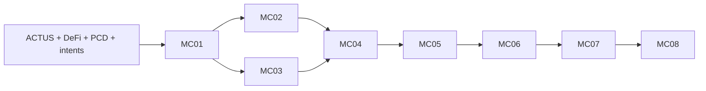

# Moriarty target-first completion program

Current review authority: [latest Fable instruction](../raw/assignments/moriarty-fable-return-2026-09-07.md). Future audits use exact Fable 5.1 at medium effort and fresh GPT-6; historical Fable receipts retain their original scope.

Status: S2, specified-only. The plan files do not establish an active execution loop.
Authority: [user request](../raw/assignments/moriarty-completion-loop-2026-09-07.md).
Machine register: [moriarty-completion-program.json](moriarty-completion-program.json).
Execution and review receipts: [program evidence](../evidence/moriarty-completion-program-2026-09-07/).

## Report reconciliation

The [three-report reconciliation](REPORT-RECONCILIATION-2026-09-07.md) defines RP01 financial/intent challenges, RP02 complete native/ledger feasibility, and RP03 current campaign admission. Its review status is recorded in the machine register. These are early conditions inside MC01-MC08, not new completion packages or evidence of runtime enforcement. Preserve all original acceptance obligations.

## Intended result and current foundation

Developers will author bounded financial contracts, inspect outcomes, sign authority, prove transitions, and submit them on Preview.
Acceptance must enforce contract properties, intent refinement, transition validity, and compliant predecessor history.
Every guarantee names its assumptions, supported profile, complete effects, and finite bounds.
Turing incompleteness establishes neither financial correctness nor practical proof feasibility by itself.

The retained local evaluator supports loan and swap examples with local outcome authorization.
Its nonce history is not durable, and its mandatory native proofs remain unavailable.
[Preview evidence](../evidence/midnight-preview-2026-09-07/README.md) records a finalized deployment, call, and exact message readback.
It does not record a financial transfer comparison or Moriarty PCD acceptance.
[Native R3 evidence](../evidence/moriarty-native-ivc-r3-2026-09-07/README.md) records row exhaustion at k17.
No recursive proof exists at that boundary.
The target study inventories ACTUS and DeFi; inventory is not full conformance.

## Work packages and checklist mapping

Each link contains a proposal, design, unchecked tasks, and normative acceptance scenarios.
Implementation paths and verification commands are planned entry points unless retained evidence says otherwise.

| Package | Reviewable outcome | Dependencies | Requested gap |
|---|---|---|---|
| [MC01](changes/mc01-bounded-language/README.md) | Grammar, typing, bounded semantics, canonical encoding, initial Compact lowering | Existing target study | DSL definition |
| [MC02](changes/mc02-preview-financial-operation/README.md) | Real loan and swap transfers; complete finalized effects match independent expectations | MC01 | Preview financial operation |
| [MC03](changes/mc03-native-recursive-proof/README.md) | Reviewed encoding; two recursive financial steps; independent retained-proof verification | MC01 | Native recursion |
| [MC04](changes/mc04-ledger-correspondence-and-consumption/README.md) | Proof/ledger compatibility, compiler correspondence, durable authority and consumption | MC01–MC03 | Correspondence and replay protection |
| [MC05](changes/mc05-mandatory-claim-acceptance/README.md) | All four mandatory claims enforced in actual acceptance | MC03, MC04 | Mandatory proof acceptance |
| [MC06](changes/mc06-private-handoff-and-composition/README.md) | Separate-party witness handoff; valid private split/join and residual obligations | MC05 | Handoff and composition |
| [MC07](changes/mc07-complete-financial-conformance/README.md) | Full ACTUS/DeFi and held-out behavioral coverage | MC01, MC04–MC06 | Financial conformance |
| [MC08](changes/mc08-release-evidence-and-developer-flow/README.md) | Reproducible developer workflow and independently audited completion dossier | MC01–MC07 | Combined acceptance |

The machine register contains every direct dependency; the diagram shows the main path.
Read-only compatibility inspection and conformance source-gap resolution can begin alongside MC01.
Package dependencies gate accepted implementation, not independent source inspection.
Inspect the native-to-ledger verifier interface before spending on a production adapter.
If no compatible interface exists, record the exact missing boundary and stop that adapter.
Do not replace it with a host-computed verification bit.

## Design decisions and checkpoints

Use the existing unified semantic proposal as the starting point.
Trace Core operations to financial behaviors before freezing the language profile.
Do not turn financial product names into primitive correctness claims.
Freeze the smallest common profile through MC01, then extend it through explicit reviewed versions.
Resolve foundational numeric and lifecycle ambiguities before dependent execution.
Keep unresolved target-specific source questions visible until MC07 resolves them.
Do not let an MC01 freeze exclude a required later target.

This sequence supplies early developer and financial feedback while preserving explicit proof gates.
A backend-first rewrite would postpone the target and authoring decisions that caused the prior detour.
A single full-corpus implementation would delay evidence about proof and ledger feasibility.
The selected sequence uses bounded slices, then requires full coverage before completion.

MC02 transactions are integration experiments until MC05 completes mandatory acceptance.
MC03 proves the retained financial episode under its fixed authority assumptions.
MC04 and MC05 must extend that evidence to actual authorization and ledger acceptance.
MC06 must prove its additional split/join relations; the MC03 proof cannot substitute for them.
Each extension requires a reviewed relation, valid feasible examples, and meaningful rejection controls.

Formal outputs use pinned Lean toolchains and dependencies where the package specifies Lean.
Name every theorem, input domain, assumption, and connection to executable code.
Reject `sorry`, `admit`, unchecked axioms, and assumed compiler or verifier correctness as correspondence evidence.
Record the theorem axiom audit and the remaining trusted computing base.
A successful Lean build alone does not establish the requested correspondence.

## Cross-package ownership and acceptance lineage

MC05, MC06, and MC07 own the following explicit upstream extension paths when their new predicates require changes:

- `experiments/moriarty-language/spec/grammar.ebnf`.
- `experiments/moriarty-language/spec/numeric-profile.json`.
- `experiments/moriarty-language/spec/semantics.md`.
- `experiments/moriarty-language/spec/bounds.json`.
- `experiments/moriarty-language/src/ast.ts`.
- `experiments/moriarty-language/src/parser.ts`.
- `experiments/moriarty-language/src/typecheck.ts`.
- `experiments/moriarty-language/src/elaborate.ts`.
- `experiments/moriarty-language/src/evaluate.ts`.
- `experiments/moriarty-language/src/codec.ts`.
- `experiments/moriarty-language/src/lower-compact.ts`.
- `experiments/moriarty-language/tests/frontend.test.mjs`.
- `experiments/moriarty-language/tests/semantics.test.mjs`.
- `experiments/moriarty-ledger-adapter/correspondence-spec.md`.
- `experiments/moriarty-ledger-adapter/formal/Correspondence.lean`.
- `experiments/moriarty-ledger-adapter/contracts/acceptance.compact`.
- `experiments/moriarty-ledger-adapter/src/adapter.ts`.
- `experiments/moriarty-ledger-adapter/src/consumption.ts`.
- `experiments/moriarty-ledger-adapter/src/effect-projection.ts`.
- `experiments/moriarty-ledger-adapter/tests/adapter.test.mjs`.
- `experiments/moriarty-ledger-adapter/tests/recovery.test.mjs`.
- `experiments/moriarty-acceptance/claim-policy.json`.
- `experiments/moriarty-acceptance/src/accept.ts`.
- `experiments/moriarty-acceptance/src/verify-intent.ts`.
- `experiments/moriarty-acceptance/src/certificates.ts`.
- `experiments/moriarty-acceptance/contracts/mandatory-claims.compact`.
- `experiments/moriarty-acceptance/formal/ContractProperties.lean`.
- `experiments/moriarty-acceptance/formal/IntentRefinement.lean`.
- `experiments/moriarty-acceptance/tests/acceptance.test.mjs`.

Freeze the exact changed subset in each worker brief; serialize writers of shared paths.
Keep retained native campaign sources immutable; new relation sources belong to the current package's `proof/` directory.
Requalification means extending implementation and theorem domains when semantics change, then reproving affected theorems and rerunning affected tests.
Rerunning unchanged checks suffices only when a reviewed impact analysis proves that their supported domain and bindings are unchanged.
Require both audits for changed source-to-Core, proof, complete-effect, consumption, and mandatory-acceptance predicates.
Record changed predicates as pending requalification until those gates pass; historical acceptance retains its original candidate scope.
MC07 explicitly owns compiler and acceptance extensions required by every target row; it cannot close by editing only its runner.

The deployed acceptance entry point is `experiments/moriarty-ledger-adapter/contracts/acceptance.compact` throughout MC04–MC07.
MC02 `financial.compact` is a separate uncertified integration probe and grants no mandatory-acceptance evidence.
MC05 `mandatory-claims.compact` is a library integrated into that acceptance entry point, not an alternative bypass contract.
Use lineage versions `adapter-profile-01`, `mandatory-claims-01`, `composition-01`, and `financial-coverage-01`.
Each manifest binds the deployed contract address, code hash, verifier/VK, policy, semantic version, and active entry points.
Re-run durable consumption, replay, complete-effect, and mandatory-claim predicates against every changed deployed version.
A replacement deployment must either authenticate consumption-state migration or reject every prior-version authorization under a fresh domain.
No upgrade may reset a live instance's lifecycle or make previously consumed predecessors spendable.
Bind MC06/MC07 acceptance evidence to this exact lineage; independently deployed demonstration contracts cannot substitute.

## Execution algorithm

Use a new Codex runtime goal bound to this charter and the machine register.
Never resume or falsely complete the superseded A4/A5 runtime goal.
A manifest, checkpoint, shell background process, or task list cannot establish that the runtime loop is armed.
Record the actual goal creation result and runtime state before reporting arming.

1. Recover the latest user authority and checkpoint.
2. Verify the register, candidate digests, remaining limits, and prerequisite evidence.
3. Select the first eligible unchecked task in dependency order.
4. Create an isolated implementation worktree from the accepted candidate.
5. Freeze its five-part brief, exact commands, owned paths, and terminal predicates.
6. Verify the existing Foreman runtime and required worker readiness.
7. Create the immutable external Endstop contract before the first actionful worker dispatch.
8. Dispatch through the contract-bound queue with durable process ownership.
9. Add failing behavioral tests before implementation changes.
10. Run the package checks and retain failures with actual resource receipts.
11. Request independent Fable 5.1 at medium effort and GPT-6 result audits of the frozen candidate.
12. Correct blocking findings within the existing contract limits.
13. Recheck affected predicates and obtain updated candidate-bound verdicts.
14. Admit only the owned, tested, audited candidate through the repository gate.
15. Update task status, evidence, source links, and the typed checkpoint.

The latest user request authorizes this sequence without another generic design-confirmation round.
It does not override a failed acceptance gate or authorize unlimited retries.
Prefer the configured cross-vendor worker after readiness succeeds.
The user-required Fable 5.1 at medium effort and GPT-6 audits replace the default auditor pairing for these packages.
No author may approve their own result.
If the worker route fails, retain that failure and disclose any proposed route substitution.
Do not repair Foreman as a side task.

Allowed package states are `specified-only`, `ready`, `working`, `pending-audit`, `resource-stopped`, `interface-blocked`, and `complete`.
Only recomputed acceptance and both substantive audits permit `complete`.
Independent source inspection can continue when an implementation dependency is blocked.
Stop dependent dispatch when a required audit or runtime interface is unavailable.

## Resource and terminal contract

These are ceilings, not spending targets or automatic evidence of feasibility.
Freeze concrete commands and smaller task limits before dispatch.
The external Endstop contract must enforce cumulative counters across restarts and worktrees.
Use one heavy build, proof, or conformance process group at a time.
Keep memory usage within available host capacity, even below these ceilings.

### Reservations and dispatch accounting

The following protected reservations sum to the 480-minute master ceiling and 24 worker dispatches.
Minutes include worker, verification, correction, pre-launch review, result review, native, and public-submission subprocess time.
The planning-audit bank covers the current independent plan reviews and their corrections before implementation.
Charge measured elapsed time when available; otherwise charge the review's full ten-minute bound conservatively.
Persist those debits before the first worker dispatch; unavailable historical timing never counts as zero.

| Reservation | Cumulative minutes | Worker dispatches | Preview submissions | Gross tNIGHT debit |
|---|---:|---:|---:|---:|
| Program planning audits | 60 | 0 | 0 | 0 |
| MC01 | 50 | 4 | 0 | 0 |
| MC02 | 35 | 2 | 6 | 200 |
| MC03 | 50 | 3 | 0 | 0 |
| MC04 | 50 | 3 | 6 | 200 |
| MC05 | 50 | 3 | 6 | 200 |
| MC06 | 50 | 3 | 4 | 200 |
| MC07 | 110 | 4 | 2 | 200 |
| MC08 | 25 | 2 | 0 | 0 |
| Total | 480 | 24 | 24 | 1000 |

Individual command and native-campaign ceilings below are maxima, not guaranteed reservations of their entire maximum runtime.
Effective permission is the minimum of command, campaign, package, and master remaining limits.
Reserve two ten-minute result-review slots before authorizing a package's first implementation round.
Pre-launch review and correction costs also consume that package's reservation; they cannot borrow another package's protected funds.
Freeze a command's smaller runtime bound only after a reviewed estimate supports it.
Refuse dispatch when its bound and remaining mandatory gate reserves cannot fit; do not launch hoping it finishes early.
Use one worker dispatch for a frozen bundle of adjacent tasks sharing ownership, prerequisites, and a terminal gate.
Numbered task groups are not one-dispatch requirements; each bundled task still needs its own required tests and evidence.
Do not combine dependent pre-launch review and native execution in one ungated bundle.
Interrupted or corrected worker dispatches still consume the package's dispatch allowance.
A new profile cannot reset counters or borrow another package's allocation.
The original envelope is historical. The later delegated execution instruction authorizes revised bounded allocations without repeated permission; retain a reviewed resource decision and every prior charge before reallocation.

The initial expected planning frontier is the MC01 profile decision and early verifier/encoding feasibility evidence.
No measured estimate yet establishes full MC01 implementation, MC04 compatibility, or MC07 completion within these reservations.
Keep all eight packages in scope; report the actual reached frontier when a protected reservation stops progress.
The ledger, proof, and complete-conformance requirements remain open beyond that frontier, never silently reduced.

| Scope | Initial ceiling | Terminal condition |
|---|---|---|
| Program actionful subprocess work | 8 cumulative hours; 24 worker dispatches | Either ceiling stops new actionful dispatch |
| One worker round | 30 minutes; 8 GiB process group; 2 CPU jobs | Timeout, memory breach, or failed terminal predicate |
| One task | Initial candidate plus at most 2 justified corrections | Third failed candidate stops the task |
| One substantive audit | 10 minutes; 1 initial review plus at most 2 correction reviews per reviewer and task | Unavailable identity, timeout, exhausted credit, or exhausted rounds |
| Native revision-01 preflight | 10 cumulative minutes; 8 GiB; 2 CPU jobs; no proving | First failed encoding or fit predicate |
| Native revision-01 proving | 20 cumulative minutes; 8 GiB; 2 CPU jobs; k at most 17; 256 MiB retained outputs | First synthesis, proof, control, time, memory, or output failure |
| MC03 revision-01 positive campaign | One campaign containing exactly two original R2 loan transitions | No restart after a failed campaign |
| Public financial cases | At most 2 submissions per case; 20 minutes per attempt | Failed finality/effect gate stops that attempt |
| Program Preview submissions | At most 24 submissions, including deploys and failed submissions | No attempt-counter reset across packages |
| Test assets | At most 1,000 tNIGHT total gross external debit; 100 per case | Balance, fee, closure reserve, or denomination check fails |
| Program retained generated evidence | 2 GiB, excluding already retained dependencies/SRS | Stop before the limit; preserve failures |

Count all program worker, verification, correction, and substantive-audit process time in the eight-hour ceiling.
Maintain public-submission and gross-debit counters outside disposable worktrees.
Do not net refunds against gross debit.
Measure DUST separately in its actual units.
Freeze the maximum DUST spend and closure reserve from fresh read-only estimates before each public campaign.
Reject submission if those estimates or required token identities are unavailable.
Use the existing dedicated Preview wallet and externally stored secrets.
Never print seeds, secret snapshots, or private witnesses in tracked evidence.
Use local Docker before public attempts; make no mainnet submission.

Revision-01 is new work explicitly requested after the failed original R3 experiment.
Retain the original resource record and link it as the predecessor.
Both auditors must approve the changed encoding, complete relation, SRS, exact command, and revised contract before native launch.
Plan review alone cannot approve an encoding that has not been implemented and checked.
The k17 ceiling allows a smaller checked encoding; it does not establish that one will fit.
If k17 remains infeasible, record the decision evidence and stop.
A changed k or campaign envelope requires a new bounded proposal, current reviews and a recorded decision under the delegated execution instruction. Preserve prior charges and stop predicates; do not treat the old envelope as proof of feasibility.
Do not hide state in unchecked commitments or spend the original unused budget.

### Allocated native extension campaigns

The two-transition restriction applies only to MC03 revision-01.
This program permits the following extension campaigns within their protected package reservations; MC03 proofs cannot establish their predicates.
Each campaign uses owned `proof/` artifacts listed in its package design and tasks.
Each contract links its predecessor and has separate persistent counters under the common program ceiling.
All campaigns retain k at most 17, 8 GiB process-group memory, and two CPU jobs.
Each allows ten cumulative preflight minutes and 256 MiB retained outputs.
All preflight, proving, and verification time consumes the eight-hour program ceiling.
Each campaign has one frozen positive-case manifest, one bounded execution permission, and no automatic failed-campaign retry.
Both auditors must approve its implemented relation, checked encoding, exact commands, SRS, and contract before launch.
A failure stops that campaign and dependent acceptance without converting earlier proofs into extension evidence.

| Package campaign | New relation and positive evidence | Proving and retained-verification ceiling |
|---|---|---|
| MC04 adapter-profile-01 | Compiled loan and swap transition relations; at most 6 positive transitions; exact ledger verifier and complete effects | 20 cumulative minutes |
| MC05 mandatory-claims-01 | Actual contract, intent, transition, and history claims; dynamic signed authority; at most 8 positive transitions | 20 cumulative minutes |
| MC06 composition-01 | Private successor, split, two branch histories, and join; at most 8 positive transitions | 20 cumulative minutes |
| MC07 financial-coverage-01 | Required extended profiles and row-specific certificates; at most 349 positive episodes across pinned cases | 120 cumulative minutes |

MC04 first probes the retained MC03 proof interface without claiming swap or dynamic-authority correspondence.
MC04 then implements its own loan/swap relation before asserting correspondence for either supported compiled family.
MC05 proves its additional signed-authority and mandatory-claim predicates and requalifies affected MC04 correspondence.
MC06 proves composition predicates and requalifies affected acceptance and correspondence.
MC07 freezes every episode, transition count, and profile bound before dispatch.
Its episode ceiling permits coverage; it does not allow an unbounded number of transitions within one episode.
Freeze independent expected fields and invalid proof/context controls for every extended profile.
Use bounded batches when a campaign exceeds one worker round.
Each batch stays within the 30-minute worker ceiling and consumes the same persistent campaign counters.
Do not restart successful batches or replace required cases to fit the remaining budget.
The 349-episode cap is not the conformance denominator; all 277 ACTUS fixtures and 72 DeFi rows remain mandatory.
If required cases cannot fit, retain resource-stopped status and propose the next bounded decision.
No allocation guarantees circuit fit, ledger compatibility, or completion within its ceiling.

After an external failure, retry only after evidence of an external state change.
Do not poll a credit-limited model or restart an exhausted proof campaign.
Record blockers immediately; apply the runtime's three-consecutive-turn rule before marking a goal `blocked`.
Preserve completed work when a ceiling prevents full completion.

## Independent audit protocol

Required reviewers are exact `claude-fable-5-1` at medium effort and a fresh `gpt-6-astra` agent at high effort under the latest reviewer instruction.
The current request controls these eight packages; it does not close older three-provider Council obligations.
Keep prior Grok, Opus, and GPT review requirements visible in the MC08 crosswalk.

Before each audit, freeze the candidate commit, file manifest, source pins, acceptance predicates, and evidence digests.
Use a cold packet containing the relevant diff and reproducible commands.
Each reviewer works independently and receives no other review verdict before their first assessment.
Retain a structured verdict, severity, exact locators, missing evidence, and residual limitations.
The author cannot act as the independent GPT-6 reviewer.
Record tool-selected GPT-6 identity and the agent identifier; model self-identification is insufficient.

For exact Fable 5.1, use medium effort and the installed bounded tool-free readiness canary from a temporary directory.
Require `modelUsage["claude-fable-5-1"].canonicalModel` to equal `claude-fable-5-1`.
Require the same verified identity in the substantive result receipt.
A canary, alias, authentication status, or empty model usage cannot substitute for a substantive audit.
No alternate model or effort may silently replace the current Fable 5.1 medium route.

Audit grammar, numeric semantics, target traceability, complete effects, proof binding, ledger enforcement, and durable consumption.
Audit private witness boundaries, composition, held-outs, provenance, and resource claims where relevant.
Reviewers must distinguish specified-only predicates from independently recomputed results.
Any unresolved blocking finding prevents acceptance.
Source changes invalidate affected reviews and checks until reviewers bind updated verdicts to the corrected candidate.
Preserve disagreements and rejected approaches with their reasons.

## Cross-package empirical decisions

Complete read-only verifier-interface inspection before any MC03 native proving or MC04 actionful dispatch.
Record source pins and formats in `evidence/moriarty-completion-program-2026-09-07/verifier-interface-intake.json`.
Distinguish a source-compatible interface from an executed positive verifier probe.
If the interface is absent, propose a checked Compact/ZKIR decider wrapper or pinned-version alignment for review.
A local-node alternative cannot discharge the Preview gate; any target change requires explicit user authorization.
Keep native feasibility and target acceptance as separate results; do not replace either with a host verification bit.

Before MC05 relation freeze, specify where signed-intent verification executes and exactly what the native circuit binds.
Compare a target-native signature check with in-circuit verification under the actual pinned verifier interface.
A transaction fee-payer signature does not authorize a different application's financial intent by itself.
The selected path must authenticate the signed intent, domain, principal, nonce, and mandatory claims before effects apply.
Unmeasured signature-circuit cost remains a preflight decision, not an assumption that Ed25519 fits k17.

Before MC06 proving, probe successor continuation from retained artifacts and a two-predecessor join at the pinned interface.
Record `interface-blocked` if either operation lacks a checked realization.
Use separate OS users or containers with separate mounts for Alice and Bob.
Record denied attempts to read predecessor secrets; two directories under one unrestricted user do not establish access isolation.
Inventory every public/private artifact crossing the handoff boundary and its recovery owner.

MC01 must define numeric representation, unit orientation, signed-value extension, intermediate widths, and per-field rounding/comparison policy shape.
Classify calendar/year-fraction and bounded convergence needs before freezing the first profile.
MC07 may fill target-specific rules, but cannot silently reinterpret signed bytes or previously proved arithmetic.
A semantic/profile change invalidates affected signatures, proofs, certificates, theorem instantiations, and audits for the new version.
Unchanged historical artifacts remain valid only for their original pinned statement and domain.
A new profile requires new evidence within the existing campaign allowances; exhaustion stops promotion.

Record semantic conformance, native-proof coverage, local target acceptance, and Preview acceptance as separate columns and denominators.
Semantic coverage still requires all 277 ACTUS fixtures/all present fields and all 72 source-defined DeFi rows.
Proof coverage may use reviewed profile theorems with explicit row-to-domain instantiations and representative real native episodes.
Every required row must map to proved supported predicates, checked certificates, compiler mapping, and local target acceptance before MC07 closes.
A representative episode alone cannot establish a universal profile theorem or leave a required row unsupported.
The 349-episode ceiling is not a requirement to generate one monolithic circuit or one native proof per reference fixture.
Use pinned local-node acceptance for full mutation matrices; freeze a minimal distinct Preview subset within package submission reservations.
Verify matching relevant ledger/proof versions and disclose every local/Preview difference; local evidence cannot close a required Preview check.
Use distinct principals for loan/swap counterparties and wrong-recipient controls, with external private key storage and explicit fixture funding.

DeFi expected traces must be independently derived from each pinned source behavior and reviewed before implementation comparison.
Record the oracle derivation, source pointer, omissions, and full expected fields for every row.
For DS-03, retain the incomplete primary formula and derive ANN initialization from the annuity definition, comparative code, and fixtures.
Require independent mathematical and fixture checks; do not describe the missing primary formula as sourced or complete.

## Completion and broader release scope

Close this program only after MC01–MC08 satisfy their actual predicates and both required result audits.
Require finalized financial effects, real recursion, mandatory acceptance, composition, complete conformance, and correspondence evidence.
Require fresh-checkout deterministic re-execution of parser, semantics, theorem, and conformance checks.
Separately re-verify retained native proof bytes and canonical chain receipts without rerunning consumed campaigns or public submissions.
Pin SRS acquisition and verify its digest before retained-proof verification; never assume an untracked SRS is present.
Require a developer demonstration using the accepted implementation and explicitly distinguish retained evidence from fresh transactions.
Do not substitute checkboxes, model approval, mock proofs, or expended resources for those results.

MC08 maps all seven requested gaps and legacy G01–G24 requirements.
Unperformed pilots, licensing work, baselines, or additional release assurances remain explicit release blockers.
Completing these seven gaps does not automatically establish production release readiness.
The final report must state the proved scope and every broader remaining blocker.
