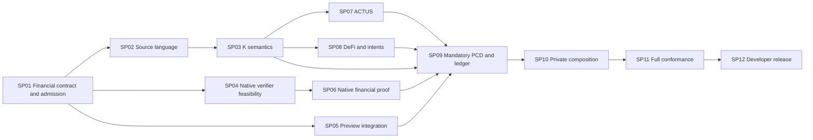

# Moriarty completion sprints

Status: S2, specified-only. These delivery plans implement the [user's sprint request](../../raw/assignments/moriarty-sprint-planning-2026-09-07.md). They schedule the existing [MC01-MC08 contracts](../MORIARTY-COMPLETION-PROGRAM.md), [RP01-RP03 gates](../REPORT-RECONCILIATION-2026-09-07.md) and [language design amendment](../DEFI-LANGUAGE-DESIGN-2026-09-07.md). Package acceptance remains in the [program register](../moriarty-completion-program.json). [sprints.json](sprints.json) is navigation, not a second acceptance authority.

Moriarty is a bounded financial language for Midnight. Completion means a developer can author an agreement, inspect its effects, sign an intent, prove compliant execution and settle it with mandatory proof verification. The program must cover the required ACTUS and DeFi behavior, including private continuation and composition.

## Latest refinement

Read the [report-informed refinement](../ROADMAP-REFINEMENT-2026-09-09.md) before selecting work. Its additive lesson/case and exact legacy-gate maps preserve existing identities. Completed atomic subgates remain accepted; unchecked sprint boxes describe the remaining full scope. Routine authorized local edits/checks reuse existing task contracts. Campaign admissions remain mandatory for resource-controlled proof, native and public-network execution; planning creates no new runtime grant.

## Delivery sequence

Sprints are deliverable boundaries, not promised calendar durations. Capacity and proving cost are not established. Each sprint closes on evidence; an unfinished required task carries forward with the same identity. The resource envelope is allocated separately before execution.

| Sprint | Developer or engineering deliverable | Full-completion dependencies | Package owners |
| --- | --- | --- | --- |
| [SP01: Financial contract and execution admission](sp01-financial-contract-and-execution-admission.md) | Reviewed financial contract and current admission records | retained repository evidence | MC01, MC03, MC04, MC05, MC06, MC07, MC08 |
| [SP02: Complete .mori authoring frontend](sp02-complete-mori-authoring-frontend.md) | Complete .mori specification, frontend, formatter and checking CLI | SP01 | MC01, MC08 |
| [SP03: Executable bounded semantics in K](sp03-executable-bounded-semantics-in-k.md) | Runnable K semantics, simulation and scoped language proofs | SP02 | MC01, MC04, MC05 |
| [SP04: Complete native verifier component feasibility](sp04-complete-native-verifier-component-feasibility.md) | Complete native verifier feasibility result | SP01 | MC03, MC04 |
| [SP05: Financial integration on Preview](sp05-financial-integration-on-preview.md) | Actual loan and swap settlement comparison | SP01 | MC02, MC04 |
| [SP06: Real recursive financial history](sp06-real-recursive-financial-history.md) | Real retained recursive financial proof | SP01, SP04 | MC03 |
| [SP07: ACTUS obligations and lifecycle semantics](sp07-actus-obligations-and-lifecycle-semantics.md) | ACTUS event and obligation implementation | SP03 | MC01, MC07 |
| [SP08: DeFi actions and outcome intents](sp08-defi-actions-and-outcome-intents.md) | DeFi action libraries and intent/request lifecycles | SP03 | MC01, MC05, MC07, MC08 |
| [SP09: Mandatory PCD and ledger correspondence](sp09-mandatory-pcd-and-ledger-correspondence.md) | General mandatory PCD, authorization and ledger correspondence | SP03, SP05, SP06, SP07, SP08 | MC01, MC04, MC05 |
| [SP10: Private handoff and bounded composition](sp10-private-handoff-and-bounded-composition.md) | Independent private continuation and split/join | SP09 | MC06 |
| [SP11: Full financial and formal conformance](sp11-full-financial-and-formal-conformance.md) | Complete financial and formal qualification | SP07, SP08, SP10 | MC01, MC04, MC05, MC06, MC07 |
| [SP12: Developer release and reproducible evidence](sp12-developer-release-and-reproducible-evidence.md) | Reproducible developer release | SP11 | MC08 |

The diagram summarizes completion relationships and omits transitive dependencies. It does not decide task entry. Accepted stage/profile and campaign records remain authoritative. SP01.1/1.8 atomic work, SP01.6/1.7 subset gates, SP01.2/1.3 full design and SP01.4 F0 close independently. SP02 needs full RP01 design; SP04 needs F0 go; SP05 needs atomic acceptance and RP01-MC02; SP06 needs atomic acceptance, RP01-MC03 and all F1 controls. A blocked F0 task does not block independent source work. SP07/SP08 semantic preparation can precede ledger proof qualification. SP09 may prepare and close atomic F3 after SP05/SP06 while extended language work continues; mandatory promotion requires the complete successor inputs. Parallel preparation never waives a stage prerequisite.

In `sprints.json`, `completionRequires` governs full sprint completion only. Each `entryGates` row lists explicit task IDs, its RP stage, exact prerequisite stages and campaign owners. The validator checks every declared task ID and compares those rows with the authoritative stage graph. A scheduler must use task entry gates, not whole-sprint completion, to select work. Thus SP04/SP05/SP06 do not wait for full RP01, and SP09.1 atomic F3 does not wait for SP07/SP08 financial completion. Successor mandatory promotion still requires their accepted semantic inputs.

This sequence checks the backend early while financial examples shape the language. Completing every library before checking the native interface would postpone a product-critical decision. Building a minimal prover first without financial traces would repeat the target-selection mistake. The selected sequence gives both tracks concrete early outputs and joins them at actual acceptance.

## Successor preparation admission

The program register adds four specified-only stages with null campaign IDs. `successor-frontend` requires reviewed `rp01-full`; `successor-semantics` requires the frontend; `actus-semantics` and `defi-semantics` each require the base successor semantics. Their owners are the corresponding sprint packages. Accepted semantic prerequisites still govern profile promotion. Routine authorized local implementation and lightweight checks use the existing task contract and development plugin; they do not require a new campaign merely to edit files. Resource-controlled K/prover/native work needs the existing RP03 allocation, exact commands and candidate review before dispatch.

These stages permit only their recorded source work, local checks and bounded K claims. They grant no financial native proving or public submission. Required native work still follows F0-F3 and its own campaign admission. Mandatory successor promotion additionally requires `successor-semantics`, `actus-semantics` and `defi-semantics`. This provides an acyclic implementation route while keeping later proof/ledger qualification separate. No original completed status, campaign ID or historical charge changes through the planning amendment.

Before native writers start, SP01.5 closes `native-path-freeze` after F0 go. This records one MC03 successor namespace and MC03-export/MC04-outer-port ownership. It is a hard prerequisite of F0a and F2. F0a implements and reviews actual command bytes before F1; the earlier ownership record cannot claim uncreated commands are executable. F0 no-go is recorded as blocked, never complete.

## Shared artifact contract

Every sprint consumes exact versioned artifacts rather than unqualified package status:

- `ProfileRef`: schema version, semantic version, exact registered bounds bytes/hash and source/Core hashes.
- `ChallengeCase`: stable source/fixture/action IDs, initial state, action, authority, observations, read/write footprint, independent complete expected result, invalid mutation, assumptions and closure owner.
- `PreparedTransition`: profile/program/instance/predecessor references, authorization digest, authenticated observations, candidate next state, ordered effects, residual duties/authority and remaining work. Preparation alone grants no acceptance.
- `AcceptanceReceipt`: exact statement/proof/verifier/key/SRS identities, mandatory claim results, durable consumption and complete ledger projection. Public evidence adds transaction bytes, canonical finalized block and readback.
- `ClaimRecord`: judgment, domain, assumptions, semantic/profile hash, mechanized proof artifact or explicit open status. Tests and reviewers cannot be substituted for a theorem.

SP01 defines the machine schemas and canonical encoding for these semantic records. SP02 implements the frontend bindings; SP03 defines their K observation projection. SP04 resolves concrete native byte interfaces from pinned sources. SP09 freezes the acceptance encoding. An existing API's TypeScript type names are not silently changed to these planning record names.

Use immutable `pre`, a single staged `next` write per field, no `next` reads and post-state only in the permitted `ensures` suffix for the proposed successor. Final syntax requires SP01/SP02 review. Preserve the existing sequential atomic profile separately. Every new type or effect must cite a required financial behavior or developer operation.

## Executable task admission

These are sprint delivery contracts. They do not pretend to contain the implementation of an unresolved language or cryptographic interface. Each task first produces `openspec/sprints/execution/SPxx.md` using Superpowers writing-plans. The executable packet must contain:

1. Exact accepted input hashes, owned files and consumed/produced signatures.
2. Concrete independent test inputs and expected results, including a distinguishing rejection case.
3. A failing test run before behavioral code changes, followed by complete implementation steps and rerun commands.
4. Existing tool versions, real entry points, environment requirements and a reviewed resource ceiling.
5. A candidate-specific review scope and the exact MC requirement/stage it can close.

Split large economic families into independently reviewable task packets within the sprint. Keep the original target identities and all acceptance obligations. Do not dispatch an outline as if it were a frozen implementation plan. The SP01 recovery task starts with existing build/test commands and produces the first evidence-bound packet; it must inspect before prescribing an input-boundary fix.

## Syntax specification standard

The [user clarification](../../raw/assignments/moriarty-sprint-syntax-2026-09-07.md) makes this an explicit sprint requirement.

BNF (Backus-Naur Form) describes a context-free grammar through production rules. Moriarty uses its EBNF variant, with repetition and optionality notation specified by ISO/IEC 14977. ABNF, defined by RFC 5234, is the protocol-oriented BNF variant; document its relationship to BNF/EBNF without treating it as Moriarty's selected source grammar notation.

SP02 publishes a complete `spec/successor/grammar.ebnf` and a separate `spec/successor/lexical.md` under `experiments/moriarty-language/`. Lexical structure uses explicit regular expressions or a small lexical grammar for identifiers, literals, comments, whitespace and escapes. Lexical rules also specify encoding, token boundaries and source locations. Typing/scoping judgments and K execution rules remain separate specification layers.

Acceptance requires a grammar production for every source construct, defined lexical tokens, checked precedence and representative valid/invalid parser agreement. EBNF notation must be checked against ISO/IEC 14977; calling a grammar EBNF is insufficient. BNF-family notation does not decide whether the surface syntax uses braces, Lisp forms or indentation.

References already selected in the language dossier: [ISO/IEC 14977](https://www.iso.org/standard/26153.html) and [RFC 5234](https://datatracker.ietf.org/doc/html/rfc5234).

## Formal verification contract

K is the primary executable semantics of Moriarty Core. SP03 normally creates `experiments/moriarty-language/formal/k/run.py` with `compile`, `traces --all` and `prove --claims PATH` commands. These are planned entry points, not currently installed commands. SP09.1 owns early atomic K/correspondence and bootstraps the same pinned runner if SP03 has not yet created it. It does not wait for the successor frontend or full financial corpus. Serialize shared toolchain writers. Its claim manifest separates language metatheorems, contract properties and correspondence judgments. A successful compile or finite test set cannot discharge all three.

For MC04-MC06, the planned `formal/claims.json` in each package identifies that package's required theorem domains and proof dependencies. The K wrapper must reject unknown, missing or unproved required claims. SP09 owns MC04/MC05 manifests; SP10 owns MC06. SP11 requalifies all changed domains. Existing planned `lake ... build` entries are replaced by this explicit claim verification contract. Historical Lean/K results remain untouched. If a correspondence proof needs a supporting proof assistant, record the justified bridge and its trusted dependencies in the executable packet; this does not replace K operational semantics or count an unproved bridge as complete.

No theorem promises oracle truth, future liquidity, witness availability or solver optimality. Turing incompleteness requires a decreasing finite lifecycle measure and bounded per-step work, values, collections, schedules and predecessor fan-in. It does not prove economic correctness or feasible circuit cost by itself.

## Resource, review and stop rules

These plans allocate no new runtime budget and arm no loop. Existing worker, audit, proof, submission and gross-spend charges persist. The charter's original eight-hour table is historical; subsequent allocations reside in the live register and amendment ledger. Neither is an estimate for completing twelve sprints. No sprint counter resets it. An exhausted envelope needs a recorded reviewed bounded amendment under delegated authority before dispatch.

RP03 must bind each actionful campaign to actual candidate/profile hashes, frozen existing commands, live counters, protected closure costs and current source/resource reviews. Keep one heavy process active at a time. Preserve the charter's default worker limits unless a reviewed amendment changes them. F0's proposed 30-minute decision ceiling needs an actual allocation. P1/P2/P3 precede F2, and a complete finalizer is mandatory. No automatic k increase follows k17 exhaustion. Required failure, undefined essential interface or a resource ceiling stops the affected campaign.

Use exact `claude-fable-5-1` at medium effort and a fresh `gpt-6-astra` at high effort for independent substantive reviews. Preserve actual model identity, original findings and exact reviewed candidate hashes. A planning approval approves this schedule only. Before completion, review implemented results and their evidence again. Unavailable reviewers leave the affected result pending audit; no silent substitution applies.

If all admissible native routes fail, record the exact interface blocker and stop dependent proving. Continue independent language/source work. Removing mandatory PCD or changing Midnight requires a new product decision from the user; routine implementation/resource choices remain delegated.

## Coverage and completion

[coverage.json](coverage.json) maps every original OpenSpec requirement, each requested outcome and each target family to sprint ownership. MC01-MC08 acceptance, RP stage admission and the final G01-G24 crosswalk remain required. A sprint can produce useful code while its parent package remains incomplete.

All 277 ACTUS fixtures, 18 executable types, 32 taxonomy dispositions, 72 original DeFi rows and DA01-DA24 retain separate identities. The three held-outs, eight intent cases, eight DeFi regression classes and five composition operators have named owners. The twelve additional report products need source acquisition or explicit comparative dispositions before receiving behavior identities. Required source gaps cannot be discarded.

Language completion requires the full lexer/grammar/static contract, implementation, K semantics and required semantic/compiler/acceptance correspondence. Product completion also requires actual native recursion, mandatory ledger PCD, full financial qualification, private composition and the developer workflow. A small supported profile must be described as such. Production deployment, licensing, baselines and other G01-G24 obligations remain explicit where unperformed.

## Plan checks

Run `python3 openspec/sprints/verify.py` and `openspec validate --all --strict`. These check navigation, dependency structure and requirement coverage. They do not execute a sprint or certify language behavior.
