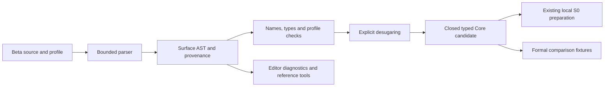

# Language development tools and beta architecture

**Recommendation:** build the first authoring beta in the existing TypeScript frontend, with a new explicit source profile, a typed surface AST, preserved source provenance, deterministic elaboration and shared diagnostics. Keep the callable S0 transfer/repayment boundary visible. Treat Langium as the leading candidate for a later authoring workbench trial if symbols, references and completion need more infrastructure. Tool selection is provisional until the requested language reviews and a measured trial; no framework or production scaffolding was implemented by this research.

This recommendation optimizes the upcoming developer demonstration: author a readable agreement, check it, inspect what it lowers to, simulate a supported local operation, and get a precise failure for unsupported execution. It does not advance signature, native proof, authenticated state or ledger acceptance by choosing a parser library.

## Evidence and acquisition scope

**Repository observations:** checkout baseline `870f998b36ecda04622fa4274132e74902942d0b`. Startup loaded `moriarty-dev:develop` and inspected guarded `status --json`; no pending transactions. Loan/swap dispatch was blocked by stale inputs and absent accounting/live-resource evidence. This read-only research did not dispatch that campaign. `wiki/index.md` was queried before acquisition. No `graphify-out/graph.json` exists in this worktree; no graph was fabricated or rebuilt for this review.

**Source facts:** five fresh official documentation captures, one additional META round, all HTTP 200. [meta-sources.json](../meta-sources.json) records retrieval times, payload/content hashes, receipt paths, local observations and limits. Capture used the existing public-document `capture.py` and Scrapling 0.4.15 with scoped selectors. Some selectors match nested containers, so the extracted text repeats sections; counts are not independent evidence. The original response bytes remain intact. Robots checks permitted the two targets with a 200 robots response; the other three returned 404. This does not establish license or training rights. Public reference only; no login, access-control bypass, private source egress or cookie retention. No new site-pattern class or cookie storage was needed.

| ID | Official source and inspected scope | What it supports |
| --- | --- | --- |
| META-01 | [Langium grammar language](https://langium.org/docs/reference/grammar-language/), language declaration, terminals, parser rules, cross references and expression rewriting | Grammar produces typed AST structure; Chevrotain underlies parsing; ordered terminal matching and LL(k)/left-recursion constraints matter. |
| META-02 | [Xtext runtime concepts](https://eclipse.dev/Xtext/documentation/303_runtime_concepts.html), validation, linking, generation, serialization and testing | Syntax, references and custom semantic validation are separate; JVM/EMF resources and generated models carry integration cost. |
| META-03 | [Tree-sitter introduction](https://tree-sitter.github.io/tree-sitter/index.html), introduction and bindings | Incremental CST updates and useful results on erroneous input are design goals; C11 runtime and Node/Wasm bindings exist. Performance goals are not Moriarty measurements. |
| META-04 | [Chevrotain CST](https://chevrotain.io/docs/guide/concrete_syntax_tree.html), locations, fault tolerance, visitors and TypeScript signatures | CST construction can separate grammar from semantic actions; node locations need configuration; recovered nodes may omit children. |
| META-05 | [MLIR Toy chapter 2](https://mlir.llvm.org/docs/Tutorials/Toy/Ch-2/), IR structure, locations, declarative definitions and round trip | Operations retain mandatory locations and transformations must attach locations; useful design precedent for provenance, without adopting MLIR. |

**Discovery evidence, not retained full captures:** official [Langium homepage](https://langium.org/) describes TypeScript/Node and LSP support; official [Tree-sitter test guide](https://tree-sitter.github.io/tree-sitter/creating-parsers/5-writing-tests.html) describes input/tree corpus fixtures. Official search excerpts were inspected within discovery; detailed API/version claims from these pages remain outside the retained source set. Xtext runtime documentation links its LSP support chapter, whose implementation details were not inspected. ANTLR's current generation/runtime behavior, release activity, exact dependency graphs, licenses and security advisories were not investigated. No claim about tool popularity or benchmark superiority is made.

## Current architecture and constraints

**Repository observations:** [package.json](../../../experiments/moriarty-language/package.json) declares an experimental private ESM package with Node tests and TypeScript checks. Its [lockfile](../../../experiments/moriarty-language/package-lock.json) contains no installed package dependencies. [tsconfig.json](../../../experiments/moriarty-language/tsconfig.json) uses strict NodeNext checking and `noEmit`; `npm run build` currently checks types rather than creating a distributable. A global compiler/runtime may still be required; an empty lockfile is not a reproducible developer installation.

The [original parser](../../../experiments/moriarty-language/src/parser.ts) and [successor frontend](../../../experiments/moriarty-language/src/successor/frontend.ts) are handwritten, with profile-specific entries, explicit bounds and AST spans. The successor exposes syntax/expression/agreement versions `/1`–`/5`. They are historical compatibility surfaces, not evidence that the new MIL/4 proposal is implemented. The [isolated Source/6 parser](../../../experiments/moriarty-language/src/successor/financial-agreement-source-v6-frontend.ts) handles a closed, fixed-order S0 presentation. Tokens contain UTF-8 byte boundaries and errors contain byte offsets, but `Source6Ast` does not attach per-node spans or preserve comment trivia. AST/node/depth counters and lexical limits are explicit. Its public wrapper [prepareSource6S0Unqualified](../../../experiments/moriarty-language/src/successor/mil4-s0-source-v6.ts) returns source rejection, Core rejection or `PreparedUnqualified`, never authenticated admission.

The [Source/6 contract](../../../experiments/moriarty-language/spec/successor/financial-agreement-source-v6.md) and [mockup requirements](../../../docs/language/PROGRAMMER-FACING-MOCKUP-REQUIREMENTS-2026-09-30.md) require precise local/specified/open labels. Current local Core preparation leaves agreement identity, selected program, asset scale and authenticated predecessor bindings unverified. A new beta source label must not silently imply Source/6 acceptance or change its formation/error order. Source and intent labels, signed/wire codecs and executable Core profiles are distinct version domains.

The [MIL/4 result](../../../deliverables/mil4-k-quint-sprint1-2026-09-29/RESULT.md) reports bounded K/Quint/TypeScript results; those historical counts were read, not rerun here. The [three-case comparator](../../../experiments/moriarty-language/formal/mil4/alpha-local/RESULT.md) uses explicit injective representation maps and complete state/effect projections. It is not a general source-elaboration theorem. [Quint S0](../../../experiments/moriarty-language/formal/quint/mil4/s0.qnt) stipulates external signature, snapshot, native-qualification and atomic-ledger premises; its integer arithmetic needs explicit finite bounds. [K S0](../../../experiments/moriarty-language/formal/k/mil4/s0.k) defines a typed local relation. Neither tool supplies the external premises.

## Comparison matrix

Cells combine inspected source facts with repository-fit inferences. Costs are qualitative recommendations; no candidate was installed, ported, benchmarked or audited for this review. Incremental build/document validation differs from reuse of a syntax tree across edits.

| Dimension | Current handwritten TS parser | Langium workbench | Xtext workbench | Chevrotain parser toolkit | Tree-sitter generator/runtime |
| --- | --- | --- | --- | --- | --- |
| Adoption cost | Lowest for narrow beta; author AST/diagnostic work remains | Medium: new grammar, generated types, services and adapter | Highest here: JVM/EMF model and TS bridge | Medium: grammar in JS/TS, CST visitor and validation layer | Medium for editor grammar; high if authoritative compiler also needs independent grammar |
| Grammar as data | EBNF exists separately from implementation; drift must be checked | Declarative `.langium` rules and AST generation | Declarative grammar plus generated model/runtime | Grammar DSL and introspection; not a plain EBNF file | Grammar feeds generated parser; compiler AST conversion remains project work |
| Incrementality | Full parse; bounded document allows measuring before optimizing | Document services fit LSP; tree-reuse performance not established here | Incremental build hooks documented; parsing granularity not established | No incremental-tree result established by captured guide | Incremental CST is the central documented capability |
| LSP/editor support | Custom adapter required | Integrated LSP orientation; custom financial checks remain | LSP chapter exists; JVM server/client details uninspected | Project must provide LSP and symbol services | Project must provide semantic/LSP services |
| CST/AST | Typed AST; Source/6 loses node spans/trivia | Generated typed AST; CST details require trial | Semantic EMF model with node-model/serialization machinery | Explicit CST and visitor; generate visitor typings | CST; typed semantic AST/lowering must be added |
| Source positions | Existing UTF-8 byte contract; extend beta provenance | Adapt library coordinates; test exact unit and endpoints | Adapt model coordinates to existing byte contract | Enable location tracking; handle virtual/empty tokens | Byte-oriented editing APIs discovered; binding units must be verified |
| Error recovery | Fail fast today; diagnostics/recovery are project work | Workbench authoring can recover; strict rejection contract must be explicit | Syntax error customization documented; recovery specifics uninspected | Recovered CST can omit children; errors must block lowering | Useful partial CST is a goal; any missing/error form must block strict compilation |
| Semantic validation | Existing elaborators/Core retained | Custom validators still needed; generic linking is not financial validity | Syntax/reference/custom checks are distinct | Separate visitor/checker required | Separate checker required |
| Portability/dependencies | TS/Node baseline; browser imports need audit | Natural TS/Node fit; browser bundle and dependencies need verification | Adds JVM/EMF and build ecosystem; possible headless use | JS/TS fit; pin parser/runtime/tool versions | C11 runtime plus generator and selected Node/Wasm binding |
| Best beta role | Authoritative narrow compiler frontend | Conditional later workbench trial | Exclude from first beta | Fallback if grammar/CST reuse alone becomes necessary | Later highlighting/structural editor support if measured need warrants second grammar |

**Inference:** Langium and Chevrotain are related layers, not independent parser-family evidence. Langium grammar restrictions and hidden terminal behavior can change precedence, keywords, comments and ambiguity handling during migration. No framework should receive financial semantics as inline parser actions; name resolution, type checks, effects and elaboration need inspectable boundaries.

## Recommended beta boundary

**Recommendation:** make a small source pipeline whose observable artifacts explain author intent. The diagram is a proposed architecture, not an implemented path.

Keep framework objects private to an adapter. The compiler should consume its own closed AST with stable nominal types and explicit constructor tags. Public source APIs accept text, select an exact profile and retain input ownership; do not expose arbitrary caller ASTs as proof of valid parsing. An editor may hold recovered syntax and unresolved references for display. Strict lowering requires no lexical, syntactic, semantic, profile or incomplete-node errors, regardless of whether a partial tree exists. Unknown and unsupported constructs receive named results. A recovered parse must never become a success with omitted signed bounds or effects.

Attach provenance to every source AST node and every produced Core node: source identity, exact UTF-8 byte interval `[start,end)`, originating syntax node and desugaring rule/version. A synthetic node records its explicit cause and parent origins. Convert editor positions through an indexed mapping whose encoding is agreed with the client; test non-BMP strings, escapes, CRLF and comments. Library character offsets and inclusive ends must not be copied blindly into byte spans. Preserve original bytes separately from formatter output and canonical semantic images. Formatting cannot silently update the statement a signature or source commitment binds. Mandatory MLIR locations are a useful precedent; requiring that discipline in the TS IR needs no C++ compiler stack.

Prefer one beta grammar authority plus a rule-to-parser/corpus coverage map. Keep EBNF, reserved words, precedence, profiles and bounds machine-readable where practical. Generate reference tables and editor keyword lists from this data only after specifying that data's authority. Do not build a universal grammar compiler or try to generate K, Quint, compiler semantics and financial expectations from one implementation: independent expectations must still detect common mistakes.

## Verification design

**Recommendations; specified-only tests, not newly executed results:**

| Layer | Meaningful checks and oracle |
| --- | --- |
| Syntax corpus | Every grammar rule: smallest positive, boundary and near-miss negative, expected AST and byte ranges. Full eight-family mockups remain proposed status unless their constructs are implemented. Freeze golden outputs after independent review; automatic snapshot updates are not acceptance. |
| Lexical/bounds | ASCII identifier contract, reserved/confusable forms, lone surrogates, JSON string escapes, comments, token/node/depth and input byte limits, longest operator and end-of-file. Bounded failure must not hang or overflow the host stack. |
| Property tests | Generate bounded well-typed ASTs, print/parse and compare semantic structure; formatter idempotence; diagnostics point within the original bytes; elaboration is deterministic. Retain seeds, shrinkers and minimal failures. Round trips exclude intentionally lost trivia only by an explicit projection. |
| Mutation tests | Remove fees, receiver credit, allowances, replay or predecessor; alter identity, quantity/scale, selected action or failure order. Each independent contract violation must reject through the callable source path and publish no financial effects. Syntax-invalid mutations must not be mistaken for semantic coverage. |
| Fuzzing | Bound bytes/time/memory; start with no-crash lexical/parser fuzzing and grammar-aware invalid inputs. Retain corpus additions and command/tool versions. A count of generated cases does not prove completeness. |
| Differential/desugaring | Independent literal expected Core records; supported beta sugar versus its explicit form; old Source/6 versus beta lowering only over a declared common slice. Compare nominal identities, complete pre/post cells, ordered effects, work, replays and first failure. Keep unsupported/version rejection controls. |
| Formal semantics | Replay complete fixtures in actual K and Quint backends under pinned tools, respecting each model's environmental assumptions. Extend the injective comparison map rather than normalizing away missing cells, account roles or order. Witnesses, simulation, exhaustive checking and proofs retain different labels. |

Existing [Source/6 tests](../../../experiments/moriarty-language/tests/mil4-s0-source-v6.test.mjs) already challenge endpoint credit, overflow, scope, selector/version mismatch and rejection precedence. The [README grammar test](../../../experiments/moriarty-language/tests/readme-grammar.test.mjs) detects textual EBNF drift; it does not prove the parser implements that EBNF. Preserve these distinct checks. A desugaring comparison that calls the same lowering twice is not an independent semantic oracle.

**Formal obligations:** each added sugar needs a typed translation and a statement of preserved acceptance/rejection behavior. Expressions need definedness, finite work, checked arithmetic and rounding contracts. Holes require narrowing fills, complete footprints and fixed signed limits. Pending/recovery syntax needs explicit episode/duty semantics and cannot enter the success-only S0 preparer. New constructors need K rules, Quint state/actions/invariants and a shared observation relation before claiming correspondence. Exact signature bytes, native proofs and atomic ledger consumption remain separate open obligations. Framework validation cannot discharge them.

## Reproducibility, packages and measurement

**Recommendations:** pin the Node and TypeScript toolchain, lock dependencies and install from a clean checkout. Record exact package sources and integrity, license compatibility, transitive dependency inventory and advisory review for the selected version. Assess generator/runtime compatibility and install scripts before introducing a toolkit; build generated artifacts in CI or retain them with a deterministic regeneration check. Verify public package exports and CLI behavior from the packed artifact outside the repo, without maintainer campaign metadata. Avoid network imports or arbitrary package execution during compilation. Package identities, source image versions and financial profile IDs must not be conflated. Scan dependencies and release inputs without claiming a scan proves semantic safety.

Measure full parses before choosing incremental parsing. Proposed benchmark corpus: tiny transfer, repayment, maximum accepted document, malformed prefix, comment/string stress and deepest accepted syntax. Retain runtime/tool hashes, cold/warm results, p50/p95 latency, memory, cancellation behavior and diagnostic determinism. For editor use, measure edit-to-diagnostic latency and stale-result suppression on the actual client. For Langium/Tree-sitter, include service/startup costs and coordinate conversion. Vendor speed claims are not evidence for this workload; no thresholds or performance numbers were measured here.

The documentation pipeline should extract syntax/reference data, execute supported examples through real CLI commands, and label full-language proposals consistently. Include a checked source → AST → Core → local outcome trace and a separate status table for proof/authentication/ledger obligations. Preserve specified-only examples in their own corpus with explicit unsupported expectations. A documentation build must not reclassify them as executable because the highlighting grammar recognizes them.

## Staged implementation plan and migration risks

All items below are proposals for the parent design decision, not authorization to claim them implemented.

1. **Design and corpus:** reconcile the eight-family programmer mockups; select a coherent minimum profile; resolve syntax, keywords, precedence, bounds, type names, source commitments and first-failure rules. Review the full candidate in the requested five PL seats. Name changes from Source/6 and the exact local/specified/open boundary.
2. **First executable authoring beta:** implement an isolated beta parser in the current TS package with owned AST/provenance, source diagnostics and a reference CLI. Add deterministic checks/desugaring and the two supported local operations. Unsupported families reject at execution with named codes. Preserve existing Source/5 and Source/6 APIs and tests. Validate the real consumer path and package installation.
3. **First editor demonstration:** derive lexical highlighting, expose shared checker diagnostics through a small LSP adapter, then add symbols/hover/completion only for implemented names/types. Debounce and cancel full parses; guard document versions. Show a real edited file and its source span. Do not require backend proofs to use authoring tools.
4. **Conditional workbench decision:** if the agreed editor features expose a measured bottleneck or repeated symbol/reference infrastructure, run one bounded Langium trial after a separate scope/resource decision. Port one transfer, one repayment, an incomplete edit and a hostile diagnostic to the same owned AST. Assess fidelity, generated output, dependency cost, startup, browser target if required and strict recovery handling. Adopt only if its benefit exceeds the adapter/migration cost; Chevrotain alone is the narrower alternative when only grammar/CST needs drive the decision.
5. **Maturity expansion:** add financial profiles constructor by constructor with independent expectations, formal observations and the applicable proof/kernel/ledger requirements. Add Tree-sitter only when a concrete editor integration requires its incremental CST; cross-check its accepted syntax corpus against the compiler. Expand distribution/LSP targets only from actual demonstrated developer workflows.

| Migration risk | Required disposition |
| --- | --- |
| Framework recovery synthesizes missing signed terms | Parse for editor display; block strict lowering on every lexical/parser error or recovered/missing node. |
| UTF-16/code-point/library offsets alter UTF-8 diagnostics | Central mapping with endpoint/unit checks and Unicode fixtures; preserve original bytes. |
| Generated AST drops source/profile/financial fields | Closed AST adapter with field coverage and independent expected Core records; no permissive generic records. |
| Grammar rewrite changes precedence or keywords | Golden precedence trees, profile-local keyword tests and explicit version decision. |
| Formatter or normalization changes a commitment | Distinguish original source identity from canonical semantic images; preserve image-domain/version rules and tested invariances. |
| Two editor/compiler grammars drift | Prefer one grammar initially; if another is justified, compare shared corpus and require strict compiler authority. |
| Toolkit becomes a public admission prerequisite | Keep authoring dependencies separate from objective proof/ledger validity and maintainer process. |

**Anti-hype exclusions:** no Xtext/JVM migration for this TS beta; no MLIR/LLVM backend adoption merely to obtain source locations; no grammar-generated financial semantics claimed equivalent to K/Quint; no LLM-produced parser or AST treated as trusted; no Tree-sitter highlighting result presented as type checking; no new orchestration framework. Existing tool independence, incomplete formal evidence and measured development cost take precedence over a feature list.

**Open evidence:** actual Langium recovery/CST coordinates and LSP/client/browser behavior; version-pinned package/license/security facts; parser and editor latency; full beta profile and image policy; general elaboration relation; exhaustive Quint checks; proof/authentication/ledger consumer. The memo is source-grounded research and a feasible staged recommendation, not decision-grade empirical validation or a grammar freeze.
