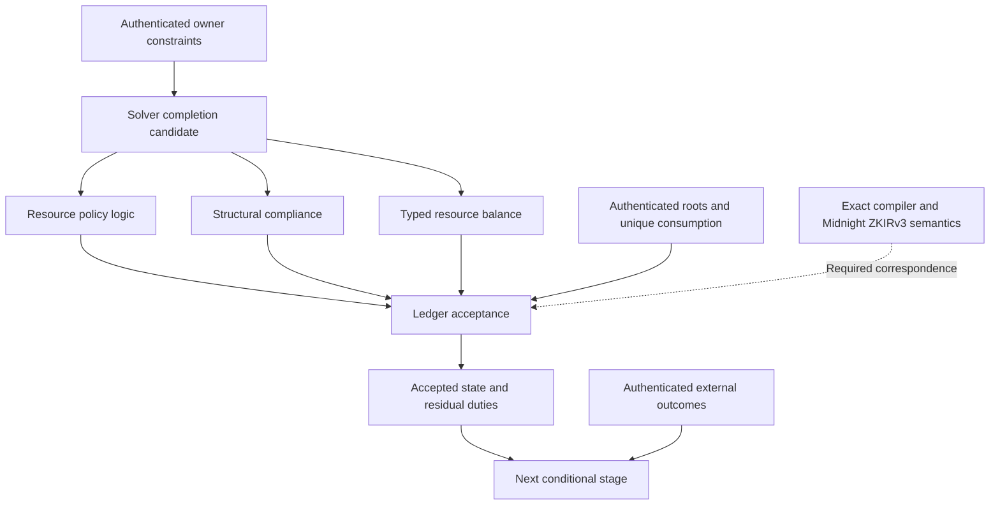

# Anoma architecture and Moriarty correspondence

This conceptual map summarizes the pinned source studies. Its arrows describe the proposed separation of responsibilities; they are not extracted call edges or a proved refinement relation.

In Anoma, resource logic/compliance/balance have concrete proof machinery. Moriarty's residual-duty and exact Midnight correspondence edges are requirements we must establish. A locally atomic adapter cannot establish foreign-chain atomicity. A candidate waiting for composition is not an already committed partial transaction.

The local graph bundle provides a full pinned file-membership graph, supported-language AST graphs, and captured documentation hyperlink graph. File ownership and hyperlinks do not prove semantic dependencies. Haskell/Juvix semantic parsing is incomplete; the language study supplies selected source reading.

[Graph artifacts](../../../deliverables/anoma-study-2026-09-19/graphs/graph.html) · [Evidence](reference.md) · [Index](index.md).

[Supported-code AST browser](../../../deliverables/anoma-study-2026-09-19/graphs/supported-code-ast/index.html) · [Documentation hyperlink browser](../../../deliverables/anoma-study-2026-09-19/graphs/docs-hyperlinks/graph.html). The AST graph has 621 explicitly unresolved placeholder nodes and nine extraction failures; these are coverage limitations, not proven call targets.
