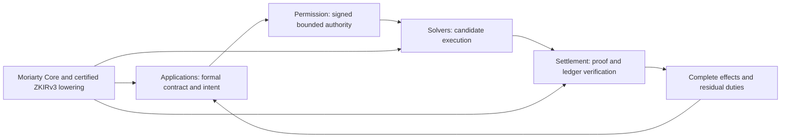

# CAKE APSS and Moriarty

This bank studies Applications, Permission, Solvers and Settlement in CAKE and their relationship to a permissionless language of provable intention for Midnight. The required compilation target is ZKIRv3. It is a bounded primary-literature study, not a systematic review or security certification.

The structure follows [Diátaxis](https://www.diataxis.fr/). Explanation develops understanding; reference supplies precise facts and sources; how-to guides support concrete tasks; tutorials guide learning through explicit examples. Conceptual tutorials do not imply shipped APIs.

## Collections

- [Applications](applications/index.md)

- [Permission](permission/index.md)

- [Settlement](settlement/index.md)

- [Solvers](solvers/index.md)

## Moriarty across the four layers

| APSS layer | Moriarty relationship | Boundary |
|---|---|---|
| Applications | Express and compose DeFi contracts and formal outcomes | Libraries are not a program allowlist |
| Permission | Specify bounded authority, consent, replay and liabilities | Owner authorization, not maintainer permission |
| Solvers | Check independently proposed candidate plans/programs | Search quality is separate from correctness |
| Settlement | Compile to ZKIRv3; bind proofs, ledger phases and complete effects | Native validity and conditional external facts/finality remain explicit |

[Certified basis and jets](certified-basis/index.md) connect source meaning to Midnight execution. [Six-expert consensus](../../../deliverables/aeon-study-2026-09-19/review/FINAL-CONSENSUS.md) records the current architecture decision. [Pre-audit SDK note](sdk-interface-before-audit.md) preserves the superseded managed-service framing.

Coverage: each APSS track contains twelve reference entries; settlement includes an additional linked Kachina paper artifact. Sources shared between tracks do not become independent evidence. PDF rendering is not full reading: exact visual page coverage is recorded with each collection. Diátaxis is an information architecture, not an assurance method.
